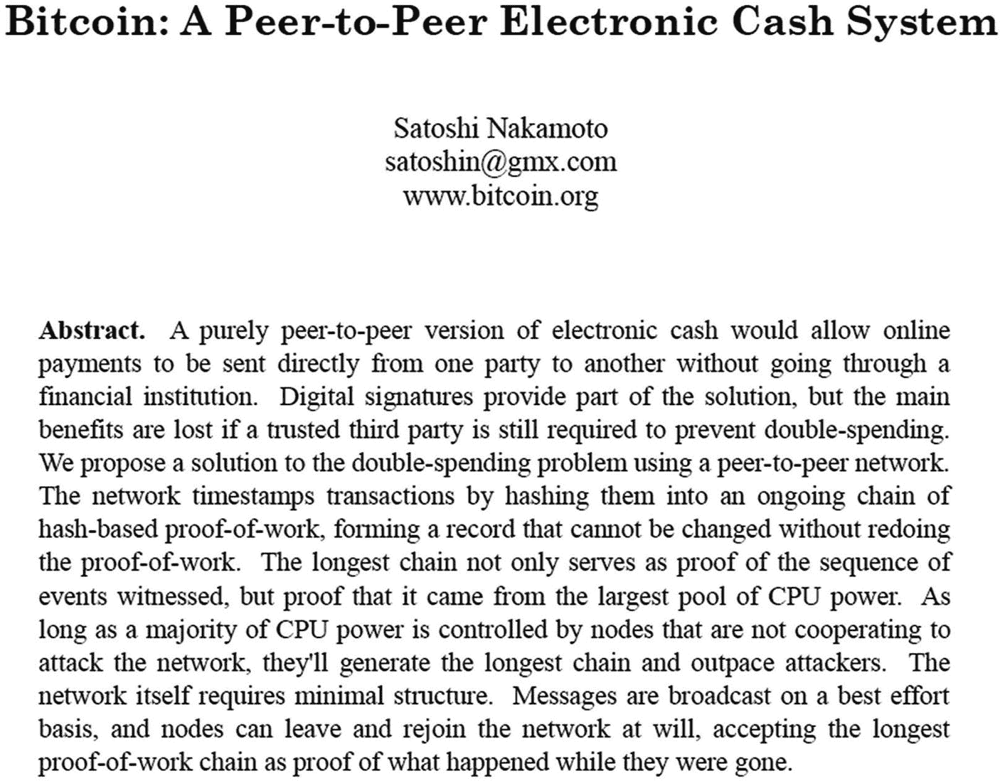
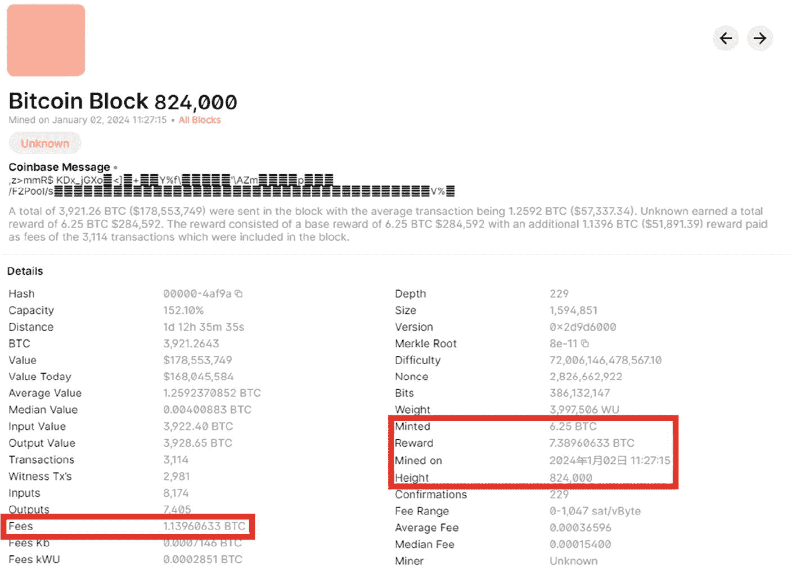
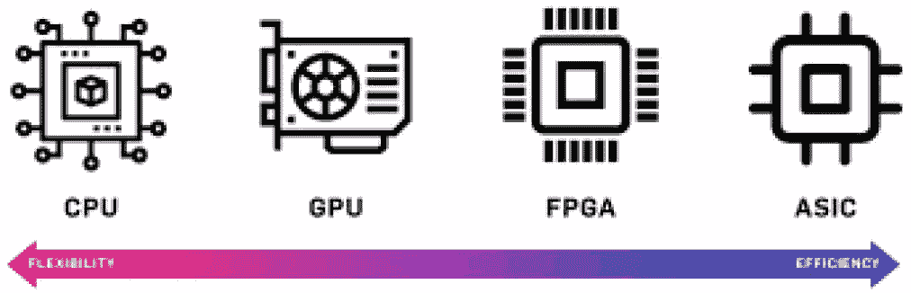
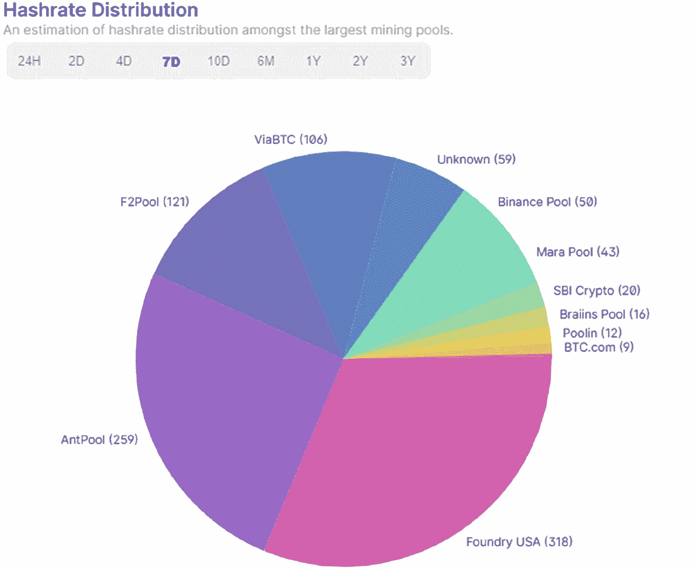
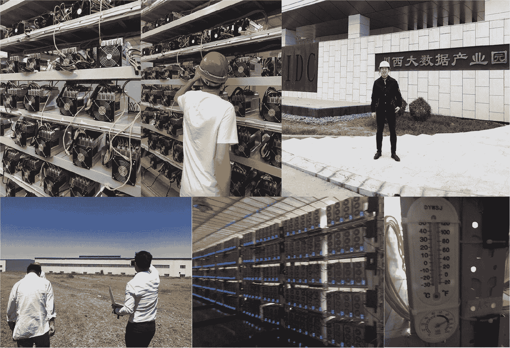
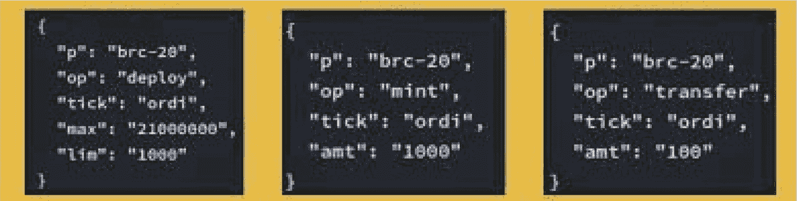

# 比特币：数字货币的先驱

本章追溯了比特币的起源，从中本聪的开创性白皮书到这种加密货币迅速崛起成为传统金融体系的挑战者。通过审视比特币创新的技术基础及其对金融格局的影响，本章为全面理解为何比特币仍然是典型数字货币奠定了基础。

## 2.1 比特币的诞生

在 2008 年全球金融危机（GFC）之后诞生的`比特币`，代表了金融科技的一次根本性转变，它引入了一个挑战既定货币体系的突破性概念。这场始于美国的危机迅速演变为全球性的动荡，削弱了人们对银行体系的信心，并引发了流动性紧缩。金融机构濒临破产边缘，迫使政府进行干预以防止经济全面崩溃。

随着危机的展开，它暴露了传统金融体系中固有的弱点，包括导致经济活动放缓的严重信贷冻结，以及人们对金融机构和银行的普遍信任丧失。这种不信任的环境，以及中心化金融当局的明显局限性，为`比特币`的诞生奠定了基础。¹

### 中本聪与白皮书

`比特币`这一数字世界突破性创新的起源，深深植根于一份名为《`比特币：一种点对点的电子现金系统`》的白皮书中，其截图如图 2-1 所示。这份文件由一位名为`中本聪`的神秘人物或团体于 2008 年 10 月 31 日发布，它介绍了一个将彻底改变金融业的全新概念。



图 2-1 比特币白皮书摘要截图²

这份白皮书提出了一套经过深思熟虑的去中心化数字货币设计方案，这一概念与传统的中心化金融体系截然不同。`中本聪`设想了一个无需金融中介的系统，从而降低了交易成本并提高了效率。

白皮书中概述的核心原则之一是使用一种被称为`区块链`的去中心化账本。这项技术确保所有交易都能被透明且不可篡改地记录，使其无法被篡改并且任何人都可以验证。`区块链`是一个公共账本，由一个节点（计算机）网络维护，每个节点都保存着整个交易历史的副本，从而确保没有单点故障。

`中本聪`引入了矿工的概念，即使用算力处理和验证交易的网络参与者。矿工们竞相解决复杂的密码学难题，最先解决难题的矿工有权将新的交易区块添加到`区块链`上。这个过程被称为`工作量证明（PoW）`，它不仅保障了网络的安全，还通过向矿工发放奖励将新的比特币引入流通。

白皮书还解决了双重支付问题，即同一个数字代币可以被花费多次。通过`区块链`的创新设计，这一问题得到了解决：一旦交易被确认，它就成为不可更改的历史交易记录的一部分，变得不可逆转。

`中本聪`的白皮书不仅仅是一份技术文档；它描绘了一种全新货币形式的愿景——完全去中心化，没有中央权威，任何有互联网接入的人都可以使用。它代表了人们对货币和金融交易理解的范式转变，为随后到来的数字货币新时代和`区块链`技术的多样化应用奠定了基础。

`比特币`的引入是对金融危机的直接回应，旨在减轻系统性失败的风险，并为个人提供完全的财务控制权。这种加密货币采用了创新的密码学方法，展示了对欺诈和入侵的强大抵抗力。这种在金融交易中建立问责制和透明度的新体系，恢复了公众对建立安全透明金融体系可能性的信心。此外，`比特币`瞄准了无银行账户人群，旨在创建一个包容性的金融生态系统。这种方法直接解决了引发全球金融危机的那些问题，为所有人（无论其能否使用传统银行系统）提供了一个更公平、更易获取的金融解决方案。

从本质上讲，`比特币`的诞生不仅是一种新数字货币的出现，更是对既定金融秩序在哲学和实践上的挑战。它代表了向一种无需信任、抗审查的金融体系的迈进，为一个金融独立与安全的新时代铺平了道路。

### 创世区块与第一笔比特币交易

`比特币`的旅程始于 2009 年 1 月 3 日，随着创世区块（也被称为 0 号区块）的诞生而开启。这个由神秘的`中本聪`挖出的区块中包含了一条信息，这条信息批判了现有的金融体系，突显了对去中心化替代方案的迫切需求。该 coinbase 交易中的文字——“`The Times 03/Jan/2009 Chancellor on brink of second bailout for banks`”（《泰晤士报》2009 年 1 月 3 日，财政大臣濒临第二次银行救助的边缘）——已成为`比特币`使命的象征：提供一种摆脱传统银行体系脆弱性的新货币范式。

### 哈尔·芬尼的传奇故事及其对比特币的影响

`哈尔·芬尼`被认为是`比特币`早期发展的关键人物，他不仅是一位著名的密码学家和软件开发人员，也是密码朋克运动中的重要人物。他对密码学的贡献是巨大的；他参与了第一个匿名邮件转发器的开发，并举办比赛来破解`网景`公司使用的出口级加密技术，展现了他对在线隐私和安全的承诺。

在`比特币`诞生之前，`芬尼`于 2004 年创建了第一个可复用的工作量证明系统，这预示着后来成为`比特币`核心部分的一些基础技术。他成为了第一批`比特币`用户之一，并于 2009 年 1 月 12 日从`中本聪`那里收到了第一笔`比特币`交易，这标志着数字货币历史上的一个里程碑时刻。

`芬尼`住在加利福尼亚州天普市，与`多里安·中本聪`在同一小镇居住了十年，这引发了外界猜测他可能是`比特币`的创造者，但他本人一直否认这一说法。尽管身患肌萎缩侧索硬化症（ALS）并最终导致瘫痪，`芬尼`对编程的热情以及对`比特币`的贡献从未减弱。即使在生命的最后几年，他仍在继续开发像“`bcflick`”这样的项目，这是一种旨在增强`比特币`钱包安全性的软件。³

不幸的是，在他生命的最后一年，`芬尼`及其家人成为了“假报警”和勒索企图的受害者，肇事者要求支付 1,000 比特币的赎金。这些事件突显了早期`比特币`采用者所面临的有时动荡和充满风险的境况。

`芬尼`的故事不仅关乎技术创新，也关乎个人的坚韧以及对`比特币`变革潜力的坚定信念。他的早期参与和贡献对塑造该网络的发展至关重要，他的遗产继续激励着加密货币社区。⁴

### 比特币的遗产

`比特币`的创造开启了一个数字货币的新纪元，并为大量的`区块链`应用打开了大门。它为数字信任提供了一种去中心化的解决方案，消除了金融交易中对中介的需求。多年来，`比特币`不仅生存了下来，而且蓬勃发展，其价值和接受度不断提高，并为成千上万种其他加密货币铺平了道路。

`比特币`的起源故事至今仍笼罩在神秘之中，`中本聪`的真实身份仍不为人知。这种匿名性增添了`比特币`神秘的吸引力，这种货币从根本上改变了我们对金钱、价值以及交易方式的认知。

### 比特币技术概览

随着比特币作为数字货币先驱的角色日益凸显，其底层技术融合了创新性与实用性。表 2-1 详细列出了比特币的一些关键技术特性：

**表 2-1** 比特币的特性

| 最小单位——聪 | 比特币可精确到小数点后八位，最小单位称为“聪”，以其神秘创造者的名字命名。一聪相当于 `0.00000001` 比特币。这种高度可分性使比特币适用于小额交易，这是传统货币通常不具备的特性。 |
| --- | --- |
| 兑换方法 | 理解比特币兑换对于交易至关重要。一个比特币相对于传统货币（如美元、欧元等）的价值，由各种加密货币交易所上的市场供需动态决定。由于其波动性，兑换率可能在短时间内大幅波动。 |
| 常用区块浏览器 | 区块浏览器是浏览比特币区块链的重要工具。诸如 `Blockchain.com` 和 `BlockCypher` 之类的网站提供关于单个区块、交易和地址的详细信息。它们对于追踪交易和理解区块链活动来说是不可或缺的。 |
| 比特币钱包 | 要使用比特币，需要有一个数字钱包，其形式多种多样，如桌面钱包、手机钱包、网络钱包和硬件钱包。这些钱包存储着签署比特币交易所需的私钥，范围从高安全性的冷存储选项（如硬件钱包）到更便捷但安全性较低的热钱包（如手机和网络应用）。 |
| 交易机制 | 比特币交易涉及钱包之间的价值转移。每个钱包都有一个或多个私钥，这些私钥与钱包地址在数学上相关联。当交易发起时，它会被广播到网络，经验证后由矿工包含在一个区块中，从而确认交易。 |

理解这些技术特性为深入研究比特币的运作方式奠定了基础，特别是其挖矿机制，该机制对新区块的产生以及网络中交易的处理至关重要。2.2 节将详细探讨这一点，揭示保持比特币网络安全且正常运转的过程。

## 2.2 比特币如何运作：挖矿机制

### 理解比特币挖矿

比特币挖矿确实是比特币网络的支柱，它是引入新比特币并将交易添加到区块链的机制。与中央银行发行的传统货币不同，这个过程是去中心化的。矿工使用强大的计算机来解决复杂的数学问题，第一个解决某个区块问题的矿工有权将其添加到区块链中，并获得比特币奖励。

比特币减半的概念对于理解比特币的供应机制至关重要。减半是每大约四年，或每挖出 210,000 个区块就会发生一次的预定事件。每次减半，挖出一个新区块的奖励就会减半。区块奖励的减少有效地减缓了新比特币的创建速度，使得该资产随着时间的推移变得更加稀缺。

从历史上看，比特币减半事件对比特币生态系统产生了重大影响，影响了矿工激励和比特币的市场供应，并且常常与重大的价格波动相关。

表 2-2 总结了过去的比特币减半事件，包括日期、区块奖励和每日估计产生的比特币数量。

**表 2-2** 过去的比特币减半事件

| 减半事件 | 日期 | 区块奖励（BTC） | 每日产生的比特币数量 |
| --- | --- | --- | --- |
| 第一次减半（2012 年） | 2012 年 11 月 28 日 | `25.000` | `3600.0` |
| 第二次减半（2016 年） | 2016 年 7 月 9 日 | `12.500` | `1800.0` |
| 第三次减半（2020 年） | 2020 年 5 月 11 日 | `6.250` | `900.0` |
| 第四次减半（2024 年） | 2024 年 4 月 20 日 | `3.125` | `450.0` |

`每日产生的比特币数量`这一列是基于区块奖励和每日平均挖出的区块数量计算得出的。比特币网络通常以每小时 6 个区块为目标，相当于每天 144 个区块。因此，每日比特币产量等于区块奖励乘以 `144`。

### 挖矿过程



**图 2-2** 比特币第 824,000 号区块截图
来源：[`www.blockchain.com/explorer/blocks/btc/824000`](http://www.blockchain.com/explorer/blocks/btc/824000) （访问日期：2024 年 1 月 4 日）

1.  **交易验证**：矿工从网络的交易内存池中收集交易（所有未确认交易的集合）并对它们进行验证。这包括检查双重支付，并确保该交易尚未被包含在区块链中。
2.  **创建区块**：交易验证通过后，它们被打包成一个区块。每个区块都包含对前一个区块哈希值的引用，形成了一条链式区块——因此得名“区块链”。
3.  **解决工作量证明**：要将区块添加到区块链，矿工必须解决一个工作量证明问题。这涉及到寻找一个低于特定目标的哈希值。该过程需要巨大的算力，因此既困难又耗时。
4.  **区块奖励与交易费**：第一个解决工作量证明问题的矿工将新区块广播到网络。如果其他矿工确认该区块有效，它就会被添加到区块链中。成功的矿工会获得新创建的比特币（区块奖励）以及用户支付的交易费。这种奖励激励矿工为网络贡献其计算能力。

图 2-2 显示了比特币第 824,000 号区块的信息。以下是关键细节：

- **挖矿产出**：`6.25` BTC。这是矿工成功挖出该区块所获得的区块奖励。它反映了 2020 年 5 月发生的减半事件，该事件将区块奖励从 `12.5` 减少到了 `6.25` BTC。

- **费用**：`1.13960633 BTC`。这笔金额作为交易费用被矿工收取。矿工从发送交易的比特币用户那里获得交易费用，这些费用激励矿工将交易包含在下一个区块中。附加到交易的费用越高，它被包含在下一个区块中的可能性就越大。

- **区块高度**：`824,000`。这是该区块在区块链中的位置。每个区块都按顺序编号，高度表示区块链的长度。区块编号越高，意味着链越长，反映了更多的累积工作量证明和安全性。

- **挖出时间**：`11:27:15 2 January 2024`。这是该区块成功挖出并添加到区块链的时间戳。

Coinbase 消息通常由矿工用于包含额外的随机数或投票标签，在这个区块中包含的是看似随机的字符，这可能是挖出此区块的软件或矿池以此方式编码其信息的结果。

该区块中的交易总价值为 `3,921.2643 BTC`，在区块被挖出时价值 `$178,553,749`。这个高价值反映了该区块中包含的所有交易的累计价值。

此外，该区块包含 `3,114` 笔交易，大小为 `1,594,851` 字节，表明区块中存储的数据量。它的权重为 `3,997,506 WU`（权重单位），这是在区块大小限制的背景下，衡量区块“大小”的一种指标。

最后，值得注意的是，该区块列出了难度，这是一个衡量找到低于给定目标的哈希值有多难的指标。难度越高，平均需要更多的计算能力和时间来挖出一个新区块。比特币挖矿难度是衡量找到低于目标值的哈希值有多难的指标。比特币网络大约每两周调整一次这个难度，以确保大约每十分钟添加一个新区块。这种调整对于维持区块链稳定且可预测的创建速率至关重要。难度的计算公式如下：

```
$$ 新难度 = 旧难度 \times \frac{2016 个区块}{挖出最后 2016 个区块所花费的时间} $$
```

### 挖矿硬件的演变

多年来，比特币挖矿已从 CPU 发展到 GPU，最终发展到称为 ASIC（专用集成电路）的专用硬件，如图 2-3 所示。ASIC 专为比特币挖矿而设计，比通用硬件效率高得多。



图 2-3 比特币区块 824,000 的截图 来源：[www.ecmwf.int/sites/default/files/elibrary/2020/19380-ecmwf-scalability-programme-progress-and-plans.pdf](http://www.ecmwf.int/sites/default/files/elibrary/2020/19380-ecmwf-scalability-programme-progress-and-plans.pdf)（访问日期：2024 年 1 月 4 日）

### 矿池

矿池已成为比特币挖矿格局的基石。它们为个体矿工提供了联合其计算资源的机会，从而增加了成功挖出区块并获得比特币奖励的可能性。这种集体努力不仅稳定了参与者的收入，还使挖矿的准入变得民主化，否则由于挖矿硬件和此类操作所需电力的成本不断攀升，挖矿可能令人望而却步。

挖矿难题复杂性的增加（与矿工数量和网络总哈希率直接相关）使得资源汇集成为必要。没有这种合作，小型矿工由于单独挖矿的高方差和不可预测性将面临巨大的财务风险。通过加入矿池，这些个体可以获得更稳定和可预测的收入流，该收入流反映了他们各自贡献在集体挖矿产出中的相应份额。

此外，矿池促进了网络升级。中央矿池管理者（他们构建区块并管理矿池的运营）可以实施软件升级，从而简化矿池内所有矿工的流程。当矿池的软件更新时，它实际上更新了所有成员的软件，简化了过渡，并鼓励了网络范围内更一致的采用。



图 2-4 哈希率分布 来源：[www.blockchain.com/explorer/charts/pools](http://www.blockchain.com/explorer/charts/pools)（2024 年 1 月 3 日）

图 2-4 展示了选定时间段内最大比特币矿池之间的哈希率分布。每个切片代表一个矿池及其对总哈希率的贡献（以挖出的区块数量衡量）。Foundry USA 拥有最大份额，挖出 `318` 个区块，其次是 AntPool，挖出 `259` 个区块，以及 F2Pool，挖出 `121` 个区块。



图 2-5 中国的一个比特币矿场示例

图 2-5 显示了我在中国的一个珍贵的比特币矿场。此类设施的结构旨在维持高效挖矿的关键条件。关键方面包括：可靠且稳健的互联网连接，以确保与比特币网络的持续通信；稳定的电压，以保持矿机最优运行；以及可控的温度，以防止过热，考虑到密集计算过程产生的热量，这一点尤为重要。干燥的环境对于保护敏感的电子设备免受湿气损害也是必要的。由于维持这种环境所需的冷却风扇会产生显著的噪音，这些操作通常位于偏僻区域。值得注意的是，2021 年 5 月，中国国务院宣布了打击比特币挖矿和交易的措施，导致多个省份的挖矿活动关闭。这是为降低金融风险和控制加密货币投机交易所做的更广泛努力的一部分。这些措施导致大量挖矿业务迁出中国。

然而，矿池的概念并非没有缺点。一个重要的担忧是它们给比特币网络带来的中心化。虽然比特币的设计本质上是去中心化的，但大型矿池积累了相当大的影响力，可能对网络的操作拥有巨大的权力。尽管理论上，如果某个矿池获得过多权力，矿工可以迁移到不同的矿池，但这种联盟转换的现实情况并没有得到很好的记录。矿池盛行的另一个缺点是完整节点运营者数量的减少。历史上，矿工维护着完全验证节点，每个节点独立存储和确认整个区块链。现在，趋势已转向将这些责任移交给矿池管理者，导致完全验证和存储区块链的节点减少。这种责任的集中可能会对网络的弹性和支撑比特币信任模型的完整验证过程构成风险。

本质上，虽然矿池使个体矿工能够更容易、更可靠地进行比特币挖矿，但它们引入了一层中心化，理论上可能与加密货币基础的去中心化理念相冲突。在使个体挖矿可行与维护网络去中心化本质之间取得平衡，仍然是比特币社区内一个微妙且持续的考量。

# 2.3 比特币面临的挑战：安全隐患、钱包存储与扩容难题

## 51%攻击：对比特币完整性的理论性威胁

在比特币及加密货币网络中，51%攻击的概念是一个重大隐忧，尽管对于比特币这类成熟网络而言，它仍主要停留在理论层面。这类攻击发生在单个实体或团体控制了网络超过 50%的算力之时。一旦拥有这种控制权，攻击者就可能实施双花、阻止特定交易的确认，并垄断新区块的创建。

在比特币网络中，发动51%攻击极为困难，这主要归功于其庞大且分布式的算力网络。要获得这种控制权所需的巨大计算资源及相关财务成本，使得此类攻击不切实际且不可行。此外，即便51%攻击成功，也很可能导致网络信任度下降，进而引发比特币价值下跌，最终损害攻击者自身的利益。

然而，其他加密货币，尤其是较新或尚未成熟的币种，却容易遭受此类攻击。例如，比特币的硬分叉产物比特币黄金（BTG）就曾遭遇51%攻击。这次攻击导致了价值约 7 万美元的 BTG 被大规模双花。2020 年 1 月，BTG 区块链在六小时内连续遭受两次深度重组（超过十个区块），引发了两次独立的51%攻击事件。在这些攻击中，区块被移除并添加新区块，以促成数千枚 BTG 的双花，这凸显了较小网络面对此类威胁时的脆弱性⁵。

这些事件凸显了强大且去中心化的挖矿网络对于维护区块链系统安全与完整性的重要性。虽然比特币本身尚未受到此类攻击的影响，但比特币黄金事件提醒人们注意区块链和加密货币网络可能存在的潜在风险。

## 区块大小之争与比特币分叉：扩容挑战

2015 年至 2017 年的比特币“区块大小之争”是一个关键时期，争论焦点在于区块链的区块大小，而这对于交易容量和可扩展性至关重要。比特币创始人中本聪最初将区块大小限制为 1 MB，这限制了网络的吞吐量。社区因此分裂为两派：“小区块派”优先考虑去中心化以及个人运行节点的能力；而“大区块派”则主张扩大区块，以降低成本并强化比特币作为支付系统的功能⁶。

这场争论催生了多种解决方案：`Bitcoin XT` 提议逐步增加区块大小；而隔离见证（`SegWit`）则作为一种兼容性的区块数据结构重组方案，在原有限制内实现了更多交易，并推动了用于链下交易的闪电网络，从而提升了可扩展性。尽管像 `Bitcoin XT` 这样的分叉并未获胜，但它们促成了采用更大区块的比特币现金（`BCH`）和比特币 SV（`BSV`）的诞生。`SegWit` 和闪电网络的成功实施是比特币发展史上的里程碑，在扩容与原区块大小之争的理想之间取得了平衡。

## 多样化的钱包类型

比特币钱包种类繁多，各有独特功能和潜在风险。`表 2-3` 探讨了它们的细微差别⁷。

`表 2-3 各类钱包及其挑战`

| | 软件（热）钱包 | 纸钱包 | 网页钱包 | 脑钱包 | 硬件（冷）钱包 |
|---|---|---|---|---|---|
| **功能** | 安装在个人电脑上，提供对私钥的控制和访问权限。 | 包含公钥和私钥的实体文件。通过完全离线的方式提供高度安全性。 | 由第三方运营，提供便捷的交易访问和使用体验。 | 用户记住或写下的助记词，无任何物理或数字痕迹。 | 类似 U 盘，离线存储私钥，仅能通过物理接触访问。 |
| **挑战** | 易受恶意软件和黑客攻击。硬件故障导致数据丢失可能造成比特币永久损失。 | 存在物理损坏或丢失的风险。将比特币转回线上可能使钱包暴露于在线漏洞之下。 | 依赖于第三方的安全措施。存在被黑客攻击和盗窃的风险。 | 存在遗忘助记词或用户丧失能力的风险，导致永久失去比特币访问权限。 | 风险包括设备丢失、忘记 PIN 码或硬件损坏。 |

比特币的发展历程中，需要应对各种安全和可扩展性挑战。多样化的钱包类型为用户存储比特币提供了多种选择，每种类型都伴随着独特的挑战。与此同时，区块大小之争以及像51%攻击这样的潜在安全威胁，凸显了比特币生态系统持续发展与适应的必要性。这些因素在塑造比特币未来轨迹方面起着关键作用，推动着它不断成熟与演变。

# 2.4 黄金首饰：序数（铭文）

序数协议被引入比特币区块链，使得直接在比特币上创建`铭文`成为可能，这可以类比为黄金与黄金首饰之间的关系。在这个类比中，比特币好比黄金——一种基础性的、有价值的资产，其主要目的是作为价值储存手段，类似于数字黄金。而通过`序数协议`实现的`铭文`，则好比黄金首饰——它们是基于基础材料衍生出的独特、装饰性的表达方式，但增添了文化和艺术价值的新维度。

这些`铭文`，本质上是附加到单个`聪`（比特币的最小单位）上的数据，如图像、视频或文本，代表了比特币生态系统中新的效用和表达层面。与以太坊等其他区块链上的传统非同质化代币（NFT）不同，`铭文`完全原生自比特币网络，在其现有框架内无缝运行，无需额外的层或协议变更。这种集成得益于比特币协议分别在 2017 年和 2021 年进行的`SegWit`和`Taproot`升级，这些升级扩展了比特币直接在区块链上存储任意数据的能力。⁸

这一发展引入了一个新颖的概念——每个`聪`，通过序数理论，根据其被挖出的顺序被分配一个唯一的编号。这就像每件黄金首饰，尽管由相同的基础材料制成，却因其独特的设计和工艺而各不相同。`铭文`如同黄金首饰上的精美图案，为原本统一的`聪`增添了文化、艺术和迷因价值层，提升了它们在数字领域的重要性。一些爱好者将这些发展视为区块链用途的积极扩展，增添了迷因和文化价值。这项创新通过引入新功能和应用，如数字艺术创作以及构建链上应用和基于比特币的互联网的可能性，重振了生态系统。⁹

除了艺术和 NFT 之外，比特币区块链通过`序数协议`还支持`BRC-20`代币标准。该标准是比特币区块链上一个实验性的同质化代币标准，由一位名为`domo`的匿名链上分析师于 2023 年 3 月创建。受以太坊`ERC20`标准启发，`BRC-20`代币使开发者能够使用`序数协议`创建和转移同质化代币。在此标准下部署的第一个代币合约是`ordi`代币，其总供应量上限为 2100 万个，与比特币最大供应量一致，如图 2-6 所示。这一发展凸显了比特币生态系统不断演变的特性及其不断扩展的应用范围。¹⁰^， ¹¹



`图 2-6`

`ordi` 的部署、铸造与转移 来源：[`https://domo-2.gitbook.io/brc-20-experiment/`](https://domo-2.gitbook.io/brc-20-experiment/) (2024 年 1 月 2 日)

然而，这些创新并非没有争议。比特币社区目前正在就如何在维护比特币网络原始意图与设计，以及拥抱创新之间取得平衡，展开一场重要的讨论。¹² 这场辩论集中在以下几个关键点：

1. **网络完整性与目的**：批评者认为，这些新功能，特别是`铭文`，偏离了比特币作为去中心化数字货币的原始目的。他们担心这些添加物可能导致网络拥堵、交易费用升高，并对比特币作为数字黄金的核心价值主张构成挑战。

2. **去中心化与安全性**：也有人担忧这些新发展对比特币去中心化和安全性的影响。一些人担心，`铭文`带来的额外数据负载可能会将网络验证权集中于拥有更强大计算资源的人手中，从而可能损害网络的安全性。

3. **经济影响**：从经济角度来看，“公平启动”这一概念至关重要。在比特币和`序数协议`的语境中，公平启动指的是新代币或资产能够被公平分发和获取。`序数`本质上支持公平启动机制，允许用户通过向区块链发送带有特定参数的交易来直接参与资产流通。这使得资产发行过程民主化，这与传统金融体系中资产分配可能严重偏向早期采用者或内部知情人士的情况形成了对比。

4. **文化与迷因价值**：在辩论的另一方，`序数协议`和`铭文`的支持者认为，这些创新为比特币注入了新的文化和迷因价值。他们将这些发展视为区块链技术的自然演进，为比特币生态系统带来了新的活力和兴趣点。

5. **对比特币形象与用途的影响**：还有一个讨论是关于这些变化可能如何影响比特币作为一种严肃金融资产的形象。虽然一些人认为这些发展是有益的，可以多样化比特币的用例，但另一些人担心，与数字艺术和 NFT 的关联可能会削弱其作为价值储存手段的庄重性。

总之，`序数协议`、`铭文`和`BRC-20`代币在比特币区块链上的引入，标志着比特币演进过程中的一个重要里程碑。然而，这也在社区内引发了复杂的辩论，反映了关于创新、去中心化以及比特币未来方向的更广泛讨论。这场辩论凸显了区块链技术的动态本质以及加密货币社区内部的多元视角。

# 2.5 总结

本章描绘了比特币从一个概念上的异类转变为数字金融基石的变革之旅。它的诞生标志着向去中心化金融解决方案的关键转变，为传统金融体系提供了一种鲜明的替代选择。比特币的韧性和演变凸显了其重新定义全球金融互动的潜力。后续章节将更深入地探讨比特币技术对传统金融范式的影响，并探索数字货币在重塑经济交易中的更广泛意义。

# 注释

1.  Holman, T. (2023). 中本聪为何在 2008 年危机后发明了比特币？，CryptoNewsZ. [`www.cryptonewsz.com/why-did-satoshi-nakamoto-invent-bitcoin-after-the-2008-crisis/`](http://www.cryptonewsz.com/why-did-satoshi-nakamoto-invent-bitcoin-after-the-2008-crisis/) (访问日期：2023 年 11 月 30 日).
2.  Nakamoto, S. (2008). 比特币：一种点对点的电子现金系统. 中本聪.
3.  Finney, H. (2013). 比特币与我 (哈尔·芬尼). [`https://bitcointalk.org/index.php?topic=155054.0`](https://bitcointalk.org/index.php?topic=155054.0) (访问日期：2023 年 11 月 30 日).
4.  哈尔·芬尼 (计算机科学家) (2024). 维基百科. [`https://en.wikipedia.org/wiki/Hal_Finney_(computer_scientist)#:~:text=Harold%20Thomas%20Finney%20II%20,1%5D%E3%80%91`](https://en.wikipedia.org/wiki/Hal_Finney_(computer_scientist)#:~:text=Harold%20Thomas%20Finney%20II%20,1%5D%25E3%2580%2591) (访问日期：2024 年 4 月 25 日).
5.  Martin, J. (2020). 比特币黄金区块链遭受51%攻击，导致 7 万美元双花，Cointelegraph. [`https://cointelegraph.com/news/bitcoin-gold-blockchain-hit-by-51-attack-leading-to-70k-double-spend`](https://cointelegraph.com/news/bitcoin-gold-blockchain-hit-by-51-attack-leading-to-70k-double-spend) (访问日期：2024 年 1 月 4 日).
6.  Musshoff, T. (2021). 比特币区块大小战争解析，Bitrawr. [`www.bitrawr.com/bitcoin-block-size-debate-explained`](http://www.bitrawr.com/bitcoin-block-size-debate-explained) (访问日期：2024 年 1 月 4 日).
7.  Coincover (2023). 比特币钱包有哪些不同类型？，Coincover (数字资产服务有限公司). [`www.coincover.com/blog/what-are-the-different-types-of-bitcoin-wallets`](http://www.coincover.com/blog/what-are-the-different-types-of-bitcoin-wallets) (访问日期：2024 年 1 月 4 日).
8.  比特币序数铭文：gamma.io. [`https://gamma.io/learn/ordinals/inscriptions`](https://gamma.io/learn/ordinals/inscriptions) (访问日期：2024 年 1 月 4 日).
9.  什么是序数？比特币 NFT 铭文指南. [`www.xverse.app/blog/what-are-ordinals-a-guide-to-nft-inscriptions-on-bitcoin`](http://www.xverse.app/blog/what-are-ordinals-a-guide-to-nft-inscriptions-on-bitcoin) (访问日期：2024 年 1 月 4 日).
10. 比特币 NFT – 序数协议如何运作，Crypto.com. [`https://crypto.com/university/bitcoin-nfts-ordinals-protocol`](https://crypto.com/university/bitcoin-nfts-ordinals-protocol) (访问日期：2024 年 1 月 4 日).
11. 比特币 NFT？序数铭文详解 (寻找、购买及更多). [`https://nftnow.com/guides/bitcoin-nfts-ordinals-inscriptions-explained-finding-buying-more/`](https://nftnow.com/guides/bitcoin-nfts-ordinals-inscriptions-explained-finding-buying-more/) (访问日期：2024 年 1 月 4 日).
12. Dashjr, L. (2023). 海洋矿池的矿工利润远高于其他矿池。股东们应该开始质问他们的矿企为何选择利润更低且对比特币有害的矿池，Twitter. [`https://twitter.com/LukeDashjr/status/1732392718431645696?s=20`](https://twitter.com/LukeDashjr/status/1732392718431645696?s=20) (访问日期：2024 年 1 月 4 日).