# 3. 以太坊的崛起

以太坊是一个由维塔利克·布特林创建的、旨在扩展区块链技术能力的平台，其起源和发展可追溯到他构建一个更通用系统的愿景。以太坊引入了以太坊虚拟机（`EVM`），这是一项核心创新，使得智能合约和去中心化应用的执行成为可能，显著地将区块链技术扩展到了超出比特币最初应用范畴的领域。他试图创建一个更通用、更强大的系统，将比特币比作袖珍计算器，而将以太坊比作智能手机，后者能够执行包括计算器功能在内的各种任务¹。

布特林在加密世界的旅程始于担任《比特币周刊》的撰稿人，后来联合创办了《比特币杂志》。他最初对比特币持怀疑态度，但观点后来发生了转变，这促使他构思出了以太坊。2013 年，年仅 19 岁的他发表了一份提议创建以太坊的白皮书，该项目于 2015 年正式启动²。

以太坊的独特特征，尤其是 `EVM` 和智能合约，对其功能和创新至关重要。本章将详细阐述这些方面，以便更深入地理解以太坊的能力，以及它如何与 AWS 等中心化计算系统区分开来。

## 3.1 以太坊虚拟机

`EVM` 是以太坊架构的核心组件，充当智能合约的运行时环境。它是一个强大的、基于栈的、图灵完备的虚拟机，在隔离环境中执行智能合约，从而确保安全性和稳定性（见表 3-1）。`EVM` 的特点：

**表 3-1** 以太坊与中心化系统（例如 AWS）的对比

| 特性 | 以太坊虚拟机 (`EVM`) | AWS (中心化系统) |
| --- | --- | --- |
| 控制权 | 去中心化，无单一实体控制网络 | 中心化，由亚马逊控制 |
| 正常运行时间 | 高可用性，旨在避免停机 | 总体较高，但易受宕机影响 |
| 数据完整性 | 不可篡改的账本，确保数据完整性 | 服务提供商可更改或删除数据 |
| 可访问性 | 对全球任何人开放 | 访问受亚马逊控制，服务具有区域性 |
| 安全性 | 分布式账本降低攻击风险 | 中心化服务器更易受攻击 |

- **图灵完备性**：`EVM` 可以执行任何计算功能的逻辑步骤，这是许多区块链平台所不具备的能力。
- **隔离性**：`EVM` 中的智能合约在隔离环境中运行，确保它们在不影响区块链上其他进程的情况下运行。
- **确定性执行**：每个 `EVM` 节点都相同地执行智能合约，从而在整个网络上产生一致的结果。
- **安全性**：旨在避免常见的漏洞和攻击，为执行去中心化应用提供安全的环境。

### 以太坊的图灵完备性

以太坊的图灵完备语言使其能够充当通用计算机。这意味着它可以执行从简单到复杂的各种计算任务，使其适用于各种应用。图灵完备性的影响：

- **多功能性**：以太坊理论上可以执行任何算法，使其能够支持超越简单交易的多样化应用。
- **复杂智能合约**：能够创建复杂的智能合约，执行从自动代币分发到运营去中心化自治组织（`DAO`）的各种功能。
- **去中心化应用（`DApps`）**：促进具有复杂逻辑和交互的 `DApp` 的开发，不限于金融交易。

### 以太坊作为去中心化计算基础设施

以太坊常被视为一个确定性的状态机，拥有一个全局可访问的状态，以及一个对该状态应用变更的虚拟机。关键方面：

- **开源**：以太坊的代码库对所有人开放，可供审查、贡献和在此基础上构建。
- **去中心化执行**：在区块链网络上运行，确保去中心化执行和共识。
- **全球可访问性**：其基础设施全球可访问，无地理限制。
- **智能合约执行**：使用以太币（`ETH`）来计量和约束执行资源成本，确保网络资源的高效利用。

### 以太坊的发展历程

以太坊的演变证明了其适应能力以及社区对创新的承诺。从其最初推出，到通过“合并”实现开创性转变，以太坊不断面临并克服技术挑战（见表 3-2）。

**表 3-2** 以太坊的历程

| 阶段 | 详情 |
| --- | --- |
| 早期与挑战 (2015–2016) | • **初始启动**：以太坊于 2015 年推出，作为一个革命性的区块链平台，支持智能合约和去中心化应用（`DApps`）。在资金和支持方面，以太坊进行了首次成功的首次代币发行（`ICO`），筹集了 1800 万美元用于平台发展。这是加密世界的一个里程碑事件，展现了`ICO`作为区块链项目融资机制的潜力。<br>• **`DAO` 事件与分叉**：2016 年，以太坊网络因`DAO`攻击面临重大挑战。这导致了一次有争议的硬分叉，分裂为以太坊（`ETH`）和以太坊经典（`ETC`）。 |
| 关键升级与创新 (2016–2022) | • **君士坦丁堡和圣彼得堡**：这些是以太坊多阶段升级过程的一部分，侧重于提高效率、速度和可扩展性。<br>• **伊斯坦布尔**：于 2019 年推出，此次升级带来了多项改进，包括增强的安全性以及与隐私币`Zcash`的互操作性。 |
| 合并：里程碑式升级 (2022 年 9 月 15 日) | • **主网与信标链整合**：合并涉及将以太坊原有的执行层（主网）与信标链相结合，标志着从工作量证明（`PoW`）向权益证明（`PoS`）共识机制的转变。<br>• **能效提升**：这一转变显著降低了以太坊的能源消耗，预计减少约 99.95%，与全球可持续发展努力保持一致。<br>• **保持历史数据**：尽管共识机制发生了根本性变化，合并保留了以太坊的完整交易历史，确保了数据的连续性和完整性。<br>• **对用户影响最小**：对于`ETH`持有者和用户而言，合并无需任何操作；他们的资产仍然可访问且保持不变，钱包功能如常。<br>• **节点与开发者调整**：合并后，节点运营者和`DApp`开发者必须适应新要求，例如同时运行以太坊执行层和共识层的客户端。<br>• **为未来升级奠定基础**：合并为后续的可扩展性增强（包括分片和 Layer 2 解决方案）奠定了基础，这些方案旨在进一步提升以太坊的交易处理能力和效率。<br>• **澄清误解**：它解决了常见的误解，明确指出合并并不旨在降低燃料费或显著提升交易速度，并且运行节点不需要质押 32 个`ETH`。<br>• **术语变更**：合并后，为清晰起见，术语‘`Eth1`’和‘`Eth2`’已更新：‘`Eth1`’现称为‘执行层’，‘`Eth2`’现称为‘共识层’，简化了以太坊生态系统的术语。 |
| 前路漫漫：未来升级 (2022 年–) | • **分片技术**：合并后，重点转向实施分片以进一步增强可扩展性。分片将把以太坊区块链分解成更小的部分或‘分片’，以分散负载。<br>• **可扩展性目标**：维塔利克·布特林为以太坊设定了一个雄心勃勃的目标，即每秒处理 10 万笔交易，这相对于其当前能力是一个巨大飞跃。<br>• **Layer 2 解决方案**：除了分片之外，像 rollup 这样的 Layer 2 解决方案正在被整合，以提高交易吞吐量并降低费用。 |

以太坊的坎昆-丹佛升级，通常称为 `Dencun`，于 2024 年 3 月上线，标志着以太坊可扩展性工作的一个重要进步，尤其影响了 Layer 2 解决方案。此次升级通过 `EIP-4844` 引入了原始丹克分片，旨在提高 Layer 2 网络（如 rollup）的交易效率并降低成本。

原始丹克分片通过引入一种名为“数据块”的新结构来实现这一点，这是一种临时存储空间，允许 Layer 2 网络更经济地存储交易数据。这些数据块旨在改善数据可用性并降低存储成本，从而降低与 Layer 2 交易相关的费用。这种设置对于支持更高的交易吞吐量和降低成本至关重要，使以太坊更具可扩展性，能够在其网络上处理更广泛、更复杂的操作。

此外，此次升级促进了以太坊主链与 Layer 2 解决方案之间更好的互操作性，简化了交易流程并增强了安全协议。这些增强旨在确保 Layer 2 解决方案能够更高效地运行，同时保持以太坊主网强大的安全性。

这一战略性升级是以太坊大幅提升其可扩展性、旨在支持更庞大用户群和更复杂应用且交易成本更低的更广泛路线图的一部分。

未来的方向聚焦于分片、Layer 2 解决方案以及一个重大的可扩展性目标，这将使以太坊成为一个领先的区块链平台，能够处理广泛的现实世界应用。这一持续的发展历程确保了以太坊始终处于区块链技术的前沿，提供一个更加可持续、高效且多功能的平台。

## 3.2 智能合约入门

智能合约是一种自动执行合约，其协议条款直接以代码形式呈现。它们部署在区块链上，并完全按照程序设定运行，不存在停机、欺诈、审查或第三方干预的可能性。智能合约能够在无需第三方的情况下执行可信交易。这些交易可追溯且不可逆转。

以下概述了智能合约的通用架构：

1.  **结构与组件**
    - **合约声明**：以 `contract ContractName { }` 开始。这类似于面向对象编程中的类声明。
    - **状态变量**：永久存储在合约中的变量。它们代表合约的状态（例如，使用 `uint public count;` 存储一个数值）。
    - **构造函数**：在合约部署时调用的特殊函数，用于初始化合约的状态（例如，`constructor() public { count = 0; }`）。
    - **函数**：函数允许智能合约与其他合约交互并执行操作。它们可以改变状态或返回数据（例如，`function incrementCounter() public { count += 1; }`）。
    - **函数修饰符**：用于改变函数的行为（例如，`public` 或 `private` 等可见性修饰符，或用于访问控制的自定义修饰符）。
    - **事件**：事件允许在以太坊区块链上进行日志记录。客户端（如 `web3.js`）可以监听这些事件（例如，`event ValueChanged(uint newValue);`）。

2.  **编程语言**
    - **`Solidity`**：编写以太坊智能合约的主要语言。它是一种面向合约的高级语言，受到 `C++`、`Python` 和 `JavaScript` 的影响。

3.  **执行环境**
    - 在以太坊虚拟机（`EVM`）上执行——一个隔离的运行时环境。

4.  **部署与交互**
    - **部署**：编写智能合约后，将其编译并部署到以太坊区块链上，从而获得一个唯一的地址。
    - **交互**：部署后，可以通过以太坊交易或使用 `web3.js` 等库的网页界面与之交互。

在 `Solidity`（以太坊智能合约的主要编程语言）中，状态变量可以用不同的可见性修饰符进行声明：`public`、`private`、`internal` 和 `external`。这些修饰符会影响这些变量在合约内部和外部的访问与操作方式。以下是每种修饰符的简要概述：

- **`Public`（公开）**
  - 公开状态变量在智能合约内部和外部都是自动可访问的。`Solidity` 会自动为公开变量创建一个 getter 函数。
  - 任何合约都可以读取这些变量，也可以通过交易从外部读取。

- **`Private`（私有）**
  - 私有状态变量只能在其定义的合约内部访问，派生合约无法访问。
  - 声明私有变量的合约之外的任何合约都无法读取或修改这些变量，这使得它们适合于不应暴露的敏感数据。

- **`Internal`（内部）**
  - 内部状态变量可以在其定义的合约内部以及继承该合约的其他合约中访问。
  - 它们无法从外部访问，这意味着任何外部调用都无法查看或修改这些变量，只有合约内部或其派生合约的交易或调用才能操作。

- **`External`（外部）**
  - `external` 不用于状态变量，而是用于函数。它指定该函数只能从合约外部调用，而不能从内部调用（除非使用 `this.functionName()`）。

关键区别：

- **可访问性**：公开变量的可访问性最高，其次是内部变量，最后是私有变量。`external` 不适用于状态变量。
- **使用场景**
  - 对于需要从合约外部轻松读取且无需自定义 getter 函数的变量，使用 `public`。
  - 对于应仅由合约函数操作的敏感数据，使用 `private`。
  - 对于希望派生合约可以访问，但智能合约框架外部无法访问的变量，使用 `internal`。

每个修饰符通过控制对合约数据的访问，在定义智能合约的安全性和功能性方面都起着关键作用，确保每个变量仅在支持合约操作和安全要求所必需的范围内暴露。

清单 3-1 提供了基础合约 `SimpleStorage`，它允许存储和检索一个 `uint`（无符号整数）。`set` 函数更新 `storedData`，`get` 则返回其当前值。

```solidity
pragma solidity ⁰.5.0;

contract SimpleStorage {
    uint storedData;

    function set(uint x) public {
        storedData = x;
    }

    function get() public view returns (uint) {
        return storedData;
    }
}
```
*清单 3-1: 简单智能合约示例*

智能合约是以太坊功能的基石，可在区块链上实现自动化、透明且安全的交易。理解其架构并学习 `Solidity` 基础知识是在以太坊平台上构建去中心化应用和系统的第一步。提供的示例展示了一个基础的智能合约，为更高级、更复杂的合约奠定了基础。

## 3.3 Remix 介绍 – 以太坊集成开发环境

Remix 可通过 [`https://remix.ethereum.org/`](https://remix.ethereum.org/) 访问，是一款功能强大的开源 Web 和桌面应用程序，广泛用于以太坊智能合约开发。它是一个专门为编写、测试、调试和部署用 `Solidity`（以太坊的主要编程语言）编写的智能合约而设计的集成开发环境（IDE）。


Remix 的主要特性包括：

1.  **易于上手且用户友好的界面**
    - **基于 Web**：无需安装任何软件，可直接通过浏览器访问。
    - **桌面版**：对于离线开发，也提供桌面版本。

2.  **智能合约开发**
    - **`Solidity` 编辑器**：提供高级代码编辑器，用于编写 `Solidity` 合约，具备语法高亮和错误检查等功能。
    - **编译**：Remix 可编译智能合约，并提供关于警告和错误的详细信息。

3.  **测试与调试**
    - **内置测试环境**：允许在 IDE 内部轻松测试智能合约。
    - **调试工具**：提供逐步调试功能，以分析和优化代码。

4.  **部署与交互**
    - **部署到多种网络**：支持将合约部署到以太坊测试网（如 Ropsten、Kovan、Rinkeby）或以太坊主网。
    - **交互界面**：部署后，Remix 提供一个可与合约功能进行交互的界面。

5.  **插件与可扩展性**
    - **广泛插件支持**：提供一系列插件，用于实现静态分析、Gas 估算等额外功能。
    - **自定义插件**：开发者可以为个性化需求创建和集成自己的插件。

### 使用 Remix 进行智能合约开发

`Remix` 是以太坊开发者不可或缺的工具，为智能合约开发提供了一套全面的功能。其易用性结合内置测试和调试工具等强大功能，使其成为以太坊生态系统中新手和经验丰富开发者的理想平台。无论是编写首个智能合约，还是部署复杂的去中心化应用（`DApp`），`Remix` 都能提供你在以太坊开发领域取得成功所需的工具。以下展示了从清单 3-1 开始的逐步流程：

1.  **编写合约**：首先在 `Remix` 编辑器中编写你的 `Solidity` 智能合约。

    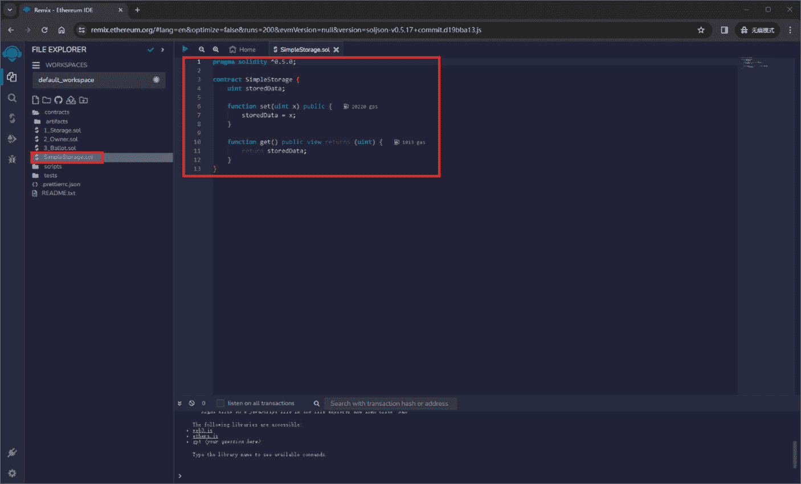
    *图 3-2：为 `SimpleStorage.sol` 编写合约*

2.  **编译**：使用内置编译器编译你的合约，并检查是否存在任何错误或警告。

    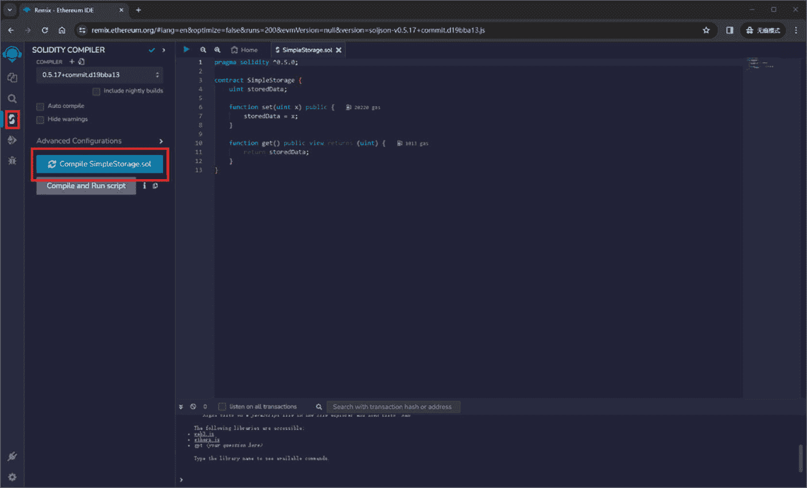
    *图 3-3：编译 `SimpleStorage.sol`*

3.  **测试**：使用 `Remix` 测试环境编写并执行合约的测试。

    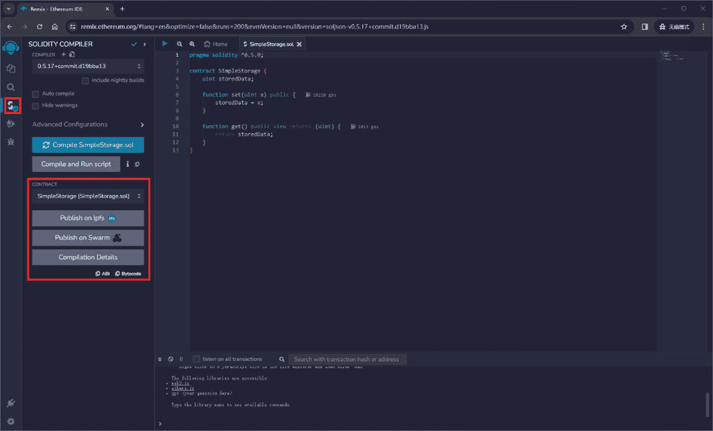
    *图 3-4：测试 `SimpleStorage.sol`*

4.  **调试**：利用调试器逐步执行代码并对其进行优化。

5.  **部署**：直接从 `Remix` 将你的合约部署到测试网络或以太坊主网。

    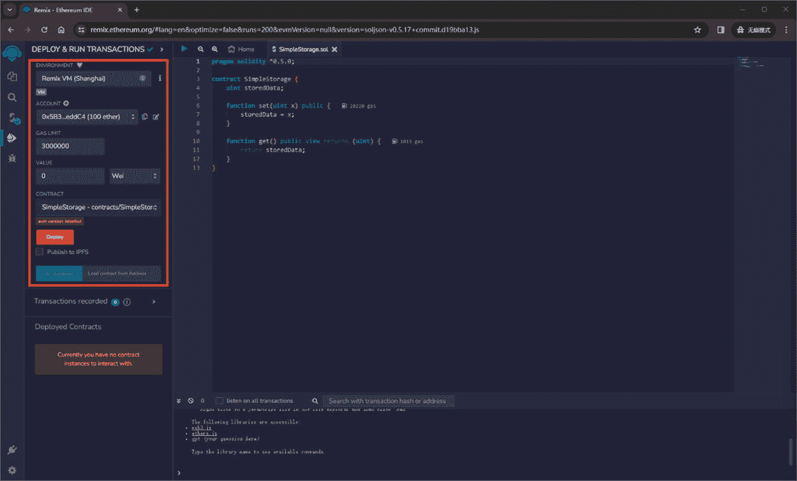
    *图 3-5：部署 `SimpleStorage.sol`*

6.  **交互**：部署后，使用 `Remix` 界面与你的合约函数进行交互。

    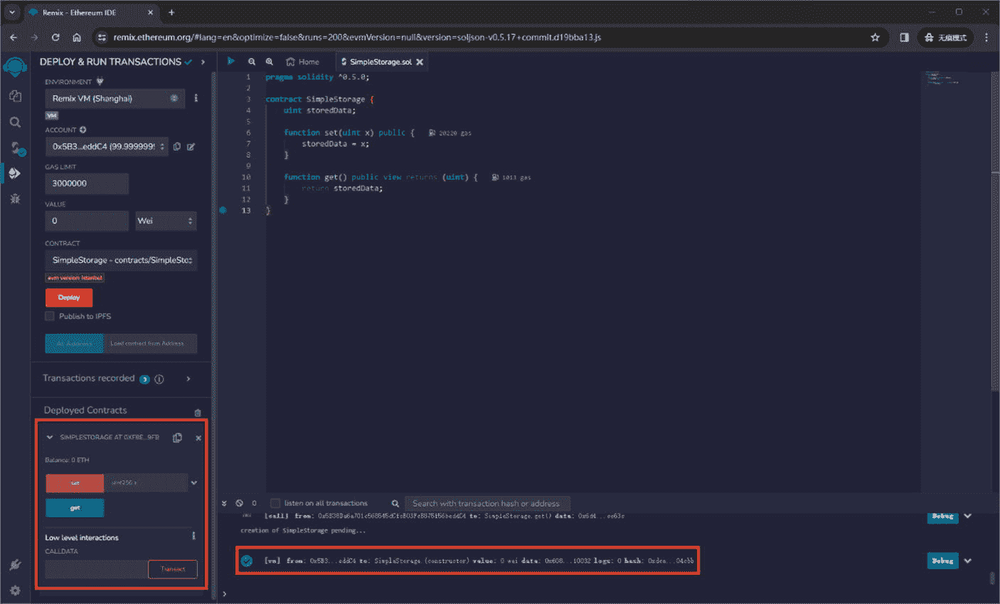
    *图 3-6：交互 `SimpleStorage.sol`*
    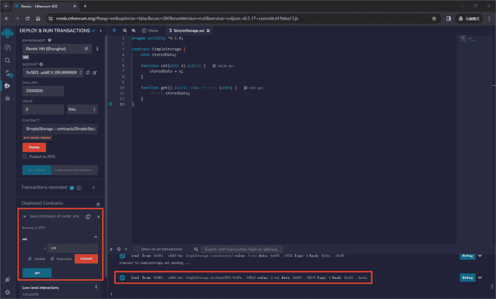
    *图 3-7：交互 `SimpleStorage.sol` – 交易*
    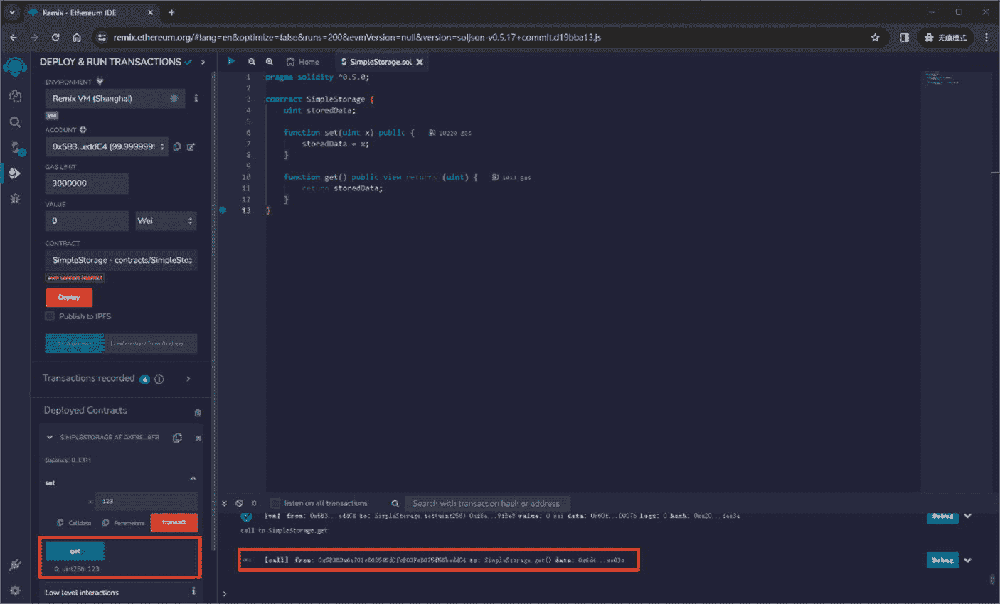
    *图 3-8：交互 `SimpleStorage.sol` – 获取*

现在你已经对 `Remix` 如何简化以太坊开发流程有了基础了解，让我们应用这些知识。在以下章节中，我们将探索智能合约的实际示例。这些示例将演示如何有效利用 `Remix` 的强大功能来编写、测试和部署智能合约，为你提供构建高效、安全的区块链应用的实践经验。

### 3.4 简单的智能合约示例

清单 3-2 中的智能合约定义了一个名为 `MyContract` 的简单合约。它主要包含一个名为 `value` 的公共字符串变量，初始设置为 `'MyValue'`。该变量的公共状态允许外部实体读取其值，这得益于 `Solidity` 自动生成的 getter 函数。此外，该合约还包含一个 `set` 函数，用于修改 `value`。

```solidity
pragma solidity 0.5.1;
contract MyContract{
    string public value = "MyValue";
    function set(string memory _value) public {
        value = _value;
    }
}
```

**清单 3-2：智能合约示例 – 2**

调用时，该函数接受一个新的字符串值作为参数，并将其赋值给 `value`，从而更新其内容。这个合约的简单结构表明了它在基本数据存储和检索操作中的实用性，展示了以太坊区块链上智能合约中状态管理和交互的基本示例。

接下来，该智能合约建立了一个名为 `MyContract` 的合约，其中包含多种状态变量，展示了 `Solidity` 中不同的数据类型和特性（清单 3-3）。

```solidity
pragma solidity 0.5.1;
contract MyContract{
    string public constant stringvalue = "MyString";
    bool public myBool = true;
    int public myInt = -1;
    uint public myUint = 1;
    uint8 public myUnit8 = 8;
    uint256 public myUnit256 = 9999;
}
```

**清单 3-3：智能合约示例 – 3**

以下是整合的说明：

1.  **字符串变量**：合约声明了一个名为 `stringvalue` 的常量公共字符串变量，初始值为 `'MyString'`。作为常量，其值是固定的，合约部署后无法更改。
2.  **布尔变量**：合约包含一个公共布尔变量 `myBool`，初始设置为 `true`。该变量与字符串类似，可以被外部读取，并且是可变的，意味着其值可以更改。
3.  **整数变量**：合约包含两个整数变量：`myInt`，一个值为 `-1` 的整数，展示了处理负数的能力；以及 `myUint`，一个设置为 `1` 的无符号整数（不能为负数）。在 `Solidity` 中，`int` 和 `uint` 的区别对于表示不同类型的数值数据很重要。
4.  **特定整数类型**：此外，还声明了更具体的无符号整数类型：`myUint8` 和 `myUint256`，分别初始化为 `8` 和 `9999`。这些类型以位数指定整数的大小，`uint8` 是 8 位无符号整数，`uint256` 是 256 位无符号整数，即 `uint` 的默认大小。

该智能合约作为示例，展示了如何在 `Solidity` 中声明和初始化不同类型的变量。它演示了常量的使用、可变状态变量、有符号与无符号整数的区别，以及特定位数的整数。理解这类合约是掌握以太坊智能合约中数据存储与操作的基础。

清单 3-4 提供了一个比前几个更高级的示例。它引入了枚举和状态管理，以及用于状态操作和查询的函数定义。

```solidity
pragma solidity 0.5.1;
contract MyContract{
    enum State { Waiting, Ready, Active }
    State public state;
    constructor() public{
        state = State.Waiting;
    }
    function activate() public{
        state = State.Active;
    }
    function isActive() public view returns(bool) {
        return state == State.Active;
    }
}
```

**清单 3-4：智能合约示例 – 4**

以下是全面的说明：

##### 枚举声明
合约首先声明了一个枚举类型 `State`，其中包含三种可能的状态：`Waiting`、`Ready` 和 `Active`。枚举是 `Solidity` 中的用户自定义类型，允许创建一组命名常量，从而提高代码的可读性和可维护性。

##### 状态变量
随后，合约声明了一个 `State` 类型的公有状态变量。将该变量的可见性设置为 `public`，意味着 `Solidity` 会自动为其生成一个 getter 函数，允许外部合约或接口查询合约的当前状态。

##### 构造函数
合约包含一个构造函数，这是一个在合约部署时仅执行一次的特殊函数。在该构造函数中，状态变量被初始化为 `State.Waiting`。这确保了合约在部署到以太坊区块链时，其初始状态为 `Waiting`。

##### 状态变更函数
合约中有一个 `activate()` 函数，调用该函数会将合约状态更改为 `Active`。这演示了如何通过函数来操控合约状态。

##### 状态查询函数
最后，合约包含一个 `isActive()` 函数，该函数返回一个布尔值，指示合约的当前状态是否为 `Active`。此函数是一个 `view` 函数，意味着它不修改合约状态，仅读取并返回信息。

总体而言，该合约展示了在 `Solidity` 中使用枚举来管理和查询合约状态的范例，体现了以太坊智能合约中一种常见模式：合约状态根据与其内部定义函数的交互而发生变化。这种模式在许多去中心化应用中至关重要，因为合约的状态通常决定了应执行的逻辑。

代码清单 3-5 包含了状态管理、访问控制和结构化数据处理的组合。它提供了一个实际示例，展示了以太坊区块链上的智能合约如何利用访问控制机制将特定操作限制给特定用户。

```solidity
pragma solidity 0.5.1;
contract AddPerson{
    uint256 public peopleCount = 0;
    mapping(uint => Person) public people;
    address owner;
    modifier onlyOwner() {
        require(msg.sender == owner);
        _;
    }
    struct Person{
        uint _id;
        string _firstName;
        string _lastName;
    }
    constructor() public {
        owner = msg.sender;
    }
    function addPerson(string memory _firstName, string memory _lastName) public onlyOwner{
        incrementCount();
        people[peopleCount] = Person(peopleCount, _firstName, _lastName);
    }
    function incrementCount() internal {
        peopleCount += 1;
    }
}
```

**代码清单 3-5：智能合约示例 – 5**

我们来解析一下其关键组成部分，尤其关注 `onlyOwner` 修饰器：

1.  **状态变量与结构体**
    *   合约将公有状态变量 `peopleCount` 初始化为 0，用于跟踪已添加的人数。
    *   它使用了一个映射 `people`，将无符号整数（`uint`）与 `Person` 结构体关联起来，便于人员数据的存储与检索。
    *   `Person` 结构体定义了属性 `_id`、`_firstName` 和 `_lastName`，用于对相关人员信息进行分组。
2.  **所有权与访问控制（`onlyOwner` 修饰器）**
    *   该合约的一个显著特点是 `onlyOwner` 修饰器。它旨在将某些功能限制为仅合约所有者可用。
    *   合约声明了一个名为 `owner` 的 `address` 类型变量。在以太坊中，地址用于标识账户，这些账户可以是外部用户或其他合约。
    *   `onlyOwner` 修饰器使用 `require` 语句来确保 `msg.sender`（调用函数的地址）等于 `owner`。这保证了只有部署合约的用户（即所有者）才能调用受此修饰器保护的函数。
    *   修饰器中的 `_;` 代表应用该修饰器的函数体的占位符。
3.  **合约构造函数**
    *   在合约的构造函数中，`owner` 被设置为 `msg.sender`，这意味着部署合约的地址被记录为所有者。
4.  **添加人员函数（`addPerson()`）**
    *   `addPerson()` 函数用于向合约中添加新人员及其名和姓。该函数受 `onlyOwner` 修饰器约束，意味着只有合约所有者才能添加新人员。
    *   该函数会递增 `peopleCount`，并向 `people` 映射中添加一个新的 `Person`。
5.  **用于递增计数的内部函数**
    *   还有一个内部函数 `incrementCount()`，它仅将 `peopleCount` 增加 1。作为内部函数，它只能从合约内部调用。

`onlyOwner` 修饰器是智能合约中的一种常见模式，用于确保敏感函数只能由合约所有者执行，从而增加一层安全性和控制。

代码清单 3-6 是一个比代码清单 3-5 更复杂的示例，展示了基于时间的修饰器、映射和结构体的使用。它旨在管理一个人员列表，并对特定操作的可执行时间施加约束。

```solidity
pragma solidity 0.5.1;
contract AddPerson{
    uint256 public peopleCount = 0;
    mapping(uint => Person) public people;
    uint256 openingTime = 1704067200;
    modifier onlyWhileOpen() {
        require(block.timestamp >= openingTime);
        _;
    }
    struct Person{
        uint _id;
        string _firstName;
        string _lastName;
    }
    function addPerson(string memory _firstName, string memory _lastName) public onlyWhileOpen{
        incrementCount();
        people[peopleCount] = Person(peopleCount, _firstName, _lastName);
    }
    function incrementCount() internal {
        peopleCount += 1;
    }
}
```

**代码清单 3-6：智能合约示例 – 6**

该合约是智能合约如何集成基于时间的逻辑并管理结构化数据集合的一个示例。`openingTime` 变量与 `onlyWhileOpen` 修饰器的结合使用，展示了一种常见模式：合约的某些功能在预定义条件（如特定时间或日期）满足之前受到限制。这种模式在定时事件、受限访问时段或分阶段合约功能等场景中非常有用。

以下是代码清单 3-5 和 3-6 之间的主要区别：

**基于时间的修饰器（`openingTime`）**
*   合约包含一个状态变量 `uint256 openingTime = 1704067200;`。该值以 Unix 时间戳的形式代表一个特定的时间点。具体值 `1704067200` 对应于自 2024 年 1 月 1 日以来的秒数。
*   使用此时间戳定义了一个修饰器 `onlyWhileOpen`。它使用 `require` 语句来确保当前区块的时间戳（`block.timestamp`，以 Unix 时间戳格式提供当前时间）大于或等于 `openingTime`。这意味着使用此修饰器的函数只能在 `openingTime` 指定的时间之后执行。

### 3.5 ERC 标准：ERC20、ERC721、ERC1155

在本节中，我们将专门关注以太坊区块链领域中智能合约的类型，特别是深入探讨代币标准。我们将关于代币法律属性的更深入讨论保留到第 3 部分“去中心化金融（DeFi）与应用”。在此，我们的重点是技术性的代币标准。

#### ERC 标准概述

区块链上的代币代表了各种实体，例如货币、时间、服务甚至虚拟物品。通过将这些实体代币化，智能合约可以与之交互、交换或修改它们。理解代币需要区分代币合约和实际代币本身。代币合约是一种以太坊智能合约，它将地址映射到余额，并允许对这些余额进行加减操作。

`ERC`，即以太坊意见征求（Ethereum Request for Comment），是开发者在创建智能合约时同意遵循的一种协议或标准。这些标准确保了智能合约编码的互操作性和可重用性。⁷

# ERC20 标准

`ERC20` 标准于 2015 年提出，2017 年被广泛采用，用于创建**同质化代币**，这意味着每个代币都是相同的，并且可以互换。它被广泛应用于稳定币、首次代币发行（ICO）、众筹及其他相关活动。`ERC20` 代币，例如 Tether（`USDT`）、Chainlink（`LINK`）和 Basic Attention Token（`BAT`），具有预设的功能，使它们能够相互交互，并与加密货币钱包等兼容服务协同工作。

以下是一个 `ERC20` 代币合约的示例：

```solidity
// contracts/HGToken.sol
// SPDX-License-Identifier: MIT
pragma solidity ⁰.8.0;
import "@openzeppelin/contracts/token/ERC20/ERC20.sol";
contract HGToken is ERC20 {
constructor(uint256 initialSupply) ERC20("HGToken", "HGT") {
_mint(msg.sender, initialSupply);
}
}
```

我们来分解一下它的组成部分：

### 1. SPDX 许可证标识符和 Solidity 版本

```solidity
// SPDX-License-Identifier: MIT
pragma solidity ⁰.8.0;
```

这几行代码指定了许可证（此处为 `MIT`）和 Solidity 编译器版本（`⁰.8.0`），表明该合约与 Solidity 版本 `0.8.0` 或其以上的任何次要版本兼容。

### 2. 导入语句

```solidity
import "@openzeppelin/contracts/token/ERC20/ERC20.sol";
```

这一行从 OpenZeppelin 库导入了 `ERC20` 代币标准实现。OpenZeppelin 是以太坊开发者社区中广泛使用且值得信赖的库，它提供了安全、标准化且经过审计的智能合约实现。OpenZeppelin 的 `ERC20.sol` 合约包含了 `ERC20` 代币的基本功能，例如代币转账、获取账户余额、代币总供应量以及授权额度（即一个账户允许另一个账户代其花费的代币数量）。

### 3. 合约声明

```solidity
contract HGToken is ERC20 {
```

这里声明了一个名为 `HGToken` 的新智能合约，它继承了 OpenZeppelin 的 `ERC20` 代币实现。这意味着 `HGToken` 继承了标准 `ERC20` 代币的所有功能。

### 4. 构造函数

```solidity
constructor(uint256 initialSupply) ERC20("HGToken", "HGT") { _mint(msg.sender, initialSupply); }
```

构造函数在合约部署时执行一次。它接收代币的初始供应量作为参数。`ERC20("HGToken", "HGT")` 部分调用了导入的 `ERC20` 合约的构造函数，将代币名称设置为 `HGToken`，符号设置为 `HGT`。然后调用 `_mint` 函数来创建初始供应的代币，并将其分配给部署合约的地址（`msg.sender`）。

总之，这个合约是一个基本的 `ERC20` 代币，在部署时设置了初始供应量。它使用了 OpenZeppelin 安全且标准的 `ERC20` 协议实现，确保了符合代币标准，并降低了代币代码中出现漏洞的风险。

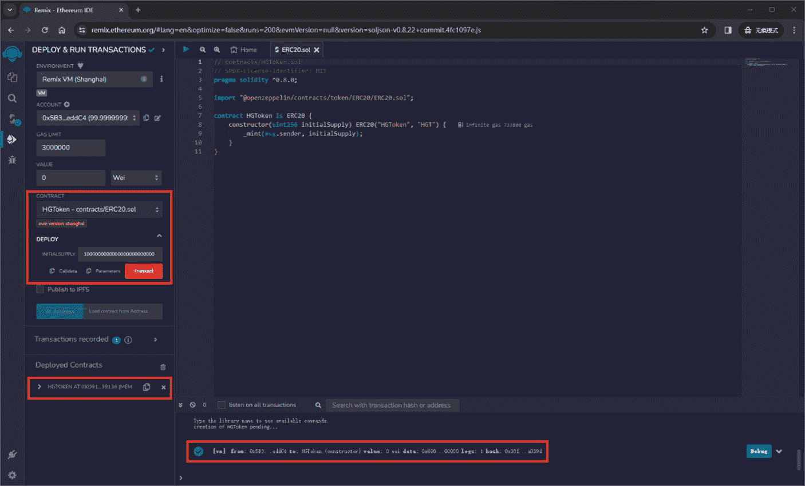

图 3-9 展示了部署 `ERC20` 代币智能合约的过程。其中几个元素被突出显示，特别是红色框内的部分。让我们详细解析红色框内的元素以及部署这个智能合约的流程：

1. `HGToken` - `contracts/ERC20.sol`：这表明智能合约 `HGToken` 已准备好部署。该合约可能位于名为 `contracts` 的文件夹或路径下的 `ERC20.sol` 文件中。这是一个 `ERC20` 代币，是在以太坊区块链上创建同质化代币的标准。
2. `DEPLOY`（部署）：此区域用于在将智能合约部署到区块链之前，输入智能合约构造函数所需的初始参数。
3. `INITIALSUPPLY`（初始供应量）：此输入字段用于填写 `HGToken` 合约构造函数的 `initialSupply` 参数。该值决定了部署时将要铸造的代币总供应量。
4. `1,000,000,000,000,000,000,000,000`：在 `INITIALSUPPLY` 字段中输入的这个非常大的数字，是因为 `ERC20` 代币使用一种叫做 `wei` 的单位作为代币的最小子单元，类似于以太币的最小单位也叫 `wei`。由于 `ERC20` 标准允许最多 18 位小数，如果你想发行 100 万枚代币（`1,000,000`），则需要在数字末尾添加 18 个零来容纳小数位。因此，`1,000,000` 变为 `1,000,000` 后跟 18 个零，即 `1,000,000,000,000,000,000,000,000`，用以表示具有 18 位小数的 100 万枚代币。
5. 部署按钮（`Transact`）：此按钮用于启动部署过程。点击它后，Remix 会向区块链发送一笔交易，以使用指定的初始供应量创建合约。
6. 控制台输出：底部的控制台输出显示部署交易处于待处理状态。它显示了部署合约的账户（`0x583...edc4`）、交易发送的价值（本例中为 0 ETH，由 `value: 0x0` 指示）、gas 限额以及交易哈希（`0x38...0394`），该哈希是此交易在区块链上的唯一标识符。

如果部署成功，`HGToken` 合约将被创建在区块链上，初始供应量为 100 万枚代币（已考虑 18 位小数），部署合约的账户将初始持有所有这些代币。随后，可以根据合约逻辑及部署实体的意图，对代币进行分发或使用。

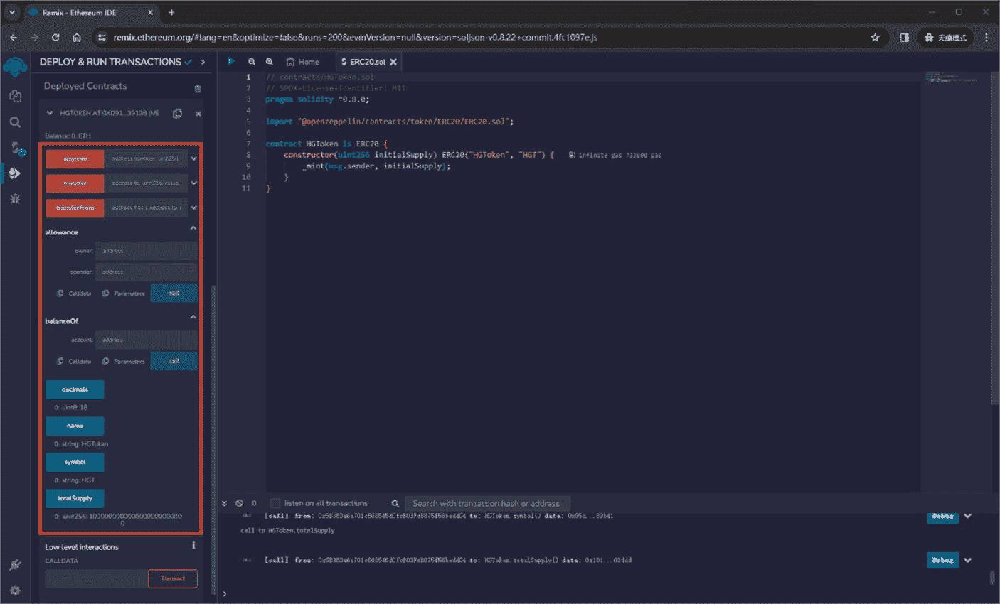

图 3-10 展示了 `ERC20` 代币合约部署后的界面。该界面由 Remix 生成，用于与已部署智能合约的函数和查询进行交互。下面解释红框内的元素，并区分橙色和蓝色文本。以下是合约的函数和查询：

1. `approve`：这是一个函数，允许代币所有者批准另一个地址代表其花费指定数量的代币。
2. `transfer`：此函数用于将一定数量的代币从总供应量发送到另一个地址。
3. `transferFrom`：此函数允许第三方从一个地址向另一个地址转移代币，但前提是该第三方已通过 `approve` 函数获得代币所有者的授权额度。
4. `allowance`：此查询返回允许某个授权地址从所有者账户中提取的剩余代币数量。
5. `balanceOf`：此查询返回特定账户地址的代币余额。
6. `decimals`：显示代币可分割的小数位数，这会影响代币的可分性。在 `ERC20` 代币中，通常设置为 18，允许像以太币一样分为更小的单位。
7. `name`：返回代币的名称，本例中为 `'HGToken'`。
8. `symbol`：返回代币的符号，本例中为 `'HGT'`，类似于代币的股票代码。
9. `totalSupply`：此查询返回此合约的流通代币总量。

橙色文本代表构成 `ERC20` 代币接口的函数和查询的名称。它们是可以在合约上执行的操作，例如转账代币（`transfer`）、检查账户余额（`balanceOf`）或检查总供应量（`totalSupply`）。

蓝色文本表示函数所需的参数或查询的返回类型。例如，`transfer` 函数需要接收地址和转账金额。`decimals` 查询旁带有蓝色 `uint8: 18`，表明它返回一个 8 位的无符号整数，数值为 18。

橙色标识符是可以在合约上调用的操作名称。蓝色文本则为这些操作提供了额外上下文，要么指定函数所需的输入，要么指出查询返回的输出。因此，**低级交互**允许通过发送编码为十六进制 `CALLDATA` 的原始数据来直接与合约交互。这通常用于需要构建和发送标准接口无法覆盖的复杂调用的开发者。`CALLDATA` 字段是进行低级合约调用时输入原始交易数据的地方。

总而言之，部署 `ERC20` 代币合约后，Remix 会提供一个图形界面来与合约函数交互。橙色文本标识了可用的操作，而蓝色文本则详细说明了函数的参数或查询的返回数据。低级交互适用于超出标准接口范围的复杂操作。

## ERC721 标准

相比之下，`ERC721` 于 2017 年提出，2018 年被采纳，专注于非同质化代币（NFT）。这些代币具有唯一性，不可互换。`ERC721` 代币代表着独特的物品，如数字艺术品、收藏品或房地产。它们在为独特数字资产创建市场方面发挥着关键作用，Beeple 以 6900 万美元出售的数字艺术品便是有力证明。⁸

以下是一个 `ERC721` 代币合约的示例：

```solidity
// contracts/HGNFT.sol
// SPDX-License-Identifier: MIT
pragma solidity ⁰.8.0;
import "@openzeppelin/contracts/token/ERC721/extensions/ERC721URIStorage.sol";
import "@openzeppelin/contracts/utils/Counters.sol";
contract HGNFT is ERC721URIStorage {
using Counters for Counters.Counter;
Counters.Counter private _tokenIds;
constructor() ERC721("HGNFT", "HGN") {}
function awardItem(address player, string memory tokenURI)
public
returns (uint256)
{
uint256 newItemId = _tokenIds.current();
_mint(player, newItemId);
_setTokenURI(newItemId, tokenURI);
_tokenIds.increment();
return newItemId;
}
}
```

以下是其组成部分的详细解析：

### 1. SPDX-License-Identifier 和 Solidity 版本

```solidity
// SPDX-License-Identifier: MIT
pragma solidity ⁰.8.0;
```

这部分指定了合约的许可证和 Solidity 编译器版本，表明该合约应使用 Solidity `0.8.0` 或更高版本来编译。

### 2. 导入语句

```solidity
import "@openzeppelin/contracts/token/ERC721/extensions/ERC721URIStorage.sol";
import "@openzeppelin/contracts/utils/Counters.sol";
```

- `ERC721URIStorage` 是 OpenZeppelin 的 `ERC721` 标准的一个扩展。它增加了设置和管理代币 URI（统一资源标识符）的功能，该 URI 通常指向一个符合“ERC721 元数据 JSON 模式”的 JSON 文件。
- `Counters` 是 OpenZeppelin 的一个实用工具库，提供了一个计数器变量类型，用于安全地递增和递减数值。

### 3. 合约声明与继承

```solidity
contract HGNFT is ERC721URIStorage {
```

这部分声明了合约 `HGNFT`，它继承了 `ERC721URIStorage`，意味着它将拥有 `ERC721` 代币的所有标准功能以及额外的 URI 存储特性。

### 4. Using 语句与状态变量

```solidity
using Counters for Counters.Counter;
Counters.Counter private _tokenIds;
```

- `using` 语句允许合约对 `Counter` 类型使用 `Counters` 库中定义的函数。
- `_tokenIds` 是一个私有状态变量，它使用 `Counter` 工具来跟踪当前的代币 ID。

### 5. 构造函数

```solidity
constructor() ERC721("HGNFT", "HGN") {}
```

构造函数通过调用 `ERC721` 构造函数来初始化合约，并传入代币的名称（`HGNFT`）及其符号（`HGN`）。

### 6. `awardItem` 函数

```solidity
function awardItem(address player, string memory tokenURI)
public
returns (uint256)
{
uint256 newItemId = _tokenIds.current();
_mint(player, newItemId);
_setTokenURI(newItemId, tokenURI);
_tokenIds.increment();
return newItemId;
}
```

- `awardItem` 是一个公共函数，可以调用来铸造一个新的 NFT 并将其分配给 `player` 地址。
- 它首先获取当前的代币 ID 值，用此 ID 为 `player` 铸造一个新区块，并设置该代币的 URI。
- 然后，它会递增 `_tokenIds` 计数器，以确保下一个代币拥有唯一的 ID。
- 该函数返回新的项目 ID，可用于引用新铸造的代币。

本质上，该合约提供了一个简单但功能完备的 NFT 合约示例，可用于创建独特的数字资产，其中每个代币都可以关联一个独特的 URI，该 URI 指向描述代币属性的元数据。该合约使用了 OpenZeppelin 库，以确保功能的安全性和标准化。

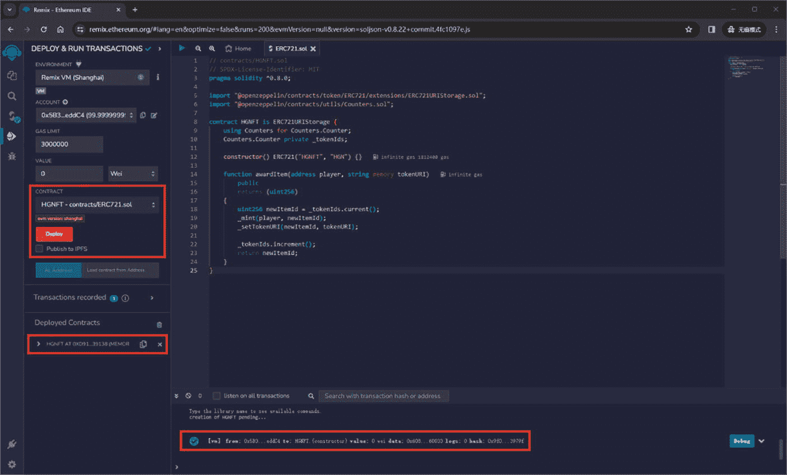

图 3-11 展示了部署一个 `ERC721` 智能合约（具体是一个名为 `HGNFT` 的非同质化代币合约）的过程。以下是红框内元素的详细说明：

1. `HGNFT - contracts/ERC721.sol`：这表示 `HGNFT` 合约已被选中，并准备好部署。该合约位于 `contracts` 文件夹下的 `ERC721.sol` 文件中。按照惯例，该文件包含 NFT 的代码。
2. `Deploy`：点击“Deploy”按钮，会将智能合约发送到区块链。它会使用环境设置中指定的账户和 gas 限额。一旦部署，该合约将成为区块链的一部分，并能够与其他合约和地址进行交互。

在底部的控制台中，你可以看到部署的交易详情。它显示了部署合约的账户、gas 限额以及随部署发送的以太币数量（此处为 0，因为部署合约通常不需要发送以太币，除非构造函数另有规定）。交易哈希（区块链上该交易的唯一标识符）也是可见的。

一旦合约部署完成，它将出现在“Deployed Contracts”下，你可以使用合约中定义的函数与之交互，例如图 3-12 中用于铸造新 NFT 的 `awardItem` 函数。

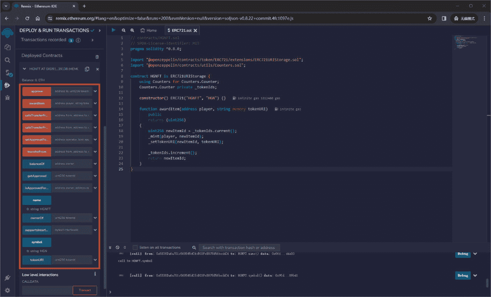

部署一个通常用于创建非同质化代币（NFT）的 `ERC721` 智能合约后，Remix 生成的界面会高亮显示可用于与 `HGNFT` 合约进行交互的函数和查询。以下是对界面中关键元素的详细解释：

1. `approve`：此函数允许代币所有者批准另一个账户将指定数量的代币转移给第三方。
2. `awardItem`：这个在 `HGNFT` 合约中的自定义函数允许合约所有者（或函数调用者）铸造一个新的 NFT 并将其分配给玩家地址。`tokenURI` 参数通常引用一个托管在 IPFS 上的 JSON 文件。

一旦你的数字资产（例如 NFT 图像）生成，下一步关键步骤是将其上传到 IPFS（星际文件系统）。IPFS 是一种去中心化存储解决方案，通过将文件分布到全球多个节点来维护文件的永久性和完整性。这一步在 NFT 创建过程中至关重要，因为它提供了一个唯一的、不可变的 URI，该 URI 嵌入在 NFT 的元数据中，确保数字资产无法被更改或移除。根据你的技术偏好和需求，你可以选择搭建自己的 IPFS 节点以获得完全控制权（选项 1），也可以选择使用像 Pinata 这样的第三方服务以获得易用性（选项 2）。

### 选项 1：搭建你自己的 IPFS 节点

搭建你自己的 IPFS 节点涉及在你的机器上安装 IPFS、初始化你的 IPFS 仓库，并启动 IPFS 守护进程以将你的节点连接到 IPFS 网络。这种方法让你对内容的托管拥有完全控制权，但也增加了复杂性和责任。你需要管理节点的可用性和连接性，以确保资产始终可访问。这种方法可能包括：
- 下载并安装 IPFS
- 使用 `ipfs init` 初始化你的 IPFS 节点
- 使用 `ipfs daemon` 启动 IPFS 守护进程
- 使用 `ipfs add -r /path/to/your/folder` 将文件添加到 IPFS

虽然运行自己的节点能提供高度的控制权和与 IPFS 网络的直接交互，但这需要对 IPFS 有深入的理解，对于初学者或寻求快捷简便解决方案的用户来说，可能并非最直接的选择。

## 方案二：使用 Pinata 等第三方服务

对于许多用户，尤其是刚接触 IPFS 或追求便捷的用户而言，像 Pinata 这样的第三方服务提供了一种更简单的在 IPFS 上管理和上传内容的方式。Pinata 通过提供用户友好的界面和固定服务等附加功能来简化流程，确保你的内容在 IPFS 网络上始终可用。

要使用 Pinata 上传你的 NFT 资产：

-   **创建账户**：在 `Pinata.cloud` 上注册并登录你的账户。
-   **上传内容**：导航至“上传”部分，选择上传一个文件夹。Pinata 将自动固定你上传的内容，确保其在 IPFS 网络上可用。
-   **获取 IPFS 哈希**：上传后，Pinata 会为你的文件夹及其包含的每个文件提供 IPFS 哈希（CID）。这些哈希作为你资产永久且不可变的链接，你将把它们包含在 NFT 的元数据中。

此处不再提供逐步解释，请参考第 7 章的第 7.​3 节，其中涵盖了管理元数据的详细流程，包括处理 NFT 的多个图片和 JSON 文件。第 7 章提供了关于利用 Pinata 及其他方法上传数字资产并在 IPFS 上进行管理的更全面的指导。

## 方案一 vs. 方案二

虽然搭建你自己的 IPFS 节点能让你拥有完全的控制权和实践经验，但它也伴随着更陡峭的学习曲线和持续的管理责任。相比之下，像 Pinata 这样的第三方服务提供了更直接、用户友好的解决方案，非常适合希望简化 NFT 创作流程的创作者。无论你选择哪种方法，关键目标都是将你的数字资产安全上传到 IPFS，使其能够转化为 NFT。

例如，如果你有一个托管在 IPFS 上的 JSON 文件，其 URI 为（例如 `ipfs://Qm...`），那么在调用 `awardItem` 函数时，你将使用这个 URI 作为 `tokenURI` 参数。

-   `safeTransferFrom`：此函数有两个版本。它们允许安全地将代币从一个地址转移到另一个地址，确保接收地址能够处理 `ERC721` 代币（以防止意外丢失）。
-   `setApprovalForAll`：此函数允许代币所有者授予另一个地址代理其转移全部代币的权限。
-   `transferFrom`：此函数用于将代币从一个地址转移到另一个地址。调用者必须被授权移动该代币，无论是作为所有者、被授权者还是已授权的操作员。
-   `balanceOf`：此查询返回给定地址所拥有的代币数量。
-   `getApproved`：返回单个代币的授权地址。
-   `isApprovedForAll`：检查操作员是否被授权转移给定地址拥有的所有代币。
-   `name`：返回代币集合的名称，在本例中为 `HGNFT`。
-   `ownerOf`：此查询返回特定代币 ID 的所有者。
-   `supportsInterface`：以太坊中的合约可以通过对给定的接口 ID 返回 `true` 来声明其支持的函数。这是一个供其他合约使用的技术性函数，用于确定此合约支持哪些功能。
-   `symbol`：此查询返回代币符号，即 `HGN`。
-   `tokenURI`：对于给定的代币 ID，返回关联资源的 URI，通常是一个包含元数据的 JSON 文件的链接。

对于 `awardItem`，该函数旨在向玩家“授予”一个 NFT，其中 `player` 是接收者的地址，`tokenURI` 是 NFT 元数据的链接。元数据文件可能看起来像这样：

```json
{
"name": "惠贡数字艺术品",
"description": "一件独特的数字艺术品",
"image": "ipfs://QmXxXxXxXxXxXxXxXxXxXxXxXxXxXxX",
"attributes": [
{
"trait_type": "稀有度",
"value": "稀有"
},
{
"trait_type": "艺术家",
"value": "惠贡"
}
]
}
```

该文件将被上传到 IPFS，生成的 IPFS URI 将作为铸造 NFT 时的 `tokenURI` 参数。

值得注意的是，NFT 的详细运作机制，包括它们如何融入更广泛的 DeFi 生态系统和数字艺术平台等应用中，将在第 3 部分“去中心化金融（DeFi）与应用”中探讨，具体在第 7 章“非同质化代币（NFT）与数字艺术”中。

### ERC1155 标准

`ERC1155` 标准于 2018 年推出，它弥合了 `ERC20` 与 `ERC721` 之间的差距，允许单个合约同时代表多种同质化、半同质化以及非同质化代币。该标准引入了批量转账和安全代币转账的概念，降低了交易成本并缓解了网络拥堵。对于需要共存多种代币类型的游戏和数字收藏品领域，此标准尤其有益。

以下是一个 `ERC1155` 多代币标准合约的示例：

```solidity
// contracts/HGCollections.sol
// SPDX-License-Identifier: MIT
pragma solidity ⁰.8.0;
import "@openzeppelin/contracts/token/ERC1155/ERC1155.sol";
contract HGCollections is ERC1155 {
uint256 public constant HGT = 0;
uint256 public constant HGNFT = 1;
constructor() ERC1155("https://huigong.info/api/item/{id}.json") {
_mint(msg.sender, HGT, 10**18, "");
_mint(msg.sender, HGNFT, 1, "");
}
}
```

以下是代码的解释：

1.  **SPDX 许可证标识符和 Solidity 版本**

```solidity
    // SPDX-License-Identifier: MIT
    pragma solidity ⁰.8.0;
    ```
这指明了该合约采用 MIT 许可证授权，并且是为 Solidity 版本 `0.8.0` 的编译而编写的。

2.  **导入语句**

```solidity
    import "@openzeppelin/contracts/token/ERC1155/ERC1155.sol";
    ```
这从 OpenZeppelin 合约库中导入了 `ERC1155` 合约。OpenZeppelin 合约库是一组可复用且安全的智能合约组件。

3.  **合约声明**

```solidity
contract HGCollections is ERC1155 {
```
`HGCollections` 被声明为一个继承自 OpenZeppelin `ERC1155` 合约的合约，这意味着它继承了 `ERC1155` 代币合约的所有标准方法和属性。

4.  **代币类型的常量**

```solidity
    uint256 public constant HGT = 0; uint256 public constant HGNFT = 1;
    ```
声明了两个常量 `HGT` 和 `HGNFT`，用于在这个 `ERC1155` 合约中表示不同的代币类型。`HGT` 表示 ID 为 `0` 的同质化代币类型，`HGNFT` 表示 ID 为 `1` 的非同质化代币类型。

5.  **构造函数与代币元数据**

```solidity
    constructor() ERC1155("https://huigong.info/api/item/{id}.json") {
    ```
构造函数使用一个用于代币元数据的 URI 来初始化合约。该 URI 包含一个占位符 `{id}`，它可以被代币的 ID 替换，以便为每种特定的代币类型检索元数据。

6.  **铸造代币**

```solidity
    _mint(msg.sender, HGT, 10**18, "");
    _mint(msg.sender, HGNFT, 1, "");
    ```
在构造函数内部，有两个 `_mint` 调用：
-   第一个调用铸造了 `10**18`（1 后面跟 18 个零，模拟以太币的最小单位 `wei`）个同质化代币 `HGT`，并将它们分配给合约部署者（`msg.sender`）。
-   第二个调用铸造了 `1` 个单位非代同质化代币 `HGNFT`，同样将其分配给合约部署者。这反映了 NFT 的典型属性，即它们是唯一的或者至少供应量不大。
传递给 `_mint` 的最后一个参数是空字符串 `""`，如果有更复杂的铸造逻辑或需要触发事件，可以用数据替换该字符串。

这个合约展示了 `ERC1155` 标准的灵活性，单个合约可以管理多种代币类型和数量。`ERC1155` 标准在游戏等场景中尤其受欢迎，在这些场景中，用户可能拥有多种需要以统一方式进行管理的物品（用于消耗品的同质化代币和用于独特物品的非同质化代币）。

图 3-13 展示了部署名为 `HGCollections` 的 `ERC1155` 智能合约之后的情况。与之前讨论的 `ERC721` 合约类似，部署这个 `ERC1155` 合约就像在 Remix 中点击“部署”按钮一样简单。一旦部署完成，合约的功能和特性便可进行交互。

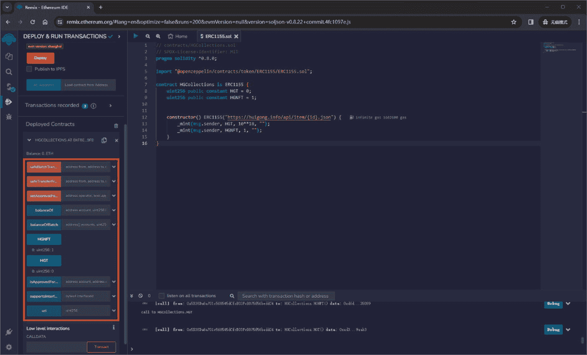

**图 3-13** 已部署的合约 – ERC1155

以下是已部署的 `HGCollections` 智能合约中红色方框内标明的每个函数和功能的详细说明：

1.  `safeBatchTransferFrom`：允许一个地址在单笔交易中将多种类型的代币转账到另一个地址。这是一个用于转账多种代币 ID 和数量的批量操作，确保每次转账都是安全的，并且接收方能够处理这些代币。

2.  `safeTransferFrom`：允许将特定数量的代币（通过 ID 标识）从一个地址安全地转账到另一个地址。此函数确保接收地址具备处理 `ERC1155` 代币的必要逻辑。

3.  `setApprovalForAll`：授予或撤销另一个地址（操作者）管理当前地址所有代币的权限。这类似于针对本合约中所有代币的授权委托书。

4.  `balanceOf`：提供单个账户持有的特定代币 ID 的余额，告诉你该账户持有特定 ID 代币的数量。

5.  `balanceOfBatch`：`balanceOf` 的扩展，允许同时查询多个账户和代币 ID 的余额，对于批量获取余额非常有用。

6.  `HGNFT`：代表本合约中的一种非同质化代币类型，ID 为 `1`。它表明这种特定的代币类型是独一无二且不可互换的。

7.  `HGT`：代表本合约中的一种同质化代币类型，ID 为 `0`。这种代币类型是可互换的，每个单位之间没有区别。

8.  `isApprovedForAll`：检查某个操作者是否被授权管理某个拥有者的所有代币，这可以包括同质化和非同质化代币。

9.  `supportsInterface`：根据 `ERC165` 标准，确定该合约是否实现了某个特定的接口。这有助于其他合约或服务了解该合约支持哪些功能。

10. `uri`：根据代币的 ID 检索其元数据的 URI。对于 `ERC1155` 合约，元数据 URI 通常指向一个包含代币详细信息的 JSON 文件。

11. **低级别交互**：界面这一部分允许通过发送编码为十六进制 `CALLDATA` 的原始数据来与合约进行直接交互。这适用于那些需要发送标准接口未涵盖的自定义交易的高级用户。

部署合约后，`HGCollections` 合约便已准备好使用统一的 `ERC1155` 标准来管理一系列同质化和非同质化代币。初始铸造创建了大量同质化代币（`HGT`）和一个非同质化代币（`HGNFT`）的单一实例，两者都分配给了部署者的地址。合约的 URI 结构（`https://huigong.info/api/item/{id}.json`）指明了每个代币 ID 的元数据所在位置，允许外部实体检索由该合约管理的每个代币的详细信息。

### 标准对比

这些 ERC 代币标准的演变反映了以太坊对快速变化的区块链格局的回应。每个标准都服务于特定的用例和需求，使其成为以太坊在数字生态系统中功能和多样性的组成部分：

-   `ERC20` 专注于同质化代币，适用于简单的代币转账。
-   `ERC721` 适用于唯一的、非同质化的代币，每个代币代表某种独特的东西。
-   `ERC1155` 提供了灵活性，结合了 `ERC20` 和 `ERC721` 的特性，并支持半同质化代币。

### 3.6 总结

本章深入探讨了以太坊的崛起，它源于维塔利克·布特林创建超越比特币能力平台的愿景。以太坊的优势在于其以太坊虚拟机（`EVM`）及其驱动的智能合约。这些技术使以太坊能够作为一个去中心化计算平台运行，支持超越基础交易的各种应用。本章还探讨了重要进展，例如以太坊通过“合并”转向权益证明共识模型，这既提升了效率，也增强了环境可持续性。

通过 ERC 标准（`ERC20`、`ERC721` 和 `ERC1155`），以太坊展现了对从同质化到非同质化资产等各种代币化需求的适应性。以太坊强大的社区和持续升级确保了其作为领先区块链平台的地位，能够支持从去中心化金融（`DeFi`）到 `NFT` 等多元现实世界应用。本章强调了以太坊在区块链生态系统中的关键作用，将其定位为下一波去中心化应用和技术的基础。

### 注释

1.  Zirojevic, A. (2022). 维塔利克·布特林如何想出创建以太坊的点子，Finbold。[`https://finbold.com/heres-how-vitalik-buterin-came-up-with-the-idea-of-creating-ethereum/`](https://finbold.com/heres-how-vitalik-buterin-came-up-with-the-idea-of-creating-ethereum/) （访问日期：2023 年 12 月 16 日）。
2.  NodeFlair (2021). 维塔利克·布特林如何在 19 岁时作为开发者联合创立以太坊，NodeFlair。[`https://nodeflair.com/blog/vitalik-buterin-co-founded-ethereum-at-the-age-of-19-heres-what-he-did-as-a-developer`](https://nodeflair.com/blog/vitalik-buterin-co-founded-ethereum-at-the-age-of-19-heres-what-he-did-as-a-developer) （访问日期：2023 年 12 月 16 日）。
3.  Thompsett, L. (2023). 维塔利克·布特林：以太坊联合创始人，加密梦想家。FinTech Magazine。[`https://fintechmagazine.com/articles/founding-ethereum-vitalik-buterin`](https://fintechmagazine.com/articles/founding-ethereum-vitalik-buterin) （访问日期：2023 年 12 月 16 日）。
4.  坎昆-丹佛（Dencun）常见问题解答 | ethereum.org (2024). ethereum.org。[`https://ethereum.org/en/roadmap/dencun/`](https://ethereum.org/en/roadmap/dencun/) （访问日期：2024 年 4 月 9 日）。
5.  Daye, W. (2024). 以太坊坎昆-丹佛升级能期待什么。CoinDesk。[`www.coindesk.com/tech/2024/02/28/what-to-expect-from-ethereums-cancun-deneb-upgrade/`](http://www.coindesk.com/tech/2024/02/28/what-to-expect-from-ethereums-cancun-deneb-upgrade/) （访问日期：2024 年 4 月 9 日）。
6.  以太坊丹佛升级完整指南 (2024). Chain。[`www.chain.com/blog/a-complete-guide-to-the-ethereum-dencun-upgrade`](http://www.chain.com/blog/a-complete-guide-to-the-ethereum-dencun-upgrade) （访问日期：2024 年 4 月 9 日）。
7.  代币 – OpenZeppelin 文档 (n.d.).[`https://docs.openzeppelin.com/contracts/4.x/tokens`](https://docs.openzeppelin.com/contracts/4.x/tokens) （访问日期：2023 年 12 月 16 日）。
8.  艺术与 NFT：Beeple 在历史性的 6900 万美元数字艺术销售一年后反思 (2022 年 3 月 11 日). NBC News。[`www.nbcnews.com/tech/tech-news/art-nfts-beeple-reflects-one-year-historic-69-million-digital-art-sale-rcna18989`](http://www.nbcnews.com/tech/tech-news/art-nfts-beeple-reflects-one-year-historic-69-million-digital-art-sale-rcna18989) （访问日期：2023 年 12 月 16 日）。