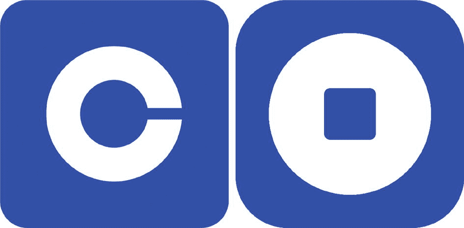
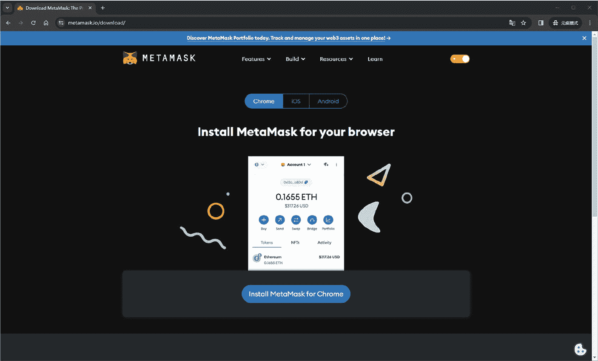
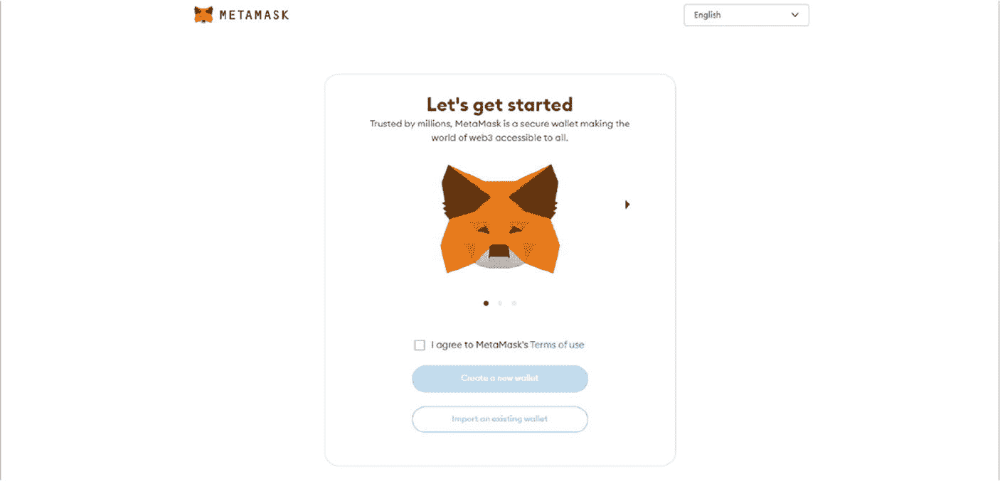
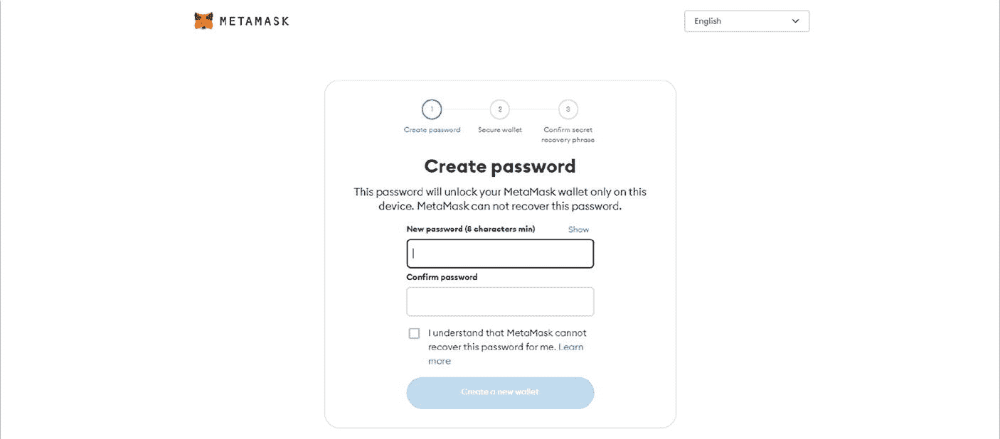
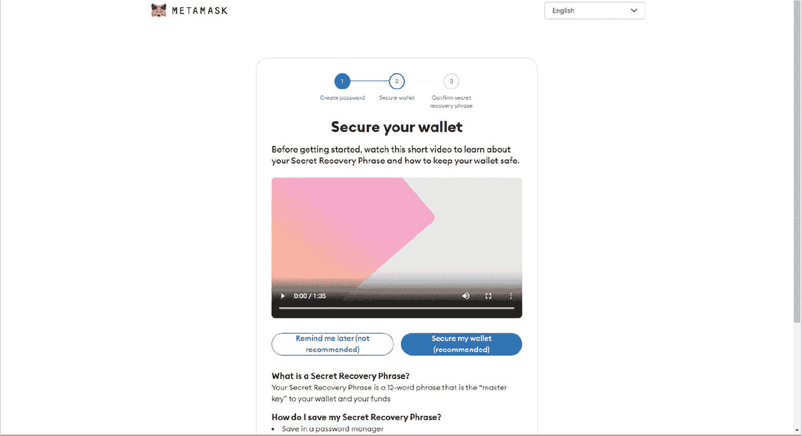

# 4. Web3 的支柱：以太坊钱包、水龙头和 Layer 2 解决方案

### 4.1 Web3 的门户：加密钱包

区块链钱包不仅仅是实体钱包的数字等价物；它们更像是个人银行家，无缝集成到 Web3 体验的架构中。这些钱包是与去中心化网络交互的基本接口，允许用户管理其数字身份和资产。以太坊钱包的类型与比特币相同，我们在第 2.​3 节中已经介绍过。

在这些钱包类型中，安全实践至关重要。私钥是进入个人数字金库的物理钥匙，必须极其谨慎地保护。通过助记词进行钱包备份以及选择安全的存储选项至关重要。针对黑客攻击和盗窃，双重身份验证（`2FA`）、多重签名要求以及避免网络钓鱼攻击等措施是必要的防御手段。

以太坊拥有两种不同的账户类型：

表 4-1

账户：EOA 与 合约账户¹

| 特性 | EOA | 合约账户 |
| --- | --- | --- |
| 控制权 | 由私钥控制 | 由合约代码控制 |
| 交易 | 可以发起交易 | 只能响应收到的交易 |
| 创建方式 | 由用户创建 | 部署合约时创建 |
| 用例 | 持有、发送/接收 ETH 及其他加密资产、与 DApp 交互 | 智能合约操作 |
| 示例 | Coinbase Wallet，MetaMask | Coinbase.com |

- **外部拥有账户（EOA）**：由私钥控制，能够发起交易。
- **合约账户**：由其合约代码管理，在收到交易时可以执行复杂功能。

Coinbase 既作为加密经纪商也作为钱包提供商运营，根据账户的性质——无论是外部拥有账户（EOA）还是合约账户——提供量身定制的不同服务。这种差异化支撑了其提供托管和非托管钱包解决方案以满足不同用户需求的能力。²

图 4-1

Coinbase.com（左）标志 vs. Coinbase Wallet（右）标志（来源：[`https://help.coinbase.com/en/wallet/getting-started/what-s-the-difference-between-coinbase-com-and-wallet`](https://help.coinbase.com/en/wallet/getting-started/what-s-the-difference-between-coinbase-com-and-wallet)）

**Coinbase.com 作为加密经纪商（合约账户）**：使用 `Coinbase.com` 购买或出售加密货币，即利用了该平台作为合约账户的角色。在这种能力下，所有交易都通过平台的智能合约进行管理，而非由用户直接管理。这种安排是托管钱包的典型特征，其中 Coinbase 保留对私钥的控制权，从而保护在其交易所上购买的资产。用户必须完成“了解你的客户”（`KYC`）流程，以增强安全性和合规性。这种设置体现了托管方面，即由第三方管理资金的安全性和访问权限。

**Coinbase Wallet（EOA）**：相比之下，`Coinbase Wallet` 作为一种非托管解决方案运行，是 EOA 的典型代表。它允许用户通过将私钥存储在自己的设备上来直接控制其加密货币。这种设置要求用户安全地保管其 12 个单词的恢复短语，因为丢失该短语意味着不可逆地失去对其资金的访问权限。EOA 提供的直接控制能够实现与区块链和去中心化应用（`DApps`）的实时交互，例如参与去中心化交易所（`DEX`）交易、借贷和流动性池。

Coinbase 还提供了一种混合解决方案，即 `DApp` 钱包形式，融合了托管和非托管功能。在这种混合模型中，Coinbase 管理您私钥的一部分，而另一部分则安全地驻留在您的设备上，从而在易用性和资产控制权之间取得平衡。

#### EOA 账户与合约账户的明确区分

EOA 账户与合约账户的明确区分至关重要。EOA 账户赋予用户完全控制权，所有操作都需要私钥管理，强调用户自身对安全负责。相反，合约账户则受合约规则的自动化治理，用户无需直接处理私钥。这一区分对于凸显 Coinbase 提供的多样化服务至关重要，既能满足追求简单与安全的新手用户，也能满足那些希望对数字资产拥有更大控制权的资深用户。

#### 设置与使用钱包：以 MetaMask 为例

在讨论了 Coinbase 钱包服务的复杂性之后，现在我们聚焦于设置和使用一个纯粹的 EOA 钱包，例如 MetaMask。MetaMask 因其在 Web3 基础设施中的作用而广受认可，它提供了一个用户友好的界面，用于与以太坊区块链及其他链进行交互。以下是开始使用 MetaMask 的方法：

1. **下载并安装**：访问 MetaMask 官方网站（`https://metamask.io/`）或您设备的应用商店，下载并安装适用于浏览器的 MetaMask 扩展程序或适用于手机的移动应用。

图 4-2 MetaMask 下载页面

图 4-2 展示了 MetaMask 的下载页面。该页面是下载 MetaMask 扩展程序的核心站点，确保您获取到钱包的合法版本。

选择 Chrome 版本：在下载页面上，您会找到适用于不同平台的选项——Chrome、iOS 和 Android。由于我们侧重于在 Chrome 上使用 MetaMask，请点击`Install MetaMask for Chrome`按钮。各个版本之间并无功能差异，它们在不同设备上均提供相同的特性和安全性。

点击 Chrome 版本按钮后，您将被重定向到 Chrome 网上应用店。在那里，您可以通过点击`Add to Chrome`按钮将 MetaMask 扩展程序添加到您的浏览器中。此时会弹出一个窗口，询问 MetaMask 扩展程序运行所需的权限。请仔细查看权限，如果您同意，请点击`添加扩展程序`继续。这将启动下载和安装过程。

1. **创建钱包**：按照提示创建一个新钱包。在此过程中，您将设置一个加密钱包的密码，确保只有您本人能够访问它。

图 4-3 MetaMask 下载着陆页

使用 MetaMask 的第一步是创建一个新钱包。此过程从设置一个强密码开始，这是您的第一道防线。选择一个既安全又易于记忆的密码至关重要，因为该密码将加密您的钱包数据，确保只有您才能访问您的资金并管理您的资产。

图 4-4 在 MetaMask 中设置密码

MetaMask 强调了该密码的重要性，并提醒用户 MetaMask 本身无法找回此密码。这种设计是自我托管的一个基本方面，将钱包安全的责任完全交到了用户手中。

1. **备份**：安全地备份设置过程中提供的 12 词恢复短语。这个种子短语——可扩展至最多 24 个词以增强抵御暴力破解攻击的安全性——至关重要，因为如果您忘记密码，或者您的设备丢失或损坏，它是恢复钱包的唯一途径。实际上，切勿将助记词分享或暴露给他人，因为它可以完全访问您的钱包。为增强安全性，您可以使用 [Ian Coleman 的 BIP39 工具](https://iancoleman.io/bip39/)³ 等工具生成助记词，然后在 MetaMask 等应用中使用相同的短语恢复钱包。这种灵活性确保您可以在不同平台上管理自己的安全性，同时保持对数字资产的控制。

图 4-5 保护您的 MetaMask 钱包

