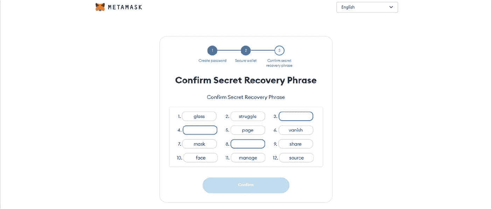
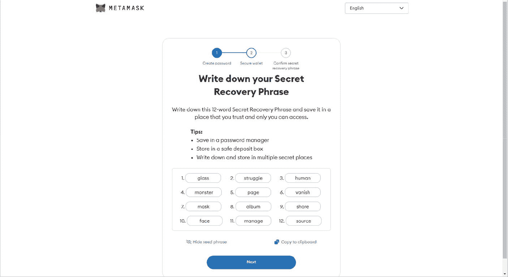
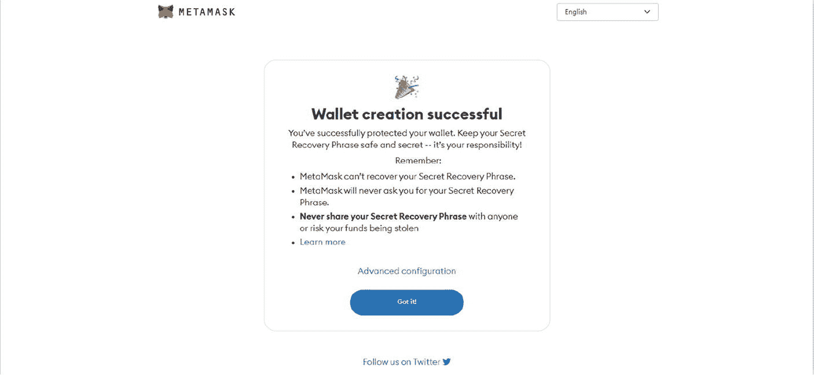
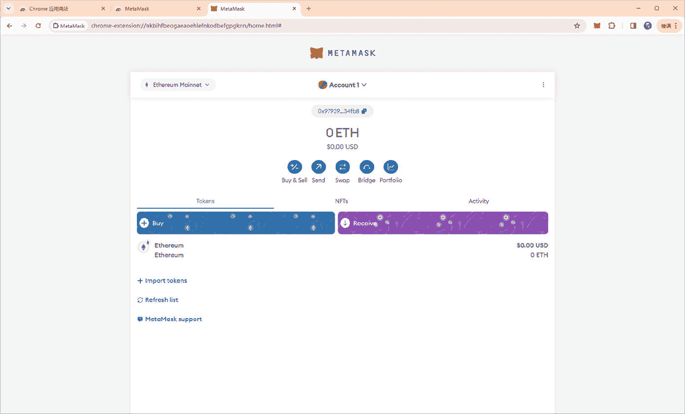
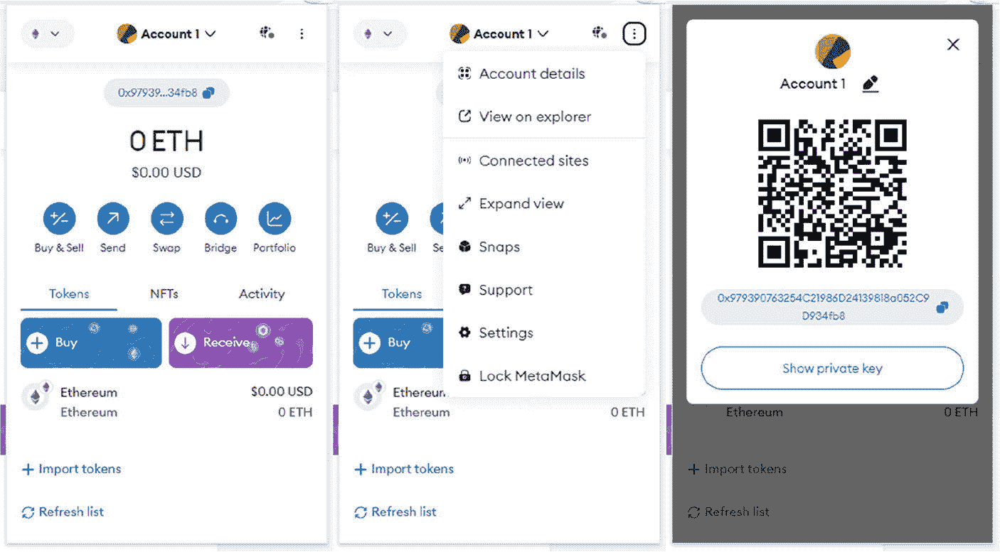
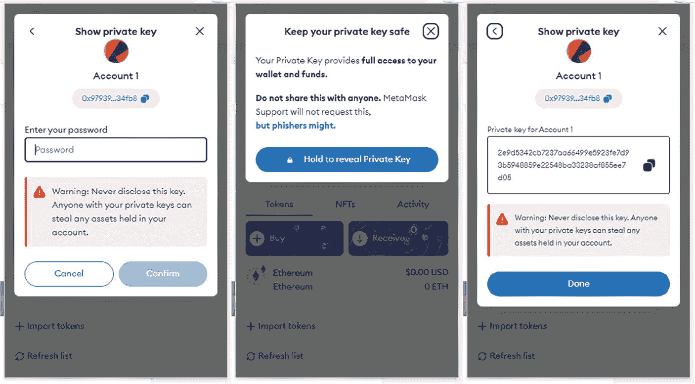
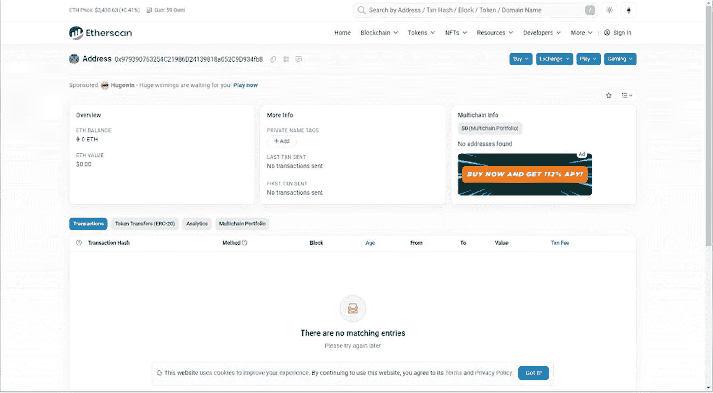
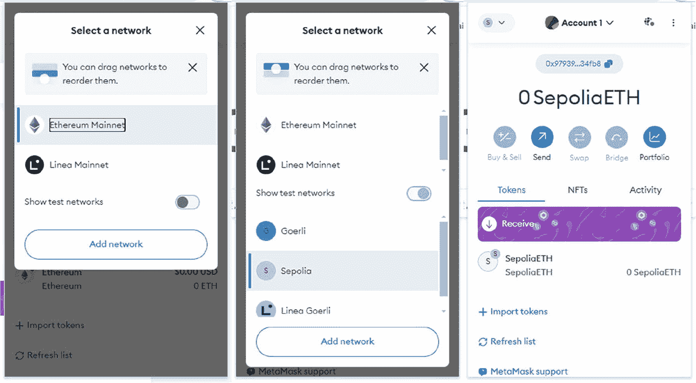
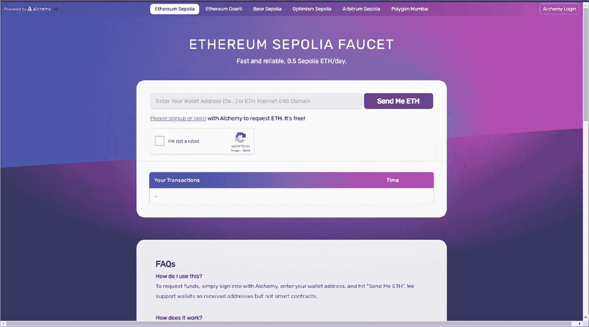

# 创建密码后

创建密码后，`MetaMask` 会提示您使用秘密恢复短语来保护您的钱包。该短语作为您钱包的主密钥，允许您在任何设备上重新获得对资金的访问权限。此关键步骤附有提示和最佳实践，以确保您的短语保持机密和安全。



**图 4-7** 确认秘密恢复短语



**图 4-6** 写下您的秘密恢复短语

`MetaMask` 将要求您写下并确认您的秘密恢复短语，以确保您准确记录了它。此过程强化了恢复短语的重要性，并有助于防止在记录短语时出现任何错误，如果您需要恢复钱包，这些错误可能会造成灾难性后果。



**图 4-8** 成功创建钱包

成功验证您的秘密恢复短语后，`MetaMask` 会确认您的钱包已创建并受到保护。最后的提醒强调了保密您的恢复短语的重要性，因为如果丢失，`MetaMask` 无法帮助您恢复它。现在，您已经准备好以 `MetaMask` 钱包为网关，进入 `Web3` 世界。

# 为钱包充值并与 DApp 交互

为您的 `MetaMask` 钱包充值后，您将迎来一个关键时刻，您在 `Web3` 领域的旅程真正开始。如下所示，此界面是您管理和使用以太坊及其他 `ERC20` 代币，以及与去中心化应用程序（`DApp`）交互的指挥中心。



**图 4-9** 导航您的 `MetaMask` 钱包界面

`MetaMask` 钱包提供了可直接从此屏幕访问的各种功能：
*   `购买与出售`：促进以太坊的购买和销售，有时通过集成的第三方服务进行
*   `发送`：允许您将以太坊或代币发送到区块链上的其他地址
*   `交换`：`MetaMask` 的内置功能，可直接在钱包内将一种代币兑换为另一种
*   `桥接`：在不同网络之间转移资产的功能，例如从 `Layer 2` 解决方案回到以太坊主网
*   `投资组合`：跟踪您的加密货币持有量及其当前市场价值

有了这些工具，您可以开始探索广阔的 `DApp` 领域。`MetaMask` 充当您的资产与去中心化交易所（`DEX`）、借贷平台和 `NFT` 市场等应用程序之间的安全桥梁。您执行的每笔交易都完全由您控制，从决定发起交易到设置交易费用。

此界面证明了 `MetaMask` 为 `Web3` 用户体验带来的简洁性和高效性，为新手和经验丰富的区块链爱好者提供了一个流线型和直观的门户。无论您是参与复杂的 `DeFi` 协议，还是仅仅管理您的数字资产组合，`MetaMask` 都能为您提供所需的工具，所有这些都可以从这个集中的仪表板访问。



**图 4-10** 您的 `MetaMask` 外部拥有账户钱包地址

当您从浏览器的工具栏打开 `MetaMask` 扩展时，您会看到一个简洁直观的界面，旨在让您的 `Web3` 之旅尽可能无缝。

单击右上角的三个点会显示一个包含大量选项的下拉菜单。从这里，您可以深入了解“账户详情”、“在浏览器中查看”以在区块链上查看您的交易，管理“已连接的站点”以及访问其他设置。此菜单是定制和保护您 `MetaMask` 体验的控制中心。

此视图提供了您钱包的快照，显示您的以太坊余额并提供对基本功能的快速访问。您可以在这里找到您唯一的以太坊地址，该地址既以传统的十六进制格式（`0x979390763254C21986D24139818a052C9D934fb8`）表示，也以二维码形式提供，便于共享和交易。您的公共地址就像您数字资产的邮箱；任何人都可以向此地址发送以太坊或代币，但只有您可以使用私钥访问和管理它们。

`MetaMask` 扩展中的警告屏幕提醒用户保护私钥安全的重要性。它解释说，私钥提供了对钱包和资金的完全访问权限，绝不应与任何人共享。网络钓鱼攻击通常以毫无戒心的用户为目标，以窃取此敏感信息。

在确认安全警告并输入密码后，您可以选择显示您的私钥。此密钥是您钱包种子短语的加密版本，并授予对您资金的完全控制权。始终保持此密钥的私密性和安全性至关重要。这只是一个示例，向您展示私钥是 `2e9d5342cb7237aa66499e5923fe7d93b5948859e22548ba33238af855ee7d05`，但在实际使用中，您绝不能分享您的私钥。



**图 4-11** 您的私钥

`12` 词恢复短语和私钥在钱包安全和访问中扮演着两个关键但不同的角色：

*   **`12` 词恢复短语**：也称为种子短语，这是您钱包主密钥的人类可读格式。它在您首次创建钱包时生成，可用于在任何设备上恢复对钱包的访问。此短语对于备份和恢复目的至关重要。
*   **私钥**：这是一个加密密钥，允许您签署交易并证明您对钱包及其内容的拥有权。它在数学上与您的公共地址相关联，并从您的种子短语生成。与可以重新生成整个钱包的种子短语不同，每个私钥对应您钱包中的一个特定地址。

种子短语和私钥对于保持对钱包的控制都是必不可少的，但绝不应向任何人透露。共享这些信息可能导致您的数字资产丢失。`MetaMask` 提供了一个以用户为中心的设计，强调安全性，确保用户了解这些凭证的重要性以及处理不当带来的风险。

当您在 `MetaMask` 钱包中单击“在浏览器中查看”时，您将被引导至 `Etherscan`，在那里您可以看到关于您钱包活动的详细信息数组，包括您的余额、交易以及任何相关的 `Gas` 费用。



**图 4-12** `Etherscan` 截图

# 以太坊浏览器：`Etherscan`

`Etherscan` 本质上是以太坊区块链的搜索引擎和分析平台。它允许你查看以太坊网络上的公共数据，例如交易、智能合约和地址。

`Etherscan` 的工作原理是从以太坊区块链中检索实时数据，维护这些数据的组织记录，并以易于导航的界面呈现给用户。它不会存储你的私钥，也不允许你进行交易；相反，它充当了链上活动、智能合约和交易的综合性数据库。

该平台被广泛用于各种目的，例如追踪钱包活动、检查交易和区块详情、读取和交互智能合约、检查实时 `Gas` 价格以估算交易费用等等。对于开发者而言，它提供了对其区块链浏览器数据的 `API` 访问，这对于创建去中心化应用程序特别有帮助。

你无需账户即可使用 `Etherscan`，但拥有账户可以为你提供额外功能，例如为你地址的交易设置提醒。重要的是，`Etherscan` 是一个工具，通过允许你监控钱包授权并在必要时撤销授权来帮助确保区块链交互的透明度和安全性，从而防止对你的资产进行未经授权的访问。

# 区块链新手的资源水龙头：`Faucets`

在蓬勃发展的区块链世界中，“水龙头”（`Faucet`）对于该领域的新手来说是一个关键的起点。水龙头是一种分发少量免费加密货币的系统，作为用户无需初始投资即可亲身体验加密货币交易的重要资源。这不仅提供了实践学习经验，还通过促进对区块链网络内交易过程的更深入理解来支持更广泛的生态系统。

水龙头的运作基于一个简单的机制：它通常由捐赠或广告提供资金，并被编程为按指定间隔或完成特定任务时释放少量加密货币。该工具在像以太坊的 `Goerli` 或 `Sepolia` 这样的测试网络中尤其重要，开发者和用户可以在无风险环境中模拟交易、测试应用程序并确保其项目的完整性。

水龙头的作用不仅仅是分发代币；它们也是空投概念的入门介绍。空投涉及将代币（通常是免费的）分发给区块链社区活跃成员的数字钱包，以鼓励参与或分发奖励。水龙头和空投都是支持区块链技术增长和可及性的基础设施的核心，为新进入该领域的人提供了基础路径。

用于以太坊水龙头的智能合约示例旨在用户请求时分发指定数量的 `ETH`。该合约包含以下特性：

*   可转让的所有权指定
*   每次请求分发的固定 `ETH` 数量
*   接收资金的捐赠功能
*   追踪已请求 `ETH` 的地址
*   限制每天只能请求一次的时间锁

以下是一个基于在线资源中描述的常见功能的简单 `Solidity` 智能合约示例，用于以太坊水龙头。

## 智能合约示例 – 水龙头

```solidity
pragma solidity ⁰.8.3;
contract ETHFaucet {
    address public owner;
    uint public dispenseAmount = 1 ether;
    mapping(address => uint) public lastAccessTime;
    constructor() payable {
        owner = msg.sender;
    }
    modifier onlyOwner {
        require(msg.sender == owner, "Only the owner can call this function.");
        _;
    }
    function requestEth() public {
        require(address(this).balance >= dispenseAmount, "Insufficient funds in faucet.");
        require(lastAccessTime[msg.sender] + 1 days < block.timestamp, "Wait 24h");
        payable(msg.sender).transfer(dispenseAmount);
        lastAccessTime[msg.sender] = block.timestamp;
    }
    function donateToFaucet() public payable {}
    function setDispenseAmount(uint newAmount) public onlyOwner {
        dispenseAmount = newAmount;
    }
}
```

该合约允许用户每 `24` 小时请求一次固定数量的 `ETH`，并允许向水龙头捐款。所有者可以设置分发数量。请记住，在真实部署中，还需要进行额外的安全检查与优化。此代码仅用于教育目的，在主网上使用前应进行彻底审计。

为了说明使用水龙头的过程，我们以以太坊测试网络 `Sepolia` 为例。要接收测试 `ETH`（`SepoliaETH`），需要执行以下步骤：

1.  要使用 `MetaMask` 开始使用以太坊的 `Sepolia` 测试网络，请在浏览器中打开 `MetaMask` 扩展程序。在 `MetaMask` 界面顶部显示网络的位置，点击打开网络选择下拉菜单。如果测试网络不可见，请打开“显示测试网络”选项。从可用网络列表中，选择“Sepolia”。然后 `MetaMask` 将切换到 `Sepolia` 测试网络，你的账户将连接到该网络。

    现在你可以与 `Sepolia` 网络交互，该网络镜像了以太坊主网环境，允许你无需使用真实 `ETH` 即可测试交易和智能合约交互。请记住确保 `MetaMask` 中显示的钱包地址正确，并且你可以访问该钱包的私钥或助记词。

    

    图 4-13：`Sepolia` 网络

2.  访问一个信誉良好的 `Sepolia` 水龙头网站，例如由 `Alchemy` 提供的（[`www.alchemy.com/faucets/ethereum-sepolia`](http://www.alchemy.com/faucets/ethereum-sepolia)）。在此平台上，你可以请求免费的 `Sepolia` `ETH` 用于测试目的。

    

    图 4-14：`Alchemy` `Sepolia` 水龙头（来源：[`www.alchemy.com/faucets/ethereum-sepolia`](https://www.alchemy.com/faucets/ethereum-sepolia)）

    这些网站通常要求你：

    *   登录或创建一个水龙头提供者的账户。
    *   在指定字段中输入你的 `Sepolia` 钱包地址。
    *   完成任何必要的安全检查，例如 `CAPTCHA` 验证，以确认你不是机器人。
    *   点击“发送 ETH 给我”或类似的按钮，在你的钱包中接收测试 `ETH`。

    使用 `Sepolia` 水龙头时，每天最多可以请求 `0.5` 个 `Sepolia` `ETH`。此限制旨在确保用户之间的公平分配，并模拟通常存在交易限额的真实环境。每天提供的测试 `ETH` 允许开发者和测试人员进行大量交易并测试各种区块链操作，而无需担心资金过快耗尽。这是在 `Sepolia` 测试网上进行持续开发和测试的理想设置。请记住，提供的测试 `ETH` 没有实际价值，仅用于 `Sepolia` 测试网环境内的测试和开发活动。

3.  在 `Sepolia` 水龙头网站输入你的钱包地址并完成任何必要的验证步骤后，你只需等待大约 `10-15` 秒。一旦请求被处理，你的 `MetaMask` 钱包中将收到 `0.5` 个 `Sepolia` `ETH`，如图 `4-15` 所示。

### 图 4-15
`MetaMask` 钱包上的更新余额 – `Sepolia`

此交易虽未在以太坊主网上进行，但可在 `Etherscan` 的 `Sepolia` 测试网版本上验证。只需在 `Etherscan` 页面角落查找 `Sepolia` 测试网指示器即可。这使您能够追踪交易并确认测试 `ETH` 已记入您的账户。

### 图 4-16
`Sepolia` 测试网 `Etherscan`（来源：[https://sepolia.etherscan.io/](https://sepolia.etherscan.io/)）

此过程不仅允许新手免费获取测试资产，还能让他们直接与区块链环境交互，从而促进对其操作原理及潜在应用的实际理解。

# 通过 `Layer 2` 解决方案拓展视野

以太坊网络上的 `Layer 2` 解决方案至关重要，因为它们解决了去中心化、可扩展性和安全性这三难问题的区块链困境。区块链三难困境指出，同时实现这三个特性极具挑战性；通常情况下，区块链只能在其中两个方面表现出色。以太坊与其他 `Layer 1` 区块链一样，是去中心化且安全的，但在可扩展性方面一直面临挑战，尤其是随着网络的发展和区块空间需求的增加。这导致在拥堵期间出现高额交易费用和较慢的处理时间。

### 图 4-17
区块链三难困境

Layer 2 解决方案（如 `Rollups`）旨在通过在主链之外处理交易来缓解这些问题，从而提高吞吐量并降低成本，同时不影响网络的去中心化或安全性。`Rollups` 的工作原理是将多笔交易分组或“卷起”成一笔交易，然后提交至以太坊主链。此过程有助于缓解网络拥塞，并使交易更快、更便宜。

`Rollups` 主要有两种类型：`Optimistic Rollups` 和 `ZK-Rollups`。`Optimistic Rollups` 默认假设交易有效，仅在出现挑战时运行计算；而 `ZK-Rollups` 使用零知识证明来验证交易的有效性，而无需透露其内容。两者各有优缺点和权衡。例如，`ZK-Rollups` 提供更快的交易速度和更低的费用，但需要更复杂的环境，可能导致中心化。另一方面，`Optimistic Rollups` 更易于实现，但存在一个挑战期，可能会延迟提现。

以下是基于几个关键因素的差异总结：

1.  **安全性**：`Optimistic Rollups` 依赖欺诈证明和经济激励来确保交易有效性，只需一个诚实节点即可挑战欺诈。然而，这意味着安全性依赖于诚实参与者的存在。另一方面，`ZK-Rollups` 使用加密证明（零知识证明）来验证交易，提供数学上的安全保障，无需依赖人工验证者。
2.  **成本**：`Optimistic Rollups` 通常计算成本较低，因为它们不需要专门的硬件来进行欺诈证明。然而，它们会将所有交易数据发布到以太坊主链，这可能会增加成本。`ZK-Rollups` 可以通过高效的数据压缩技术降低成本，但生成加密证明对硬件要求更高，这可能使用户成本更高。
3.  **交易最终性**：在 `Optimistic Rollups` 中，存在一个挑战期，可能会延迟交易的最终确认。`ZK-Rollups` 由于有效性证明，可以立即提现，这些证明能无延迟地确认交易的真实性。
4.  **EVM 兼容性**：`Optimistic Rollups` 与以太坊虚拟机 (`EVM`) 兼容，使开发者更容易迁移现有的基于以太坊的应用程序。`ZK-Rollups` 不完全兼容 `EVM`，这可能会给开发者带来更高的门槛。

至于具体的项目示例，`Arbitrum` 和 `Optimism` 等 `Optimistic Rollups` 已被 `Uniswap` 和 `SushiSwap` 等基于以太坊的去中心化交易所使用。`ZK-Rollups`，例如 `Polygon ID` 用于私有链上验证的方案，提供了高标准的安全性和隐私性，这对于身份验证协议至关重要。

表 4-2 展示了使用这些技术的项目对比。

**表 4-2** Optimistic Rollups 与 ZK-Rollups 对比

| 特性 | Optimistic Rollups 示例 | ZK-Rollups 示例 |
| --- | --- | --- |
| EVM 兼容性 | `Arbitrum`, `Optimism` | `Polygon zkEVM`, `Scroll zkEVM` |
| 交易成本 | 较低，因为链上数据量最小 | 可能更高，由于需要生成证明 |
| 安全性 | 基于经济激励和欺诈证明 | 基于加密证明 |
| 用例 | DeFi 应用、去中心化交易所 | 身份验证、私有加密货币交易 |

这些示例突显了在 `Optimistic` 和 `ZK-Rollups` 之间的选择可能取决于项目的具体需求和优先级，例如成本考量、安全要求以及期望的 `EVM` 兼容性水平。⁴

Layer 2 解决方案的开发和实施对以太坊的未来至关重要，因为它们为更高的可扩展性提供了途径，这对于更广泛的采用和网络的整体增长是必要的。随着 `以太坊 2.0` 和分片技术的到来，效率和交易吞吐量预计将进一步提高，从而巩固网络在区块链生态系统中的地位​​​​。⁵^、⁶

### 4.4 本章小结

本章探讨了 Web3 的基础组件，重点介绍了以太坊的钱包、水龙头和 Layer 2 解决方案。首先强调了区块链钱包的关键作用，它不仅作为数字存储解决方案，更是个人进入去中心化网络的门户。强调了外部拥有账户（`EOA`）和合约账户之间的区别，并以 `Coinbase 钱包` 和 `MetaMask` 为例，说明了用户如何安全地管理数字资产和身份。

接着，本章过渡到水龙头的概念，即分发少量加密货币的工具，主要用于像 `Goerli` 和 `Sepolia` 这样的测试网络。这些水龙头允许用户（尤其是新手）在没有经济风险的情况下接触区块链技术，帮助他们以实践动手的方式理解交易流程。

最后，讨论了 Layer 2 解决方案及其在克服以太坊可扩展性挑战方面的重要性。分析了 `Optimistic Rollups` 和 `ZK-Rollups` 等技术，展示了它们在安全性、成本和交易最终性方面各自的优势和权衡。这些解决方案对于解决区块链三难困境、确保以太坊在保持去中心化和安全性的同时实现扩展至关重要。

通过探索，本章强调了以太坊及其生态系统的持续演进，将其定位为 Web3 基础设施发展的领导者。

### 注释

1.  Chittoda, J. (2019). *精通 Solidity 区块链编程*. Packt Publishing. 第 29–30 页。
2.  Coinbase.com 与 Coinbase 钱包有何区别？| Coinbase 帮助 (2022). [`https://help.coinbase.com/en/wallet/getting-started/what-s-the-difference-between-coinbase-com-and-wallet`](https://help.coinbase.com/en/wallet/getting-started/what-s-the-difference-between-coinbase-com-and-wallet)（访问日期：2024 年 4 月 9 日）。
3.  Coleman, I. (2019). BIP39 – 助记词编码. [`https://iancoleman.io/bip39/`](https://iancoleman.io/bip39/)（访问日期：2024 年 4 月 9 日）。
4.  Synfutures Academy. (2021). 乐观汇总 vs. 零知识汇总：有何区别？SynFutures Academy | 区块链、加密货币、DeFi 及加密衍生品. [`https://academy.synfutures.com/optimistic-vs-zk-rollups/`](https://academy.synfutures.com/optimistic-vs-zk-rollups/)（访问日期：2024 年 4 月 9 日）。
5.  第二层 | Ethereum.org (n.d.). ethereum.org. [`https://ethereum.org/en/layer-2/`](https://ethereum.org/en/layer-2/)（访问日期：2024 年 4 月 9 日）。
6.  Deutscheda (2024 年 3 月 30 日). 第二层解决方案如何帮助以太坊扩容 – Deutsche Digital Assets. Deutsche Digital Assets. [`https://deutschedigitalassets.com/insights/news/ethereum-layer-2-solutions/`](https://deutschedigitalassets.com/insights/news/ethereum-layer-2-solutions/)（访问日期：2024 年 4 月 9 日）。