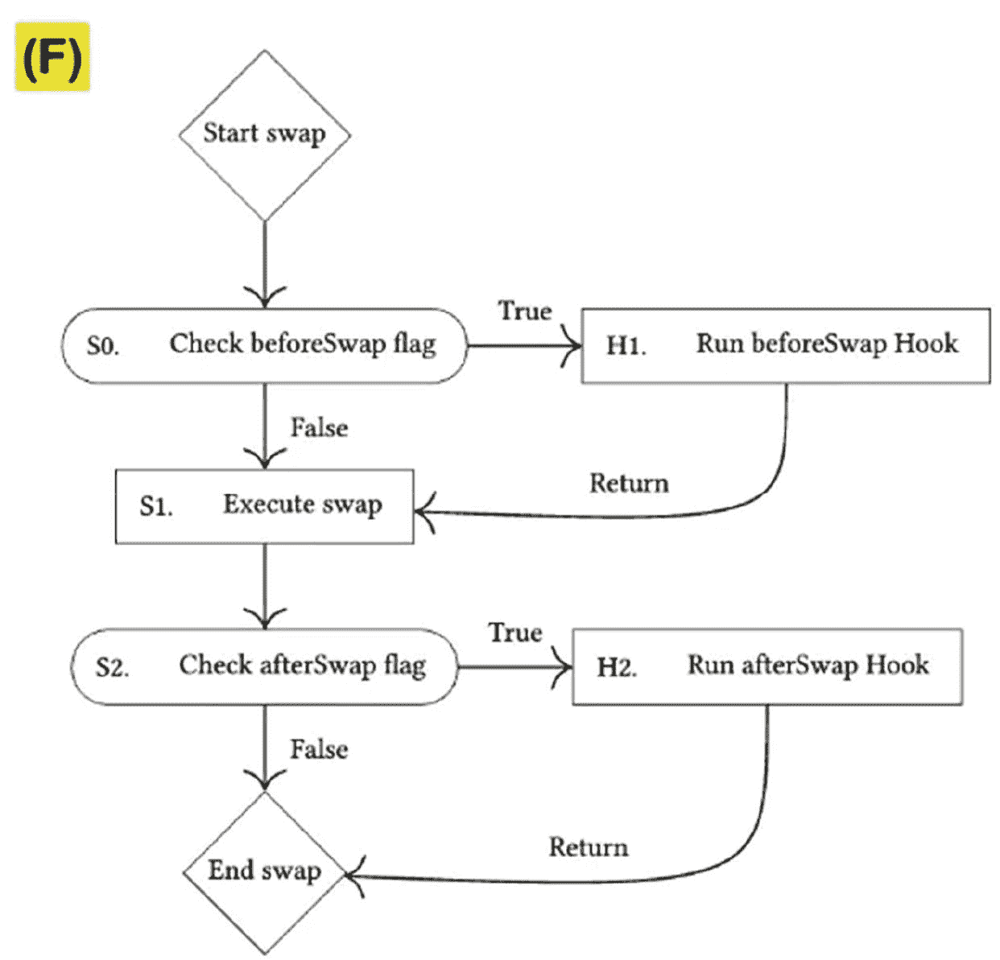

# 5. 去中心化金融（DeFi）的崛起

### 5.1 DeFi 的核心概念与应用

去中心化金融（DeFi）涵盖了基于区块链技术的广泛金融服务，其运作独立于银行、经纪公司或交易所等传统金融中介机构。DeFi 应用利用以太坊等区块链上的智能合约，提供了一个无需中心化权威机构即可进行借贷、交易、投资和风险管理的平台。

DeFi 通过利用最初由比特币推广的区块链技术，彻底改变了金融交易。与依赖银行和信用卡公司等中心化实体的传统金融系统不同，DeFi 运行在分布式账本上，实现了去中心化和透明的交易流程。这种模式消除了对中介机构的需求，让用户能更好地控制自己的资金，并实现更快、更复杂的金融操作。

比特币的出现展示了数字资产无需中间人即可促进直接交易的潜力，这与 Visa 和 PayPal 等传统数字支付系统形成鲜明对比。在传统环境中，金融机构充当守门人，在其私有账本上控制和记录交易。然而，DeFi 消除了这些中介，确保诸如购买咖啡或从事贷款、保险和衍生品等复杂金融活动等交易直接在相关方之间执行。

DeFi 最初被称为“开放金融”，它将区块链的效用从单纯的价值转移扩展到了广泛的金融应用领域。这种向更开放、更包容、更高效的金融生态系统的转变，挑战了中心化控制模式，倡导一个由区块链上的协议和智能合约来管理交易和金融服务的系统。这不仅增强了透明度和安全性，还将金融服务开放给更广泛的全球人口，促进了金融普惠。

**DeFi 的核心概念**

*   **智能合约与区块链**：DeFi 的基础是智能合约，即买方和卖方之间的协议条款被直接写入代码行的自动执行合约。这些合约运行在区块链技术上，确保了透明度、不可篡改性和去中心化。
*   **无需许可**：DeFi 平台通常是无需许可的，这意味着任何有互联网连接的人都可以访问它们，无需任何管理机构的批准。这一特性促进了金融包容性和平等性。
*   **互操作性与可组合性**：DeFi 协议通常被称为“金融乐高”，被设计为可互操作和可组合的，允许通过无缝组合不同的 DeFi 产品来创建复杂的金融服务。
*   **去中心化**：不同 DeFi 平台的去中心化程度各不相同，取决于治理模型、智能合约的自主性以及代币所有权的分布等因素。真正的去中心化消除了对中央权威的信任需求，取而代之的是对代码的信任。
*   **内在特性**：从中心化系统（传统金融）向去中心化系统的转变引入了一种新的金融范式，这种范式无需许可、包容性强，并且由于依赖于透明且不可篡改的区块链技术，通常被称为“去信任化”。
*   **功能差异**：与传统金融依赖中心化实体和复式记账法不同，DeFi 利用区块链技术构建了覆盖整个经济的三式记账系统，提高了透明度和效率。
*   **操作差异**：DeFi 操作更加透明且非托管，使用户能够完全控制自己的资产，无需中介机构。这与传统金融服务不透明且托管的特性形成对比。
*   **监管格局**：DeFi 的监管框架正在演变。虽然 DeFi 在“代码即法律”的前提下运作，但现有法律法规仍然适用，这凸显了在创新与消费者保护之间取得平衡的必要性。

#### DeFi 与传统金融

DeFi 代表了从传统金融向一种更加开放、高效且包容的金融体系的变革性转变，该体系利用了区块链技术。与传统金融的中心化、需许可的框架不同，DeFi 提供了一个无需许可且透明的环境，消除了中介机构并缩短了交易时间。它通过智能合约引入创新的金融服务，确保即时结算，并促进了一个无需信任的生态系统，在该系统中，交易不可逆且可公开验证。虽然传统金融受益于成熟的监管实践和用户熟悉度，但 DeFi 通过提供非托管资产控制和促进快速技术创新来挑战这些规范。这种演变突显了推动金融民主化的关键运动，尽管它也强调了用户需要独立应对新兴风险和监管环境的必要性。¹

**表 5-1** 传统金融与 DeFi 的多维度对比²

| 维度         | 传统金融 (TradFi)                        | 去中心化金融 (DeFi)                                 |
| :----------- | :--------------------------------------- | :-------------------------------------------------- |
| 访问权限     | 许可制模式，具有排他性和受控的访问权限   | 无需许可的模式，提供包容性和不可篡改性              |
| 数据完整性   | 分段式，依赖中介机构                     | 可组合、可互操作的“货币乐高”                        |
| 互操作性     | 由于中心化控制而受限                     | 高，由区块链技术促进                                |
| 结算         | 由于中介存在，可能需要数天（T+日）       | 通过智能合约实现即时结算                            |
| 价值表示     | 使用数据记录名义价值，通常与现实世界资产挂钩 | 将数据本身视为价值，由区块链验证交易                 |
| 记账方式     | 需要人工对账的复式记账系统               | 以区块链作为不可变记录的三式记账系统                |
| 信任机制     | 中心化机构作为受信任的中介               | 无需信任的系统，规则由代码强制执行                    |
| 数据可用性   | 交易历史私密且受控                       | 交易历史可公开访问且透明                            |
| 创新速度     | 渐进式和维持性，适应新技术较慢           | 激进式和颠覆性，快速适应和创新                      |
| 用户体验     | 成熟且用户友好，但创新能力受限           | 新兴且通常需要技术知识，但高度创新                  |
| 风险管理     | 通过法规和既定实践进行管理               | 个人负责理解和管理风险                              |
| 交易可逆性   | 可逆，并有可能修改权限                   | 大多不可逆，交易仅能追加                            |
| 资产托管     | 托管式，中介机构控制资产                 | 大多为非托管式，用户掌控自己的资产                  |
| 监管合规     | 受到严格监管，有明确指导方针             | 新兴的监管环境，由代码和法律共同定义运营规则        |
| 透明度       | 运营不透明，仅向当局披露有限信息         | 完全透明，所有操作可在区块链上验证                  |

DeFi 领域充满了正在重塑金融业的应用。这些平台利用区块链的力量提供从交易所和借贷到稳定币和保险等服务，每个都旨在实现金融的去中心化和民主化。³, ⁴, ⁵ 表 5-2 展示了 DeFi 覆盖范围的广度，突出了代表这个金融独立和互操作性新时代的关键参与者和创新。

**表 5-2** DeFi 应用

| DeFi 应用类别             | 示例/平台                                                                 |
| :------------------------ | :------------------------------------------------------------------------ |
| 去中心化交易所 (DEXs)     | Uniswap, 1inch, SushiSwap, Balancer, dYdX, PancakeSwap                    |
| 借贷平台                  | Aave, Compound, Dharma                                                    |
| 稳定币                    | Dai, Gemini Dollar                                                        |
| 保险                      | Etherisc, Nexus Mutual                                                    |
| 预测市场/预言机           | Chainlink, Band Protocol, Pyth                                            |

#### 去中心化交易所 (DEXs)

去中心化交易所已成为加密货币领域不可或缺的一部分，它通过直接在用户之间进行点对点的加密货币交易，为传统的中心化交易所提供了一种替代方案。DEXs 利用以太坊等区块链平台上的智能合约来执行交易，无需中介机构，在整个交易过程中保留了用户对其私钥的控制权和所有权。

DEXs 的概念建立在“去中介化”的精神之上，旨在消除金融交易中的中间环节。由于众多优势，这种方法导致 DEXs 的受欢迎程度激增，这些优势包括可用代币种类更广泛、用户匿名性增强、交易对手风险降低以及安全性提高，因为用户始终掌握其资金的保管权。这些优势源于 DEXs 允许用户直接从其钱包进行交易，而无需将其资产的控制权交给交易所。

DEXs 有多种模式，每种模式都针对去中心化交易的不同方面：

*   **自动做市商 (AMMs)**：该模式取消了传统的订单簿，使用流动性池和智能合约来设定资产价格。AMMs 因其能够提供流动性并允许通过流动性挖矿赚取利息而广受欢迎。

*   **链上订单簿**：在此模式下，所有订单及其修改和取消操作都记录在区块链上。虽然这种方法提供了高透明度，但由于相关的费用和区块链处理时间可能造成的延迟，它可能不太实用。

*   **链下订单簿**：这些 DEXs 将订单存储在区块链之外，仅使用区块链进行交易结算。这种方法可以在去中心化交易和中心化交易所常见的更快执行速度之间取得平衡。

*   **DEX 聚合器**：这些协议从多个 DEXs 获取流动性，以寻找最高效的交易路径，从而可能为用户提供更好的价格和更低的滑点。

尽管有诸多优势，DEXs 也伴随着挑战，例如在网络拥堵时可能产生更高的费用、与中心化交易所相比交易量和流动性较低，并且对于刚接触加密货币领域的人来说可能不太友好。此外，DEXs 的去中心化特性意味着用户必须谨慎保护自己的私钥，因为丢失私钥就等于资金不可挽回。

DEXs 格局在不断发展，新的创新旨在融合不同模式以提升效率和用户体验。随着 DeFi 领域的发展，DEXs 预计将持续创新并增加使用量，这与强调自我主权和无需信任交易的区块链与加密货币的基本精神相一致。⁶, ⁷

#### 借贷平台

在 DeFi 生态系统中，贷款主要以超额抵押的形式进行，这意味着借款人必须提供超过其贷款金额的抵押品。这个概念乍看之下可能有些反直觉——如果必须锁定价值更高的资产作为抵押，为什么还要借款？答案在于 DeFi 领域中借款人和贷方各自的激励因素。贷方参与的主要动机是获得补偿，通常以利息或可在市场上出售的治理代币形式实现，从而带来潜在利润。另一方面，借款人可以利用这些贷款进行杠杆操作，以维持对其预期会升值的抵押资产的敞口，或者为了提高资本效率，将原本闲置的资产用作抵押品。

抵押是 DeFi 中降低金融风险的关键机制。由于区块链和智能合约不依赖传统信用评分来评估借款人风险，超额抵押充当了防范违约的缓冲垫。如果借款人未能偿还，抵押品将被清算以弥补贷方的损失，这与传统金融（TradFi）系统形成对比，后者使用信用评分、监管机制和法律执行相结合的方式来管理违约风险。

闪电贷代表了一种新颖的 DeFi 借贷机制，即贷款在同一交易区块内发放并偿还。它们无需抵押，因为它们依赖于一个独特原则：由于区块链交易的原子性，如果贷款在交易结束时无法偿还，那么它就好像从未发生过一样。这种机制允许进行复杂的金融操作，如套利、抵押品互换和自清算贷款，为 DeFi 用户提供了强大的工具，使其能够利用这些功能，而无需像抵押贷款那样要求同等的资本。

DeFi 借贷平台的实际案例包括 Aave 引入的闪电贷，它为交易者和套利者开辟了新的策略；以及 MakerDAO 的抵押债务头寸（CDPs），允许用户用其 ETH 抵押品铸造 DAI。这些创新机制通过将金融操作范围扩展到传统银行系统无法触及的领域，推动了 DeFi 的增长。

#### 稳定币

稳定币是 DeFi 生态系统的重要组成部分，旨在相对于目标价格（通常是像美元这样被广泛认可的资产）保持稳定价值。这些数字货币通过各种机制实现价格稳定，并且可以以中心化和去中心化两种形式发行。

稳定币大致可根据两个主要标准进行分类：

1.  中心化/去中心化程度
    *   **托管型或中心化稳定币**：由中心化实体发行和管理，通常由法币或其他资产的储备支持。
    *   **非托管型或去中心化稳定币**：在区块链技术上运行，没有中心化的管理机构，使用链上抵押品或算法来维持其价值。

2.  维持锚定机制
    *   **储备支持型**：这些稳定币持有资产储备（如法币、商品，有时也包括其他加密货币）来支撑其价值。
    *   **抵押支持型**：类似于储备支持型，但专门使用加密货币作为抵押品，这可能会更加波动。
    *   **算法型**：没有储备，而是使用一组算法来管理稳定币的供应量以维持其锚定。
    *   **混合型**：这些稳定币结合使用上述方法来维持价格稳定。

每种类型在资本效率、去中心化程度和价格稳定性方面都有其自身的权衡。例如，储备支持型稳定币通常被认为更稳定、资本效率更高，但可能缺乏去中心化。抵押支持型稳定币是去中心化和透明的，但资本效率可能较低。算法型稳定币提供了去中心化和资本效率，但有时在维持锚定方面可能不够稳定。

稳定币的选择取决于用户对去中心化的偏好、对发行者的信任以及在 DeFi 生态系统中的预期用途。

#### 保险

在 DeFi 的去中心化背景下，保险至少有兩種不同的解释方式。一种更广泛的解释涵盖了针对所有可能事件的保障，无论这些事件发生在链上还是链下，线上还是线下。这种广泛的方法由去中心化预测市场促成，该市场允许针对未来事件的各种潜在结果创建和交易份额。此类市场采用具有博弈论基础的去中心化协议，以确保事件报告的真实性，并防止任何单一参与者进行操纵。这些机制特别适用于针对多种场景的保险，从恶劣天气到中心化合作伙伴的破产，尽管它们需要足够的流动性才能有效。

另一方面，去中心化保险的狭义解释则专门聚焦于 DeFi 领域，为与 DeFi 协议相关的故障或风险提供保障。这包括针对技术风险（如智能合约故障）、在极端市场条件下可能出现的流动性或财务风险，以及协议可能未完全去中心化的管理密钥风险。

例如，Nexus Mutual 是一个 DeFi 保险协议，为以太坊区块链上其他智能合约的技术风险和漏洞提供保障。它允许用户购买特定期限和金额的保险，并设有独立的理赔评估流程，以在智能合约发生故障时确定理赔的有效性。⁸

类似地，Opyn 不仅为智能合约故障提供保险，还覆盖流动性、财务和管理密钥风险。它使用期权来对冲这些意外事件。例如，通过 Opyn，用户可以在 Compound 等平台上购买针对稳定币存款的看跌期权，确保在协议故障或安全漏洞发生时，能够以预定汇率出售其持有的稳定币。⁹

这些保险协议通过提供符合去中心化原则的创新解决方案，为 DeFi 的风险管理生态系统做出了贡献。它们为用户提供了保护其投资免受这一新兴金融技术领域中固有各种风险影响的机制。

#### 预测市场/预言机

预测市场和预言机通过赋能创新金融工具以及信息聚合与传播机制，在去中心化金融（DeFi）生态系统中扮演着至关重要的角色。

以下是关于它们的功能、重要性以及该领域一些领先平台的深入探讨：

1.  预测市场
    *   **功能**：DeFi 中的预测市场使参与者能够基于未来事件的结果买卖合约，类似于博彩或期货市场，但范围更广，包括选举结果或天气预报等非金融结果。这些市场利用区块链技术和智能合约创建去中心化平台，无需中心化机构来撮合买卖双方。像 `Augur` 和 `TotemFi` 这样的平台是突出的例子，它们利用以太坊的 `ERC20` 协议创建用户生成的市场，并提供低费用和创新的奖励机制。

    *   **相对于中心化市场的优势**：DeFi 预测市场相比中心化市场具有显著优势，包括全球可访问性、减少对中介的需求、更低的费用、增强的隐私性以及使用数字资产参与的能力。得益于区块链技术和智能合约，这些市场通常也具有更强的流动性，并且能够更快地进行创新。

2.  预言机
    *   **预言机问题**：智能合约虽然自主运行，但无法独立访问链下数据，这就产生了“预言机问题”。预言机通过在区块链和外部世界之间充当数据馈送来解决这个问题，使智能合约能够基于现实世界事件执行。然而，设计安全、可靠且去中心化的预言机颇具挑战性，存在数据准确性、操纵和中心化风险等问题。

    *   **预言机设计**：预言机的设计各不相同，从中心化（单一数据源）到去中心化（多个数据源达成共识）。每种设计在速度、安全性和可靠性方面都有其权衡。中心化预言机速度更快，但存在单点故障风险；而去中心化预言机提供了更高的安全性和抗操纵性，但代价是速度和效率。像 `Chainlink` 和 `Tellor` 这样的创新平台代表了预言机技术的进步，提供了安全准确地将链下数据提供给链上智能合约的解决方案。

    *   **重要性**：预言机对于众多 DeFi 应用（包括预测市场、借贷平台和保险合约）的功能至关重要，它确保这些应用能够以无需信任的方式与现实世界数据交互。可靠预言机的开发和集成对于 DeFi 生态系统的增长和稳定性至关重要。

总之，预测市场和预言机是 DeFi 领域的基础组成部分，它们提供了对未来事件进行去中心化投注的机制，并安全地弥合了区块链应用与外部数据之间的鸿沟。它们的持续演进和采用对于 DeFi 领域旨在创建一个开放、透明和可访问的金融系统这一目标至关重要。

### 5.2 主流 DeFi 协议分析

DeFi（去中心化金融）生态系统由多种协议组成，每种协议都为更广泛的金融格局贡献了独特的功能、机制和影响。在该领域中最具影响力的包括 `Uniswap`、`Aave` 和 `MakerDAO`。它们在流动性提供、借贷和稳定币发行方面各自扮演着关键角色。以下是对每种协议的深入探讨，以及基于总锁仓价值（TVL）、用户采用率及其对金融格局的变革潜力对其性能和影响的评估。

#### Uniswap

`Uniswap` 的发展历程以持续创新和适应 DeFi 生态系统不断变化的需求为特征。这一历程反映了从其初始版本到最新版本的一系列重大升级，体现了该协议致力于改善流动性、交易效率和用户体验的承诺。

**表 5-3** `Uniswap` 的演进¹⁰^, ¹¹

| V0 和 V1 | `Uniswap` 的旅程始于 2017 年一个原型的创建，随后于 2018 年 11 月正式推出 `Uniswap V1`。`V1` 将自动化做市商 (`AMM`) 机制引入以太坊区块链，无需传统订单簿即可进行无需许可的代币交易。该版本使用恒定乘积模型进行定价，为 `Uniswap` 的未来迭代奠定了基础。 |
| V2 | 于 2020 年 5 月推出的 `Uniswap V2` 引入了重大增强功能，例如支持 `ERC20` 到 `ERC20` 的兑换，以及引入时间加权平均价格 (`TWAP`) 预言机。此版本标志着 `Uniswap` 成为 DeFi 领域的关键参与者，显著增加了其市场关注度和用户基础。 |
| V3 | 2021 年 5 月，引入了 `Uniswap V3`，带来了集中流动性这一创新概念。这允许流动性提供者在特定价格范围内分配资本，优化资本效率并提供更好的收入机会。`V3` 还提高了 `TWAP` 预言机的效率，并引入了多个费用层级，以满足流动性提供者不同的风险偏好。 |
| V4 | 随着 `Uniswap V4` 的开发，演进仍在继续，旨在进一步提高灵活性和 Gas 效率。它通过钩子（hooks）引入了可定制的池，允许开发者使用新功能增强集中流动性模型。此版本还朝着所有池采用单一合约模式迈进，显著降低了与池创建和交易相关的部署成本和 Gas 费用。此外，`V4` 重新引入了对原生 `ETH` 的支持，简化了交易并可能降低 Gas 成本。 |

`Uniswap` 的每个版本都逐步解决了其前代版本的局限性，引入了对 DeFi 生态系统产生重大影响的新功能。从促进简单的 `ERC20/ETH` 交易，到支持复杂的集中流动性头寸和可定制的池功能，`Uniswap` 的演进反映了 DeFi 领域的整体增长和日益复杂化。这种持续创新巩固了 `Uniswap` 作为 DeFi 关键基础设施组件的地位，支持着广泛的应用和服务，同时为用户提供更高效、更灵活、更具成本效益的交易解决方案。

**图 5-1** 兑换钩子流程¹¹

`Uniswap V4` 的“钩子”功能使开发者能够在协议流程的特定阶段实现专门功能。这包括诸如时间加权平均做市商 (`TWAMM`) 之类的功能，用于在不产生显著价格影响的情况下随时间执行大额订单，以及允许用户为交易设定特定价格点的链上限价单。此外，还可以使用这些钩子创建基于波动性的动态费用调整机制和用于捕获最大可提取价值 (`MEV`) 并将其返还给流动性提供者的机制。

钩子的引入是 `Uniswap` 相较于之前版本的一项重大增强，旨在为开发者提供构建更复杂、更高效金融产品所需的工具，同时优化平台的交易流程和费用结构。这展示了 `Uniswap` 在 DeFi 领域持续推动创新和适应性的努力。

**表 5-4** `Uniswap`：重新定义 DeFi 的可访问性和效率¹²

| 传统金融面临的挑战 | Uniswap 的解决方案 |
| --- | --- |
| **中心化**：市场准入和交易对组合受到中心化机构的严格控制。 | **去中心化**：Uniswap 的开放协议允许任何人创建或交易任何交易对，提升了市场的包容性。 |
| **流动性有限**：传统上，大型机构主导着做市和流动性供给。 | **流动性民主化**：Uniswap 使个人流动性提供者能够为池子做出贡献并赚取费用，实现了做市准入的民主化。 |
| **交易效率低下**：由于依赖中介机构进行清算和结算，交易可能较为缓慢。 | **即时结算**：利用智能合约，Uniswap 无需中介即可实现近乎即时的交易。 |
| **资产交换受限**：在不同平台之间交换资产可能繁琐且受限。 | **跨协议交换**：Uniswap 促进了大量资产的无缝交换，推动了更集成的 DeFi 生态系统。 |
| **运营不透明**：传统系统在运营中往往缺乏透明度，导致信任问题。 | **流程透明**：凭借开源代码和链上交易，Uniswap 为自身运营提供了完全的可见性。 |

总而言之，Uniswap 通过利用基于区块链的去中心化解决方案，解决了传统金融中的根本性低效问题。通过促进一个无需许可且透明的环境，它提供了无与伦比的访问权限和灵活性，正在重塑金融生态系统。Uniswap 证明了 DeFi 有潜力提供一种比传统金融体系更具包容性和效率的替代方案。

#### Aave

Aave 是一个开源且非托管的流动性协议，用户可以通过该协议在存款上赚取利息并借入资产。它已经历了多个版本的迭代，每个版本都引入了更复杂的功能，推动了 DeFi 借贷领域的发展。

**Aave V1** 是该协议的初始版本，于 2017 年推出，采用了风险共担模式并支持两种资产。它允许用户通过存款赚取利息，并参与点对点借贷。

**Aave V2** 于 2019 年发布，带来了重大改进，例如增加了更多资产，包括 `DAI`、`USDC` 等。它引入了基于协议的清算系统以及其他功能，如债务代币化、稳定和可变债务，以及开创性的闪电贷。这些闪电贷允许在一个交易区块内进行抵押品互换、债务再融资和杠杆操作。

**Aave V3** 在 2021 年推出，延续了其创新轨迹。此版本引入了单一可借资产模型以实现更安全的借贷，引入了用于跨区块链资产转移的 Portal 功能，以及用于保护用户钱包的隔离模式。此外，Aave V3 引入了动态利率，根据市场供需调整贷款利率，确保了更具资本效率的系统。¹³

每个版本都旨在改善用户体验、降低 Gas 费用，并提供更安全、更多样化的借贷选择。通过提供响应其用户和市场需求的功能，Aave 一直是 DeFi 借贷领域的关键参与者，将去中心化金融的能力显著提升到了超越传统金融的水平。

Aave 显著的 TVL 增长反映了其影响力和受欢迎程度。通过提供灵活、去中心化的金融选择，Aave 正在挑战传统的金融实践，使用户能够以一种透明且高效的方式对自己的金融交易获得更多控制权。随着每一个版本的推出，Aave 都旨在简化区块链空间中借贷的复杂性，为 DeFi 带来了更高水平的成熟度和安全性。

### 表 5-5：利用 Aave 的 DeFi 创新应对传统金融的局限性¹²

| 传统金融面临的挑战 | Aave 的解决方案 |
| --- | --- |
| **中心化风险**：金融体系通常由少数实体控制，导致单点故障和缺乏包容性。 | **去中心化**：Aave 的协议是开源且非托管的，降低了中心化风险，提高了金融包容性。 |
| **收益机会有限**：传统金融通常提供的收益机会较低，对较小投资者而言尤为如此。 | **更高收益**：Aave 通过其借贷池和计息的 `aTokens`，使用户能够在存款上赚取更高的收益。 |
| **准入受限**：投资和借贷通常受到信用检查和机构壁垒的限制。 | **开放准入**：Aave 的协议无需许可，允许任何人借贷、出借或赚取利息，无论其所在地或身份如何。 |
| **流动性问题**：传统借贷可能缺乏流动性，具有漫长的锁仓期和繁琐的资金获取流程。 | **流动性市场**：Aave 提供即时贷款和借贷，无需长期锁仓即可提供高流动性。 |
| **缺乏透明度**：传统金融通常存在不透明的做法，包含隐藏费用和复杂条款。 | **透明性**：Aave 在区块链上运行，对交易、费用和合约条款提供完全的透明度。 |
| **条款不灵活**：传统金融中的贷款具有固定条款和利率，可能不适合所有借款人。 | **灵活条款**：Aave 提供可变和固定利率选项，以及利率切换和闪电贷等功能，以实现灵活性。|
| **互操作性差**：一个金融机构中的资产不易转移到另一个机构，导致生态系统孤立。 | **互操作性**：Aave 的协议与各种其他 DeFi 应用兼容，实现了跨平台的无缝资产转移。 |

Aave 通过利用 DeFi 创新克服常见挑战，为传统金融体系提供了一个强大的替代方案。其去中心化的结构促进了金融包容性，而协议的透明性确保了用户可以信赖他们正在使用的系统。Aave 在收益、准入和流动性方面提供了更大的灵活性，而这正是传统金融体系通常所缺乏的。凭借即时贷款、多种利率选择以及与其他 DeFi 平台的无缝互操作性等特性，Aave 解决了传统金融服务用户遇到的许多痛点。因此，Aave 不仅是 DeFi 领域的先驱力量，也是现有金融机构的有力竞争者，提供了重新定义数字时代借贷的解决方案。

#### MakerDAO

`MakerDAO` 是 `DeFi` 领域的关键项目，因创建与美元挂钩的稳定币 `DAI`，以及运行在以太坊区块链上的去中心化信贷平台 `Maker Protocol` 而闻名。该协议允许用户通过 `Vault` 这一智能合约系统质押加密货币来生成 `DAI`。

`Maker Protocol` 采用双代币模型，由治理代币 `MKR` 和稳定币 `DAI` 组成。系统通过一个由抵押债仓（`CDPs`）、自主反馈机制和适当激励的外部参与者组成的动态系统来维持 `DAI` 的稳定性。

`DAI` 通过一系列智能合约维持与美元的挂钩，这些合约激励外部参与者来维持供需平衡。`Maker Vaults` 允许用户存入抵押品以换取生成 `DAI`，从而产生一笔债务，该债务会随时间累积利息，称为`稳定费`。要取回抵押品，用户必须偿还其 `DAI` 债务以及`稳定费`。

`MakerDAO` 由 `MKR` 代币持有者治理，他们对影响系统的关键决策进行投票。这包括关于接受的抵押品类型、风险参数和系统升级的选择。该治理模型是“科学治理”的一个例子，`MKR` 持有者管理协议和金融风险，以确保 `DAI` 的稳定性、透明度和效率。

`MakerDAO` 的协议对 `DeFi` 生态系统产生了重大影响，提供了一种去中心化且稳定的交换媒介。它对波动的抵御能力使其成为一种值得信赖的资产和构建其他 `DeFi` 应用的基石。该平台的`总锁仓价值（TVL）`体现了其核心地位以及用户对系统的信任。

该协议经历了多次升级，每次升级都引入了更多安全功能、提高了效率并增强了治理。其中包括引入`多抵押品 DAI`，允许使用各种类型的资产作为抵押品，以及改进治理系统以实现更加去中心化和高效的决策过程。

`MakerDAO` 的科学治理涉及`执行投票`和`治理民意调查`，允许 `MKR` 持有者积极参与协议的风险管理和战略规划。此外，`Maker Protocol` 还包括诸如 `DAI` 储蓄率（`DSR`）等功能，为 `DAI` 持有者提供了一种通过持有代币赚取利息的储蓄机制。

**表 5-6** 重塑金融：`MakerDAO` 应对传统挑战的方法¹²

| 传统金融面临的挑战 | `MakerDAO` 解决方案 |
| --- | --- |
| **利率中心化**：利率很大程度上由美联储等中央银行决定。 | **去中心化利率设定**：利率由 `MKR` 持有者以透明的方式进行治理。 |
| **金融服务的准入限制**：许多贷款和信贷服务仅对具有一定财务状况的人开放。 | **开放式金融**：`MakerDAO` 通过去中心化治理实现对金融服务的平等访问。 |
| **高贷款成本**：传统贷款可能有高额的手续费和管理成本。 | **低成本贷款**：`MakerDAO` 通过智能合约提供手续费极低的贷款。 |
| **僵化的金融系统**：传统金融系统不灵活且适应个人需求缓慢。 | **灵活的金融工具**：`MakerDAO` 的 `DAI` 储蓄率（`DSR`）和其它功能提供了可定制的用户体验。 |
| **金融排斥**：全球有相当一部分人口没有银行账户或银行服务不足。 | **金融包容性**：`MakerDAO` 提供对其稳定币 `DAI` 的无国界全球访问，无论其银行账户状况如何。 |
| **货币波动**：传统货币可能波动，影响储蓄和购买力。 | **稳定货币**：`DAI` 与美元软锚定，提供稳定的交换媒介和价值储存手段。 |
| **缺乏透明度**：传统金融通常对资金如何管理和投资缺乏明确性。 | **透明运营**：`MakerDAO` 的运营在区块链上完全透明且可验证。 |

总而言之，`MakerDAO` 凭借其创新的稳定币 `DAI` 和 `Maker Protocol`，成为了 `DeFi` 的基石。它解决了通常与加密货币相关的波动性问题，并引入了一个不仅可与传统银行相媲美，而且代表了去中心化金融重大进步的系统。通过其强大的治理和创新功能，`MakerDAO` 持续在生态系统中扮演关键角色，促进透明度、效率和包容性。

#### 总锁仓价值（TVL）

`总锁仓价值（TVL）`是 `DeFi` 领域的一个关键指标，用于衡量投入 `DeFi` 协议和平台的资产总价值。它作为该领域健康状况和活跃度的关键指标，反映了用户对这些去中心化服务的信心和承诺。`TVL` 包括所有被质押、借贷或作为抵押品的资产。

要计算 `TVL`，需要汇总存入 `DeFi` 协议的所有资产的当前市场价值。这涉及将每种被锁定的资产数量乘以其当前市场价格。例如，如果一个协议拥有 `100 个以太坊（ETH）`，且 `ETH` 的当前市场价格为 `$2,000`，那么这部分资产的 `TVL` 将为 `$200,000`。

`TVL` 的重要性体现在以下几个方面：

1.  它反映了 `DeFi` 平台的采用水平——更高的 `TVL` 意味着有更多用户与该平台互动，暗示着信任和稳定性。

2.  它提供了生态系统中可用流动性的概念，这对于交易、借贷等各种金融活动的效率至关重要。

3.  高 `TVL` 可以吸引新用户，因为它意味着一个具有强大参与度的活跃平台。

尽管 `TVL` 很重要，但它不应成为评估 `DeFi` 项目的唯一指标，因为它会随着市场状况波动，并且可能无法完全代表底层协议的效用或风险状况。

数据聚合器在呈现 `TVL` 数据方面发挥着关键作用，提供跨各种 `DeFi` 协议的资产价值的集中视图。这些平台帮助用户追踪整体增长，评估潜在的投资机会，并理解去中心化金融的动态格局​​​​​​​​。¹⁴^, ¹⁵^, ¹⁶

在评估像 `Uniswap`、`Aave` 和 `MakerDAO` 这样的 `DeFi` 平台的表现时，`TVL` 提供了对用户采用率、流动性和整体市场存在的洞察。这些平台 `TVL` 的显著增长表明，人们正在越来越转向去中心化的金融解决方案，并且对基于区块链的金融机制的接受度超过了传统金融系统。这种增长不仅表明了流入这些协议的金融资本数量，也凸显了它们在重塑金融服务和获取方式方面的创新能力。

## DeFi 的风险与挑战

`DeFi` 虽然具有创新性和变革性，但也面临着一系列可能阻碍其增长和采用的风险与挑战。以下是对这些问题的更深入探讨。

#### 安全风险

DeFi 智能合约的开源特性是一把双刃剑；它促进了透明度和社区驱动的创新，但也暴露了漏洞。去中心化的特性意味着一旦智能合约被部署，对其进行修改可能颇具挑战性，这使得任何现有的漏洞都可能被利用。一些备受瞩目的事件，例如 2016 年的 The DAO 攻击事件以及最近的闪电贷攻击等，都是此类漏洞的案例研究。这些事件表明，需要严格的安全协议，包括形式化验证、广泛的代码审计和实时安全监控，以确保 DeFi 应用的完整性。

#### 监管挑战

DeFi 在监管的灰色地带中运作。传统金融体系受到严格监管，并且针对反洗钱和了解你的客户有明确的合规流程。DeFi 的去中心化特性使得这些法规的执行复杂化。关于如何协调 DeFi 所秉持的开放性和匿名性理念与全球监管环境的要求之间矛盾的争论仍在继续。监管可以为用户提供合法性和保护，但过于严格的政策可能会扼杀创新，或将 DeFi 逼入阴影，限制其潜在优势。

以太坊域名服务（`ENS`）成为区块链的匿名性与 DeFi 中身份验证需求之间的桥梁。`ENS` 为以太坊地址提供人类可读的名称，这不仅增强了用户体验，而且有潜力作为一种去中心化身份（`DID`）形式。这种去中心化身份可以潜在地链接到可验证的链下身份，从而在用户的链上活动与其现实世界身份之间建立一座桥梁，同时又不牺牲区块链技术的去中心化精神。

以下是 `ENS` 如何与 DeFi 中的 KYC 挑战互动：

*   **ENS 作为 DID**：`ENS` 名称是唯一的，由个人拥有，类似于域名，但针对的是区块链地址。这符合去中心化自主身份（`SSI`）的原则，即个人拥有并控制自己的身份，而无需依赖中心化权威机构。
*   **监管合规性**：将 `ENS` 与 KYC 流程集成，可以使用户能够以保护隐私的方式证明其身份。`ENS` 名称可以与由第三方验证的凭证相关联，而无需将底层个人数据暴露在区块链上，从而使 DeFi 平台能够保持合规。
*   **减少用户摩擦**：`ENS` 通过减少管理冗长的十六进制钱包地址的需求，可以降低与 DeFi 协议交互的繁琐程度。相反，用户可以使用他们的 `ENS` 名称参与 DeFi 产品，这些名称也可以链接到他们已验证的身份。
*   **增强信任和安全性**：随着 `ENS` 名称充当 DID，在 DeFi 生态系统中建立信任变得更加容易。经过验证的 `ENS` 名称有助于降低欺诈风险并改善 DeFi 服务的声誉。
*   **KYC 与 AML 集成**：`ENS` 名称可以作为指向满足 AML 和 KYC 要求的链下身份验证流程的指针。这种集成将在确保符合全球金融法规的同时，维护 DeFi 去中心化模型的完整性。

总而言之，`ENS` 为 DeFi 与必要的监管框架对齐，同时保持用户自主权和隐私，提供了一条有前景的道路。它证明了区块链技术的创新，致力于在技术的去中心化原则与监管合规的实用性之间取得平衡。

#### 可扩展性与互操作性

目前，许多 DeFi 应用都构建在以太坊网络上，但由于其受欢迎程度，该网络一直面临高交易费用和网络拥堵的问题。这些问题凸显了可扩展性解决方案的必要性。二层解决方案、分片技术和替代性区块链正在被开发来解决这些问题。此外，互操作性对于创建一个无缝的 DeFi 生态系统至关重要，在该生态系统中，资产和数据可以在不同的区块链和平台之间自由流动，无需中介机构。

#### 市场风险与波动性

由于相对起步较晚、流动性较低且具有投机性质，DeFi 市场通常比传统市场更加波动。参与者面临市场风险，包括因价格快速波动而导致的重大财务损失。此外，在 DeFi 中使用杠杆可能会放大损失，导致抵押头寸被清算。用户必须应对无常损失（特别是在流动性池中），以及由相互依赖的协议的级联效应引发的系统性故障风险。

理解和减轻这些风险需要 DeFi 领域的开发者、用户、监管机构和其他利益相关者共同努力。实施稳健的安全实践、建立清晰的监管框架、改善网络基础设施以及对用户进行市场风险教育，是构建一个具有韧性和可持续性的 DeFi 生态系统的基本步骤。

### 5.4 本章小结

本章深入探讨了去中心化金融（DeFi）及其基础概念，以及它对传统金融体系（TradFi）的变革性影响。首先考察了 DeFi 的核心组成部分，如智能合约、无需许可的平台以及去中心化的优势。详细探索了 DeFi 的主要创新，包括去中心化交易所（DEX）、借贷平台、稳定币、保险协议和预测市场，展示了它们如何通过消除中介机构并提供全球金融工具访问权限来彻底改变传统金融服务。

本章还全面分析了关键 DeFi 协议，如 `Uniswap`、`Aave` 和 `MakerDAO`，强调了它们在流动性提供、借贷和稳定币发行方面的贡献。讨论了总锁仓价值（`TVL`）作为评估 DeFi 平台的关键指标的作用，为理解该领域的健康状况和用户参与度提供了洞察。

最后，本章讨论了与 DeFi 相关的风险和挑战，例如安全漏洞、监管不确定性、可扩展性问题和市场波动性。虽然 DeFi 提供了一种新的、更具包容性的金融范式，但它也要求参与者在复杂且不断变化的环境中航行，在创新与新兴风险之间取得平衡。

### 注释

1. Born, A., Gschossmann, I., Hodbod, A., Lambert, C., & Pellicani, A. (2022). *去中心化金融——一种新的不受监管的非银行体系？* 欧洲中央银行。 [`www.ecb.europa.eu/press/financial-stability-publications/macroprudential-bulletin/focus/2022/html/ecb.mpbu202207_focus1.en.html`](http://www.ecb.europa.eu/press/financial-stability-publications/macroprudential-bulletin/focus/2022/html/ecb.mpbu202207_focus1.en.html) (访问日期：2024 年 4 月 9 日)。
2. Casey, M. (2002). ‘DeFi’ 与 ‘TradFi’ 必须协同合作。国际货币基金组织。 [`www.imf.org/en/Publications/fandd/issues/2022/09/Point-of-View-Defi-Tradfi-must-work-together-Michael-Casey`](https://www.imf.org/en/Publications/fandd/issues/2022/09/Point-of-View-Defi-Tradfi-must-work-together-Michael-Casey) (访问日期：2024 年 4 月 9 日)。
3. DeFi 高级应用：完整指南 (2024). Blockpit。 [`www.blockpit.io/blog/advanced-defi-applications`](http://www.blockpit.io/blog/advanced-defi-applications) (访问日期：2024 年 4 月 9 日)。
4. Dappgrid (2023). DeFi 应用列表 – 顶级 DeFi 应用 – Dappgrid。 [`https://dappgrid.com/defi-apps/`](https://dappgrid.com/defi-apps/) (访问日期：2024 年 4 月 9 日)。
5. Anwar, H. (2023). 30+ 最佳去中心化金融应用。101 Blockchains。 [`https://101blockchains.com/decentralized-finance-applications/`](https://101blockchains.com/decentralized-finance-applications/) (访问日期：2024 年 4 月 9 日)。
6. George, B. (2022). 什么是 DEX？去中心化加密货币交易所如何运作。Coindesk。 [`www.coindesk.com/learn/what-is-a-dex-how-decentralized-crypto-exchanges-work/`](http://www.coindesk.com/learn/what-is-a-dex-how-decentralized-crypto-exchanges-work/) (访问日期：2024 年 4 月 9 日)。
7. Geroni, D. (2024). 去中心化交易所 (DEX) 初学者指南。101 Blockchains。 [`https://101blockchains.com/decentralized-exchanges/`](https://101blockchains.com/decentralized-exchanges/) (访问日期：2024 年 4 月 9 日)。
8. Nexus Mutual | 加密保险替代方案 (2024). [`https://nexusmutual.io/`](https://nexusmutual.io/) (访问日期：2024 年 4 月 9 日)。
9. Opyn Markets | Uniswap，但用于永续合约 (2024). [`www.opyn.co/`](http://www.opyn.co/) (访问日期：2024 年 4 月 9 日)。
10. Capital, L. (2023 年 6 月 23 日). Uniswap 的演进：V4 的机遇与影响。Medium。 [`https://ld-capital.medium.com/the-evolution-of-uniswap-opportunities-and-impacts-of-v4-2c706c055a4e`](https://ld-capital.medium.com/the-evolution-of-uniswap-opportunities-and-impacts-of-v4-2c706c055a4e) (访问日期：2024 年 4 月 9 日)。
11. Owen, J. (2023). 什么是 Uniswap？v1, v2, v3, v4？ – James Owen – Medium。Medium。 [`https://medium.com/@jamesowen.dev/what-is-uniswap-v1-v2-v3-v4-563440e0885f`](https://medium.com/@jamesowen.dev/what-is-uniswap-v1-v2-v3-v4-563440e0885f) (访问日期：2024 年 4 月 9 日)。
12. Harvey, C. R. (2021). *DeFi 与金融的未来*。John Wiley & Sons。
13. Wehodl (2023 年 11 月 5 日). Aave V1、V2 和 V3：三代 DeFi 借贷的比较。Medium。 [`https://blog.wehodl.finance/aave-v1-v2-and-v3-a-comparison-of-three-generations-of-defi-lending-9573eec663e2`](https://blog.wehodl.finance/aave-v1-v2-and-v3-a-comparison-of-three-generations-of-defi-lending-9573eec663e2) (访问日期：2024 年 4 月 9 日)。
14. George, B. (2024). 为什么 TVL 在 DeFi 中很重要：解读总锁定价值。Coindesk。 [`www.coindesk.com/learn/why-tvl-matters-in-defi-total-value-locked-explained/`](http://www.coindesk.com/learn/why-tvl-matters-in-defi-total-value-locked-explained/) (访问日期：2024 年 4 月 9 日)。
15. 总锁定价值 (TVL) | DeFi Pulse 文档 (2024). [`https://docs.defipulse.com/methodology/tvl`](https://docs.defipulse.com/methodology/tvl) (访问日期：2024 年 4 月 9 日)。
16. Thrive. (2023 年 2 月 6 日). 理解 DeFi 中的总锁定价值 (TVL)。thrive.fi。 [`https://thrive.fi/blogs/defi/total-value-locked-tvl-in-defi`](https://thrive.fi/blogs/defi/total-value-locked-tvl-in-defi) (访问日期：2024 年 4 月 9 日)。

