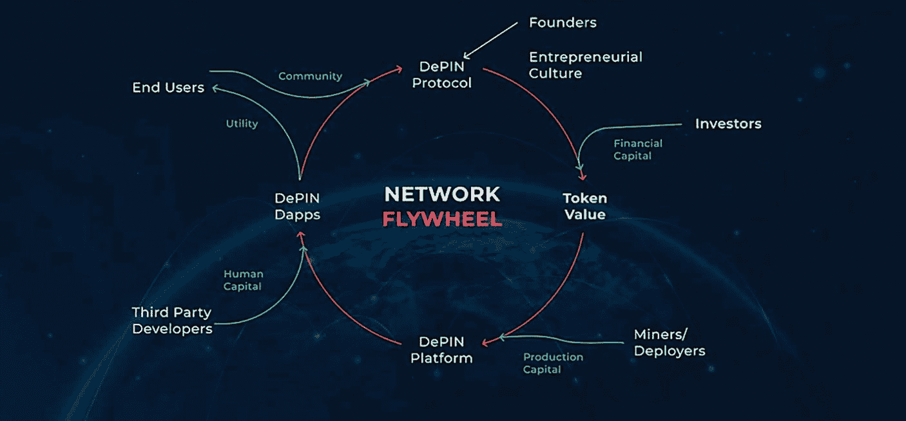

# 6. 代币化的现实世界资产（RWA）与去中心化物理基础设施网络（DePIN）

### 6.1 RWA 简介

RWA 涵盖了存在于物理世界中的有形和无形资产，但可以通过代币化在区块链或其他分布式账本技术（DLT）上进行数字表示。这些资产涵盖范围广泛，包括现金、大宗商品、股票、债券、房地产、艺术品和知识产权。RWA 在缩小传统金融体系与快速发展的数字经济之间的差距方面发挥着至关重要的作用，它为获得更易获取、更透明、更高效的资产管理和投资机会铺平了道路。

- **从加密货币视角来看**：在加密领域，围绕 RWA 的逻辑核心在于将收益型资产（例如美国国债、固定收益产品和股票）的收益权转移到区块链上。这涉及利用链下资产进行链上抵押贷款，并将各种 RWA（例如矿产、房地产、黄金）引入线上进行交易。加密世界对 RWA 的这种单向需求面临着众多监管障碍，这说明了将实体资产与数字资产融合这一复杂但日益增长的兴趣。

- **从传统金融（TradFi）视角来看**：从 TradFi 的角度看，RWA 代币化被视为通往 DeFi 的双向桥梁。它被认为是一种革命性工具，将传统资产的可靠性与广泛性同区块链技术的效率与创新相结合。对于 TradFi 机构而言，使用 DeFi 协议进行资产代币化开辟了新的途径，以增强流动性、降低运营成本并解决系统中长期存在的效率低下问题。这代表了向更加一体化的金融体系演进，该体系利用区块链技术实现透明、高效和包容的资产市场。

#### 区块链作为理想的基础设施

区块链技术堪称金融领域“计算化系统”的典范，主要归功于其通过智能合约和去中心化共识机制实现金融交易与资产管理的自动化及安全性。这与传统金融（`TradFi`）中依赖人工流程、中介机构以及基于中心化机构信任的监管框架的“非计算化系统”形成了鲜明对比。

像区块链这样的“计算化系统”擅长执行重复性流程并交付可验证的结果，无需依赖信任或直接的人工干预。其特点包括透明性、不可篡改性，以及支持直接所有权、资产分割和全球可访问性。这种信任与执行的自动化不仅降低了运营低效问题，还为金融创新开辟了新途径，例如`RWAs`（真实世界资产）的代币化。

另一方面，`TradFi`中的“非计算化系统”涵盖了金融领域中那些基本未纳入自动化与数字信任范畴的部分。这些包括基于人类判断的细微决策，例如依赖人际信任、历史财务行为和监管合规性的信用评估。虽然区块链可以简化金融交易的诸多环节，但它无法完全取代支撑非计算化系统中的人工因素以及现有的法律和监管框架。

`RWAs`（真实世界资产）的代币化展示了计算化系统与非计算化系统的融合，将有形和无形资产带入区块链。这一过程不仅提升了资产管理的流动性、可访问性和效率，也凸显了采取尊重资产所有权与转移的法律、监管及人文背景的综合方法的迫切需求。

本质上，金融与资产管理的未来在于将区块链的计算能力与传统金融系统的非计算化方面和谐地融为一体。这种协同效应有望在全球金融领域释放出前所未有的效率、透明度和包容性，前提是能够有效解决监管合规、安全性以及数字资产与实物资产之间无缝交互的相关挑战。

#### RWA 代币化对 TradFi 的颠覆性影响

`RWAs`（真实世界资产）的代币化预示着金融领域的一场变革性转变，将有形和无形资产历经时间考验的稳健价值与区块链的前沿技术相结合。这种融合不仅提升了传统金融格局，还因区块链技术固有的优势——去中心化、透明性和不可篡改性——为彻底颠覆长期存在的规范奠定了基础。这场颠覆的核心在于通过去中心化金融（`DeFi`）创新应用计算化金融，从根本上重新定义了资产的管理、交易和概念化方式。

- **增强的流动性与全球可访问性**：`RWA`代币化的核心优势之一，在于它为那些曾受传统市场限制的资产带来了前所未有的流动性和可及性。代表`RWAs`的数字代币可以在全球平台上一周七天、每天 24 小时进行交易，超越了地理边界和标准市场交易时间的限制。这种持续的交易周期不仅增加了流动性，也拓宽了市场参与度，使此前仅限于少数人的投资机会变得民主化、触手可及。

- **固有的透明性与安全性**：区块链固有的透明性犹如信任的灯塔，显著提升了投资者的信心。该技术降低了与欺诈和所有权纠纷相关的风险，留下了清晰且不可篡改的资产所有权与交易历史记录，所有相关方均可进行验证。此外，智能合约的运用实现了代币化资产管理和交易流程的自动化与安全保障，确保每一步都可靠执行且不被篡改，从而加强了数字资产交易的安全性。

- **运营效率与成本降低**：在区块链基础设施上对`RWAs`进行代币化的过程显著简化了资产管理，消除了与中介、法律程序和大量文书工作相关的昂贵且繁琐的环节。这种效率不仅使高价值投资对更广泛受众更具可及性，也降低了资产交易的运营成本，促进了一个更具包容性的金融生态系统。

- **计算化金融与 TradFi 的范式转变**：`RWA`代币化颠覆性潜力的核心在于金融领域中计算化系统与非计算化系统之间的区别。作为一种计算化系统，区块链擅长执行复杂算法并维护不可篡改的交易账本，为`DeFi`带给金融服务的自动化与创新提供了坚实基础。这种新范式为执行借贷、资产管理等传统金融操作营造了无需人工干预的完全自动化环境，标志着向更高效、更安全、更易获得的金融服务迈出了深刻的一步。

- **金融产品的可编程性与透明度**：此外，代币化为金融操作引入了可编程性层，尤其惠及衍生品市场和`SME`（中小企业）融资等领域。这一特性允许创建创新的金融产品，在提高流动性和资本获取途径的同时，保持透明度并最小化风险。代币化`RWAs`固有的可编程性不仅简化了金融产品的创建和管理流程，也确保了这些流程以更高的透明度和安全性进行。

`RWA`与区块链及`DeFi`创新的融合标志着传统金融演进的一个关键转折点。通过利用计算化金融的效率，`DeFi`生态系统将简化、扩展并革新金融服务，使其对所有人而言更易获取、更高效率、更加安全。因此，`RWA`代币化对传统金融的颠覆性影响并非仅仅是未来的猜想，而是一个正在展开的现实，承诺将以深远的方式重塑金融格局。

### 6.2 DePIN 概述

`DePINs` 预示着一个新时代的到来——区块链固有的**安全性、透明性和集体控制**特性，将与支撑我们社会的物理基础设施相融合。这种协同效应将重新定义我们核心物理系统的创建、运营和利用方式。`DePINs` 绝非仅仅是对现有服务的区块链化改造；它是对基础设施管理的重新构想和进化式飞跃。这些网络被设计为具有自我调节、稳健且天然抵御中心化系统常见漏洞的能力。`DePINs` 的愿景指向一个未来：基础设施不仅被共享，还被集体培育，从而形成公平、可持续且能适应参与者集体意愿的生态系统。²^,³

#### DePIN 的核心组成部分

- **区块链与智能合约**：`DePINs` 的核心是区块链技术，它作为不可篡改的账本，记录网络内的所有交易和交互。智能合约自动执行这些交易，促进无需信任的安全服务和资源交换。
- **物联网（IoT）**：`IoT` 在 `DePINs` 中不可或缺，它为网络提供数据收集能力，确保物理世界与数字世界之间的持续通信。从传感器和设备收集的数据被馈送到区块链中，从而实现实时监控和管理。
- **代币经济与激励机制**：一个强大的激励模型对于鼓励参与 `DePINs` 至关重要。代币经济学涉及创建数字货币或代币系统，以奖励贡献者在构建、维护或利用网络中的角色，将个人激励与网络健康状态保持一致。
- **互操作性协议**：`DePINs` 需要在不同区块链平台和传统系统之间进行无缝交互。互操作性协议确保信息和价值能够无摩擦地在不同网络之间交换。

#### 实际应用案例

- **能源电网**：`DePINs` 可通过促进 `P2P` 能源交易彻底改变能源分配方式，允许拥有太阳能电池板的个人将多余能源直接出售给邻居或回售给电网。
- **电信**：在电信领域，`DePINs` 可以创建去中心化网络，个人通过托管节点为网络覆盖做出贡献，从而增强连接性并减少对传统提供商的依赖。
- **交通与物流**：`DePINs` 可以在整个供应链中实时追踪货物，确保透明度和真实性。在交通领域，它们可以支持去中心化的拼车网络或车辆数据市场。
- **城市发展与房地产**：在城市发展中，`DePINs` 可以在智慧城市项目中发挥作用，将各种基础设施元素整合成一个有凝聚力、响应迅速且高效的整体。它们还可以简化房地产交易，使财产所有权更易获取且更安全。

`DePINs` 根据其处理的资源性质可分为两种不同类型：物理资源网络（`PRNs`）和数字资源网络（`DRNs`）。表 6-1 显示了二者的分析对比。

**表 6-1 PRNs 与 DRNs 对比**

| 方面 | 物理资源网络（PRNs） | 数字资源网络（DRNs） |
| --- | --- | --- |
| 资源性质 | 有形的、不可移动的资产 | 无形的、虚拟的资源 |
| 区域化 | 服务和资源具有位置特定性且不可迁移 | 服务不受位置限制，可在全球范围内访问 |
| 可互换性 | 非同质化；资源在其功能和位置上具有唯一性 | 同质化；资源可复制，且不具位置唯一性 |
| 部署方式 | 涉及物理安装，可能需大量资金和劳动力 | 基于软件的部署，所需物理干预最少 |
| 资本需求 | 通常较高，因为需要物理硬件和基础设施 | 所需初始资本较低；资源为数字形式，更易分发 |
| 可扩展性 | 受地理、基础设施等物理因素制约 | 高度可扩展，不受物理地理因素限制 |
| 维护方式 | 需要物理维护，可能导致较高的长期成本 | 主要需要软件维护，可远程管理 |
| 服务范围 | 由于资源的物理性质，局限于特定服务区域 | 由于资源的数字性质，可实现全球服务提供 |
| 示例 | Helium（去中心化无线网络）、Power Ledger（点对点能源交易） | Filecoin（去中心化存储）、IoTeX（去中心化机器网络） |
| 服务连续性 | 可能受物理损坏或局部中断影响 | 通常对局部中断更具弹性；只要网络运行即可维持连续性 |
| 监管环境 | 由于基础设施的物理性质及其对环境和社会的影响，可能面临更严格的监管 | 由于数字资产和服务的无形性及快速演变，监管可能更具挑战性 |

表 6-1 总结了 `DePIN` 框架内 `PRNs` 和 `DRNs` 之间的基本区别。`PRNs` 处理的是受特定位置约束的物理性（通常是基础设施性）资源，而 `DRNs` 处理的是更通用且全球可访问的虚拟资源。两者各有其优缺点，适用于不同类型的去中心化应用。

#### DePIN 飞轮的动力机制

DePIN 通过一个共生循环运作，将区块链的技术实力与物理基础设施的实用性相结合。这个循环被称为 DePIN 飞轮，展示了不同利益相关者与网络之间的互动，推动着生态系统中的增长和价值创造。⁴

图 6-1
DePIN 飞轮

图 6-1 展示了 DePIN 生态系统中的不同元素如何相互促进，形成一个自我可持续的模型。以下是详细分解：

1.  **创始人与投资者**：循环始于建立 DePIN 协议的创始人，以及提供金融资本的投资者。这笔资金对于开发基础设施和激励早期采用者至关重要。

2.  **代币价值与矿工/部署者**：金融资本有助于确立代币价值，这是回报矿工或部署者的基础。这些参与者通过提供必要的硬件或服务来贡献生产资本。

3.  **DePIN 平台与第三方开发者**：随着硬件就位，DePIN 平台开始运作，吸引第三方开发者。这些开发者通过创建利用该平台的去中心化应用程序（`DApps`）来贡献人力资本。

4.  **DePIN DApps 与最终用户**：`DApps` 为与平台互动的最终用户提供实用性，使他们能够从平台提供的去中心化服务中受益。

5.  **社区参与**：繁荣的用户群会在 DePIN 周围培育出一个强大的社区，其反馈作用于协议本身，从而完成飞轮循环。这种社区参与对于长期的可持续性和增长至关重要。

飞轮概念强调了每个参与者角色的重要性以及他们贡献的相互关联性。通过确保激励机制在整个体系中保持一致，DePIN 旨在维持一个平衡的增长轨迹，使网络参与者获得回报，最终用户享受日益增长的实用性。

这种模型为建设和运营基础设施提供了一种变革性的方法，使其具有参与性、激励性和去中心化的特点。它将控制权从中心化实体转移到分布式的利益相关者网络，每个人都在网络的增长中做出贡献并从中受益。

随着 DePIN 的不断发展，它们有可能颠覆传统的基础设施管理系统，在能源、电信、健康等多个领域提供更高效、更透明、更公平的服务提供框架。

#### 可扩展性与可持续性

可扩展性和可持续性是 DePIN 成功和长久发展的两大支柱。为了优化可扩展性，DePIN 必须采用能够在不牺牲性能的前提下处理高交易量和数据吞吐量的区块链协议。这可能涉及采用或开发更高效、更节能的共识机制，例如使用权益证明（`PoS`）而非工作量证明（`PoW`），或者集成**第二层（Layer 2）**解决方案，将交易处理从主区块链上分流。

对于可持续性，DePIN 应专注于创建能够最小化能耗的网络架构，例如通过整合可再生能源，或设计激励节能运行的机制。这不仅符合全球推动绿色技术的趋势，也确保了网络在长期内保持成本效益。

代币经济学在确保网络内的激励机制促进健康增长方面发挥着关键作用。经济模型必须以公平奖励贡献者而避免制造经济泡沫的方式进行构建。这意味着要设计能够协调所有利益相关者（从矿工、用户到开发者、投资者）利益的机制，确保代币的价值与实际效用和需求挂钩，而非仅仅是投机。

在此背景下，不仅仅是建设基础设施，还要围绕它培育一个强大的生态系统。这包括建立一个能够适应网络不断变化需求和挑战的稳健治理模型。此外，还包括创造一个创新能够蓬勃发展的环境，以促进提升网络能力和服务的发展。

在 DePIN 的叙事中，可持续性也意味着维护一个能够应对市场条件变化、技术进步和监管格局变化的适应性框架。DePIN 要真正蓬勃发展，不仅需要在技术挑战面前展现出韧性，还需要在经济和环境可持续性方面表现出韧性。

重点还必须放在确保 DePIN 的物理和数字组件能够和谐扩展上。这需要在部署物理资源和支撑它们的数字基础设施的可扩展性之间进行仔细协调。

通过专注于这些领域，DePIN 有可能彻底改变我们对待基础设施的方式，从中心化、自上而下的模式转向分布式、自下而上的模式，在赋予个人和社区权力的同时，保持与我们环境和资源的和谐。

## RWA 与 DePIN 之间的协同效应：机遇与复杂性

RWA 代币化和 DePIN 是加密领域中两股变革力量，它们都旨在弥合传统金融市场与区块链生态系统之间的鸿沟。RWA 指的是将现实世界实物资产的权利转换为区块链网络上的数字代币的过程，而 DePIN 则代表使用区块链来管理和改进物理基础设施系统的去中心化网络。两者结合在一起，意味着一个强大的组合，有望彻底改变数字资产交易和物理资源的管理。

DePIN 可以被视为 RWA 的一个子集，其中物理基础设施的代币化起着关键作用。属于 DePIN 的项目使用代币奖励来激励社区驱动的物理网络建设和运营。例如，一个 DePIN 项目可以激励用户分享来自移动设备摄像头的空间信息数据，为构建一个更大的地理空间信息网络做出贡献。通过代币化，此类网络可以为昂贵的基础设施提供资金，鼓励公众参与，并实现这些资源所有权的民主化。

#### 去中心化物理基础设施网络（DePIN）项目中 Solana 的优势

`Solana` 的架构相比 `Ethereum` 拥有多项独特优势，这些优势对于可扩展性和快速数据交易至关重要的 DePIN 项目尤其有利。

`Solana` 的交易吞吐量显著更高，每秒可处理高达 2,000-3,000 笔交易（TPS），而 `Ethereum` 目前每秒约处理 10-15 笔交易。这种性能上的巨大差异主要归功于 `Solana` 创新的历史证明（`PoH`）共识机制，该机制通过为交易添加时间戳来简化事件顺序，从而实现更高的吞吐量，避免了 `Ethereum` 在拥堵期间常出现的延迟和积压问题。

此外，`Solana` 的无状态架构不需要在每次交易时更新网络的整个状态，这有助于降低内存消耗，并允许交易以更高的效率顺序处理。这一特性，连同 `Turbine` 区块传播协议，有助于分解数据以便于网络传输，并在基础层面为 `Solana` 的可扩展性做出贡献，而无需依赖二层扩容解决方案。

另一个重要方面是成本效益。与 `Ethereum` 相比，`Solana` 维持着极低的交易费用，这使其成为寻求高效且经济实惠交易体验的用户和开发者的有吸引力的平台。例如，`Solana` 的费用以美分的小数部分来衡量，而 `Ethereum` 的费用可能差异很大，并在网络拥堵的高峰使用时段飙升。

`Solana` 还引入了 `Sealevel` 系统，该系统允许智能合约并行运行，从而优化网络效率并同时处理多笔交易，这是相对于 `Ethereum`（其智能合约无法并行操作）的一个显著优势。

这些特性巩固了 `Solana` 在 DePIN 项目中的优势，提供了一个高速、可扩展且经济高效的环境，支持复杂的基础设施模型以及有效运行这些模型所需的高频数据交易。

尽管有这些优势，但值得注意的是，`Solana` 确实存在中心化的取舍，并且曾面临网络宕机问题，这引发了人们对其稳健性和可靠性相较于 `Ethereum` 的担忧。尽管 `Ethereum` 面临可扩展性挑战，但由于其去中心化的特性，它在正常运行时间和安全性方面有着良好的记录。

两个网络都在持续演进，`Ethereum` 正在通过 `Ethereum` 2.0 升级（包括向权益证明（`PoS`）共识的过渡）努力提高其可扩展性和效率，旨在解决当前的瓶颈并提升网络性能。

总之，虽然 `Solana` 提供了一套有助于 DePIN 项目的专门特性，但利益相关者在选择区块链平台进行开发时，必须权衡这些优势与网络稳定性、安全性和去中心化等更广泛背景下的因素。⁵^,⁶^,⁷^,⁸

### 挑战

1.  **监管障碍**：RWA 和 DePIN 倡议通常面临严格的监管环境，这可能会限制它们在各个司法管辖区自由运营的能力。传统金融资产与区块链技术的整合带来了复杂的法律挑战，特别是在合规性、资产托管和跨境交易方面。

2.  **互操作性问题**：确保不同区块链平台之间以及区块链与传统金融系统之间的无缝互操作性至关重要。这包括开发标准化协议所面临的技术挑战，这些协议允许资产在不同平台间高效、安全地进行代币化、转移和结算。

3.  **可扩展性担忧**：随着 DePIN 项目的发展，它们必须在不影响性能或安全性的情况下处理不断增长的交易量。这对于在可扩展性方面存在困难的区块链网络尤其具有挑战性，因为更高的交易吞吐量可能导致网络拥堵和交易费用增加。

4.  **数据隐私与安全**：在维护透明度和遵守 GDPR 等法规的同时，保护敏感的金融数据并确保交易隐私是一项重大挑战。这包括防范数据泄露以及未经授权访问个人和金融信息。

5.  **资产估值与流动性**：对现实世界资产（RWA）进行准确估值，并确保其在区块链上代币化后的流动性，提出了挑战。这包括开发可靠的价格发现、资产评估机制，以及管理流动性池以促进交易和借贷。

