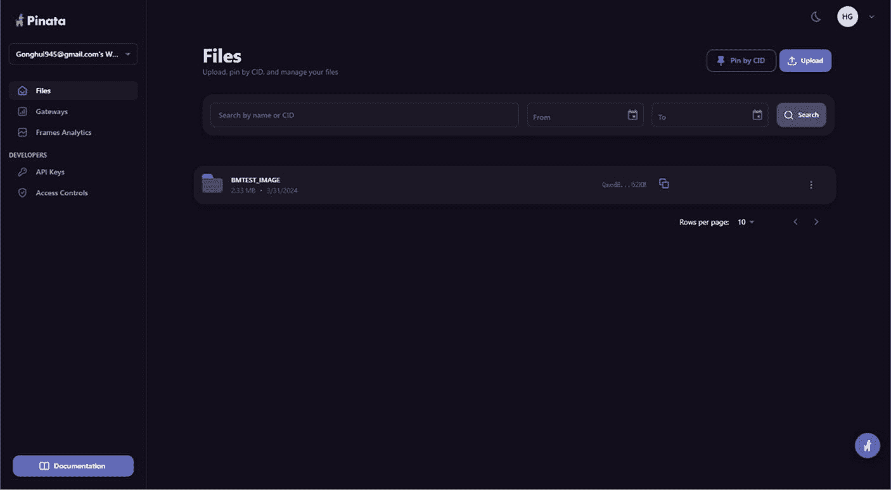
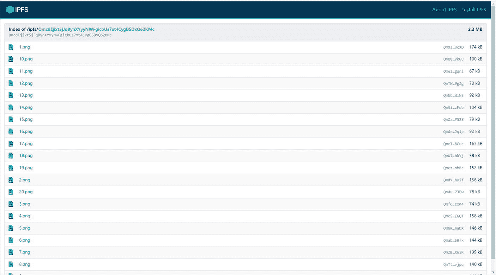
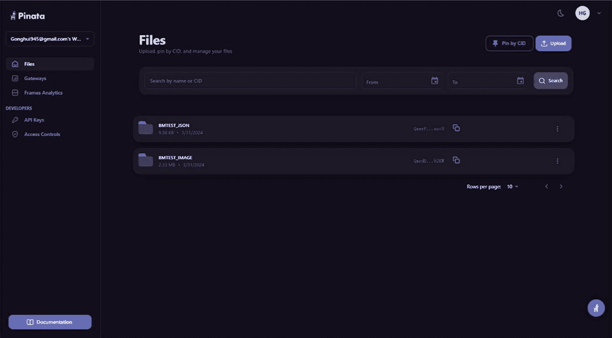
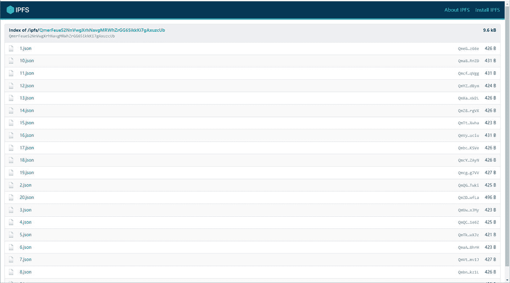
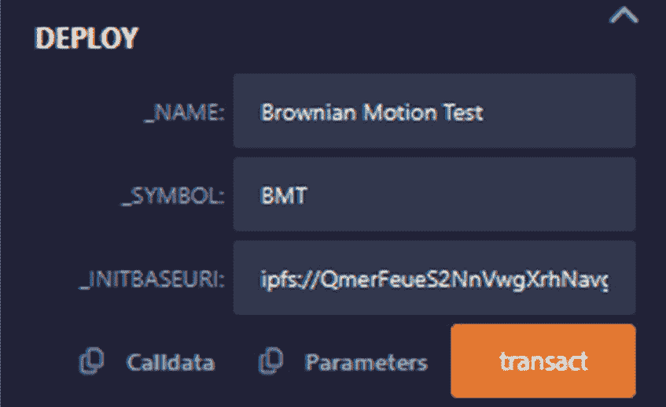
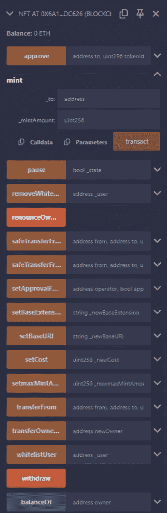
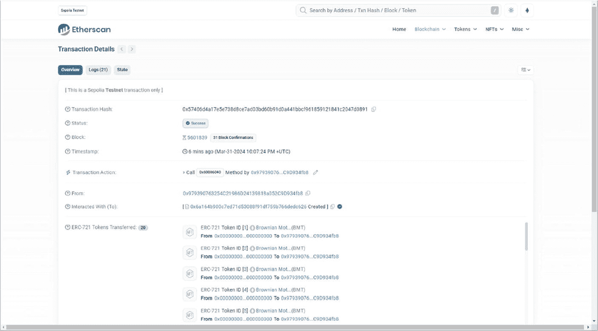
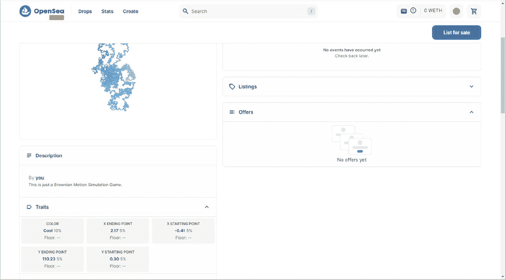
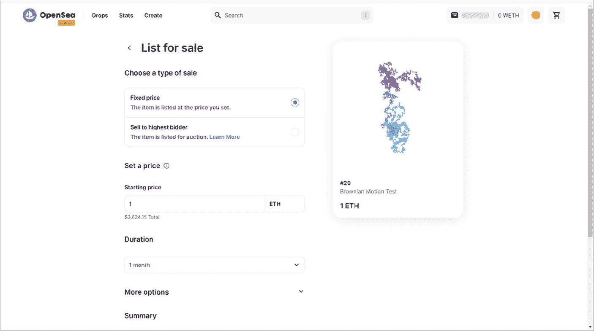

# 7. 非同质化代币（NFT）与数字艺术

## 7.1 理解 NFT：机制与市场动态

非同质化代币（NFT）代表了数字所有权范式的突破性转变，它利用区块链技术来认证数字资产的唯一性和所有权。与可互换且价值相同的同质化代币（如加密货币，一个比特币总是等于另一个比特币）不同，每个 NFT 都是独一无二或“非同质化”的，不能按一比一的基础进行交换。这种唯一性和不可分割性使得 NFT 成为数字形式代表独特物品所有权的完美载体，范围从数字艺术到虚拟房地产。

### 独特属性与底层技术

非同质化代币（NFT）利用区块链技术的变革力量，为数字资产带来了无与伦比的正品认证、来源追溯和所有权保障水平。NFT 主要构建在以太坊上，同时 Solana 和 Flow 等其他区块链也逐渐获得关注，这代表着与传统数字和物理资产管理系统的一次重大背离。¹

- **正品认证**：区块链技术通过加密哈希函数保障 NFT 的正品认证。每个 NFT 都与一个独特的数字签名相关联，该签名作为不可伪造的正品证书。与可以轻易复制或修改且不留痕迹的传统数字文件不同，区块链的不可变账本确保一旦 NFT 被铸造，任何人都可以随时验证其真实性。这与传统数字资产形成鲜明对比，在传统数字资产中，确定物品的原版通常需要大量人工验证并信任发行机构。
- **来源追溯**：来源追溯，即 NFT 的所有权和转让历史，会被透明且永久地记录在区块链上。与 NFT 相关的每一笔交易，从艺术家的创作到之后的每一次转让或销售，都会被加盖时间戳并存储在链上。这个全面的历史记录是公开可访问的，为物品在不同所有者之间的流转提供了清晰证据。另一方面，传统系统依赖于物理证书或中心化数据库，这些容易丢失、伪造或篡改，使得艺术品或收藏品的来源难以明确建立。
- **所有权**：区块链技术为数字资产的所有权提供了前所未有的确定性。当 NFT 被购买时，交易被记录在区块链上，买家的数字钱包地址作为当前所有者与 NFT 建立不可磨灭的联系。这个过程确保所有权易于验证且无法争议，因为区块链账本不可变且分布在众多节点上，使得未经授权的更改几乎不可能。相比之下，传统的数字资产（如下载内容或许可证）不具备这种安全的所有权归属层级。物理资产虽然可能有法律文件或收据来证明所有权，但无法提供区块链技术为 NFT 提供的相同的、不可变且即时可验证的所有权证明。

通过 NFT 将区块链技术整合到数字资产领域，解决了在确定数字物品的正品认证、来源追溯和安全所有权方面长期存在的挑战。通过提供一个记录 NFT 存在和交易历史所有方面的去中心化、防篡改账本，区块链技术提供了一种远超传统方法的革命性解决方案。这种范式转变不仅增强了数字经济中的安全性和信任度，也为数字时代的艺术家、创作者和收藏家开启了新的可能性。

### NFT 的应用

非同质化代币（NFT）开启了一个数字所有权和实用性的新时代，其应用远超最初与数字艺术及高价销售（如 Beeple 的标志性作品 *每一天：前 5000 天*）的关联。NFT 的多功能性在从游戏、房地产到数字身份管理和 `GameFi` 等多个领域得到了展现，显示了它们彻底改变我们与数字及实体资产互动方式的潜力。

- **游戏与 GameFi**：在游戏行业，NFT 通过实现对游戏内资产的真正所有权，重新定义了用户互动。得益于 NFT，玩家现在可以拥有、交易或出售他们独特的游戏内物品、角色或虚拟世界中的地块。这也催生了 `GameFi` 的概念，即游戏与去中心化金融的结合，使玩家能够通过游戏赚取现实世界的奖励。在 `GameFi` 生态系统中，NFT 扮演着关键角色，它们代表了可以增值、质押或用于与去中心化应用（`DApps`）交互的资产，进一步模糊了娱乐与金融之间的界限。
- **房地产**：通过 NFT 将房地产代币化，正在通过数字化产权和所有权文件来改变财产交易。这种应用促进了透明、高效且防欺诈的财产交易，使买卖双方无需传统上繁琐的文书工作和中介即可转移所有权。通过将房地产表示为 NFT，包括先前交易和所有权细节在内的整个房产历史记录都可以在区块链上获取，从而增强了房地产市场的信任度和流动性。
- **数字身份**：NFT 的一个深远应用在于其以安全、去中心化的方式管理和验证数字身份的能力。这在第 5.​3 节中强调的以太坊域名服务（`ENS`）的实施中尤为明显，该服务将域名作为 NFT 在以太坊区块链上进行代币化。`ENS` 允许用户为其加密货币地址分配可读的名称，简化了去中心化网络内的交易和互动。这种机制不仅通过用人类可读的名称取代复杂地址来简化数字通信，还赋予用户对其数字存在和身份的完全控制权。数字身份管理与 `ENS` 的结合凸显了 NFT 在增强在线安全、隐私和用户体验方面的效用。通过利用 NFT 进行数字身份管理，用户获得了一个强大的身份验证工具，可规避中心化身份管理系统的陷阱，预示着数字互动中隐私和控制权新时代的到来。

NFT 的广泛应用程序，从 `GameFi` 和房地产代币化到数字身份管理以及像 `ENS` 这样的去中心化网络服务，都强调了 NFT 作为一种技术的多功能性。随着 NFT 的持续发展，它们有望重塑我们数字和实体生活的诸多方面，为所有权、身份和在线互动等长期存在的挑战提供创新解决方案。

### 发行模式：从标准发售到荷兰式拍卖

随着 NFT 市场的发展，诸如`标准发售`和`荷兰式拍卖`等发行模式已成为创作者发布其数字资产的关键机制。每种模式都有其独特的优势，但也面临着与市场包容性和完整性相关的特定挑战。从`标准发售`到`荷兰式拍卖`的演变，反映了 NFT 社区内部为完善这些模式以实现更公平的价格发现和更平等的准入机会而做出的持续努力，同时也需应对更广泛的市场挑战：

- **标准发售：直截了当的开端**

  `标准发售`是 NFT 发行的基石，因其简单直接而备受青睐。创作者为每个 NFT 设定固定价格，为买家提供了简单的入口。这种模式因其易于理解和访问而在新兴艺术家和数字领域创作者中广受欢迎。然而，其在定价上的僵化可能导致难以准确衡量市场需求，可能造成低估值的 NFT 迅速售罄，或高估值的 NFT 销售缓慢。这些问题凸显了需要能更好适应市场动态的模式，以确保创作者和收藏者都能进行公平且有价值的交易。

- **荷兰式拍卖：动态价格发现**

  `荷兰式拍卖`的引入标志着向动态价格发现的重大转变。通过从高价开始并随时间递减，`荷兰式拍卖`允许市场在确定 NFT 价值方面发挥更积极的作用。该模式旨在通过适应实时需求来缓解`标准发售`中固有的价格发现问题，从而可能更准确地反映 NFT 的市场价值。然而，尽管`荷兰式拍卖`为一些定价挑战提供了解决方案，但它们也引入了关于市场投机以及真正收藏者（尤其是那些资源有限、可能在初始高需求阶段被价格排除在外的人）可及性的新问题。

### 应对市场挑战：包容性与完整性

从`标准发售`到`荷兰式拍卖`的转变，凸显了 NFT 社区内部关于市场包容性和完整性的更广泛讨论。虽然这两种模式都致力于改进先前的局限，但它们也反映了持续的挑战：

- **包容性**：确保公平获得 NFT 仍然是一个问题。`白名单`和`预售`已成为奖励早期支持者和社区成员以保证或优先访问权的方法，但这些机制可能会无意中将新人和普通收藏者排除在需求量大的发行之外。挑战在于设计既能平衡奖励忠实社区成员，又能保持市场对所有参与者开放和可及的发行方法。
- **完整性**：诸如`洗售交易`（即通过人为抬高交易量来操纵感知价值和流动性）等市场完整性问题构成了重大挑战。`洗售交易`不仅扭曲了 NFT 的真实价值和需求，还破坏了市场对 NFT 的信任。无论是`标准发售`还是`荷兰式拍卖`，虽然主要专注于价格发现和销售效率，但都必须成为打击此类行为的更大策略的一部分。这包括实施稳健的检测和预防机制，并培育一种重视透明度和真实参与的市场文化。

### 市场动态

非同质化代币（NFT）市场经历了爆发式增长，已发展为价值数十亿美元的领域，吸引了从艺术收藏家、投资者到数字爱好者的广泛参与者。然而，这种高速增长也伴随着波动性，其特征是需求高涨期与市场重大调整期交替出现。NFT 的流动性因资产不同差异显著，主要受稀缺性、需求和市场主流情绪等因素影响，这凸显了市场在持续成熟过程中复杂的动态博弈。

NFT 的定价、买卖机制正随着生态系统的蓬勃发展而进化，荷兰式拍卖和改进的标准铸造等创新模式应运而生，旨在提供更灵活、更公平的交易模型。这些发展是对市场亟需高效、透明且便捷的连接创作者与收藏家方式的回应，从而塑造 NFT 领域的未来格局。

NFT 的应用远不止于数字艺术领域，在娱乐、媒体、房地产和身份验证等多个行业均展现出潜力。这种广泛的适用性凸显了 NFT 作为数字所有权和价值交换新形式的角色，其能力足以深刻改变我们与数字资产的互动方式。荷兰式拍卖和标准铸造等分销模式的演变，反映了市场在效率、公平性和可及性之间寻求平衡解决方案的不懈探索。

随着 NFT 背后的技术和市场机制持续进步，它们有望在数字经济中扮演关键角色，重塑我们与数字及实体资产的互动方式。从边缘小众的好奇之物到数字互动的关键组成部分，这一历程彰显了 NFT 的变革潜力，必将推动整个数字领域的创新与变革。

## NFT 市场的演变与未来趋势

受分销模式演进和应用领域拓展的驱动，NFT 领域正经历重大转型。从标准铸造的简单起点，到更具动态性的荷兰式拍卖，再到如今白名单和预售机制的整合，NFT 的发展轨迹凸显了市场对包容性、公正性和创新性的坚定追求。这些发展虽前景光明，但也强调了持续演进和利益相关方间协作的必要性，以期为 NFT 交易构建一个更公平、透明的未来。

### 迈向更公平、透明的分销模式

从标准铸造到荷兰式拍卖，再辅以白名单和预售机制，这一历程体现了克服可及性与市场公平性挑战的决心。混合模式的探索正是这一承诺的佐证，预示着未来分销策略将与其销售的 NFT 本身一样多样化。这些混合模式通过融合现有方法中的各种元素，旨在满足创作者和收藏家双方的细微需求，确保每次发行都能找到理想的受众。

分销机制的透明度提升是另一个关键进步领域。通过清晰揭示销售机制（包括参与标准和定价策略），NFT 社群旨在建立信任和开放的基础。这种透明度不仅能揭开买卖过程的神秘面纱，更在减轻市场操纵风险方面发挥关键作用，确保价值交换真实反映市场动态。

社群治理成为 NFT 市场演变的 pivotal 主题。通过让更广泛的 NFT 社群参与决策过程，有望确保分销模式具有包容性，并能反映广泛利益和优先事项。这种协作方式可能为一个不仅充满活力、多元发展，而且能抵御历史上困扰数字和实体资产交易的挑战的市场铺平道路。

### 市场波动与流动性问题

随着 NFT 持续吸引全球目光，市场波动性和流动性成为重大关切，凸显了供需之间的微妙平衡。NFT 市场起伏不定的特性，虽然体现了其动态创新的精神，但也表明需要更稳定、可预测的交易环境。应对这些问题不仅需要完善分销模式，还需要加强支撑 NFT 交易的基础设施——从区块链技术到市场平台，确保在维护交易完整性的前提下维持流动性。

### 超越数字艺术：NFT 的应用扩展

NFT 的潜力远超数字艺术领域，有望彻底改变娱乐、媒体、房地产和身份验证等行业。这种应用扩展凸显了 NFT 作为数字所有权和价值交换工具的多样性。例如，在娱乐和媒体行业，NFT 提供了新颖的内容变现和受众互动方式；而在房地产领域，产权代币化可以简化交易、减少欺诈。此外，在身份验证领域，NFT 为安全、用户可控的个人数据管理提供了创新方案，挑战了传统的中心化系统。

随着 NFT 进军这些新领域，公平分销、市场稳定和透明度等原则仍将是其成功的关键。因此，NFT 市场的未来趋势不仅取决于技术进步，还取决于社群适应、创新和协作的能力。这些共同努力将塑造一个未来：NFT 重新定义我们与数字资产的互动，开启数字所有权和创造力的新时代。

## 创建与交易 NFT：分步指南

在 OpenSea 上创建和上架 NFT 涉及一系列明确的步骤。虽然本指南侧重于从图像创建 NFT，但需注意 NFT 可以封装多种数字格式，包括但不限于视频、音频文件、数字艺术甚至文本文档。此处选择图像作为示例，是因其简单易懂且图像在 NFT 市场上具有视觉吸引力。不过，此处概述的原则和步骤经过一些修改（尤其在文件准备和元数据规范阶段），可适用于其他数字格式。让我们深入探讨这一过程。

### 第一步：使用 Python 生成随机图像

```python
import numpy as np
import matplotlib.pyplot as plt
from matplotlib import cm
import random
import json
import time

# 要生成的图像数量
m = 20
# 为布朗运动生成 n 步
n = 8888
# 定义颜色映射选项
colormap = [plt.cm.binary, plt.cm.gist_yarg, plt.cm.gist_gray, plt.cm.gray,
            plt.cm.bone, plt.cm.pink, plt.cm.spring, plt.cm.summer, plt.cm.autumn,
            plt.cm.winter, plt.cm.cool, plt.cm.Wistia, plt.cm.hot, plt.cm.afmhot,
            plt.cm.gist_heat, plt.cm.copper]
# 为元数据定义颜色名称
color_names = ['binary', 'gist_yarg', 'gist_gray', 'gray', 'bone', 'pink', 'spring', 'summer', 'autumn', 'winter', 'cool', 'Wistia', 'hot', 'afmhot', 'gist_heat', 'copper']
metadata = {}

for i in range(m):
    x = np.cumsum(np.random.randn(n))
    y = np.cumsum(np.random.randn(n))
    k = 10  # 插值因子
    x2 = np.interp(np.arange(n * k), np.arange(n) * k, x)
    y2 = np.interp(np.arange(n * k), np.arange(n) * k, y)
    fig, ax = plt.subplots(figsize=(8, 8))
    cmap_idx = random.randint(0, len(color_names) - 1)
    ax.scatter(x2, y2, c=range(n * k), linewidths=0, marker='o', s=3, cmap=colormap[cmap_idx])
    ax.axis('equal')
    ax.set_axis_off()
    plt.savefig(f'BMTEST_IMAGE/{i+1}.png')
    metadata[i] = {
        'name': f'#{i+1}',
        'description': '这只是一个布朗运动模拟游戏。',
        'edition': i + 1,
        'date': time.time(),
        'attributes': [
            {'trait_type': 'X 轴起点', 'value': f'{x2[0]:.2f}'},
            {'trait_type': 'X 轴终点', 'value': f'{x2[-1]:.2f}'},
            {'trait_type': 'Y 轴起点', 'value': f'{y2[0]:.2f}'},
            {'trait_type': 'Y 轴终点', 'value': f'{y2[-1]:.2f}'},
            {'trait_type': '颜色', 'value': color_names[cmap_idx]}
        ],
        'compiler': 'Hugo'
    }
```

在运行提供的代码之前，务必确保工作目录中已创建名为`BMTEST_IMAGE`的文件夹。这一准备工作至关重要，因为生成的图像将保存到该文件夹中，然后才能上传到 IPFS。将图像上传到 IPFS 的目的是确保它们存储在去中心化网络上，这符合区块链和 NFT 的精神，为数字资产提供持久性和完整性。

脚本中的变量`m`表示你打算生成的图像（以及相应的 NFT）数量。虽然此示例生成 20 张图像，但在 NFT 领域，通常会创建包含 10,000 或 20,000 个项目的集合，以确保为社区代币提供足够大的池子。如此庞大的收藏有助于在持有者中培养一种排他性和归属感。然而，出于演示和简化的目的，此脚本设置为生成 20 张独特的图像。

变量`n`用于控制为每张图像生成的布朗运动路径的复杂性和唯一性。该参数确保每张生成的图像，即使不一定具有传统意义上的艺术性，也能展现出独特的图案，从而凸显出 NFT 至关重要的独特性。这种独特性关键地证明了即使简单的算法过程也能产生多样化的结果，使读者能够生成不同的图像来尝试创建 NFT。

该脚本为每个 NFT 创建了五个特征，分别是：

1. `X 轴起点`：布朗运动路径的起始 x 坐标，增加了空间唯一性。
2. `X 轴终点`：布朗运动路径的最终 x 坐标，进一步增强了图像的唯一性。
3. `Y 轴起点`：路径的起始 y 坐标，与 x 坐标共同定义了路径的起点。
4. `Y 轴终点`：路径的最终 y 坐标，标记了路径在画布上的结束点。
5. `颜色`：图像中使用的随机颜色方案，增加了一个视觉特征来区分每个 NFT。

这些特征被存储在每张生成图像的元数据列表中，捕获了定义和区分每个 NFT 的关键属性。该元数据对潜在的收藏家至关重要，因为它提供了可验证的详细信息，有助于提升 NFT 的价值和吸引力。随后，元数据列表中的信息会被转换成 JSON 文件。这一步对于将 NFT 与区块链和 NFT 市场整合至关重要，因为 JSON 是广泛接受的 NFT 元数据编码格式，可确保与 OpenSea 等平台的兼容性。

OpenSea 的元数据标准允许通过提供超出唯一标识符（`tokenId`）的详细信息来丰富地表示 ERC721 或 ERC1155 NFT。元数据应以 JSON 格式构建，并通过 ERC721 合约中`tokenURI`函数或 ERC1155 合约中`uri`方法返回的 URI 进行访问。该 URI 可以指向 HTTP 或 IPFS URL，当查询该 URL 时，会返回包含 NFT 元数据的 JSON 数据块。

NFT 元数据的 JSON 结构通常包含以下几个关键属性：

- `image`：代表 NFT 图像的 URL。它支持多种图像类型和存储解决方案，包括 IPFS 和 Arweave。
- `name`：项目的名称。
- `description`：项目的人类可读描述。支持使用 Markdown 进行格式化。
- `external_url`：一个 URL，会将用户引导至你网站上关于该 NFT 更多详细信息的页面。
- `attributes`：提供有关项目特征或特性细节的属性数组。

你的元数据可以托管在任何能通过 URI 访问的地方，包括 IPFS 等去中心化存储解决方案，以符合 NFT 的去中心化特性。OpenSea 直接支持 IPFS 和 Arweave URI，允许对元数据进行不可变且持久的托管，确保数字资产一旦铸造就无法被篡改。

通过遵循这些元数据标准并相应地构建你的 NFT 元数据，你就能确保你的数字资产在 OpenSea 上得到最佳展示。这包括展示高质量的图像、详细的描述以及突出 NFT 独特性的属性，从而吸引平台上的潜在买家和收藏家。

为 NFT 生成数字资产后，下一步关键操作是安全地将它们上传到存储解决方案。虽然 IPFS（星际文件系统）因其去中心化特性而备受欢迎，能确保文件的持久性和完整性，但你不必局限于这一选择。你的数字资产和 NFT 元数据可以存储在任何能提供文件直接链接的平台上，例如 Google Drive 或 Dropbox。

### 第二步：将资产上传到存储解决方案

IPFS 是你可以用来存储数字资产的几种方法之一。作为一种去中心化存储系统，它将你的文件分布到全球节点网络中，确保数据保持可访问且能抵抗审查。这对于 NFT 尤其有利，因为它能通过 NFT 元数据中的一个唯一、不可变的 URI 链接你的数字资产，确认该资产无法被篡改或移除。

或者，像 Google Drive 或 Dropbox 这样的中心化解决方案，如果它们能提供文件的直接 URL，也可以用来存储 NFT 数据。虽然这些平台可能提供了便利性和用户友好的界面，但它们通常无法提供与 IPFS 相同水平的去中心化和安全性。在使用中心化服务时，务必确保 URL 是永久且直接可访问的，因为 URL 结构的任何变化都可能导致你的 NFT 中的元数据链接失效。

#### 选项 1：搭建自己的 IPFS 节点

搭建自己的`IPFS`节点需要在你的机器上安装`IPFS`，初始化你的`IPFS`仓库，并启动`IPFS`守护进程以将你的节点连接到`IPFS`网络。这种方法可以让你完全掌控内容的托管，但也伴随着更高的复杂性和责任。你需要管理节点的可用性和连接性，以确保资产始终可访问。此方法可能涉及：

- 下载并安装`IPFS`
- 使用`ipfs init`初始化`IPFS`节点
- 使用`ipfs daemon`启动`IPFS`守护进程
- 使用`ipfs add -r /path/to/your/folder`将文件添加到`IPFS`

虽然运行自己的节点能提供高度的控制权，并能直接与`IPFS`网络交互，但这要求你对`IPFS`有深入的理解，对于初学者或寻求快速简便方案的用户来说，可能并非最直接的选择。

#### 选项 2：使用第三方服务（如 Pinata）

对于许多用户，尤其是`IPFS`新手或追求便利性的用户，像 Pinata 这样的第三方服务提供了一种更简单的方式来上传和管理`IPFS`上的内容。Pinata 通过提供用户友好的界面以及钉住服务等额外功能，简化了流程，确保你的内容在`IPFS`网络上随时可用。

使用 Pinata 上传你的 NFT 资产：

1. **创建账户**：在 [Pinata.cloud](https://pinata.cloud/) 上注册并登录你的账户。
2. **上传内容**：进入“上传”部分，选择上传文件夹。选中包含你生成图片的`BMTEST_IMAGE`文件夹。Pinata 会自动钉住你上传的内容，确保其在`IPFS`网络上的可用性。
3. **获取 IPFS 哈希**：上传完成后，Pinata 会为你的文件夹及其包含的每个文件提供一个`IPFS`哈希（`CID`）。这些哈希作为资产的永久、不可变链接，你将在 NFT 元数据中引用它们。

在本教程中，考虑到我们有 20 张图片以及后续 20 个元数据 JSON 文档，Pinata 的免费层级（提供 100 个免费钉住）足够使用。上传整个文件夹不仅简化了流程，还保持了资产的组织结构，使你在进行 NFT 铸造时更容易引用和管理它们。

虽然搭建自己的`IPFS`节点提供了亲自动手的途径和完全的控制权，但它也带来了更陡峭的学习曲线和持续的管理责任。相比之下，使用像 Pinata 这样的第三方服务提供了一个直接、用户友好的解决方案，使其成为希望简化 NFT 创建过程的创作者的有吸引力的选择。无论选择哪种方法，关键目标都是确保你的数字资产被安全地上传到`IPFS`，为其转化为 NFT 铺平道路。

将图片上传到 Pinata（一个用户友好的`IPFS`交互界面）后，你会注意到每个文件都有一个对应的`CID`（内容标识符）。这个`CID`是一个唯一哈希值，代表你的文件在`IPFS`网络上的位置，并作为指向其位置的永久指针。



当你将整个文件夹上传到 Pinata（如截图所示）时，该服务还会为你提供整个文件夹的`CID`。这在处理文件集合（例如一个 10k NFT 系列中的一组图片）时特别有用，因为你可以引用文件夹的`CID`，并附加各个文件名，从而为每个 NFT 的元数据创建完整的 URL。

以下是查看和使用`CID`的步骤详解：

1. **在 IPFS 上访问你的文件**：上传`BMTEST_IMAGE`文件夹后，进入 Pinata 的“文件”部分。你将看到该文件夹及其大小和上传日期。
2. **文件夹 CID**：点击该文件夹，你会看到一个文件索引，每个文件都有其自己的`CID`，与你提供的第二张截图类似。这个索引就是文件夹的`CID`，看起来像`Qm...`这样的字母数字字符串。
3. **单个文件 CID**：在`IPFS`的索引视图中，每个文件都有一个链接，包含文件夹的`CID`和文件名。例如，第一张图片的 URL 类似于`ipfs://Qm...FolderCID/1.png`；见图 7-2。
4. **在元数据中使用 CID**：这些`IPFS`链接将用于你的 NFT 元数据中。当你为每个 NFT 创建 JSON 元数据文件时，你需要在`image`字段中指定指向每张图片的`IPFS` URL，确保 OpenSea 或其他 NFT 市场能够检索并显示该图片。



综上所述，使用`IPFS`托管 NFT 的图片和元数据是有益的，因为它确保了去中心化存储，与区块链和 NFT 的去中心化特性保持一致。与依赖单个服务器或公司的中心化托管解决方案不同，`IPFS`运行在点对点网络上，使内容能够抵御审查和服务器故障，这反过来增强了 NFT 相关数字资产的持久性和可用性。这种去中心化方法不仅仅是技术上的偏好，更是区块链技术的核心原则，提供了与 NFT 自身不可变特性相一致的弹性和永久性。因此，虽然中心化 URL 在技术上可以达到类似目的，但它们无法提供与`IPFS`相同的无需信任的保证，这正是`IPFS`经常成为 NFT 存储首选的原因，正如第 3.3 节所强调的。

### 步骤 3：创建符合 OpenSea 标准的元数据

将数字资产上传至 IPFS 并获取其 CID 后，NFT 创建流程中的下一个关键步骤是生成符合 OpenSea 标准的元数据。在 NFT 的语境中，元数据是一个 JSON 文件，其中包含每个代币的详细信息，包括其名称、描述以及指向 IPFS 上数字资产（通常是图像或其他多媒体文件）的链接。

元数据的结构应符合 OpenSea 等市场所制定的规范。这种结构不仅包含基本的标识属性，还允许包含各种详细描述 NFT 特征的属性，从而彰显其独特性和收藏价值。

在执行脚本生成元数据文件之前，请确保在你的工作目录中创建一个名为`BMTEST_JSON`的文件夹，用于存放最终的 JSON 文档。这一步组织工作确保了所有元数据文件都能系统地进行整理，并且方便在后续的 NFT 铸造流程中轻松访问。

当你拿到 CID（在本示例中为`QmcdEjixt5jJq8ynXYyyNWFgicbUs7xt4CygB5DxQ62KMc`）后，需要将其替换为你从 IPFS 上传过程中获取的实际 CID。Python 脚本会遍历每一个数字资产，为其分配正确的图像 URL，并将元数据保存为独立的 JSON 文件：

```python
for k in range(m):
    metadata[k]['image'] = f'ipfs://QmcdEjixt5jJq8ynXYyyNWFgicbUs7xt4CygB5DxQ62KMc/{k+1}.png'
    with open(f'BMTEST_JSON/{k+1}.json', 'w') as fp:
        json.dump(metadata[k], fp)
```

脚本运行完成后，`BMTEST_JSON`文件夹中将包含 20 个 JSON 文件，每个文件代表一个 NFT 的元数据。这些文件将详细说明每个对应数字资产的存储位置和特征。在铸造 NFT 时，这些元数据起着至关重要的作用，因为它会告知区块链该 NFT 关联数字资产的存储位置，以及在 OpenSea 等平台上应如何呈现。

遵循元数据标准不仅仅是一项技术要求，更是一种确保 NFT 与 OpenSea 用户界面和功能集完全兼容的手段。它允许在市场内进行丰富的展示、筛选和排序操作，从而提升用户体验和 NFT 的可发现性。

通过精心准备和组织元数据，你将为自己的 NFT 系列的整体叙事和价值主张做出贡献。这种结构化的数据不仅能让潜在买家了解每个 NFT 的独特特征，也是这些数字资产在生态系统中被交互和认知的基础。

在为每个 NFT 生成 JSON 元数据文件后，此阶段的最后一步是将这些文件上传到 Pinata，就像你上传图像文件一样。这将为整个`BMTEST_JSON`文件夹分配一个唯一的 CID，并为其中的每个 JSON 文件分配独立的 CID；见图 7-3。



上传后，你可以在 Pinata 上或直接通过 IPFS 网关查看你的 JSON 文件；见图 7-4。通过将 JSON 元数据上传到 Pinata，你实际上是将你的 NFT 描述固定到了 IPFS 网络，确保它们与图像文件本身一样被永久且不可篡改地存储。每个 JSON 文件现在拥有一个专用的 CID，可用于在 NFT 的元数据中指向其描述、特征和其他属性。

这一步至关重要，因为它完善了 NFT 的数据结构，确保所有组成部分——视觉部分和描述部分——都是去中心化的且不可更改。它通过以与区块链资产去中心化和永久性相一致的方式保护其关联信息，从而维护了 NFT 的完整性。

至此，图像及其元数据都已安全上传到 IPFS，并且已知其 CID，你便拥有了在区块链上铸造 NFT 所需的所有必要组件，确保它们已准备好与 OpenSea 等 NFT 市场集成。



## 第四步：在区块链上铸造 NFT

使用类似 Remix 的开发环境，你可以编写并编译 ERC721 智能合约。智能合约应包含铸造 NFT 和设置基础 URI 的功能，该 URI 指向 IPFS 上元数据的位置。你可以使用第 3.3 节中的示例，或参考以下基于 YouTube 博主 Hashlips 提供的代码修改而成的示例：

```solidity
// SPDX-License-Identifier: GPL-3.0
// Amended by HUGO
pragma solidity >=0.7.0 <0.9.0;

import "@openzeppelin/contracts/token/ERC721/extensions/ERC721Enumerable.sol";
import "@openzeppelin/contracts/access/Ownable.sol";

contract NFT is ERC721Enumerable, Ownable {
    using Strings for uint256;

    string public baseURI;
    string public baseExtension = ".json";
    uint256 public cost = 0.01 ether;
    uint256 public maxSupply = 10000;
    uint256 public maxMintAmount = 20;
    bool public paused = false;
    mapping(address => bool) public whitelisted;

    constructor(
        string memory _name,
        string memory _symbol,
        string memory _initBaseURI
    ) ERC721(_name, _symbol) {
        setBaseURI(_initBaseURI);
        mint(msg.sender, 20);
    }

    // internal
    function _baseURI() internal view virtual override returns (string memory) {
        return baseURI;
    }

    // public
    function mint(address _to, uint256 _mintAmount) public payable {
        uint256 supply = totalSupply();
        require(!paused);
        require(_mintAmount > 0);
        require(_mintAmount <= maxMintAmount);
        require(supply + _mintAmount <= maxSupply);

        if (msg.sender != owner()) {
            if (whitelisted[msg.sender] != true) {
                require(msg.value >= cost * _mintAmount);
            }
        }

        for (uint256 i = 1; i <= _mintAmount; i++) {
            _safeMint(_to, supply + i);
        }
    }

    function walletOfOwner(address _owner)
        public
        view
        returns (uint256[] memory)
    {
        uint256 ownerTokenCount = balanceOf(_owner);
        uint256[] memory tokenIds = new uint256[](ownerTokenCount);
        for (uint256 i; i < ownerTokenCount; i++) {
            tokenIds[i] = tokenOfOwnerByIndex(_owner, i);
        }
        return tokenIds;
    }

    function tokenURI(uint256 tokenId)
        public
        view
        virtual
        override
        returns (string memory)
    {
        require(
            _exists(tokenId),
            "ERC721Metadata: URI query for nonexistent token"
        );

        string memory currentBaseURI = _baseURI();
        return
            bytes(currentBaseURI).length > 0
                ? string(abi.encodePacked(currentBaseURI, tokenId.toString(), baseExtension))
                : "";
    }

    //onlyowner
    function setCost(uint256 _newCost) public onlyOwner {
        cost = _newCost;
    }

    function setmaxMintAmount(uint256 _newmaxMintAmount) public onlyOwner {
        maxMintAmount = _newmaxMintAmount;
    }

    function setBaseURI(string memory _newBaseURI) public onlyOwner {
        baseURI = _newBaseURI;
    }

    function setBaseExtension(string memory _newBaseExtension) public onlyOwner {
        baseExtension = _newBaseExtension;
    }

    function pause(bool _state) public onlyOwner {
        paused = _state;
    }

    function whitelistUser(address _user) public onlyOwner {
        whitelisted[_user] = true;
    }

    function removeWhitelistUser(address _user) public onlyOwner {
        whitelisted[_user] = false;
    }

    function withdraw() public payable onlyOwner {
        // This will pay Hugo 2.5% of the initial sale.
        // You can remove this if you want, or keep it in to support Hugo.
        // ========================================================
        // ========================================================
        (bool hs, ) = payable(0x979390763254C21986D24139818a052C9D934fb8).call{value: address(this).balance * 25 / 1000}("");
        require(hs);
        // ========================================================
        // This will payout the owner 97.5% of the contract balance.
        // Do not remove this otherwise you will not be able to withdraw the funds.
        // =======================================================
        (bool os, ) = payable(owner()).call{value: address(this).balance}("");
        require(os);
        // =======================================================
    }
}
```

这是一个用于 ERC721 代币的智能合约，这是一种代表非同质化代币所有权的标准，通常用于 NFT 等数字资产。该合约包含若干重要的标准元素和特性，同时也引入了一些自定义函数和修饰符：

1.  **变量**
    *   `baseURI`：存储用于访问代币元数据的 URI 基础部分
    *   `baseExtension`：附加到 `tokenURI` 末尾的文件扩展名
    *   `cost`：铸造每个 NFT 所需的成本
    *   `maxSupply`：可以铸造的代币最大数量
    *   `maxMintAmount`：单次交易中可以铸造的最大代币数量
    *   `paused`：一个布尔值，当为 `true` 时，可以暂停铸造功能
    *   `whitelisted`：一个映射，用于追踪哪些地址被列入白名单，可能享有免费铸造或其他优惠

2.  **构造函数**：合约部署时，会设置初始的 `baseURI` 并向合约部署者铸造 20 个代币。

3.  **铸造功能**：`mint` 函数允许用户铸造新代币。它包括对铸造是否暂停、铸造数量是否合适以及是否超过供应上限的检查。同时，它还根据发送者是否在白名单中来处理其是否需要支付铸造费用。

4.  **辅助函数**
    *   `walletOfOwner`：返回所有者拥有的代币 ID 数组
    *   `tokenURI`：返回给定代币 ID 元数据的完整 URI

5.  **仅限所有者函数**：存在多个只能由合约所有者调用的函数，使他们能够更改铸造成本、最大铸造数量、基础 URI 和基础扩展名。所有者还可以暂停或恢复铸造、将用户列入白名单以及提取铸造所得资金。

6.  **提取函数**：`withdraw` 函数允许所有者从合约中提取资金。它包含一项功能，即提取金额的 2.5% 将支付给可能属于 Hugo 的地址（作为版税或开发者费用），其余部分则支付给所有者地址。

该合约为一个 NFT 项目提供了可定制且随时可用的实现方案，能够灵活设置各种参数并保持对铸造过程的控制。通过将此合约部署到以太坊区块链，只要元数据 URI 指向有效的 JSON 元数据文件，项目就可以开始铸造符合 ERC721 标准和 OpenSea 元数据标准的 NFT。

然后，选择一个网络来部署你的合约。出于测试目的，如前所述，可以使用 Sepolia 测试网来避免真实的交易费用。编译合约后，将其部署到 Sepolia 测试网。这需要一些测试以太币，你可以从 Sepolia 专用的水龙头获取。部署成功后，你将收到一个合约地址，该地址对于你的 NFT 集合是唯一的。

在部署智能合约时，务必确保正确输入 NFT 的名称、符号和元数据的基础 URI。


**图 7-5** 智能合约部署信息

名称（`_NAME`）通常是 NFT 集合的描述性标题，例如本例中的“布朗运动测试”。符号（`_SYMBOL`）是代表你 NFT 集合的缩写，例如“BMT”代表布朗运动测试。

对于基础 URI（`_INITBASEURI`），这应该是 IPFS URI，指向你的元数据 JSON 文件的存储位置。关键是要使用 Pinata 为包含 JSON 文件的文件夹提供的 CID，在你的示例中为 `ipfs://QmerFeueS2NnVwgXrhNavgMRWhZrGG65ikkKi7gAxuzcUb/`。

末尾的斜杠“/”至关重要，因为你的智能合约会将此基础 URI 附加到代币 ID 上，以形成每个代币元数据的完整 URI，正如合约中 `baseURI` 和 `baseExtension` 变量所示：

```solidity
string public baseURI;
string public baseExtension = ".json";
```

将基础 URI 设置为 `ipfs://QmerFeueS2NnVwgXrhNavgMRWhZrGG65ikkKi7gAxuzcUb/`，并将基础扩展名设置为 `.json`，合约将自动为每个 NFT 生成正确的元数据 URI。例如，如果你铸造一个代币 ID 为 1 的 NFT，合约会将基础 URI 与代币 ID 及基础扩展名拼接起来，形成完整的元数据 URI：

`ipfs://QmerFeueS2NnVwgXrhNavgMRWhZrGG65ikkKi7gAxuzcUb/1.json`。

OpenSea 等平台将使用这个完整的 URI 来检索 NFT 的元数据，其中包含 NFT 的名称、描述、图像和属性。正确设置这一点对于你的 NFT 在市场上的正确显示和功能至关重要，并确保所有与你的 NFT 相关的元数据都能访问且正确链接。

使用 Remix 或其他开发环境将 NFT 合约部署到区块链后，你将看到一系列可以在 Remix 界面中直接与之交互的函数，如图 7-6 所示。这些函数允许你管理 NFT 集合的各个方面。

以下是对部署后可执行步骤的扩展说明：

### NFT 管理的智能合约函数

#### 1. 铸造 NFT
-   使用 `mint` 函数来创建新的 NFT。指定接收者的地址（`_to`）以及你想要铸造的代币数量（`_mintAmount`）。
-   如果铸造者不是合约所有者或不在白名单中，`mint` 函数还会要求支付合约中设定的费用，以此确保遵循铸造的智能合约规则。

#### 2. 设定价格与限制
-   如有需要，`setCost` 函数允许你更新每个 NFT 的铸造价格（`_newCost`）。
-   使用 `setmaxMintAmount` 函数来调整单次交易中可以铸造的最大代币数量（`_newmaxMintAmount`）。这有助于管理新代币的发行节奏，并防止网络被刷屏。

#### 3. 管理白名单
-   `whitelistUser` 函数允许合约所有者将一个地址添加到白名单中，这可能会让该地址能够免费铸造，或者获得提前铸造的权限。
-   相反地，`removeWhitelistUser` 函数则从白名单中移除一个地址。

#### 4. 控制合约行为


**图 7-6** 智能合约函数

-   `pause` 函数可以在不同情况下切换使用，以暂时停止所有铸造活动。这在更新合约参数或发现严重错误等情形下非常有用。
-   `withdraw` 函数允许合约所有者将所有累积的以太币转入其地址，但需扣除合约中预设用于支付版税或开发者费用的百分比。

#### 5. 调整元数据设置
-   如果你需要更改 NFT 元数据的存储位置，可以使用 `setBaseURI` 函数来更新基础 URI，该 URI 会与代币 ID 拼接形成完整的元数据 URI。
-   如有需要，可以使用 `setBaseExtension` 函数来更改元数据文件的扩展名（例如，从 `.json` 更改为其他格式）。

需要注意的是，虽然合约提供了管理 NFT 收藏的一系列控制功能，但与这些函数交互需要在区块链上发起交易并消耗燃料费。此外，标记为 `onlyOwner` 的函数只能由部署合约的账户调用，这为 NFT 系列提供了一定程度的管理控制权限。

此接口让你能够直接在区块链上有效管理你的 NFT 项目，无需额外的前端开发。无论是铸造新代币、调整价格、管理白名单，还是提取资金，你都可以通过已部署的智能合约函数直接控制这些方面。

铸造完你的 NFT 后，你可以通过像 Etherscan 这样的区块链浏览器（即使在 Sepolia 测试网络上也是如此）查看交易详情，以确认交易已成功处理；参见图 7-7。交易回执提供了丰富的信息，包括交易哈希、状态、已转移的代币数量以及其他细节。


**图 7-7** 查看 ERC721 智能合约

## 第 5 步：在 OpenSea 上架 NFT 进行出售

访问 OpenSea 的测试网（`https://testnets.opensea.io/`）并使用你的钱包登录。该钱包应与铸造时使用的钱包一致，并且需选择 Sepolia 测试网。在 OpenSea 的“创作室”部分，你会看到已铸造的 NFT。如果 NFT 没有立即显示，你可能需要刷新页面或稍等片刻，等待区块链更新数据。

点击其中一个 NFT 以查看其详情。你第一张截图所示的图 7-8 将显示 NFT 的图像、描述及其所有关联属性。



图 7-8 OpenSea 上的 BMT NFT

### 上架出售

-   点击“上架出售”按钮。你将进入一个页面，可以在其中设定出售条款；参见图 7-9。
-   选择销售类型：固定价格（买家可以立即按你设定的价格购买）或拍卖（你可以将 NFT 出售给出价最高者）。
-   设定你的价格。以 ETH 为单位输入你的 NFT 起始价格。设定价格时需考虑当前市场趋势。
-   确定持续时间。决定上架的有效期。根据你希望出售的速度，你可以选择从一天到几个月不等的时间。



图 7-9 NFT 上架出售

配置完所有销售详情后，请检查你的上架信息。务必仔细核对所有信息，因为一旦确认，这些信息将被记录在区块链上。点击确认按钮发布你的上架。此操作将触发一笔 MetaMask 交易，你需要支付燃料费以完成上架流程。

完成此操作后，你的 NFT 就正式挂牌出售了。如果买家觉得吸引人，他们可以查看你的 NFT 并出价。你也可以将上架链接分享到社交媒体或直接发给潜在买家，以吸引更多关注。

通过生成数字资产、将其上传至 IPFS、创建并配置元数据、在区块链上铸造 NFT，以及最终在 OpenSea 上将其上架出售这些步骤，创作者开启了一段全面的旅程，全面展示了 NFT 技术的强大功能。这个过程使得大量数字创作可以被代币化，在数字领域中提供了一种安全的声明所有权和进行交易的方式。

从最初的艺术构思到最终在全球市场上完成销售，NFT 为创作者将其作品变现提供了无与伦比的灵活性和安全性。NFT 背后的技术从根本上改变了数字艺术及内容的估值和交易方式，使艺术家能够绕过中间商直接与收藏者建立联系。

这一变革性的过程不仅为数字创意带来了新的认可维度，也催生了一个去中心化、包容性的数字资产经济。随着 NFT 的持续演进，它们很可能会为各种媒体形式的创作者解锁更多可能性，从静态视觉作品到互动式和多媒体体验。NFT 运动证明了艺术、技术和商业交汇处正在发生的创新，预示着创作者和收藏者共同的新时代到来。

### 概述

本章深入探讨了非同质化代币（NFT）及其在数字经济中的关键作用。开篇阐述了 NFT 的独特特性，包括其不可分割性和唯一性——这些特性使其与加密货币等可互换代币区分开来。基于区块链技术构建的 NFT 为数字世界中长期存在的挑战提供了解决方案，例如确保数字资产的真伪验证、来源追溯与安全所有权。

本章还讨论了 NFT 在数字艺术之外的广泛应用，已延伸至游戏、房地产和数字身份管理领域。NFT 通过去中心化方式实现游戏道具、房产乃至个人数据的真正所有权与可转移性，从而重新定义了资产所有权。这一变革伴随着标准铸币和荷兰式拍卖等多种分发模式的互补支持，这些模式对 NFT 的发行与交易方式起着至关重要的作用。

最后，本章梳理了创建和交易 NFT 的分步指南：从生成数字资产、将其上传至`IPFS`等去中心化存储方案，到在区块链上铸币，以及在`OpenSea`等市场平台挂牌销售。内容重点突出了 NFT 创建的技术要素，包括元数据标准和智能合约功能，确保创作者与开发者能够以安全透明的方式成功铸币并出售 NFT。

### 备注

1. Yan, T. (2024). 《从荷兰式拍卖到开放版：NFT 分销模式深度解析》。Delphi Digital. [https://members.delphidigital.io/reports/from-dutch-auctions-to-open-editions-a-deep-dive-into-nft-distribution-models](https://members.delphidigital.io/reports/from-dutch-auctions-to-open-editions-a-deep-dive-into-nft-distribution-models)（访问日期：2024 年 4 月 9 日）。