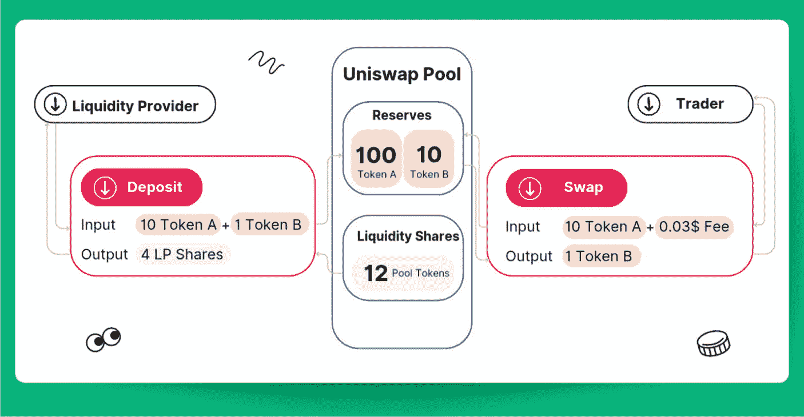
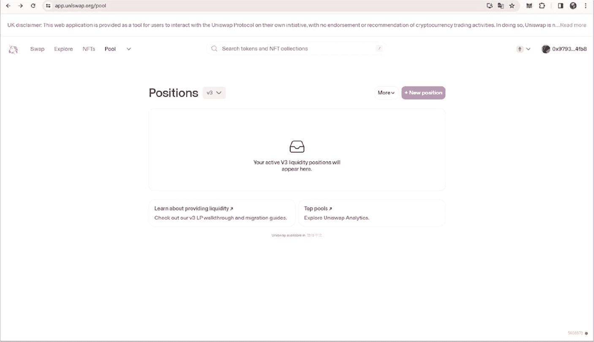
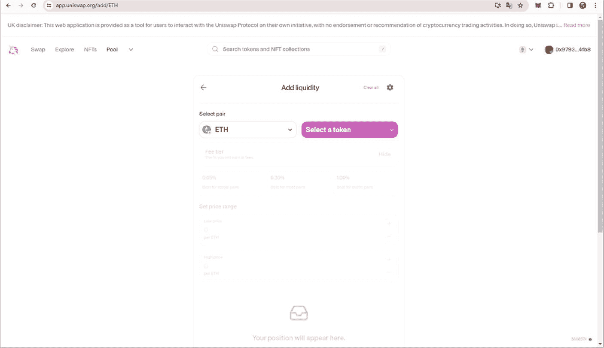

# DEX 与市值管理

## DEX 的工作原理

去中心化交易所（DEX）代表了传统金融交易机制的重大变革，体现了区块链技术核心的去中心化精神。通过在没有中介的情况下实现点对点交易，DEX 提供了中心化交易所（CEX）通常不具备的透明度、安全性和可访问性。

#### 运行原理

包括`Uniswap`等平台在内的大多数 DEX，其核心是自动做市商（AMM）模型。与传统交易所依赖订单簿匹配买卖双方不同，AMM 使用流动性池进行资产交易。这些池由流动性提供者（LP）提供资金，他们将代币对存入智能合约。作为回报，LP 根据其提供的流动性比例赚取交易费用。

图 8-1 DEX 的工作原理

图 8-1 展示了像`Uniswap`这样的去中心化交易所（DEX）如何利用自动做市商（AMM）协议运作的核心流程。

LP 将代币对存入流动性池，这些代币对必须等值以维持池内平衡。在图示中，一位 LP 向`Uniswap`池存入"10 个代币 A + 1 个代币 B"，并收到"4 个 LP 份额"作为回报。这一机制至关重要，因为它使池子拥有充足资金来支持其他用户的交易。

AMM 协议自动完成价格发现，无需传统订单簿。图中通过"交换"操作展示了这一点：用"10 个代币 A"兑换"1 个代币 B"。交易中包含一笔名义费用（此处为$0.03），该费用作为提供流动性的奖励分配给 LP。

AMM 利用了流动性池的概念，池中包含配对代币的储备。这些储备就是交易者进行交易的对象。图中以"12 个池代币"代表的流动性份额，表示 LP 对池子总流动性的比例所有权。当 LP 贡献流动性时，他们会收到池代币，之后可以赎回这些代币以获取其在池中的份额，以及随时间累积的交易费用的一部分。

AMM 最常用的定价机制是恒定乘积公式，表示为`x * y = k`，其中`x`和`y`是流动性池中两种资产各自的存量，`k`是一个常数。该公式确保两种资产存量的乘积始终保持不变，从而在交易后维持池子的平衡。图中虽未明确显示此公式，但它正是所描绘的交换操作的基础。

交易者通过钱包直接与流动性池交互。他们可以与治理流动性池的智能合约进行交互来交换代币，如图 8-1 的"交换"部分所示。费用和滑点由 AMM 根据流动性池的当前状态自动计算。

DEX 的一个关键原则是其去中心化特性。与中心化交易所不同，DEX 不持有用户的资金，所有交易均通过区块链上的智能合约直接执行。这最大程度降低了对手方风险，并提供了交易执行的透明度。

对于流动性提供者而言，主要好处在于赚取交易费用的潜力。然而，他们也会面临诸如无常损失等风险——当池中代币价格在他们存入资产后发生显著变化时，便会产生此类损失。

对于交易者而言，DEX 提供了直接且即时的代币交换优势，且费用可能低于中心化交易所。他们还受益于区块链技术提供的安全性，因为不存在中心化故障点。

#### 代币上架与流动性池

以 Uniswap 为例，上架您的代币并建立流动性池，是启动交易、为代币开拓初始市场的基石步骤。此方法普遍适用于各类去中心化交易所（DEX）平台。

图 8-2 添加流动性 – 1

- **步骤 1：准备您的代币**  
  开始前，请确保您的`ERC20`代币合约已部署至以太坊主网，并且您已将代币发送至您的`MetaMask`钱包。

- **步骤 2：访问 Uniswap 界面**  
  前往 Uniswap 界面。第一张截图展示的是 Uniswap 上的“添加流动性”页面。您将由此开启为代币创建流动性池的流程。

- **步骤 3：连接您的钱包**  
  使用`MetaMask`或其他兼容钱包连接至 Uniswap。连接成功后，您的钱包地址将显示在右上角。

- **步骤 4：添加流动性**  
  点击“Pool”标签页，然后选择“添加流动性”。在界面中，您需要选择希望提供流动性的代币对。在这里，您可以选择您的代币及一个配对币种（如`ETH`），如图 8-2 所示。

图 8-3 添加流动性 – 2

- **步骤 5：设置代币对与初始价格**  
  点击“选择代币”，输入您代币的合约地址并选中它。然后，决定您要存入多少您的代币及其配对币种（例如`ETH`）。两种代币的比例将设定您的初始代币价格。例如，如果您存入 1 个`ETH`和 1000 个您的代币，这实质上意味着 1 `ETH` = 1000 个您的代币。

- **步骤 6：批准并供应流动性**  
  设定好数量后，您需要通过`MetaMask`批准交易，确认您要将这些代币存入流动性池。随后，点击“供应”按钮，完成流动性池的创建并存入您的代币。

- **步骤 7：管理您的头寸**  
  图 8-3 展示了“头寸”标签页，您可以在其中查看和管理您的活跃流动性头寸。添加流动性后，您的头寸将显示在此处，您将看到池份额、累计费用等详细信息，并可以增加或移除流动性。

- **步骤 8：监控与调整**  
  监控您的流动性池并根据需要调整头寸至关重要，尤其是在应对市场变化、收取费用或重新配置资金时。

#### 去中心化、安全性与治理

像 Uniswap 这样的去中心化交易所（DEX）利用去中心化基础设施，通过自动化智能合约实现交易。这不仅最大限度地降低了中心化托管常见的安全漏洞风险，还赋予了用户对其资金的完全控制权。DEX 的非托管性质意味着用户直接与合约交互，始终保持对其私钥（从而对其资产）的所有权。然而，智能合约赋予的自主权也伴随着尽职调查的责任；用户必须认识到这些合约中潜在漏洞的风险。因此，定期审计和严格的安全检查对于维护这些平台的可信度与信任至关重要。

DEX 的治理结构通常通过去中心化自治组织（DAO）来实现，社区通过基于代币的投票系统参与其中。与通常层级分明的传统公司治理不同，DAO 提倡扁平化和包容性的结构。代币持有者直接参与决策过程，影响平台运营的关键方面，例如费用结构、代币支持、协议升级乃至资金管理。

这种民主治理模式是去中心化精神的基础，确保权力动态平衡，并使社区能够引导平台朝着符合共同利益和价值观的方向发展。DAO 透明且基于共识的性质，与公司环境中常见的闭门决策和自上而下的指令形成鲜明对比。

本质上，DEX 中融合的去中心化、安全性和基于 DAO 的治理，培育了一个安全、透明和社区赋权相互交织的生态系统。这种从中心化权威到集体治理的范式转变，是 DEX 的一个显著特征，也是数字资产交易领域的一次重大演变。

### 8.2 代币市值管理策略

市值不仅仅是加密资产当前价值的简单体现；它是建立投资者信心和评估市场稳定性的基石。本节详细阐述有效管理市值的方法，特别是针对在去中心化交易所（DEX）上上架的代币。

#### 代币销毁

代币销毁是一种通缩机制，即通过将代币发送到无法找回的地址（即所谓的“死”钱包）来将其永久移出流通。此策略类似于公司回购股票——它减少了供应量，并且在需求不变或增加的前提下，可能推高剩余代币的价值。这一概念类似于通过操纵供给来影响价值和流通速度的货币政策工具，其额外好处是传递了对代币经济健康发展的长期承诺信号。

#### 流动性提供

提供流动性对于维持 DEX 的平稳运行和代币价格的稳定性至关重要。在 Uniswap 及类似协议中，流动性池使参与者能够进行交易和产生收益，是代币健康状况和生态系统活力的有力指标。流动性提供充当着抵御波动的缓冲垫，确保大额交易不会显著影响价格，从而保护市值免受剧烈波动的冲击。

#### 合作伙伴关系与集成

建立战略合作伙伴关系并将代币集成到更广泛的生态系统中，可以创造多方面的需求，进而可能提升市值。合作范围从实现不同区块链平台之间的互操作性，到将代币嵌入去中心化金融（DeFi）协议。此类集成扩展了代币的实用性，通常能形成积极的正反馈循环，维持并增长用户基础，从而巩固资产估值。

#### 机制与财政政策设计

在多个交易所提供流动性的做市策略，对于管理代币在市场上的存在感和表现至关重要。此类策略可以镜像流动性，创造无缝的交易体验，并统一各交易所的价格，进而影响市值认知。此外，质押奖励等财政激励措施鼓励持有，降低了代币流通速度，并增加了代币的感知价值。

#### 算法做市

可以利用算法交易来优化流动性提供、增强订单簿深度并更有效地管理风险。通过高频交易和利用计算模型，DEX 可以为代币提供更好的价格稳定性，这是市值管理的关键因素。这些算法对市场状况的反应速度远快于手动交易，能够调整订单以维持最佳流动性水平和价差。

#### 战略分发

深思熟虑的代币分发策略对于确保代币广泛且均匀分布至关重要，这有助于降低波动性并促进健康的交易环境。空投等技术既可以作为营销工具，也能作为增加代币持有者数量的机制，从而可能稳定并提高市值。

#### 货币政策：销毁与铸造平衡

引入销毁与铸造机制有助于管理代币的流通速度和市值。通过在交易处理过程中销毁代币，并根据生态系统增长铸造新代币，可以建立一种动态平衡。这种方法能够稳定代币的供需关系，长期促进市值的可持续增长。

上述策略并非详尽无遗，但为理解 DEX 上加密资产管理市值的复杂性提供了基础认识。这些策略必须结合对代币经济学、市场趋势以及每种加密资产独特属性的深刻理解，审慎运用。正是通过这种多管齐下的方法，代币才能实现均衡且稳健的市值，从而在数字经济中反映其真实价值和效用。

### 8.3 DEX 的未来发展

在去中心化交易所（DEX）的未来发展中，其轨迹将着眼于应对关键挑战并利用新兴技术。虽然第 4.3 节已讨论过 Layer 2 等扩容解决方案，第 5.3 节也涉及了监管问题和去中心化身份（DID）方面，但这些依然是推动 DEX 演进的基础。在此，我们的关注重点是 DEX 与传统金融的融合，以及应对即时流动性攻击和夹心攻击等对用户和流动性提供者造成困扰的挑战。这些基础方面将与未来的举措无缝融合，确保 DEX 能够从容应对日益成熟的数字经济的复杂性。

#### 与传统金融融合

与传统金融的融合是 DEX 演进中的关键领域。³ DEX 有望通过以下几种举措弥合与传统金融的差距：

1.  **资产代币化**：DEX 可能会扩展以包含更广泛的代币化资产，例如房地产、股票或大宗商品，允许传统资产在去中心化环境中进行交易。

2.  **混合金融产品**：凭借 Uniswap V4，挂钩功能实现了更高的可定制性，并能满足与各种 DeFi 协议的复杂交互，通过模拟熟悉的金融工具，可能吸引传统金融参与者涉足去中心化领域。⁴

3.  **加强监管合规性**：在保持去中心化和隐私性的同时，DEX 可能会纳入符合全球标准的监管框架，以促进机构采用。

#### 应对即时流动性攻击和夹心攻击

即时流动性攻击是 DEX 中的一个隐患，攻击者通过操纵流动性池获利。然而，Uniswap V4 强调增强安全措施，以降低此类风险：

1.  **单例合约**：此合约减少了多次交易的需求，从而可能降低即时流动性攻击的机会。

2.  **闪电记账**：通过整合多种操作，如兑换和添加流动性，Uniswap V4 旨在通过在交易结束时结算所有债务，来减少即时流动性攻击的可能性。⁵

夹心攻击同样是个问题，攻击者通过操纵市场价格，从内存池中排队等待的交易中获利。为应对这些攻击：

1.  **时间加权平均做市商（TWAMM）**：Uniswap V4 将实施 TWAMM 来保护用户免受价格操纵，因为它会随时间分散执行大额订单以最小化市场影响。

2.  **更优的预言机**：凭借内置的预言机，Uniswap V4 将使攻击者操纵市场价格变得更加困难和昂贵。

3.  **反制措施**：像 1inch 等平台引入的`flashbot transactions`等解决方案（这些交易在内存池中不可见）可能会被广泛采用，以防止诸如夹心攻击之类的抢跑交易。⁶

#### TWAMM 与 CFMM 对比

时间加权平均做市商（TWAMM）是 Uniswap V4 引入的一个新概念，旨在解决传统自动做市商（AMM），尤其是恒定函数做市商（CFMM）中的某些低效问题。

TWAMM 允许大额订单在一段较长时间内执行，从而最小化对市场价格的即时影响。它通过将大额交易拆分成小份，并定期执行这些份额来实现这一点。这种渐进式执行可以防止在 CFMM 中常见的大额订单导致的剧烈价格滑点。

像 Uniswap V2 和 V3 中使用的 CFMM，依赖于一个公式来确保两种资产数量的乘积保持不变。它们允许流动性提供者通过存入两种资产来创建资金池，交易者随后可以用一种资产兑换另一种。虽然这种设计确保了流动性，但它也有一些缺点：

1.  **滑点**：大额交易会显著改变资金池中的资产比率，导致巨大的价格影响。
2.  **无常损失**：当流动性提供者贡献流动性后，资金池中的资产价格发生变化时，他们可能会遭受损失。
3.  **资本效率**：CFMM 通常需要更多资本才能有效地在广泛的价格范围内提供流动性。

Uniswap V4 中的 TWAMM 设计提供了几个优势：

**表 8-1** TWAMM 与 CFMM 对比表

| 方面 | CFMM（如 Uniswap V2/V3） | TWAMM（Uniswap V4） |
| --- | --- | --- |
| 交易执行 | 基于当前资金池比率即时执行 | 随时间执行，减少即时影响 |
| 市场影响 | 大额交易影响高 | 因时间分散而影响降低 |
| 资本效率 | 因价格范围而异 | 由于优化执行，可能更高 |
| 套利 | 价格滑点带来机会 | 因渐进执行而机会减少 |
| 实现复杂度 | 相对简单 | 因时间加权执行而更复杂 |
| 用户体验 | 即时兑换 | 订单在一段时间内执行 |

1.  **最小化市场影响**：通过拆分和分散交易，TWAMM 减少了大额交易造成显著价格滑点的可能性。
2.  **减少套利机会**：大额订单随时间渐进执行，减少了在 CFMM 中大额交易后可能出现的套利机会。
3.  **长期订单执行**：TWAMM 对于希望在不立即影响市场的情况下执行大额交易的交易者或实体而言非常有利，类似于传统金融中的定投策略。

通过引入 TWAMM，Uniswap V4 旨在为交易者和流动性提供者提供更先进、更高效、更友好的交易体验。其关键创新在于将 CFMM 的即时性和简便性与时间分散的订单执行方法相结合，这可能会带来一个更稳定、更可预测的市场，对 DeFi 协议尤其有益。

#### 激励流动性提供者

为了激励流动性提供者（LP），Uniswap V4 及其他去中心化交易所（DEX）预计将提供更好的激励措施：

1.  ****降低 Gas 费用****：通过将流动性池整合到单一合约中，Gas 费用将显著降低，从而使 LP 参与的更具性价比。

2.  **动态费用**：LP 可以对其收取的费用拥有更多控制权，从而可能最大化其提供流动性的回报。

3.  **定制化池**：Uniswap V4 中的 `Hooks` 将允许 LP 创建具有特定功能的池，吸引不同类型的交易者，并可能增加费用收入。

借助 Uniswap V4 的单例合约、`TWAMM`、更优质的价格预言机和 `hooks` 等创新，DEX 有望彻底改变数字资产交易和投资方式，使该平台对零售和机构参与者都更具吸引力。这些进步将通过降低成本、降低风险并提供新的收入机会来满足 LP 的需求，从而进一步巩固 DEX 在未来金融领域的地位。

### 8.4 总结

本章详细探讨了去中心化交易所（DEX）以及在这些平台上交易的代币的市值管理策略。首先解释了 DEX 的运作方式，即使用自动做市商（AMM）模型，该模型用流动性池取代了传统的订单簿机制。流动性提供者（LP）将代币存入这些池中，在赚取费用的同时，为交易者实现无缝的代币兑换。这种去中心化系统提供了透明度、安全性以及用户对资产的控制权，使其与中心化交易所（CEX）区别开来。

本章还深入探讨了各种市值管理策略，包括代币销毁机制、流动性提供、合作以及算法做市。这些策略对于维持代币价值、稳定价格和增强投资者信心至关重要。诸如销毁-铸造均衡模型等货币政策的作用被重点强调，将其作为管理代币供需动态的一种方法。

此外，本章还探讨了 DEX 的未来，重点关注与传统金融的整合以及解决关键安全问题，例如即时（JIT）流动性攻击和三明治攻击。文中讨论了 Uniswap V4 的时间加权平均做市商（TWAMM）和改进的价格预言机等创新，将其视为缓解这些风险、提升交易体验以及鼓励流动性提供的解决方案。

总之，DEX 通过提供去中心化、透明且安全的交易平台，同时提供用于管理市值和流动性的复杂工具，有望彻底改变金融格局。

### 注释

1.  George, B., & Bochan, T. (2024). 中心化交易所 (CEX) 与去中心化交易所 (DEX)：有什么区别？Coindesk. [`www.coindesk.com/learn/centralized-exchange-cex-vs-decentralized-exchange-dex-whats-the-difference/`](http://www.coindesk.com/learn/centralized-exchange-cex-vs-decentralized-exchange-dex-whats-the-difference/) (访问日期：2024 年 4 月 9 日).

2.  去中心化交易所：运作原理与显著特征 (2024). [`https://bitsgap.com/blog/how-decentralized-exchanges-operate`](https://bitsgap.com/blog/how-decentralized-exchanges-operate) (访问日期：2024 年 4 月 9 日).

3.  Oliver Wyman Forum, DBS, Onyx by J.P. Morgan, & SBI Digital Asset Holdings. (2022). 机构 DeFi：下一代金融. [`www.jpmorgan.com/onyx/documents/Institutional-DeFi-The-Next-Generation-of-Finance.pdf`](http://www.jpmorgan.com/onyx/documents/Institutional-DeFi-The-Next-Generation-of-Finance.pdf) (访问日期：2024 年 4 月 9 日).

4.  CyberArk Software (2024). 什么是即时 (JIT) 访问？ CyberArk. [`www.cyberark.com/what-is/just-in-time-access/`](http://www.cyberark.com/what-is/just-in-time-access/) (访问日期：2024 年 4 月 9 日).

5.  CyberArk Software (2024). 什么是即时 (JIT) 访问？ CyberArk. [`www.cyberark.com/what-is/just-in-time-access/`](http://www.cyberark.com/what-is/just-in-time-access/) (访问日期：2024 年 4 月 9 日).

6.  Sergeenkov, A. (2021). DeFi 中的三明治攻击是什么——以及如何避免？ CoinMarketCap 学院. [`https://coinmarketcap.com/academy/article/what-are-sandwich-attacks-in-defi-and-how-can-you-avoid-them`](https://coinmarketcap.com/academy/article/what-are-sandwich-attacks-in-defi-and-how-can-you-avoid-them) (访问日期：2024 年 4 月 9 日).

7.  Hoogendoorn, R. (2024). 什么是 Uniswap V4，以及它将如何彻底改变 DeFi. [`https://dappradar.com/blog/uniswap-v4-defi-guide-hooks-singleton-contract`](https://dappradar.com/blog/uniswap-v4-defi-guide-hooks-singleton-contract) (访问日期：2024 年 4 月 9 日).

