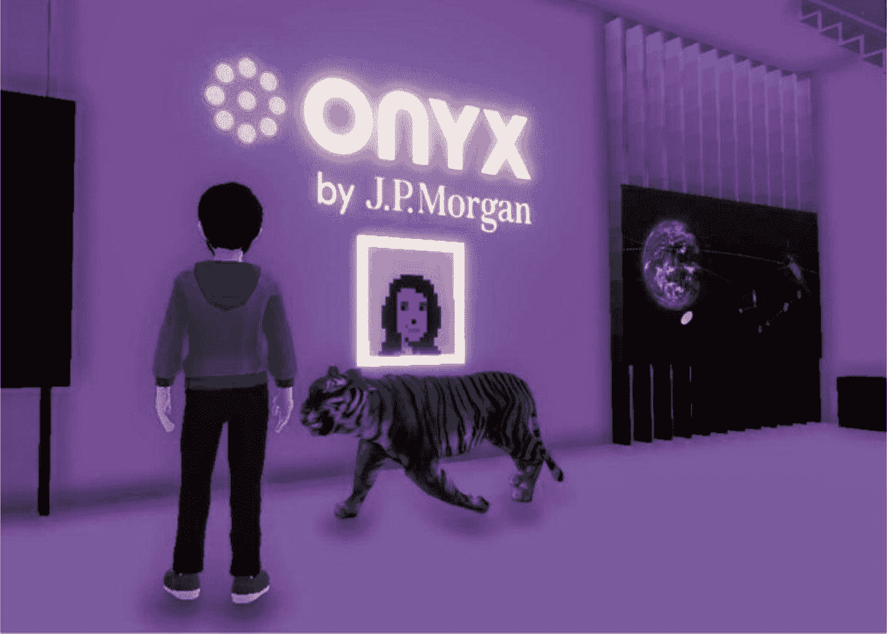

# 9. 导航 Web3 与元宇宙的未来

## 9.1 Web3 与元宇宙：基础与技术

元宇宙这一术语最早出现在尼尔·斯蒂芬森 1992 年的科幻小说 *雪崩* 中，它代表着一个由虚拟增强的物理现实、增强现实（AR）和互联网融合而成的集体虚拟共享空间。这个数字宇宙允许用户与计算机生成的环境以及其他用户进行交互。该概念已从虚构想象演变为技术发展的一个重要焦点，旨在创造身临其境的数字世界，让人们可以在其中工作、娱乐、社交，并参与跨越数字与物理世界的各种体验。

在元宇宙的发展过程中，Web3 的需求至关重要，这源于当前互联网基础设施（即 Web2）的局限性。Web2 的特点是数据集中控制，用户对数字资产和身份的所有权有限。而 Web3 凭借其去中心化的特性、区块链技术以及对用户主权的强调，为构建一个真正身临其境、可交互且用户拥有的元宇宙提供了必要的基础要素。

从 Web1 到 Web3 的互联网演进，标志着用户与数字内容交互方式、内容控制权归属、支撑这些交互的底层技术以及用户在该生态系统中角色的重大转变。每一代网络都建立在上一代基础之上，从静态页面集合发展到动态交互体验，如今又迈向强调用户主权和资产所有权的去中心化平台。表 9-1 详细对比了这三个阶段，突出了定义每个时代的核心差异。

**表 9-1** Web1、Web2 与 Web3 对比

| 特性 | Web1（静态网络） | Web2（社交网络） | Web3（去中心化网络） |
| --- | --- | --- | --- |
| 交互方式 | 只读，用户交互有限 | 读写，交互式应用程序和社交网络 | 读、写并拥有，强调用户所有权及与数字资产的交互 |
| 内容控制 | 内容由网站所有者创建和控制 | 内容创作民主化，但由平台集中控制 | 去中心化控制，用户拥有自己的内容和数据 |
| 技术 | 基础 HTML，静态页面 | AJAX、JavaScript，支持动态内容和应用 | 区块链、去中心化应用（DApp）、智能合约 |
| 用户角色 | 内容消费者 | 内容创作者和消费者，但存在严重的隐私和数据所有权问题 | 自身数据和数字资产的所有者，去中心化经济的参与者 |

Web1 常被称为“静态网络”，它为数字时代奠定了基础，让用户能够访问信息，但交互有限。Web2 或“社交网络”通过支持用户生成内容和社交网络彻底改变了这一模式，促进了前所未有的互动性和社群创建。然而，它也将数据控制权集中在了少数几个主要平台手中，引发了关于隐私和数据所有权的问题。Web3 代表了下一个前沿领域，即“去中心化网络”，其旨在通过利用区块链技术将数据与数字资产的控制权和所有权归还给用户自身，从而解决这些问题。这一转变不仅具有技术层面的意义，也深刻影响了数字生态系统的社会经济结构。

表 9-1 展示了互联网演进过程中用户能力与自主权的逐步增强。Web1 将互联网的基础确立为一个数字信息存储库。Web2 在此基础之上，使互联网更具交互性和社交性，但却集中了权力和控制权。Web3 试图将这些控制权重新分配给用户，确保他们能够拥有、控制自己的内容及对数字世界的贡献，并从中获利。向 Web3 的转变不仅代表着技术创新，更是对互联网赋能个人与社区潜力的重新构想。

### 元宇宙的核心基础要素

元宇宙这一概念激发了技术专家、创作者和消费者的想象力，正站在重新定义数字与现实领域的门槛上。它的基础建立在一系列技术进步之上，这些进步使其区别于我们已习以为常的传统互联网和数字空间。在此，我们将深入探讨构成元宇宙核心基础的关键要素，这些要素使其成为未来世代独特且具有变革性的平台：

-   **去中心化架构**：元宇宙利用区块链技术确保在其广阔的数字化版图中，数据的完整性、安全性和所有权得到维护。区块链固有的特性，如去中心化、不可篡改性和透明度，为构建一个用户能够信任其数据和交易安全的元宇宙提供了坚实框架。通过去中心化架构，元宇宙确保没有任何单一实体能够控制整个生态系统，从而实现了数字互动和所有权的民主化。

-   **沉浸式技术**：元宇宙体验的核心是虚拟现实（VR）、增强现实（AR）和 3D 建模等沉浸式技术。VR 将用户沉浸在数字环境中，使他们能够以高度逼真的方式与虚拟世界互动。AR 则将数字信息叠加到物理世界上，用交互式数字元素丰富用户的现实环境。3D 建模和模拟技术能够在元宇宙中创建复杂、逼真的物体和环境。这些技术共同创造了引人入胜的沉浸式体验，模糊了数字世界与物理世界之间的界限。¹

-   **数字经济**：元宇宙引入了一种数字经济，通过非同质化代币（NFT）和加密货币促进数字资产的真正所有权。NFT 代表独特的数字物品——从艺术品和收藏品到虚拟房地产等——而加密货币则能在元宇宙内实现安全、透明的金融交易。这种经济模式允许创建、购买、出售和交易虚拟商品与服务，培育出一个反映现实世界经济复杂性和动态性的繁荣经济体。

-   **互操作性**：元宇宙的一个关键特征是能够确保资产和身份在不同环境和平台之间无缝移动。这是通过开发和采用促进互操作性的标准和协议来实现的。通过使资产能够在各种虚拟空间中具有可移植性和持久性，元宇宙提供了一种超越单个平台或应用程序的统一、连续的体验。²

-   **空间计算**：结合了人工智能（AI）、机器学习和空间技术的元宇宙，能够在其环境中实现复杂的交互和行为。空间计算允许理解和操控数字与物理空间，使 AI 驱动的化身能够在元宇宙中导航，实现逼真的物理模拟和上下文感知的数字内容。这种级别的计算智能对于创建能够适应与用户交互和行为的动态、响应式环境至关重要。³

这些基础要素共同预示着一个未来，即数字与现实世界的融合将为协作、创造力和互动开启前所未有的机遇。由 Web3 技术驱动的元宇宙，标志着我们感知和互动数字空间方式的根本性转变，预示着数字存在的新纪元。

## 9.2 Web3 与元宇宙中的经济模型与机遇

在审视 Web3 和元宇宙所呈现的不断演变的经济模型与机遇时，我们显然正处于一个根本性转变的前沿——经济系统的结构方式、价值的创造与分配方式，以及个人和组织在数字领域内的互动方式都将发生改变。此番阐述旨在汲取这些变革性转变的关键见解，借鉴区块链和数字资产领域中更广泛的概念。⁴^, ⁵

### 去中心化经济系统

Web3 和元宇宙向去中心化经济模型的转变，代表着从传统的股东中心模型，向利益相关者在经济成果中拥有更大话语权和份额的系统的转变。这一范式转变扩展了资本的定义，将数字资产、知识产权和用户参与度纳入其中，从而使经济参与和利益分配民主化。让我们深入探讨**4D 元经济学**，并探索它们在去中心化经济系统中的作用：

-   **数字创作**：这一维度聚焦于元宇宙中数字内容的生产。它涵盖了从虚拟世界和数字商品的创建，到音乐、艺术和文学等媒体内容的生成。在去中心化系统中，创作者保留对其作品的拥有权和控制权，利用区块链技术保护知识产权和管理权利。这种赋权不仅促进了创新，也确保了创作者获得公平的报酬。

-   **数字资产**：数字资产包括从代表虚拟物品所有权的 NFT，到代表数字企业股份的代币。这些资产的独特之处在于它们提供了所有权的证明，并可以在元宇宙的不同平台和服务之间进行交易或使用。它们在数字市场中的互操作性和流动性，标志着从物理资产限制的重大转变，提高了 Web3 中经济交易的速度和规模。

-   **数字市场**：这是数字资产进行买卖或交易的地方。元宇宙中的数字市场被设计成开放且全球性的，7x24 小时运行，不受地理边界或中心化控制的限制。这些市场依赖区块链来实现无需信任的交易，利用智能合约执行自动协议，并通过去中心化交易所实现无需中介的点对点交易。

-   **数字货币**：作为元宇宙交易活动的命脉，加密货币等数字货币允许价值在数字领域中无缝转移。除了作为交易媒介之外，这些货币还可以代表治理代币，赋予持有者在去中心化自治组织（DAO）或其他 Web3 实体中参与决策的投票权。

在 4D 元经济学的背景下，去中心化经济系统意味着一个整体的生态系统，其中每个维度相互作用，共同构建一个强大且包容的经济体。在这里，利益相关者不仅仅是消极的投资者，而是积极的参与者，对数字商品和服务的创建、估值、交易和使用拥有重要的话语权。这种包容性和参与性的经济有可能在全球范围内重新定义财富的创造、分配和经济赋权，开辟出远超传统经济体系所能提供的、广泛创造和分配财富的机遇。

### 价值创造与分配

元宇宙中的价值创造过程依赖于数字平台的运用，创作者可以在这些平台上摆脱物理世界的限制进行创新。例如，虚拟房地产的开发可以创建用于社交互动、商业和娱乐的空间。Web3 中的开发工具和平台设计得更加易用，这使创造过程大众化。用户不再是单纯的消费者，他们自己也成为创造者，参与并推动元宇宙的扩张与多样性。

元宇宙中的价值分配通过区块链技术得以实现，该技术建立了一个公平透明的系统，贡献和交易都会被记录并得到相应奖励。智能合约根据利益相关方预先商定的规则自动分配收益，确保创作者和参与者能从其贡献所产生的利润中获得公平份额。

元宇宙中的变现策略与资产本身一样多样化。创作者可以通过 NFT 将数字艺术变现，开发者可以出售虚拟房地产，游戏玩家则能通过“边玩边赚”模式获利。元宇宙中创作者与消费者之间的直接关系消除了传统经济中的许多中间商，从而实现了更高效、更公平的资金流动。

在元宇宙中，传统的市场规则被颠覆，稀缺性不再由物理限制决定，而是由设计和共识决定。元宇宙经济遵循丰裕和网络效应的原则，数字资产的价值往往随着其在不同平台和应用中的使用和整合而增加。这创造了一种更具活力和流动性的经济模式，其中价值并非仅仅基于稀缺性或传统的供需动态。

4D 元宇宙经济学为创新金融模式铺平了道路，例如数字资产的碎片化所有权以及元宇宙内微观经济体的出现。这些模式为大小投资者提供了参与数字资产增长的机会。此外，DeFi（去中心化金融）的整合引入了新的投资和融资机制，如收益农耕和流动性挖矿，这些是区块链经济所独有的。

在这个扩张的数字经济中，每一次互动、每一次创造、每一笔交易都有潜力产生价值，这些价值可以以传统市场未曾设想的方式进行捕获、分配和变现。随着这些系统的持续演进，它们有望带来更具个性化、赋能和民主化的经济体验。

### 协作工作与创新

在 Web3 和元宇宙的背景下，向协作工作和创新的转变预示着一个集体创造力和分布式创业的新时代。这种变革性的方法重塑了工作格局，模糊了创造者、消费者和协作者之间的界限：

-   **众包创新**：Web3 平台赋能一种众包创新模式，创意和项目可以从全球社区中获取。通过 DAO 和开源框架等机制，来自不同背景的个人可以为同一个项目做出贡献，将创新的边界推向超越单个组织或地域可能达到的范围。

-   **去中心化协作平台**：元宇宙提供了允许在虚拟环境中进行实时协作的平台。这些平台不受地域限制，实现了全球范围内的实时互动和团队合作，从而可能带来更快的构思和开发周期。虚拟空间可以模拟现实世界的条件，也可以为解决问题和发挥创造力提供全新的环境。

-   **重新定义角色与雇佣关系**：在元宇宙中，员工、承包商和消费者等传统角色正在被重新定义。用户可以同时是价值链中的创造者、市场参与者和受益者。这种角色的多重性营造了一个工作、参与和消费相互交织的动态环境。

-   **数字经济中的生产力**：元宇宙中的生产力指标被重新构想，重点在于贡献和影响力，而非工时等传统指标。在这种环境下，通过自动化日常任务的数字工具和 AI 助手，工作效率可以大幅提升，从而解放人类的创造力，使其专注于更高层次的问题解决和艺术创作。

-   **开放的人才网络**：元宇宙创建了开放的人才网络，个人可以在其中展示自己的技能，并被潜在的协作者或雇主发现。这些网络支持全球范围内的零工经济，并有可能比以往任何时候都更高效地将人才与机会匹配起来。

-   **激励对齐**：在元宇宙中，经济激励可以通过代币经济学与贡献对齐，确保贡献价值的人获得回报。这种直接的激励机制鼓励积极参与和持续贡献，这对于持续创新至关重要。

元宇宙和 Web3 不仅改变了我们工作的地点和方式，也改变了我们工作的原因。它们为构建一个更具协作性、创新性和包容性的经济结构奠定了基础，这种结构激励并奖励参与和贡献，为未来个人的激情追求与集体目标能够合二为一铺平了道路。

### 代币化与经济激励

代币化是 Web3 和元宇宙领域中经济互动的基石，它彻底改变了我们定义和交换价值的方式。它将各种形式的资产和权利转化为代币，实现了所有权和交换的无缝代表。这些代币可以交易、质押，或用于参与治理流程，使经济活动和决策权变得更加民主化。

激励是这种模式的内在要素，它奖励创作者和用户做出的贡献与参与。对于创作者而言，代币化开辟了内容直接变现的新途径，提供了有别于由中间商主导的传统收入流。另一方面，用户则受益于流动性增强，以及活跃市场中代币升值所带来的财务增长潜力。

DeFi 生态系统尤其依赖代币化蓬勃发展，它提供了去中心化的金融服务，如借贷、交易和资产保险，所有这一切都无需传统银行系统的集中控制。这些服务由智能合约驱动，可自动执行交易并强制执行协议，提供了更具包容性和更透明的金融基础设施。

总体而言，代币化体现了去中心化经济的精髓，通过将经济激励与开放性和可访问性的价值观相结合，激发了创新和参与。它使得财富和机会的分配更加灵活和公平，重塑了我们在数字时代对金融体系的理解。

Web3 和元宇宙中的经济模型和机遇代表了对传统体系的彻底背离，为构建一个更加去中心化、公平和包容的经济格局铺平了道路。以代币化为核心，这种新范式允许对所有权和参与进行精细化的代表，赋予创作者、创新者和用户直接的经济激励，并让他们对自己的数字互动拥有更大的控制权。通过超越地理和组织界限的全球平台，协作工作得到了加强，从而培育了开放创新的文化。DeFi 的整合通过提供透明、以用户为中心的金融服务替代方案，进一步挑战了传统金融机构。这种向数字化经济的转变，以其 4D 元经济结构为特征，预示着这样一个未来：价值的创造、分配和交换将更加易于获取、充满活力，并且与全球互联社区的集体利益保持一致。

## 领先平台、项目及其应用

在不断扩展的 Web3 和元宇宙世界中，像 `Decentraland` 这样的平台，以及像摩根大通这样的传统金融机构的创新实践，为数字经济中的适应与演变提供了清晰的案例研究。

### `Decentraland`：用户治理虚拟房地产案例研究

`Decentraland` 是一个建立在以太坊区块链上的自治、沉浸式虚拟平台的领先范例。它是一个去中心化的虚拟世界，用户可以在其中创建、享受内容与应用并从中获利。在 `Decentraland` 中，用户可以购买虚拟土地的 NFT 地块，然后对其进行开发，打造从游戏到教育服务和互动艺术展览等独特体验。

`Decentraland` 发展中的一个重要里程碑是 `Metajuku` 的推出，这是东京原宿购物区的虚拟翻版。这一发展突显了该平台的商业潜力，展示了品牌如何建立虚拟空间来与受众互动。例如，一大块虚拟土地被购买，用于开发成一个繁华的商业中心，这表明虚拟房地产市场价值的不断增长及其对个人投资者和企业实体的吸引力​​​​。⁶

### 摩根大通进军元宇宙：`Onyx Lounge` 及其他

摩根大通通过在 `Decentraland` 的 `Metajuku` 区开设 `Onyx Lounge`，展示了其对元宇宙潜力的切实信心。这个虚拟空间以该银行基于以太坊的许可服务套件命名，内有一幅摩根大通 CEO 的数字画像和一只漫步的老虎，象征着该银行在未知数字领域的开拓精神。

**图 9-1** 摩根大通元宇宙休息室⁶

然而，摩根大通参与元宇宙并不仅仅是为了创建一个供访客参观的虚拟空间。该银行发布了一份关于元宇宙机遇的白皮书，将自己定位为引导企业如何驾驭并利用这片新疆域的思想领袖。他们已经认识到，供需动态正驱使个人进入一个新兴的元经济，这需要开发新技能并为劳动力创造新的机会。

通过认识到虚拟房地产可能包含类似物理世界的信贷、抵押贷款和租赁协议，摩根大通已表明其准备为虚拟土地市场提供融资。他们指出了对虚拟土地的大量投资，并暗示适用于物理房地产的相同金融原则可能很快也会适用于虚拟房地产。

摩根大通在元宇宙中的举措为其他企业树立了标杆，表明对数字空间的投资不仅仅是投机，更是战略性的。这家金融巨头看到了提供与元宇宙相关的金融服务（例如虚拟房产的抵押贷款和信贷便利）的潜力，并将这些服务视为未来的增长领域。

这些案例研究展示了去中心化平台和成熟企业如何拥抱元宇宙的新经济格局。`Decentraland` 正在率先探索社区驱动的虚拟体验模式，而摩根大通的尝试则展示了传统金融机构在这些数字领域中创新和适应的能力。这些实体的举措和探索提供了宝贵的见解，让我们了解元宇宙如何重塑互动方式，为投资、商业和社区建设提供新的途径。

## 未来方向：挑战与准备

在我们探索 Web3 和元宇宙的最后一节中，必须认识到，尽管这些技术代表了变革的可能性，但它们也带来了重大挑战，需要周密的准备。这些数字空间的未来取决于对各种问题的主动管理，范围从监管合规一直到平台本身的架构。

### 监管与伦理考量

元宇宙和 Web3 前所未有的性质引入了一系列复杂的监管和伦理问题，必须加以解决以保护消费者并确保这些新系统的稳定性：

-   **数据隐私与安全**：随着用户在数字领域中的生活比重越来越大，保护个人数据免受滥用和泄露变得至关重要。类似于通用数据保护条例（GDPR）的立法需要根据元宇宙的独特性质进行调整。

-   **消费者保护**：必须建立相关机制以防止欺诈活动，并确保数字资产的真实性。清晰的指南和标准对于交易（尤其是涉及 NFT 和加密货币的交易）至关重要。

-   **内容审核**：围绕内容的伦理考量，包括防止有害活动和网络欺凌，需要周密的审核策略，在尊重言论自由的同时保护用户。

### 未来方向：挑战与准备

Web3 与元宇宙的发展轨迹表明，若要充分实现其潜力，必须克服若干技术和社会障碍：

- **互操作性**：为了构建真正统一的元宇宙，不同平台必须能够无缝协作。用户应能无摩擦地在虚拟空间之间移动，并保留其数字资产和身份。
- **可扩展性**：支撑这些空间的基础设施必须足够稳健，以支持数百万并发用户进行复杂交互，这对计算能力和网络架构提出了重大进步要求。
- **用户普及**：弥合早期用户与公众之间的鸿沟，需要让这些空间更加易用和便捷。同时，有必要教育潜在用户了解 Web3 和元宇宙的价值与运作方式。

#### 为未来之路做好准备

为了应对这些挑战，需要多方利益相关者共同努力：

- **制定标准和协议**：跨行业协作建立通用标准和协议，将促进不同元宇宙平台之间的互操作性和用户参与。
- **构建稳健的基础设施**：投资于底层技术，从服务器容量到开发工具，将实现可扩展且可持续的增长。
- **培育协作生态系统**：鼓励科技公司、监管机构和用户社区之间建立合作伙伴关系，将确保元宇宙以包容、合乎道德且惠及所有利益相关者的方式发展。
- **建立清晰的监管框架**：政策制定者必须与技术提供商合作，制定兼顾创新与消费者保护及伦理考量的法规。

随着元宇宙和 Web3 的持续演进，积极应对这些挑战并为未来做好准备将至关重要。这是一段需要创作者、监管者和用户共同努力的旅程，以确保下一代互联网能够兑现其提供更互联、更沉浸式数字体验的承诺。

### 9.5 本章小结

本章审视了 Web3 与元宇宙的融合，重点关注这些技术如何改变数字体验与经济形态。诸如区块链、VR/AR 和空间计算等关键基础技术，使得能够创建、拥有和交易数字资产的沉浸式去中心化环境成为可能。

本章还探讨了去中心化经济模型，其中代币化、NFT 和加密货币驱动着元宇宙的数字经济。通过 Decentraland 和摩根大通 Onyx Lounge 等案例研究，本章阐述了去中心化社区与传统金融机构如何利用元宇宙进行创新。

最后，本章指出了未来的挑战，包括监管问题、可扩展性以及互操作性的需求。利益相关者之间的协作以及稳健的基础设施，对于 Web3 和元宇宙未来的成功至关重要。

### 引用注释

1. Milgram, P., & Kishino, F. (1994). A taxonomy of mixed reality visual displays. IEICE Transactions on Information and Systems, 77(12), 1321–1329.
2. Yang, L., Ni, S. T., Wang, Y., Yu, A., Lee, J. A., & Hui, P. (2024). Interoperability of the Metaverse: A Digital Ecosystem Perspective Review. arXiv preprint arXiv:2403.05205.
3. Zambonelli, F., & Mamei, M. (2004). Spatial computing: An emerging paradigm for autonomic computing and communication. In Workshop on Autonomic Communication (pp. 44–57). Berlin, Heidelberg: Springer Berlin Heidelberg.
4. 万向区块链. (2022). 肖风:元宇宙有十大经济规则. AI 新智界. [`www.aixinzhijie.com/article/6795694`](http://www.aixinzhijie.com/article/6795694) (Accessed: 9 April 2024).
5. 肖风, 万向区块链实验室创始人肖风:元宇宙的新经济规律 | 每经网. (2022). [`www.nbd.com.cn/articles/2022-09-26/2480200.html`](http://www.nbd.com.cn/articles/2022-09-26/2480200.html) (Accessed: 9 April 2024).
6. Shevlin, R. (2022). JPMorgan Opens a Bank Branch in the Metaverse (But It’s Not What You Think It’s For). Forbes. [`www.forbes.com/sites/ronshevlin/2022/02/16/jpmorgan-opens-a-bank-branch-in-the-metaverse-but-its-not-for-what-you-think-its-for/?sh=44b1ec05158d`](http://www.forbes.com/sites/ronshevlin/2022/02/16/jpmorgan-opens-a-bank-branch-in-the-metaverse-but-its-not-for-what-you-think-its-for/?sh=44b1ec05158d) (Accessed: 9 April 2024).