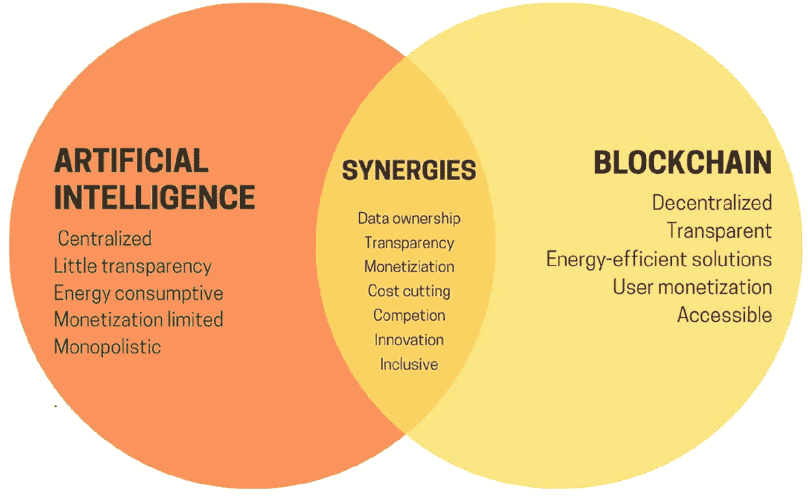

# 生成式 AI 增强的区块链

在第 1.1 节中，我们简要探讨了区块链与 AI 之间的关系。而在此，深入分析揭示出区块链技术与通用人工智能（亦称强人工智能）之间看似矛盾、实则本质互补的关系。尽管两者的价值取向截然不同，但这两项开创性技术的并置，预示了一种共生伙伴关系，这对塑造数字社会和技术的未来演进至关重要。

从核心来看，通用人工智能代表了人工智能发展的顶峰，其内部机制神秘莫测，在很大程度上仍难以被人类理解。通用人工智能这种固有的复杂性给人类监管带来了巨大挑战，使得试图直接干预或改变其内部过程的尝试不仅徒劳无功，而且可能带来危险。正是在这种背景下，区块链技术并非作为竞争对手，而是作为通用人工智能不可或缺的盟友出现，为伦理治理和问责提供了一个框架。

区块链技术凭借其不可篡改的账本和去中心化架构，为在人类与通用人工智能之间建立具有约束力的“契约”提供了必要的基础设施。这种契约框架对于对通用人工智能施加外部约束、确保其运作和决策符合人类价值观和社会规范至关重要。通过将伦理准则和操作边界编入基于区块链的`智能合约`，我们可以创建一个强大的机制，来管理通用 AI 融入人类生活的方方面面，从经济体系、社交网络到关键基础设施等，不一而足。

在区块链与通用人工智能的交汇处所设想的未来，是一个相互依存、平衡共演的未来。通用人工智能以其无与伦比的效率和创新能力，推动着生产力与技术进步的飞跃。相比之下，区块链则作为伦理的脊梁，在快速演变的数字格局中捍卫着公平、透明和信任。当通用人工智能拓展着技术上可能性的边界时，区块链则确保这些进步被用于更广泛的福祉，为人类利益和社会福祉设置一道保护屏障。¹

在前述关于区块链与通用人工智能构成技术领域活力组合的论述基础上，我们进一步深入探讨它们互补的角色。通用人工智能凭借其强大的能力，有望在众多领域推动创新和效率提升。然而，通用 AI 不受约束的发展也带有固有风险，这使得区块链在治理和伦理监督方面的角色变得前所未有的重要。在此，我们列出关键点并提供示例，以阐明它们的共生关系：

1.  **自动化效率与伦理边界**：通用 AI 的主要吸引力在于其自动化复杂认知任务的潜力，这些任务涵盖从数据分析和决策过程，到写作和设计等创造性工作。例如，通用 AI 可以通过比人类医生更高的准确性和速度诊断疾病，从而彻底改变医疗保健行业。然而，这种自动化带来的伦理影响，包括患者隐私和知情同意，都需要区块链的介入。通过`智能合约`，区块链可以将伦理准则和患者同意直接编码到数据处理算法中，确保通用 AI 在商定的伦理边界内运行。

2.  **通用 AI 运作的去中心化治理**：区块链技术可以将通用 AI 的治理去中心化，将控制和监督权分散到一个网络中，而不是集中在单一实体手中。这对于防止滥用、确保通用 AI 的行动符合人类集体价值观至关重要。例如，一个`DAO`（去中心化自治组织）可以监管一个管理智慧城市基础设施的通用 AI 系统，区块链`智能合约`确保通用 AI 的决策（如交通管理或能源分配）是透明做出的，并且符合居民的共识。

3.  **通用 AI 决策的不可篡改记录**：区块链的不可篡改账本为通用 AI 的决策和行动提供了透明且无法更改的记录。这对于审计和问责目的来说是无价的，允许利益相关者追溯通用 AI 决策背后的理由。设想一个负责管理金融交易的通用 AI 系统；区块链可以记录通用 AI 做出的每一个决策，为监管机构和用户提供审计轨迹，以验证交易的完整性和公平性。

4.  **智能合约作为调解者**：`智能合约`可以调解人类与通用 AI 之间的互动，确保通用 AI 的能力根据预先达成的协议被利用。例如，在供应链管理中，通用 AI 可以优化物流和库存管理。`智能合约`将确保通用 AI 的优化方案尊重与供应商和客户的合同协议，并在满足特定条件时自动执行付款或调整，从而防止潜在的冲突或误解。

5.  **面向未来的劳动与自动化**：随着通用 AI 承担更多传统上由人类担任的角色，起草和审计`智能合约`便成为关键的以人为中心的任务。这些活动不仅需要对法律、伦理和技术领域有深入理解，而且体现了人与机器之间信任的协商。例如，在创意产业，虽然通用 AI 可能生成新内容，但人类专家对于确保这些内容的使用尊重版权法和伦理标准（这些标准被编码在区块链`智能合约`中）是必不可少的。

在总结这些讨论时，区块链与生成式 AI 之间的共生关系预示的不是一个技术取代的时代，而是一个充满无与伦比的合作前景的时代。通用 AI 的出现并未使区块链黯然失色；相反，它放大了区块链的重要性，使其扮演起伦理指南针的关键角色，指引着 AI 技术的负责任演进和部署。当我们深入研究这个 AI 增强的未来时，区块链与通用 AI 的结合，成为人类韧性与创造精神的强大象征，确保我们的数字创造物牢固地植根于公平、责任和集体福祉的原则之上。

此番探索强调了区块链与通用 AI 之间深刻的相互依存关系。在这里，区块链不仅仅是一个补充性的框架，而是一个基础性元素，提供了必要的制衡机制，以合乎伦理地引导通用 AI 的开创性能力。两者结合，将重塑人类劳动、伦理治理和技术进步的格局，开启一个需谨慎对待的创新新纪元。这种充满活力的联盟正在重新定义我们的世界，确保我们在迈向未来时，始终坚守构成社会基石的价值观。

## 10.2 人工智能与 Web3 的协同效应

人工智能与 `Web3` 技术的融合，标志着数字与物理交互领域的一次重大变革。人工智能与区块链虽然各自拥有强大的能力，但展现出截然不同的特性：AI 通常集权、不透明且能耗高；而区块链则具备去中心化、透明性，并为节能方案和用户变现开辟了道路。

**图 10-1** 人工智能与区块链的文氏图²

图 10-1 展示了这两个领域的融合，并强调了其交叉区域产生的协同效应。这种融合的核心在于，区块链可以缓解人工智能的某些局限性。它可以实现数据所有权的去中心化——这些数据往往被中心化的 AI 实体垄断；可以为 AI 不透明的过程带来透明度；并催生出超越传统范畴的新型变现模式。这种协同效应能够驱动创新，通过高效流程降低成本，并培育出能够挑战垄断倾向的竞争性市场。

人工智能涵盖了广泛的算法，这些算法并非通过显式编程开发，而是通过类似自然选择（正是自然选择导致了人类进化）的计算进化过程产生的。尽管 AI 算法能力非凡，但其内部运作机制往往仍不透明。在 AI 与区块链技术交互的背景下，可以识别出 AI 的四种不同角色：

1.  **AI 作为游戏玩家**：AI 作为区块链协议中的活跃参与者，响应人类设定的激励机制，并为机制的功能实现做出贡献。
2.  **AI 作为游戏界面**：AI 协助用户浏览加密环境，解读复杂信息，并确保用户行为反映其真实意图，从而避免上当受骗。
3.  **AI 作为游戏规则**：区块链和 `DAO`（去中心化自治组织）可能会以监管能力引入 AI，类似于“AI 法官”，但由于这涉及巨大的权力，需要谨慎实施。
4.  **AI 作为游戏目标**：其重点是创建区块链系统和 `DAO`，其明确目的是开发和维护 AI，利用密码学原理来增强训练并防止数据滥用。³

每种角色都呈现出不同程度的可行性和风险。AI 作为玩家显示出最直接的前景，而 AI 作为游戏规则或目标，则代表着更为复杂、高风险的应用，需要仔细的考量和设计。

让我们探讨一些实践案例，看看这些技术巨擘联合所产生的力量。

### 去中心化金融 (DeFi) 与预测分析

去中心化金融（`DeFi`）与预测分析的集成，标志着金融领域的一次变革性飞跃，这一变革既利用了 AI 的强大能力，也借助了区块链技术不可篡改的信任基础。这种融合不仅使金融服务大众化，还为其注入了前所未有的复杂性和安全性。

`DeFi` 中的预测分析利用了先进的 AI 算法，这些算法能够以前所未有的规模筛选和分析庞大复杂的数据集。这些算法会审视历史数据、市场动向、社交媒体情绪和经济指标，以惊人的准确性预测未来市场趋势。这些 AI 工具的预测特性使其能够预判市场变化，从而能够采取主动而非被动的决策。

在 `DeFi` 生态系统内，AI 驱动的交易机器人体现了预测分析的实际应用。这些机器人借助 AI 的数据处理能力，基于预测市场动向的模型来执行交易。例如，一个 AI 机器人可能会分析出预示某种特定加密货币价值即将上涨的模式，并执行买入订单以抓住预期的增值机会。相反，它也可能识别出潜在市场低迷的迹象，并在资产价值下跌前将其卖出。这些策略通过机器学习和实时数据分析不断优化，从而优化投资组合、平衡风险，并可能带来更高的回报。

风险管理是 `DeFi` 与预测分析协同效应的另一个关键领域。AI 算法通过评估波动性、市场流动性和信用风险等因素，来评估各种资产的风险状况。这种分析能够动态调整投资组合以降低风险，确保投资策略与个人或机构的风险承受能力相匹配。此外，AI 还能检测可能预示欺诈活动或市场操纵的异常模式，从而保障投资安全。

区块链技术支撑着这个 AI 驱动的金融生态系统，确保由 AI 机器人执行的所有交易都记录在去中心化账本上。这个账本提供了不可变、防篡改的记录，为所有活动提供了透明的审计追踪。区块链的去中心化特性意味着，无需中央权威机构即可维护数据完整性和交易真实性，从而增强了对 `DeFi` 平台和服务的信任。

此外，`智能合约`根据预定义标准自动执行这些交易，进一步降低了人为错误或操纵的可能性。这些编码在区块链上的`智能合约`，在 AI 预测分析所生成的洞察指引下，自主执行交易、执行条款并管理资产。

`DeFi` 中 AI 与区块链协同效应的一个实践例子是流动性挖矿优化。流动性挖矿通过出借加密资产来赚取利息。一个 AI 驱动的机器人可以分析各种 `DeFi` 平台，识别出整个生态系统中收益率最高的机会，并调整资产配置以实现回报最大化。区块链则确保这些交易以及资产在平台间转移的过程，能够通过`智能合约`安全、透明且高效地执行。

去中心化金融与预测分析的交汇，预示着金融服务进入了一个新时代，其特点是更高的可及性、效率和安全性。通过利用 AI 的预测能力和区块链的完整性，这种集成方法不仅彻底改变了投资策略和风险管理，还为金融交易的透明度和信任建立了新标准。随着这种协同效应的持续演进，它无疑将在金融领域解锁新的潜力和范式，在蓬勃发展的 `DeFi` 格局中赋能投资者和服务提供商。

### 医疗保健：患者数据与个性化医疗

AI 与 `Web3` 技术的融合有望重新定义医疗保健格局，在患者数据管理和个性化医疗服务领域带来前所未有的进步。这一变革的核心在于将区块链强大的安全特性与 AI 复杂的数据分析能力无缝整合。这种协同作用不仅有望提升医疗服务的效率和效果，还能通过高度定制的治疗方案显著提高患者护理标准。

`区块链`技术为管理患者数据提供了一个去中心化框架，确保了数据的安全性、完整性和可访问性。与传统易受网络攻击和未授权访问的中心化数据库不同，`区块链`为存储患者健康记录提供了一个安全、防篡改的平台。每位患者的数据都经过加密，并分散存储在网络的多个节点上，使得黑客几乎不可能破坏整个数据集。此外，`区块链`的透明度允许实时审计追踪，确保对患者数据的任何访问或修改都被永久记录且易于追溯。

`智能合约`的使用通过自动化同意管理和数据访问协议，进一步增强了患者数据管理。患者通过数字签名协议，完全控制谁可以访问其数据、访问目的以及访问时长。这些`智能合约`可以自动执行隐私法规和合规标准，在保障患者机密的同时，简化机构间的数据共享流程。

AI 在此整合型医疗模式中的作用是筛选存储在`区块链`上的海量患者数据，识别能够为个性化治疗方案提供依据的模式、关联性和洞察。`机器学习`算法可以分析基因信息、临床病史、生活方式因素以及来自可穿戴设备的实时健康数据，以预测疾病易感性、进展以及对不同治疗的反应。

例如，在肿瘤学领域，AI 可以通过分析肿瘤的基因构成来帮助肿瘤医生定制癌症治疗方案。通过将这些信息与成千上万其他癌症病例及治疗结果的数据进行比较，AI 算法可以针对患者癌症的特定基因图谱推荐最有效的治疗方案，从而可能提高生存率并减少副作用。

AI 与 `Web3` 技术的整合解决了医疗保健领域最关键的担忧之一：数据隐私和患者知情同意。`区块链`的安全环境确保了患者数据匿名存储，敏感信息仅对授权个人或系统可见。AI 系统根据通过`智能合约`授予的权限访问这些数据，而`智能合约`必须得到患者的明确批准。这种设置不仅确保了严格遵守严格的数据保护法规，还赋予了患者积极参与自身健康管理的能力。

这种整合方法的一个实际应用可能是在管理糖尿病等慢性疾病方面。一个基于`区块链`的患者数据存储库可以安全地存储连续血糖监测数据、饮食信息和用药记录。AI 算法可以分析这些数据以识别模式并预测潜在的健康风险或并发症。基于此分析，可以为患者制定个性化的饮食建议、药物调整方案和运动计划，并根据其健康状况和生活方式的变化动态调整。

AI 与 `Web3` 在医疗领域的融合预示着精准医学新时代的到来，其特点是增强的患者数据安全、个性化的治疗方案以及患者参与度的提升。通过将患者数据安全地存储在`区块链`上，并利用 AI 进行数据分析，医疗行业可以达到前所未有的个性化和效率水平。这种变革性方法不仅改善了患者的治疗效果，还优化了医疗资源配置，为构建一个更可持续、以患者为中心的医疗体系铺平了道路。

### 教育：定制化学习体验

AI 与 `Web3` 技术在教育领域的整合，为个性化学习体验提供了一种变革性的方法。这种协同作用利用了`区块链`无与伦比的安全性和透明度，以及 AI 动态内容定制和分析的优势。因此，教育系统可以提供更具针对性、更高效、更以学生为中心的学习路径。

`区块链`技术提供了一个安全且不可篡改的账本，用于记录和存储教育成就和记录。这种去中心化的方法确保了学生的学术资历——从课程完成情况到学位和证书——都能被永久且可靠地记录。与传统系统中记录可能丢失、伪造或遭受隐私泄露不同，`区块链`账本提供了一份防篡改的记录，可供教育机构、雇主和学生本人访问。这不仅简化了学术资历的验证过程，也让学生能够拥有并控制自己的教育数据。

`区块链`上的`智能合约`可以根据预定义的标准，自动化处理各种行政流程，例如注册、考勤跟踪甚至助学金的发放。这减少了行政负担和成本，同时确保了流程执行的公平性和透明度。

AI 在分析学生的学习习惯、表现数据和偏好方面扮演着关键角色，以提供真正个性化的教育体验。`机器学习`算法可以筛选海量数据，识别每个学生的学习风格、优势、弱点和学习进度。这种分析使得学习材料和教学方法能够根据每位学生的独特需求进行定制。

例如，AI 可以根据学生的表现动态调整测验问题的难度，确保学生持续受到挑战但不会感到不堪重负。它还可以在学生遇到困难的科目上推荐额外的资源，或者在学生准备进阶时建议更高阶的材料。

AI 与 `Web3` 的这种协同作用使教育能够惠及更广泛的受众，包括偏远或贫困地区的学生。`区块链`确保所有学生，无论其地理位置如何，都能访问自己的教育记录和成就。同时，AI 可以通过数字平台提供定制化的学习体验，打破诸如物理距离、经济限制甚至语言障碍等教育壁垒。

AI 算法还可以分析学生的参与度，识别学生注意力何时可能下降，并实时调整内容呈现方式以重新吸引他们。这可能包括改变内容的呈现形式、引入互动元素或建议进行短暂休息。

设想一个基于 `Web3` 技术构建的自适应学习平台：`区块链`安全地存储学生的教育档案，而 AI 则为每位用户定制学习旅程。当学生与平台互动时，AI 会持续分析他们的回答、参与度和表现，以调整内容、进度和教学方法。对于在特定概念上遇到困难的学生，平台可以提供不同的解释或学习形式，例如视频、互动模拟或游戏化内容，直到他们掌握这个概念。同时，学有余力的学生则可以通过更高阶的材料或项目接受挑战，以加深他们的理解和参与度。

AI 与 `Web3` 在教育领域的融合，标志着向更加个性化、安全且包容的学习体验迈出了一大步。通过将区块链对教育成就的安全记录与 AI 定制学习体验的能力相结合，这种综合方法不仅提升了教育质量，也使其对全球学习者更具可及性。展望未来，AI 与 `Web3` 彻底变革教育格局的潜力正持续展现，预示着学习将真正围绕每位学生的个人需求和潜能展开的未来。

### 治理：透明投票系统

AI 与 `Web3` 技术的整合，通过引入透明且安全的投票系统，有潜力重新定义治理模式。这种变革性方法将区块链固有的安全性与透明度特性，与 AI 的分析能力相结合，创建出一个既无法被篡改，又具备智能操作功能的投票机制。

这一创新投票系统的核心是区块链技术，它作为一个去中心化的账本，以确保完整性、保密性和可访问性的方式记录选票。与依赖易受黑客攻击和操纵的集中式数据库的传统投票系统不同，区块链的分布式特性使得任何单一实体几乎不可能更改已记录的选票。每张选票都经过加密，并存储在网络中的多个节点上，为每笔交易创建了一个不可篡改且可验证的记录。此外，区块链能够在不泄露投票者身份的情况下验证选票的真实性，从而维护了无记名投票的原则。

`智能合约`可以自动执行并强制遵守投票流程的各项规则，从投票人登记到计票，无需中介机构介入。这降低了人为错误或欺诈的可能性，并确保选举过程按照预定义的透明标准进行。

在区块链提供安全透明投票框架的同时，AI 通过提升选举过程的效率和安全性做出贡献。AI 算法可以实时监控投票过程，分析投票模式以检测任何可能表明欺诈活动的异常或不规则情况。例如，某个特定地点突然出现与历史投票模式不符的票数激增，可能会触发警报，以便进行进一步调查。

AI 还可以基于预测分析来优化投票资源的分配。通过分析投票率、人口统计数据和历史选举数据，AI 可以预测哪些投票站可能面临高投票人流量，并相应分配资源，以减少等待时间并改善投票体验。

设想一个市政选举，其中采用了 AI 和区块链技术来辅助投票过程。区块链安全地记录每一张选票，确保选举结果透明且防篡改。与此同时，AI 分析早期投票模式并预测投票站可能出现的瓶颈。选举官员可根据 AI 的建议，实时部署更多投票机或开设新的投票站，以应对投票者的涌入，确保投票过程顺畅。

AI 与 `Web3` 在治理中的融合也解决了投票者参与度和可及性的问题。由 AI 驱动的平台可以根据投票者的偏好和过去的投票行为，为他们提供关于候选人和议题的个性化信息，鼓励他们知情地参与民主进程。此外，支持区块链的投票系统可以促进远程投票，打破地理障碍，使那些无法前往投票站的人，例如老年人或居住在国外的个人，能够安全地投下自己的选票。

通过透明且安全的投票系统将 AI 与 `Web3` 技术整合于治理中，代表了在促进民主进程中的信任、诚信与参与方面的一项重大进步。通过利用区块链的安全性和透明度，以及 AI 的分析和优化能力，这种创新方法有潜力使投票更加便捷、高效且抵制欺诈，这预示着民主治理的新纪元——技术赋能公民并强化民主。

### 供应链管理

人工智能与 Web3 技术在供应链管理中的整合，预示着商品生产、追踪和全球交付方式的重大变革。这种强大的协同效应将区块链在确保透明度和可追溯性方面的无与伦比的能力，与人工智能在预测分析和优化方面的专长相结合，从而解决了供应链运营中一些最顽固的挑战。

区块链技术作为供应链管理新时代的基石。通过在去中心化且不可篡改的账本上记录每笔交易或商品流转，区块链技术使得从制造商到消费者的每个供应链利益相关者，都能验证产品的真实性和来源。这种透明度在道德采购和真实性至关重要的行业中尤其有价值，例如食品饮料行业、制药和奢侈品领域。

例如，区块链账本可以记录药品的整个生命周期，从原料采购到制造过程、分销，直至最终销售。这种可追溯性不仅有助于打击假冒产品，还能在产品召回时迅速采取行动。

人工智能以其分析复杂数据集的能力，对区块链的可追溯性形成补充，用于预测潜在中断、优化物流并更高效地管理库存。通过利用机器学习算法，人工智能可以预测供应链的薄弱环节，例如因天气状况、地缘政治紧张局势或供应商可靠性问题可能导致的延误，从而使企业能够主动调整其策略。

此外，人工智能可以通过分析交通模式、燃料成本和交付时间表等因素来优化路线和分销策略，确保以最高效、最具成本效益的方式交付产品。在仓库管理中，人工智能驱动的机器人和系统可以简化拣选和包装流程，减少错误并提高运营效率。

人工智能与 Web3 技术在供应链管理中的协同效应显著增强了消费者信心。区块链透明的记录方式让消费者能够验证所购产品的真实性和道德采购情况，而人工智能的优化能力则确保产品在需要的时间和地点以合理的成本提供。这在食品安全等领域尤其具有影响力，消费者越来越关注其食品的来源和处理方式。例如，消费者可以扫描产品包装上的二维码，访问记录了产品从农场到餐桌全过程的区块链账本，包括有机认证、公平贸易合规甚至碳足迹等信息。

设想一下咖啡豆在区块链和人工智能集成的供应链中的旅程。从咖啡豆被采摘的那一刻起，其旅程的每一步都记录在区块链上，包括农场位置、采摘日期、运输记录和烘焙过程。人工智能则分析历史数据和当前市场需求，以预测咖啡豆需求，优化向零售商和咖啡馆的分销，减少浪费并确保新鲜度。购买咖啡的消费者可以追溯其旅程，确保其符合自身对道德采购和可持续性的标准。

人工智能与 Web3 技术在供应链管理中的整合，为应对现代供应链的复杂性提供了强有力的解决方案。通过将区块链的可追溯性与人工智能的预测分析和优化能力相结合，这种协同效应不仅简化了供应链运营，还在构建一个更可持续、更透明、以消费者为中心的全球贸易生态系统中发挥着关键作用。随着企业和消费者都要求更高的责任和效率，人工智能与 Web3 驱动的供应链证明了技术如何能够推动积极的变革。

### 环境可持续性

人工智能与 Web3 技术的融合，有望在推进环境可持续性方面发挥关键作用。这种协同效应利用了人工智能在预测建模和数据分析方面的能力，以及区块链在创建安全、透明和不可篡改记录方面的优势。两者结合，通过实现更明智的决策并促进环境管理中的问责制，为森林砍伐、污染和生物多样性丧失等一些最紧迫的环境挑战提供了创新解决方案。

人工智能的预测建模能力可以分析海量环境数据，以预测各种人类活动或自然现象可能产生的潜在影响。例如，机器学习算法可以处理卫星图像、天气模式和历史上的森林砍伐数据，以预测非法采伐或森林火灾的高风险区域。这使得能够进行主动干预，将保护工作引导到最需要的地方。

此外，人工智能可以对不同环境政策或保护策略的潜在结果进行建模，帮助政策制定者和组织做出数据驱动的决策。例如，人工智能模型可以模拟植树造林项目对碳封存、生物多样性和当地气候的影响，为这些举措的长期影响提供宝贵的见解。

区块链技术通过提供一个安全记录和追踪环境数据及保护工作的平台，对人工智能的预测性见解形成补充。每笔交易或干预措施，例如保护额度的分配或碳抵消的验证，都会记录在区块链账本上，确保数据完整性并防止篡改或伪造。

这种透明度对于在包括政府、非政府组织、企业和公众在内的利益相关者之间建立信任至关重要。它确保了对环境管理或可持续发展成就的主张有可验证的数据作为支撑。此外，区块链使得能够为环境服务（如碳交易平台，其中碳额度被买卖）建立透明且负责任的碳市场。智能合约可以自动执行这些额度的发行和转移，将其直接与经过验证的保护活动联系起来。

人工智能和 Web3 技术在环境可持续性方面的一个实际应用可见于打击森林砍伐的努力。一个人工智能系统持续分析卫星图像以监测森林覆盖，检测可能表明非法采伐活动的变化。当检测到森林砍伐时，系统会自动更新区块链账本，记录受影响区域的位置和范围。

这些信息随后可以触发智能合约，将保护额度的资金分配给受影响地区的植树造林项目。此外，区块链技术提供了森林砍伐事件及后续植树造林工作的透明记录，使利益相关者能够跟踪进展并确保资金得到有效利用。

除了监测和干预之外，人工智能与 Web3 的整合还可以赋能当地社区和原住民。区块链平台可以促进这些群体直接参与保护工作，通过数字代币或保护额度来识别和奖励他们的贡献。与此同时，人工智能驱动的工具可以为社区提供关于环境威胁的实时数据，使他们能够更有效地保护其生态系统。

AI 与 Web3 技术的协同作用为增强环境可持续性提供了强大的工具包。通过利用 AI 预测环境影响的能力和区块链确保透明度与问责制的特性，这种集成方法能够实现更有效、更公平的环境保护措施。随着世界应对气候变化和环境退化日益严峻的挑战，创新性地使用 AI 和区块链技术可能是实现地球可持续未来的关键。

本质上，AI 与 Web3 的协同作用正在重塑我们的世界，预示着一个效率、透明度和个性化在金融、医疗、教育、治理、供应链和环境可持续性等领域交汇的未来。这种整合不仅提升了行业实践，还深度契合了社会价值观和个人需求，为建立一个更公平、更可持续的全球生态系统铺平了道路。当我们拥抱这个集成的未来时，AI 和 Web3 的联合潜力为解决复杂挑战提供了充满希望的蓝图和创新方案。

### 10.3 从模因到主流：AI 在 Web3 文化与创造力中日益扩大的作用

生成式 AI 与 Web3 生态系统内模因文化的关系，不仅凸显了数字内容创作的演变，也强调了模因在塑造在线社区和文化趋势方面的重要作用。

#### 模因在数字货币社区中的力量

模因以其幽默、讽刺且常常病毒式传播的特性为特点，已成为数字货币社区的核心要素，成为广泛参与和投资兴趣的催化剂。它们超越了语言和文化障碍，利用社交媒体作为其快速传播的主要载体。模因在这些社区中的影响是深远的，常常影响数字货币的认知和价值，这在模因币的显著崛起中可见一斑。这些币种通常诞生于互联网上的病毒式笑话或概念，因其能够在 Web3 空间内封装和传播创新或引人注目的想法而获得了巨大的市场关注。

#### 生成式 AI 在模因创作与演变中的作用

生成式 AI 技术（例如`DALL·E Mini`）的出现，开启了模因创作的新纪元，AI 从文本提示生成图像的能力已成为娱乐和内省的源泉。这种由 AI 驱动的模因生成过程使内容创作大众化，允许快速制作视觉上引人入胜且与上下文相关的模因，从而引起广泛受众的共鸣。AI 模因在互联网上爆火的现象，体现了人工智能与创作过程的无缝融合，挑战了传统的创造力和内容所有权观念。

#### "Make It More" 趋势与 AI 模因的扩展

AI 模因领域一个值得注意的趋势是`Make It More`运动，用户通过请求对原始概念或图像进行越来越夸张的版本，来推动生成式 AI 的边界。这一趋势凸显了人类与 AI 之间的趣味互动，展示了数字时代创造力和幽默感的无限潜力。它也反映出互联网用户对将 AI 作为个人和社区表达工具日益增长的熟悉度和舒适度。

#### 文化影响与未来方向

在 Web3 生态系统中，AI 融入模因文化不仅仅代表着技术进步；它预示着数字社区沟通、分享思想和培养集体认同感的方式正在发生转变。随着 AI 技术的持续发展，其在文化生产和创造力中的作用可能会扩大，为艺术表达和社会评论提供新的途径。植根于创造力并由社区参与驱动的 AI 与模因之间的共生关系，体现了 Web3 重塑数字文化和创造力的动态潜力。

总之，AI 与 Web3 在模因文化中的交叉点，标志着向更具互动性和参与性的数字表达形式的转型。随着生成式 AI 持续重新定义创造力的边界，Web3 空间内的模因文化生动地证明了这种协同作用的创新潜力，预示着一个数字创造力无限、包容且深度融入在线社区结构的未来。

### 10.4 总结

本章探讨了人工智能（AI）与 Web3 之间不断演变的关系，重点关注这些技术如何相互补充。本章首先讨论了 AI（特别是通用人工智能（AGI））与区块链技术的集成，以确保 AI 决策过程中的道德治理和透明度。区块链的去中心化、不可篡改的账本为在金融、医疗和治理等关键领域监控和控制 AGI 的行为提供了一个框架。

本章还强调了 AI 在增强各种 Web3 应用（包括去中心化金融（DeFi）、预测分析和供应链管理）中的作用。AI 分析海量数据集的能力有助于提高这些领域的决策效率和效益，而区块链则确保交易和操作保持安全和透明。

此外，本章深入探讨了 AI 对模因文化和数字内容创作等创意领域的贡献，在这些领域中，生成式 AI 工具正在改变 Web3 生态系统中社区参与和创作内容的方式。

总而言之，AI 与 Web3 的集成有望重塑多个行业，在促进创新的同时保持透明度和道德治理。

### 笔记

1. 强人工智能时代，区块链还有戏吗？| 界面新闻。(无日期)。`https://m.jiemian.com/article/9134596.html` (访问日期：2024 年 4 月 9 日)。
2. 加密+人工智能应用的前景与挑战。(2024)。`https://vitalik.eth.limo/general/2024/01/30/cryptoai.html?ref=0xplayer.com` (访问日期：2024 年 4 月 9 日)。
3. 加密+人工智能应用的前景与挑战。(2024)。`https://vitalik.eth.limo/general/2024/01/30/cryptoai.html?ref=0xplayer.com` (访问日期：2024 年 4 月 9 日)。
4. 万字全面解读 MEME 赛道 _MarsBIT。(2024)。火星财经。`https://news.marsbit.co/20240322084852093438.html` (访问日期：2024 年 4 月 9 日)。
5. Borisdayma。(2022)。GitHub – borisdayma/dalle-mini: DALL·E Mini – 根据文本提示生成图像。GitHub。`https://github.com/borisdayma/dalle-mini` (访问日期：2024 年 4 月 9 日)。
6. Knight, W. (2022)。走进 DALL-E Mini，互联网最喜爱的人工智能表情包机器。WIRED。`www.wired.com/story/dalle-ai-meme-machine/` (访问日期：2024 年 4 月 9 日)。
7. Franzen, C. (2023)。'让它更疯狂'：生成式 AI 表情包席卷互联网。VentureBeat。`https://venturebeat.com/ai/make-it-more-generative-ai-memes-explode-onto-the-internet/` (访问日期：2024 年 4 月 9 日)。
8. Franzen, C. (2023)。'让它更疯狂'：生成式 AI 表情包席卷互联网。VentureBeat。`https://venturebeat.com/ai/make-it-more-generative-ai-memes-explode-onto-the-internet/` (访问日期：2024 年 4 月 9 日)。