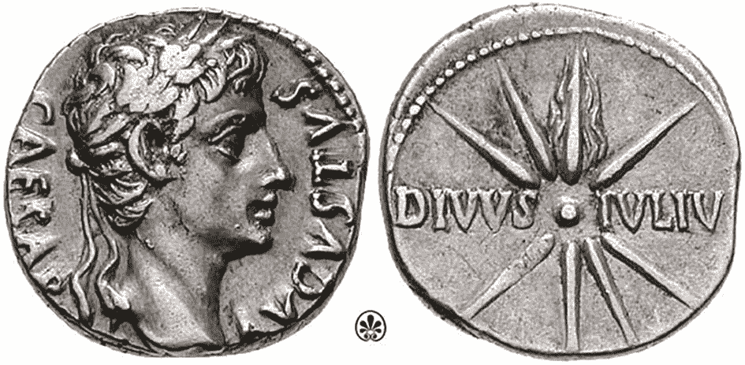
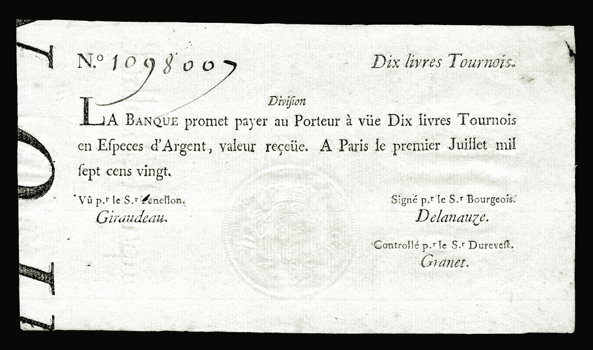
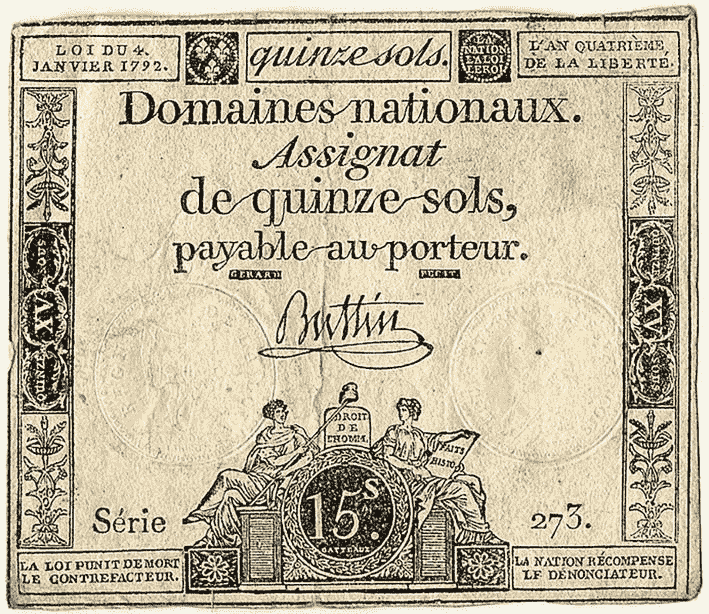
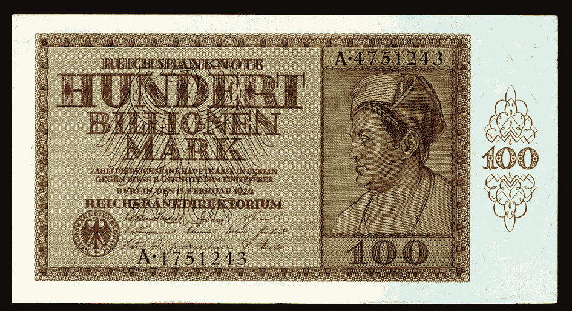
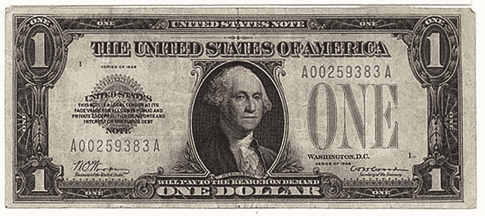
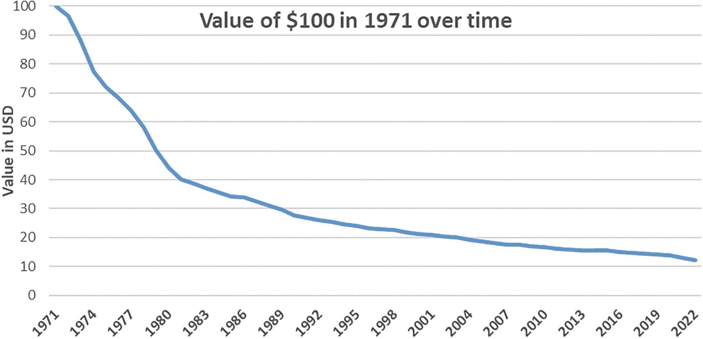
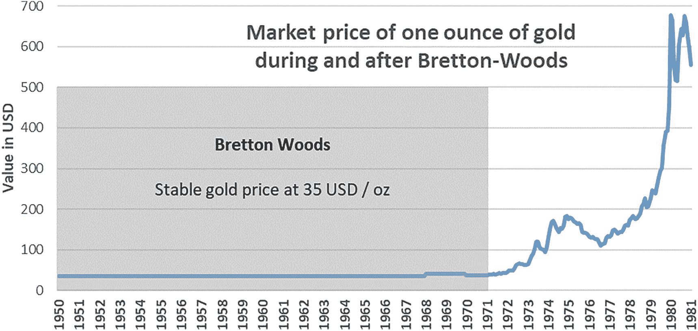
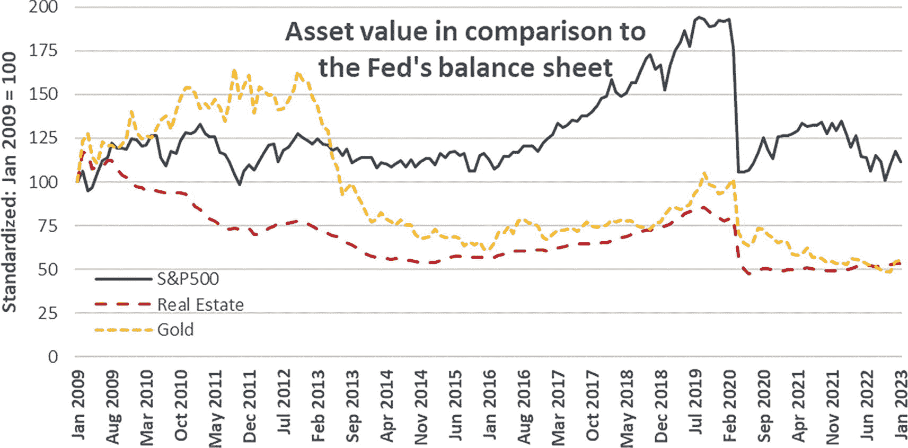

# 第一部分：为何考虑加密货币投资？

## 1. 货币简史

> *中央银行以目前的形式将不复存在；货币也将消亡……比尔·盖茨的继任者可能会让艾伦·格林斯潘的继任者失业。*
>
> ——默文·金，1999 年

加密货币资产的历史，如同本书一样，始于货币。具体而言，始于既定的货币体系。理解货币的本质及其演变过程，对于理解加密货币资产——尤其是比特币——的价值主张至关重要。因此，让我们回到几千年前，从基础知识入手，认清货币的基本要素。你会看到，这些要素自然而然地引出了即将登场的事物。

### 货币的构成要素

几千年前，随着人类社会的出现，交换价值的需求变得至关重要。在以物易物体系中直接交换价值，例如个人用鸡蛋交换水果，存在严重的局限性。以物易物仅在一个人想购买另一个人想出售的东西，同时卖家也想拥有买家所能提供的东西时才能运作。此外，交易的商品必须具有相似的价值。例如，卖家不会愿意用一栋花费数月建成的房屋去交换几个鸡蛋。而且，即使能收集到足够多的鸡蛋，这种交易也毫无吸引力，因为鸡蛋容易腐烂，不适合进行大额交易。因此，一种交换媒介，一种货币形式，必须出现以促进贸易和经济活动。

在所有社会中，交换媒介都会自然涌现。然而，它们并非都同样合适。一种交换媒介需要具备若干特征才能成为最优的货币形式。没有什么规定强制某物应该或不应该成为货币，但某些特征确实能造就更好的货币形式。例如，健全的货币需要在尽可能多的潜在交易参与者眼中具有价值，以扩大其可用性。其次，它应该能随时间保持其价值。例如，它不应像前文例子中的鸡蛋那样容易腐烂。最理想的是，它还应可计数，并能分割成更小的单位以方便小额交易，且便于携带，使用户能随身携带财富。最后，一种最优的货币形式应具有所有单位价值相同且彼此无法区分的特性，即 *同质性*。

公元前 4 世纪，亚里士多德确立了以下关键特性作为健全货币的基础 [4]。具体而言，货币应具备：

1.  交换媒介
2.  记账单位
3.  价值储藏
4.  耐久性
5.  便携性
6.  可分割性
7.  同质性

历史上，各个社会使用的货币形式——从海贝到珠子、牲畜、谷物、盐、烟草、兽皮、白银甚至黄金——仅部分满足了这些特性。

奥地利经济学派创始人¹卡尔·门格尔挑战了普遍认为交换媒介通过权威（例如国家法律）成为货币的观点 [5]。相反，他认为货币是其他资产（商品）中具有极高“可销售性”（*Absatzfähigkeit*）的一种特殊情况。一种可销售的商品能在任何方便的时间容易地出售，而不会导致售价大幅下降。换句话说，它代表了卖方能够以公平的经济价格处置该资产的程度。门格尔指出了影响资产可销售性的以下六项标准²：

1.  潜在感兴趣的买方数量
2.  他们的购买力
3.  商品可用数量与市场需求而未满足的总量之比
4.  资产的可分割性
5.  市场发展和投机水平
6.  对该资产交易施加的法律和监管限制

亚里士多德和门格尔各自总结的标准，对于理解一种资产为何能成为良好的货币形式至关重要。推而广之，它们对于评估这种货币变得有价值的潜力也至关重要。这些列表还有助于评估任一标准的改变如何影响资产的估值。例如，改善市场发展或减少对交易的监管限制，将提高资产的可销售性和价值。

面对几种潜在交换媒介的理性个体，自然会倾向于“更好”的货币形式，即可销售性更高的那些。即使某人不需要该资产，仅仅知道他人可能需要它，就足以激励其获取该资产。确实，持有更好交换媒介的人能最大化其未来购买商品的能力。携带可销售性较低的资产（例如，稀有的古代手稿）进入市场的人，会发现与携带可销售性较高的资产（例如，金币）的人相比处于劣势。可销售性较低的资产必须先兑换成可销售性较高的资产，其所有者才能进行任何进一步的交易。

在每个社会中，随之而来的结果是，更好的货币形式（即可销售性更高的）往往会被囤积。与此同时，相对劣质的货币形式则失去了吸引力。人们倾向于用可销售性较低的资产交换可销售性较高的资产，因为这符合自身的最佳利益。因此，是上述标准，而非中央权威的压力，使得自由经济中的特定货币形式成为最合适的交换媒介。这些标准使得某一种特定资产能够在所有潜在候选者中脱颖而出，成为最佳的货币形式。

### 贵金属作为货币

在早期社会，贵金属因其实用性和美观而备受青睐。例如，黄金和白银，作为装饰品从远东闪耀到西方世界。它们不易腐蚀（与铁或铜相反），因此可以流传数代人。换句话说，它们具有很高的耐久性。同时，由于它们以相对较小的重量承载了巨大的价值，使得个人财富便于携带。与此同时，它们的相对稀缺性，使得市场所需但未供应的数量比例上大于可用数量。这些特性使它们很好地定位为具有高可销售性的资产。

在白银或黄金等金属成为官方支持的交换媒介之前，个人已将其用作交换媒介。许多人购买它们是因为其固有的耐久性、便携性、可分割性，尤其是价值储藏特性。这使得他们能够在空间和时间上转移价值。这种兴趣反过来又提高了它们的可销售性。贵金属成为货币，是因为追求自身利益的交易者有效地使用了它们，而非因为某个权威强制它们成为通货。随着冶金技术的进步，这些金属的可锻性以及随后在形状、纯度和重量上的标准化，进一步增强了它们作为健全货币的属性（即同质性和可分割性），使其可销售性更高。它们成为了文明世界中大部分地区事实上的货币。然而，理解货币是一种社会结构而非监管结构至关重要。法规和国家的支持只是随后出现并强化了这一预先存在的社会结构。

### 价值存储

门格尔提出的“可销售性”概念与价值存储密切相关。要理解什么才是真正的价值存储载体，尤其需要深入研究他提出的第一和第三项标准^(³)。

用通俗的话来说，门格尔的第一条标准是：商品必须存在需求。如果某种商品完全没有需求，无论其供给特性如何，都毫无价值。例如，即使一位平庸的画家一生只创作了五幅画，这并不会自动让这些画作变得珍贵。只有当存在感兴趣的买家时，这些画作才有价值。换言之，良好的价值存储载体必须具有高需求。在早期社会，随着人口增长和社会日益繁荣，人们对闪亮金属的需求不断增加，尤其是黄金和白银。

门格尔关于资产可销售性的第三项标准涉及相对稀缺性，衡量标准是**存量-流量比**^(⁴)。资产的*存量*是指该资产现存的可使用总量。例如，虽然难以到达的地区仍存在未开采的黄金，但其*存量*是指人们可使用的现有黄金数量。另一方面，资产的*流量*是指单位时间内可添加到其存量中的数量——例如，一年内开采的黄金吨数。

相对于存量而言具有高流量的资产，其存量价值极低，因为存量会随时间大幅增加。例如，假设年初经济体中铜的存量为 100，年流量为 50，则在无损耗、损毁或腐蚀的情况下，年末存量将增至 150。铜持有者不能指望该资产保持稀缺，因为与现有数量相比，相当大的比例会迅速增加存量。相对于存量具有高流量的资产会迅速丧失其可能拥有的任何稀缺性。推而言之，只有相对于存量具有较小流量（即高存量-流量比）的资产才可能成为价值存储载体，因为只有这类资产才能保持稀缺。

就存量-流量比而言，资产并非生而平等。实际上，差距悬殊。首先，任何易腐烂产品（如苹果、鸡蛋、坚果）、易腐蚀资产（如铁、铜）或其他消耗性商品（如锌、镍）的存量-流量比都很低，因为无法长期积累存量。同时，其流量占资产存量的很大比例。只有耐用（不易腐烂）的资产才可能成为价值存储载体。例如，黄金作为耐用资产表现优异，因其化学稳定性使其几乎坚不可摧。

其次，真正的价值存储载体必须是一种流量不受存量市场价格大幅波动的资产。经济学家将这一特性称为供给的价格弹性。例如，如果铜的市场价值突然暴涨，许多人就会成为铜生产商以抓住这个机会。结果，铜的产量会相应增加。换言之，流量会增加，直至该资产不再稀缺，其价格回落到长期经济水平。因此，铜的生产（即其流量）严重依赖其市场价格。在经济学术语中，铜是一种供给价格弹性高的资产。然而，这种价格-供给关系对黄金而言几乎不存在。历史表明，即使黄金价格大幅上涨，其产量也几乎保持不变。特别是自二战以来，全球黄金储备在任何一年中的增幅都未超过 2%。2006 年，尽管黄金市场价格上涨了 36%，但 2006 年和 2007 年的年产量却均有所下降。^(⁵) 换言之，黄金的供给受其市场价格变化的影响很小。黄金具有较低的供给价格弹性。

不断增长的需求和微幅增长的供给，使黄金在过去几千年中成为最优的价值存储载体。虽然白银在这些特性上优于其他商品，但仍然次于黄金。正因如此，人们通常仅将白银用作小额交易的交换媒介。

### 从货币到法定通货

货币与法定通货并非同一概念。货币是个人在交易中自发选择的自然媒介，而法定通货则是政府强制要求公民在交易中使用的支付工具。两者起初可能等同，且通常以相同形态起步。然而历史上多次出现政府让法定通货逐渐背离货币属性的案例，这些尝试最终都以惨淡收场，往往酿成史诗级灾难。以下略举几例。

在过去五千年的大部分时间里，黄金和白银确立了其货币地位。稳健的货币使文明得以繁荣，不断拓展人类发展的边界。得益于此，公元前五世纪的伟大希腊文明凭借金属铸币成为当时全球最繁荣且持续扩张的社会。它建立了具备高效税收体系的自由市场经济，成为世界上首个民主政体。然而公元前 431 年，雅典与斯巴达爆发伯罗奔尼撒战争，这场持续近二十年的冲突远超预期。随着战事拖延，军费筹措日益困难，最终陷入绝境。为缓解困局，雅典当局"创造性"地将从税收中收取的金银与铜混合熔铸新币，使手头铸币数量激增，得以突破税收限制大肆挥霍。这项"创举"开启了历史上首次货币贬值。此后金银不再依据重量交易，而是按硬币的历史面值流通——雅典就此创造了首个政府法定通货。随后的几年里，民众逐渐识破伎俩，拒绝接受这些"金币"或"银币"。新币迅速沦为废纸，雅典输掉战争，繁华落幕，残存领土被下一个伟大文明——罗马所征服。

罗马帝国随后崛起为世界主宰文明。但数百年繁荣之后，皇帝们的贪婪将帝国拖入无力承担的战争泥潭。与希腊如出一辙，罗马人通过货币贬值筹措军费：缩小硬币尺寸、掺入廉价金属铸造新币。起初贬值进程缓慢且有限——奥古斯都时期的原始`第纳尔`含银量达 95%，两个世纪后卡拉卡拉在位时已降至 50%。然而一旦开启贬值进程，皇帝们便以递增速度疯狂铸币，试图逃避物价上涨。公元三世纪中叶，`第纳尔`的含银量在短短数十年间暴跌至 0.5%。不可避免的恶果显现：罗马帝国陷入恶性通胀。在这被称为"三世纪危机"的二十年里，物价飙升近 1000%（即上涨十倍）。皇帝雇佣的军队只接受金币支付军饷，公然否定官方通货价值。本世纪末，在数十位短期皇帝遭刺杀后局势暂时稳定，但贬值进程迅速重启。公元 301 年戴克里先时期，一磅黄金可兑换 5 万`第纳尔`。到 337 年其去世时，兑换比例升至 2000 万`第纳尔`，通胀率高达 40000%。^(⁶)

一枚圆形第纳尔硬币的正反面特写照片。正面为侧面男子头像，背面上下区域各有四条放射线，两侧刻有字母"D I V V S"和"I V L I V"。

**图 1-1** 奥古斯都时期的第纳尔（来源：古典钱币集团，[`http://www.cngcoins.com`](http://www.cngcoins.com)；维基共享资源，公共领域）

恶性通胀并非古代史独有。例如 16 世纪英格兰亨利八世时期的"大贬值"与前述希腊罗马故事如出一辙。为筹措对法战争军费，英王下令将硬币中的贵金属替换为廉价金属。曾经尊贵的英格兰通货迅速崩溃，退出流通领域。所有案例都遵循同一模式：无力承担的战争迫使增发货币，导致物价飞涨，国家经济崩溃，最终货币全面崩盘。

下个世纪，欧洲大陆的小德意志邦国在三十年战争中重蹈覆辙。神圣罗马帝国内部仅有少数诸侯享有铸币权。帝国理论上实行双金属本位制：高价值大型金币与小额银币并行流通。虽然篡改硬币可判死罪，但刑罚执行极为困难。这一时期因此得名"剪币淘币时代"（*Kipper- und Wipperzeit*），源于反复剪削硬币边缘并精挑细选优质钱币的行为。原始贵金属硬币在持续贬值后所剩无几——硬币逐渐丧失价值含量，最终沦为纯铜制品。与前例相同，恶性通胀随之而来，经济危机接踵而至。民众拒绝接受硬币支付，通货沦为废纸。^(⁷)

### 纸币的崛起

在 18 世纪的法国，这一模式再次显现，但增加了新的元素：中央银行和纸币。法国国王路易十四去世后，奥尔良公爵菲利普二世接任摄政王，直到年仅十一岁的继位者路易十五成年。公爵发现，这个国家被前任君主积累的、超乎想象的战争债务压得喘不过气来。法国的税收收入甚至无法覆盖这些债务的利息。

“补救措施”于 1716 年 5 月出台，法国政府成立了一家有权印刷纸币的中央银行。在短短几个月的货币印刷之后，法国不仅能够支付债务利息，还能彻底偿清全部债务。然而，与之前的案例一样，货币供应量的膨胀不可避免地导致了物价飞涨。到 1720 年 1 月，物价以每月 23%的速度上涨。例如，自这场货币印刷狂潮开始以来，租金和房地产价格已上涨了 20 倍。1720 年 2 月，银行停止用黄金或白银兑换纸币。使用贵金属进行交易变成非法行为，任何被发现持有贵金属的人都会被没收。当银行于同年 5 月重新开业时，黄金、白银和铜被一抢而空，因为人们不顾一切地想用一文不值的纸币兑换真金白银。最终，这持续四年的疯狂印钞行动使该国以及欧洲大部分地区陷入了持续数十年的经济萧条。

一张法国纸币的特写照片。上面有外语文字。顶部的数字显示：1098007。

**图 1-2** 1720 年由法国皇家银行发行的纸币（来源：史密森尼学会国家钱币收藏；维基共享资源，公有领域）

直到本世纪末法国大革命战争期间，纸币的使用才在该国重新恢复。与其前身类似，新的法国纸币（指券）成为了法定货币。同样与其前身类似，货币供应方（国民议会）印刷了越来越多的新货币。尽管批评者指出，这种做法有可能重蹈本世纪初货币印刷的覆辙，但指券的供应量在短短几年内就从数百万增长到了数十亿。不出所料，这种新货币在诞生后不到十年就变得一文不值。

一张法国法定货币的特写照片。它呈方形，上面有外语文字。底部有一幅插图。

**图 1-3** 1792 年的指券，一种短命的法国法定纸币（来源：设计：尼古拉-玛丽·加托 - 字体：让-巴蒂斯特·热拉尔；维基共享资源，公有领域）

另一个值得注意的印刷狂潮发生在 20 世纪初德国魏玛共和国时期。与所有之前的例子一样，它始于一场战争。第一次世界大战爆发时，德国放弃了与黄金挂钩的货币——金马克，转而使用纸马克。共和国开始使用铁、锌和铝等廉价金属铸造新硬币，并在战争期间将纸马克的发行量增加了四倍。

过度货币供应的毁灭性影响直到战后才显现出来，因为人们在战争期间持有储蓄，避免不必要的支出。一战结束后的几年内，物价上涨了十多倍，抹去了人们 90%以上的储蓄价值。

当向法国支付战争赔款到期时，印刷机加速了其疯狂运转。一金马克的价格从 1920 年的 15 马克上涨到 1923 年 7 月的 10 万马克，9 月达到 1300 万马克，同年 11 月达到 1 万亿马克。流通中的典型纸币面额从 1920 年的 10 马克增长到 1924 年的 100 万亿马克。仅 1923 年 10 月，物价就上涨了 29,500%，而印刷机每天还要额外印出 500 千万亿新纸马克。^(⁸) 与之前的例子一样，纸币变得一文不值，国家崩溃，最终又回归到以黄金为支撑的货币体系。

一张德国纸币的照片，上面有数字 100 和外语文字。右侧是一个人的侧面肖像。

**图 1-4** 魏玛共和国 1924 年发行的 100 万亿马克纸币^(⁹)（来源：美国国家历史博物馆国家钱币收藏；维基共享资源，公有领域）

## 中央银行与部分准备金银行制度

与此同时，在大西洋的另一边，发生了一项重大的金融发展。直到第一次世界大战爆发前，美国以及大多数发达国家都以黄金作为其货币的后盾。由于黄金的新供应量（流量）与其存量相比微乎其微，因此没有通货膨胀。随着商品相对价格的调整，财富在各国的流转时有发生，但总和为零。通货膨胀几乎不存在，这使人们能够储存财富。这种情况在 1914 年发生了改变，当时美国成立了一家私有银行——美联储，并被授权印刷美元。美联储独立于美国政府，没有预算，不接受审计，没有监管者，也不对任何人负责。^(¹⁰) 正如美联储自己所描述的，它通过创造新货币来向美国政府放贷。^(¹¹) 这些“借贷”的货币是凭空创造出来的新货币。到现在应该很清楚，这并没有产生新的价值；印刷只是稀释了所有现有美元的价值。而且，美联储并不用黄金等实物价值来支持任何新发行的美元。

当考虑到与之配套的部分准备金银行体系时，这一可疑的安排变得更具争议性。当一家商业银行持有公众存款时，只有一小部分金额必须存放在金库中。银行并不会持有这些存款，而是将其中大部分贷放出去。在美国，美联储设定了准备金要求。通过这种方式，它控制着有多少货币流入经济。假设准备金要求是 10%。当爱丽丝将 100 美元存入她的商业银行（比如 ING）时，该银行可以向鲍勃贷出 90 美元，同时将 10 美元保留在金库中。^(¹²) 鲍勃用这笔钱从查理那里买东西，查理将他刚赚到的 90 美元存入他在另一家商业银行（比如富国银行）的账户中。这家银行则将 9 美元（10%）留作备用，并将剩余的 81 美元贷给丹。丹从艾琳那里买东西，艾琳则将钱存入她的商业银行。此时，爱丽丝的银行账户里有 100 美元，查理有 90 美元，艾琳有 81 美元。这一切都源于爱丽丝最初的 100 美元。这个过程并未止步，而是会继续进行下去。10%的部分准备金比率使得商业银行能够“创造”出多达原始存款九倍的资金：最初的 100 美元最终可能变成 1000 美元在流通中。

这就是银行创造货币的方式——当有人获得贷款时，只需在账本上记上一笔。此外，还需要为商业银行贷出的总金额支付利息。如果贷款利率是 5%，那么除了借出的 900 美元本金外，每年还需偿还 45 美元的利息。而所有这一切都源于爱丽丝最初存入的 100 美元。偿还利息的唯一途径是从国外获取，或者借入更多的债务。从整个经济的规模来看，要同时偿还债务本金及其利息在数学上是不可能的，因为货币必须有来源。因此，当前依赖部分准备金银行制度的货币体系，是一种合法化的金字塔骗局。

### 大萧条

20 世纪 20 年代代表着金融文化从战前时代的转变。公民不再储蓄，而是投资，低利率环境更助长了这一趋势。原先几乎专供企业使用的贷款逐渐扩展到个人。人们借钱买房、买车，甚至买股票。由于资金宽松和贷款驱动的购买力，一切——消费品、房地产、股票市场等等——都变成了泡沫。

上世纪最严重的经济萧条发生在那个十年末。它最终对全球经济和人民的生活造成了毁灭性影响。奥地利经济学派的杰出理论家弗里德里希·冯·哈耶克和穆瑞·罗斯巴德将这场大萧条在很大程度上归因于 20 世纪 20 年代的货币供应扩张，这催生了不可持续的信贷泡沫。^(¹³)

随着泡沫破裂和价格下跌，许多人无法偿还现有贷款，也不再申请新的贷款。结果，正如任何在部分准备金银行制度下的萧条一样，货币供应收缩，导致进一步的价格下跌和工资大幅下降。空前数量的银行倒闭，吞噬了人们毕生的积蓄。1931 年 9 月，英国对其黄金债务违约，这在所有其他国家引发了恐慌。由于担心美国也会发生同样的情况，人们纷纷挤兑黄金，导致美元遭受损失。再一次，由于纸币供应过剩，而稳定的“真正”货币——黄金供应不变，货币在市场上的价值与其面值出现了背离。人们越来越多地将纸币兑换成本该作为其支撑的黄金，直到银行无法再提供黄金。美国政府别无选择，只能切断其货币与黄金的挂钩。

**图 1-5** 金本位时期（1928 年）的一美元纸币。纸币上仍印有“见票即付持票人”字样，该字样在金本位制结束后被移除。（来源：维基共享资源，公共领域）

1933 年，富兰克林·德拉诺·罗斯福领导下的美国政府发布了第 6102 号行政命令。通过这项命令，美国政府实际上没收了美国公民所有的“金币、金条和金券”，并对不服从者处以高额罚款甚至监禁。^(¹⁴) 然而，即便采取了如此极端的措施，仍不足以让政府偿还其债务。几个月后，美国对所有合同中的黄金条款违约。简而言之，政府正式宣布不会偿还其已订立合约的贷款，无论是国内还是国外的贷款。美国用本国纸币偿还贷款，而不是用真正的价值——黄金来偿还。一年后，美国将美元对黄金贬值 59%，从而承认其此前高估了美元。

又过了十年，经历了第二次世界大战，世界各国才重新恢复了金本位制。世界货币史上的这一重大决定发生在新罕布什尔州一个名为布雷顿森林的小地方。

### 布雷顿森林时代

在战后时代之初，即 1944 年，世界主要大国建立了一套关于货币、金融和商业关系的规则体系，称为布雷顿森林体系。美国、加拿大、西欧国家、澳大利亚和日本同意制定一项货币政策，通过将各自货币与黄金挂钩来确保稳定的汇率。

除了这套规则，他们还建立了国际机构来监管国际货币体系。这些机构包括国际货币基金组织（IMF）以及现在被称为世界银行的组织。其目标是加强国家间的合作，并防止货币贬值——这种贬值行为会使实施国获得优于其他国家的贸易竞争优势。^(¹⁵)

随后，回归金本位制带来的国际经济成功是惊人的。接下来的三十年被称为*辉煌三十年*^(¹⁶)，也叫做*资本主义的黄金时代*，其特点是工业国家持续保持高水平的经济增长。虽然战后重建的需求促进了经济复苏，但金本位制也是一个关键的增长驱动因素，因为它对政府施加了纪律约束。如果政府想花钱，它首先得有黄金，所以它必须先拥有或收集真正的价值。

## 回归法定货币

然而，美国试图通过印刷超过其黄金储备量的美元来逃避这一义务。随着外国政府察觉到这一伎俩，它们纷纷将手中的美元兑换成黄金。20 世纪 70 年代初，美国不得不采取行动，阻止真实价值流失到国外。

1971 年夏天，美国总统尼克松终止了美元与黄金的直接兑换。这一决定实际上标志着布雷顿森林体系的终结。由于其他主要大国主要持有美元作为央行储备，它们也纷纷效仿，放弃了与黄金的固定汇率。其结果是，货币变成了法定货币^(¹⁷)，其价值仅靠对政府信用的信任来支撑。

然而，取消金本位制，同时也取消了施加在政府身上的约束。随着这一转变到法定货币体系，政府可以通过印刷更多本国货币来随心所欲地支出。它们可以多年运行不受控制的赤字，而无需平衡预算。正如本章中的历史例子所示，人们无法通过印刷更多货币来创造新的价值。新印刷货币的价值来自于流通中的现有货币。每一张新美元都会稀释所有现有美元的价值。印刷新美元钞票实际上是将购买力从拥有储蓄的个人和公司转移到印钞实体手中。这是一种以储蓄价值不断下降为形式的储蓄税。正如诺贝尔奖得主米尔顿·弗里德曼所言："通货膨胀是一种无需立法的税收。"

正如经济理论所预测的那样，当政府印刷这些货币时，其购买力下降，随之而来的是物价上涨。如图 1-6 所示，在布雷顿森林体系之后，公民以现金形式持有的毕生积蓄在短短几年内就损失了一半的价值：以美元为例，不到十年。这种价值侵蚀在整个世纪及以后的时间里持续进行。特别是，1971 年留出的`$100`在一代人之后的 2001 年仅值约`$20`。尽管政治相对稳定，但事实证明，没有黄金支持的现金再次成为一种低效的价值储存手段。

一张从 1971 年到 2022 年，1971 年 100 美元价值随时间变化的折线图。它描绘了一条急剧下降至 1980 年，然后逐渐下降的曲线。

图 1-6 1971 年`$100`价值直至 2022 年的变化，反映了布雷顿森林体系后时期以消费者价格指数衡量的美国通胀（来源：Macrotrends ([`www.macrotrends.net`](http://www.macrotrends.net)) 及自行计算）

这种货币价值的侵蚀并非美元独有；日元、瑞士法郎和英镑也呈现出类似的趋势，因为其相应的央行持续印刷更多货币。

虽然上述数字对于储户来说已经很不幸——他们的储蓄价值像阳光下的冰淇淋一样随时间融化——但现实甚至更为严峻。这是因为这些数字使用的是消费者价格指数（CPI）来衡量通胀。由于 CPI 在其计算中使用了"恒定满意度水平"的概念，它低估了通胀。具体而言，CPI 衡量的是由消费者支出习惯定义的一篮子商品的价格。然而，它并未考虑作为对通胀反应的支出习惯的变化。

为了说明这一点，假设消费者通常每周吃一次沙朗牛排，然后发生了所有价格翻倍的通货膨胀事件。工资不变的消费者必须改变他们的消费习惯。他们将每周的沙朗牛排替换为鸡胸肉。通胀事件后的鸡胸肉价格可能与通胀事件前的沙朗牛排相同。虽然实际通胀会显示 100% 的增长（价格翻倍），但 CPI 却显示 0% 的通胀：一篮子商品发生了变化，使得通胀事件前后的成本相同。确实，消费者前后花费的金额相同，但基础商品的质量下降了。换句话说，计算 CPI 的指标直接受到其所衡量对象的影响。因此，实际通胀远高于 CPI 所暗示的水平。^(¹⁸) 这意味着购买力的下降速度甚至比上图所示的还要快。

尽管如此，法定货币购买力的下降为黄金持有者带来了机会。特别是在布雷顿森林体系后的头十年里，一盎司黄金的市场价格翻了 16 倍。它从 1971 年夏天的`$40`增长到 70 年代末的`$600`以上。换句话说，真实价值并没有消失；相反，它只是从法定货币持有者转移到了"真实"货币——黄金——的持有者手中。

一张从 1950 年到 1981 年，布雷顿森林体系期间及之后一盎司黄金市场价格的折线图（以美元计）。它描绘了一条呈上升趋势并伴有波动的曲线。1950 年至 1971 年为布雷顿森林体系的阴影区域，黄金价格稳定在每盎司 35 美元。

图 1-7 布雷顿森林体系期间及之后一盎司黄金的市场价格（以美元计）（来源：Macrotrends ([`www.macrotrends.net`](http://www.macrotrends.net)) 及自行计算）

## 加快印钞速度

20 世纪的最后 15 年以持续的宏观经济稳定为标志，因为货币政策侧重于遏制通胀，而非增加产出和限制失业。然而，新千年伊始，随着互联网泡沫破裂，美国和发达国家陷入了另一场衰退。

为了应对这场衰退，央行降低了利率。^(¹⁹) 然而，人为降低利率会激励商业银行向企业和个人发放更多贷款。私人信贷的增长成为现实，尤其是在房地产领域。以历史低利率对现有抵押贷款进行再融资的活动激增，次级贷款市场的融资也蓬勃发展。廉价的信贷将房地产价格推至新高，远高于其经济价值。这个泡沫膨胀了几年，然后在 2007 年破裂，从而引发了另一场危机：大衰退。多种因素加剧了这场危机，但这超出了本书的讨论范围。然而，值得注意的是，央行在其利率已处于历史低位时如何应对另一场危机。在将利率进一步下调（降至负值区间，这在以前的金融教科书里被认为是不可能的）之后，接下来的货币政策工具向系统注入了更多的流动性。技术上，央行称之为量化宽松，但根本上，这仅仅意味着更多地印刷货币。^(²⁰)

由于这种廉价的融资，大多数政府达到了创纪录的债务水平。例如，美国的债务与 GDP 之比从 2007 年的 62% 飙升至 2010 年的 90%。在同一三年期间，欧盟的这一比率从 62% 增加到 80%。在私人市场上，这种不可持续的赤字状况通常以破产告终。然而，对于现代政府而言，央行可以实现更多地印钞以使债务贬值，从而暂时避免违约。

在接下来的十年里，前所未有的监管浪潮席卷了金融体系。金融和监管当局试图升级一个有缺陷的系统，而不是从根本上重新思考它。当它们努力改进旧系统时，一个全新的系统出现了。这个新系统并非旨在增加对基于法定货币的金融体系的信任，而是要使信任不再必要。就在这时，比特币腾飞了。

### 新冠疫情

2010 年代末，世界各国政府迫切希望回归更可持续的财政状况。各国央行对近期一系列危机的反应，已向金融体系注入了异常庞大的新流动性。然而，一场疫情不幸爆发。与以往危机一样，印钞机被用作应对危机的经济武器。

衡量货币供应量最纯粹的标准是央行的资产负债表规模。事实上，当央行印刷货币时，其资产负债表就会扩张。^(²¹) 2019 年底，全球四大央行（美联储、欧洲央行、英格兰银行和日本银行）的资产负债表规模合计略低于 16 万亿美元。不到两年后，这一数字增至超过 26 万亿美元。^(²²) 换言之，有史以来创造的美元、欧元、英镑和日元中，有 38%是在 2020 年至 2021 年间印刷的。仅就美元而言，这一比例超过 52%。^(²³) 正如本章所述，历史表明，这种印钞狂潮对货币持有者来说并非好事。

资产的价格通常以法定货币表示。另一种方法是以“央行资产负债表规模”来表示。从根本上说，是用央行的资产负债表规模替换分母（例如美元）来得到比率。例如，用美国股市价值除以美联储资产负债表规模，而不是传统上用美元表示美国股市价值。这个新比率表示相对于特定流通货币数量的资产价值。这种方法揭示了资产的实际价值增长并不像通常呈现的那么快。相反，它们随着时间的推移保持了相对价值，如图 1-8 所示。^(²⁴)

一张从 2009 年 1 月到 2023 年 1 月的标准化资产价值与美联储资产负债表对比的折线图。所有线条均以 2009 年的 100 为起点。房地产和黄金在 2023 年降至 50，伴有轻微波动。标普 500 指数波动上升，在 2019 年达到 185，2020 年降至 105，随后上升。

图 1-8

2009 年 1 月至 2023 年 1 月，以美联储资产负债表为基准衡量的美国股市（标普 500 指数）、房地产（美国房价中位数）和黄金比例。标准化：2009 年 1 月 1 日的价值=100（来源：美联储 (`federalreserve.gov/monetarypolicy`)、Macrotrends (`www.macrotrends.net`) 及自行计算）

图 1-8 显示，股票、房地产和黄金并未与其起点相差太远。特别是，它们都基本保持在起点值的 50%（一半）到 200%（两倍）之间。而且，它们倾向于回归均值。换言之，资产实际价值随时间的变化并不剧烈。并非股票、房地产或黄金处于泡沫之中；泡沫在于央行的资产负债表。

## 接下来往哪走？

最后几节涵盖了货币史上的里程碑，其中文明在金本位制下繁荣，并在脱离金本位制时崩溃。每一次试图将货币与金钱分离的尝试，无论是通过减少硬币中贵金属的含量，还是转向法定货币标准，都以灾难性的后果告终。^(²⁵)

认识到这一现实，近代历史上的当局多次诉诸没收黄金来补充其实际价值储备。^(²⁶) 公民们眼睁睁看着自己毕生的积蓄化为乌有，除了接受新现实之外别无他法。过去几十年，全球经济经历了货币供应的巨大洪流。流通中的货币数量是十年前的好几倍。不幸的是，历史表明这种情况的结局并不乐观。

正如传统宏观经济学的结论，一个国家增加货币供应量会导致其物价水平成比例上涨。^(²⁷) 或者，正如前美联储主席（1987-2006 年）艾伦·格林斯潘所言：“在没有金本位制的情况下，无法保护储蓄免遭通货膨胀的侵蚀。”

本章所述的观点并非针对任何特定实体。任何拥有印钞权力的中央当局都倾向于印刷过量的货币，因为不这样做就会让另一个当局上台。特别是，胜出的实体通常会向选民承诺更多的“免费”东西，无论选民是普通大众还是私人委员会。当然，“免费”的东西并非真正免费，而是通过使现有货币单位贬值来买单的。印钞就是将价值从人们的储蓄转移到新印刷的钞票上。这种达尔文主义的论点表明，问题不在于任何特定的政府，而在于激励机制错误的体制性问题。事实上，对于任何拥有此权力的中央当局来说，印刷货币的动机都强大到难以抗拒，无论是为了提供更多福利还是更多战争。一个拥有印钞权力的当局自然会印刷出经济上过量的货币。这个过程会持续下去，直到经济失衡导致货币崩溃和完全的货币熔化。只有当它回归到“不可印刷”的货币标准（如黄金）时，经济才能在一个健全的货币基础上复苏并恢复平衡。

纵观历史，货币危机的希望之光实际上是金光。黄金投资不仅能在时间推移中保值，甚至在危机期间价值飙升。黄金仍然是长期投资者的终极价值储存手段，因为它是一种高存量-流量比的资产。在这方面，没有任何资产能企及黄金——直到最近。

### 史上最高存量-流量比的资产

正如本书后续章节将详细阐述的那样，比特币的硬编码特性将其终极数量限制在 2100 万个。此外，新比特币的产出每四年减半，这使得比特币成为一种存量-流量比持续增长的资产。没有任何权威机构能够增发比特币，即便其存亡系于此。无论是政府、央行、公司、矿工、伪造者还是其他任何人，都不能以超过比特币供应计划所规定的速度进行挖矿。这是供应量限制的终极保障。作为高存量-流量比资产，比特币优于黄金，因为其存量-流量比不断提高，且其新增供应完全独立于市场价格（即，其供应价格弹性为零；供应量对价格完全无弹性）。

在本章开头所阐述的货币核心特征方面，比特币的得分也高于黄金。比特币既不易腐烂也不易腐蚀，其耐久性无限。它在便携性上也超越了黄金，因为可以通过智能手机方便地进行交易。其可分割性也远胜一筹，可以瞬间且零成本地将一个比特币分割成一亿个子单位。它也比黄金更具可互换性，因为你无需怀疑硬币或金条的质量。比特币作为记账单位的接受度也在不断提高（例如，许多交易所将其他加密资产表示为比特币的分数），并且在这方面已经比黄金更为成熟。最后，它作为交易媒介的用途正在全球范围内以惊人的速度增长。特别是在几乎所有国家，无论是线上还是实体商业，接受比特币支付的商户越来越多。此外，它已成为萨尔瓦多的法定货币，其他国家也正在效仿。

在资产的可销售性方面，比特币在几乎所有标准上都同样得分极高，只有两项仍在发展中：(1) 市场发展水平和投机程度，以及 (2) 对该资产交易施加的法律和监管限制。由于比特币仍然是一种相对较新的资产，它在这些层面尚未达到成熟状态，但正在迅速改善。特别是，第 10 章展示了多项证明这一成熟度增长的指标。这些发展表明，比特币可能很快成为人类已知的最纯粹的货币形式，从黄金手中接过这一桂冠。

作为其价值主张的一部分，比特币将实现货币与国家的分离。事实上，作为一种货币形式，比特币独立于国家的利益。没有任何国家可以为了自身目标而生产比特币，从而损害该货币形式持有者的利益。采用比特币将重新建立金本位曾经施加给政府的纪律，从而使人们能够将其劳动价值保存在不可稀释的货币中。

#### 关键概念

货币是个人选择的用于交易的中介。更好的交易媒介具备关键特征，其中就包括跨时间储存价值的能力。在过去五千年的大部分时间里，黄金最能发挥这一功能，因为即便其价格飙升，其流量（可用的新资产量）相对于其存量（现有可用资产量）仍然很小。有限的供应加上对黄金不断增长的需求，使其作为价值储存手段凌驾于任何其他资产之上。比特币是黄金的一种新替代品，它汇集了使黄金成功的核心特征，并改进了便携性、可分割性、耐久性和可互换性等特性。

历史上充满了政府放弃金本位货币，然后疯狂印刷新政府货币（通常是为了资助战争或偿还因战争而引发的债务）的事件。然而，这些事件中的每一个都以惨烈告终，往往带来毁灭国家的后果。回归金本位一直是恢复稳定和重振繁荣的唯一可行途径。过去二十年里的货币印刷量已增长到远超以往危机的水平，尤其是自 COVID-19 疫情爆发以来。不幸的是，历史表明这种情况的结局将是黯淡的。更纯粹的货币形式，如黄金或现在的比特币，提供了千载难逢的机会，让您可以从不可避免的即将到来的货币危机所产生的财富转移中获益。

#### 拓展问题

政府在选择金本位制与法币本位制时，各自的动机是什么？

是否有可能存在一种双重本位制，即联邦储备部分以黄金、部分以比特币持有？

1971 年，当货币与黄金的挂钩被切断时，公民为何继续使用法币？

脚注 1 2 3 4 5 6 7 8 9 10 11 12 13 14 15 16 17 18 19 20 21 22 23 24 25 26 27

