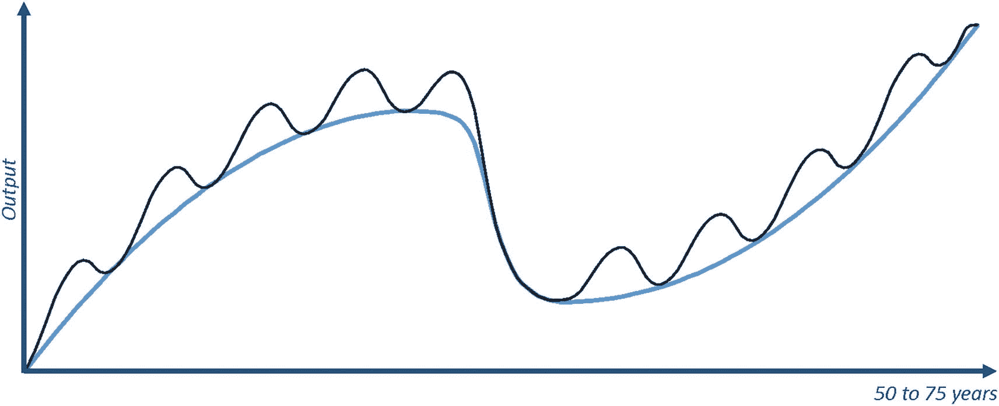
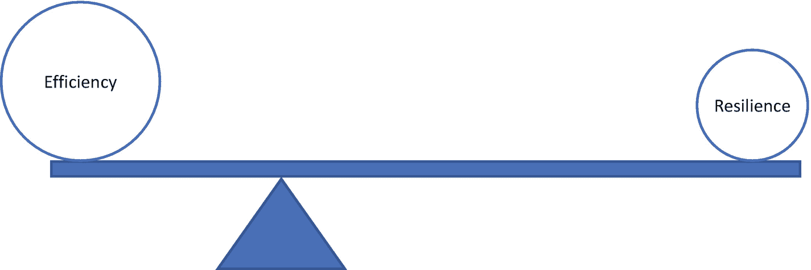

# 2. 互补货币

> *一切货币皆源于信念。*
> 
> ——亚当·斯密

尽管比特币在与黄金争夺纯粹货币头衔时提出了强有力的论据，但由于黄金数千年的文化根基，比特币不太可能完全取代黄金。相反，更可能出现的情况是两者共存，就像电视并未完全取代广播，而只是占据了其一部分市场一样。鉴于最近的发展，它也很可能作为支付媒介与美元、欧元或日元等国家货币共存。事实上，它正在日益如此运作。这样的系统将有效地拥有多种货币（被接受的支付媒介）并行运行。虽然多种货币模式听起来不寻常，但这已经是一个存在的概念，并且几十年来，其众多益处一直受到货币远见者的推崇。^(²⁸) 本章将探讨为何情况如此。

### 结构性失衡

当今的金融与货币体系并不稳定。在过去半个世纪（1970–2017 年）中，国际货币基金组织共识别出“151 次银行业危机、236 次货币危机以及 74 次主权债务危机”[6]。这相当于平均每年发生十次金融灾难，或者说每五到六周就发生一次。

尽管金融监管机构针对该领域的方方面面不断出台越来越多的监管规定，^(²⁹)但体系的稳定性并未因此改善，年复一年仍经历着数量相当的金融灾难。尽管 2008 年大衰退之后出现了前所未有的新监管浪潮，南欧大部分国家的主权债务却变得岌岌可危：因经济危机，94%的委内瑞拉人口生活在贫困之中[7]；阿根廷比索、土耳其里拉和黎巴嫩镑贬值超过 95%；还有更多国家遭受着经济灾难。虽然其中一些问题源于金融与货币体系之外，但面对挑战，这些体系并没能维持经济稳定。即使是在最近的 2023 年 5 月，美国主要银行的倒闭也表明，现有（且庞大的）监管体系并不能有效弥补当前体系的内在缺陷。

接下来的分析表明，我们脆弱体系中的问题之所以持续存在，是因为根本原因在于结构性问题：它植根于我们对待货币的基本方式。有效的解决方案不应只治疗经济危机的症状，而应针对这些灾难的根本原因。结构性问题需要结构性的解决方案。

### 顺周期的货币体系

> *在所有组织银行业务的方式中，我们现在所采用的是最糟糕的一种。[……]我相信，变革是不可避免的*[8]。
> 
> ——默文·金爵士，英格兰银行行长

经济以周期方式运行。当商业繁荣、人们乐观时，经济扩张。然而，当困难出现、对未来信心下降时，经济就会收缩。长周期持续数十年，^(³⁰)而在此期间，较短期的周期也在发生，通常持续几年，一般不到十年。

一张关于产出在 50 至 75 年时间轴上的折线图，显示两个经济周期。长周期在上升趋势曲线中形成波峰和波谷。短周期在其上下波动。

**图 2-1** 经济周期示意图，短周期叠加在长周期之上

部分准备金银行制度的一个关键后果是，银行的行为具有顺周期性。当经济扩张时，银行愿意放贷，人们也愿意借钱创办新企业。正如前一章所述，银行贷款为经济创造了“新”货币，从而支持了经济扩张。然而，当形势恶化时，银行在放贷上会更加谨慎，人们也对借贷信心不足。结果，经济中的货币总量随着借贷减少而下降，从而加剧了经济收缩。

当前货币体系的顺周期性是理解当今经济的关键。这意味着，当经济前景光明时，该体系会鼓励信贷过度膨胀，催生债务泡沫。相反，当金融阴云出现时，信贷可得性降低则会加深经济衰退。

### 货币与金融的可持续性

当前的货币体系是一项已有数百年历史的人为发明。它在中世纪社会中产生，当时并未经过深思熟虑，更谈不上研究如何将其构建为长期稳定的结构。

然而，现代科学为构建一个更好的体系提供了坚实的理论依据。货币领域的远见者们^(³¹)研究了自然生态系统如何运作、繁荣与崩溃。复杂网络具有可预测的结果——从生物系统中的植物到电路中的电子都是如此。特别是，自然生态系统是可持续的；它们已存在数百万年，比人类和我们的货币体系要长久得多。对此类系统的研究揭示了与货币生态系统之间引人注目的相似之处。事实上，经济中的货币类似于人体中的血液、生物体中的能量，甚至社交媒体上的信息。它们是使各自生态系统得以运行的基本流动。在不受干预的情况下，过剩的流向会填补不足，直至系统达到平衡。例如，当电子靠得太近时，它们会相互排斥，从而使它们绕行的能级趋于中性。当生物体过度劳累时，疲劳感会累积并迫使其休息以维持平衡。同样，当某种商品的价格暂时低于其均衡水平时，会有更多人购买；需求的增加会推高价格，直到价格恢复到供需相等的均衡水平。在不受干预的情况下，系统会自行调节以达到平衡。

这些复杂流动网络（货币、血液、能量或信息）在结构上的普遍性，使得驱动其存续的核心特征具有可比性。来自自然生态系统的见解有助于构建一个更具韧性的经济，并避免那些过于频繁且破坏性的金融灾难。可以说，这项研究的主要发现是：当一个生态系统平衡了两种相反的特征——**效率**和**韧性**——时，它就能长期繁荣。

一幅天平示意图，两侧分别为效率和韧性。效率一侧比韧性一侧更高，指针更接近效率。

**图 2-2** 可持续生态系统的关键特征：平衡效率与韧性

**效率**是指系统中单位时间内处理的流量，即系统的吞吐量。这也是传统货币体系唯一优化的特性。使用单一货币是最有效率的体系：不同的参与者拥有共同的交易媒介，他们无需担心货币的相对估值，所有价格都以同一单位计价。这些优势使得单一货币体系的吞吐量极高，让体系变得**高效**。

然而，另一个关键特性——**韧性**——却基本被忽视了。**韧性**是指复杂网络应对变化的能力；即其在变化环境中生存和适应的能力。正如近期金融灾难的频率和影响所表明的，我们的经济体系令人担忧地缺乏韧性。

也许与直觉相反，自然界并不追求效率最优化，而是追求效率与韧性的健康组合。事实上，任何缺乏韧性的自然生态系统都不会存在至今，供我们研究。同样，一个缺乏效率的系统也无法跨越时代生存和繁荣。

对自然生态系统的研究发现，效率和韧性都取决于一个核心特性：**多样性**。^(³²)然而，其影响方向相反：更高的多样性会增加生态系统的韧性，但同时会降低其效率。

就货币体系而言，更高的多样性意味着使用不止一种货币。换句话说，组织和个人可以出于不同目的并行使用不同的货币。例如，他们可以同时使用一种本地货币、一种区域性货币和一种全球性货币。或者，他们会在一个社区使用一种货币，在另一个社区使用另一种货币。这种本地货币和社区货币具有下文各节中将介绍的许多好处。

## 多货币体系

在过去两千年的大部分时间里，多种货币并行流通一直是常态。在这一时期，金币因其广泛接受度成为国际贸易的理想媒介，而当地硬币（通常由价值较低的金属制成）则支撑着本地交易。因此，与本地和远方同行打交道的商人需要频繁地在不同货币之间进行转换。

现代化进程催生了各国货币，它们变得日益独特且越来越*高效*。然而，自亚当·斯密以来的几个世纪里，传统经济学学科几乎从未质疑过“单一货币是货币体系最优运作方式”这一假设。

但即便在今天，我们也在经常使用补充货币（相对于法定货币交易而言，其规模可能很小）。例如，预订航班时，你可以使用航空里程代替法定货币支付；因此，它是一种补充货币形式。当然，其可用性有限：只有少数买家（使用该里程的航空公司），且使用航空里程仅限于购买特定的旅行相关服务。尽管如此，它们的存在本身就证明，即使在今天，人们仍频繁使用补充货币，尽管常常并未意识到。

如今使用的许多补充货币体系已超越了企业忠诚度策略，例如合作货币。这类货币通常具有本地属性，由社区为本地目的而创造。例如，它们可以服务于特定目标，如保护环境、激励本地贸易、赋能社会弱势群体或其他社会目的。

例如，在海地，小农联盟创造了一种“树木货币”。农民通过植树或维护林场获得树木积分。这些积分可兑换商品和服务，例如培训课程和牲畜。在该模式推行的头几年，它帮助种植了 650 万棵树，同时提高了当地居民的收入，有时甚至翻了一番。

时间银行^(³³)是另一种社区货币，它基于“一小时就是一小时”（无论提供何种服务）的原则来交换服务。例如，如果爱丽丝教鲍勃烹饪一小时，她就能从鲍勃那里获得一小时的积分。然后，爱丽丝可以用这笔积分让查理帮她修车，而查理则可以让鲍勃帮他修剪草坪或辅导孩子。整个过程中没有传统货币的交换，只有社区内部的时间积分流转。时间银行的目标之一是通过善意和互惠的行为，在社区内连接人们、建立关系并加强纽带。这种模式遵循公平原则，平等地衡量每个人的时间价值。据估计，全世界有数万人使用时间银行，分布在数百家时间银行中。

本地交易交换系统（LETS）是另一种类似于时间银行的互助信用体系。不过，它不将时间作为信用基础，而是让社区成员自行协商提供服务的费率。例如，你可能会支付 12 个`LETS`来获得一小时的烹饪课，支付 14 个`LETS`来修车，支付 10 个`LETS`来修剪草坪。社区同样会记录每次服务后每位成员的余额增减（借贷记账）。这个系统也使得人们能够运用原本可能闲置的技能，来满足原本可能无法被解决的需求。

此类货币的可能性和结构是无限的。然而，它们通常有一个共同点：利用闲置资源（例如，本可能花在低效任务上的时间）来满足未得到满足的需求（例如，重新造林或辅导功课）。因此，在社会底层人群中，生活在双货币体系社会中的人通常会表现得更好。

与大多数法定货币相反，合作货币通常由社区或非政府组织运作，而非传统银行或政府实体。因此，流通中该货币的数量由社区决定，而非中央权威机构。

总的来说，在第一个比特币出现之前，已经有超过 4000 种此类合作货币发展成熟^(³⁴) [8]。加密货币的到来极大地增加了这个数字，同时也通过数字化提高了获取这些货币的便利性。

## 沃格尔实验

特定的历史实例为补充货币对经济的益处提供了经验证据。1932 年，大萧条的后果正肆虐欧洲，表现为高失业率和低交易水平。在这种严峻形势下，人们囤积货币以应对不确定的未来。在失业率达 35%的奥地利小城沃格尔，市长采取了行动，说服市政厅发行印花代金券。印花代金券是一种信用凭证，在此案例中，它以存入当地银行的 5000 奥地利先令作为担保。从根本上说，它是一种与法定货币并行的交易媒介形式的补充货币。

这项实验的成果远超人们最大胆的期望。在发行后的第一年，当地的印花代金券在人群中流通了 463 次，比法定货币的流通速度快了 14 倍。因此，同等价值创造的就业和交易量是传统先令的 14 倍。当欧洲其他地区在此后数年间持续经历经济困境时，沃格尔市却繁荣起来，其失业率低于该地区任何可比城市，市民生活条件也更优越。

补充货币带来益处的进一步证据出现在邻国瑞士。

### 瑞士奇迹

1934 年，瑞士从大萧条的废墟中崛起了一个重要的信贷网络：*Wirtschaftsring*（德语意为“经济圈”），即`WIR`。瑞士的`Wirtschaftsring`是一个拥有超过 5 万名会员的中央信贷清算系统，是规模最大、存续时间最长的社区货币。`WIR`系统的用户可以使用`WIR`信用和债务向供应商采购并向客户销售，作为瑞士法郎的替代选择。虽然大多数用户是中小企业，但也有一些家庭参与其中。交易的商品种类广泛且多样化，从法律服务到二手车和画作。如今，`WIR`交易通过智能手机可在数秒内完成清算。

传统货币的使用需要在特定天数后结算企业交易（例如，30 天内付款可享受 2%折扣，或 90 天内付清全款），而`WIR`系统支持交易的即时结算。因此，这是一个通过发行`WIR`的银行进行无货币信贷和债务清算的系统。债权人因此更有动力使用`WIR`的过桥支付系统进行交易，因为这能改善他们的营运资金（即企业日常运营所需的资金）。

此外，这些信贷和债务不能兑换为当地的法定货币瑞士法郎。因此，它们必须留在系统内才能保持价值，从而促进本地贸易。接受`WIR`信用因此为企业提供了另一项激励，使它们比只接受瑞士法郎的企业更具优先权。

该系统的一个主要宏观经济后果是，它在短期内表现出逆周期性。换句话说，企业在现金短缺的经济衰退期间会更多地使用`WIR`系统。在这些困难时期，企业更愿意使用`WIR`系统，因为它们会更紧地持有瑞士法郎。`WIR`用户数量在 2000 年危机期间达到峰值，超过 8 万人，这证明了这一论点。此外，`WIR`的交易额往往随着瑞士失业率的上升而增加。要准确衡量这种补充货币网络对经济稳定性的影响颇具挑战性。然而，指标表明，在瑞士法郎无法获取时为企业提供替代货币，往往会限制经济周期的负面影响。

## 货币贬值带来的激励

当前的经济往往更看重当下而非未来，因为法定货币会随时间贬值。面对货币价值每年 2%的贬值（对大多数法定货币而言是最佳情况），今天的 100 美元与明年的 102 美元价值相当。复利的性质会在遥远的未来将这种影响放大许多倍。在同样的 2%年贬值率下，一个项目需要在 100 年后产生 724 美元的现金流，才能与今天的 100 美元价值相当。这种现实带来的不幸后果是，企业更青睐投资回收期短的项目，而非长期项目。因此，激励措施使得投资亚马逊地区长达十年的森林管理项目，在财务上不如最大化下一个季度收益那么有吸引力。

然而，这些激励措施会随着货币的性质而改变。例如，一种随时间增值的补充货币会激励人们更看重未来而非当下。一个具有长期现金流的项目，可能在财务上比同等现金流但发生在当下的项目更具吸引力。

## 可能的未来

一个补充货币成为标准的世界，可能有助于稳定经济、激励本地贸易并支持社会社区。多种支付媒介在纵向（例如全球、区域和地方货币）和横向（针对不同目的的社区采用不同货币）上建立，可以使所有相关方受益。

例如，`比特币`可能成为一种全球价值储存手段，扮演历史上由黄金扮演的角色。另一种加密资产可能成为全球支付媒介，而国家货币则作为用于税收和可能的财富再分配的替代选择。与此同时，像瑞士的`WIR`这样的区域信贷网络将促进企业交易。此外，省级货币将激励影响气候的行为，例如植树或回收废弃物，而地方合作货币将支持社会事业，例如辅导儿童或照顾老人。

如果这样的世界听起来不如每个国家只有单一货币的现行标准高效，那是因为它确实效率更低。然而，这种多样性的好处很可能在很大程度上弥补效率较低的不足。这些好处包括减少经济衰退的影响，以及将未使用的资源与社会中较不幸成员的未满足需求相匹配。因此，这种模式有充分的理由变得更为优越。此外，所有这些货币都可以是数字化的，并通过手机无缝使用，使得所谓的“低效率”远没有第一印象所暗示的那么重要。

#### 关键概念

当前的经济体系极不稳定。虽然它以效率为目标，但严重缺乏韧性，因此容易频繁崩溃（全球每年约发生十次金融危机）。来自自然生态系统的见解表明，我们的单一货币模式可能是缺乏韧性的主要原因。实证证据支持了这些发现。事实上，使用补充货币与法定货币并存的城市和地区已经展现出显著的进步（经济、环境或社会方面），所有利益相关者都以非凡的方式受益。

法定货币的持续贬值提供了更看重当下而非未来的激励。一种通过过度印刷不会随时间贬值、并与作为支付媒介的地方货币并行的价值储存手段（例如`比特币`），可以重新调整激励措施，使金融投资更注重长期目标。长期项目可能比短期项目成为优先选择，从而激励可持续的资源管理。

## 延伸问题

假设合法，地方货币与国家法定货币并行运行有哪些利弊？

如果`比特币`充当全球价值储存手段、`以太坊`充当全球支付媒介、而国家货币充当替代性的地方支付媒介，这可能会带来什么后果？

`比特币`需要具备哪些条件，才能不仅成为全球价值储存手段，还能成为标准的支付媒介和记账单位？

脚注 1 2 3 4 5 6 7 8 9 10 11

