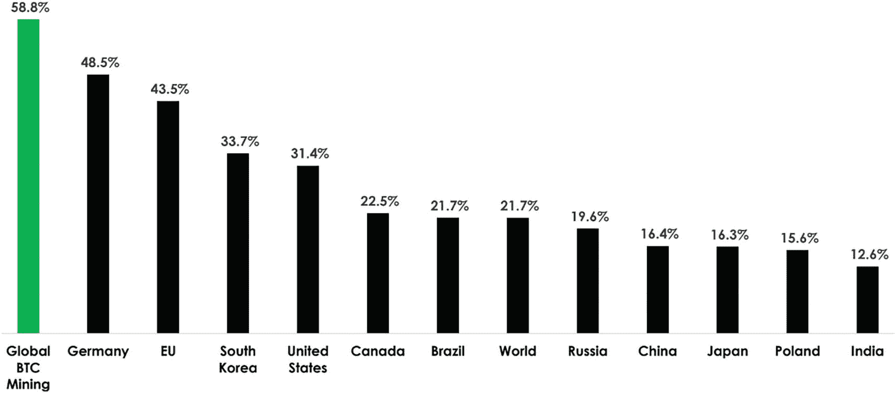

# 区块链作为向善的力量

> 人类的好坏仅取决于其技术发展所允许的程度。
>
> ——乔治·奥威尔

前几章聚焦于货币，而加密资产的革命性承诺远不止于货币领域。特别是，底层区块链技术可以通过无数用例成为促进更大福祉的力量。以下只是可能应用及其积极影响的一瞥。

## 去中心化

几年前，在地中海的一个小岛上，塞浦路斯人民用惨痛的教训上了一课，而世界上大多数人尚未理解这一课。当本国经济状况堪忧、银行艰难维持正向季度财报时，大多数公民仍认为自己与令人困惑的宏观经济事务绝缘。许多人的个人银行账户因数十年的辛勤工作和养老储蓄而持有可观金额。在这种情况下，人们几乎没有任何理由担心财务问题。

然而，到了 2013 年初，创造性的`bail-in`（内部纾困）概念首次被激活。金融监管机构没有让资不抵债的商业银行直接破产，而是决定动用债权人的资金（主要是公民在这些银行中的存款）来偿还银行债务。^(³⁹) 想象一下，你银行账户中的存款突然被"砍头"，无论是不受保的（超过 10 万欧元）还是受保的（低于 10 万欧元）存款，都完全合法且无法追索。不幸的是，就在几年前，这是成千上万在一个民主、工业化的欧洲国家中的人民所面临的现实。

塞浦路斯的惨痛教训告诉我们：银行账户里的内容并不是你的钱。它只是你自愿委托给商业银行的一笔资金的所有权凭证。银行在用这笔钱冒险，如果出了问题，它可以拒绝（或被法律阻止）全额偿还你的债务。因此，你辛苦赚来的钱完全受制于可能拒绝归还的中心化机构。^(⁴⁰)

现在，让我们设想另一个世界：你的钱不在商业银行，而是在一个去中心化的平台上。这是一个通过区块链技术实现的情景。没有银行董事会来决定存款人的资金如何使用，而是在一个由用户共同拥有或用户直接达成共识的共享在线技术平台上，决策被预先透明地编程。在这种情景下，存款人拥有他们自己的钱。当然，储蓄者如果愿意，仍可以单独选择借出部分储蓄以赚取回报。但如果他们愿意，也可以让自己的钱免受金融风险和中心化机构决策的影响。

有时，说服人们相信去中心化的好处颇具挑战性，因为他们通常认为自己已经拥有了去中心化所能带来的东西：所有权。理解去中心化意味着理解当前的标准并非所有权，而是托管。你银行账户里的钱并不真正属于你；你只拥有对银行所持资金的所有权凭证。

## 隐私

2018 年初，黑客入侵了印度的国家身份数据库`Aadhaar`。他们泄露了 11 亿注册印度公民的个人数据，相当于地球上每七个人中就有一人受到影响。泄露信息包括姓名、银行账户详情，甚至指纹等生物识别信息 [9]。

仅仅三年后，在地球的另一端，2021 年 4 月，Facebook 因另一起安全漏洞登上新闻头条。这紧随该公司一系列臭名昭著的安全事件和数据泄露之后，这些事件暴露了数亿用户的个人信息。2021 年的漏洞影响了超过 5 亿用户，泄露了全名、生日、位置、电子邮件地址及其他个人信息 [10]。

虽然隐私问题并非新鲜事，但在过去十年中，它们已成为日益增长的担忧之源。政府和企业在保护公民和用户机密信息方面的失败过于频繁。不幸的是，前面的两个例子只是众多案例中的两个。尽管个人高度重视自己的隐私信息，但政府或公司对这种机密数据的重视程度却不同。由于托管方低估了我们数据的价值，这些数据最终往往保护不足。例如，Facebook 以纯文本形式保存着数百万用户的记录，包括账户和密码，可供数千名 Facebook 员工访问 [11]。

在这方面，区块链技术再次成为游戏规则的改变者。密码学的最新进展使区块链成为机密信息的理想数据库，信息的拥有者（公民）仍保有对其数据的所有权。事实上，从技术上讲，我们不需要将个人详细信息保存在中心化的政府或企业数据库中。相反，用户只需证明自己就是所声称的那个人，或者证明自己拥有所声称拥有的东西，而无需透露任何超出严格必要的信息。这可以通过密码学实现。

特别是，`零知识证明`（`ZKP`）是一个密码学概念，它允许一方向另一方证明某个事实为真，而无需透露任何额外信息。例如，如果我想在美国买酒，我需要证明自己至少 21 岁。通常，我会把身份证交给商家（或在线提交），商家可以核实我的身份和年龄。然而，在这个过程中，我透露的信息远超必要。我分享了姓名、国籍以及身份证上的所有其他信息，而商家并不需要这些。商家甚至不需要知道我的确切出生日期，只需要知道我已满 21 岁即可。相反，使用`ZKP`技术，我可以刷一下卡（或使用在线平台），针对我是否已满 21 岁的问题返回“是”或“否”。通过密码学，我可以证明这些信息是真实且不可伪造的。机密信息得以保留，而商家也获得了必要的信息。当然，买酒并非这项技术的主要应用场景，只是一个易于理解的例子。`ZKP`可以类似地用于证明房屋所有权、信用状况、俱乐部会员资格以及无数其他场景，而无需分享任何超出必要的信息。

其目的并非隐藏信息，而是保护自己免受可能发生在任何存储这些信息的系统中的数据泄露、黑客攻击或信息外泄。加密这些信息并使用区块链进行传输，可以防止任何公司或政府在没有充分保护的情况下存储这些信息。它使人们能够重新掌控自己的身份，并对自己的机密数据拥有自主权。这不仅会强制执行被遗忘权，还会使合规（例如，遵守`GDPR`）变得更便宜、更容易。

区块链技术还可以解决相反的问题——无法通过传统方式正式登记个人数据。

## 包容性

2019 年，`联合国儿童基金会`指出，全球四分之一的出生人口未进行登记，且未记录出生人口的比例正在上升。东南亚和非洲的发展中国家是导致这一数字的主要因素，因为流程的复杂性和登记费用可能会让父母望而却步。不幸的是，缺乏官方出生登记往往使儿童无法获得医疗或教育等基本服务。此外，缺乏登记还使这些儿童面临更高的被剥削风险[12]。

获取身份证明应当简单且价格合理。同样，区块链技术通过消除获取障碍提供了这些优势。简化的流程提供了由最先进密码学保障的、廉价且不可伪造的身份证明。此外，消除获取障碍以促进更大的包容性不仅适用于身份领域，也适用于银行等服务领域。

全球约有 20 亿人没有银行账户，因此被排除在许多经济机会之外。与出生登记相比，开户费用可能令人却步，交易费用过高，且设有最低金额要求。借助区块链技术，无需银行账户即可参与经济活动，甚至无需拥有正式的身份证明。因此，加密资产能够更简单、更廉价地实现无银行账户人群的更高包容性，这是迄今为止任何技术都未能做到的。

诚然，使用区块链需要用户能够访问互联网。不幸的是，这 20 亿无银行账户的人中有许多无法上网。然而，随着互联网基础设施的扩展，越来越多的人能够加入他们此前无法触及的经济体系。

## 私有财产

2022 年，数百万东欧公民被迫逃离自己的国家。在别处寻求庇护时，许多人几乎失去了所拥有的一切，因为他们无法携带财富跨境。在许多情况下，他们随身携带的少量物品被没收或被盗。除了乌克兰危机，联合国难民事务高级专员还指出了全球另外至少十几起紧急情况，在这些情况中，人们常常面临类似的灾难。

虽然一个人的财富大部分体现在实物上，但也有一部分存在于在线货币账户中。不幸的是，这些资金并不总是易于转移，因为其背后的机构往往在最需要提取资金时拒绝放款。此外，国际转账可能受到特定金额的限制，并需支付高额费用。

相比之下，`比特币`使持有者无论在任何情况下都能携带财富。通过记住一个 12 个单词的助记词，人们可以从地球上的任何地方恢复使用`比特币`钱包进行交易。无论冲突、金融机构的限制或国家的政治议程如何，人们都可以拥有私有财产。

正因如此，风险最高的国家正在引领加密资产的采用。例如，`Chainalysis`的 2022 年全球加密采用指数将越南、菲律宾、乌克兰和印度列为加密采用率最高的国家[13]。

## 言论自由

2022 年 10 月，金融科技巨头`PayPal`更新了其可接受使用政策（`AUP`），警告用户，若“传播错误信息”将被处以 2500 美元的罚款。这一更新立即引发了公众的强烈反应，人们纷纷发声反对这种对言论自由的限制。例如，`PayPal`前总裁大卫·马库斯在推特上表示了对这一更新的强烈反对。

> 我很难公开批评一家我深爱并为之付出良多的公司。但`@PayPal`的新`AUP`违背了我所信仰的一切。如今，一家私营公司竟能因为你说了他们不同意的话就决定罚没你的钱。简直疯狂。
>
> ——大卫·马库斯

尽管`PayPal`迅速撤销了这一决定，但这草率的更新引起了全球各地社群对中心化机构权力的担忧。特别是，它加强了采用去中心化系统来保护公众免受金融机构扣押资金能力的理由。保障言论自由意味着人们应该能够自由表达观点，而无需担心招致威胁其生命或财产的后果。

正因如此，世界各地的记者和活动家已经开始使用加密资产，特别是`比特币`进行交易。他们不仅面临因与机构意见不合或利益冲突而导致资金被扣押的低风险，同时也提高了自身的隐私性。

## 通货膨胀

根据世界银行数据库，在截至 2021 年的二十年里，有 28 个国家的年平均通胀率达到两位数或更高。^(⁴¹) 这些国家代表超过 13 亿人，他们国家货币的可靠性不足以存储通过劳动获得的财富。^(⁴²) 此外，2022 年全球通货膨胀显著上升，使情况进一步恶化。

正如第 1 章所述，通货膨胀反映了经济体中货币数量的增加。它通过中央银行提供的增量货币和商业银行创造的信贷来实现。换句话说，让中央银行随意印钞为可能无限的通货膨胀打开了大门。

中央银行的信誉越高，人们对未来通胀率将保持在目标水平附近的信任度就越高。然而，即使是相对可信的央行也难以维持这一目标，因为在困难时期，印制更多货币的动机会变得不可抗拒。例如，尽管欧洲央行的任务是保持通胀率低于 2%，但欧元区 2022 年 10 月和 11 月的官方同比通胀率却超过了 10%。正如之前所述，由于用于计算官方通胀水平的指标问题，实际通胀率可能更高。即使对于`欧洲央行`而言，对其遏制通胀能力的信任也在减弱。

相比之下，`比特币`以绝对可信的方式实现了中央银行的功能自动化。没有人能以超出代码规定的速度挖掘比特币。因此，无论情况如何，未来的通胀率都是绝对确定且不可改变的。2023 年，`比特币`的通胀率约为 1.5%，并将持续下降，直至大约 2140 年达到 0%。

## 环境

截至 2023 年，保障比特币网络运行所需的总用电量已与瑞士全国的能源消耗量相当。这种创纪录的能源消耗是环保主义者反复抨击加密资产的原因。然而，经过更深入的分析后会发现，该行业的兴起对环境其实净有益处，接下来将予以阐述。

首先，高能耗的论点并非适用于所有加密资产。大多数加密资产并非依赖高能耗机制来保障其网络安全，而是采用能耗低得多的替代方案。例如，更为普遍的权益证明机制所消耗的能源，不到工作量证明机制的 1%。再比如，在 `Solana` 区块链上处理一笔交易仅需消耗 2707 焦耳能源，比三次谷歌搜索的能耗还低[14]。为了澄清事实，该行业的高能耗几乎完全来自比特币挖矿，这一过程将在第 6 章详细探讨。目前只需记住，比特币挖矿是指全球数千台计算机通过消耗算力来参与竞赛，以赚取（“挖出”）新的比特币，从而保护网络免受外部攻击。

其次，加密资产有可能取代当前大部分的金融行业。它们已经开始取代银行服务、支付转账公司、经纪商、清算所等机构。它们所取代的陈旧基础设施本身能耗极高。即使在其能耗峰值时期，加密资产行业消耗的能源也仅是当前低效基础设施所用能源的一小部分。例如，`Galaxy Digital` 在 2021 年 5 月的一项研究表明，比特币的能源消耗量还不到传统银行系统自身能耗的一半[15]。从传统金融体系向基于加密资产的体系过渡，将显著降低总能耗。

然而，前两个论点在回应加密资产批评者提出的能耗问题上，只是次要的。他们忽略的根本性论点如下。

保障比特币区块链安全的工作量证明共识机制，创造了一个高效能源具有竞争优势的能源市场。例如，萨尔瓦多等国的天然和可再生地热能源，如今可以在全球范围内被估值和交易。但是，只有在能源价格异常低廉的地方和时间点，挖比特币才具有经济上的吸引力。例如，只有当这些能源无法用于其他任何有用用途时，挖矿才有意义。如果这些能源除了挖比特币之外还能服务于其他目的，那么生产者将其用于替代用途才更有利可图。因此，原本用于比特币挖矿的能源，本来也不会去供应美国家庭用电或照亮德国的高速公路。相反，这些能源原本会因为此时此地电网需求极低而被浪费掉。由于多余能源无法有效储存，将其用于保障比特币网络的安全，能够让全球用户受益，同时防止能源浪费。此外，拥有丰富天然和可再生能源的国家，现在可以将先前无法使用的多余能源进行交易，以造福当地社区。

批评比特币能耗的人没有明白，比特币并不会激励人们在能源可用于其他有价值用途的地方进行挖矿。这与圣诞灯饰截然不同——圣诞灯饰通常会接入那些能源本应用于满足取暖、做饭等基本需求的地方和时间。另一个例子是干衣机，它通常在能源价值最高的地方（大城市）使用，并且其全球总能耗超过了比特币挖矿。^(⁴³)

此外，用于挖比特币的能源主要来自可再生能源。由 53 家矿业公司组成的比特币矿业委员会（代表全球一半网络算力）在其 2022 年第四季度报告中透露，59%的比特币挖矿使用了可再生能源，这一比例高于世界上任何一个国家，并且还在快速增长。研究同一课题的独立机构和学术团体也证实了这一发现。作为对比，美国电网中可再生能源的占比仅为约 31%，全球范围则低于 22%。因此，保障比特币网络安全比使用大多数其他技术要环保得多。除此之外，比特币挖矿的效率及其可持续能源结构也在持续向好发展。例如，过去八年间，比特币的挖矿效率提高了 58 倍[16]。这一惊人的进步意味着，在此期间保障比特币网络安全的成本下降了超过 98%。比特币网络不仅以比大多数技术更环保的方式得到保障，而且其运行效率也在不断提升。



**图 3-1**

可持续能源结构：比特币挖矿 vs. 各国（占总太瓦时的百分比）（来源：比特币矿业委员会 2022 年第四季度报告[16]）

此外，比特币挖矿还激励了全球范围内可再生电力基础设施的融资。例如，当电网需求高时，风力涡轮机和水电站往往电力短缺；但当需求低时，它们又会产生过剩能源——这些本会损失掉的能源，生产者无法储存或交易以回收投资成本。现在，有了挖比特币这个选项，他们有了将这些过剩能源投入实际使用的手段，并利用收益来支付固定成本。这种比特币挖矿能源使用与电网需求（反映在能源价格上）相比的反周期机制，具有稳定作用。由于能源需求更加稳定，投资于可再生能源发电厂变得更具吸引力，因为生产者可以持续从其产出中获益。其结果是，可再生能源的收入变得更加可靠，从而增加了为可再生基础设施融资的动力。

最后，新的发展使比特币矿工能够捕获燃烧的甲烷以及其他当前污染过程中不希望产生的副产品。例如，石油钻探过程中有时会发现天然气。由于石油钻探现场常常缺乏管道来输送这些天然气，过去它们通常被直接排放到大气中或燃烧掉，这被称为*燃烧排放*。现在，这些被困的天然气可以用来制造廉价电力并挖比特币。这样一来，石油钻探过程的二氧化碳排放量减少了，同时为矿工提供了额外收入[17]。因此，比特币挖矿进一步为环境做出了积极贡献。基于以上原因，即使现在还没实现，比特币挖矿也很快将成为一个负碳排放的行业。

## 可持续性

2022 年初，亚马逊雨林的森林砍伐率在连续两年达到创纪录水平后，升至 14 年来的最高点。森林砍伐正在加速，导致永久性的生物多样性丧失，并对气候造成毁灭性影响。

尽管有气候承诺和政治誓言，但对这片世界最大雨林缺乏关注的一个原因是，长期森林管理项目缺乏经济激励。正如前两章所介绍的，法定货币价值的持续侵蚀，使得人们更偏好短期现金流而非长期现金流。事实上，鉴于高通胀率及其不确定性，投资者更青睐未来一个季度内投资的中等回报，而非可能需要几十年才能实现的巨额回报。^(⁴⁴) 在投资者眼中，短期回报更有价值，因为他们对其折现的程度较低。随着货币价值的持续贬值，对未来任何现金流所应用的折现率会随着时间跨度而增加。未来的财务价值较低，从而导致资本被错误地引导而远离它。

转向一种价值不会随时间侵蚀、反而会随时间增长的货币标准，将从根本上改变经济激励。未来将不再被折现，从而不再鼓励以牺牲未来为代价的即时支出。相反，具有长期现金流的项目将在财务上变得更具吸引力，从而将资本引向可持续的事业。这样的货币标准此前从未实现过，但现在技术在技术上已可供所有人使用：`比特币`。

## 透明度

2008 年的次贷危机对全世界造成了毁灭性打击。然而，那些金融部门透明度更高的国家，在此次灾难中遭受的损失更小 [18]。原因之一是，更高的透明度增加了“做正确的事”的动机，因为市场参与者能够更好地根据信息采取行动。

基于区块链的资产通常具有高度透明性。例如，网络上所有`比特币`交易都是公开共享的，任何人都可以即时检索。这项技术能够以低成本为企业及公职人员带来更高的透明度，并且其成本很可能低于现有体系。这并不是说在所有情况下都需要交易和行动的完全透明（尽管有必要时可以实现可编程的透明），但更高水平的透明度能够带来更强的问责制。这一点在那些代理人（即代表他人行事且存在固有利益冲突的关系）中尤为重要，这被称为*代理问题*。例如，“大到不能倒”的银行会承担比储户、债务人、监管机构和公众所期望的更高的风险。银行从上行收益（更高的预期利润）中获益，但不会承受下行风险，因为如果出现问题，政府很可能会出手救助它们。投资和支出方面更高的透明度将减少这种不良激励。公共区块链具有高度透明性，因为它们将所有交易发布在所有人都能访问的不可篡改的公共账本中。

透明度对投资者的价值甚至在金融市场上也是可以衡量的。例如，市政债券的透明度低于联邦债券。尽管市政债券的数量超过任何其他证券，但由于缺乏透明度，它们获得的金融兴趣反而更少。

### 流通速度

在一个偏远的村庄里，一位陌生客人来到当地餐厅。他期待着约会对象到来，但不确定她是否会现身。尽管如此，他还是要求订下最好的餐桌，准备在那里等她。餐厅老板想确保这位陌生客人有能力付款，于是在带他入座前要求他支付押金。客人交出一张`$100`钞票，条件是如果约会对象没来，他可以要回这张钞票。在等待期间，餐厅老板用这张钞票付了厨师的工钱。厨师立刻跑到隔壁的理发师那里，偿还了同等金额的债务。理发师又跑到汽车经销商那里，支付他汽车正在进行的修理费用。汽车经销商拿着这张钞票，来到餐厅老板那里，支付他上次赊账的晚餐。之后，陌生客人离开了，带走了那张`$100`钞票。虽然没有发生任何经济活动，但所有村民的信用都变好了，负债也比一小时前减少了。

高货币流通速度意味着同一张钞票被多次转手，而不是作为个人储蓄被压在床垫下。此外，正如前面的故事所说明的，即使没有发生经济活动，高货币流通速度也能增加经济繁荣。另一方面，被锁定、储存和不使用的货币无法促成交易，这会减缓经济发展。不幸的是，我们当前的银行系统在每一笔银行间交易中都会长时间锁定资金。在同一司法管辖区内的交易，结算通常需要大约两天时间，在此期间，交易的金额不能用于任何其他目的。国际转账甚至可能将资金锁定数周。

通过区块链实现的去中心化金融解决了这个问题，将结算周期从几天缩短到几分钟。随着资金被释放，可以产生更多的繁荣，从而使整个系统受益。

### 外汇

当发生国际交易时，货币通常需要进行兑换（例如，瑞士法郎兑换欧元）。2022 年，外汇市场的日交易额达到`$7.5`万亿。^(⁴⁵) 然而，每笔美元交易都需支付费用，这抑制了国际贸易并减少了经济活动。特别是，从美国进行的跨境支付平均面临`5%`的手续费。此外，外汇交易需要时间进行结算，这进一步拖慢了经济，并需要投入资源来处理其复杂性。

在费用上损失如此巨额资金，是因为涉及众多中间商，以及不同经济体使用不同货币，而这些货币的汇率又永久波动。虽然前一章论证了多种货币并存可能对经济有利，但这个论点适用于在同一经济体内部并行使用的货币（例如，一种用于本地交易，一种用于特定社区交易，一种用于全球交易）。在一个加密整合的世界里，国际贸易无需事先进行外汇兑换即可结算。相反，这类交易可以在全球加密资产网络上进行，从而最大限度地减少交易费用和结算时间。国际交易更倾向于使用全球性货币，而非本地货币。这将消除由众多银行和中间商造成的低效率。此外，这种简化将释放资源：数十万在外汇市场工作的人员可以将他们的技能用于更具经济生产性的目的。

### 会计

2018 年，英国跨国电信公司`BT`爆出一桩丑闻，该集团会计中的人为错误将养老金负债低估了 5 亿英镑。而就在一年前，该公司另一起会计丑闻已导致集团估值减少 80 亿英镑 [19]。

不幸的是，会计中的人为错误和欺诈行为经常能绕过公司的内部控制和审计师的核查。过去十年间，`Wirecard`、`Wells Fargo`、`Toshiba`、`Tesco`、`Petrobras`等公司以及所有大型审计事务所均曝出会计丑闻。

在会计领域使用区块链技术可以减少人为错误和欺诈，促进交易并实现自动化控制。例如，合同的数字签名可以在区块链上为该合同建立采购订单。发票将直接根据该采购订单在区块链上开具，付款随后立即触发。以一种自动化且透明的方式将不同项目链接起来，可以让所有相关方即时了解所有发票、交易和未结金额的状态。此外，对这些记录进行详尽审计可以自动且持续进行，而不是像现在这样基于抽样且存在延迟。自动化这一过程还将大幅降低审计成本，并提供交易透明度。许多其他会计流程也可以实现自动化，并在基于区块链的系统上得到简化。通过提高公司会计流程的自动化和透明度，此类发展很可能减少会计丑闻和人为错误。

### 共享经济

当`Uber`的叫车应用进入市场时，这种商业模式明显优越于传统出租车。例如，`Uber`将有闲暇时间想增加收入的临时司机，与需要比持牌出租车更实惠出行的乘客进行匹配。价格遵循供需规律，以市场建议的水平出清。此外，通过应用可以轻松预订行程，使价格透明并最小化等待时间。尽管这是一场出行革命，`Uber`仍因其攫取过高比例的利润而备受争议，往往只留给司机刚好够支付汽车和燃油费的钱。

现在，想象一下由`Uber`提供的服务，但背后没有这家公司。不是`Uber`，也不是任何其他公司。所提供的服务无需任何公司来运营。相反，社区可以通过一个去中心化平台来管理它。为闲置司机匹配乘客可以通过廉价的方式编程实现。此外，社区可以对各种问题进行投票，例如通过认证或评分来确保客户安全。由于没有公司会分走任何利润份额，乘客出行可能更实惠，司机也能获得更多利润。

这样的系统将成为真正共享经济的一部分。由人民创建、为人民运营的社区应用。`Uber`并非唯一的例子；想象一下没有`Airbnb`公司背后的`Airbnb`服务。或者没有`eBay`的`eBay`服务。没有`YouTube`的`YouTube`服务。没有银行的银行服务。区块链的去中心化为共享经济开启了一个全新的世界，使其能够大规模运行且无需中介机构。^(⁴⁶)

### 创作者赋能

当一位艺术家发布一首歌时，欣赏音乐的听众通常不会直接付费给他。相反，内容创作者和消费者之间存在着众多中间方：录音室、唱片公司、经纪人、电台、知识产权服务商、如`Spotify`、`Amazon Music`或`iTunes`等流媒体平台，以及更多。每个中间方都从艺术家的利润中分一杯羹，留给艺术家回报并精进其技艺的部分所剩无几。其他创意表达形式，如视频、书籍、绘画甚至电子游戏，在从创作到消费的分销链中也面临着同样的费用侵蚀。

在某些情况下，唱片公司、出版商和其他中间方通过提供有益的反馈、瞄准正确的受众或改进创意作品来增加价值。然而，在许多情况下，费用相对于所提供的服务来说过高了。无论如何，是选择通过中间方还是直接接触粉丝，应该是艺术家的选择，而不应是被有限技术或行业标准强加的义务。

区块链解决方案提供了这种选择。艺术家现在可以将他的作品（例如一首歌）发布在去中心化服务器上，并使用区块链以预定的使用费进行分享。如果是私人聆听歌曲，费用可以很低。如果用作商业视频的背景音乐，费用可以更高。如果用作电影的主题曲，费用甚至可以更高。艺术家可以通过同一区块链上的加密货币支付直接获得报酬，并完全了解其作品的流行度。更高的可见性使其他艺术家能够发现机会，而不是面对中间方费用的黑箱。大幅降低的制作和分销成本使内容创作者能够充分享受其知识产权的收益。此外，用户可以直接奖励他们，并且每个人都受益于更高的行业透明度。

## 关键概念

虽然区块链技术挑战了货币的意义，但其益处远不止于此。特别是，它作为推动环境、社会和治理（ESG）实践及包容性的驱动力而大放异彩。

*   **去中心化与自主权**：去中心化使人们摆脱了机构和政府的不当行为，这些机构并不总是将人民的最大利益放在首位。更高的安全标准和数据加密使人们能够重新掌控自己的在线身份，并限制与数据库泄露相关的风险。
*   **包容性与服务普及**：区块链还使数十亿人能够获得身份认证和银行服务等基本服务，而他们目前被排除在这些服务之外。同时，它通过消除攫取过高比例利润的不必要中间方，实现了真正的共享经济。
*   **抗通胀与价值存储**：此外，当前面临恶性通货膨胀风险的数十亿人现在有了一种替代货币，其未来通胀率可以提前可靠预知。
*   **环境可持续性**：更重要的是，基于区块链的资产可以通过加速向可再生能源的过渡，大幅减少人类对环境的负面影响。保护像`Bitcoin`这样的加密资产网络，其可再生能源使用率远超世界上任何国家，从而引领了方向。
*   **向善的应用**：最后，区块链作为向善力量的应用案例正在不断被开发出来。

## 扩展问题

```
区块链技术和加密资产如何能够帮助建立全民基本收入？

区块链如何能够增强本地社区？

区块链或`Bitcoin`还能以其他哪些方式成为促进更大福祉的驱动力？

脚注 1 2 3 4 5 6 7 8
```