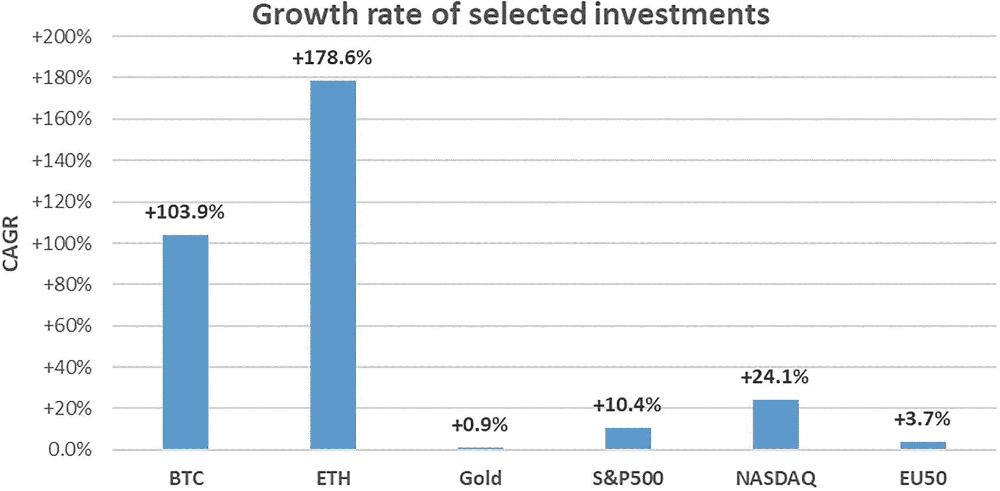
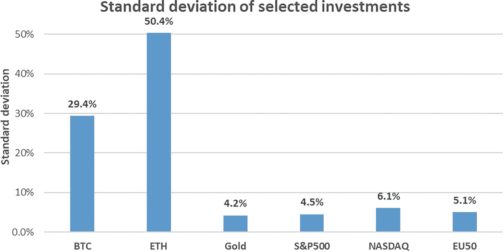
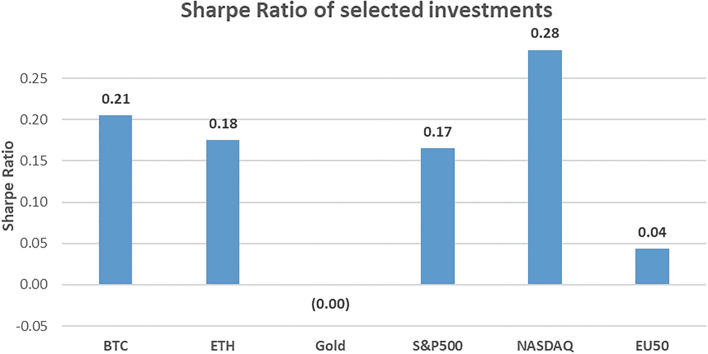
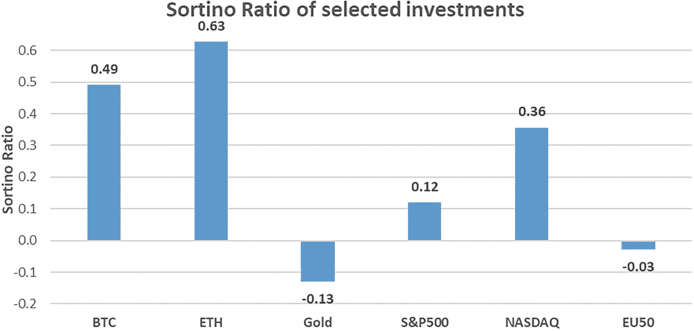
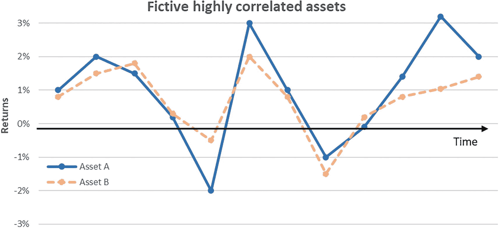
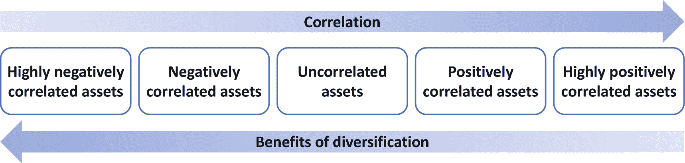

# 4. 投资组合管理入门

> *Audentes fortuna iuvat.（命运眷顾勇者。）*
> 
> ——维吉尔

让我们转换视角，从金融投资组合管理的角度来审视加密资产。本章介绍投资组合管理的基础知识，以评估加密资产的金融特性。正如分析所示，加密资产是过去十年来最具财务吸引力的投资，即使在风险调整后也是如此，并且在未来十年内可能继续保持这一态势。

### 价格波动

虽然基本面定义了资产的经济价值，但交易所的供需关系驱动着其价格。资产价格与价值之间的差异为能够发现这种差异的投资者创造了机会：当价格最终趋向资产的经济价值时，他们便能确保获得投资回报。价格波动的幅度和频率（即波动性）在投资组合管理中至关重要。我们首先讨论价格如何波动，这最终驱动了回报和波动性。

价格变化取决于交易所的交易。一个`订单簿`中存有待成交的订单。它记录了买方愿意购买和卖方愿意出售的价格，以及每笔交易的数量。表 4-1 展示了订单簿的样貌以及大额交易发生时的情形。假设比特币当前交易价格为`$123,456.78`（截至撰写本文时，该价格尚未达到），其订单簿如表 4-1 所示。

**表 4-1** 比特币订单簿示例，当前价格为`$123,456.78`

| | 价格（美元） | 数量（BTC） |
|--- |--- |--- |
| 卖方 | `123,500.00` | `3.141` |
| | `123,489.24` | `0.318` |
| | `123,475.00` | `2.718` |
| | `123,468.43` | `0.476` |
| | `123,459.00` | `1.618` |
| | `123,457.55` | `0.693` |
| | `123,457.00` | `0.301` |
| 买方 | `123,456.54` | `0.707` |
| | `123,456.32` | `0.632` |
| | `123,456.00` | `0.774` |
| | `123,455.00` | `1.000` |
| | `123,453.50` | `0.547` |
| | `123,450.00` | `3.162` |
| | `123,449.99` | `1.414` |

表 4-1 中的每一行都对应着一个市场参与者的买入或卖出订单。例如，一位个人投资者愿意以每个`BTC` `$123,457.00` 的价格卖出 `0.301 BTC`（第七行），另一位则愿意以`$123,455.00` 的价格买入 `1.000 BTC`。两者都在等待市场价格变动以执行其订单，因为当前价格对买家来说过高，对卖家来说过低。价格从高到低排序，卖方价格总是高于当前价格，而买方价格则低于当前价格。情况总是如此；否则，订单会立即成交，而不会作为待成交订单显示在订单簿上。

现在假设一个大买家希望以最高每个`BTC` `$123,500.00` 的价格收购 `10 BTC`。表 4-1 中可见的整个卖方待成交订单将立即成交。买家以`$123,457.00` 获得 `0.301 BTC`，以 `$123,457.55` 获得 `0.693 BTC`，依此类推，直到以`$123,500.00` 获得 `3.141 BTC`。结果，比特币的当前价格会突然跃升至`$123,500.00`。

由于与传统股票和债券市场相比，加密资产市场的流动性相对较低（每日总交易量显著更低），大额订单往往会导致价格大幅波动。例如，特斯拉在 2021 年 2 月购买了 `15 亿美元` 的比特币，导致价格飙升。大幅的价格变动造成了加密资产闻名的高波动性。然而，随着行业日趋成熟，加密资产可获得的流动性水平不断提高，这往往有助于降低波动性。

### 风险与回报

简而言之，投资组合管理旨在识别最优资产配置，以在尽可能低的波动性下最大化预期回报。确实，对于大多数投资者而言，高财务回报和低波动性具有吸引力。按照惯例，行业内将术语“风险”赋予波动性，并将其衡量为回报的标准差。简单来说，回报的标准差就是它们相对于平均值的平均偏差。

诺贝尔奖得主哈里·马科维茨在 1952 年提出的优化金融投资组合的理论，至今仍是财务顾问使用的基本方法。这种`现代投资组合理论`旨在根据投资者的特定特征（如风险承受意愿和时间跨度）找到回报与风险之间的正确平衡。该方法识别出在给定风险水平下可预期的最高可能回报水平。可接受的风险水平越高，预期回报就可能越高。

基于此背景，表 4-2 比较了主要加密资产（比特币和以太坊）与不同基准（黄金和主要多元化指数：标普 500、纳斯达克和欧洲斯托克 50）的历史回报。任意选择时间框架会显著导致分析偏差。因此，使用了一个标准的时间框架：其周期足够长以具有意义，又足够近以保持相关性——一个截至本书撰写时为止的十年窗口期：从 2013 年 1 月 1 日到 2022 年 12 月 31 日。为了比较多年回报，使用`复合年增长率`（CAGR），即假设利润持续再投资的情况下，一项投资的平均年回报率。

**表 4-2** 所选投资从 2013 年到 2022 年十年间的年度回报比较（以太坊从 2016 年开始，即其首个完整年度）。数据来源：BTC 数据来自雅虎财经；ETH 数据来自 ethereumprice.org；黄金、标普 500 和纳斯达克数据来自 MacroTrends（`www.macrotrends.net`）；欧洲斯托克 50 数据来自 investing.com。

| 回报率 | BTC | ETH | 黄金 | 标普 500 | 纳斯达克 | EU50 |
|--- |--- |--- |--- |--- |--- |--- |
| 2013 | `+6,035%` | 不适用 | `–28%` | `+30%` | `+62%` | `+18%` |
| 2014 | `–61%` | 不适用 | `–0%` | `+11%` | `+22%` | `+1%` |
| 2015 | `+38%` | 不适用 | `–12%` | `–1%` | `+23%` | `+4%` |
| 2016 | `+130%` | `+785%` | `+9%` | `+10%` | `+17%` | `+1%` |
| 2017 | `+1,268%` | `+9,190%` | `+13%` | `+19%` | `+17%` | `+6%` |
| 2018 | `–72%` | `–81%` | `–1%` | `–6%` | `+8%` | `–14%` |
| 2019 | `+87%` | `–10%` | `+19%` | `+29%` | `+34%` | `+25%` |
| 2020 | `+308%` | `+473%` | `+24%` | `+16%` | `+26%` | `–5%` |
| 2021 | `+62%` | `+400%` | `–4%` | `+27%` | `+60%` | `+21%` |
| 2022 | `–65%` | `–68%` | `–0%` | `–19%` | `–11%` | `–12%` |
| **总计** | **`+124,317%`** | **`+130,242%`** | **`+10%`** | **`+169%`** | **`+770%`** | **`+44%`** |
| **年复合增长率** | **`+103.9%`** | **`+178.6%`** | **`+0.9%`** | **`+10.4%`** | **`+24.1%`** | **`+3.7%`** |



2013-2022 年所选投资的年复合增长率柱状图：`BTC`，`103.9%`；`ETH`，`178.6%`；黄金，`0.9%`；标普 500，`10.4%`；纳斯达克，`24.1%`；EU 50，`3.7%`。

**图 4-1** 所选投资 2013–2022 年的年复合增长率

如表 4-2 和图 4-1 所示，两种最大加密资产的平均回报率比传统投资高出几个数量级。

然而，回报率只是故事的一部分。更高的回报只有通过接受这些回报所带来的更大波动性才能实现。表 4-3 展示了基于相同投资每日、每周、每月和每年回报标准差计算的波动性。

**表 4-3** 相同时间跨度内所选投资的回报标准差（即波动性或风险）

| 标准差 | BTC | ETH | 黄金 | 标普 500 | 纳斯达克 | EU50 |
| --- | --- | --- | --- | --- | --- | --- |
| 日度 | 5.5% | 6.3% | 0.8% | 0.9% | 1.2% | 1.0% |
| 周度 | 13.1% | 17.2% | 2.0% | 2.3% | 3.2% | 2.7% |
| 月度 | 29.4% | 50.4% | 4.2% | 4.5% | 6.1% | 5.1% |
| 年度 | 1,891.1% | 3,394.7% | 15.1% | 16.3% | 22.1% | 13.4% |

无论观察收益率的频率如何（日度、周度、月度或年度），加密资产的波动性都要比传统投资高出几个数量级。接受加密资产可能带来三位数或四位数收益率的同时，也意味着要接受这些投资可能在几周内损失 80%价值的事实。



一张显示 6 种选定投资标准差对比的柱状图。`BTC`，29.4%。`ETH`，50.4%。黄金，4.2%。`标普 500`，4.5%。`纳斯达克`，6.1%。`EU50`，5.1%。

**图 4-2** 选定投资在考察时间范围内的月度收益率标准差（又称波动性或“风险”）

#### 夏普比率

夏普比率以诺贝尔奖得主威廉·夏普命名，用以评估投资中风险与回报之间的关系。具体而言，该比率将超额回报（相对于基准）除以其波动性。从而通过单一指标衡量投资相对于其风险的有效性。例如，假设作为基准的无风险投资回报率为 1%。另一项投资平均回报率为 4%，回报波动性为 2%，则其夏普比率为 1.50，计算方法为超额回报 3%（= 4% - 1%）除以其波动性 2%。

其代数公式如下：

```
夏普比率 = 超额回报 / 波动性 = (4% - 1%) / 2% = 1.50
```

该指标很有用，因为它能比较不同风险状况的投资。例如，如果一只预期回报率为 10%的股票风险远高于另一只预期回报率为 8%的股票，那么投资前者本身并不一定优于后者。夏普比率使得同类比较成为可能。

假设无风险回报率为 1%，表 4-4 展示了前述投资使用日度、周度、月度及年度数据计算出的夏普比率。

**表 4-4** 选定投资的夏普比率（使用相同时间框架，假设无风险回报率为 1%作为基准）

| 夏普比率 | BTC | ETH | 黄金 | 标普 500 | 纳斯达克 | EU50 |
| --- | --- | --- | --- | --- | --- | --- |
| 日度 | 0.05 | 0.07 | 0.00 | 0.03 | 0.05 | 0.01 |
| 周度 | 0.14 | 0.18 | 0.01 | 0.09 | 0.14 | 0.03 |
| 月度 | 0.27 | 0.32 | 0.00 | 0.18 | 0.31 | 0.07 |
| 年度 | 0.41 | 0.45 | 0.07 | 0.65 | 1.13 | 0.26 |

基于这一指标，大型且多元化的传统指数与主要加密资产的数量级大致相当，这表明加密资产增加的回报与其增加的波动性大致成比例。⁴⁷



一张显示 6 种选定投资夏普比率对比的柱状图。`BTC`，0.21。`ETH`，0.18。黄金，0.0。`标普 500`，0.17。`纳斯达克`，0.28。`EU50`，0.04。

**图 4-3** 选定投资的月度夏普比率（使用相同时间框架，假设无风险回报率为 1%作为基准）

#### 索提诺比率

夏普比率的一个缺点是，当回报在上升方向上大幅波动时，该比率下降的方式与回报在下跌方向上波动时相同。然而，这两种情况的金融风险截然不同。投资者真正的风险是损失金钱的风险，或者至少是未能达到目标回报水平的风险。与目标回报持平或大幅超额的可能性不应在评估投资风险时发挥作用。

索提诺比率恰恰旨在解决这一缺点。该比率以弗兰克·索提诺命名，它区分了好的波动性和坏的波动性。与夏普比率仅使用回报的标准差不同，它剔除了价格上涨波动对标准差的影响，专注于低于目标回报的回报波动性。该目标回报取代了夏普比率公式中的无风险回报率。

就索提诺比率而言，假设目标回报率为 5%，前述投资在日度、周度、月度和年度数据上的表现如下。⁴⁸

**表 4-5** 选定投资的索提诺比率（使用相同时间框架，假设目标回报率为 5%作为基准）

| 索提诺比率 | BTC | ETH | 黄金 | 标普 500 | 纳斯达克 | EU50 |
| --- | --- | --- | --- | --- | --- | --- |
| 日度 | 0.04 | 0.07 | –0.02 | 0.02 | 0.05 | 0.00 |
| 周度 | 0.14 | 0.24 | –0.05 | 0.05 | 0.14 | –0.01 |
| 月度 | 0.49 | 0.63 | –0.13 | 0.12 | 0.36 | –0.03 |
| 年度 | 18.86 | 4.57 | –0.37 | 0.56 | n.a. | –0.27 |

索提诺比率对这些资产在过去十年的评估结果十分明确。当仅将“坏的”波动性作为风险指标时，主要加密资产相对于传统投资而言，其超额回报在很大程度上足以补偿金融风险的增加。



一张显示 6 种投资索提诺比率对比的柱状图。`BTC`，0.49。`ETH`，0.63。黄金，-0.13。`标普 500`，0.12。`纳斯达克`，0.36。`EU50`，-0.03。

**图 4-4** 选定投资的索提诺比率（使用相同时间框架，假设目标回报率为 5%作为基准）

#### 投资回报的简单分析

尽管前述分析倾向于加密资产，但另一种更直观的方法使情况更加简单。虽然高波动性本身并不可取，但对于长期投资者来说并非主要担忧。事实上，如果我的投资周期是四年，并且我的投资增长了十倍或更多，我并不太关心在此期间经历的波动性。这样的回报将比我对任何传统投资的预期高出整整一个数量级。对许多投资者而言，唯一真正重要的价值是入场价格和退出价格。

举个例子能让它更具体。如果我于 2017 年 5 月做多（买入）比特币，我会在其当时的历史最高点以每枚 2000 美元的价格买入一个比特币（即比特币首次突破这一里程碑）。如果我四年后，即 2021 年 5 月，以 50,000 美元的价格卖出，我将获得可观的回报。具体来说，我的投资增长了 25 倍（即四年内 2400%的回报率），相当于 124%的年复合增长率。在此期间价格大幅涨跌重要吗？我本可以在 2017 年 7 月以更低的价格买入，并在 2021 年 4 月以超过 64,000 美元的价格卖出，在更短的时间内获得更大的收益。诚然，一部分机会错失了，但我的年化回报率仍然比我在股市⁴⁹或债券⁵⁰上能赚取的高出许多倍。在这种情况下，波动性只是次要的考虑因素。

### 相关性与多元化

“不要把所有鸡蛋放在同一个篮子里”这句谚语在投资组合管理中通过相关性的概念得以体现。通常，人们预期某些金融资产在特定时期表现良好，而其他资产在同一时期则表现不佳。事实上，一个地方性或公司特定的事件可能会影响一家公司，而不会波及另一家。例如，非洲的政治动荡可能会影响该地区，但对世界另一端的影响不大。这一简单事实意味着，分散投资组合是有益的，因为它能在不影响预期收益水平的情况下降低风险水平。例如，将部分资金投资于美国科技股、部分投资于中国制造业、部分投资于欧洲住宅房地产、部分投资于实物黄金、部分投资于澳大利亚市政债券，比将所有资金投入上述任何单一类别都要好。

相关性是指资产之间同向变动的程度。如果一项资产在另一项资产上涨时倾向于上涨，那么这些资产就呈正相关。如果一项资产在另一项资产上涨时倾向于下跌，则它们呈负相关。如果它们彼此独立变化，那么它们就是不相关的。因此，相关性可以表示为一个从完全负相关（-100%）到完全正相关（+100%）的区间。该区间的中点，即 0%的相关性，表示资产不相关。



一张显示两种资产收益率随时间变化的折线图。资产 A 的收益率在-2%到 3%之间交替升降。资产 B 在-1.5%到 2%之间遵循类似趋势。

**图 4-5** 正相关资产收益率的示例（相关系数 = 85%；即倾向于随时间同步变动）

即使大多数资产之间存在一定程度的正相关性，但它们并非完全正相关（即并非在同一时间、朝同一方向变动）这一事实本身就意味着多元化带来的好处。资产之间的正相关性越高，将这些资产放在同一个投资组合中的多元化收益就越低。



一张展示相关性增加与多元化收益递减之间关系的图表，从左到右呈现了五种类型：高度负相关、负相关、不相关资产、正相关、高度正相关资产。

**图 4-6** 资产间相关性与多元化收益关系的图示

然而，并非所有风险都是可分散的。系统性风险与宏观经济事件有关——关乎整个经济体系。它始终存在于任何投资组合中。另一方面，非系统性风险，或公司特定风险，则可以通过分散投资来消除。例如，一项新税可能有利于某个行业而损害另一个行业。一个在每个行业都有资本投入的投资者就能对冲这种税收风险，因为一项投资的收益抵消了另一项投资的损失。多元化可以在不降低预期收益的情况下降低投资组合的风险水平。

投资组合经理的工作就是挑选那些能在保持风险尽可能低的同时最大化预期回报的投资。虽然客户特定的标准（如时间跨度、风险承受意愿、边际税率）也起作用，但一般来说，这归结为在既定风险水平下最大化回报。跨资产类别和资产类别内部的多元化有助于实现这一目标。

加密资产的诞生使投资组合经理能够接触到一种新的资产类别，并从中为投资组合挑选投资标的。只要这一新资产类别与其现有投资组合并非完全正相关（+100%），那么将加密资产添加到投资组合中就会产生多元化收益。

表 4-6 显示了在过去十年中，之前选定的各项投资之间的成对相关性。

**表 4-6** 选定资产对在同一时间段内的月度收益率相关性

|   | BTC | ETH | 黄金 | 标普 500 | 纳斯达克 | 欧洲 50 |
|---|---|---|---|---|---|---|
| BTC |   | 44% | 1% | 24% | 20% | 16% |
| ETH |   |   | 25% | 19% | 18% | 15% |
| 黄金 |   |   |   | 5% | 2% | -1% |
| 标普 500 |   |   |   |   | 68% | 80% |
| 纳斯达克 |   |   |   |   |   | 44% |
| 欧洲 50 |   |   |   |   |   |   |

当相关性超过 50%时通常被认为*中等*，超过 75%时被认为*强*。虽然表 4-6 显示加密资产类别内部的相关性接近“中等”阈值（比特币与以太坊之间为 44%），但同时也表明加密资产与黄金以及所选三大指数（均低于 25%）的相关性很低，至少在所选时间段内是如此。⁵¹

将加密资产加入传统投资组合可以显著改善该组合的前景，这不仅是因为其之前展示的高回报，还因为它与其他资产类别的低相关性。多元化带来的好处使得在任何投资组合中配置一定比例的加密资产都变得有意义，即使忽略其提供的高回报也是如此。

### 投资组合经理的信托责任

将资本委托给投资组合经理，意味着投资者付出的信任和投资组合经理做出的承诺。事实上，根据其职责，投资组合经理有义务为投资者的最佳利益行事。这种义务被称为信托责任。因此，他必须深入研究每一项潜在投资，并为该投资者构建一个最优的投资组合。而投资组合的最优性需考虑其风险-收益特征等诸多因素。

因此，将加密资产加入金融投资组合所带来的巨大多元化好处，使得全球所有投资组合经理都有责任将部分资本投资于加密资产。至少，他们必须向有意接触这一十年来表现最佳资产类别的投资者提供这种可能性。

这些投资组合经理包括投资基金、共同基金和养老基金。截至 2020 年底，仅养老基金就持有超过 56 万亿美元的资产，其中大部分在美国。⁵² 然而，这些传统投资公司尚未广泛获得投资加密资产的渠道。近期的监管发展表明，这种情况有望在未来数月和数年内发生改变。一旦这一新资产类别对养老基金成为可投资标的，仅将其管理资产的 2%投资于加密资产，就足以使加密资产领域的规模在 2023 年 5 月的基础上扩大一倍以上。

其他机构投资者面临着与养老基金类似的情况，即目前在投资加密资产方面面临重大障碍。此外，它们管理的资产规模是养老基金的许多倍。由于其信托责任以及加密资产行业近期的监管发展，有理由相信这些金融机构中的大部分将很快进入加密资产领域。它们进入加密资产市场可能会彻底改变该资产类别的规模，类似于 20 世纪 90 年代末大宗商品成为机构可投资资产类别时出现的情况。因此，当这种情况发生时，大量机构资本流入加密资产，很可能会使许多加密资产的价格成倍上涨。

### 核心概念

金融投资组合管理的核心概念是回报率和波动率（即风险）。过去十年间，加密资产的平均回报率和波动率比传统股票和大宗商品投资高出几个数量级。然而，两者之间的关系——单位金融风险的超额回报——表明加密资产是过去十年最具财务吸引力的投资。

此外，加密资产与传统投资的相关性相对较低（即它们不会在同一时间朝同一方向波动）。这种低相关性使加密资产成为分散投资组合的良好工具。鉴于金融机构投资组合管理人有义务为投资者的最佳利益行事，投资加密资产很可能很快将成为其职责要求。一旦发生这种情况，加密资产市场的规模将成倍增长。

### 扩展问题

对于典型养老基金而言，其管理资产中投资于加密资产的最佳比例是多少？

其他机构投资者，例如大型投资基金，情况又如何？

加密资产的历史回报率是否预示了其未来的预期回报？

脚注 1 2 3 4 5 6