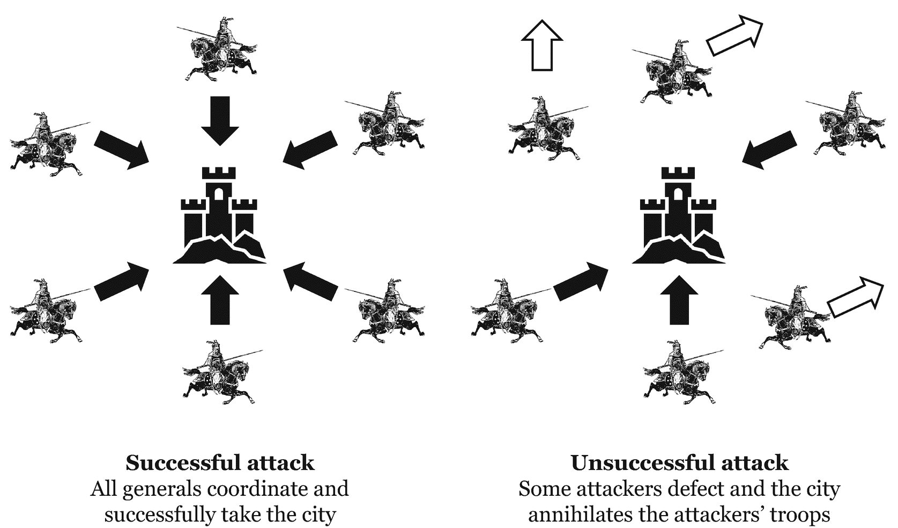
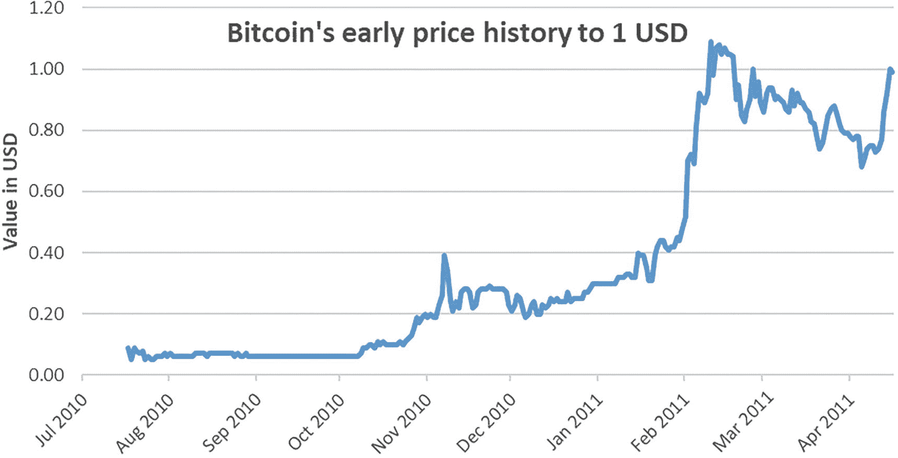
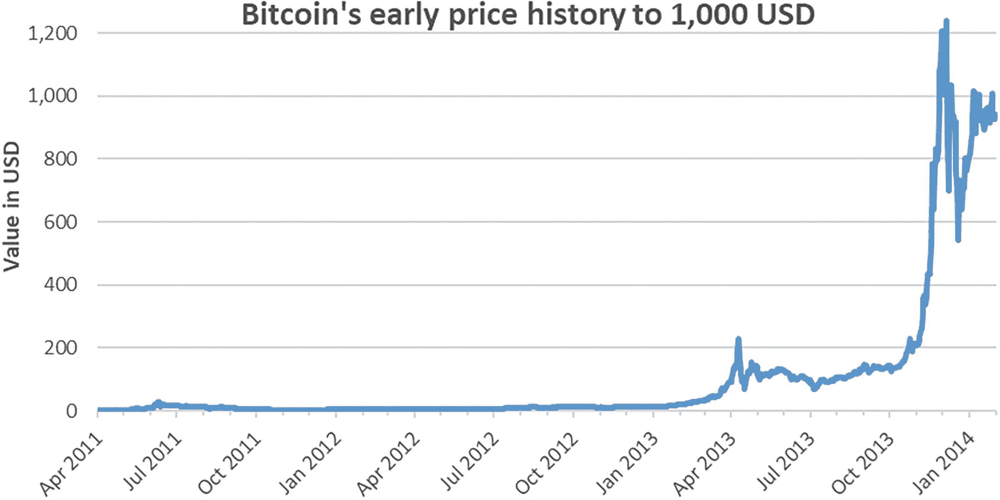

# 5. 新型资产类别的诞生

> *我一直在研发一种全新的电子现金系统，它完全点对点，无需任何可信第三方。*
>
> ——中本聪

本书第一部分阐述了为什么加密资产值得理解，而第二部分将深入探讨其具体内涵。本章介绍第一个加密资产如何诞生、为何具有重要意义，以及后续的发展。

## 首个加密资产的诞生：比特币

在自 20 世纪 30 年代大萧条以来最严重的金融危机中，金融体系的稳定性受到考验。2008 年万圣节过后的下午，神秘人物“中本聪”^(⁵³)首次在`密码学邮件列表`上发帖。中本聪的帖子以开头的引文开始，并包含一份九页文档的链接，标题为《`比特币 P2P 电子现金论文`》。这份白皮书标志着第一个加密资产的诞生[20][21]。

比特币实际上在几个月后，即 2009 年新年过后不久诞生，当时中本聪在区块链上发布了比特币的创世区块。区块链是使比特币得以运行的底层技术。

尽管诞生于 2009 年初，但比特币的概念验证仍需几年时间才能走出阴影。比特币首次有效估值出现在那年秋天，当时“`新自由标准`”在线交易所用 5.02 美元购买了 5050 个比特币（1 美元兑 1006 个比特币），以发布首个正式的比特币汇率。该汇率基于一个简单的模型，该模型估算出挖掘一个比特币所需的电力成本。后来，在 2010 年春末，`拉斯洛·汗耶茨`完成了首笔比特币商业购买：用 10000 个比特币购买了两份`棒约翰`披萨。尽管当时这些比特币价值 41 美元已远高于两份披萨的价格，但如今它们将价值数亿美元。

从那时起，科技爱好者越来越多地将比特币用作数字货币。然而，这些交易并非出于便利，而是旨在展示价值可以在去中心化、无中介的情况下进行交换。事实上，这种新型数字货币是一项真正的技术杰作，它解决了一直以来未被有效攻克的问题。

## 双重支付问题的解决方案

中本聪带来的真正创新，是在数字和去中心化环境中破解了双重支付问题。

当你发送电子邮件或在线图片时，实际上发送的是副本，而本地仍保留原件。这种发送副本的方式不适用于货币。货币需要稀缺性才有价值。如果任何人都能随意发送数字硬币的副本（即多次花费同一枚硬币，故称“双重支付”），那么稀缺性就不复存在。试想一下，如果大多数人可以在多家商店多次花费同一张 100 美元钞票，而银行账户却不会被扣款，那会怎样？缺乏稀缺性会使它变得毫无价值，因为它永远无法成为可靠的货币。传统上，社会依赖银行等第三方来避免双重支付问题。如果你从银行账户在线转账，银行会确保你不再拥有转出的资金。银行充当了防止双重支付的中介。

利用技术创新和现代密码学，中本聪设计了一种无需任何中介即可解决双重支付问题的技术。这项技术后来被命名为区块链，属于如今所称的分布式账本技术的一部分。

比特币是区块链技术在价值领域的首个应用，正如电子邮件是互联网技术的首个应用一样。当然，电子邮件只是互联网所实现可能性的一小部分。比特币和区块链也是如此。

### 拜占庭将军问题

理解区块链重要性的一个途径，是首先认识到分布式计算系统中的一个著名难题：拜占庭将军问题。^(⁵⁴)

两位拜占庭将军计划从城池两侧同时发起进攻。如果他们协同进攻，必将获胜。然而，若其中一位独自出击，其部队将被城防力量歼灭。将军们对进攻时机并无偏好，只关心行动能否协调一致。

问题在于通信系统并不可靠。一位将军必须派遣信使穿越城池，向另一位将军建议进攻时间。但敌人可能在城中截获信使。因此，发出信使后，这位将军无法知晓另一位将军是否收到了消息。即便另一位将军收到了消息，他也不知道消息是否被敌人篡改（或是否被敌方假冒的信使替换）。

这些问题意味着，成功抵达接收方的信使还必须返回发送方以确认送达。然而，即使他成功返回并确认，发送将军仍需要接收将军知道信使已返回确认。否则，接收将军无法确定发送将军会出兵，因为发送将军可能并未收到确认。换言之，知道对方知情是不够的。还必须知道，对方知道自己知情。

这还没完：还必须知道，对方知道自己知道对方知情。这个问题会无限延伸下去，各方始终无法确信彼此在时机上达成一致。其广义形式指出，系统中的某个部分可能发生故障，而关于任何部分是否发生故障的信息都不完备。此外，需要协调的将军数量可能远多于两位。

在成功进攻的实例中，全部 6 位将军协同作战，率领部队成功攻占中央城池。在失败进攻的实例中，3 位将军叛变，城池歼灭了部队。

*图 5-1：超过两位将军的拜占庭将军问题示意图*

拜占庭将军问题与去中心化货币的背景直接相关。货币网络上的任何参与者都可能试图欺骗系统。例如，不诚实的人可能试图将同一笔钱花费两次，或者同时发送并保留这笔钱。在没有中央权威来阻止此类行为的情况下，网络上的所有参与者都需要就谁在何时拥有多少资金达成共识。

如同拜占庭将军一样，货币网络上的所有参与者都需要在不完备的信息下进行协调。特别是，他们无法知道敌人（不诚实者）是否篡改了消息（转移的资金）。此外，所有成员都需要知道网络上的每个人都清楚谁在何时拥有多少资金，即便网络上存在不诚实的参与者。

### 拜占庭容错

解决这个问题并不简单。解决方案应避免所谓的“拜占庭故障”，即系统中的节点^(⁵⁵)（将军）因一个或多个节点可能出现故障（不诚实）而无法达成一致。一种解决方案是实现“拜占庭共识”，即所有工作节点（诚实的将军）都接受广播者（发送将军）发送的消息。无论是否存在可能的故障组件，所有工作节点都达成一致。同时，它们都知道其他所有工作节点也达成了共识。在拜占庭背景下，共识对应所有诚实的将军同时派出部队。在货币背景下，则对应所有成员就谁拥有多少资金达成一致。

实现“拜占庭共识”的解决方案需要两件事。首先，需要不可伪造的消息签名来证明消息来源。其次，需要依赖多数节点是诚实的这一假设。

不可伪造的消息签名可以通过密码学实现。这是一种通过算法对消息进行加密以保持其机密性的过程。^(⁵⁶) 特别是，`公钥`和`私钥`的组合能够实现这种加密，并提供防篡改的消息来源证明。一个节点（发送将军）用其`私钥`对消息进行加密。顾名思义，这个密钥是私有的，任何不诚实的节点（敌人）都无法伪造。然而，任何人都可以使用对应的`公钥`来识别出，加密后的消息只能来自原始节点（发送将军）。如果`公钥`能解密该消息，那么该消息只能由对应的`私钥`加密，从而证明其真实性。

下一章将详细介绍非对称密码学。现在，将这些密钥想象成物理邮箱会更容易理解。`公钥`相当于邮箱地址，^(⁵⁷) 人人皆知；任何人都可以向该邮箱发送邮件。相比之下，只有邮箱主人持有打开邮箱并从中发送邮件的`私钥`。

关于多数节点保持诚实的假设，是通过精心设计的激励机制和网络的渐进式增长来实现的，以确保网络保持去中心化。不诚实节点成为多数代表了一种加密资产中的风险，这将在第 13 章中分析。

区块链被设计成一个拜占庭容错系统，其首个应用场景比特币就是为了防止双重支付。所有用户通过点对点的信息交换（由计算证明进行认证）来就交易的 chronological 顺序达成一致。即使网络中的某些节点变得不诚实，其余节点仍能在不接受欺诈交易的情况下达成共识。比特币区块链的构建符合博弈论，它为网络上的所有参与者提供了正确的激励。每个参与者都被鼓励按照规则行事，而欺骗行为在任何方面都无利可图。这样，按规矩办事符合所有人的利益。这种技术在“技术上”是可行的。换句话说，存在一种数学上可行的方法来实现防故障、去中心化的货币转移。

要使这项技术发挥作用，还有另一个关键方面——人的因素。一个社区会愿意在没有任何中介的情况下，以去中心化的方式处理资产吗？历史表明，会的，它愿意，并且已经做到了。这个故事将我们带到了太平洋上的一个小岛。

### 去中心化货币概念验证：雅浦岛石币

比特币并非首个无需中介即可运作的非实体货币。几个世纪以来，密克罗尼西亚的雅浦岛一直使用一种无处不在的货币形式，在个人与村庄之间转移价值，且无需中间人。

这种货币形式被称为*雅浦石币*或*雅浦岛石钱*：大型圆形石盘，中心凿有孔洞，散落在岛上的各个村落中。这些石盘重达数吨，堪比一头成年的雄性亚洲象。

一张照片：一块表面粗糙、巨大而厚重的圆形石头，放置在草地上，中心有一个小孔。

**图 5-2**

雅浦石币，在密克罗尼西亚雅浦岛上用作货币。（来源：`维基共享资源`，公有领域）

与西方社会的标准相反，持有者并不代表拥有价值。任何个人要想搬运这种石头进行交易，即便不是完全不可能，也是极其困难的。相反，整个社群通过口口相传的方式对价值达成共识。例如，若一位农民出售他的一部分土地，他就能获得村口那块石币的一半。买卖双方将这一信息告知社群，以验证这笔交易。由于所有社群成员都知道，在交易之前，这块石币归买家所有，他们便同意这笔交易可以发生。在社群的集体认知中，这位农民现在成了那块石币一半的新主人，他可以用这部分价值进行任何购买。

类似于“账户”之于买卖双方和农民，每位社群成员所持有的价值，都记录在其他所有成员的记忆中。在这样的系统中，货币是去中心化的。

有趣的是，甚至不是石盘的实体存在赋予了其价值。在一个著名的例子中，一块石币被船运往另一个岛屿，但运载它的船沉没了。雅浦社群一致认为，即使石盘沉于海底，它必定仍然存在。这块石币保持住了它的价值，并继续在社群中流通。

正如这个例子所证明的，货币是社群成员心理上对价值的共识。它不必须是实体的。它只需要相互认同。这与西方世界处理大额交易的情形并无太大区别。诺贝尔奖得主、经济学家`米尔顿·弗里德曼`曾将雅浦石币比作国家金库中的黄金。德国可以同意将金库中的黄金价值转移给英国，而无需实际移动金库中的黄金[22]。推而广之，通过银行转账以数字方式转移资金也并非大不相同——至少在无需实物交换这一点上如此。然而，雅浦石币与银行账户的一个关键区别在于，石币不需要任何中介——没有银行，没有中央权威。

雅浦石币仅在小规模社群中使用，因为这种货币模式无法扩展。任何个人、家庭或社群，最多只能记住社群成员间几十块石币的价值分割情况。最多数百块。这显然无法支撑数百万笔日常交易，而这些交易的价值必须在几分钟内得到验证和记录。尽管如此，雅浦石币的存在本身就表明，一个去中心化的货币体系是可行的，并且已经成功运作了半个千年。

回到与比特币的类比，这不仅在*技术上*可以通过技术实现去中心化的货币交换，而且从*社会*角度看，社群以这种方式有效运作也是可能的。此外，比特币和加密资产已经演变成为远远不止是货币的东西。货币只是这一切的起点。故事仍在继续，伴随着起伏和更多革命性的创新。

## 比特币的创世之后

在诞生后的最初几年里，比特币只对其诞生地那个小小的密码学社群感兴趣。中本聪定期在`密码学邮件列表`和`bitcointalk.org`论坛上发帖。他主要回答早期采用者的问题，并在`SourceForge.net`上发布比特币的源代码更新。比特币社群刚刚形成，而有一位知识渊博（尽管匿名）的创始人站在新兴技术背后，正好提供了足够的推力，让事情开始运转。

起初，比特币的采用是缓慢且一波三折的。其价格用了两年时间才突破`$1`大关。这项创新的性质让潜在用户对其究竟是革命、是时尚、还是骗局持怀疑态度。`维基百科`甚至在 2010 年 7 月将比特币词条从其网站删除，理由是“不够重要”。讽刺的是，仅仅四年后，`维基百科`就开始接受比特币捐款。

一幅折线图，标题为“比特币早期价格走势至 1 美元”，显示 2010 年 7 月至 2011 年 4 月以美元计的价值。该线条在 2010 年 10 月前保持平稳，随后急剧上升并伴有剧烈波动。

**图 5-3**

比特币早期价格走势（以美元计）。比特币价格用了两年多时间（从 2009 年 1 月 3 日到 2011 年 2 月 10 日）才突破`$1`大关

比特币在 2010 年底开始登上新闻头条，当时`PC World`杂志发表了一篇文章，建议将比特币用于向`维基解密`的支付和捐款。虽然一些人认为这是将这项创新从幕后推向台前的绝佳机会，但中本聪强烈反对。

> *“不，别‘让它来吧’……比特币还处于婴儿期，是一个小型的测试社群。你最多只能得到零花钱，而你所引来的热度在这个阶段很可能会摧毁我们。”*

随后，中本聪开始销声匿迹。项目在成长，兴趣在扩散，中本聪已不再被需要。他的真实身份之谜反而可能激发了公众对比特币的兴趣。他的帖子越来越稀少，然后完全停止，因为`比特币基金会`（`Bitcoin Foundation`）的开发者们接过了这项资产以及底层区块链技术的倡导者角色。2011 年 7 月，在他倒数第二篇帖子中，他评论了`维基解密`新近开始接受比特币作为支付方式的行为：“`维基解密`捅了马蜂窝，蜂群正朝我们涌来。”

尽管如此，比特币并未崩溃。恰恰相反，在不到三年时间里，其价值增长了三个数量级，因为那些不受欢迎的关注吸引了新技术的信徒。

一幅折线图，标题为“比特币早期价格走势至 1000 美元”，显示 2011 年至 2014 年各个月份以美元计的价值。该线条在 2013 年 4 月前保持平稳，随后急剧上升并伴有剧烈波动，在 2013 年 10 月达到峰值，2014 年 1 月下跌，然后再次上升。

**图 5-4**

比特币价格走势，从 2011 年 4 月至 2014 年 1 月（以美元计）。比特币的价格在不到三年内从`$1`上涨至超过`$1,000`

与此同时，比特币开始被用于非法活动，这引发了更多负面新闻。2013 年 10 月，`美国联邦调查局`（`FBI`）关闭了最大的在线犯罪市场之一“`丝路`”，该市场只接受比特币付款。`丝路`就像非法产品的亚马逊：你可以买到任何毒品，从摇头丸到`LSD`和大麻种子，再到假护照，几天之内就能送货上门。

`Bitcoin`从未涉足超过极小部分的非法产业。与任何新技术一样，它都有其利弊；真正的问题在于其净效应。互联网早期也曾被欺诈者和用于非法目的，但这并非完全摒弃该技术的理由。将`Bitcoin`偶尔的非法使用归咎于它，无异于以电子邮件可被用于网络钓鱼攻击为由，而对电子邮件协议进行制裁。此外，根据《`Chainalysis Crypto Crime Report 2023`》，2022 年由犯罪实体发送和接收的加密货币总额“仅为”180 亿美元，占所有加密资产活动的 0.2%。不仅如此，非法产业在加密资产交易中的份额还在持续下降[23]。作为对比，`联合国`估计全球`GDP`的 2% 至 5%（约 2 万亿至 4 万亿美元）与犯罪活动或洗钱有关。换句话说，所有加密资产在非法产业活动中的占比不到 1%。非法产业的货币既不是`Bitcoin`也不是任何其他加密资产，它仍然是法定货币，尤其是美元。

最后，正如欺诈者最终会发现的那样，使用加密资产进行非法交易是一个非常糟糕的策略。在`Bitcoin`或`Ethereum`等加密资产上的所有交易都记录在一个永远无法被删除的开源数据库中。追踪此类交易非常直接，并能迅速找到其始作俑者。因此，开源加密资产的性质本身就抑制了其用于非法目的的动机。

## 加密平台与智能合约

2014 年，一种新型加密资产随着 `Ethereum`——第二大加密资产——而出现。它建立在与 `Bitcoin` 相同的基础上，但在几个方面有所不同。特别是，它增加了一个关键功能：在其上编程任何事物的可能性。例如，它实现了智能合约。

智能合约既不智能，甚至也不是传统法律意义上的合约。它们只是在区块链上编程到自执行代码中的一种“如果-那么”语句。然而，这个看似简单的概念却开启了一个新世界。例如，智能合约可以编程出不可变的协议，以指定价值流动（如交易），并实现自动、即时结算，且无需第三方。无需去法院并等待数周或数月来解决合约纠纷。在许多情况下，法院和等待时间都变得过时。

然而，智能合约的关键要素并非金融交易的自动执行，因为这一概念在任何银行都已存在。真正具有革命性的是这种行为的去中心化性质。没有第三方，确保了该协议或“合约”将根据合约代码中指定的预定义规则得到公平执行。此外，智能合约并不仅限于定义价值流动。它们允许任何程序被上传到一种全球计算机上并自行执行。不仅是价值流动，任何程序的状态都会被永久记录在成千上万台计算机上，使其历史变得不可篡改。

`Ethereum` 是第一个广泛成功支持智能合约的平台。抽象地说，`Ethereum` 就像一个应用商店。可以在其上构建应用程序。与此同时，还有其他应用商店可用：`Cardano`、`Solana`、`Polkadot` 以及大量新兴平台。然而，截至撰写本文时，`Ethereum` 仍然是迄今为止最大的平台。

正如 `Bitcoin`（大写 B）是一个网络，其原生货币是 `bitcoin`（小写 b）（`BTC`）一样，`Ethereum` 是一个网络，其原生货币是 `ether`（`ETH`）。然而，与 `Bitcoin` 不同，`Ethereum` 是一个可编程的区块链，`ether` 促进了智能合约的流通。这些合约在去中心化的 `Ethereum` 虚拟机——前述的“全球计算机”——上执行。虽然 `Bitcoin` 只允许一组受限的指令来验证用户的支付能力且功能有限，但 `Ethereum` 提供了一套完整的可编程指令，使其能够用作通用计算机。用 IT 术语来说，其编程语言是 `图灵完备` 的。

一个与互联网的有用类比能很好地说明这种差异。互联网依赖 `TCP` 作为一个基础协议。在 `TCP` 之上，构建了其他协议以实现特定功能（例如，`HTTP` 用于网页，`SMTP` 用于电子邮件，`FTP` 用于文件传输，`XMPP` 用于开源消息传递）。`Bitcoin` 只允许一小部分指令集；从这个意义上说，它就像 `SMTP`：为发送电子邮件而优化，或者对 `Bitcoin` 而言，是为发送货币而优化。另一方面，`Ethereum` 是一个更基础的层，就像 `TCP`。由于它包含了一套完整的可编程指令，它允许开发者创造任何有价值的东西：在其之上构建任何协议。唯一的限制是他们的想象力。

一个重要的后果是可能对许多现有功能进行去中介化——移除中间人。在金融行业，识别那些分享价值蛋糕中一份的不必要中介是直接的；例如，匹配借款人和贷款人的银行。更广泛地说，任何在需求（如借款人）和解决方案（如贷款人）之间存在被捕获利润的金融服务，都可以通过智能合约进行编码和运行。因此，去中心化的代码可以取代传统金融的大部分：从资产管理到支付、经纪、托管、投资、衍生品等等。这些新的金融解决方案被称为 `去中心化金融`，或简称 `DeFi`。

当然，智能合约的力量不仅限于金融，而是延伸到任何具有数字化成分的行业，这几乎涵盖了所有行业。在金融之外，需求可能甚至更大。第 3 章展示了几个例子，例如音乐和出版业。许多其他行业同样会受益于智能合约所实现的去中介化。

### 替代币

除比特币之外的任何加密资产都被称为`替代币`。截至 2023 年 5 月，其数量已超过 23,000 种。^(⁵⁸)

第一种替代币 `Namecoin` 于 2011 年年中推出。同年紧随其后出现的几种加密资产与比特币极为相似。其中，`Litecoin` 在十年后仍位列最有价值加密资产的前 20 名。此后，替代币的数量以越来越快的速度增长。2014 年，`Dogecoin` 作为一种嘲讽加密货币热潮的笑话而诞生。讽刺的是，截至 2023 年，`Dogecoin` 已跻身最有价值加密资产的前十名。

并非所有替代币都在新的加密生态系统中具有实际用途。其中许多加密资产被恰如其分地称为“垃圾币”，因为它们不太可能为经济带来任何价值。即使其中一些资产在加密货币牛市期间经历了前所未有的价值飙升（详见第三部分），它们也可能变得一文不值。有些甚至是旨在从粗心的投资者和投机者那里窃取资金的骗局。因此，加密货币市场可能会经历整合，大多数现有代币将消亡，只有少数有用的代币会获得关注和相应的回报。

尽管如此，一些替代币通过释放之前无法挖掘的价值，确实带来了实际效用。例如，`基本注意力代币`（`BAT`）将媒体消费者在线观看或与广告互动的时间货币化。它使广告商能够精确衡量用户对广告的关注度，同时，它也会因用户的关注而给予其奖励。其结果是，广告商从投放广告中获益更多，消费者也因其时间和注意力而获得公平的报酬。`BAT` 正在使一个低效的市场变得更高效，那些曾经流失的价值现在被释放了出来。

另一个释放价值的例子是 `Chiliz`（`CHZ`），它使娱乐或体育社区能够将其受众货币化并与其互动。假设你是一个支持巴塞罗那足球俱乐部（FCB）的球迷，你可以购买基于 `Chiliz` 构建的 `FCB` 代币，从而获得该球队门票和商品的折扣。此外，你的代币还可能对应于与俱乐部相关决策的投票权，例如下一个商品店的位置，或球员下一款球袜上条纹的形状。^(⁵⁹) 最后，如果球队的人气提升，你的代币价值也可能上涨。因此，你不是在赌某一场比赛，而是在赌一支球队。再次强调，这个市场以前并不存在，或者说至少没有完全发展起来；价值被释放了。

这些只是替代币所实现可能性的少数几个例子，而目前正在开发的应用案例还有数千个。

#### 关键概念

比特币，第一种加密资产，诞生于 2009 年大萧条以来最严重的金融危机之中。它建立在一种名为区块链的新技术之上，该技术无需任何可信中介即可实现数字资产交易。

比特币不仅在技术上可靠——其底层技术运行良好——而且在社会上也可接受，太平洋地区社区中几个世纪以来存在的去中心化货币就证明了这一点。

在其诞生后的第一个十年里，比特币被少数早期技术采用者使用，其中一些人因此成为了百万富翁。非法行业曾利用比特币的快速增长，带来了负面头条新闻，尽管其使用在非法活动中所占的比例仍然微不足道。

像以太坊这样的加密平台创建于 2010 年代中期，它通过实现可自动执行代码（而不仅仅是价值）的去中心化交换，扩展了区块链的应用。其他加密资产也相继出现，通过创造以前不存在的市场，进一步释放了价值。

## 延伸问题

如果去中心化货币体系是可行的，为什么它此前仅被与世隔绝的小型社区零星使用？

如果去中心化数字货币模式现在已成为可能，为什么还没有更多国家的政府全面接受它？

脚注 1 2 3 4 5 6 7