# 6. 区块链基础

> *Sed quis custodiet ipsos custodes? （但谁来监督监督者自身？）*
> 
> ——尤维纳利斯，约公元前 100 年

理解加密资产离不开理解区块链。第一种加密资产比特币只有通过区块链才能实现，而区块链的开发也正是为了使比特币成为可能。尽管后来发展了替代技术以使加密资产在技术上可行，但区块链仍然是大多数加密资产背后的核心。

本章仅触及使区块链得以运行的一些基本技术方面的皮毛。完整的分析几乎需要整本书的篇幅。此外，核心概念足以理解区块链的革命性潜力。打个有用的比方，一个人无需理解 `TCP/IP` 协议的工作原理，也能使用互联网和建立网站。区块链也是如此；一个人无需了解密码算法和所有类型共识机制背后的所有细节，也能成为成功的加密资产投资者。尽管如此，对区块链了解得越多，就越能识别和管理潜在风险。

对技术细节感兴趣的读者可参考 Jean-Luc Verhelst [24] 的入门指南《比特币、区块链及其超越》，或可阅读 Imran Bashir [1] 的进阶读物《精通区块链》。

### 区块链的主要特征

区块链的核心是一个数据库。在金融领域，人们会称之为*账本*，因为它包含了某种数字资产自创建以来的所有贷方和借方记录。存储在区块链上的数字资产既可以代表有形资产（如房地产产权证），也可以是纯粹的数字资产（如比特币）。

区块链的一个特点是*去中心化*。数据并非存储在单一计算机上（即中心化模式），而是存储在网络的众多计算机上。像比特币这样成熟的区块链存储在散布于全球各地的数十万台计算机上。它并非一个所有用户都充当信息共享实体的完全*分布式*系统。然而，它是一个点对点（P2P）网络，不依赖任何中央权威机构，并允许任何人成为持有完整账本的节点，从而充当信息共享实体。因此，区块链介于去中心化网络和分布式网络之间：所有节点都可以共享信息（分布式），但并非所有节点都选择这样做（去中心化）。^(⁶⁰)

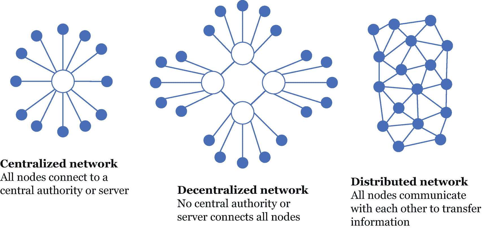

中心化、去中心化和分布式网络的示意图。中心化网络有一个中心服务器，呈圆形连接到多个节点。去中心化网络有 4 个相连的服务器，每个服务器连接多个节点。分布式网络由相互通信的互联节点组成。

**图 6-1** – 中心化、去中心化和分布式网络

区块链网络的去中心化特性意味着，有关数据的决策并非由单一实体做出，而是通过所有网络成员之间的共识达成。此外，*没有中央权威机构可以关闭此类网络*，因为交易是*无需许可*的。实际上，任何中央权威机构都无法设置准入门槛，因此任何人都可以加入系统，并与网络上的任何人进行交易，无需经历繁琐的审批流程。

成功的区块链包含一种经济保障，确保其能持续按预期运行。这种保障是通过依据博弈论原理精心设计的激励机制来确保的。换句话说，所有参与者按照系统规则行事符合自身利益，而偏离规则则代价高昂且毫无意义。

区块链的另一个关键特征是其所存储的数据是*不可篡改*的。数据一旦记录便无法更改。一旦交易被成功记录，所有选择充当完整区块链持有者的节点（计算机）都会保留该交易及其之前所有交易的记录。由于存在大量独立的副本，网络批准的交易是不可删除的。

大多数区块链（例如比特币区块链）都具有高度的*透明度*，但却是*假名的*。例如，比特币区块链不会透露比特币持有者的身份，但会公开其假名（钱包的数字地址）以及所有相关交易。这与匿名性不同，匿名性意味着没有任何假名能与某笔交易关联起来。^(⁶¹) 以比特币为例，任何人都可以在线查询某个假名所持数字钱包中的金额，以及其在对应区块链上发送或接收过的所有交易。

为了实现这些特性，区块链技术使用了密码学和共识机制。以下章节将分析这些概念。

### 区块的链条

顾名思义，区块链就是由*区块*组成的链条。每个区块都包含数据，例如用户交易、时间戳以及指向前一个区块的链接。

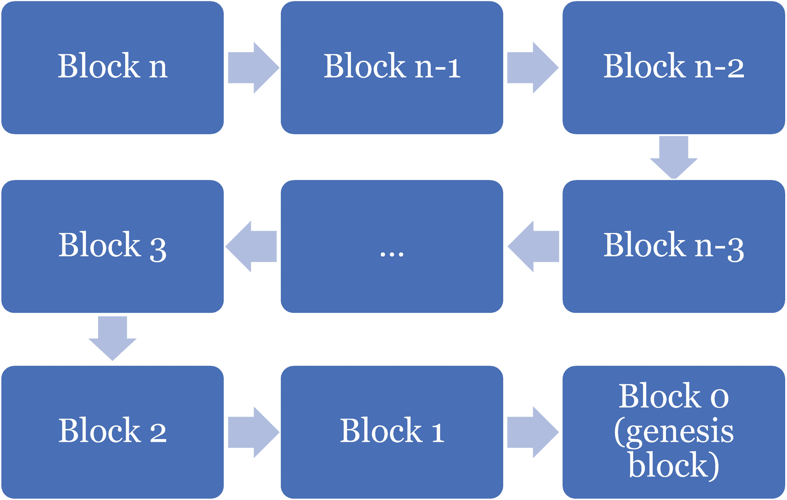

一个区块图具有以下流向：区块 `n`、区块 `n-1`、区块 `n-2`、区块 `n-2` 到区块 `3`、区块 `2`、区块 `1` 和创世区块 `0`。

**图 6-2** – 区块链是一个区块的链条，其中每个区块都包含该链条中前一个区块的密码学哈希

整个区块的内容都会进行密码学哈希处理，这意味着其内容会被总结，例如生成一个 64 字符的字符串。*哈希*可以被视为一组数字信息的指纹：它比原始信息小得多，但能唯一标识该信息。对区块进行哈希运算会为其赋予一个唯一的标签。改变区块中哪怕最微小的一点信息，都会使该区块的标签发生根本性改变。此外，由于区块内容中包含前一个区块的标签，因此在链条中更改任何前序区块的信息，都会根本性地改变所有后续区块的标签。

图 6-3 展示了在哈希函数的输入中改变极其微小的信息会如何产生截然不同的输出。此示例使用 `SHA-256`（SHA 代表安全哈希算法），即比特币区块链中用于对区块进行哈希运算的算法。

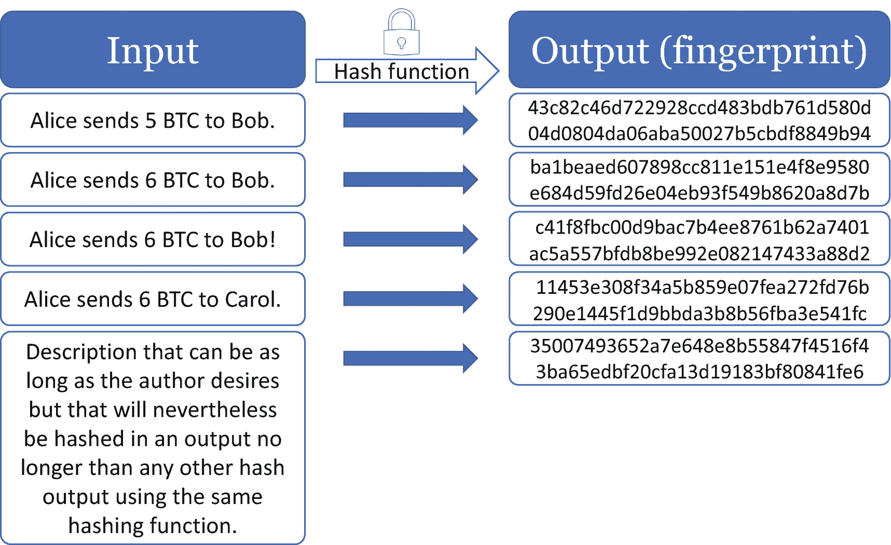

输入流程图包括“Alice 向 Bob 和 Carol 发送若干 BTC”，该输入通过哈希函数产生输出“指纹哈希码”。

**图 6-3** – SHA-256 哈希算法示例。改变输入中最微小的信息会产生截然不同的输出

该算法的一个特点是，无论输入的长度或内容如何，输出始终是 64 个字符长，并且看起来是随机的。此外，使用相同的输入总会产生相同的输出。然而，给定任何输出，几乎不可能反向推导出输入是什么。

我们可以将简单的哈希算法视为一种数学算法，比如“平方”函数。例如，对 `2` 或 `-2` 求平方会得到相同的输出 `4`，但给定输出 `4`，无法确定输入（在此例中，是 `2` 还是 `-2`）。然而，`SHA-256` 算法要复杂得多，因此，与这个涉及 `2` 和 `-2` 的简单例子不同，根据给定输出猜出输入几乎是不可能的。

### 非对称加密

*非对称加密*，也称为*公钥密码学*，可实现两个功能。首先，它允许消息的发送方对消息进行加密，使得只有拥有解密代码的特定人员才能解密。其次，它允许接收方确保消息来自发送方（即消息未被第三方篡改或伪造）。为了实现这一点，非对称加密使用两个密钥，每个密钥都是一系列看似随机的字符。第一个是私钥，仅由其持有者知晓。第二个是公钥，可以从私钥推断出来。这些密钥在数学上是相关的，因此公钥派生自私钥。然而，从公钥猜测私钥是不可能的。

非对称加密的第一个功能（加密消息）是通过使用接收方的公钥对原始消息进行编码来实现的——这是一种使原始消息不可读的代码。只有接收方可以解密消息，因为只有他拥有相应的私钥。你可以将此组合视为一把锁，只有公钥可以锁定，只有私钥可以解锁。

第二个功能（不可伪造的签名）使用公钥来确认消息的来源。由于公钥可以解密消息，这意味着相应的私钥对该消息进行了加密。只有真正的发送方知道私钥，因此没有其他人可能是该消息的发送方。

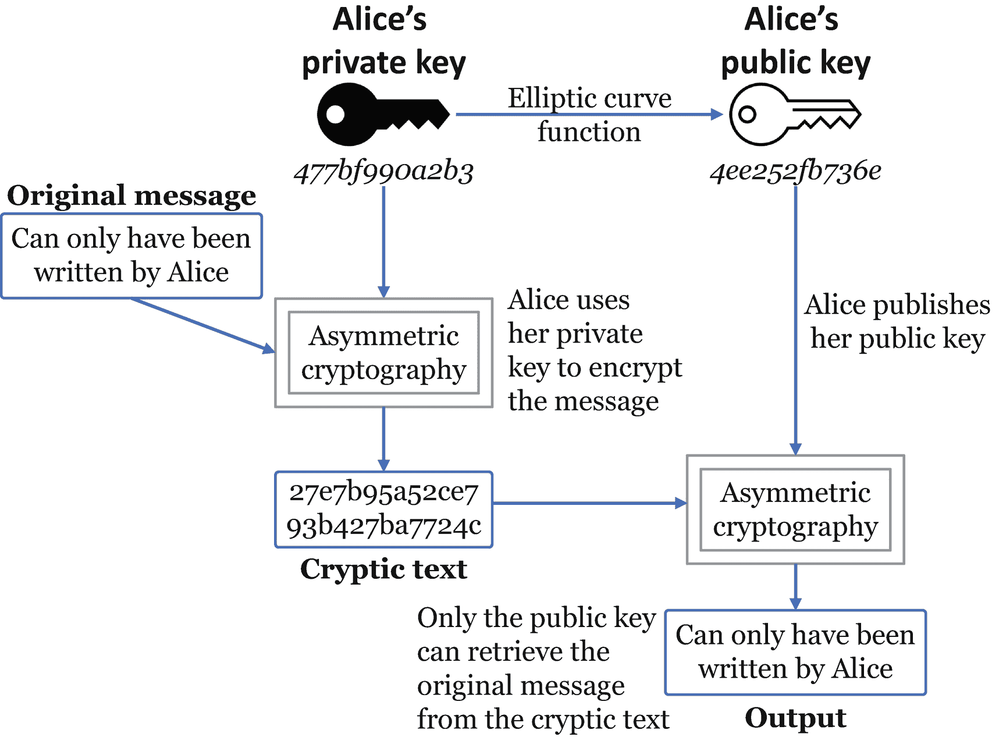

示意图展示了 Alice 通过椭圆曲线函数从私钥到公钥的过程。其中包括 Alice 编写的原始消息经过非对称加密后得到密文。Alice 发布她的公钥，用于输出解码后的消息。

**图 6-4**  
非对称加密中建立消息不可伪造来源的步骤示意图

非对称加密证明，持有与公钥对应的私钥的用户编写了加密消息。由于私钥是一个在 256 位上编码的字符串（针对比特币区块链），它提供了极高的唯一性。特别是，使用 256 位（由 1 和 0 组成），共有`2²⁵⁶`种可能性——大约相当于可观测宇宙中的原子数量。这使得独特且不可伪造的签名成为可能，从而使基于区块链的机制能够证明消息的来源。

### 更新去中心化账本

在一个不由中心化权威维护的账本中添加新条目，其工作方式与中心化模型截然不同。网络上维护共享账本的一组计算机必须就谁将构建新条目以及如何将该条目添加到共享账本达成一致。为了达成这种共识，存在不同的方法，称为*共识机制*，本章稍后将对此进行探讨。本节介绍了一系列无论采用何种共识机制都必须发生的高级步骤。但请注意，这些步骤并非必须严格按照此顺序执行。

首先，用户发起一笔交易。例如，Alice 用加密货币从 Bob 那里购买一辆汽车。为了支付，Alice 使用非对称加密向该加密货币的点对点网络发送一笔交易请求。

其次，网络上的一个或多个验证节点收集交易池中的待处理交易。其中一笔交易就是 Alice 请求的交易。

第三，一个验证节点创建一个区块，其中包含这些交易以及其他信息，例如区块版本、区块大小、时间戳以及区块链上前一个区块的哈希值。例如，该节点验证 Alice 是否持有执行该交易所需的足够数量的加密货币，并对收集的所有其他交易进行类似验证。

第四，根据共识机制的不同，验证者可能必须执行一些“工作量”或与其他验证者进行抽签竞争，并在区块中指明此信息。成功的验证者将生成的区块分发到网络上。

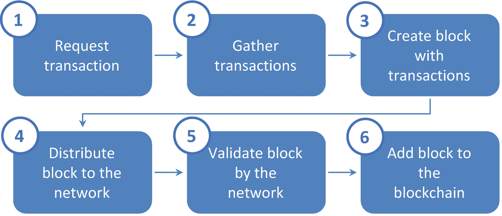

一个框图包含以下流程：请求交易、收集交易、使用交易创建区块、将区块分发到网络、由网络验证区块、将区块添加到区块链。

**图 6-5**  
更新区块链的关键步骤

第五，所有网络成员验证区块的有效性（即，它是否满足某些预定义的标准）。例如，他们验证该区块是否正确引用了区块链上的最后一个有效区块，区块大小是否在约定的范围内，以及验证者是否确实执行了其工作或赢得了抽签。

第六，所有网络成员将有效的区块添加到他们本地区块链的副本中。Alice 的交易变为有效，成功的验证者因其工作而获得奖励。

现在，这些信息在区块链上，透明且永久。换句话说，所有人都可以看到它，并且它永远不会被移除。

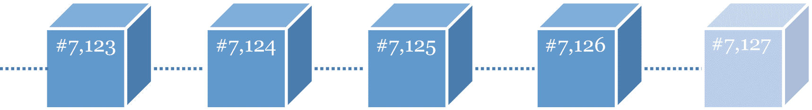

连接的三维区块示意图，编号为 7123、7124、7125、7126 和 7127。

**图 6-6**  
区块链的视觉表示，其中最后一个区块被追加到现有链上

### 共识机制

共识机制或共识协议是在去中心化系统中达成一致的方式。共识机制如同将军们（如第 5 章拜占庭将军示例中）就攻击时间达成一致一样。它确保所有参与者都知道其他各方同意，无论网络上是否存在不可信的节点。在区块链环境中，他们就最新的版本达成一致，包括谁拥有什么。这种一致称为*分布式共识*，对于确保网络一致性至关重要。

比特币的区块链使用*工作量证明*（PoW）共识机制。在加密资产的最初十年，它仍然是验证区块的最常用方法。然而，在此期间，出现了替代性共识机制来解决 PoW 的缺点。*权益证明*（PoS）共识协议也已确立并得到广泛应用。特别是，它在 2010 年代后半叶逐渐得到更多采纳。以太坊甚至在 2022 年 9 月从 PoW 转向了 PoS。此外，还存在数百种用于加密资产的其他机制。然而，并非所有共识机制都适用于所有类型的区块链。例如，像权威证明这样的机制更适合私有区块链（本章稍后会详细介绍）。相比之下，传统的 PoW 或 PoS 机制可能更适合用于作为货币的资产。

现在，让我们深入探讨与共识机制相关的区块链内部工作原理，从第一个区块链共识机制——工作量证明开始。

### 使用工作量证明更新去中心化账本

让我们重新审视一下更新去中心化账本的步骤（见图 6-5），并探究在工作量证明共识机制下会发生什么。

在第一步（发起交易请求）中，爱丽丝使用她的私钥对发送到网络的交易进行签名。她将公钥附加在消息中。这个过程利用非对称加密，以密码学方式证明爱丽丝是消息的真正作者。在交易信息中，任何人都可以看到爱丽丝的化名请求向鲍勃的公钥地址发送，比如说，一个比特币。

在第二步（收集交易）中，验证者从待处理交易池中收集交易。他们只选择有效的交易（即那些公钥能解密用发送者私钥加密的消息的交易）。验证者尽可能多地收集待处理交易，并尽可能选择价值高的交易，这符合他们的利益，因为他们会从每笔交易中抽取少量手续费——前提是他们成为该区块的成功验证者。

在第三步（创建区块）中，他们竞相成为第一个解决数学问题以验证区块的人。这是一个无实际用途的琐碎问题，涉及随机运行数十亿次哈希算法，直到偶然得到一个具有特定特征的输出。例如，哈希输出必须以特定数量的零开头。得到这样的输出需要时间和 CPU 算力（电力）。这些花费的时间和精力就是*工作量证明*中所谓的“工作量”。由于这个过程类似于矿工开采金矿，验证者通常被称为矿工。

在第四步（分发有效区块）中，成功的矿工将该区块广播到网络上，指明选定的交易以及能够产生符合所需特征输出的输入值。

在第五步（由网络验证区块）中，任何节点都可以测试提交的区块（即验证输出是否满足设定的特征）。与第三步相反，这个测试是瞬间完成的。实际上，有了正确的输入，验证输出是否符合所需特征是非常直接的。

在最后一步（将区块添加到区块链）中，所有节点都接受这个新区块作为链上的最新区块。作为区块的一部分，成功的矿工因解决问题而获得预定数量的比特币奖励。他还会收取交易手续费。这些奖励确保了在任何时候网络上都有足够的矿工，通过竞争来解决下一个区块。

#### 工作量证明下的区块结构

图 6-7 展示了在采用工作量证明的区块链上，一个区块是如何构成的。它由两部分组成：一个区块头和一个交易集。

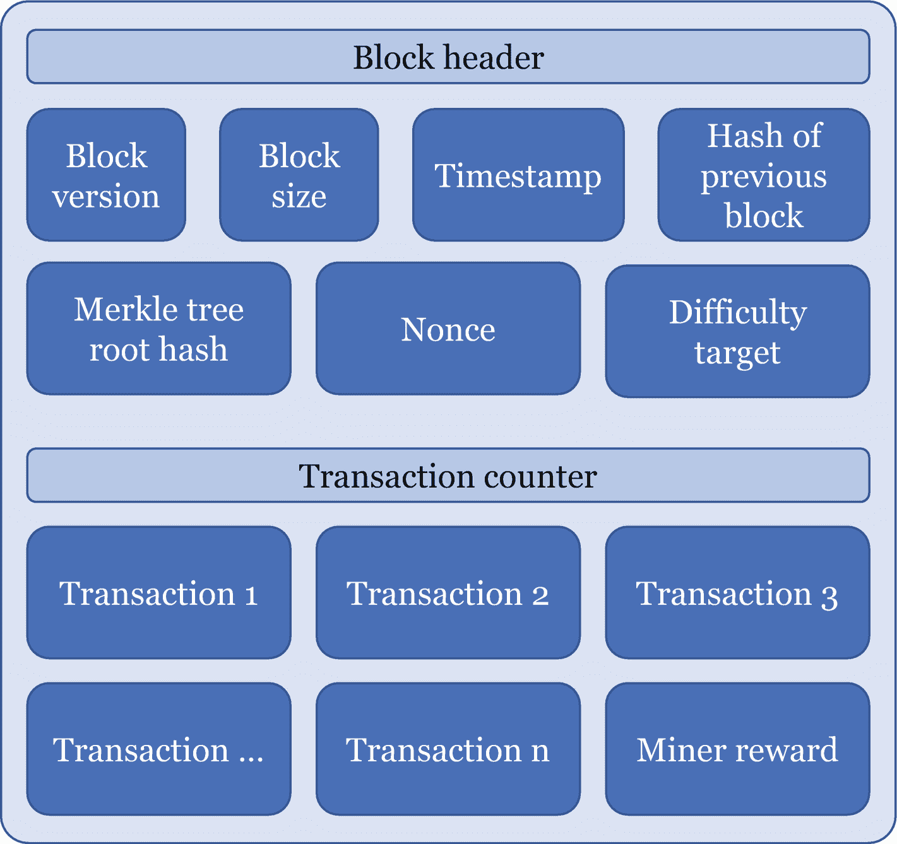

区块链的结构。顶部的区块头包括区块版本、区块大小、时间戳、前一个区块的哈希值、默克尔树根哈希值、随机数和难度目标。下面的交易计数器包含交易 1、2、3 到 n，以及矿工奖励。

*图 6-7 区块链上的区块结构*

作为区块头的一部分，*区块版本*、*区块大小*和*时间戳*是不言自明的元素，它们提供了当前区块的信息。*前一个区块的哈希值*使链能够以正确的顺序链接其区块，就像一本书的页码一样。*默克尔树*是一个区块中所有交易的数字指纹，可以快速验证一个区块是否包含某笔交易。每个区块的头部都包含一个该状态的哈希值，以便将其所有信息总结为仅 32 字节。*随机数*是矿工为使区块哈希产生特定输出而更改的一个数字。如图 6-3 所示，更改区块中的单个比特信息会产生完全不同的哈希输出。因此，矿工更改随机数并对生成的区块进行哈希运算，直到得到一个以特定数量零开头的区块哈希值。需要达到的零的个数由*难度目标*定义。试图解决区块的矿工越多（哈希率越高），难度目标就越高。对于比特币，这个目标被设定为使整个网络大约需要 10 分钟才能解决一个区块。每两周，比特币的难度目标会根据哈希率进行调整，以保持平均 10 分钟的出块时间。其他加密资产的出块间隔时间可能不同。^(⁶²)

交易计数器包含两部分内容。首先，它包含交易池中的交易（即用户提交以供记录的交易）。由于区块有最大容量限制，下一个区块的矿工并不会收集所有交易。矿工会尽可能多地收集交易，并优先选择金额最大的交易，因为有交易手续费。交易越多、金额越大，矿工获得的手续费就越高。

其次，在交易计数器中，还有矿工奖励。它包括区块奖励和交易手续费。比特币的区块奖励在推出时是每个区块 50 个比特币，之后每 210,000 个区块（大约每四年）区块奖励减半。截至 2023 年，比特币的区块奖励是每个区块 6.25 个比特币。交易手续费起初很小且微不足道。然而，现在比特币的价格达到数万美元，这些小额交易手续费已具有显著价值。最终，它们将取代区块奖励，以激励矿工继续挖矿。2023 年 5 月初（区块编号 788,695），比特币区块链上区块空间需求的激增，使得交易手续费自 2017 年以来首次超过了区块奖励。

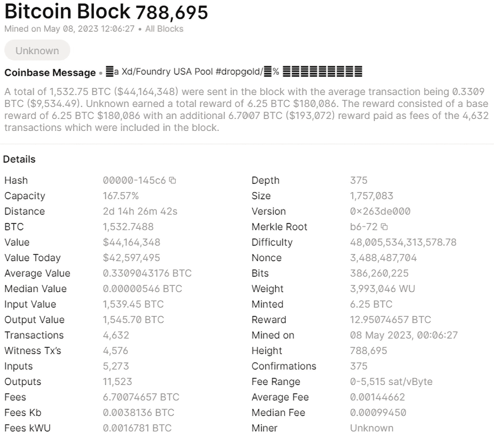

比特币区块 772,783 页面的截图。它包括开采日期以及币基消息和各种详细信息。这些详细信息包括哈希值、容量、距离、BTC、价值、平均价值、版本、默克尔根、难度、随机数、比特数和费用范围等。

*图 6-8 比特币区块 788,695 的详细信息，开采于 2023 年 5 月 8 日（来源：blockchain.com）*

### “最长”链永远是对的

在 PoW 机制下，当矿工完成一个区块的验证后，该区块会被添加到链上，并成为*候选区块*。由于区块链技术和 PoW 共识机制的去中心化特性，两个独立的矿工可能几乎同时挖出两个区块。这可能导致潜在的“平局”，因为网络无法确定哪个区块应成为区块链的一部分。

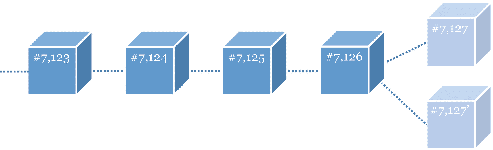

一个三维区块示意图，显示编号为 7123、7124、7125、7126 的区块连接到区块 7127 和 7127′。

**图 6-9** 挖矿平局：两个区块几乎同时被挖出，均为候选区块

PoW 为这一偶发问题提供了一种优雅的解决方案：网络接受需要最高工作量才能构建的区块链。实践中，被选中的链具有最高的“链工作量”（即构建该链预期所需的最多哈希次数）。网络上的矿工会选择这条链，并继续在该链最后一个区块之上进行挖矿。

一旦下一个（或接下来几个）区块被挖出，平局就被打破，最长的链成为唯一有效的链。那些不属于该链的候选区块将被废弃。

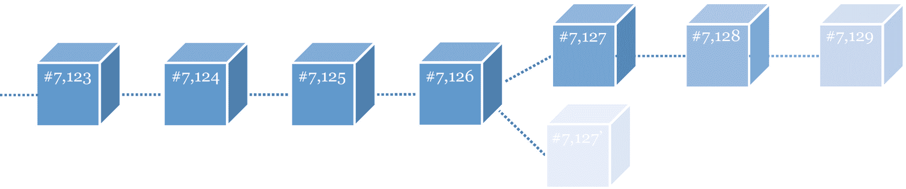

一个三维区块示意图，显示编号为 7123、7124、7125、7126 的区块连接到区块 7127、7128 以及顶部废弃的区块 7129，底部是废弃的区块 7127′。

**图 6-10** 一旦在其中一个候选区块之上挖出更多区块，挖矿平局即被打破。被废弃的区块（来自未被选中的链）是一个孤块

通过这一机制，所有用户无需争论或相互协商，就能就使用哪条链达成一致。

这意味着挖出一个区块并不一定意味着所有交易都已最终确定，因为它可能变成孤块。相反，只有当该交易所在区块之上又挖出了几个区块后，该交易才会被永久确认。以比特币为例，区块间隔为 10 分钟，大约需要 30 到 40 分钟（三个或四个区块）才能确保交易被永久记录在账本中。这也是比特币被批评不适合作为交换媒介的原因之一（你不会愿意等 30 分钟才付完咖啡钱走人），而更被视为一种价值储存手段。然而，即使这样的交易确认“漫长”时间，也远快于现有的支付方式——银行间转账通常需要数天才能结算（支付在几秒内完成清算，但结算需要数天）。此外，自 2017 年以来，出现了像闪电网络这样的“二层”支付协议，绕过了这一问题，实现了比特币小额交易的近乎即时结算。

例如，一个不诚实的节点可能会试图篡改链上的一个过往区块以进行双花。然而，更改前序区块中的任何信息都会改变所有后续区块的哈希值。因此，该不诚实节点需要解决所有后续区块的工作量证明问题。该节点必须持续这样做，直到其链成为最长，而“真正”的链仍在并行延伸。只要它并非网络上的最长链，其他节点就不会认为这条替代链有效，也不会在其上构建或接受其代币。因此，要成功攻击该链，需要的算力必须超过网络上所有其他节点的总和。对于比特币区块链而言，这几乎是不可能完成的任务。

### 软件更新与分叉

随着区块链的发展，可能需要对其核心特性进行更改，以保持对网络需求的适应性。此类更改可能包括不同的共识机制、区块间隔时间、区块大小等。然而，对区块链进行更改并非易事，因为需要网络中大部分验证者批准并采纳所提议的新规则。为此，验证者可以自由下载最新版本的验证软件，并基于新规则开始验证区块。或者，他们也可以选择不采纳最新版本，继续按照旧规则进行验证。

这种自由选择可能导致区块链出现两个版本：一个遵循新规则，另一个遵循旧规则。在这种情况下，区块链就会发生分叉。此类分叉可以是*软分叉*或*硬分叉*。

当新规则仍然兼容旧规则但变得更严格时，就会发生区块链的软分叉。使用新规则的验证者挖出的区块，同样会被使用旧规则的验证者接受。但反之则不成立。更新了软件的验证者不会接受所有按照旧规则新挖出的区块。例如，假设一项更改将区块的最大容量从 2MB 降低到 1MB。这样的更改仍然兼容较宽松的规则（即最大 1MB 的区块也小于 2MB）。然而，如果使用旧软件的矿工挖出了一个 1.6MB 的区块，所有使用更新软件的验证者都会认为该区块无效。使用更新软件的验证者将基于仅包含符合新规则区块的区块链版本进行挖矿。因此，软分叉是向后兼容的。软分叉后，只会保留一个区块链版本。只有新规则创建了最长链，它们才会成为标准。换句话说，必须有超过一半的矿工（以哈希算力计）接受新规则，它们才能生效。

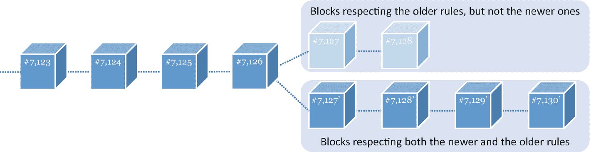

一个三维区块示意图，显示编号为 7123、7124、7125、7126 的区块连接到顶部废弃区块 7127 和 7128（它们遵循旧规则但不符新规则），以及底部区块 7127′、7128′、7129′和 7130′（它们同时兼容新旧规则）。

**图 6-11** 软分叉：新区块向后兼容，但只有在更严格的规则下挖出的新区块才能被使用新软件的验证者接受。如果大多数验证者更新了软件，“新规则”区块链会成为最长链。另一条链被废弃，因此只剩一条链

另一方面，硬分叉则不具有向后兼容性。例如，它可能涉及增加区块大小或改变共识机制。此类分叉具有争议性，因为它们最终会导致两条不兼容的区块链并行运行，每条链都有自己独特的规则。

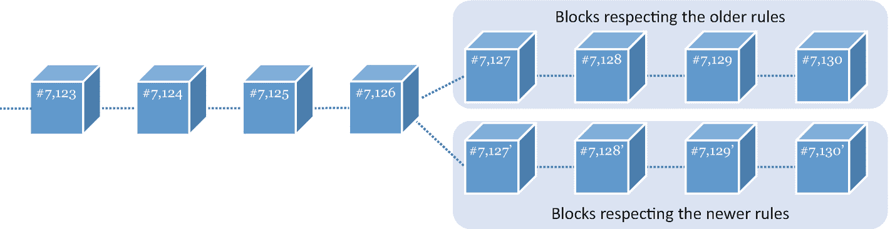

一个三维区块示意图，显示编号为 7123、7124、7125、7126 的区块连接到顶部区块 7127、7128、7129 和 7130（它们遵循旧规则），以及底部区块 7127′、7128′、7129′和 7130′（它们遵循新规则）。

**图 6-12** 硬分叉：新区块不向后兼容。两条链并行存在，各有其独特的规则和验证者

分叉是重大事件，对于最成熟的加密资产来说也属罕见。然而，它们同样存在风险，因为规则的改变可能会让黑客有机会利用新代码中未发现的漏洞。因此，分叉通常在`testnet`（测试网）上进行测试——这是一个与主区块链并行运行的模拟版本。

#### 主要分叉与区块链概念

不过，历史上确实发生过重大分叉。例如，2017 年中期，一些矿工认为区块大小是限制比特币可扩展性的因素之一。他们建议将区块大小从 1MB 增加到 8MB，从而从比特币区块链进行硬分叉，创建了比特币现金。2017 年 8 月 1 日，在区块高度 478,558 持有比特币（`BTC`）的用户有权获得与其比特币持有量等额的比特币现金（`BCH`）。结果，比特币和比特币现金的区块链并行运行，定价不同，有时甚至被视为不同的工具。例如，比特币可被视为价值储存手段，而比特币现金则被视为支付媒介。

一个臭名昭著的硬分叉案例与 2016 年的 The DAO 灾难有关，该事件也被称为“DAO 灾难”。[25] The DAO^(⁶³)，即去中心化自治组织，是一个由投资者指导的开源数字风险投资基金。用户发送以太币以从 The DAO 获取代币，从而获得投票权。随后他们可以投票决定 The DAO 投资哪家初创公司。2016 年 6 月，The DAO 代码中的一个漏洞使用户能够将 5000 万美元（占 The DAO 全部资金的三分之一）重定向到一个私人账户。当时，这占所有现存以太币的 14%。这一事件导致了极具争议的以太坊硬分叉：以太坊（`ETH`）将资金恢复到黑客攻击前的状态，而以太坊经典（`ETC`）则继续像之前一样运行。`ETC`的支持者倡导去中心化账本技术背后的一个信条：“代码即法律”。在他们看来，纠正过去的事件会证明网络缺乏去中心化。

以太坊的联合创始人兼首席开发者维塔利克·布特林认为，由于以太坊仍处于早期阶段（成立的第一年）且仍在开发中，这种特殊的修正不会损害以太坊价值观的完整性。至于`BTC`和`BCH`，`ETH`和`ETC`并行运行，估值差异巨大。

### 公有链与私有链及混合链

区块链因是公有链还是私有链而有所不同。公有链以去中心化的方式随时对任何人开放。相比之下，（完全）私有链仅是部分去中心化的，并限于单一组织使用。

本书中提到的大多数加密资产都基于公有链。然而，在某些情况下，私有链可能更合适。与公有链相比，私有链提供更高的交易速度、更低的交易成本和更高的效率。因此，它们可以成为私营公司管理内部数据流、替代传统数据库的首选方案。

私有链与传统数据库有何区别？从技术上讲，传统数据库使用集中式的客户端-服务器模型。相比之下，私有链是部分去中心化的，使用基于密码学的点对点模型。因此，私有链比传统数据库提供更高的数据完整性，但比传统模型更慢且成本更高。

在 2010 年代中期，这些概念进一步发展，催生了混合区块链，也称为联盟链，它融合了公有链和私有链。在联盟区块链中，一组预先定义的节点控制着区块链。例如，十几家金融机构可以组成一个联盟，约定必须获得三分之二的节点同意才能挖出下一个区块。因此，这种模型既非公有链，也非完全私有链。另一种混合方案是使用能与公有链互操作的私有链。

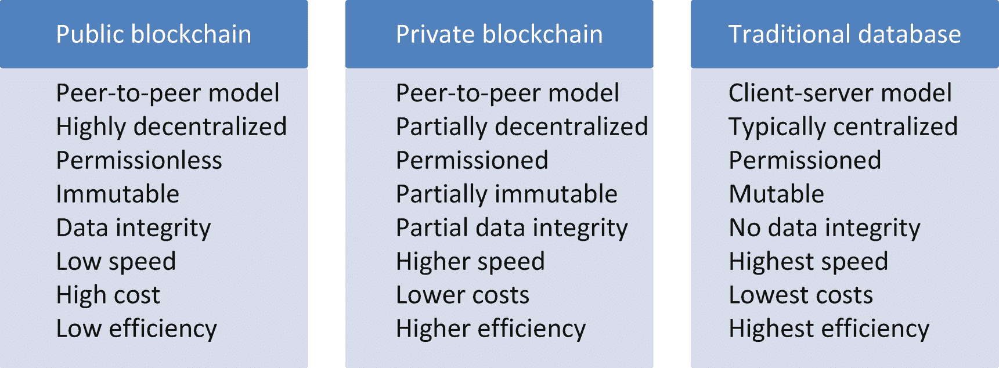

图表包含 3 列特性。公有区块链包括点对点模型和高度去中心化等特点。私有不包括点对点模型和部分去中心化等特点。传统不包括客户端服务器模型和通常集中化等特点。

**图 6-13** 公有链、私有链和传统数据库关键特性对比

### 区块链会取代所有数据库吗？

简短的答案是不会。手里拿着锤子，看什么都像钉子。区块链是一个相对较新的工具（一把锤子），在某些特定情况下很有用，但并非用来取代所有其他工具。并非所有数据库都是钉子。绝大多数数据库不需要去中心化。而且，如果需要不可篡改性，一些中心化数据库系统也能以比区块链解决方案更低的成本提供。图 6-14 以简化方式总结了何时区块链是管理数据流的首选方案。

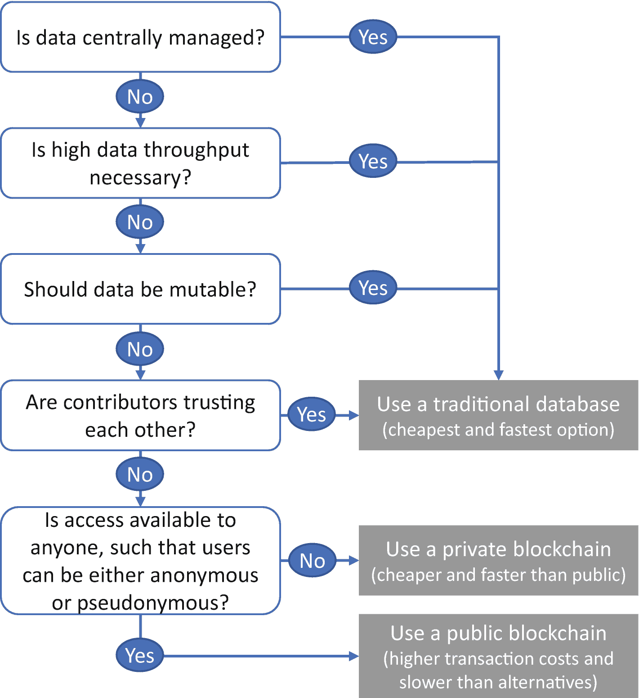

一个流程图，包含诸如：数据是否集中管理？是否需要高数据吞吐量？数据是否应可变？贡献者是否相互信任？以及是否任何人都可以访问？等问题。回答“是”则导向使用传统数据库。最后一个问题回答“是”则导向公有链，回答“否”则导向私有链。

**图 6-14** 基于数据特征的数据库选择

尽管如此，在某些情况下，区块链具有变革性。货币是一个直接的例子，但这场革命已扩展到保险、身份管理、音乐、艺术、供应链以及无数其他行业。

### 在权益证明下更新账本

在 2010 年代中期，为改进原有机制，人们开发了`PoW`的替代方案——权益证明（`PoS`）。它尤其解决了成千上万的矿工竞相解决同一问题所隐含的高能耗问题。实际上，与`PoW`的一个关键区别在于，`PoS`验证者是在付出努力之前就被选定的，而非进行赢家通吃的挖矿竞赛来确定下一个区块。这种选择基于节点在系统中的“权益”（即，节点持有的系统原生加密资产数量）。简单来说，如果一个节点持有`PoS`加密资产现有供应量的 2%，那么该节点有 2%的概率被选为下一个区块的提议者。与`PoW`不同，它不需要数十亿次哈希运算。因此，其工作量相对非常小。

一旦区块被提议，一个基于网络成员权益的委员会将评估该区块是否有效。成员可以批准或拒绝该区块。如果该区块获得多数（通常是三分之二）批准，它就会被添加到区块链上。`PoS`的主要缺点是富有的节点更有可能成为验证者，这容易导致网络决策权集中化。此外，任何这种中心化倾向对区块链来说都是大问题，因为其主要目的是为传统的中心化模型提供去中心化的替代方案。

`PoS`和`PoW`有着根本性的不同。前者通过内部机制（其代码中的经济激励）来保证安全，而后者则通过外部机制（矿工的数量和去中心化程度）来保证安全。两者没有优劣之分，就像没有适用于所有目的的“最佳”汽车一样；某些汽车在特定情境下或为了特定目标表现更好。

截至 2023 年，`PoS`类机制正成为公有链的主流共识协议，但最重要的例外是比特币。

### 替代共识机制

工作量证明（PoW）和权益证明（PoS）是最成熟的共识机制，但并非唯一。目前存在数百种替代方案，它们通过不同的权衡组合，在某些场景下适用，而在另一些场景下则不适用[26]。

例如，一个关键的权衡是“可扩展性三难困境”。具体而言，共识机制只能完美具备以下三个特性中的两个，而第三个特性则难以兼顾。

1.  安全性
2.  去中心化
3.  可扩展性

举例来说，一种共识机制可以创建出安全且可扩展的区块链，但可能是部分中心化的。同样，它也可以是可扩展且去中心化的，但网络安全级别较低。最后，它还可以是安全且去中心化的，但面临可扩展性挑战。

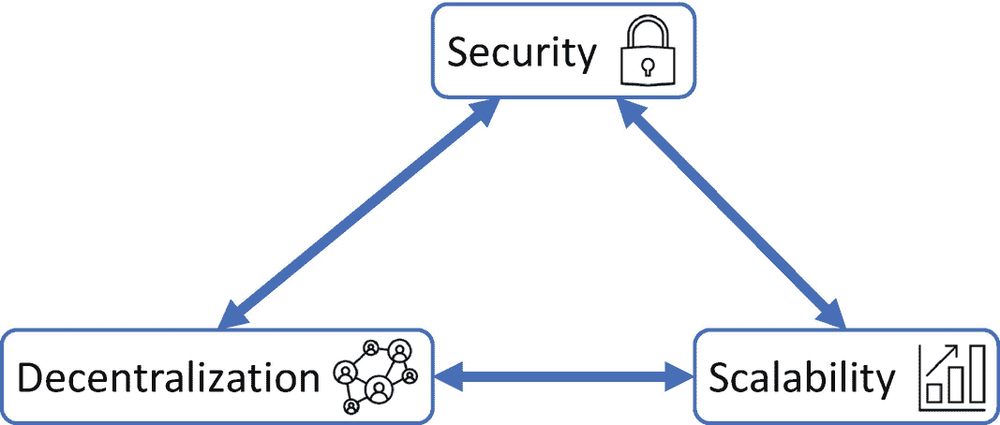

一个关于安全性、去中心化和可扩展性模块的双向流程图。

**图 6-15** 可扩展性三难困境。一个共识机制只能完美满足这三个属性中的两个

安全性的缺失会使网络更容易受到恶意攻击。去中心化的缺失会降低网络对单个节点故障的容忍度。最后，可扩展性的缺失会限制网络处理高吞吐量的能力。例如，比特币区块链以其高度的去中心化和卓越的安全性而闻名，但其内在的可扩展性能力有限。在 2010 年代后半期，当比特币的未来面临抉择时，这个问题引发了激烈的争论。然而，现在已有解决比特币这一问题的方案。例如，闪电网络允许小额交易在链下结算，只需偶尔在比特币区块链上发布。

为了有效评估与加密资产相关的风险，理解其共识机制至关重要。本节介绍一些常见的共识机制，以展示为维护区块链完整性而可制定的各类规则和协议。请注意，图 6-16 远非详尽列表。

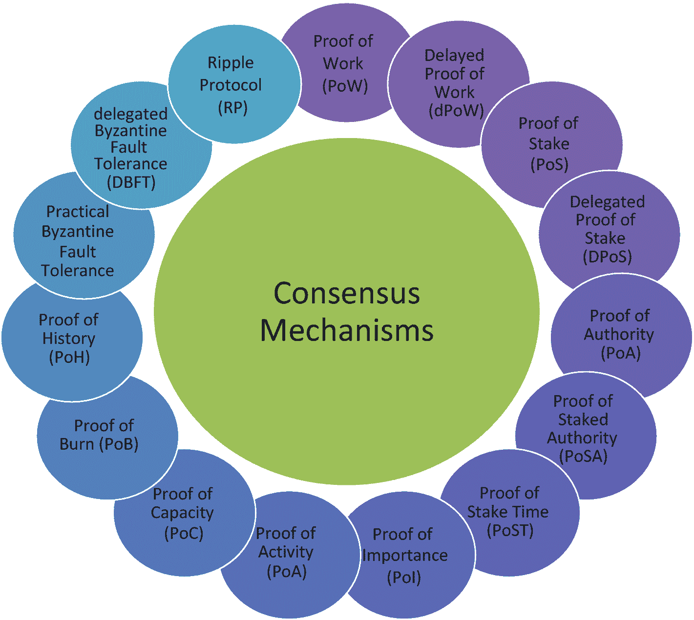

一个共识机制的圆形图，包括工作量证明、权益证明、权威证明、权益权威证明、权益时间证明、重要性证明、活动证明、容量证明、燃烧证明和历史证明，延时工作量证明、委托权益证明、实用拜占庭容错及其委托版本，以及瑞波协议。

**图 6-16** 部分常见共识机制概览（此外还有数十种）

总体而言，共识机制分为两大类别：基于证明的协议和基于投票的协议[27]。基于证明的共识机制包括工作量证明（PoW）、延时工作量证明（dPoW）、重要性证明（PoI）、容量证明（PoC）和燃烧证明（PoB）。相比之下，基于投票的共识机制则包括权益证明（PoS）、委托权益证明（DPoS）、权威证明（PoA）、权益时间证明（PoST）、实用拜占庭容错（PBFT）、委托拜占庭容错（DBFT）以及瑞波协议（RP）。

此外，共识协议使用不同的方法来选择区块验证者。总体而言，可以归纳出四种通用方法。

1.  基于工作量（“工作”）
2.  基于财富或资源
3.  基于声誉或过往行为
4.  基于委托

很难说哪一种方法绝对优于另一种。然而，某些方法可能更适合特定的用例。评估一个共识机制是否合适，可以基于其在以下四个基本属性上的表现。

1.  吞吐量
2.  安全性
3.  可扩展性
4.  最终性

以下描述了一些现有共识机制的高级功能。

-   **延时工作量证明（dPoW）** 使用两条并行链，通过辅助链提供的安全性，使其能够安全地在主链上追加区块。通常，它使用比特币区块链（最安全的区块链）作为辅助链来保护主区块链。安全性来源于主区块链定期将其状态的哈希值发布到并行区块链上。通过这种方式，它利用了并行区块链的高算力。与 `PoW` 的一个关键区别在于，在主链上追加新区块的节点是选举产生的。`dPoW` 的一个好处是减少了传统 `PoW` 挖矿的能源消耗。

-   **委托权益证明（DPoS）** 是基于投票的，类似于 `PoS`。它由所有网络成员（加密资产持有者）选举代表来代表他们行事。这些代表称为见证人或区块生产者（BP），他们负责验证交易和区块，并因此获得服务奖励。作为避免欺诈或合谋的激励措施，BP 可能会被投票罢免，在这种情况下，他们的权益将被冻结。`DPoS` 的支持者声称这是一种更民主的机制，因为区块验证者是依据其作为公平质押者的声誉而非纯粹财富来投票选出的。这种共识机制还具有比 `PoS` 更高的吞吐量优势，但往往更加中心化。包括 Cardano、TRON 和 EOS 在内的区块链都使用 `DPoS`。

-   **权威证明（PoA）** 也是 `PoS` 的一种变体，其中特定的可信节点充当区块验证者。可信节点（权威）会随着时间的推移积累声誉，这与其质押的权益无关。他们甚至根本不需要质押任何东西。这种共识机制是高度中心化的，因为少数参与者完全控制着网络，但它具有高吞吐量和低费用的优势。它适用于不需要去中心化的区块链，例如私有区块链。

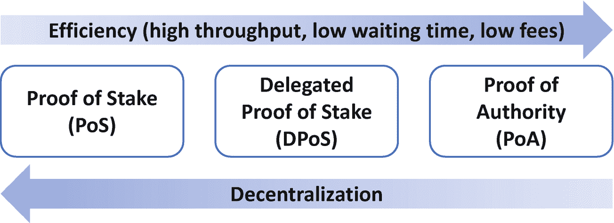

一个关于权益证明、委托权益证明和权威证明的框图。顶部从左到右的箭头标注为“效率从最低到最高”，底部的箭头从右到左，标注为“去中心化”。效率包括高吞吐量、低等待时间和低费用。

**图 6-17** PoS 及其部分变体之间的权衡。在三种机制中，PoA 效率最高，而 PoS 去中心化程度最高

-   **权益权威证明（PoSA）** 是 `PoS` 和 `PoA` 的混合体，因被币安智能链（BSC）——最成熟的区块链之一——用作共识机制而闻名。与 `PoW` 或 `PoS` 等共识机制的一个关键区别在于验证者数量较少。以 `BSC` 为例，验证者数量限制为 21 个。另一个关键区别是，`PoSA` 中验证者的激励完全来自交易费用，而非新铸造代币的奖励。这些特性使得 `PoSA` 相比 `PoW` 或 `PoS` 能够拥有更低的成本和更短的出块时间。

-   **权益时间证明（PoST）** 也是在 `PoS` 的基础上增加了时间因素。持有权益的时间越长，其价值就越高。还可以进行调整，例如使权益时间取决于用户的活跃程度（例如，在 Vericoin 中实现的一个功能）：不活跃用户的权益会随时间减少。

-   **重要性证明（PoI）** 是另一种源自 `PoS` 的基于投票的共识机制。其主要区别在于，要获得作为验证节点的权限，必须至少拥有最低数量的加密资产。低于该阈值的任何节点的重要性都为零。超过阈值后，与 `PoS` 一样，质押的金额越高，被选为验证节点的可能性就越大。

*   `活动证明（PoA）`^(⁶⁴)结合了最成熟的共识机制，即 PoW 和 PoS。它据称通过以 PoW 开始但在过程中后期更接近 PoS 的方式，融合了两者的优势。具体来说，一旦新区块被挖出，机制就会切换到 PoS，根据验证者拥有的代币数量随机选择他们。该机制的缺点是能耗仍然很高（PoW 的主要缺点），并且在验证区块时仍然倾向于代币囤积者（PoS 的主要缺点）。

*   `容量证明（PoC）`不再使用矿工的权益（如 PoS）或计算能力（如 PoW）来验证交易。相反，它利用矿工硬盘上的可用空间来存储针对某一计算挑战的可能解决方案列表。用于此活动的硬盘空间越大，可能解决方案的列表就越长，矿工被选中验证下一个区块的可能性也就越高。与 PoW 或 PoS 相比，其主要优势在于效率更高。

*   `燃烧证明（PoB）`包括燃烧代币，以根据燃烧的代币比例获得在链上写入区块的权利。矿工将代币（可以是区块链的原生代币或其他币，如比特币或以太币）发送到一个不可花费的地址，以获得该链原生代币的奖励。

*   `历史证明（PoH）`是一系列证明两个事件之间时间的加密计算，也被称为加密时钟。它使用高频可验证延迟函数生成一系列交易哈希（每个哈希都将前一个哈希作为其输入之一），从而使得交易顺序易于验证。证明事件顺序是 PoH 确保区块链完整性的关键。这样，节点无需等待其他节点的反馈即可验证链。PoH 为区块链提供了高速度，同时保持其网络安全和去中心化。它尤其被用于 Solana 区块链，该链每 400 毫秒就发布一个新区块。

*   `实用拜占庭容错（PBFT）`是一种在节点间复制区块的共识机制。由其他节点选出的主节点向网络其余部分提出一组交易。其他节点执行这些交易，并广播结果区块的哈希码。如果收到的哈希码中至少三分之二与原始哈希码相符，则区块被视为有效并被追加到所有本地区块链副本中。这种共识机制具有极高的吞吐量和可忽略不计的等待时间。然而，所需计算量很大，并且 PBFT 只能容忍网络中最多三分之一的节点出现故障（相比之下，PoW 可以容忍多达一半的网络故障）。

*   `委托拜占庭容错（DBFT）`是一种协议，其中所有成员无论财富多少都拥有一票投票权。换句话说，它类似于一个国家如何选举总统。通过投票，成员选举出代表（“记账节点”）。在代表中，随机选择一位来提议新区块，该区块需要由其他代表验证。如果至少三分之一的代表不同意该提议，则选择另一位代表来提议区块。与 PBFT 相似，三分之一的节点可能导致流程停滞。然而，在 DBFT 中，所需计算量要小得多。

*   `瑞波协议（RP）`或 XRP 账本共识机制（也称为*正确性证明*）由一组代表网络行事的当选验证者（“唯一节点列表”）组成。它们遵循一个迭代过程，可以添加或删除新交易，直到与足够多的其他验证者达成一致。该过程必须得到至少 80%验证者的同意才能继续。否则，区块链的状态保持不变。一个主要缺点是，只需 20%+1 的验证者出现故障，整个流程就会停滞。

还有许多其他共识机制存在并正在开发中。感兴趣的读者可以进一步了解存储证明、存款证明（PoD）、权重证明、声誉证明、空间证明、权益速度证明、身份证明、存在性证明、可检索性证明、可信度证明以及联邦拜占庭协议等。

### 去中心化数据 vs. 去中心化交易

区块链是一个去中心化的交易数据库。然而，它并不保存交易所指的底层数据。当底层数据不过是交易本身时（如比特币），这种区别无关紧要。在这种情况下，一切都在区块链上。但是，当涉及大型特定数据集（例如，一首数字歌曲）时，区块链通常不保存数据集（歌曲）本身；相反，它只保存与数据集相关的交易。

在这种情况下，区块链必须链接到一个数据库。数据库可以是中心化的（这种情况下使用区块链的意义不大），也可以是去中心化的。维护底层数据的一种去中心化选择是 IPFS：星际文件系统。IPFS 与区块链配合良好，因为数据交易和底层数据库都是去中心化的。IPFS 于 2016 年推出，就像是区块链的硬盘。它不仅存储数据，还存储网站、应用程序等，以及这些数据随时间变化的版本。

由于区块链的副本存在于许多计算机上，在区块链本身中存储大量信息将是低效的。这会不必要地浪费区块链网络上的存储空间。相反，存储在 IPFS 服务器上的数据的加密哈希减轻了区块链的负担并提高了其效率。

### 为什么区块链与众不同？

首先，区块链与传统账本的不同之处在于，它实现了信息的*无需信任*（trustless）交换。这并非指系统中或交易对手之间不存在信任，而是说信任这个要素变得无关紧要。更具体地说，无需信任任何其他方；只需信任网络的持续性。

支付网络是众多可能例子中的一个，但它很容易理解，因为它是区块链的第一个应用。在传统支付系统中，需要信任多个中介机构。当爱丽丝向鲍勃汇款时，双方都必须信任各自的商业银行、实现转账的网络（例如 SWIFT 网络）以及该国的中央银行。当支付涉及跨国时，中介机构的数量会进一步增加。相比之下，区块链不依赖任何中央权威机构，从而消除了这些多余的步骤和对任何第三方的信任需求。

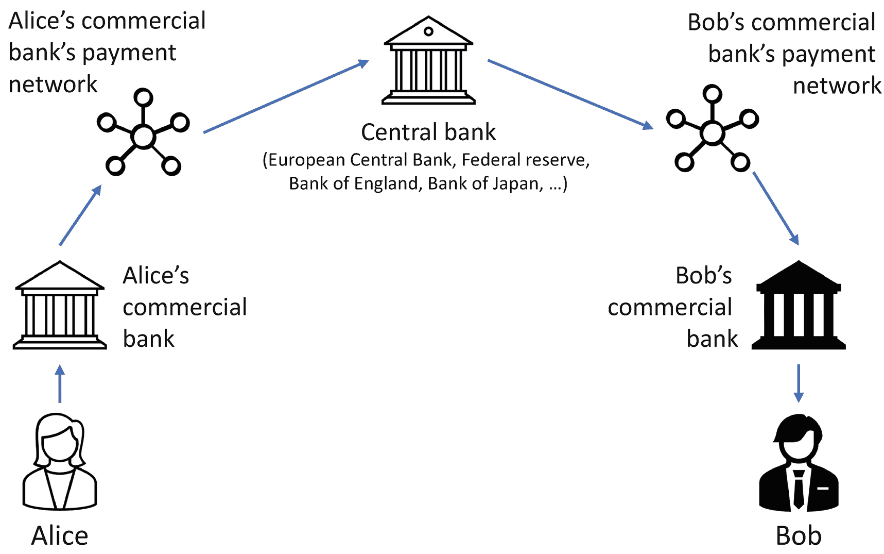

一个说明性的流程图。爱丽丝、爱丽丝的商业银行、爱丽丝商业银行的支付网络、中央银行、鲍勃商业银行的支付网络、鲍勃的商业银行以及鲍勃。

图 6-18

传统支付流程。一笔从爱丽丝到鲍勃的汇款需要多个中介机构

在区块链的情况下，信任仅被置于加密算法之上，而该算法是开源的，所有人都可以看到。

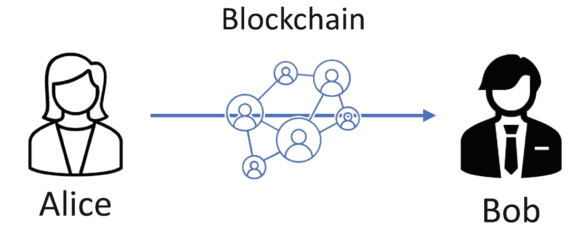

一个流程图，显示爱丽丝通过区块链向鲍勃进行支付。

图 6-19

基于区块链的支付流程。一笔从爱丽丝到鲍勃的汇款不需要任何中介机构

此外，区块链交易可以在白天或晚上的任何时间即时结算，无论是否公共假日。相比之下，传统的资金转账要慢得多。当你在超市柜台刷卡购买食品杂货时，即使交易在几秒钟内被清算，也需要几天才能完成结算。对于国际汇款，则可能需要数周时间。

与传统账本系统的另一个区别在于，由于所有发生过的交易都是透明且易于检索的，区块链促进了对任何交易或账户的*可审计性*（auditability）。因此，审计不再是在财务账簿结账后一年才进行的、基于样本的、耗时且昂贵的过程。相反，它变成了一个详尽且持续的过程，因为网络会即时验证每一笔交易。

因此，区块链的真正价值不仅仅是在账本中组织数据的一种新奇方式。区块链之所以与众不同，是因为它消除了交易中的信任成本。它消除了与未知第三方（如银行）共享数据所带来的摩擦。此外，它将交易结算的等待时间从几天缩短到几分钟。它还减少了直接成本（例如交易手续费）和间接成本（会计、审计和问题处理成本）。通过消除这些摩擦，区块链可以刺激商业活动并促进更大的经济发展，特别是对于那些有需求的人，例如目前*无银行账户*的 20 亿人口 [28]。

#### 关键概念

区块链作为分布式账本技术的一部分，是为了让比特币能够运行而开发的。它是一个具有去中心化、不可篡改和假名化等特殊特性的数据库。特别是，它使得无需信任第三方即可实现数字信息所有权的转移。通过消除信任成本，区块链能够以更低的成本实现更高的经济活动。

它使用密码学和共识机制来确保数据一致性，尽管其具有去中心化的性质。存在不同的共识协议，各有其优缺点，这使得它们在有些情况下（例如用于私有区块链或公有区块链）更为合适，而在其他情况下则不然。

区块链是一个强大的新工具，但它不会取代所有的数据库。实际上，大多数数据库既不需要去中心化，也不需要不可篡改。

## 扩展问题

假设你拥有十个比特币——每个价值$50,000——此时发生了一次硬分叉。一半的矿工继续挖掘分叉的一个分支，另一半挖掘另一个分支。在分叉后的一个区块，你的投资组合价值是多少？

为什么货币是区块链的第一个用例？

你如何逃脱可扩展性三难困境？

如果你要创建一种旨在用作货币的加密资产，哪种（现有的或非现有的）共识机制最合适？

脚注 1 2 3 4 5 6

