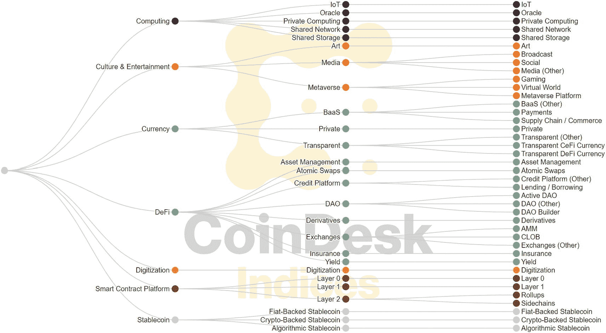
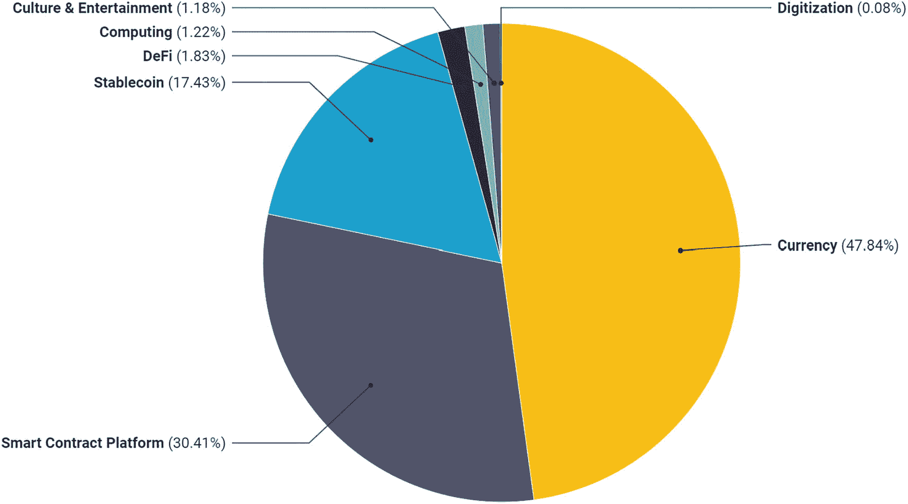
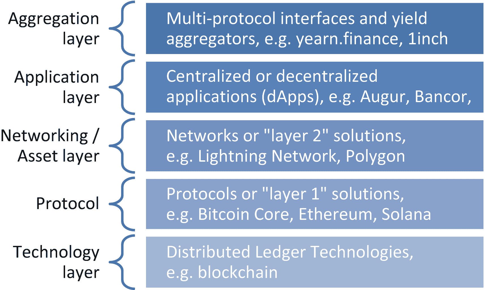

# 7. 加密资产分类法

> *这个世界上所有的分类都缺乏明确的界限，所有的转变都是渐进的。*
> 
> —亚历山大·索尔仁尼琴

请注意本书反复使用“*加密资产*”（cryptoasset）一词，而非更常见的术语“加密货币”。这种区分是有意为之，因为加密资产涵盖的资产远多于那些仅旨在作为货币的资产。

正式地讲，加密资产是在公共账本上通过密码学保护，并在去中心化的点对点网络上创建、管理和交换的数字资产。相比之下，加密货币是加密资产的一个子类别。在传统金融中，货币、股票、债券、大宗商品、房地产和收藏品等都属于资产。类似地，在加密世界中，加密资产也被分为多个类别。

对加密资产进行分类对于准确评估其价值至关重要。确实，可能的分类方式可以告知立法者未来将如何监管和对加密资产征税。反过来，监管和税收规则又会影响这些资产的增长潜力和风险状况。本章旨在为可能的加密资产分类法提供一些清晰的见解。

## 建立加密资产分类法面临的挑战

在理想世界中，加密资产分类法应具有互斥性（一个资产只属于一个类别）、完全穷尽性（所有资产都有其适合的类别）和不变性（分类法不随时间改变）的类别。然而，这样的分类法是不可能的，因为加密资产子类别之间的界限是模糊且快速变化的，新的用例不断涌现。因此，更现实的加密资产分类法应不断更新以反映市场发展。

以隐私币为例，说明分类法的演变。隐私币曾经是一个有用的类别，但现在许多代币在其架构中都使用了隐私元素。因此，隐私从某些加密资产的核心功能演变为仅仅是一个可以具备的属性。现在有许多种可能的方式来实现隐私，以及不同级别的隐私。

对加密资产进行分类的另一个挑战是划分标准。例如，如果试图对运动类型进行分类，人们可能会考虑是根据团队运动与个人运动，还是基于球的运动与其他运动来进行划分。对于运动，就像对加密资产一样，有多种方式可以开始构建分类法。以下各节将介绍一些可能的此类方式。

## 按形式与功能划分的加密资产分类法

在 2017 年畅销书《加密资产》中，克里斯·伯尼斯克和杰克·塔塔尔将加密资产分为三类 [29]。

- **加密货币** 是通过密码学保护的数字货币，可在网络上进行交换。
- **加密商品** 是可作为制成品投入品的原始数字资源。
- **加密代币** 是制成的数字商品和服务。

一张组织图将加密资产分类为加密货币、加密商品和加密代币。

**图 7-1** — 根据伯尼斯克与塔塔尔的分类 [29]

这一早期分类法根据一项基本特征（即其形式）实现了加密资产的区分。然而，我们还可以在此分类基础上，根据功能进一步细分，如图 7-2（针对加密货币）和图 7-3（针对加密商品）所示。^(⁶⁷)

一张组织图展示了加密商品的分类及部分示例：平台协议包括 `Polkadot`、`Kadena` 和 `Neo`，互操作性协议包括 `Cosmos`、`Quant` 和 `ICON`，预言机包括 `Chainlink`、`Witnet` 和 `Provable`。

**图 7-3** — 加密商品的子类别及其示例

一张组织图展示了加密货币的分类及部分示例：数字价值存储（如比特币）、交易媒介（如比特币现金和 `Dogecoin`）、隐私币（如 `Monero`、`Dash` 和 Z cash）以及稳定币（如 `Teter`、Coinbase 币、`Maker` 和 `Basecoin`）。

**图 7-2** — 加密货币的子类别及其（可能具有争议的）示例

加密代币类别同样可进一步细分，但子类别数量庞大（数十种），且每个子类别的市场规模非常小。

以下各节将分析加密资产的某些子类别。其目标既非详细描述每个子类别的工作原理，也非穷尽所有类别，而是从宏观层面概述整个加密生态系统的样貌及加密资产可能提供的功能。

### 加密货币

以下小节遵循图 7-2 中的结构。

#### 数字价值存储

价值存储资产能够随时间保持或增加其购买力。这与保持其名义价值截然不同。例如，一百年前的 1 美元如今仍然是 1 美元，但它并未保持其价值。当时它能购买一定数量的商品和服务（例如在一座大城市里吃一顿丰盛的餐食），而今天它只能购买这些商品和服务的一小部分。美元保持了名义价值，但未保持实际价值。它并非有效的价值存储工具。

#### 交易媒介

某些加密资产（旨在）被用作日常交易的媒介。此类资产理想情况下应具有快速结算时间和广泛的商业应用。最优的货币币还应具备完全可互换性：人们不会因某一枚币的交易历史等因素而对其赋予不同价值。

#### 隐私币

隐私币既是货币币的一个子类别，也是一种可在任何可互换加密资产中实现的功能。需要提醒的是，比特币并非匿名，而是假名。用户使用假名进行比特币交易，但该假名持有的比特币数量以及所有历史交易记录对任何人都是公开的。相比之下，隐私币为用户提供了匿名性。隐私币背后的算法使用环签名等技术来证明资金转移有效，但不会透露资金来源。

#### 稳定币

稳定币是一种追踪法定货币或其他资产价值的加密货币。例如，它们可以追踪美元或黄金的价值。稳定币可以通过多种方式与目标资产的价值挂钩。具体而言，有有形资产支持的稳定币（如存放在金库中的美元或黄金），或者通过算法合成方式再现挂钩。

与其他加密资产相比，稳定币具有波动性低的优势。然而，与法定货币挂钩的稳定币会间接失去加密资产的一些理想特性，例如去中心化和无需信任。此外，由于基础货币的通货膨胀率，它们也会像法定货币一样随时间贬值，因此并非良好的价值存储工具。

#### 替代性加密货币分类法

加密货币的另一种有用区分方式是根据其发行方。在 2018 年畅销书《区块链革命》（更新版）中，唐·塔普斯科特和亚历克斯·塔普斯科特将加密货币分为三类 [30]。

1. 自组织加密货币
2. 企业加密货币
3. 国家加密货币

比特币是*自组织加密货币*的一个例子。它没有中心化方管理，任何人都可以加入。在这三类中，它是唯一去中心化的。

`Diem`（原名 `Libra`）是*企业加密货币*的例子，因为它由一家公司（Meta，当时称为 Facebook）发起，尽管它由一个独立的非营利组织管理，而 Meta 仅是该组织的一名成员。

中国的数字人民币电子支付（`DCEP`）（“数字人民币”）是该国中央银行中国人民银行发行的*国家加密货币*的一个例子。国家加密货币（有时称为中央银行数字货币，`CBDC`）为发行机构提供了对货币使用者之间资金流动前所未有的监督和控制能力。此外，与法定货币相比，`CBDC` 发行机构的审查能力不仅得以保留，甚至大大增强。例如，中国正在探索其数字人民币的过期日期。如果在特定时间内未使用，你赚取的数字人民币可能会过期而变得毫无价值。或者，发行机构可以针对特定人群甚至特定个人实施专项税收或没收资金。而去中心化加密资产赋能人民，使其免受滥用权力的机构之害，`CBDC` 则恰恰相反，它是现实世界中货币反乌托邦的基础，在这种乌托邦里，中央机构拥有绝对权力。

### 加密商品

以下小节遵循图 7-3 中的结构。

#### 平台协议或智能合约平台

智能合约平台（或平台协议）允许用户为智能合约付费。例如，以太坊要求在区块链上运行智能合约时支付“燃料费”。术语*燃料费*是一个很好的类比。平台（以太坊）就像一个公路网络，允许汽车（应用程序）行驶（运行）。汽油的需求及其价格取决于路上的汽车数量、车辆大小以及行驶里程。以太坊的运作方式类似：希望运行智能合约的人越多，燃料费就越高。此外，就像大型汽车需要更多汽油一样，大型合约也需要更多燃料。因此，燃料费起到了基于供需关系的激励作用，以优化网络。

#### 互操作性

互操作性服务使加密资产能够跨区块链进行交互。打个比方，Microsoft Teams 可以在 Windows、Linux 和苹果电脑上运行，而用户无需知道对方的操作系统。遗憾的是，加密资产目前尚不具备互操作性，但已有若干加密资产服务正在致力于解决这一问题。

#### Oracles

在加密货币资产领域中，预言机是一种数据馈送机制，提供现实世界（链下）数据，可用于触发区块链智能合约中的事件。此类数据可包括天气数据、体育赛事结果、资产价格、选举结果，以及任何可以数字表示的信息。预言机对整个生态系统的发展至关重要，因为许多智能合约都依赖它们才能发挥作用。

### 加密代币

如上所述，加密代币可以承担多种不同的功能。因此，本节仅阐述一些可能的分类和见解，以便从宏观层面理解加密代币。

#### 平台代币

平台代币是一种构建在协议之上（例如以太坊区块链上的`ERC-20`或币安智能链上的`BEP20`）的数字资产[30]。此类数字资产可以是加密货币，也可以是现实世界中资产（如汽车、农产品、土地或房地产）的数字表示。

#### 金融服务类加密代币

金融服务类加密代币共同构成了所谓的去中心化金融。它们利用区块链技术，旨在消除传统金融中的中介机构，例如银行、保险、资产经纪人或汇款服务。它们还促进了支付结算，并使（中心化或去中心化）交易所能够高效运作。例如，中心化交易所的币种可以支持用户以更低费用进行加密资产交易。

#### 非金融服务类加密代币

加密代币也出现在了金融领域之外。其中，它们在游戏、博彩、社交媒体、数据存储、计算、数字艺术和收藏品等行业声名鹊起。

#### Web 3.0 加密代币

在介绍 Web 3.0 加密代币之前，让我们简要回顾一下什么是 Web 3.0。万维网在持续演进，但可以识别出三次重大浪潮。Web 1.0 是 Web 的第一阶段，由静态的只读网页定义。页面可以显示文本和图像，但不能与用户交互。相比之下，Web 2.0 增加了与用户之间以及用户与用户之间的交互。因此，内容变得动态化，并且通常由用户生成。社交媒体是一个绝佳的例子，用户生成的信息吸引着其他人加入平台。虽然 Web 2.0 侧重于前端（用户交互界面），但 Web 3.0 升级了 Web 的后端。Web 3.0 为更高级的目的组织数据，例如人工智能、3D 图形、虚拟现实或物联网设备。此外，虽然 Web 2.0 生成由少数公司拥有的中心化数据，但 Web 3.0 实现了数据的去中心化。

Web 3.0 加密代币促进了去中心化环境中的数据处理、存储及网络连接。

#### 非同质化代币

在上述代币中，有些是独一无二的——就像现实世界中的雕塑一样。在这种情况下，它们就是非同质化代币。NFT 领域在 2021 年蓬勃发展，通过使数字艺术品具有唯一性而彻底改变了艺术界。

### 通用加密资产分类标准

2018 年 2 月，区块链和加密资产研究公司 Brave New Coin 推出了通用加密资产分类标准[31]。这是一个动态（定期更新）的分类标准，基于 70 多个指标，旨在服务于“资产管理者与交易员、监管机构、研究人员与学者、开发人员与产品所有者、行业高管以及加密爱好者。”它力求通过标准化和严谨的方法，一致且客观地评估加密资产的优劣势。

特别是，它将加密资产定义为一个新的资产超类，并进一步细分为两个族系和四个子类。分类的第一层将加密资产划分为“通用加密资产”和“协议代币”。第一族系根据 60 多个定性和定量指标对资产进行分类，以将其细分为子类。相比之下，“协议代币”族系则将资产分配到各个行业，使得每项资产只属于一个行业。分类体系的下一个层级要精细得多，包含 70 多个（部分重叠的）类别，例如去中心化交易所、核心流动性提供者、区块链即服务、`dApp`平台、虚拟现实平台加密货币或社交媒体。

在分类标准首次迭代的基础上，Brave New Coin 在随后几年更新了该方法，提供了一个全新的框架。它使用类别分层和形态结构对加密资产进行分类，以提供对该资产类别的 360 度视角。这些类别被组织成代表经济、法律、国际监管、技术和主题因素的维度。例如，经济维度旨在根据资产的经济用途或目的对其进行分类。该维度还有助于识别资产的经济属性，例如供应发行、可互换性、行业活动、可兑换性和基础价值。经济维度中的另一个分层结构是 Brave New Coin 的行业分类系统，截至 2023 年 3 月，该系统包含 10 个经济部门、14 个业务部门、23 个行业组、34 个行业和 108 个利基市场。尽管每个层级都有独特的加密标签，但利基市场层级是专门为迎合独特的加密资产经济和商业模式而开发的。

Brave New Coin 的方法已经表明，构建加密资产分类法有多种途径。与此同时及之后，其他公司也为加密资产建立了更多的分类标准。

### 数字资产分类标准

2021 年 12 月中旬，CoinDesk Indices 为加密资产推出了一套完整的分类标准：数字资产分类标准[32]。该分类标准相当于 1999 年由 MSCI 和标准普尔开发的全球行业分类标准的加密版本。`GICS` 自创立以来一直非常有价值，它使股权投资者能够解释同一行业内财务表现的协同变动，并评估可比的投资机会。虽然 `GICS` 对全球超过 26,000 家上市公司进行分类，但 `DACS` 至少对排名前 500 的数字资产进行分类(68)。`DACS` 确定行业和领域敞口的方法是标准化且透明的。`DACS` 有潜力成为加密资产分类的基准，就像 `GICS` 之于股票一样。

`DACS` 是一个动态分类标准（至少每月修订一次），它根据功能并以互斥的类别对加密资产进行划分。他们将资产分为三个层级：部门、行业组和行业。截至 2023 年 5 月，该结构定义了 7 个部门、26 个行业组和 40 个行业，如图 7-4 [33] 所示。

一张组织结构图将加密资产分为 7 个部门。计算、文化与娱乐、货币、`DeFi`、数字化、智能合约平台和稳定币。每个部门又进一步细分为总共 26 个行业组和 40 个行业。

图 7-4

CoinDesk Indices 的 `DACS`，截至 2023 年 5 月 [33]

到目前为止，`DACS` 分类法中大多数加密资产（按市值计算）都属于货币、智能合约平台或稳定币部门。

`DACS` 各部门占比饼图。数据如下：货币，47.84%。智能合约平台，30.41%。稳定币，17.43%。`DeFi`，1.83%。计算，1.22%。文化与娱乐，1.18%。数字化，0.08%。

图 7-5

CoinDesk Indices 的 `DACS` 各部门相对规模，数据截至 2022 年 12 月 31 日 [32]

#### 全球加密货币分类标准 (GCCS)

2023 年 2 月，21Shares 与 CoinGecko 公司联合推出了另一种加密资产分类法——全球加密货币分类标准 (GCCS) [34]。该分类法首先区分了“协议” 和“代币” 两个层级，然后细分为四个子层级：加密堆栈、板块、行业和代币分类。

虽然这些层级中的某些类别与以往分类法中的类别相似（如加密货币、预言机、互操作性、智能合约平台），但对“资产超类”的划分是独创的。具体而言，该分类法将资产划分为三个“超类”，分别对应传统资产的功能：资本资产、可消耗/可转换资产以及价值储存资产。与 GTCA 类似，GCCS 承认可以从不同视角看待加密资产，并最终归属于不同的类别组。

#### 分层视角的加密资产技术

另一个可与先前分类法并行使用的有价值的加密资产分类方法是按层级划分。从核心技术到用户友好型应用的价值链中，加密资产出现在各个环节。具体而言，如图 7-6 所示，加密生态系统可识别出五个不同的层级。

一张图表展示了以下 5 个层级的详细信息与示例：聚合层、应用层、网络或资产层、协议层以及技术层。

**图 7-6**  
加密生态系统层级可视化

最基础的构建模块是底层技术（即区块链，或更具包容性的说法“分布式账本技术”）。该层奠定了加密生态系统的基础，有时被称为“第 0 层”。

直接构建在此技术之上的是协议层。它对应于例如以太坊或比特币核心协议。此层级的协议定义了使用区块链技术特定实现方式的规则。加密资产文献通常将它们称为“第 1 层解决方案”。

下一层是“网络”或“资产”层，也被称为“第 2 层解决方案”。它方便用户访问协议。例如，闪电网络构建于比特币之上，使得交易结算速度远快于直接与比特币区块链交互。另一个例子是 Polygon，它是一个扩展以太坊的框架，通过构建和连接兼容以太坊的区块链网络来实现扩展。

随后是应用层，对应于中心化或去中心化应用 (dApps)。这类应用直接响应了用户需求，并且通常更加用户友好；例子包括 Augur、Bancor 和 CryptoKitties。

最后，利用多个应用（或直接来自较低层级）功能的服务构成了聚合层。例如，它们会聚合来自多个应用的收益，从而为用户提供最佳金融服务。

从协议层到聚合层的服务，其中心化程度可以在从中心化到完全去中心化的连续频谱上任意分布。

#### 加密资产是证券吗？

出于监管和税务目的，确定加密资产是否为证券至关重要。证券与货币、商品、收藏品或不动产的处理方式不同。例如，报告要求可能会因资产是否为证券而存在巨大差异。例如，投资经理必须报告其“管理资产规模”，而这取决于加密资产是被归类为证券还是“现金或现金等价物”。更重要的是，在美国，只有合格投资者才能投资未在美国证券交易委员会 (SEC) 注册的证券。根据美国证券法，公开出售未在 SEC 注册的证券是非法的。

`豪威测试` 用于定义某项工具是否符合“投资合同”或“证券”的资格。^(⁶⁹) 具体而言，一项工具若满足“对一项共同企业进行金钱投资，并期望完全从他人的努力中获得利润”，则其为证券。

请注意根据此定义，一项资产成为证券所需的四个明确条件。

1.  金钱投资
2.  投入一项共同企业
3.  期待获得利润
4.  完全来源于他人的努力

这一定义重实质而非形式。具体来说，如果一项加密资产的行为类似证券，那么它就是证券，而并非基于其产生方式（是否在区块链上）或名称（例如，加密资产、加密货币、数字货币、虚拟货币、币、代币）。

根据这一定义，可以说所有 DeFi 代币都是证券。此外，尽管存在激烈争论，但一旦加密资产采用权益证明 (PoS)，就应被视为证券。对于 PoS 代币尤其如此，因为在 PoS 机制下验证一个区块几乎不需要质押者付出任何工作，因此可以被认为是“完全来源于他人的努力”。^(⁷⁰) 这意味着几乎所有加密资产都应被视为证券，只有少数例外。这些例外中最引人注目的是比特币。^(⁷¹) 挖矿比特币显然需要矿工付出工作，因此将其排除在豪威测试的定义之外。

有些人则在其履行交换媒介功能时（例如在萨尔瓦多，比特币是法定货币）将其归类为现金或现金等价物。然而，越来越多的共识是将比特币视为一种无形资产：数字财产或商品。

尽管如此，截至 2023 年，许多国家仍没有正式法规明确哪些加密资产是证券。此外，在一些国家，如美国，甚至没有全国性的统一意见，因为不同的监管机构（如 SEC、商品期货交易委员会 (CFTC)、货币监理署和国内税务局 (IRS)）对加密资产的看法各不相同。然而，共同定义如何分类和监管此类资产的工作正在进行中。

例如，CFTC 于 2019 年正式裁定比特币为商品 [35]，并非正式地认定以太坊也是一种商品。与此观点一致，SEC 主席加里·根斯勒也多次重申比特币是商品。然而，直到 2023 年 5 月，他一直小心翼翼地避免就对以太坊的证券地位发表意见。相比之下，SEC 已裁定其他几种 PoS 加密资产为证券。鉴于这种不明确性，美国总统在 2022 年发布了一项行政命令，旨在界定加密领域中证券与非证券的界限。金融稳定监督委员会于当年 10 月以一份 124 页的文件回应了相应的风险和监管 [36]。尽管如此，界限仍然模糊不清。

## 国际监管格局

迄今为止，国际监管机构也未能达成更大的共识。随着该行业必然增长的趋势日渐明确，它们努力确立对加密资产的立场，但主要成果仍是各自为政。例如，国际货币基金组织（IMF）的职责是“维护国际货币和金融体系的稳定”。然而，尽管它指出世界需要全球性、一致性、全面性和协调性的加密资产监管，却并未阐明此类监管应具体包含哪些内容。

国际清算银行（BIS）下属的巴塞尔银行监管委员会（Basel Committee on Banking Supervision）则定义了如何计量不同类别加密资产的风险。它还要求持有者彻底评估加密资产的潜在风险，并进行公开披露。然而，BIS 目前尚未正式将加密资产分类为金融工具。

最后，国际财务报告准则（IFRS）同样未就加密资产的分类提供明确答案。截至本文撰写时，它将判断权留给加密资产持有者，由其自行界定每项加密资产应归入哪个会计类别。关于加密资产如何落入每个可能的会计类别的深入分析，可参阅安永（Ernst & Young）的《加密资产持有者的会计处理》报告[37]。

尽管在加密资产分类上存在监管不确定性和分歧，但现有金融法规可以作如下解读：根据现行法规，一项加密资产若想不被定性为证券，就不能拥有可归属的实体，因此它必须真正去中心化。中本聪向我们展示了如何做到这一点：该资产的网络既不能有董事会，也不能有能够实质影响未来网络发展的创建者。一旦加密资产按预期运行，其创建者就应实际上消失，并放弃其持有的所有该资产（例如，将其发送至一个不可花费的地址）。因此，某些现有加密资产可能不再具有证券属性，但这需要其实际拥有者正式放弃对该资产网络的管理角色。

#### 关键概念

对加密资产进行分类，对于确定其可能受到的监管和税收方式，进而评估其价值与风险状况至关重要。

然而，要创建一套明确的加密资产分类体系是不可能的，因为加密资产之间的界限模糊且变化迅速。因此，分类标准需要不断更新。我们应并行使用多种分类体系，根据资产的不同特征（如其形式、功能或其在加密生态系统中的位置）进行划分。

一种未来可能成为行业标准的新兴分类体系是 CoinDesk Indices 推出的 DACS。它基于客观透明的标准，对主要加密资产进行定期更新的分类。

截至 2023 年，全球尚未就哪些加密资产属于证券或是否属于证券达成一致，针对这一新资产类别的监管规则也仍在制定中。

## 扩展问题

本章介绍的每种分类体系各有哪些优缺点？

加密资产的哪些子类别会长期存在，哪些会消失？

以太坊（Ethereum）是一种证券吗？

脚注 1 2 3 4 5 6

