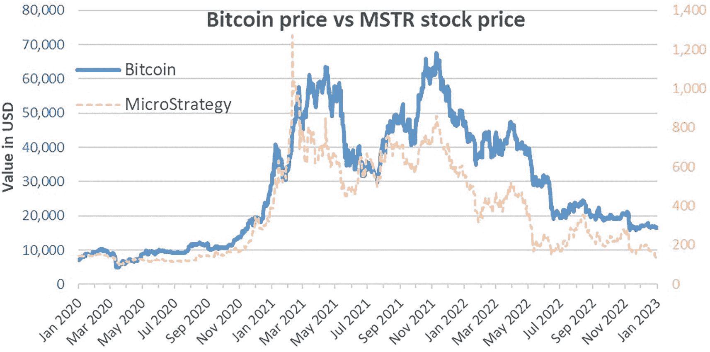
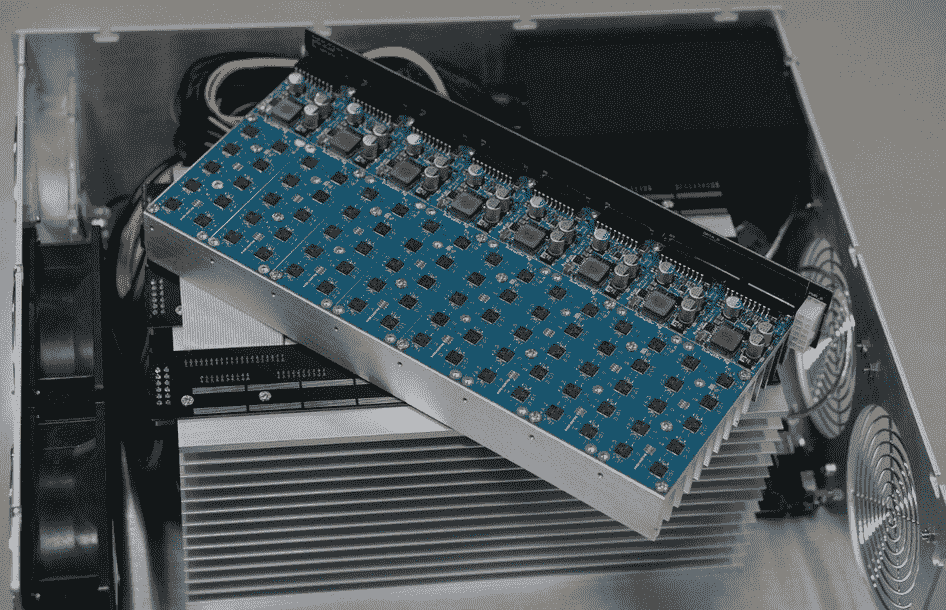
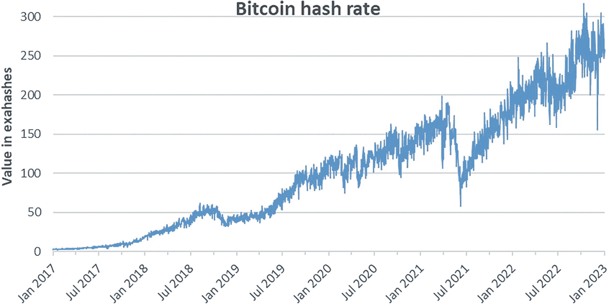
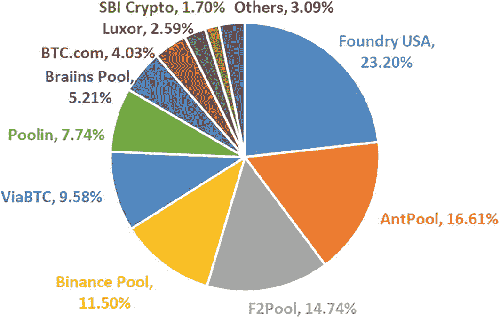
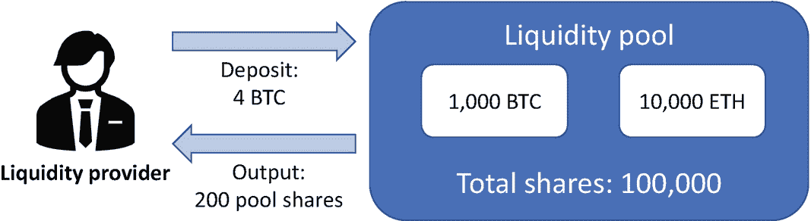
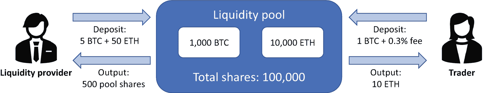
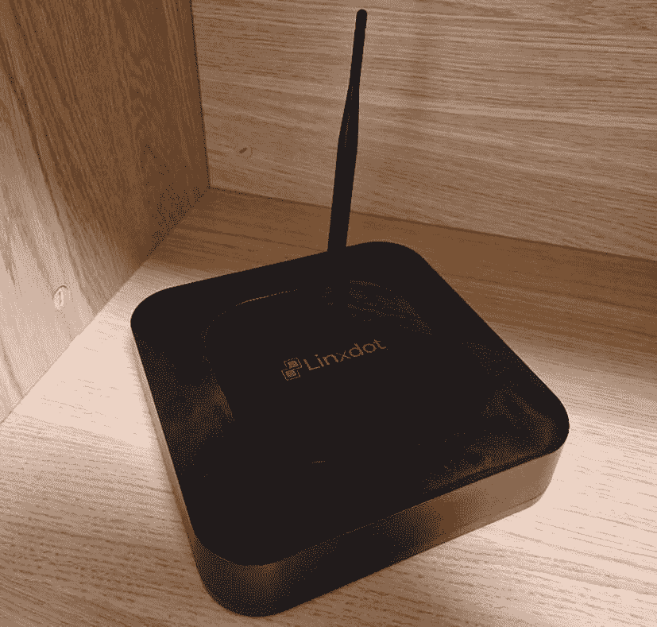
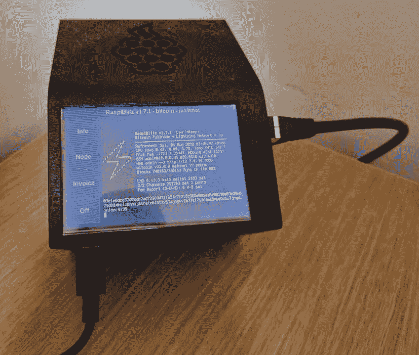

# 8. 加密资产的投资类型

> *如果你找不到睡觉时也能赚钱的方法，你就会工作到死。*
> 
> ——沃伦·巴菲特

对于任何投资而言，低价买入、高价卖出是收益的一种形式，即资本利得。然而，这往往并非从投资中获利的唯一途径。股权投资（股票）通常还能通过股息带来回报。固定收益投资（债券）主要通过利息带来回报。房地产投资则可通过租金带来回报。

同样，加密资产也提供了其他投资回报来源。本章将探讨这些来源。但在探讨之前，本章将先研究投资加密资产的不同方式，从区块链上的纯投资，到通过对加密资产有风险敞口的公司以及加密资产投资工具进行的间接投资。

## 加密资产的直接与间接投资

从加密资产中获利最直接的方式就是直接买卖它们。这种买卖被称为`现货交易`，因为资产几乎是立即交割的（即期）。例如，如果你在 2020 年 3 月以 5,800 美元的市场价格买入一枚比特币，并在 2021 年 3 月以 58,000 美元的市场价格卖出，那么你一年内就获得了+900%的回报，即增长了 10 倍。反之，大幅下跌也是可能的。例如，如果你继续持有该资产 18 个月，那么相比 2021 年 3 月的价格，你会损失 66%，因为它在 2022 年 10 月的交易价格仅为 20,000 美元。此类投资可以在中心化交易所（例如 Binance、KuCoin、Coinbase）或去中心化交易所（例如 dYdX、Uniswap、ApolloX）进行。

然而，监管规定或投资者的授权要求可能会限制对加密资产的直接投资。对于面临此类限制的投资者而言，幸运的是，仍存在其他选择，可以通过间接投资来获得对加密资产的风险敞口。

### 交易所交易基金（ETF）

交易所交易基金（`ETF`）是一种追踪某项或某组资产表现的投资工具。与直接投资标的资产相比，`ETF` 为投资者提供了多项优势。首先，它们能实现投资组合多元化。通过购买某个指数的 `ETF`，投资者无需逐一购买每项资产，就能获得对所有标的资产的风险敞口。其次，`ETF` 通常具有很高的流动性，可以按公允市场价格进行大量买卖。第三，投资者无需熟悉加密资产钱包。然而，购买 `ETF` 可能比直接购买标的工具更昂贵，因为 `ETF` 会收取年费（例如，投资金额的 0.8%）。

针对主要加密资产的 `ETF`（包括现货 `ETF` 和期货 `ETF`）在许多国家越来越普及。现货 `ETF` 简单地追踪标的加密资产的价值。如果比特币价格上涨，那么比特币现货 `ETF` 价格也会以相同比例上涨。

期货 `ETF` 追踪标的加密资产“期货”的价值。“期货”是一种金融产品，双方约定一方将在特定日期以约定价格买入约定数量的资产，无论该资产在该日期实际价格如何。例如，爱丽丝和鲍勃签订了一份比特币期货合约，爱丽丝将在 12 月 31 日以每个 50,000 美元的价格从鲍勃处购买两个比特币。即使届时比特币价格低于 50,000 美元，爱丽丝也必须以每个 50,000 美元的价格从鲍勃处买入这两个比特币。同样，即使比特币价格高于 50,000 美元，鲍勃也必须以每个 50,000 美元的价格卖出这两个比特币。期货为未来的买入或卖出价格提供了确定性。比特币期货 `ETF` 追踪比特币期货在公开市场上的交易价值。

截至 2023 年 5 月，提供比特币现货 `ETF` 的国家包括澳大利亚、巴西、加拿大、荷兰和新加坡。此外，多个国家也提供以太坊现货 `ETF`。值得注意的是，美国是少数几个未批准任何加密资产现货 `ETF` 的国家之一。特别是，美国证券交易委员会（`SEC`）以存疑的理由拒绝了所有比特币现货 `ETF` 的申请，这些决定正在法院上诉中。

然而，期货 `ETF` 的适用范围更广。例如，自 2021 年 10 月 19 日起，美国市场已提供首支比特币期货 `ETF`。截至撰写本文时，美国已批准六支比特币期货 `ETF` 上市交易，另有 25 支正在等待批准。同样，许多其他国家也提供比特币和以太坊期货 `ETF`。

### 使用区块链的公司

除了 `ETF`，另一种间接接触加密资产的途径是投资于目前正在使用区块链技术或正在开发区块链技术新用例的公司。与直接投资加密资产不同，此类间接投资是标准的（类似于投资任何公司），并且不需要针对加密资产的特殊报告或监管措施。

### 资产负债表上持有加密资产的公司

类似地，投资者可以投资那些资产负债表上持有大量加密资产的公司。例如，上市公司商业智能公司 `MicroStrategy` 在 2023 年初持有 130,000 枚比特币，价值超过 30 亿美元，大致相当于该公司的总市值。因此，如图 8-1 所示，该公司的股票价格非常密切地反映了比特币价格的演变（2020-2022 年相关系数：93%）。

**图 8-1** 2020 年 1 月至 2023 年 1 月比特币价格（左轴）与 `MicroStrategy` 公司（`NASDAQ`: `MSTR`）以`美元`计价的股票价格（右轴）

其他可公开交易的公司也持有比特币，但其持有比例远低于 `MicroStrategy`。这些公司包括 `Tesla` (`TSLA`)、`Galaxy Digital Holding` (`BRPHF`) 和 `Block`（前身为 `Square`，股票代码 `SQ`）。虽然购买这些公司的股票可能提供一些对比特币的间接敞口，但这种敞口并不完美。特别是，如果未来几年比特币价格翻十倍，这些公司的价值可能会增加，但它们不太可能同样经历 10 倍的估值增长。

### 提供加密服务的公司

从事加密资产挖矿或提供其他加密服务的公司是另一种间接（且不完美的）加密资产投资方式。例如，`Marathon Digital Holdings` (`MARA`) 是一家主要的比特币挖矿公司，截至 2022 年底持有近 12,000 枚比特币，其目标是“在北美建立最大的挖矿业务”，拥有约 69,000 台 `ASIC` 矿机。挖矿和 `ASIC` 将在下一节中解释。

加密资产交易所是另一种可能性。例如，`Coinbase` 是美国最知名的公共加密交易所之一，也是首家上市的此类交易所。其资产负债表上也持有大量比特币（2022 年为 9,000 枚），因此风险敞口是双重的：来自其运营以及比特币价格波动。

## 早期加密资产投资

另一种接触加密资产的方式是在其最早的开发阶段进行投资。目前存在多种投资方式，通常具有高潜在回报，但也伴随着高风险。

传统上，当一家私营公司决定上市（即向众多外部投资者公开发售股票）时，它会通过首次公开募股（`IPO`）来实现。在`IPO`中，投资者购买的是该公司的股份。加密货币行业借鉴了这一既定概念，发展出了首次代币发行（`ICO`）。`ICO`本质上是一种众筹形式，它将潜在投资者与项目创始人联系起来，为创意匹配资本。这是区块链初创企业筹集股权资本的原始方式。在`ICO`中，投资者购买的是新发行的加密资产，期望其未来价值会上涨。借此，任何人都可以成为风险资本投资者。创始人通常会保留该加密资产的大部分份额（例如 20%），作为项目开发的资金来源。尽管其名称中带有“币”字，但`ICO`并非专用于意在成为货币的资产。相反，所有类型的加密资产都会使用`ICO`。

`ICO`最早始于 2013 年，首个重大案例是以太坊在 2014 年的`ICO`。随后，大多数`ICO`都在以太坊区块链上进行，其数量在接下来的几年里呈指数级增长。不幸的是，许多人利用`ICO`的热潮，发行毫无价值的代币。一旦投资者涌入，骗子便会卷款跑路，任由项目自生自灭。有时，创始人甚至利用区块链背后的数据隐私精神来隐藏真实身份，实施完美的诈骗。由于`ICO`中的创始人通常缺乏问责制，另一种替代方案——证券型代币发行（`STO`）应运而生。

与`ICO`不同，`STO`有公司的股票或未来利润作为支撑。`STO`就像购买现实世界中公司的一部分股权。相比之下，`ICO`就像购买一种没有价值的代币，除非项目承诺成为现实。这种差异降低了发行团队携款潜逃的动机。虽然`ICO`能够以比以往任何时候都更高效（更快、成本更低）、更广泛的方式筹集资金，但`STO`对投资者来说更加安全。`STO`的发行需要遵循严格的监管规定，最终成为注册证券。例如，投资者可能被要求遵循严格的“了解你的客户”（`KYC`）和反洗钱（`AML`）流程才能投资。这种监管框架降低了项目沦为骗局的风险。另一个关键区别在于意识形态方面。`ICO`依赖于去除中间商的核心思想，而`STO`则通常依赖一些中间人，以提升项目对发行方和投资者双方的可靠性。

总的来说，`ICO`和`STO`提高了传统上非流动资产的流动性，并为小型潜在风险资本投资者消除了进入壁垒。因此，曾经只有少数富裕投资者才能享有的特权机会，现在变得大众化。这代表了迈向金融民主化的重要一步。

然而，`ICO`和`STO`并非新加密资产早期发行的唯一可能性。其他替代方案在 2010 年代末期出现，并在 2020 年代初期持续涌现。其中包括首次交易所发行（`IEO`）、首次去中心化交易所发行（`IDO`）、Maker 的强力持有者发行（`SHO`）以及首次推特发行（`ITO`）。对这些不太常见的发行方式感兴趣的读者，可以查阅 D-Core 的《机构区块链投资指南》[40]。

## 挖矿

除了直接投资于加密资产、与加密资产相关的 ETF 或公司外，另一种可能的投资类型是通过基础设施进行投资，特别是投资于基于工作量证明共识机制的加密资产的挖矿业务，尤其是比特币。

### 传统加密资产挖矿

与其投资一家挖矿公司，不如直接自己挖矿。第 6 章介绍了挖矿，即在工作量证明共识机制下，为加密资产发行新币（称为币基交易）的过程。此类加密资产包括比特币、比特币现金、莱特币、门罗币、达世币和狗狗币。然而，比特币是迄今为止哈希率（衡量网络安全性的指标）最高的资产，其哈希率是所有其他 PoW 资产哈希率总和的 100 倍。提醒一下，矿工们在一场赢家通吃的竞争中争夺验证区块链下一个区块的权利。为了赢得这场“竞赛”，矿工使用专用设备运行大量的加密哈希函数，直到偶然找到一个具有特定特征的数字。这类似于彩票，购买彩票的成本是算力（间接地，是电力）。成功的矿工将获得新铸造的币作为奖励。

挖矿可以是一项有利可图的生意，但它需要大量的前期投资，需要获得廉价电力，并且盈利前景波动较大。需要高额投资来购买专用设备进行挖矿。在某些情况下，你可能需要最新的专用集成电路（`ASIC`）才能具有竞争力。事实上，创新的速度使得矿机在几个月到几年内就会过时。这并不是说使用旧矿机就不可能挖矿。只是新型矿机执行哈希运算的数量增长迅速，使得旧设备很快失去竞争力。

一张比特币 ASIC 矿机的照片。

图 8-2

ASIC 比特币矿机（来源：维基共享资源，公有领域）

截至 2023 年 5 月，一台新的`ASIC`矿机每秒可产生超过 200 terahashes（200 万亿次哈希）。作为对比，比特币区块链上的一个区块需要大约 210 zettahashes（210 六万亿次哈希）才能找到一个成功的随机数。这个数字相当于十分钟内每秒 350 exahashes（350 万亿亿次哈希）（即撰写本文时比特币网络的哈希率，创历史新高）。

赢得挖矿“彩票”的可能性取决于你相对于整个网络的算力。如图 8-3 所示，哈希率在过去几年中持续增长，这反映了技术的进步以及越来越多的人为了从比特币价格上涨中获益而进入挖矿领域。2021 年中期哈希率暴跌超过 50%，对应的是中国对比特币挖矿的禁令，而当时中国贡献了比特币大部分的哈希率。

一张从 2017 年 1 月到 2023 年 1 月比特币哈希率的折线图。曲线呈上升趋势，但波动剧烈。

图 8-3

2017 年 1 月至 2023 年 1 月比特币网络每秒总哈希率，单位为 exahashes（来源：NASDAQ.com 及自行计算）

运行这些挖矿设备需要消耗大量电力，因此电力成本低廉的地理位置对挖矿更具盈利优势。例如，冰岛的地热能比纽约市的电网电价便宜得多，这使得冰岛成为比特币挖矿的更优地点。由于冰岛的电力生产几乎 100%来自可再生能源^(⁷²)，其可持续性也远高于其他地区。此类挖矿通常发生在*矿场*中——这些仓库里成百上千台 ASIC 矿机并行运作。矿场常直接建在水电站或地热能源站旁，以便利用电站产生的过剩电力来挖矿。这样一来，供应高峰（如雨季）或需求低谷（如夜间）产生的电力就能变现，同时还能保障比特币网络的安全。

截至 2023 年 5 月，各国电价差异悬殊：德国、丹麦或英国等国的电价平均每千瓦时超过 0.50 美元，而哈萨克斯坦、伊朗或马来西亚等国则低于 0.05 美元。因此，毫不意外的是，后一类国家位列全球比特币挖矿量前十。不过，即便是平均电价较高的国家，也能利用偶发的廉价电力（例如可再生能源电厂的过剩能源）来挖矿——美国（占全球 35%）、加拿大（10%）和德国（5%）也因此跻身同一前十榜单^(⁷³)。

相比之下，截至本文撰写时，要使比特币挖矿盈利，所需电价须低于每千瓦时 0.11 美元^(⁷⁴)。使用更昂贵的电力对矿工而言并无经济吸引力，因为挖矿奖励的可能性和规模无法抵消所需的能源成本。因此，在高电价地区挖矿无利可图，任何尝试者都将蒙受经济损失。值得注意的是，用于挖掘比特币等加密货币的能源，通常是原本会被浪费的能源。事实上，如果生产者能将此类能源用于其他任何用途，那通常会更有利可图。因此，比特币挖矿使我们得以从被浪费的能源中获利。与此同时，它并不会给高电价电网（例如发达国家的各大城市）带来压力，因为高电价地区缺乏挖矿的经济激励。

### 抗 ASIC 挖矿

为了遏制永无止境的算力竞赛和不断攀升的电力消耗，开发者为部分加密货币的共识机制设计了抗 ASIC 特性。换言之，对于这些加密货币的挖矿，使用 ASIC 并不比在传统计算机中使用简单图形处理器（GPU）更具优势。此外，对于某些加密货币，从技术层面也无法使用 ASIC。在这种情况下，用自己的笔记本电脑在家挖矿，与使用最新专用设备挖矿的成功概率并无差别。

从技术角度看，实现抗 ASIC 有多种方法。例如，可以将挖矿算法设计为需要大量计算机内存。这一要求意味着运行该算法的计算机芯片上需要更大的物理面积。特别是，ASIC 通常通过在计算机芯片上并行化物理线程来超越传统 GPU，而并行化本身就需要物理面积。然而，当算法步骤需要较大物理面积时，并行处理的优势就会减弱。ASIC 相对于 GPU 的竞争优势丧失，相应的加密货币便具有了抗 ASIC 特性。对于有兴趣的读者，现代基于工作量证明（PoW）的加密货币通过多重哈希 PoW、内存密集型 PoW 或程序化 PoW 来实现抗 ASIC，并且新的方法仍在不断涌现[41]。

对于个人而言，挖矿抗 ASIC 加密货币比挖非抗 ASIC 加密货币更经济可行。不过，廉价电力仍然是挖矿盈利的必要条件。此外，抗 ASIC 加密货币还有一个附带好处：更高的去中心化程度。实际上，抗 ASIC 特性减少了企业建立大型矿场的激励，从而避免了资产挖矿的中心化。

截至 2023 年，最大的抗 ASIC 工作量证明加密货币包括门罗币（XMR）、以太坊经典（ETC）和渡鸦币（RVN）。

### 矿池

比特币挖矿面临的一个问题是，对于任何个人而言，成功挖出一个区块的概率微乎其微，尽管成功后的区块奖励相当可观^(⁷⁵)。解决办法是加入一个矿池。在矿池中，矿工们同意按各自贡献给矿池的算力比例，分配成功挖出区块的奖励。例如，假设一个矿池在 2023 年挖出了 100 个比特币（16 个区块），而某个人在此期间贡献了该矿池总算力（哈希率）的 3%。那么，此人将获得 3 个比特币（扣除矿池管理费，例如 2%）。如图 8-4 所示，2022 年，前 9 大比特币矿池占据了比特币总算力的 95%。

2022 年十大比特币矿池哈希率饼图。Foundry USA 23.20%。ANTPOOL 16.61%。币安矿池 11.50%。ViaBTC 9.58%。Poolin 7.74%。Braiins Pool 5.21%。BTC.com 4.03%。Luxor 2.59%。其他 3.09%。

图 8-4
2022 年十大比特币矿池及其哈希率占比（来源：BTC.com 及自行计算）

建议愿意挖掘工作量证明加密货币的新手加入矿池，但需谨慎选择。特别地，应寻找那些在挖矿设备要求、费用计划、停机历史以及抵御 DDoS 攻击记录方面完全透明的矿池^(⁷⁶)。稳定（无停机且不易成为攻击目标）且透明的矿池，对于降低挖矿过程中的风险至关重要。

# 质押

许多加密资产将质押作为一种可能的被动收入来源（例如，参见表格 8-1）。第 6 章介绍了权益证明共识机制，其中质押者负责验证新区块。他们被选中进行验证的可能性，通常（除其他标准外）取决于他们向网络承诺（质押）的代币数量。这些验证者随后会因其工作获得质押奖励。成为验证者可能需要大量的最低投资（例如，以太坊为 32 `ETH`），以及繁琐的技术设置以避免停机（停机可能导致质押金被罚没）。然而，质押池对投资者来说很容易获得，无需专用设备或一次性大额投资。特别是，像 Binance、KuCoin 或 Coinbase 这样的交易所，为可质押的加密资产提供了有吸引力的奖励，且最低投资门槛极低。在这种情况下，质押奖励类似于债券收益率：质押的本金越高，质押奖励就越高。然而，与债券类似，这种收益也面临金融风险。特别是对于已质押的加密资产，它面临与资产本身及其质押平台相关的风险。

表 8-1

截至 2023 年 1 月，顶级可质押资产的年化收益率（APY）质押奖励（来源：[*www.stakingrewards.com/cryptoassets/*](http://www.stakingrewards.com/cryptoassets/)）

| 加密资产 | 代码 | 质押奖励 |
| --- | --- | --- |
| 以太坊 | ETH | 3.9% |
| 卡尔达诺 | ADA | 3.4% |
| 币安币 | BNB | 2.3% |
| 雪崩协议 | AVAX | 8.1% |
| 波卡 | DOT | 14.5% |
| 多边形 | MATIC | 5.0% |
| 阿尔戈兰德 | ALGO | 6.6% |
| 索拉纳 | SOL | 4.2% |
| 互联网计算机 | ICP | 7.5% |

质押奖励的范围通常从中个位数到三位数的回报率，具体取决于几个标准。首先，可质押的加密资产根据其编程特性，会提供不同的质押奖励。

其次，所选平台也很重要，因为一些平台会抽取更大份额的奖励，并提供不同的条件。表 8-2 展示了不同提供商之间质押奖励的差异。

表 8-2

截至 2023 年 1 月，排名前五的提供商（按质押总价值排序）的 MATIC 质押年化收益率（APY）奖励（来源：[*www.stakingrewards.com/earn/polygon/*](http://www.stakingrewards.com/earn/polygon/)）

| 提供商 | 加密资产 | 代码 | 质押奖励 | 余额（百万美元） |
| --- | --- | --- | --- | --- |
| Luganodes | Polygon | MATIC | 4.86% | $398 |
| Allnodes | Polygon | MATIC | 5.39% | $226 |
| Stakin | Polygon | MATIC | 5.35% | $87 |
| stakefish | Polygon | MATIC | 5.19% | $28 |
| Everstake | Polygon | MATIC | 4.85% | $15 |

最后，质押奖励取决于质押资金是否被锁定以及锁定的时长。尽管如此，质押资金并非必须被锁定；大多数平台上的大多数资产也可以随时赎回。表 8-3 展示了根据锁仓期限不同而产生的质押奖励差异。

表 8-3

截至 2023 年 1 月，币安提供的五个期限的 ADA 质押年化收益率（APY）奖励（来源：币安 App）

| 提供商 | 加密资产 | 代码 | 质押奖励 | 锁仓期限 |
| --- | --- | --- | --- | --- |
| 币安质押 | 卡尔达诺 | ADA | 1.5% | 灵活 |
| 币安质押 | 卡尔达诺 | ADA | 2.7% | 30 天 |
| 币安质押 | 卡尔达诺 | ADA | 3.2% | 60 天 |
| 币安质押 | 卡尔达诺 | ADA | 4.2% | 90 天 |
| 币安质押 | 卡尔达诺 | ADA | 5.7% | 120 天 |

# 加密货币借贷

质押之外的一种被动收入替代方案是加密货币借贷。在加密货币借贷中，贷方通常将法定货币（例如美元或欧元）或稳定币（例如 `Dai` 或 `USDC`）借给当前持有加密资产的借款人。这样，加密资产就成为了贷款的抵押品。

通常，加密货币贷款是超额抵押的。例如，Alice 借给 Bob 5,000 `USDC`，而 Bob 目前持有五个以太币，每个价值 2,000 美元，Bob 将这五个以太币用作抵押。如果 Bob 在贷款到期时未能偿还借入的 `USDC`，Alice 有权出售这些以太币，直到她的贷款和利息得到偿还。在这种情况下，贷款是超额抵押的，因为抵押品的市场价值是贷款价值的两倍多。^(⁷⁷)

抵押降低了 Alice 的信用风险：只有当 Bob 未能偿还贷款，并且抵押品的价值跌至低于应还款额时，她才会蒙受损失。在这个例子中，需要以太币价值至少下跌 50%，贷款才无法全额偿还。由于 Alice 的贷款风险低于没有抵押品的情况，她不需要向 Bob 要求特别高的利率。这意味着 Bob 可以通过提供抵押品来享受较低的利率。他可以用借来的钱购买更多他已经持有的加密资产，或者购买另一种加密资产。只要加密资产的增值速度高于贷款利率，Bob 就能从这种金融安排中受益。

由于加密货币借贷的存在，加密资产持有者可以通过借出他们的加密资产并获得正利率来获益。例如，与其让比特币闲置在加密平台上，不如通过借出它们来产生被动收入。

众多中心化和去中心化的加密平台以（相较于传统金融）有吸引力的利率提供加密货币借贷。此外，它们还提供近乎即时的贷款发放和结算。这些平台在匹配储蓄者和借款人方面发挥着关键作用，从而为这些贷款创造了市场。它们在利率、抵押品金额和最低存款要求方面各不相同。利率范围通常从不到一个百分点到两位数的回报率，如表 8-4 所示。

表 8-4

截至 2023 年 1 月，币安提供的借贷年化收益率（APY）奖励（来源：币安 App）

| 提供商 | 加密资产 | 代码 | 年化收益率 (APY) | 锁仓期限 |
| --- | --- | --- | --- | --- |
| 币安储蓄 | Axie Infinity | AXS | 12.0% | 灵活 |
| 币安储蓄 | 比特币 | BTC | 1.5% | 灵活 |
| 币安储蓄 | USD Tether | USDT | 5.5% | 灵活 |
| 币安储蓄 | Chainlink | LINK | 0.2% | 灵活 |

# 流动性挖矿

流动性挖矿是加密资产持有者获得被动收入的另一种方式，但它比质押或借贷更为复杂。从根本上来说，它是对流动性提供者所提供服务的奖励（即为市场提供流动性）。

奖励流动性的逻辑如下。一个平台（中心化或去中心化）旨在为众多加密资产交易对提供高流动性。对于一个交易对（例如 Solana 和 Axie Infinity），可能买家和卖家都很少，从而形成一个“非流动性市场”。在非流动性市场中，用一种资产购买另一种资产可能会实质性地改变市场价格，因为买卖双方都很少。这种情况通常发生在市场面临大额订单而缺乏足够交易量来吸收它们时。流动性市场对平台非常有价值，因为这样的市场能提供稳定的价格和有竞争力的佣金费用。这种价值会转化为对流动性提供者的奖励，通常表现为一种灵活的利息。

具体来说，流动性提供者通过存入一种资产（加密资产、法定货币或稳定币）进入包含两种资产的流动性池。在这样的池子中，两种目标资产根据各自可用数量的多少，在池中占据一个相对比例。提供者贡献一种资产（或两种资产）作为池子的流动性，并获得池子的份额，作为对这两种资产的索取权。该索取权的内容取决于提供者加入池子后，两种资产相对比例如何变化。

流动性挖矿示意图。一位流动性提供者向流动性池中存入 4 个 `BTC`，该池共有 1,000 `BTC` 和 10,000 `ETH`，总份额为 100,000，提供者获得 200 份池份额。

`图 8-5` `BTC-ETH` 流动性池示例，相对价格为 10 `ETH/BTC`，一位流动性提供者通过贡献与池总价值成比例的相应数量 `BTC`，获得池中 0.2% 的份额

交易者使用池子的自动做市商（`AMM`）用一种资产兑换另一种资产，并为此服务支付费用。流动性提供者的奖励取决于交易者在相应池子中兑换的交易量。兑换的交易量越高，总费用就越高，流动性提供者的回报也越高。截至 2023 年 5 月，去中心化交易所 `Uniswap` 收取兑换金额 0.3% 的费用，而中心化交易所 `Binance` 则收取 0.15% 的标准费用（并提供 50% 的费用返还，以 `Binance` 的原生币 `BNB` 支付）。

流动性挖矿示意图。一位流动性提供者向流动性池中存入 5 `BTC` + 50 `ETH`，获得 500 份池份额。一位交易者向流动性池中存入 1 `BTC` + 0.3% 的费用，获得 10 `ETH`。

`图 8-6` `BTC-ETH` 流动性池示例，相对价格为 10 `ETH/BTC`，一位流动性提供者获得池中 0.5% 的份额，一位交易者支付 0.3% 的交易费用，用 1 `BTC` 兑换了 10 `ETH`

流动性提供者最终获得的收益可能因交易对的不同而差异巨大，如下方表 8-5 所示。

`表 8-5` `Binance` 提供的流动性挖矿交易对示例，截至 2023 年 1 月的流动性和总收益水平差异巨大（来源：`Binance` App）

| 提供者 | 交易对 | 流动性 | 总收益 |
| --- | --- | --- | --- |
| Binance | USDT/DAI | 1,548,984 `USDT` + 2,802,152 `DAI` | 1.16% |
| Binance | BTC/ETH | 1,203 `BTC` + 17,398 `ETH` | 1.38% |
| Binance | AAVE/BTC | 5,925 `AAVE` + 22 `BTC` | 3.03% |
| Binance | ADA/BUSD | 1,610,694 `ADA` + 623,816 `BUSD` | 5.10% |
| Binance | AXS/BNB | 19,761 `AXS` + 756 `BNB` | 6.31% |
| Binance | GALA/BNB | 8,019,080 `GALA` + 1,509 `BNB` | 16.11% |

在使用流动性挖矿之前需要理解的一个概念是*无常损失*。池中每种资产的相对数量决定了流动性提供者份额的价值。当交易对中的一种资产有大量进出流动性池时，池中资产的份额会发生变化。因此，流动性提供者的投资价值可能低于仅仅持有这些资产时的价值。由于这种变化，投资会面临未实现损失（与单纯持有资产相比）。这种未实现损失被称为无常损失。然而，只有当池中资产的相对价值发生剧烈变化时，无常损失才会变得显著^(⁷⁸)。此外，提供流动性带来的回报通常足以弥补无常损失。

## 收益耕作

收益耕作涉及通过锁定加密资产来获取尽可能高的被动收入。被动收入通常来源于底层的质押、借贷或流动性挖矿。

一些平台，如 `Aave`、`Compound` 或 `yearn.finance`，通过在不同 `DeFi` 服务之间转移资金来自动化此过程，以获取尽可能高的资本回报。在 2020 年初，看到收益耕作中三位数（有时甚至是四位数）的回报率并不罕见，这证明了其极高的风险水平。如此高的收益只有通过大量的杠杆投资和高风险项目才能实现。在 2022 年的熊市中，随着流程变得更加成熟和风险降低，收益率更为温和，通常为个位数到较低的两位数回报率。

## 空投

在加密资产语境下，空投是一种用于新型加密资产获得普及度和增加使用量的营销策略。可以将空投视为相当于零售店提供免费样品的一种加密方式。尽管存在多种形式，空投通常包括用户免费获得少量新型加密资产，或通过完成一些小任务来获得^(⁷⁹)。这些任务可能是转发加密资产发行公司的帖子、加入加密项目的新闻通讯、在社交媒体上关注加密资产页面，或回答关于该加密资产如何运作的基本问题，从而证明用户花时间理解了其目的。有时，任务包括使用该加密资产：例如，至少持有一定数量的该资产，或使用发行公司提供的某项服务。空投对于通过加密资产的广泛使用来产生网络效应至关重要。

从历史上看，一些空投曾带来可观收益，例如 `Uniswap` 空投为每位接收者带来了 15,000 美元。然而，空投的回报通常很小（最多价值几美元），并且常常甚至无法交付承诺的代币。此外，空投通常针对处于起步阶段的加密项目，这些被空投的加密资产往往变得一文不值。对许多加密资产投资者而言，空投是否值得花时间完成整个注册过程，是值得商榷的。

# 交易路由

某些加密资产提供了通过交易路由获利的机会。一个广为人知的例子是 `Helium` 挖矿。在此语境下，`Helium` 并非元素周期表中的惰性气体，而是一种为“人民网络”（一个去中心化无线网络）提供动力的加密资产。`Helium` 节点使得智能设备能够通过低功耗、长距离的无线协议在线发送数据。因此，`Helium` 矿工可以根据其网络覆盖范围获得可观的奖励。连接到该网络的物联网设备包括，例如，狗狗的智能项圈或许多城市都有的 `Lime` 电动滑板车。矿工之所以能获得高额回报，是因为这种模式对任何单个矿工而言都无法规模化扩展。实际上，两台彼此靠近的 `Helium` 挖矿设备所提供的网络覆盖范围与单台设备相同。因此，矿工有动力（在每个地点）只拥有一台设备。

Linxdot `Helium` 矿机照片。

图 8-7：`Linxdot` 生产的 `Helium` 矿机

另一个交易路由的例子是通过闪电网络实现的。闪电网络通过在比特币区块链之上构建基础设施来提高比特币的可用性，从而使交易能够即时完成，且交易费用可以忽略不计。这一特性对于解决比特币交易结算速度相对较慢的问题至关重要，将其从分钟级缩短到毫秒级。根据设计，闪电网络依赖于去中心化的节点来路由交易。任何人都可以运营这样一个节点，并从小额交易费用的分成中获益。全天候运行一个专用节点功耗低于每小时 10 瓦，相当于在 2023 年的纽约这样的城市，每月电费大约为 1 美元。运营这样一个节点的收益取决于多个因素，包括路由交易的数量和规模，以及比特币的价格。截至 2023 年，运营这样的节点并不赚钱：即使在最理想的情况下，也需要好几个月才能收回成本。然而，比特币倡导者将其用于帮助网络去中心化，并享受其他服务，例如提供闪电支付和开具闪电发票。随着闪电网络上支付数量的增加，运营一个路由节点可能会成为一个潜在的新收入来源。

`RaspiBlitz` 屏幕的照片。屏幕左侧有信息、节点、发票和关闭的菜单。中间屏幕显示比特币全节点和闪电网络。

图 8-8：运行在 `RaspiBlitz` 上的比特币全节点和闪电节点

## 关键概念

有些投资者可能未被授权或监管以直接投资加密资产。然而，他们仍然可以通过间接投资（例如 `ETF` 或拥有、开发或挖掘加密资产的公司）从这种新资产类别中获益。此外，个人也可以选择直接挖掘加密资产或亲自为区块链项目做贡献。

投资者可以通过资本收益和被动收入机会（例如质押、借贷或流动性挖矿）从加密资产中获益。他们还可以使用收益农场，将资金自动转移到 `DeFi` 世界中收益最高的选项，尽管这些选项通常伴随着额外风险（例如杠杆）。

另一种高风险、高回报的直接投资策略是投资于 `ICO`、`STO` 或其替代的早期加密资产发行，以利用全新加密资产可能的价格上涨。

# 延伸问题

由于大多数加密资产本质上属于证券（见第 7 章），`ICO` 构成了一种证券发行。而由于大多数 `ICO` 发行方并未注册，这类发行在许多司法管辖区可能是非法的（即使执法机构通常没有明确禁止）。对于 `ICO` 的投资者而言，真正的监管风险是什么？

为什么截至 2023 年，没有更多公司将比特币纳入其资产负债表？

质押和借贷背后的风险是什么？

脚注 1 2 3 4 5 6 7 8