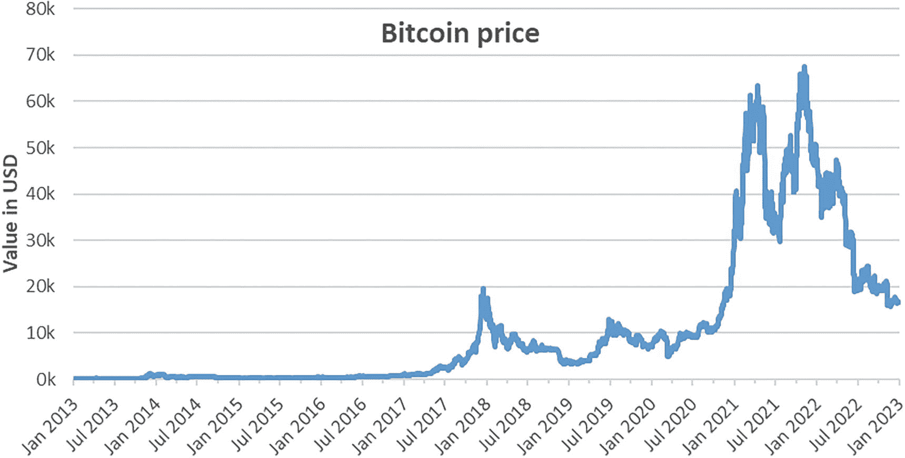
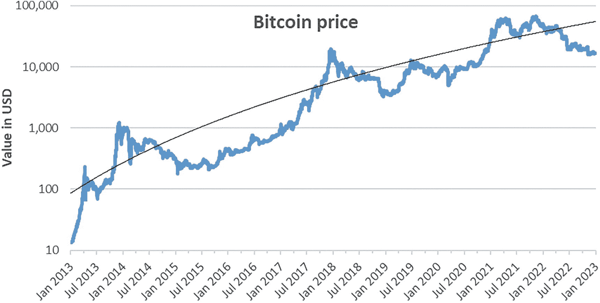
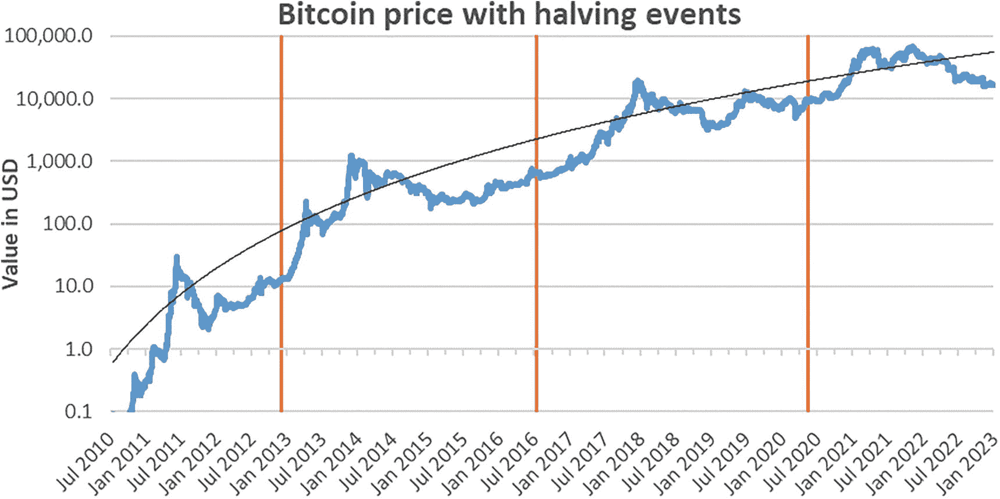
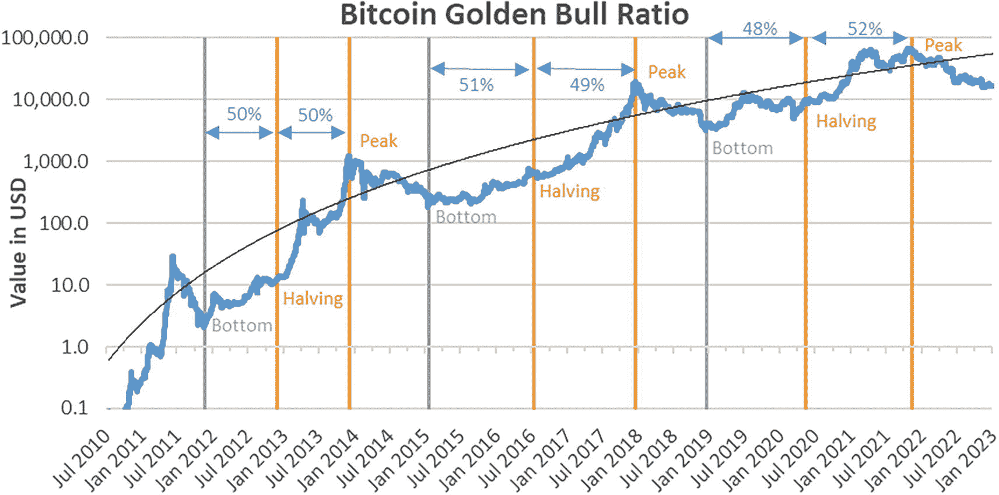
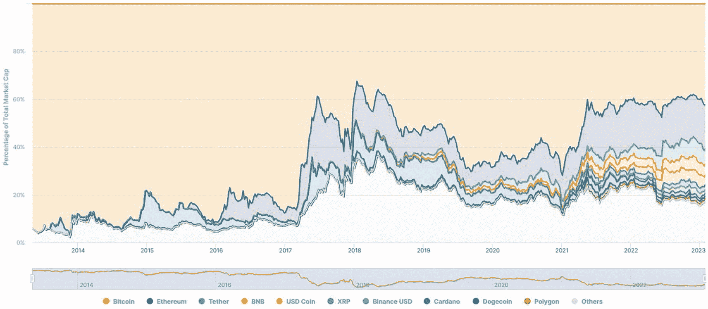
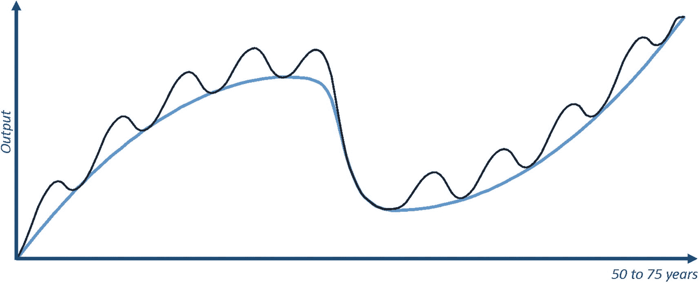
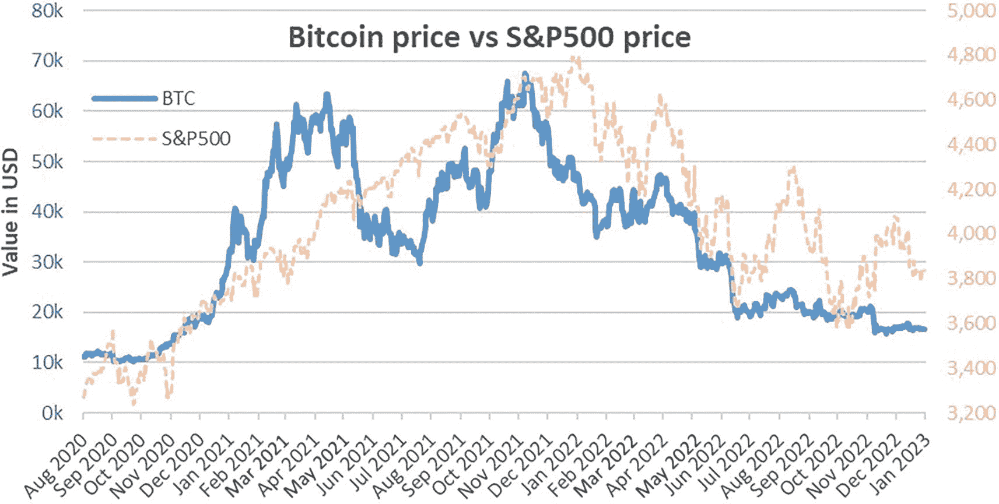
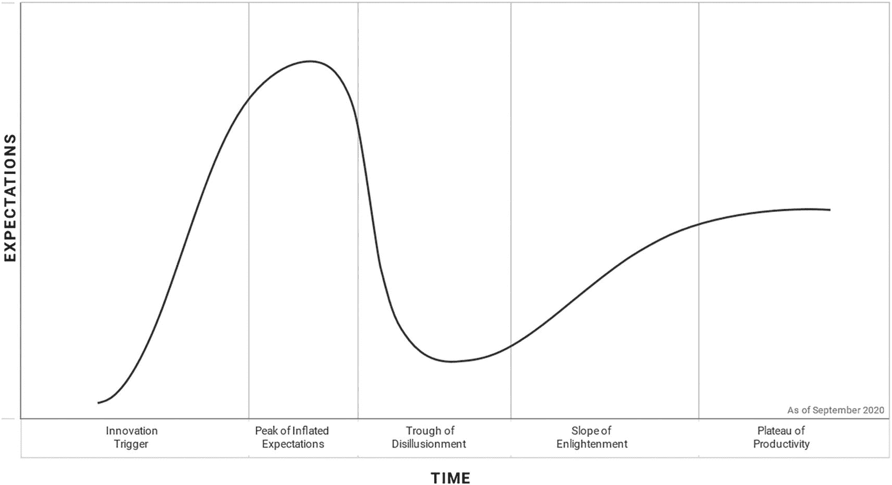
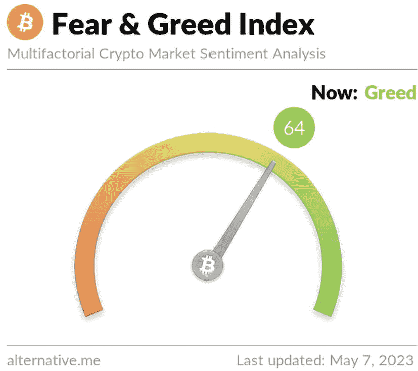

# 第三部分：何时是投资的好时机？

## 9. 加密货币趋势

> *以史为鉴，可以知兴替，进而明晰未来。*
>
> ——卡洛斯·斯利姆·埃卢

对于任何投资者而言，无论是投资加密资产还是其他领域，时机都至关重要。虽然把握好投资时机很困难，但理解宏观经济周期、加密资产特定周期以及特定的日历调整会有所帮助。本章探究这些周期及其他加密资产趋势。这些知识不仅能让面临投资大幅波动的投资者安心，还将有助于本书后面探讨的一些估值方法。

### 比特币价格

我们首先分析比特币的历史趋势，因为它目前是规模最大的加密资产，并且截至 2023 年，它仍然主导着大多数其他加密资产的价格走势。虽然历史数据不能预测未来，但它能让我们了解过去推动价格波动的因素。正如哲学家桑塔亚那所言：“忘记过去的人，必将重蹈覆辙。”

使用标准刻度来度量呈指数增长的数据（如图 9-1 所示），所能提供的洞察十分有限。

一张 2013 年 1 月至 2023 年 1 月比特币兑美元价格的折线图。曲线在 2017 年 1 月之前保持水平并伴有极轻微波动，随后上升至 2022 年 1 月，之后下降并带有波动。

图 9-1 2013 年 1 月至 2023 年 1 月比特币兑美元价格（标准刻度）

对相同数据使用对数刻度，能对比特币的历史趋势进行更具启发性的分析。在这种刻度下，每个垂直标记代表的数值是前一个的十倍。图 9-2 展示了近十年的数据，并添加了对数趋势线。^(⁸⁰)

一张 2013 年 1 月至 2023 年 1 月比特币兑美元价格的上升折线图，带有波动，并在 2013 年、2017 年和 2021 年出现价格峰值。一条曲线在波动中上升。对数趋势线始于（约 2013 年 1 月, 99），止于（2023 年 1 月, 80,000）。

图 9-2 2013 年 1 月至 2023 年 1 月比特币兑美元价格（对数刻度），并带有一条对数趋势线

从这些数据中首先可以识别出的模式是 2013 年、2017 年和 2021 年的价格峰值。细心的读者可能记得，这些年份紧随比特币减半事件年份之后（即作为比特币供应计划的一部分，每个区块奖励的新比特币数量减半的年份）。具体来说，2012 年 11 月，每个区块奖励的比特币数量从 50 枚减至 25 枚。同样，2016 年 7 月从 25 枚减至 12.5 枚，2020 年 5 月从 12.5 枚减至 6.25 枚。这些峰值曾将比特币价格推高至其对数趋势线以上约两个标准差的位置，随后价格崩溃。从最高点到最低点，比特币最大的几次跌幅分别为 93%（2011 年）、86%（2015 年）、83%（2018 年）和 77%（2022 年）。这类跌幅与科技股在其增长阶段的表现相当。例如，亚马逊在 2000 年暴跌 80%，苹果从 2000 年到 2002 年下跌了 91%（其中包括 2000 年 9 月 29 日单日暴跌 51%）。

比特币的起伏遵循一个四年周期的模式，这一现象催生了多种关于其未来演变的理论。

一张 2010 年 7 月至 2023 年 1 月比特币兑美元价格的上升折线图，带有波动。图中三条竖线分别位于 2012 年 11 月 28 日、2016 年 7 月和 2020 年 7 月。对数趋势线始于（约 2013 年 7 月, 0.8），止于（2023 年 1 月, 80,000）。

图 9-3 2010 年 7 月至 2023 年 1 月比特币兑美元价格（对数刻度），并标注了 2012 年 11 月 28 日、2016 年 7 月 9 日和 2020 年 5 月 11 日的减半事件

#### 比特币“减半”周期

由新供应量减半驱动的四年比特币周期，对未来价格走势的预测并不可靠，但可以提示其他市场参与者可能抱有何种预期。此外，仅仅因为其他市场参与者预期这些周期会持续下去，这一预期本身就可能成为自我实现的预言。

比特币区块链每产出 210,000 个区块就会发生一次减半事件。由于大约每 10 分钟产生一个区块，这大致相当于每四年一次。然而，比特币的代码会根据网络算力，每两周调整一次挖矿难度。这样调整的目标是确保无论网络总计算能力如何，挖出一个区块所需时间始终约为 10 分钟。如果在两次难度调整之间算力增加，那么到下一次调整前，挖出一个区块的平均时间会降至 10 分钟以下。过去，减半事件发生的间隔时间都短于四年，因为总算力随着采用率的提高而增加。

随着算力稳步增长，这种模式很可能将持续下去，至少在短期内是如此。最近三次减半事件之间的间隔期分别为 3 年 10 个月 19 天、3 年 7 个月 11 天和 3 年 10 个月 2 天。考虑到自上次减半以来算力的增长，预计未来间隔期约为 3 年 10 个月是合理的。因此，接下来的两次比特币减半事件很可能分别发生在 2024 年 3 月和 2028 年 1 月。

减半事件前后价值上涨的根本原因，在于比特币的存量-流量比率发生了变化，这一点在第 1 章中已有解释。当减半事件发生时，单位时间内新挖出的比特币数量（流量）相对于现有比特币总量（存量）的比值会突然显著减小。换言之，供应量的扩张速度骤然放缓，使得每个现有比特币的获取难度增加，因此价值也相应提升。由于未来减半事件对该比率的影响将会减小，其重要性在未来可能不如过去那样突出。

### 比特币黄金牛市比率

比特币在其第二个周期（2018 年）之后的价格模式催生了*比特币黄金牛市比率*理论。该比率指出，从市场底部到减半事件的时间，占从底部到峰值总时长的 50%；而从减半事件到峰值的时间，也同样占从底部到峰值总时长的 50%。在前两个周期中，该比率分别为 50.3%–49.7%和 50.8%–49.2%。尽管这个理论在 2021 年广为流传，但第三个周期几乎完美地符合该模式，其比率为 48.4%–51.6%，如图 9-4 所示。

一张显示 2010 年 7 月至 2023 年 1 月比特币美元价格波动上升的折线图，图中标有三个垂直分段，分别标注为底部、峰值和减半。对数趋势线从（2010 年 7 月，0.8）附近开始，结束于（2023 年 1 月，80,000）。

**图 9-4** 2010 年 7 月至 2023 年 1 月比特币美元价格（对数刻度）。展示了三个周期及其关键里程碑：底部、减半和峰值。

一些市场参与者可能（也许是非理性地）期待这种模式会在下一个周期继续。根据这种 50%/50%的模式、最近的市场底部（2022 年 11 月 21 日）以及预计的下一次减半事件日期（假设减半事件之间相隔 3 年 10 个月，即 2024 年 3 月 12 日），下一个市场顶部将出现在 2025 年 7 月 2 日。当然，这只是一个基于上述假设的理论日期，在实践中极不可能精确实现。监管变化、市场动态，甚至算力增长对下一次比特币价格峰值日期的影响，都将远大于历史模式。尽管如此，支撑这一理论日期的数据详见表 9-1。

**表 9-1** 历史周期的关键比特币价格日期：底部、减半事件和峰值，以及每个周期（从底部到峰值）的比率

| | 底部 | 减半 | 峰值 | 天数 | 比率 |
| --- | --- | --- | --- | --- | --- |
| 周期前 1 | | | 2011 年 6 月 9 日 | | |
| 周期 1 | 2011 年 11 月 19 日 | | | 163 | |
| | | 2012 年 11 月 28 日 | | 375 | 50.3% |
| | | | 2013 年 12 月 4 日 | 371 | 49.7% |
| 周期 2 | 2015 年 1 月 14 日 | | | 406 | |
| | | 2016 年 7 月 9 日 | | 542 | 50.8% |
| | | | 2017 年 12 月 16 日 | 525 | 49.2% |
| 周期 3 | 2018 年 12 月 15 日 | | | 364 | |
| | | 2020 年 5 月 11 日 | | 513 | 48.4% |
| | | | 2021 年 11 月 8 日 | 546 | 51.6% |
| 周期 4 | 2022 年 11 月 21 日 | | | 378 | |
| | | (2024 年 3 月 12 日) | | (477) | (50.0%) |
| | | | (2025 年 7 月 2 日) | (477) | (50.0%) |

### 比特币周期反弹

从图 9-4 中可以识别的另一件事是，减半后的反弹幅度远大于减半前的反弹幅度。特别是，在三个实例中，从减半事件到峰值日期期间，价格分别上涨了 101 倍（+10,044%）、30 倍和 8 倍。相比之下，从底部到减半事件期间的价格“仅”上涨了 6 倍、3.7 倍和 2.7 倍，如表 9-2 所示。

**表 9-2** 历史周期的关键比特币价格日期，包含美元价格及相对于前一个里程碑的变化

| | 底部 | 减半 | 峰值 | 价格 | 变化 |
| --- | --- | --- | --- | --- | --- |
| 周期前 1 | | | 2011 年 6 月 9 日 | 29.60 | |
| 周期 1 | 2011 年 11 月 19 日 | | | 2.05 | –93% |
| | | 2012 年 11 月 28 日 | | 12.20 | 6.0 倍 |
| | | | 2013 年 12 月 4 日 | 1,237.60 | 101.4 倍 |
| 周期 2 | 2015 年 1 月 14 日 | | | 178.10 | –86% |
| | | 2016 年 7 月 9 日 | | 650.96 | 3.7 倍 |
| | | | 2017 年 12 月 16 日 | 19,497.40 | 30.0 倍 |
| 周期 3 | 2018 年 12 月 15 日 | | | 3,236.76 | –83% |
| | | 2020 年 5 月 11 日 | | 8,601.80 | 2.7 倍 |
| | | | 2021 年 11 月 8 日 | 67,566.83 | 7.9 倍 |
| 周期 4 | 2022 年 11 月 21 日 | | | 15,787.28 | –77% |
| | 不适用 | | 不适用 | 不适用 |
| | | | 不适用 | 不适用 |

### 比特币周期持续时间

另一个在 2021 年（在触及第三周期底部之前）被广泛讨论的相关理论是*比特币周期延长*理论。在比特币的第一个周期中，从底部到峰值的持续时间是 746 天，而在第二个周期中，则是 1067 天，这催生了该理论。⁸¹ 然而，第三个周期为 1059 天，比第二个周期短了八天。如果第四个周期具有相似的持续时间，那么下一个峰值将出现在 2025 年 10 月中旬（这与黄金牛市比率延续所建议的 2025 年 7 月峰值日期形成对比）。

当然，这些广为流传的理论存在这一事实本身，就意味着一些参与者可能会根据模式来安排他们的交易时机。足够多的参与者据此进行交易，至少会扭曲这些模式，甚至可能使其完全失效。

另一个被广泛讨论的理论是比特币将进入所谓的*超级周期*。在超级周期中，随着加密资产的大规模采用，四年周期模式将逐渐消失，比特币将进入一个价格持续上涨的长期阶段。

### 相对市场主导地位

另一个重要趋势是加密资产内部的相对主导地位。由于比特币是首个加密资产，它曾经拥有 100%的主导地位（即比特币占据了加密资产领域 100%的市值）。随着其他加密资产进入该领域，比特币的主导地位有所下降。在 2017 年市场高峰期，比特币的主导地位从 86%下降到 32%，主要份额让给了以太坊和瑞波币。不过，比特币从未失去其第一名的位置。在随后的周期（2018-2022 年）中，比特币的主导地位主要在总加密市场的三分之一到三分之二之间波动，而以太坊的市场主导地位则在 7%到 22%之间波动。与此同时，瑞波币从其 19%的高点跌至 3%以下，并且没有其他加密资产突破 6%的主导地位门槛。

最新的相对市场主导地位概况可在网站`CoinMarketCap.com`上查看。⁸²

一张面积图，展示了 2013 年 5 月至 2023 年 1 月期间 11 种主要加密资产占总市值百分比的变化。最高和最低的分别是以太坊和 Polygon。

**图 9-5** 主要加密资产的相对市场主导地位，2013 年 5 月至 2023 年 1 月，基于其市值（来源：`CoinMarketCap.com`）

### 比特币引领作用

加密市场中下一个关键的历史模式是，比特币的价格走势往往成为山寨币价格的领先指标。当比特币价格飙升时，其他加密资产的价格通常也会迅速随之上涨。当比特币价格下跌时，情况也是如此，会导致加密市场其他部分的价格下跌。

虽然这种模式从历史价格数据看显而易见，但它是非理性的。使比特币有价值的原因与使以太坊、Chainlink 或 Stellar Lumen 有价值的原因截然不同。由于这些资产背后的基本面不同，它们的价格走势应该相关性很小。但这些资产之间历史上存在的高相关性，恰恰证实了市场相对较低的成熟度。在撰写本文时，投资者仍然将所有加密资产视为“风险资产”（类似于科技股），而没有更深入地思考它们之间的区别。

## 宏观周期与相关性

在加密资产领域之外，宏观经济趋势通过周期性模式推动经济起伏。这些周期对所有资产类别（包括加密资产）产生实质性影响。正如第 2 章介绍的，长期周期持续数十年，而在这些长期周期中，较短期周期仅持续数年，通常不到十年。

长期周期也被称为“长期债务与资本市场周期”（持续约 50 至 75 年）^(⁸³)、康德拉季耶夫长波（持续 45 至 60 年），或长期趋势。它们均指经济扩张与收缩的相同模式。人口结构、债务和技术等重要宏观变量驱动着长期趋势。尤其是技术，往往成为长期趋势变化的催化剂，在低谷后引发新一轮重启。

较短周期或商业周期则取决于央行的政策，例如量化宽松或加息。不同资产和行业在周期中通常并非处于同一节点。例如，一些行业更具周期性（如能源、建筑材料和可选消费），往往在周期扩张阶段表现优异。相比之下，其他行业（如医疗保健或公用事业）则更为稳定，受周期阶段影响小得多。在商业周期内部，还存在更短的趋势（战术趋势），可能持续数月，也可能短至数天。

一张折线图，显示两个经济周期在 50 至 75 年时间跨度内的产出变化。长期线波动两次，并呈上升趋势。短期线叠加在长期线上方，且全程波动。

**图 9-6** 经济周期示意图，短期周期叠加于长期周期之上

加密资产遵循类似的周期模式：首先是一个相对较长的价值增长趋势，与全球加密资产采用水平同步；其次是受监管、政策和重大事件（例如比特币减半事件或 2022 年 9 月中旬以太坊的“合并”事件）驱动的短期周期。^(⁸⁴)

第 4 章强调了加密资产与传统投资的低相关性。然而，在周期性衰退阶段，各类资产之间的相关性往往会上升。确实，当业务变得困难且经济放缓时，需要现金的投资者往往会抛售所有类型的资产。这些抛售发生在所有资产类别中，并拉低所有价格。例如，2008 年的黄金或 2022 年的加密资产都出现过这种情况：作为全球抛售的一部分，与股票的相关性显著增加。在投资者最需要分散风险时，更高的相关性反而削弱了分散化投资的收益。这种金融现象被称为*传染*。

一张双轴折线图，显示 2020 年 8 月至 2023 年 1 月期间比特币美元价格和标普 500 指数价格。两条线均波动剧烈，先升后降。

**图 9-7** 2020 年 8 月至 2023 年 1 月比特币（左轴）与标普 500（右轴）价格走势，显示在 2022 年抛售期间相关性更高（即当资产间相关性较高时，尖峰和下跌往往同时发生）

随着加密资产市场的发展，它将逐渐与比特币减半周期脱钩，因为减半事件的影响将比例性地越来越小。在此过程中，加密资产市场可能更趋同于传统周期，后者反映了已投入的资本（当资本稀缺时，投资者倾向于抛售所有类型的资产）。此外，从中期来看，由于波动性较高，许多加密资产可能继续被视为风险资产。理解我们当前处于宏观周期的哪个阶段，以及其他投资者如何看待资产类别，对加密资产投资者而言可能会变得越来越重要。

然而，加密资产的价值主张与传统资产类别有着根本不同。即使在不同加密资产之间，其价值主张也可能差异巨大。因此，有理由认为，资产类别之间以及加密资产类别内部的分散化收益将持续存在。

例如，这种分散化收益在 2023 年 3 月中旬多家传统银行倒闭期间就已显现。当金融市场下跌时，比特币价格在一周内上涨了 40%——从`$20,000`升至超过`$28,000`。这一事件证明，比特币成为“避险资产”的说法开始站稳脚跟。

## 其他加密周期

加密资产周期不仅可由价格定义，还可由其他指标定义。例如，区块空间就是这样一个指标，它指一个区块所能容纳的信息量。根据区块链的不同，区块空间的使用、表达和估值方式也不同。例如，在以太坊区块链上，用户需支付几个`gwei`（`gwei`是`ether`的十亿分之一）的费用，以便被纳入下一个区块。随着加密商业周期演变，对区块空间的需求及相应的费用也会变化。在某些情况下，区块空间费用甚至可能是未来价格变动的早期指标。

同样，许多其他链上指标也能通过其自身所处的周期位置，为未来可能的价格变动提供见解。后续章节将讨论此类指标。

## 技术分析中的图表

加密社区有时会依赖价格形态或交易量等图表来指示未来可能的价格变动。这种方法脱离了基本面分析，进入了危险的技术分析领域。

这个领域之所以危险，是因为仅凭图表无法预测未来价格，且提供的信息不足以进行长期交易。尽管如此，它们仍有助于基于基本面选择交易时机。例如，它们可以提示支撑位和阻力位的存在。支撑位是一个低于当前资产价格的价格水平，在此价位上，许多投资者愿意买入。突破支撑位需要价格承受巨大的下行压力（即在该价位上卖家远多于买家）。阻力位则相反：是一个高于当前市场价格的价格水平，在此价位上，许多投资者想要卖出。

图表可以补充投资论点，但不能替代它。它们可以确认或挑战某种理论，但图表本身不能成为理论。

### 理解高德纳的炒作周期

技术研究与咨询公司高德纳提供了一个有价值的框架，用以梳理围绕技术创新的炒作。^(⁸⁵) 大多数创新都遵循类似的模式：首先经历高度的热情和预期，然后跌入幻灭的低谷，最后才在主流采用过程中稳定在合理的生产力水平。具体来说，炒作周期分为五个阶段，如图 9-8 所示。

一张期望值随时间变化的折线图。线条经历了五次上升达到顶峰和下降至谷底，这五个阶段分别是：技术萌芽期、期望膨胀期、泡沫破裂低谷期、稳步爬升复苏期和生产成熟期。

图 9-8

高德纳，《理解高德纳的炒作周期》，Frances Karamouzis, Jan-Martin Lowendahl，2022 年 9 月 27 日

要判断整个加密领域处于这个周期的哪个阶段是很有挑战性的。该领域内的不同子创新可能处于不同的周期阶段。例如，2013 年的市场高峰和 2014 年的崩盘，可能分别是比特币这项原始创新的“期望膨胀期”和“泡沫破裂低谷期”。一旦 2015 年以太坊引入智能合约，这项创新就开始了新的周期。同样，2017 年出现了期望膨胀的高峰，随后在次年进入了泡沫破裂的低谷。接着，Web 3.0 和 NFT 等进一步的创新在 2020-2022 年间引发了类似的起伏。特别是，NFT 项目的市值仅在 2021 年就增长了超过 100 倍，达到 400 多亿美元，然后在第二年暴跌超过 75%。^(⁸⁶)

### 日历效应

特定的日历日期会驱动部分投资者的行为，直接影响加密资产的价格。在每个日历年度结束时，许多投资基金都会结算其损益表。整个财年积累的收益会体现在财务报表中，并可能决定基金的未来。为了应对这个关键的年末结算事件，基金可能希望锁定部分未实现的年度收益，以便在其报表上显示更多的盈利数字。因此，当市场在 12 月份普遍上涨时，这些基金可能会引发不成比例的抛售压力。

在较小程度上，与其他日子相比，日历季度末也往往呈现出不规则的模式。期权（金融衍生品）的到期日大多集中在季度末，这导致了这种趋势。庞大的加密资产期权市场使得季度结算对此类资产尤其重要。

除此之外，投资基金通常还会遵循季度投资组合再平衡周期。在季度末，投资组合经理会重新评估其资产的相关性并调整投资组合。这一趋势会显著增加包括加密资产在内的所有资产的交易量。

### 恐惧与贪婪指数

我们已经讨论了长期和中期加密周期，但在一个周期内，何时是最佳的买入时机？要回答这个问题，必须理解市场行为往往是非理性的。具体来说，市场经常对那些本应对资产价格影响甚微或毫无影响的消息做出过度反应。这种非理性为那些能够看透它的人创造了绝佳的机会。例如，当其他金融市场（尤其是股票市场）表现不佳时，许多投资者会撤离高波动性资产，如加密资产。这种偶尔的“逃向安全资产”行为会暂时将波动性资产的价格压低到低于其趋势预测的水平。在其他条件不变的情况下，这就是一个有利的买入时机。正如商业巨头约翰·D·洛克菲勒所言：“赚钱的途径就是在血流成河时买入。”

恐惧与贪婪指数可以衡量所谓的“血流成河”。软件比较公司 `alternative.me` 基于社交媒体上的情绪变化、调查以及市场动量、主导地位和趋势等市场指标创建了该指数。该指数在网页 [`https://alternative.me/crypto/fear-and-greed-index/`](https://alternative.me/crypto/fear-and-greed-index/) 上每日更新。该指数输出一个从 0 到 100 的数值。较低的分数表示极度恐惧（市场情绪上过度悲观），而较高的分数则表示极度贪婪（市场情绪上过度乐观）。因此，这个指数可能有助于把握加密资产的买入和卖出时机。

一张标题为“恐惧与贪婪指数，多因子加密市场情绪分析”的截图，上面有一个标尺。指针指向 60，一个标签写着“现在，贪婪”。底部列出的详细信息写着，“alternative dot me”，“最后更新于 2023 年 2 月 2 日”。

图 9-9

来自 `alternative.me` 的恐惧与贪婪指数，数据截至 2023 年 5 月 7 日

### 采用

试想现在是 1990 年，你在当地邮局上班。当你早晨喝咖啡时，你那热衷于科技同事正喋喋不休地谈论着某个据称将改变一切的新趋势。你听到的都是些难以理解的术语和陌生的缩写词。*这个`TCP/IP`到底是什么东西？反正没人会用它的。* 实际上，这正是现代互联网的诞生。在接下来的几十年里，只有少数人能描述什么是`TCP/IP`，但几乎每个人都学会了日常使用互联网。

三十年后的今天，我们处于类似的情况。只不过是用区块链代替了`TCP/IP`，用加密资产代替了互联网。大规模采用并不要求每个人都理解区块链技术、共识机制以及硬分叉含义的复杂性。相反，大规模采用是关于将加密货币用于支付或储蓄，就像人们使用电子邮件或即时通讯进行交流却无需理解底层协议一样。

20 世纪 90 年代末的互联网用户数量与 21 世纪 20 年代初的加密资产用户数量相似：大约 3 亿。然而，当今的加密采用与 25 年前的互联网采用之间存在一个重大差异：加密采用的增长速度远快于当时的互联网。具体来说，本书的第 16 章分析了使用量增长的数据，这在与加密资产估值相关的背景下尤其重要。区块链数据平台 Chainalysis 显示，全球范围内的加密采用是由英语国家和发展中经济体推动的，尤其是年轻一代（34 岁以下）。^(⁸⁷)

加密货币和去中心化金融的高速采用及其变革潜力，可能开启一个新的长期趋势——加密资产时代。下一章将探讨加密货币需要具备什么条件才能成为下一个长期趋势的催化剂。

#### 关键概念

比特币的价格自诞生以来呈指数级增长，并推动了加密市场的增长。它经历了三个四年周期，由减半事件触发。特别是，最剧烈的价格上涨发生在每次减半之后，其持续时间（从减半到峰值）相当于从周期底部到减半的持续时间。比特币在其整个存在期间一直是最大的加密资产，尽管随着更多加密资产的出现，其主导地位随时间推移而下降。虽然加密资产市场经历了高峰后的急剧下跌，但它遵循了高德纳针对新兴技术（如比特币、智能合约、Web 3.0/NFT）每一子创新的炒作周期。此外，特定的日历日期可能对价格产生显著影响，尤其是年末和季末，因为投资基金重新平衡其投资组合或通过卖出锁定收益。一个用于识别买入或卖出日期市场情绪的有用指标是 `alternative.me` 的恐惧与贪婪指数。

最后，2023 年加密资产的采用率在用户数量上类似于 1990 年代末的互联网采用率；然而，加密资产的采用速度远快于当时的互联网。

## 扩展问题

未来两个周期中，比特币四年周期的规模和持续时间可能会发生什么变化？

什么因素会导致比特币进入超级周期？

哪些基本面因素解释了前三个比特币周期中出现的非常相似的价格模式，这种模式会持续吗？

脚注 1 2 3 4 5 6 7 8

