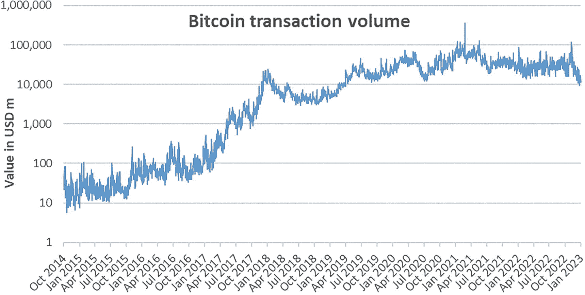

# 10. 黄金时代

> 个人投资者应始终如一地作为投资者而非投机者行事。
> 
> ——本杰明·格雷厄姆

在撰写本书时，加密资产市场尚未成熟。然而，趋势表明随着市场的发展，该行业的成熟度正在迅速提高。本章识别了暂时限制加密资产发展的特征。这些特征中任何一项的改进都会增加加密资产的基本价值。特别是，只有当这些特征达到足够的成熟水平时，加密资产的黄金时代才会到来。

## 流动性

在金融领域，流动性是指无论大小投资者，能够在不影响资产价格的情况下，以公平的市场价格快速买入或卖出资产的能力。截至 2023 年，加密资产市场的流动性远低于大型资产类别。

主要货币对的外汇市场（例如 `EUR/USD`）流动性很高。大型机构可以买入或卖出数十亿的 `EUR` 兑换成 `USD`，而对价格的影响微乎其微。整个外汇市场每天的交易额相当于数万亿美元。

相比之下，比特币在 2023 年初的日均交易量“仅”约为 260 亿美元^(⁸⁸)，不到外汇市场流动性的 1%。

然而，加密资产的流动性正随着采用率的提高而迅速增长。在过去十年中，交易量（以 `USD` 计）平均每年增长一倍以上。例如，自 2014 年 10 月以来，比特币的流动性增长了三个数量级。

一张折线图，展示了从 2014 年 10 月到 2023 年 1 月以百万 `USD` 计的价值。该线呈上升趋势，并伴有波动。

`图 10-1` 从 2014 年 10 月到 2023 年 1 月比特币交易量（以百万 `USD` 计，对数图表）

## DEX 的可访问性

虽然去中心化交易所（`DEX`）的前景多种多样，但它们尚未被公众广泛使用。它们在技术上是可访问的，但截至撰写本书时，它们非常复杂。就像 1990 年代的互联网远非用户友好一样，使用 `DEX` 需要用户具备广泛的知识。用户必须透彻理解自己在做什么，并有决心完成复杂的过程，这些过程通常看起来可疑且未经测试。

然而，开发人员正在努力简化 `DEX` 平台并降低底层风险。最终，使用 `DEX` 应该像发送电子邮件一样简单，但我们尚未达到那个目标。

## 第一层互操作性

截至 2022 年，不同第一层（例如以太坊、卡尔达诺、Solana、波卡）之间的桥接是有限的。延续与互联网的类比，这就像无法从一个网站浏览到另一个网站。经过充分测试且功能正常的互操作性桥接正在开发中，但尚未普及。

## 交易所交易基金（ETF）的可获得性

许多国家（尤其是美国）缺乏现货加密 `ETF`^(⁸⁹)，限制了众多机构投资者对加密资产类别的投资。这种限制导致该资产类别受到的关注少于本应获得的关注，因此，投入到生态系统发展上的努力也更少。美国（以及目前缺乏它的其他国家）批准主要加密资产（比特币和以太坊很可能是首批获得此类批准的加密资产）的现货 `ETF` 将为更多投资者打开大门，这将增加对该行业的审查并减少监管不确定性。

## 正式分类法

如第 7 章所述，最近引入了正式的分类法，例如 2021 年 12 月的 `DACS`。这些分类法使得基金能够根据正式结构分配投资，从而促进投资组合归因和报告。然而，全球投资者尚未采纳单一分类法。

相比之下，全球行业分类标准（`GICS`）是股票市场的全球基准。加密资产需要类似的标准。一个得到权威机构（例如 `SEC`）支持的、被广泛认可的单一分类法将为市场带来更高的透明度和清晰度。具体来说，它减少了关于特定加密资产未来将如何被监管的不确定性，特别是它们是否会被视为证券。它还有助于提高基金之间的可比性，并最终可能会证明对加密资产的更多投资是合理的。

## 监管

或许加密资产市场成熟的最大障碍是其缺乏一致的监管。虽然过度监管显然不利于有效的金融市场，但完全没有监管也不行。加密资产存在的头十年在监管方面相当于狂野西部。各国对加密资产交易的分类和税率不同，允许不同程度的准入，甚至有些国家完全禁止。在大多数司法管辖区，既没有规则也没有监督，为市场操纵（例如“拉高出货”计划）和伪装成安全投资的有害项目敞开了大门。

在这里，重大变化再次发生在 2020 年代初期。例如，欧盟法律中拟议的监管法规 `加密资产市场（MiCA）` 形成了与证券、投资中介机构和交易场所（即 `金融工具市场指令（MiFID）`）相应法规对等的加密资产版本。在拜登政府领导下，美国财政部也制定了一个国际加密监管框架。这些监管法规旨在增加投资者保护，并在各司法管辖区之间创造公平的监管环境。如果这些即将出台的法规能够在不过度扭曲市场的情况下实现其目标，加密行业将受益匪浅。

## 历史数据

与其他金融资产相比，加密资产的历史数据点相对较少。此外，市场异常迅猛的增长速度使得大量这些数据点失去相关性。每年，市场都与以往任何一年截然不同，因此数据点很快就会过时。再者，扩容解决方案、加密平台及其他加密服务仍主要处于开发和实施阶段，尚未进入广泛普及期。加密资产的相关历史越长，市场对其技术及未来的信心就越强，从而进一步推动其普及。

## 隐私意识

当社交媒体在 21 世纪初成为主流时，隐私问题几乎未被用户和公司纳入考量。无数丑闻、数据泄露和黑客攻击揭示了隐私的重要性，并逐步提升了公众对隐私的认知。这个过程仍在持续。随着大型公司以日益加快的速度收集用户更多个人数据点，用户愈发寻求能够确保数据保密与安全的解决方案。随着隐私意识的增强，区块链技术的隐私优势可能变得越来越有吸引力，从而为能提供更高私密数据安全性的加密资产增添额外魅力。

## 作为支付手段的普及

要让加密资产成为支付手段，买家必须愿意用加密资产支付，卖家必须愿意接受加密资产作为支付方式，并且必须存在易于使用的技术来连接双方。尽管听起来简单，但这些条件相互依存，如同鸡生蛋、蛋生鸡的问题。例如，只有当足够多的卖家接受加密资产并拥有相关技术时，买家才会要求用加密资产支付。同样，只有当足够多的买家要求用加密资产支付时，卖家才会采用该技术。

正如优步（Uber）必须吸引足够的司机和乘客，才能激励双方使用其平台一样，加密资产市场在蓬勃发展之前，也必须达到一个由买卖双方构成的临界规模。只有当每一方都达到临界规模，市场才会具备支付手段的功能。

## 加密生态系统

本章讨论的各项标准并非依次演进，而是并行发展的。它们并非彼此独立，而是相互交织。事实上，任何一项特性的改进，在大多数情况下都会积极影响所有其他特性。例如，更高的流动性可能会促进普及，反之亦然，而这两者都可能增加对监管的需求。同时，更清晰、更一致的监管可能会吸引更多加密参与者，从而提升流动性并增加 ETF 获批的可能性。一个完整的生态系统将它们联系在一起，各自发挥特定功能，使这一新型资产类别趋于完善。

在参与者方面，生态系统包括创新者（编程和开发人员）、安德森·霍洛维茨（Andreessen Horowitz）等风险投资家、维萨（VISA）或高盛（Goldman Sachs）等机构、数字商会（Chamber of Digital Commerce）等非政府组织、学者、政府、监管机构以及用户。每个参与者都提升了整个加密领域的接受度，这惠及所有其他参与者。

加密的黄金时代并非在某个特定事件发生时突然到来。相反，它是一个持续的过程，依赖于一系列特性和参与者，所有这些并行发展并相互促进。加密市场的基本面将在多个方面同步改善。

然而，要使看涨的加密资产投资论点得以实现，必须有一个催化剂：一个改变格局的特定事件。例如，2008 年房地产市场泡沫的破裂就是随后经济崩溃的催化剂。它暴露了一个过热的市场，其中存在着大量岌岌可危的高杠杆头寸。市场不仅不可持续，而且需要某个事件来引发修正。

过去，特斯拉（Tesla）在 2021 年初接受比特币作为支付方式并将其纳入公司 treasury，就是一个加密资产催化剂。这些事件引发了随后加密市场的上涨行情。同样，虽然黄金时代不依赖于任何特定事件，但一个或几个催化剂很可能点燃市场下一轮上涨的导火索。

### 关键概念

截至 2023 年初，加密资产市场尚未成熟。然而，正在进行的重大发展正在迅速提升其成熟度。许多特性并行发展，相互影响，共同促成一个更发达、更可持续、更安全的加密市场。这些特性包括市场流动性、平台可访问性、互操作性、投资工具可用性、正式分类体系以及监管。只有当这些特性对大多数用户来说达到足够的发展状态时，加密资产才能通过大规模普及进入其黄金时代。

## 延伸问题

下一次加密牛市（下一轮上涨市场的开始）可能的催化剂是什么？

哪些催化剂会延迟加密黄金时代的到来？它们能否完全否定看涨的加密投资理论？

美国和欧盟可能会采纳哪些即将出台的加密市场监管特征？这些特征将如何影响加密资产的黄金时代？

鉴于加密行业目前的成熟度和开发速度，到 2025 年和 2030 年，其在活跃用户数量方面将达到何种普及程度？

脚注 1 2