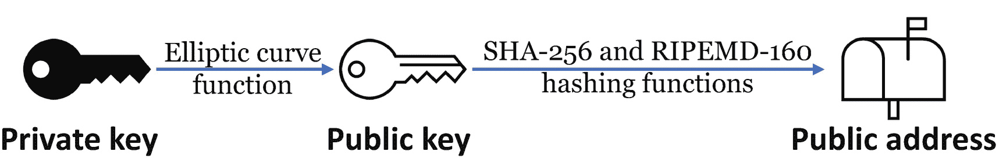
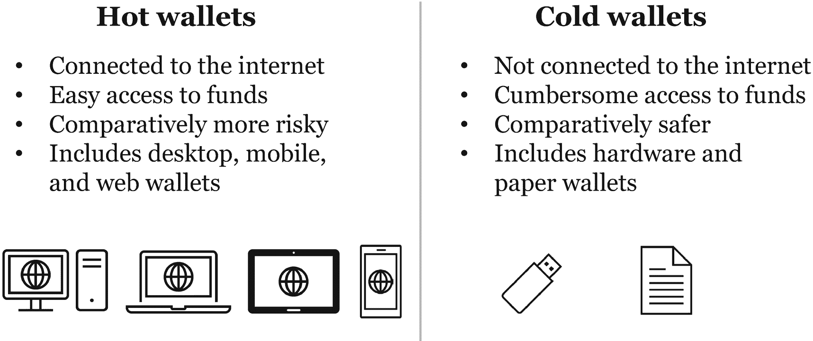
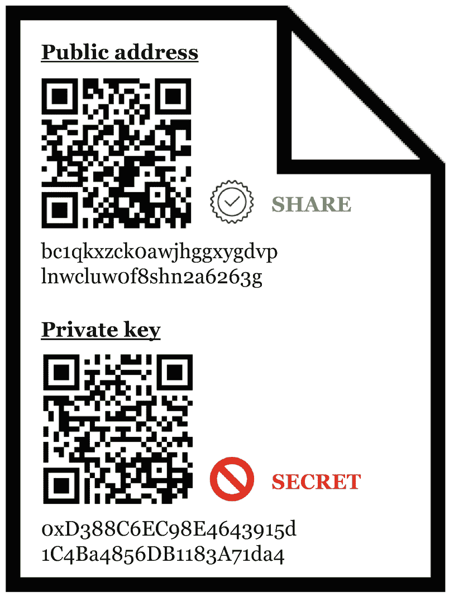
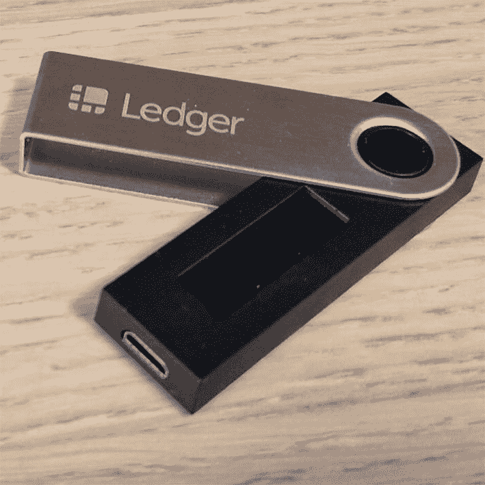
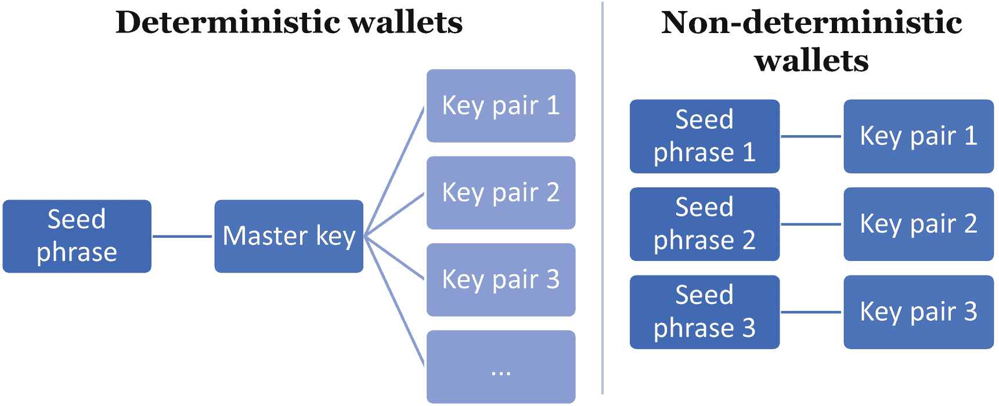
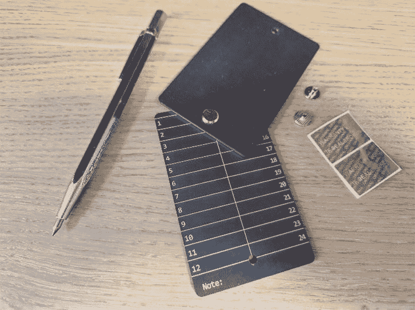
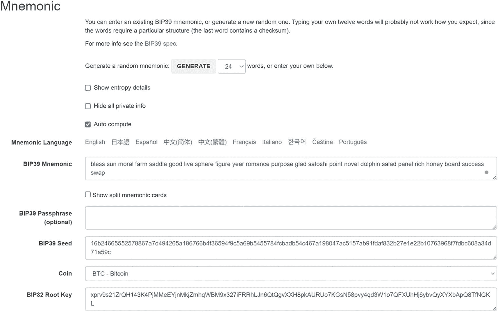
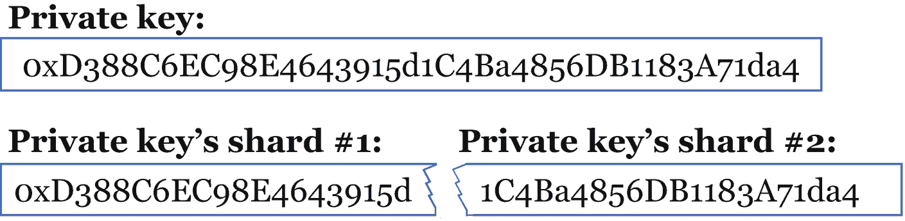
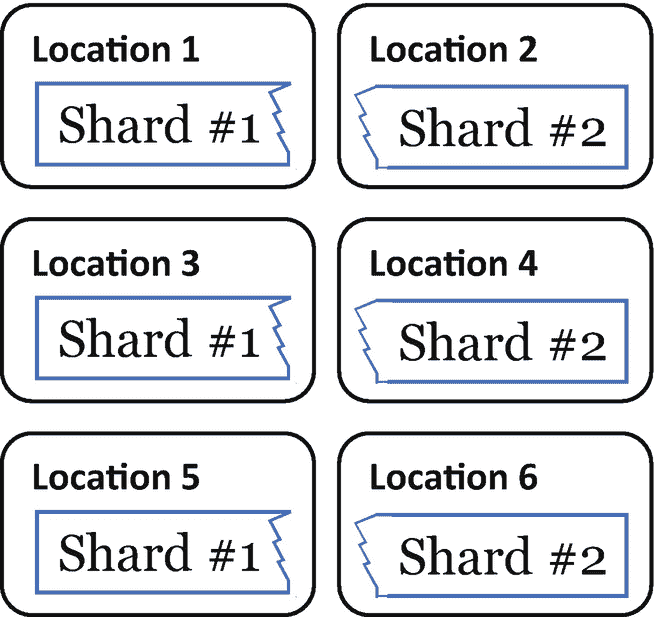

# 11. 投资工具

> 重要的不是你赚了多少钱，而是你保住了多少钱，它为你工作得有多努力，以及你能为多少代人守住它。
>
> —罗伯特·清崎

加密资产的投资者需要选择投资方向。从直接在区块链上进行投资，到委托托管方代为投资，有多种选择。本章将探讨这些选择及其带来的益处。

### 密钥与地址

回顾第 6 章介绍的区块链机制，`私钥`可以访问发送到区块链上对应公地址的加密资产。`公钥`由`私钥`生成，而`公地址`由`公钥`生成。这一生成过程通过加密算法实现。从输入推导输出是直接的，但从输出反推输入则几乎不可能（至少在现有技术条件下）。



图示：通过椭圆曲线函数从`私钥`生成`公钥`，并使用`SHA236`和`RIPEMD160`哈希函数生成`公地址`。

**图 11-1**

`公地址`（发送方发送加密资产的地址）是`公钥`的函数，而`公钥`本身又是`私钥`的函数。图中展示的是比特币系统中从`私钥`到`公地址`的生成函数。

这些密钥仅仅是一长串随机字符，存储在“数字钱包”中——这是类比于存放现金和实体信用卡的物理钱包。

丢失`私钥`意味着失去对`公地址`内容的访问权限。因此，安全保管密钥至关重要。与直觉相反，钱包并不存储真正的货币。例如，比特币钱包并不持有用户的比特币。这些比特币的所有权记录在比特币区块链上，而钱包仅持有能够移动对应比特币的密钥。因此，加密资产钱包更恰当的类比是钥匙扣。不过，按照行业惯例，我们仍将使用*钱包*一词。

不同类型的钱包具有不同的风险特征。尤其是，加密投资者需要在便捷访问资金与为此便利所增加的更高风险之间权衡利弊。

### 热钱包与冷钱包

将私钥存储在线或连接互联网的设备上的钱包称为`热存储钱包`，简称`热钱包`。相反，将私钥离线存储的钱包称为`冷存储钱包`，简称`冷钱包`。

使用热钱包进行投资面临更高的盗窃风险，因为成功入侵的黑客可能获取到你的`私钥`并盗取资金。例如，黑客可能发送间谍软件访问你的机密数据，或使用恶意应用诱骗你交出`私钥`。另一方面，由于冷钱包处于离线状态，仅在交易时偶尔连接互联网，因此相对更安全。

热钱包包括桌面钱包、移动钱包和网页钱包，而冷钱包包括硬件钱包和纸钱包。当然，无论是否在线，热钱包和冷钱包都可以随时接收加密资产。再次强调，加密资产并非发送到钱包，而是发送到区块链上的一个地址。钱包仅包含访问该地址内容的密钥。



图示：第一列包含桌面电脑、手机、笔记本电脑和平板电脑的示意图，第二列包含 U 盘和纸质文档的示意图。第一列和第二列分别列出了热钱包和冷钱包的特性。

**图 11-2**

热钱包与冷钱包主要差异总结。

在某种程度上，热钱包和冷钱包分别类似于活期存款账户和储蓄账户。热钱包类似于活期账户，通过便捷访问促进日常货币使用。冷钱包类似于储蓄账户，支持财富的长期存储，但访问起来较为不便。

纸钱包是冷钱包的一种特定形式。它是一份打印文档，包含两条信息：用于接收特定加密资产的`公地址`和用于访问该地址内容的`私钥`。当以最高安全级别创建时，它们是在从未连接过互联网的计算机或智能手机上生成的(⁹⁰)。这种与互联网的完全隔离使此类钱包更能抵御黑客攻击。此外，它们通常包含与代表`公地址`和`私钥`的字符串对应的二维码，以便通过应用进行使用。



图示：一张纸片，细节如下。顶部和底部分别是`公地址`和`私钥`，其下各有两个二维码以及一串字符。`公地址`可以共享，但`私钥`必须保密。

**图 11-3**

纸钱包示例（即一张包含两串看似随机字符的纸：`公地址`和`私钥`），用二维码表示以方便使用。

钱包类型的区分有时也采用不同的名称（即软件钱包（热）、网页钱包（热）与硬件钱包（冷））。事实上，这些名称更直观，因为它们暗示了热钱包是通过软件运行的，例如安装在桌面或移动设备上的应用，或通过在线访问。

为了提高安全性，软件钱包通常将在线和离线部分分开。待处理的交易首先移至离线环境，在那里使用`私钥`进行签名。然后，软件仅在线广播该签名的哈希值。这样一来，它永远不会直接在网络上暴露`私钥`。



硬件钱包的照片。

**图 11-4**

`Ledger Nano S`硬件（冷）钱包。此类钱包通过桌面应用提供用户界面，支持离线签署交易，并仅在线提交签名的哈希值。

### 托管钱包与非托管钱包

根据钱包是否为托管性质，它们之间也存在重要区别。托管是指最终用户是否拥有钱包的密钥。具体来说，托管钱包是指由第三方代你持有密钥的钱包。要访问你的资金，你必须信任托管方，并通过网站或应用上的传统登录名和密码进行注册。例如，这是许多在线交易所采用的模式。因此，你的投资直接取决于第三方的安全基础设施。结果，如果托管方腐败、被黑客攻击或被当局强制停止运营，你可能会损失资金。另一方面，如果你丢失了密码，可能可以通过向第三方证明你的身份来重置密码。

与此相反，钱包可以是`非托管`的，也称为`自我托管`。在这种情况下，用户自己拥有其私钥。无需信任任何第三方，因为用户真正拥有其资金。这种区别证实了加密社区使用的一个重要口号。

> 不是你的密钥，就不是你的币。

对于信奉加密资产“无需信任”价值主张的用户来说，非托管钱包是首选。与大多数托管交易所不同，它们通常不要求`KYC`（了解你的客户）流程，因此可以给用户提供更高程度的隐私。然而，对于持有资金而言，它们通常不如通过托管方那样用户友好。此外，这种选择的风险特征也不同：如果用户丢失了`私钥`，相应的资金将永远无法找回。

### 中心化与去中心化平台

用户加入中心化平台时，通常会自动设置托管钱包。尤其值得注意的是，2021 年，约 99%的加密资产交易是通过中心化平台完成的。^(⁹¹) 此类平台的功能类似于传统的在线证券交易所：用户将资金发送到一个私有平台（例如，使用信用卡或借记卡），然后可以在线进行投资。其用户友好性可能是其占据市场主导地位的原因。通过此类平台进行交易确实要容易得多，并且对于普通用户来说，与熟悉的平台更加相似。

此外，中心化平台还因属于`交易所`还是`经纪服务`而有所不同。交易所允许用户在公开交易所上直接进行相互交易。相比之下，经纪服务平台是该平台上所有交易的对手方。著名的中心化加密资产交易所包括`Binance`、`Kraken`和`Bitstamp`。著名的加密资产经纪服务包括`Coinbase`^(⁹²)、`eToro`和`Robinhood`。

与中心化平台相反，也存在去中心化交易所，它们能够实现更纯粹的点对点交易，尽管截至 2023 年，它们仍属特例。去中心化交易所（DEX）与其去中心化加密资产对应物相似，因为交易的另一方没有中央机构，甚至没有促进交易的中央机构。它们通常是开源项目，通过智能合约将买方与卖方、贷方与借方匹配起来，无需独特的全知全能监管。遵循最初的加密资产理念，它们是去信任化的。

在某些情况下，DEX 依赖用户生成的流动性池，通过奖励来激励用户提供流动性。这样，平台可以成为自动做市商（AMM）。换句话说，它们不再需要依赖订单簿。使用 AMM 时，价格由数学公式而非特定的买卖订单驱动，从而增加了无数代币的流动性。最早的 DEX 之一`Uniswap`，通过其 AMM 功能，在推动 DEX 行业发展方面发挥了关键作用。尽管其第一个版本于 2018 年推出，但第二个版本在 2020 年通过`Ethereum`实现了任何代币的直接兑换，从而改变了游戏规则。任何加密资产都可以去中心化地兑换成任何其他加密资产。`Uniswap`的快速追随者也成长为生态系统中最大的 dApp 之一。

尽管 DEX 更符合加密资产的去中心化价值主张，但相比于中心化交易所，它们使用起来更具挑战性，并且更容易遭受诈骗。它们要求用户对流程有更多了解，并需要更多时间来熟悉。另一方面，它们免除了中心化交易所强制收取的部分费用、`KYC`和`AML`^(⁹³)流程，从而提供了更高的隐私性。它们还提供了更高的安全性，因为资金分散在众多钱包中，相比中心化交易所，它们对黑客的吸引力较小。然而，尽管 DEX 可能是未来加密资产的首选交易平台，但它们尚未成熟，需要用户谨慎行事。与去中心化交易所相比，中心化平台的使用量要大得多，这证明许多用户目前更看重托管服务的易用性，而非去中心化的额外好处。

DEX 之间的区别在于它们所基于的底层协议（例如，`Ethereum`或`Binance Smart Chain`）、其关注点（例如，ERC-20 代币）以及它们提供的特定功能（例如，冷存储和双因素认证）。

除了中心化和去中心化交易所之外，混合交易所结合了两者的优点。具体来说，它们提供了中心化交易所的易用性、速度和流动性，同时具备去中心化交易所的点对点和隐私功能。它们通常既有链上部分（如 DEX），也有链下部分（如 CEX）。混合加密资产交易所包括`BitMax`和`CEX.IO`，各自提供中心化和去中心化的交易选项。

在选择交易所时，应考虑可用选项中以下特征。如同钱包一样，许多网站会根据部分或全部这些特征对加密货币交易所进行排名。

1.  托管状态
2.  交易成本
3.  提现成本
4.  交易量
5.  获得被动收入的可能性
6.  使用衍生品（如期指或期权）的可能性
7.  将资金兑换为法定货币的可能性
8.  交易限额（每日存入/提取限额）
9.  隐私级别（是否存在 `KYC` 和 `AML` 流程）
10. 易用性

#### 用户界面与交易所

虽然交易所有时会将钱包作为其服务的一部分，但钱包和交易所是两个截然不同的概念。具体来说，用户可以通过多种不同方式设置钱包，并独立选择连接此钱包的交易所。例如，用户可以设置一个网页钱包或硬件钱包，并将其连接到中心化或去中心化交易所，或者不连接到任何交易所。

软件钱包（例如，`Electrum`、`Mycelium`、`Exodus`）、网页钱包（例如，`Metamask`、`MyEtherWallet`、`Bitcoin.com Wallet`、`Trust Wallet`、`Coinbase Wallet`）或硬件钱包（例如，`Ledger`、`Trezor`、`KeepKey`、`Coldcard`）的用户界面与任何交易所都是独立的。例如，即使`Trust Wallet`也独立于交易所`Binance`，尽管`Binance Holdings Limited`自 2018 年收购以来一直拥有它。同样，`Coinbase Wallet`独立于`Coinbase`交易所，尽管它们由同一母公司`Coinbase, Inc`拥有。它们仍然是独立的产品，与相应的交易所没有直接关联。因此，这些钱包的用户界面不应被误解为交易所。推而广之，自托管钱包的用户界面并不意味着存在与经纪服务相同的第三方风险（例如，腐败、欺诈或当局干预的风险）。

#### 确定性钱包与非确定性钱包

钱包的另一个区别在于它们是否是确定性的，这仅适用于包含多个密钥对（私钥和公钥）的钱包。每个密钥对都有自己的公共地址。这样，单个用户可以在区块链上使用多个地址，就像单个用户可以在同一家银行拥有不同的银行账户一样。

在确定性钱包中，一个主密钥可以创建多个密钥对。主密钥通常是一个助记词短语（将在下一节中解释），并且可以生成，例如，一百个密钥对。在这种钱包中，用户只需备份一次：即主密钥。一旦他拥有主密钥，他就可以访问所有密钥对以及相应地址上的所有加密资产。

在非确定性钱包中，每个密钥对都是独立的。因此，用户必须为每个钱包密钥创建单独的备份。

确定性钱包还包含其他子类别。例如，分层确定性（HD）钱包能够基于层级结构中的另一个私钥生成一组私钥。由主密钥创建的每个私钥本身也是一个主密钥。这对于具有多层层级结构的企业结构可能很有用，每一层都负责管理多个地址。



一个关于确定性与非确定性钱包的 2 列图示。在第 1 列中，多个密钥对由一个单一的助记词短语创建。在第 2 列中，密钥对 1、2 和 3 分别由助记词短语 1、2 和 3 创建。

**图 11-5** 确定性与非确定性钱包的图示

### 助记词

`助记词`，也称为`种子词`、`恢复短语`或`记忆短语`，是一串按特定顺序书写的随机单词（通常是 12 或 24 个简单单词）。它们作为输入被输入到一个助记词转换器中，该转换器是一种算法，可将其转换为特定加密资产的私钥，如图 11-7 所示。⁹⁴ 每个区块链对其私钥都有特定的格式，例如其起始字符或写入时的字节数。因此，例如将比特币发送到以太坊地址，要么无法成功，要么资金将永远丢失。

一个助记词可能如下面这 24 个单词所示。

1. 祝福
2. 太阳
3. 道德
4. 农场
5. 马鞍
6. 良好
7. 生活
8. 球体
9. 图形
10. 年份
11. 浪漫
12. 目的
13. 高兴
14. 中本聪
15. 点
16. 小说
17. 海豚
18. 沙拉
19. 面板
20. 富有
21. 蜂蜜
22. 板子
23. 成功
24. 交换



一张长方形铝合金外壳的照片，有两列共 24 个空位。旁边是一支雕刻笔和防篡改封条。

图 11-6

专为 24 字助记词恢复设计的铝合金外壳，配有雕刻笔和防篡改封条。该外壳防火、防水、防震且耐腐蚀。它是一种纸（冷）钱包（在这种情况下，并非由纸制成）。

比特币社区达成共识，使用一份包含 2048 个（即 2¹¹）单词的官方列表作为比特币私钥的基础，以方便其存储。除英语外，其他语言也存在类似的列表。一套规则使得这些单词简单且不易混淆。例如，该列表不包含有多种拼写的单词，也不包含存在于其他语言对应列表中的单词。此外，没有两个单词以相同的前四个字母开头，因此知道每个（12 或 24 个）助记词的前四个字母就足以恢复一个人的私钥。另外，最后一个单词是一个校验和，它依赖于所有其他单词，以确保助记词的有效性。每个单词还与 2048 单词列表中的一个数字相关联，因此知道一个人的（12 或 24 个）数字列表（以及所选列表，即语言）是知道其助记词的一种替代方法。出于这个原因，一些硬件钱包简单地列出与助记词对应的数字，这些数字可以恢复用户的私钥。



屏幕截图显示了生成助记词的设置。选中了自动计算选项以生成随机助记词。文本框用于 BIP39 助记词、BIP39 密码短语、BIP39 种子、币种和 BIP32 根密钥。

图 11-7

比特币助记词、种子短语和私钥生成器。（来源：[`https://iancoleman.io/bip39/`](https://iancoleman.io/bip39/)）

### 钱包附加功能

区块链钱包的另一个可能功能是`主公钥`，它提供对钱包中所有公钥的访问权限，但无权访问其对应的私钥。主公钥的持有者可以查看钱包中所有地址的余额，但无法转移相应的资产。例如，这对于会计和审计很有用，因为可以将主公钥与审计员共享而不会危及资金，只会涉及隐私问题。

`多重签名钱包`是另一个有用的安全功能。它需要来自不同私钥的多个签名才能提交交易。这是双因素认证的一种形式，就像一个由不同人持有多个锁和钥匙的储物柜。每个人都需要获得其他人的批准才能打开储物柜。例如，一家公司的加密钱包可能要求所有董事会成员在提交交易前签名。或者，也可以要求部分而非全部签名，例如五分之三。多重签名钱包具有更高的安全级别，因为不同的私钥位于不同的位置，从而避免了单点故障。

### Bitcoin Core

有一种特定类型的钱包值得特别提及。2009 年，中本聪发布了第一个加密钱包 Bitcoin-Qt，作为开源代码。现在称为 `Bitcoin Core`（或 `Satoshi 客户端`），它是比特币网络的“官方”代码，由比特币基金会维护、开发和推广。本质上，`Bitcoin Core` 是一个桌面钱包，同时也是`完整的比特币客户端`或`全节点`。

全节点将整个比特币区块链⁹⁵ 下载到您的计算机上，并永久性地与网络的其他部分同步。因此，它有助于网络增强去中心化。然而，运行一个比特币节点并不需要拥有一个完整的比特币客户端。与全节点不同，`轻客户端`（或`轻量级客户端`或`简单支付验证客户端`）仅从区块链下载最后几个区块。它下载的区块越多（客户端“越深”），客户端的可信度就越高。全节点和轻客户端是在存储空间和对底层区块链完整性的信任之间的一种权衡。

此外，`Bitcoin Core` 具有多层安全机制，并且比特币基金会不断对其进行改进，以使其安全性保持在最先进水平。

### 钱包安全

确保钱包提供商值得信赖对于个人资金安全至关重要。有几项资源有助于谨慎选择钱包。例如，非营利性网站 `Bitcoin.org` 提供了一份值得信赖的比特币钱包列表，可根据基本和期望功能（例如，硬件钱包、多重签名钱包）进行筛选。⁹⁶ 此外，无数其他在线资源列出了其他加密资产钱包的优缺点。

### 安全存储私钥

对于加密资产的自我托管，另一项基本安全措施是明智且可靠地存储您的私钥。一方面，您可能倾向于保留多个私钥副本以最大程度地降低丢失风险（丢失将意味着失去所有资金）。然而，另一方面，您保留的副本越多，其中一个被盗的风险就越高（这也意味着您将失去所有资金）。

缓解这一困境的一种方法是通过`分片`。您可以将您的私钥拆分（或“分片”）成两个（或更多）部分，而不是将整个私钥保存在一处。这样，即使有人窃取了您的私钥的一个分片，您的资金仍然没有风险。小偷需要所有分片才能重建私钥并访问您的资金。


文本行显示以下内容。顶部是一个由字符和数字组成的私钥。底部是私钥，它被分为私钥分片 1 和私钥分片 2。
图 11-8 将私钥拆分为两个分片

例如，您可以将两个分片中的每一个都保留三份副本，锁定或隐藏在六个不同的位置（每个分片的每个副本对应一个位置）。这样，任何单个副本的丢失或被盗都不会危及您的资金。

当然，您也可以对您的助记词而不是原始私钥执行相同的操作。或者，在此方法的基础上，您还可以选择记住您的密钥或助记词的一部分，以防止它们被盗。


图表显示了分片副本在多个位置的分发情况。分片 1 位于位置 1、3 和 5。分片 2 位于位置 2、4 和 6。
图 11-9 将分片副本分布在多个位置可同时降低私钥被盗和丢失的风险。

## 核心概念

投资加密资产有多种方式。具体而言，可以使用第三方（托管人），也可以设置自己的钱包。虽然大多数交易依赖前者，但后者更符合加密资产背后去中心化、无需信任的理念。托管钱包依赖第三方持有用户的私钥。相比之下，非托管（或自我托管）钱包使用户能够真正拥有自己的资金，因为其他人无法获取。

钱包有不同类型：热钱包连接互联网，便于频繁交易；而冷钱包离线，为用户提供更高的安全性。行业内许多最新发展带来了新功能，例如确定性钱包、多重签名和主公共密钥。这些功能通过满足企业和机构的需求，推动了行业的发展。

选择钱包或交易所应谨慎，以确保最佳适配性和高安全性。同样，安全存储私钥至关重要。

## 延伸问题

对于私人投资者、私人交易者、专业个人投资者、个人专业交易者、比特币挖矿公司、非加密领域但管理内部资金的传统公司、以及非加密领域但支持加密资产支付的传统公司，哪种钱包类型最为合适？

投资者可以采用哪种创造性方法来保护私钥免遭丢失和盗窃？

设置私钥最安全的方式是什么？

```
脚注 1 2 3 4 5 6 7
```