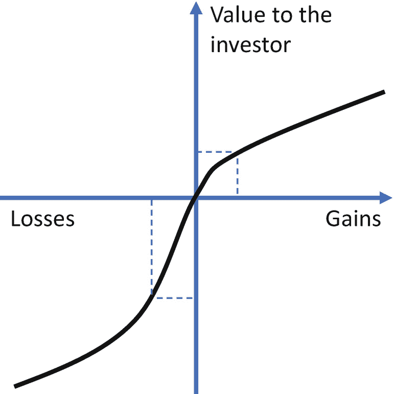

# 12. 投资策略

> *衡量投资成功与否的最佳标准，不是你是否跑赢了市场，而是你是否制定了一项财务计划和一套行为纪律，让你有可能实现目标。*
>
> ——本杰明·格雷厄姆

关于投资的文献浩如烟海、种类繁多，有时甚至自相矛盾。无论如何，提供一个完整的投资框架远非本书所能涵盖。因此，本章仅简要概述加密资产新投资者的基本原则，并提醒一些尤其适用于此类资产类别的注意事项。本章可能无法满足资深投资者的期望，建议他们跳过。

首先，投资是高度个人化的事情。投资者有不同的投资期限、收益目标、风险承受能力、风险承担意愿、法律义务、税率、偏好（例如 ESG）以及其他独特特征。因此，本章甚至本书中的见解不应被视为对任何投资者的建议。相反，它们仅旨在为投资者在加密资产方面的教育做出贡献。潜在投资者应仔细评估自己在这些特征上的位置，并考虑咨询专业的投资组合经理以帮助制定投资策略。

其次，市场处于不断变化之中。债券、股票、货币和大宗商品等资产类别之间的关系并非固定不变，而是随时间变化。此外，它们的估值取决于其他市场参与者的看法和判断，而非特定的公式或模型。特别是，加密资产的发展速度超过任何其他资产类别，并且尤其容易受到其他参与者看法的影响。应谨慎看待本章内容，并根据其在特定时间点及面对市场环境变化时的相关性提出质疑。

尽管如此，制定投资策略至关重要。尤其对于仍波动剧烈且易受市场变化影响的资产类别而言，投资策略有助于投资者专注于长期目标，并防止他们对新闻或市场波动做出情绪化反应。

## 低买高卖

许多新投资者决定在最糟糕的时机建立头寸。在加密资产市场中尤其如此，因为新闻往往在某个市场资产价格大幅上涨后才广泛报道。例如，比特币价格出现数量级增长或其他加密资产涨幅更大时，往往会登上头条。结果，潜在投资者害怕错过机会。当价格明显高于其长期趋势时，他们往往被吸引入市，而这之后通常会迅速跟随回调。特别是在 2013 年、2017 年和 2021 年价格飙升（见第 9 章）之前，有许多新入市者加入。

尽管这可能是显而易见的，但通过投资实现资本收益在于低买高卖。虽然听上去简单，但许多新投资者却做不到。具体来说，当价格显著高于其长期趋势时，入市时机通常不合适。要低买高卖。

这个简单的目标有时需要采取逆向策略：在市场情绪低迷时投资，在情绪非理性狂热时退出。例如，第 9 章介绍的恐惧与贪婪指数有助于评估加密市场周围的普遍狂热程度。此外，`相对强弱指标`（`RSI`），尽管是一种短期工具，但作为动量指标，也能提供有价值的信息，判断资产当前是超买（可能是卖出良机）还是超卖（可能是买入良机）。这些指标过去在加密资产的买卖时机方面往往能提供有价值的建议。然而，这些建议并非始终准确。因此，它们不应成为任何投资决策的唯一依据。

## 把握市场时机

尽管财务分析、趋势、模型和新闻是有助于判断经济周期所处位置的实用工具，但准确把握市场时机是不可能的。由于固有的不确定性，没有人知道市场何时见底或见顶。因此，力求以最低价格买入并在市场最高点精确卖出可能是徒劳的。另一种方法是平均成本法。

## 平均成本法

意识到无法把握最佳进出点，投资者可以依赖多次进出。例如，投资者可以每月投入可用资本的 1%或固定金额。这个过程称为“平均成本法”，是一种时间上的分散化投资。它降低了在错误时间投入大量资金的可能性。平均成本法在本杰明·格雷厄姆 1934 年出版的、已成为行业标杆的价值投资著作《聪明的投资者》第 2 页中已有阐述 [42]。

此外，平均成本法限制了情绪化交易带来的风险。加密资产市场比其他市场情绪化程度更高，因为加密资产的基本面不如传统资产类别那样被充分理解。同时，相对较低的流动性使得大额交易对价格的影响更大。将买入和卖出分散到不同时间似乎是更谨慎、更值得推荐的方法，尤其是对加密资产而言。

但请注意，纯粹从数学角度看，平均成本法并不优于一次性大额购买（假设有足够的流动性吸收购买行为，而不会对价格产生实质性影响）。

## 过滤噪音

加密资产行业的超常增长引发了围绕这类新型资产投资的狂热。结果，行业相关信息多到无人能处理。这些信息来自各种渠道，从学术研究到公众人物，从企业到监管机构。尤其是传统新闻媒体，即便不了解加密资产行业的基本原理，也喜欢对其评头论足。例如，关于比特币挖矿对环境有害的论调就是这样传播开来的。正如第 3 章所述，这种论调既不准确又带有偏见；综合来看，相反的观点更可能接近真相。

面对一个快速增长且被误解的行业，从海量噪音中筛选有用信息至关重要。谨慎的投资者应确保选择高质量、信息可靠的来源。

此外，主动寻找与自己观点相悖的信息至关重要。勤勉的投资者应当主动寻求那些不同意其投资论点且学识渊博的人的观点。该行业的突破性潜力吸引了一批狂热的拥护者，他们对推广加密资产的投入近乎宗教般的狂热。同样，该行业也有强烈的反对者，将整个行业斥为骗局。只听信加密资产的传教士（无论是支持者还是反对者）都是危险的，因为这会使个人观点产生片面性。结果，要么高估了加密资产的潜在回报，要么低估了其风险。

最终目标不是为了向任何人证明某个观点的正确性，而是为了达到尽可能高的市场理解水平，从而做出明智的投资决策。过滤噪音意味着忽略短期价格波动以及廉价或有偏见的媒体头条，专注于基于高质量、独立研究信息的长期博弈。

## 税务

税务问题因司法管辖区而异，差异巨大。熟悉当地税务法规（以及可能需要纳税的其他司法管辖区的法规）对于决定是否以及如何进行交易至关重要。加密资产税可能包括所得税、资本利得税和财富税。通常，加密资产被归类为商品、证券（如股票和债券）、数字财产或外币。这种出于税收目的的当地处理方式从根本上影响了如何处理该资产。

此外，税务处理可能因持有期而异。例如，在某些司法管辖区，一年内出售的加密资产可被视为投机行为而需征税，而持有超过一年则被视为投资而无需征税。另外，某些出售行为可能触发税务事件，而其他则不会。例如，将比特币这类加密资产换成 `USDC` 这样的稳定币可能不会触发税务事件，但换成法定货币则会。由于其影响，许多其他当地税务特性可能建议采用不同的交易方式。此外，规则也在快速演变。勤勉的投资者应随时关注当地法规，以决定如何最优地管理加密资产组合。

如果未考虑财务税务因素，处理像加密资产这样波动的资产可能会很危险。例如，一个粗心的投资者可能在十二月卖出加密资产，并通过此次出售获得巨额资本利得。将全部收益立即再投资于另一种加密资产，可能会让他陷入风险。假设这另一种加密资产（在这个行业中时有发生）价值大跌，那么投资者可能没有足够的流动资金来支付最初那笔巨额资本利得所应缴的税款。当税款在次年到期时，他可能不得不在非常不利的时机出售资产来支付应缴税款。

对加密资产税收感兴趣的读者可以参考 Schmidt、Bernstein、Richter 和 Zarlenga 合著的详尽著作《加密资产税收》（第二版，2023 年），该书涵盖了超过 40 个国家的加密资产税法[3]。

## 借款作为出售的替代方案

需要即时流动性的投资者，在出售加密资产之外还有其他选择。例如，与其在不利时机出售加密资产，不如以其为抵押进行借款。只要贷款利率低于加密资产的升值率，投资者通过借款就能获得更大利益。此外，借款所用货币的通货膨胀率越高，对借款人越有利。原因在于，所欠资金未来在购买实际商品和服务方面的价值将会更低。

## 行为与心理偏差

传统投资已经需要情绪自律和了解自身局限性，而加密资产投资则将这两项要求提升到了新的高度。确实，价格频繁且往往非理性的双向波动，不断地考验着投资者的心理素质。面对这种波动性，情绪抽离至关重要。无论好坏，这并不是人人都能掌握的技能，对于那些忽视其必要性的人来说，可能会产生严重后果。除了情绪自控，了解自身的心理偏差，对于在一个动态行业中管理波动的投资组合尤为重要。

经济学之父对此有如下论述。

> *如果你不了解自己，股市会是一个让你付出高昂代价来认识自己的地方。*
>
> ———亚当·斯密

本节涵盖了一些常见的情绪偏差和认知错误，勤勉的投资者在做出投资决策时应予以考虑。这些偏差和错误在一定程度上解释了，为何原本理性的投资者会做出不当的投资决策，从而为交易的对手方创造了机会。

### 确认偏误

如果你相信灰猫比黑猫多，那么每次看到灰猫都会强化你的信念，而不管这信念本身是否准确。这种倾向被称为`确认偏误`，我们大多数人都自然而然地受其影响，尽管常常不自知。毫不意外，这种偏误在投资中也会显现。

例如，为了证明自己对于某个（类）特定资产的理论而寻找依据，可能导致投资者只考虑部分可用信息。相反，与自身投资论点相冲突的信息，即使包含了投资者应考虑的关键数据要素，也会被忽略。

我们与生俱来的`确认偏误`可以通过从不同渠道寻求多样化信息，并主动寻找与自身投资论点相悖的信息来减轻。这特别意味着要批判性地思考自己为何以及如何可能犯错，而不是努力证明自己必定正确。

### 损失规避

社会科学研究广泛支持的另一偏见是`损失规避`。具体而言，研究表明，对大多数人来说，损失带来的痛苦程度要远大于同等收益带来的满足感。换句话说，赚取 100 美元的快乐小于损失 100 美元的痛苦。

这一简单事实对投资组合管理有着重大影响。它尤其支持了价值投资理论，即投资价格可能低于其经济价值。例如，面对波动性极高的投资，投资者往往会避而远之，这种倾向被称为`短视损失规避`。事实上，当面临两种高波动性证券的投资选择，且其中一种很可能价值归零时，大多数投资者更倾向于不投资。这意味着，即使另一种投资的巨额收益可能使整体组合仍具吸引力，情况依旧如此。`损失规避`自人类有史以来就一直是行为的一部分，并且很可能将长久存在[43]。

一张展示投资者价值与损失/收益关系的四象限折线图。从第三象限到第一象限呈上升趋势，表明与收益相比，损失的程度更高。

图 12-1

`损失规避`效应的可视化呈现，其中在投资者眼中，损失的影响远大于同等价值的收益。

这种偏见对于规模较小且流动性较低的资产类别（如加密资产）尤为重要，因为它们比成熟资产类别的波动性更大。为缓解这种偏见，可以考虑整体投资组合，并关注投资的潜在长期收益，而非投资组合中任何特定部分的短期风险，这或许会有所帮助。

### 禀赋效应

另一种偏见是`禀赋效应`，在此情境下类似于现状偏见。它表明，我们对自己已经拥有的东西，其估值高于尚未拥有的东西。例如，一个人可能愿意以 5 美元卖掉一个特定的杯子，但不愿意花超过 2 美元去买它。理性会认为买卖的阈值应相同：即由该物品带来的效用所对应的价格。然而，社会科学的经验证据表明，拥有某物会使其对所有者更有价值。

在投资中，这种偏见具有重要影响。例如，仅仅因为你过去购买过某种加密资产，并不意味着当情况发生变化时，它仍然是你投资组合中的最优选择。然而，人们往往倾向于保持现状，即便这可能导致不恰当的资产配置。

### 保守主义偏见

`保守主义偏见`是导致`禀赋效应`的可能原因之一。当投资者对某件事形成观点后，改变这一观点需要付出不成比例的努力。例如，当投资者根据初始信息得出结论，认为某资产价格将上涨时，更新这一结论可能需要的信号和信息比得出原始结论时还要多。这种偏见与加密资产直接相关，因为大多数传统投资者不愿对整个基于法定货币的货币模型提出质疑，而该模型在过去半个世纪一直是投资行业的支柱。

### 锚定效应

锚点（过去达到的特定价格）常常成为未来发展的参照点，即使这并不理性。例如，当比特币突破 69,000 美元大关后，随后的任何价格都会与这个峰值比较：“比特币下跌了那么多百分比”，“比特币损失了那么多价值”等等。然而，很少有人提到，就在 18 个月前，比特币的价格还低于 4,000 美元。无论资产的基本价值如何，将价格锚定在历史水平上要容易得多，这就是许多投资者如此做的原因。

勤奋的投资者不应主要考虑一项资产过去达到过什么价格，而应思考其基本价值是多少。因此，应该摆脱任何锚点，这些锚点可能而且常常是由市场的非理性反应造成的。

### 过度拟合偏见

虽然数据有助于金融分析，但也可能被有意或无意地误用。具体来说，如果分析师发现并不存在的模式和关系，他们就存在`过度拟合偏见`。例如，他们可能强行让一个模型或理论去拟合特定数据集，即使数据本身并不自然支持该模型或理论。

### 数据挖掘偏见

先前从数据中得出的发现也可能使任何新的分析产生偏差。例如，如果新研究基于先前报道的证据，或者许多分析使用相同的数据库，数据分析就可能产生偏差。如果在一个被过度使用的数据集中，数据偶然显示了一种特定模式，那么因为众多研究都强调它，这种模式可能被过分依赖。

### 样本选择偏见

相比之下，某些数据可能被系统性地排除在外，例如由于缺乏可用性或提取该信息的难度。容易获得的东西并不比难以获得的东西更重要。

为了减轻这些基于数据的偏见，勤奋的投资者应努力从客观、独立、原始的来源收集完整的原始数据集（例如，直接从区块链收集数据，而不是使用第三方报告的数据），并得出自己的结论。

### 幸存者偏差

另一个与数据相关、且在加密资产领域高度相关的关键偏见是`幸存者偏差`。如果只考虑当前的幸存者，回顾历史数据可能会产生有偏见的看法。例如，一个人可能会后悔没有投资于某个近期价格上涨了 10 倍的加密资产。然而，当该投资机会存在时，可能有 100 个具有相似风险特征的加密资产可供投资。如果其中 99 个变得一文不值，只有一个成功了，这并不意味着最初的投资是值得的。至少，投资该资产并不像只关注幸存者的分析所暗示的那么有吸引力。因此，恰当的分析应包括那些幸存下来的资产，以及那些没有幸存下来的资产。

从这个意义上说，`幸存者偏差`与`后见之明偏差`密切相关，后者指人们倾向于有选择性地回忆事实，以便在事后证明某个结果的“显而易见”。例如，许多投资者后悔十年前没有投资比特币。然而，当时比特币的风险性远高于今天，尽管许多风险并未成为现实。此外，当时大多数投资者会使用中心化平台进行投资（因为直接在区块链上投资比今天更难操作），而其中许多平台都曾被黑客攻击。这些投资中的大部分最终可能丢失或被盗。

因此，对过去投资的恰当分析应考虑当时已知的信息，而非今天已知的信息。详尽记录自己的投资论点及每笔交易的原因，有助于限制选择性回忆事实的倾向，以及避免陷入`幸存者偏差`或`后见之明偏差`。

### 框架偏差

人们往往会根据信息的呈现方式产生偏见，即使底层信息完全相同。例如，投资者可能会根据他们使用的分类标准或可选择的投资方案数量做出不同的决策。假设你有 10 万美元可用于投资，并筛选出十个高关注度的加密资产，你可能会倾向于平均分配投资组合，即每个资产投入 1 万美元。然而，更合理的做法可能是将超过 50%的资金投入某一资产，其中七个资产的占比低于 1%，其余资金分配给最后两个资产。虽然理性上不应对所有选项平均分配资金，但许多投资者为了简化操作而这样做，从而忽视了投资机会的相对规模。这一点在比特币上尤为突出，其市值几乎相当于所有其他加密资产的总和。具体来说，比特币不应被视作众多加密资产中的普通一员，而应被视为一个与其他任何加密资产截然不同的特殊案例。

### 从众行为偏差

从众行为指的是投资者倾向于追随他人的意见或行动，即使这些意见与自身观点不符。人们会因害怕错过机会以及媒体对资产上涨时大肆宣扬其优势、下跌时渲染其崩盘的广泛报道，而陷入从众行为（也称为`动量效应`）。因此，从众行为会强化市场周期，并可能导致市场泡沫，因为许多投资者会追随趋势，远远超出基本面所支撑的合理范围。

为了降低受从众行为偏差影响的可能性，投资者应进行独立分析，并坚持自己的投资策略，不受短期市场波动干扰。

### 预测过度自信偏差

另一种偏差是`预测过度自信`。具体而言，投资者往往会高估未来价格预测的准确性。金融模型放大了这种偏差，因为它们通常会给出证券未来价格的一个精确数值（例如 123,456.78 美元）。相比之下，考虑到未来的不确定性，假设一个宽泛的价格范围才更为合理。这种偏差也与`知识幻觉`相关，表明分析师通常会高估自身能力及其分析质量。

### 规模偏差与 ESG 偏差

另一种投资偏差源于大型投资机构的授权限制。例如，某投资机构希望将 10 亿美元资本平均分配至不超过 20 个投资项目。根据其授权，该机构可能还要求在每个项目中持股不超过 10%，以避免获得控股权。每个入选项目将获得 5000 万美元投资，但其市值必须至少达到 5 亿美元才能被考虑。截至本文撰写时，不到 100 种加密资产能达到这一最低市值门槛。当有足够多的机构受到类似限制时，高价值加密资产将获得更多投资，而低价值资产则面临投资不足。在其他条件相同的情况下，小型项目常常被低估，仅仅因为大型投资机构不愿对其进行投资。

另一种基于投资机构授权的偏差与投资目标的企业责任或环境、社会和治理（`ESG`）实践相关。具体而言，寻找符合特定企业责任标准的投资标的的压力日益增大，这可能导致其他在财务上具有吸引力的投资资金不足。例如，大型投资者可能被授权限制，只能投资于不基于工作量证明机制的加密资产，因为有人认为此类机制对环境有净负面影响。并非基本面缺失，而是大型投资者授权中的任意限制，导致了这些标的市场价格的下行偏差。

### 关键概念

选择最优投资取决于多项标准。其中包括投资者的风险偏好、投资期限、流动性需求、税务状况和法律考量。没有一种投资或策略对所有人都最优。然而，某些方法对大多数投资者而言可能是值得推荐的。例如，分批次小额定投而非一次性大额投资，可以分散因入场时机不佳带来的风险。此外，所有投资者都会受到可能干扰理性投资策略的心理偏差的影响。意识到这些潜在缺陷有助于减轻其影响。

### 拓展问题

- 您如何研究加密资产行业，以最大程度提高做出无偏差投资决策的可能性？
- 哪些税收规则会阻碍加密资产被用作交换媒介？
- 您还可能受到哪些额外的心理偏差影响，从而损害有效投资的能力？