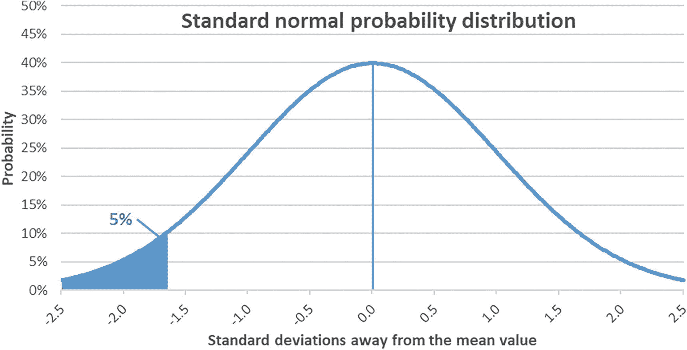
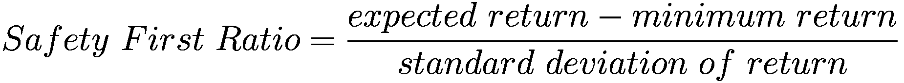

# 金融风险管理

> *风险衡量的是，当“错误”情景发生时，策略表现会有多糟糕。*
>
> ——迈克尔·波特

与非金融风险类似，加密资产的金融风险高于传统投资。例如，如第 4 章所述，最传统的金融风险衡量指标是波动率，以回报的标准差表示。下行波动率是另一个有用的指标，作为计算同章介绍的索提诺比率的输入值。这两个指标都表明，例如，加密资产的风险水平远高于股票。投资者之所以能接受这些更高的风险，是因为加密资产的预期回报水平也相应更高。无论如何，要完全理解加密资产的风险特征，还需要其他指标；在可能的情况下，前瞻性指标尤其有益。

负责任的投资者不仅应了解投资的风险特征，还应了解自身的个人情况。事实上，一项投资的风险感知很大程度上取决于投资者的境况。例如，一位长期投资视野的年轻投资者与一位仅有几年或几个月投资视野的资深投资者，对风险的感知方式不同。同样，一位拥有稳定收入和光明职业前景的投资者，与一位生活水平依赖资本收益的投资者，对金融风险的重视程度也不同。本章定义了多种金融风险（例如信用风险、流动性风险和市场风险），随后介绍了一些评估这些风险的指标以及缓解方法（例如风险价值、短缺风险、预期亏损、压力测试）。诚然，本章更针对金融知识较为丰富的读者，例如考虑对加密资产进行大额投资的机构投资者。尽管如此，它也为所有读者提供了理解如何衡量加密资产金融风险的基础。

### 信用风险

信用风险指交易对手无法履行其债务或合同义务的风险。极端情况下，交易对手完全未能按约支付债务（即所谓的*违约跳变风险*）。但信用风险也包括交易对手的债务必须以不利于利益相关者的方式进行重组的情形。

加密资产去中心化的核心理念之一，就是通过消除交易对手来完全规避这种风险。然而，对于中心化平台的用户而言，信用风险仍然存在，因为平台本身作为交易对手也可能陷入困境。在某些去中心化金融场景中，当支付依赖于交易对手的信用状况时，信用风险也同样存在。我们无法穷尽所有涉及信用风险的案例，但审慎的投资者应当理解任何交易的本质，并明确未来现金流是否依赖于交易对手履行债务的能力。

### 流动性风险

流动性风险指投资者因市场流动性不足，在需要时无法买入或卖出资产的可能性。需要强调的是，流动性是指市场吸收大额买卖而不影响资产价格的能力。加密资产由于交易量相对较小、机构参与程度较低，尤其容易受到流动性风险的影响。虽然这一风险对于专注于主流加密资产的小额投资者而言并不显著，但对于考虑小市值资产的冒险型投资者以及大型投资者来说，则至关重要。例如，个人投资者买卖少量比特币或以太坊不会影响这些资产的市场价格。然而，大型投资基金考虑大额投资（如数万枚比特币）或投资者考虑小市值加密资产时，必须警惕流动性可能不足以维持市场价格稳定。

解决这一问题的方案之一，是将大额交易拆分为许多小额交易，分散在多个时间段内执行，使市场有足够的吸收能力。例如，公司 MicroStrategy 过去进行大规模比特币买入时就采用了这种策略。

### 市场风险

在投资组合管理范畴中，市场风险指因利率及其他经济指标等市场变量变化所导致的投资组合价值变动。具体而言，它指的是无法通过分散投资消除的系统性风险，与可通过分散化消除的非系统性风险（或特质风险）相对立。后续章节将介绍衡量这种风险的几种指标。通过各种形式的对冲，可以限制市场风险敞口。但多数对冲策略都有成本，因此投资者通常无法免费降低风险。

### 风险价值（VaR）

不熟悉传统金融的人通常直观地将风险理解为“亏损的可能性”^(⁹⁹)。这一概念由摩根大通在 20 世纪 90 年代引入的*风险价值*（VaR）指标正式表述。随后 VaR 在业界得到广泛应用，成为高级管理层理解任何投资整体风险的标准方法。具体来说，VaR 旨在衡量在特定概率水平和特定时间段内投资的预期损失。例如，它可以回答这样的问题：“如果发生最坏的 5%情况，我的投资在一年内会损失多少？”换言之，它使投资者能够确定：在时间周期 *T* 内，有 *P*% 的把握损失不会超过 *D* 美元。

计算 VaR 有三种方法：分析法、历史法和蒙特卡洛法。

#### 分析法 VaR

分析法利用统计学计算理论值。首先确定投资组合在考虑的时间范围内的预期收益率和标准差^(¹⁰⁰)。然后，假设特定的概率分布，找出在特定显著性水平（如“最坏的 5%”）下对应的因子，如图 14-1 所示。

折线图，标题为标准正态概率分布，横轴为距离均值的标准差数，纵轴为概率。图线在（-2.5, 0）到（2.5, 0）之间呈现钟形曲线，其中-2.5 到-1.625 之间的阴影区域标记为 5%。

图 14-1

标准正态概率分布下最坏的 5%事件（即取值低于均值以下 1.645 个标准差的事件）

举例说明：假设一个价值 10 万美元的加密资产投资组合，在四年时间内的预期收益率为+50%，标准差为 40%，且收益率服从标准正态概率分布。投资者希望了解第 5 百分位（即最坏 5%情形）的预期损失。代数表达式如下：其中 `R_p̂` 为投资组合的预期收益率，`z` 为特定概率分布下特定概率水平对应的距离均值的标准差数（可通过分布表查得），`σ` 为标准差，`V[p]` 为投资组合价值。

`VaR = [R_p̂ - (z)(σ)] V_p = 0.50 - 1.65(0.40) = -$16,000`

根据这些假设，该概率水平下的预期损失为-16,000 美元。换言之，在四年时间内，该投资有 95%的概率表现优于“亏损 16,000 美元”（即亏损更少或实现盈利）。

当然，最终结果取决于假设的合理性。例如，对于投资组合收益率（尤其是加密资产）而言，标准正态分布是否最合适就值得商榷。实际上，假设具有更厚尾（极端结果概率更高）的概率分布更适合描述金融收益。^(¹⁰¹) 此外，估算成熟金融资产收益率的标准差颇具挑战性，因为该标准差很可能并非恒定不变，而是会随着市场演变而减小，或取决于整体市场状态等其他因素。^(¹⁰²)

最后，考虑到第 9 章所述的加密周期，采用短于四年的时间范围意义不大，因为加密资产在牛市（上升趋势）和熊市（下降趋势）中的收益率差异巨大。总而言之，分析法 VaR 依赖于大量假设。

好的，作为一名高级文档工程师和翻译员，我将严格遵循您的注意事项，将给定的英文文本翻译成中文。

#### 历史 VaR

与其使用理论值，我们可以减少计算中的假设数量，转而使用历史值。这正是历史 VaR 所做的。

具体来说，例如，我们可以收集比特币最近 200 周的周回报率，并发现 90% 的情况下（180 个观测值），该资产的回报率高于 –10.1%。^(¹⁰³) 根据收集到的数据样本，周度历史 VaR 将表明，在 90% 的概率水平下，预期损失为该值。

对于加密资产而言，年度（而非周度）历史 VaR 的可靠性较低，因为可用的观测值数量要少得多，并且考虑到资产的发展速度（10 年前的比特币与 5 年前的风险收益特征有实质性差异，而 5 年前的又与今天大不相同）。尽管如此，类似的分析也是可行的。例如，比特币的年度历史 VaR 在第 50^(个) 百分位得出的值为 +60%。换句话说，最近十个比特币观测值中有一半表明其年度收益至少为 60%。

一种解决数据过时问题的方法是为每个历史数据点赋予权重，其中较早的观测值权重较低，较近的观测值权重较高。Richardson 等人在 1997 年提出了这种方法，以便在更重视当前宏观经济状况和波动性的同时，不完全忽略较旧的数据。^(¹⁰⁴) 考虑到加密资产行业的高速发展，建议采用类似的方法。应用此方法的一种可能方式是让权重随着时间的新近程度呈指数级衰减。

#### 蒙特卡洛 VaR

蒙特卡洛方法^(¹⁰⁵)是一种统计方法，用于模拟某个过程中，在考虑众多变量时特定结果出现的概率。计算机对输入变量（例如，通货膨胀、利率、GDP 增长、加密资产采用率增长以及其他市场状况）运行数千次模拟。由于这些变量相互影响，分析其综合效应比独立分析它们要复杂得多。大量的模拟会以特定的可能性（例如，第 10^(个) 百分位）输出一个特定的投资组合价值。

蒙特卡洛模拟是风险管理的有价值工具，因为它允许投资者理解变量以复杂方式相互作用的多种情景的潜在影响。

#### VaR 指标的特性

一方面，VaR 指标是有用的，因为它们可以比较同类资产，无论所考虑的资产类别是什么。另一方面，它们也有局限性，因为它们不考虑极端情况。例如，第 5^(个) 百分位的 –10% VaR 并不能揭示最差的 5% 的情况是产生 –10% 到 –15% 之间的回报，还是产生接近 –100% 的回报。换句话说，这些指标不考虑极端变动（或称 *黑天鹅事件*），而这些在加密资产行业并不罕见。

历史 VaR 的另一个局限性在于，它本质上是一个回顾性指标，不考虑最近的发展或可能的未来发展。相比之下，分析性 VaR 则高度依赖于假设。由于这些原因，这些指标中的任何一个都无法单独建立一项投资的完整财务风险状况。相反，应综合考虑这些指标，以便让投资者更好地了解他们所面临的风险类型和水平。

监管机构广泛使用 VaR 指标来定义银行允许承担的风险水平以及它们需要持有的、用以覆盖该风险的资本水平。^(¹⁰⁶) 虽然这尚未在加密资产行业广泛存在，但可以合理地假设 VaR 指标将在未来的加密资产监管中发挥作用。尤其是，加密资产基金和中心化交易所未来可能需要接受 VaR 计量和报告。我们也可以推测，持有加密资产的去中心化平台未来是否可能面临类似的监管要求。

### 罗伊安全第一准则

最常被引用的下行风险度量之一是罗伊安全第一准则，由 André Roy 于 1952 年提出，作为在风险约束条件下优化投资组合选择的度量标准。从根本上说，这是一个优化问题，旨在在损失特定金额的概率不超过特定值的约束下，最大化投资组合的预期收益。

例如，它会在预期损失在 95% 的概率下不大于 –5% 的约束下，最大化投资组合的预期收益。或者，它可以在 90% 的概率下追求至少 +1% 的回报。罗伊安全第一比率的计算公式如下。

在这个公式中，“最低收益”是投资者所能接受的最低回报。它与第 4 章介绍的夏普比率非常相似。唯一的区别在于，这里用投资者可接受的最低收益水平替代了夏普比率中的无风险收益率。担心加密资产波动性的投资者可以考虑使用类似的方法来确定其总资产中应分配给加密资产的比例。由于将加密资产加入传统投资组合很可能会提高预期收益，并且（在考虑了所有分散化投资的收益之后）会增加整个投资组合收益的标准差，因此，根据投资者的任意约束条件优化该公式，可以提供一种“最优的”加密资产配置比例（例如，10%）。

### 亏损风险

罗伊安全第一准则与最小化亏损风险（即投资组合在特定时期内未能达到目标回报的风险）的目标有相似之处。这对于具有长期投资视野的投资组合，或者维持特定生活方式所必需的投资组合（如退休投资组合）尤其相关。然而，考虑到加密资产投资“高风险，高回报”的特点，最小化亏损风险建议的加密资产配置比例低于罗伊安全第一准则，因为最小化亏损风险忽略了获得可能远高于目标的回报的好处。

### 预期亏损

下一个亏损风险度量是评估当错误情景发生时情况会变得多糟糕。它被称为*预期亏损*（或*条件风险价值*、*条件尾部期望*或*预期尾部损失*），它解决了传统 VaR 指标的一个局限性。VaR 指标不考虑超出某个概率水平后的情况有多糟，而预期亏损正是衡量这一情景。它是指，如果投资组合的最终结果落在概率分布的特定百分位之外（例如，最差的 10% 情景），该投资组合在特定时间范围内的预期损失。^(¹⁰⁷)

### 回测

无论使用哪种具体指标，投资者都应对其方法进行回测。回测是一种现实检验，用于评估风险指标的质量。例如，投资者可以计算一年前如果采用某个 VaR 指标，其数值会是多少。然后，他们应该将其与实际结果进行比较，以评估该风险指标的稳健性。

例如，他们可以分析过去一年中，加密资产的每周回报有多少次低于一年前测算的 90% 周 VaR 值。如果回报超出此范围的时间仅占约 10%，则该 VaR 指标似乎表现良好。然而，如果观测值超出阈值的次数明显更多，则回测表明该风险指标可能不够保守。

例如，使用截至 2021 年 12 月 31 日的 200 周数据测算的比特币 90% 周 VaR 为 –11.0%。在 2022 年，只有六周的回报低于此阈值。因此，该年 52 周中有六周（占 11.5%）的回报低于此 VaR 方法计算的第十个百分位数。由于 11.5% 相当接近 10%，因此该 VaR 方法和此样本似乎是合适的。对以太坊采用类似方法，在 2022 年也得出了六个观测值，从而得出了类似的结论。然而，此分析忽略了前所未有的事件。这正是压力测试作为管理未来可能风险的有效补充的用武之地。

#### 压力测试

挑战传统风险指标的一种有意义的方法是运行假设情景，这种方法称为压力测试。通常，考虑的情景是暗淡但可信的，用以评估一项投资在不利条件下的表现有多差。即使在悲观条件下，如果情景结果尚可接受，则压力测试通过。或者，可以找出条件必须恶化到何种程度才会导致情景变得不利（这种方法称为因子推动分析）。压力测试通过包含以前从未发生过，或难以在统计方法假设中实现的情景，来补充前面介绍的风险管理方法。

特别是，包含前一章所述的非金融风险的情景可以作为压力测试的有效例子。或者，可以考虑极端缺乏流动性或重大破产在行业内蔓延的情景。当然，压力测试取决于每个情景所使用的假设，并且不太可能完全按预测发展。尽管如此，它们仍然很有帮助，因为它们挑战了统计风险指标，并迫使分析人员考虑各种截然不同的情景对投资组合价值的影响。

#### 关键概念

与非金融风险类似，加密资产的金融风险也比传统投资更大。特别是，投资者应考虑加密资产生态系统中第三方可能发生的违约，并在可能的情况下通过去中心化来避免。此外，流动性也可能成为问题，因为加密资产的日交易量低于传统资产类别；因此，大额交易可能对价格产生重大影响。尽管如此，由于加密资产领域以剧烈的价格波动而闻名，市场风险得到了最多的关注。

风险价值概念特别有用，因为它为给定可能性水平下的预期损失提供了一个单一的标准指标。有几种方法可以计算它：要么依赖假设（分析法），要么依赖历史数据（历史法）。每种方法都有其优点和局限性；因此，投资者应依赖一系列指标，而不是任何一个单一指标。

无论如何，在这个快速变化的环境中，风险指标都应该经过回测，并辅以压力测试，以挑战其影响和可能性。

## 扩展问题

哪些历史数据与推断当前市场风险相关？

你可以依赖多久以前的数据？

对于加密资产投资，哪些压力测试会特别有意义？

脚注 1 2 3 4 5 6 7 8 9

