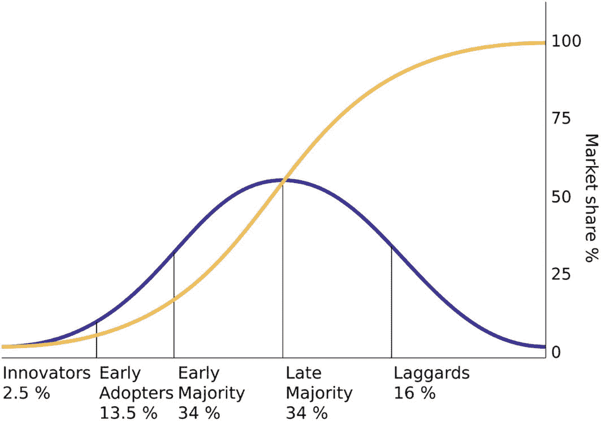
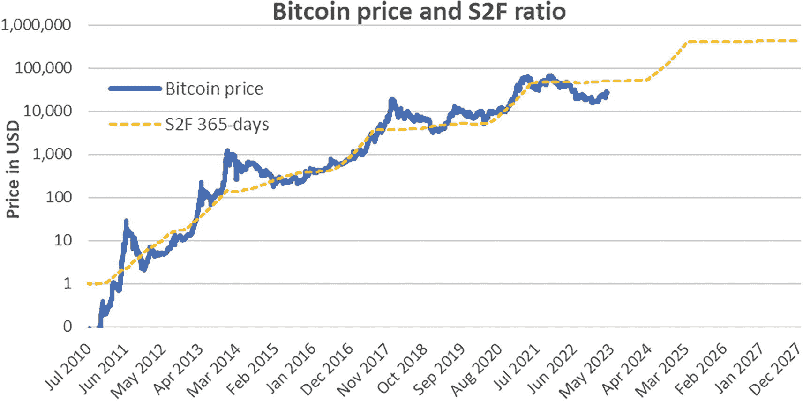
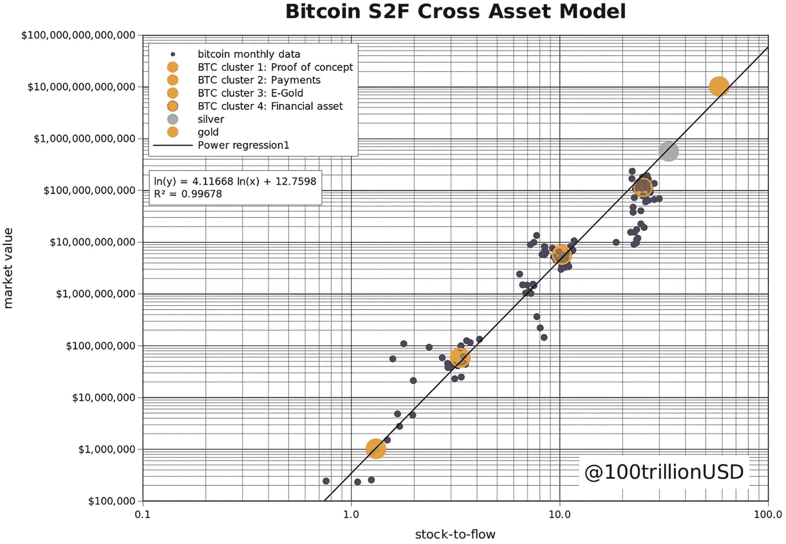
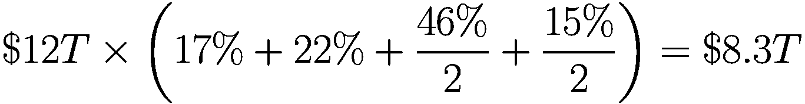
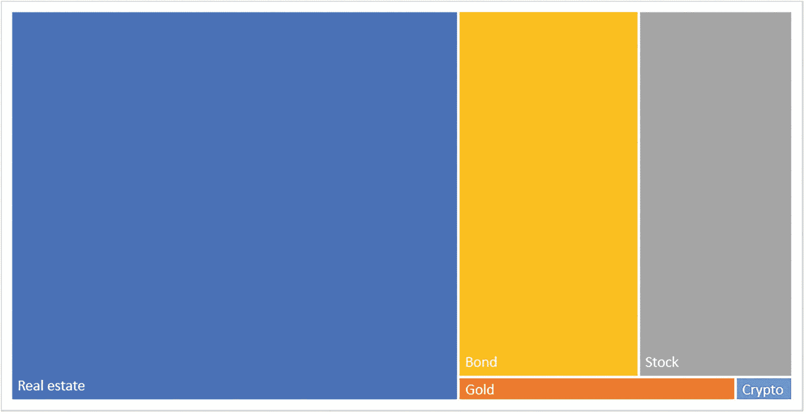
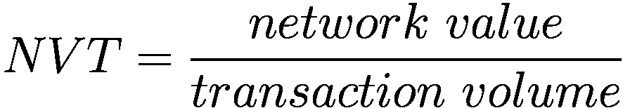
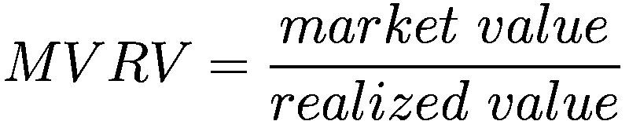

# 16. 加密资产的价值投资

> 本质上，股票市场代表了三种不同类型的商业活动。经通胀调整后，它们分别是：内在价值缩水的企业、内在价值大致稳定的企业，以及内在价值稳步增长的企业。我们的偏好始终是，以远低于增长中内在价值的价格，买入一家长期特许经营企业。
> 
> ——迈克尔·伯里

正如本书开篇所介绍，价值投资，或称基本面分析，聚焦于基本面。它识别并衡量为资产赋予真实经济价值的支柱。价值投资者将资产的价值与价格进行比较，并在价格显著低于价值时进行投资。当价格最终向基础价值收敛时，投资者便实现了收益。

即使在传统金融领域，价值投资者也面临着对不同性质资产进行估值的挑战。例如，传统的现金流贴现方法适用于某些资产（如具有预期未来现金流的高增长公司），却不适用于其他资产，在后一种情况下，价值与收益的比率可能更为合适。随着加密资产成为一种可投资资产类别，价值投资者面临着额外的、新的、不同的挑战。然而，价值投资既不局限于一种或几种方法，也不局限于一种或几种资产类别。它更是一种原则——一种方法。价值投资关注的是对投资长期真实经济价值的押注。

尽管如此，价值投资和加密资产这两个术语，传统投资者并不喜欢将它们放在同一个句子里。事实上，传统上用于计算投资预期回报的资本资产定价模型，并不能直接适用于加密资产，这使得任何后续分析都成了一次更具冒险性的尝试。

本书的目标一直是消解加密资产与价值投资这两个术语之间看似存在的二元对立。对加密资产进行价值投资不仅可行，而且是将这一新资产类别与传统投资焊接在一起的关键要素。这对于推动金融和投资行业迈向新阶段，利用加密资产的突破性潜力至关重要。

从 2020 年到 2023 年，加密市场的规模（所有加密资产的总市值）在 0.7 万亿美元到 3 万亿美元之间波动。要知道这个规模是多了还是少了，就需要衡量加密资产基础价值的方法。不幸的是，传统的金融建模技术无法直接用于加密资产估值。至少，它们需要经过调整，才能对加密资产提供有意义的估值。本章将回顾并调整传统的估值方法，并介绍针对加密资产的特定方法。

## 结合多种估值方法

审慎的投资者不希望依赖单一的估值方法，尤其是对于加密资产。相反，结合多种估值方法并为每种方法分配权重，可能会提供更合理的估值。例如，假设方法 A 将某个特定资产在当年年底的价值估值为 7 美元，而方法 B 将同一资产估值为 12 美元。如果投资者认为方法 A 更可靠，并赋予其 80%的权重，给方法 B 留 20%的权重，那么该资产的合理估值将是 8 美元（`$7 × 80% + $12 × 20% = $8`）。

此外，使用不同的方法可以提供一系列可能的价值，揭示该资产可能出现不同程度的变化。这种方法因此可以减轻对精确估值的错觉，否则这种错觉可能导致错误的财务决策。即使是那些现金流稳定、根基稳固的资产，也难以精确估值，无论模型质量如何，因为它们也受到不确定事件的影响。例如，一家美国汽车制造商的股价会受到大宗商品价格预期、欧洲汽车排放法规以及来自日本的竞争等因素的影响。20 世纪英国统计学家乔治·博克斯的一句名言恰如其分地概括了这一现实。

> 所有模型都是错的，但有些是有用的。

更合理的财务估值方法是考虑未来价格的预期方向。真正的目标是方向正确，而不是精确地错误。就加密资产而言，一个 24 个月后的估值落在正确的数量级内，就可以认为足够精确了。考虑到围绕加密资产未来处理方式的不确定性，即使这样一个宽泛的范围也似乎难以预测。以比特币为例，投资者对其 2024 年底的估值跨越了至少三个数量级：低于 10 万美元、介于 10 万到 100 万美元之间、以及高于 100 万美元。目标估值日期越靠后，这个范围就越广。

> 方向正确，而非精确地错误。

本着这一目标，最佳实践建议保持估值模型的简洁性。一个简单的模型通常比一个复杂的模型更有用，后者有更大的出错空间和未被充分认识的风险。

## 未来现金流的净现值

净现值方法或现金流贴现法，衡量的是未来现金流入和流出的当前价值。要理解这一点，首先必须承认货币的时间价值。例如，今天收到 100 美元比明年收到 100 美元更有价值，即使这是绝对确定的。因为今天的 100 美元可以用于投资，预计明年会变得更有价值。因此，未来的现金流越远，其金额必须越大，才能与今天等额的现金流具有相同的价值。换句话说，未来现金流的现值是被贴现的。

净现值方法表明，一项资产的价值是其未来现金流现值之和。为了计算它，分析师需要估计未来的现金流和贴现率。这种方法传统上是基本面分析的核心。然而，反对将其用于加密资产的一个常见理由是，它们没有未来现金流。首先，这个论点在技术上是错误的，因为一些加密资产确实有未来现金流。例如，任何权益证明机制的加密资产（如以太坊）都会产生未来的质押奖励，这些奖励可以在`NPV`分析中用作现金流。

然而，与以美元产生现金流的传统公司不同之处在于，质押的加密资产会以加密资产本身的形式提供质押收益。例如，质押卡尔达诺会以其原生币`ADA`的形式产生收益。这是一个“先有鸡还是先有蛋”的问题，加密资产的价值取决于未来更多该种加密资产的流入。如果有人试图用`NPV`分析来评估美元相对于另一种货币的价值，也会出现同样的问题。因此，即使对于有未来现金流的加密资产，传统的净现值模型充其量也只是一个存在局限性的估值工具。

### 基于倍数的估值

基本面价值衡量的另一个核心支柱是使用倍数。具体而言，采用此方法的分析师会衡量企业产生的可分配现金流，并将其乘以一个特定数字来确定企业的价值。这个特定数字，或倍数，可以根据同行业中类似企业的情况进行估算。当然，这种估值方法最终取决于现金流衡量的恰当性（例如，净收入、自由现金流或营业收益）以及所使用的倍数。具体来说，倍数分析主要受困于难以找到可比企业。每家企业都有使其区别于其他企业的特征。例如，一家有杠杆的公司（使用杠杆——即债务的公司）很难与一家无杠杆的公司相比较，因为其底层风险截然不同。因此，未来现金流的稳定性和可预测性也可能大相径庭。

基于这些原因，即使在传统金融领域，分析师也必须对其估值进行任意调整，无论他们采用的是倍数法还是`NPV`法。这些调整对于传统投资而言已存在争议，对于大多数分析师来说陌生且全新的加密资产则更是如此。此外，使用倍数进行估值在评估以本资产计价的现金流资产时，面临着与`NPV`分析相同的局限性。因此，倍数法同样不是评估加密资产的完美工具。

## 资产价值、盈利能力与成长价值

像本杰明·格雷厄姆和大卫·多德这样的传统价值投资者，认可上述`NPV`分析和基于倍数的估值法在传统投资中的局限性。此外，他们还列出了这些方法超出本书范围的一些其他缺陷。然而，为了解决这些局限性，他们提供了一种替代方法，即分别衡量真实资产净值、企业的盈利能力以及成长价值。这一点很重要，因为这三个术语中的最后一个——成长价值——高度依赖于分析师的任意估算，并且远不如其他两者具体。这种方法能够将有形价值与其余部分独立衡量[43]。

然而，再次指出，即使是该等式中更为有形的部分——资产价值和盈利能力——也不能直接应用于加密资产。充其量，只有通过调整这些指标及其底层基本原理，人们才能合理运用此方法。以下各节将涵盖这些调整。

### 基于重置成本的资产价值

第一个术语是资产价值，通常根据公司资产负债表上资产的账面净值进行评估。然而，一个完全数字化的资产通常缺乏传统的账面价值。特别是，权益证明加密资产的账面价值是不存在的，这使得这一术语对此类资产而言无关紧要。然而，工作量证明加密资产（尤其是比特币，因为它比所有其他`PoW`资产的总和还要大得多）的账面价值可以被解释为开采该资产所需的电力价值，这对应于历史成本。

更合理的是，它可以基于在当前电价和哈希率下开采该资产所需的电力价值（即重置成本）来确定。事实上，比特币高昂的生产成本正是其价值基础所在。

传统的供需论证支持了这种方法的有效性。在 18 世纪，经济学之父亚当·斯密将供需过程描述为市场无形之手。根据这一基本经济洞察，如果资产的卖家多于买家（供给高于需求），那么价格就会下跌。较低的价格会吸引更多买家并阻止部分卖家，从而在供需匹配处稳定价格。

这一洞察可以扩展到`PoW`加密资产的定价。由于在工作量证明加密资产的区块链上挖矿需要电力，因此挖出一个新区块所需的电力价格可以作为需求的指示。实际上，如果一项资产对矿工的价值低于电力成本，矿工就不会花费开采该资产所需的电力。^(¹⁰⁹)

如同供需例子一样，市场无形之手会将资产价格推至与开采该加密资产所需电力成本相匹配的水平。如果电价高于预期的挖矿奖励，矿工会将能源转向其他用途，例如向电网出售能源。相反，如果电价低于预期的挖矿奖励，矿工会扩大运营规模，更多矿工加入竞争。结果，哈希率会调整，直到恢复均衡。哈希率是衡量矿工对工作量证明加密资产未来价格预期的领先指标。

追求自身利益的投资者会完成其余工作。特别是，正如中本聪早在 2010 年所指出的，一个有效市场中`PoW`加密资产的价格最终会跟随电价和哈希率所隐含的成本。^(¹¹⁰)

> 任何商品的价格都趋于向其生产成本靠拢。如果价格低于成本，生产就会放缓。如果价格高于成本，通过生成和销售更多产品就能获利。同时，产量的增加会提高难度，从而将生产价格推向成本水平。

截至 2023 年 5 月撰写本文时，比特币的市场价格恰好与最新`ASIC`矿机所用电力平均成本所隐含的价格相符。详细计算见附录。

在传统的价值投资中，公司资产负债表上的流动资产（如现金、有价证券或存货）比非流动资产（如房产、设备或商誉等无形资产）具有更可靠的价值。尽管如此，遵循格雷厄姆和多德传统的估值方法也会考虑诸如声誉和客户关系质量等无形资产。加密资产同样属于无形资产类别。因此，它们可以被估值，但这种估值方法对加密资产的局限性类似于对无形资产估值的局限性：它们几乎没有或根本没有清算价值。

一家濒临倒闭企业的商誉会丧失其大部分（即便不是全部）价值。类似地，一个濒临失败的加密资产也会迅速失去其价值。因此，对无形资产和加密资产进行估值的底层假设是，它们都将继续经营。换句话说，假设它们未来会持续运营下去。

### 基于质押奖励的盈利价值

与工作量证明加密资产（有重置成本但无未来现金流）相反，权益证明加密资产有未来现金流但无重置成本。因此，PoS 加密资产并非上一节中资产价值的评估对象，而是即将进行的盈利价值（`EPV`）分析的目标。

正如 `NPV` 部分所介绍的，未来的质押奖励可作为未来现金流——即格雷厄姆和多德估值方法中的盈利。在评估企业的 `EPV` 时，选择合适的盈利衡量标准至关重要。例如，`税后净营业利润`考虑了税收的影响，而`营业利润`则不然。同样，以实际收益来衡量质押奖励也至关重要。例如，持有足够数量的 PoS 加密资产以从质押奖励中获益可能涉及隐含成本。比如，要激活验证器软件并直接在以太坊区块链上质押以太币，用户必须存入至少 32 ETH（撰写本文时价值超过 50,000 美元）。此外，验证器需要运行该软件的计算机始终保持联网状态；否则，他们将因离线而面临惩罚。

从总质押收益率中扣除间接成本，可以提供更准确的盈利衡量标准。基于此，可以使用标准的 `NPV` 方法计算 `EPV`。与价值投资中的传统金融模型类似，`EPV` 是通过将盈利除以投资者的资本成本得出的。由于分母（资本成本）在加密资产和传统投资中类似，本书不涉及其细节和挑战。关于该主题已有足够多的优质资源。

### 评估增长

虽然大多数传统价值投资者只关注企业的有形部分，但过去三十年来，整个行业通常已转向评估增长。事实上，即使资产账面价值相似，增长型企业通常也比稳定型企业具有更高的价值。这也是某些科技公司估值高达数万亿美元的原因之一。

此外，对于大多数新的高增长企业（例如雄心勃勃的科技初创公司）而言，增长在其估值中占据主要份额。在这方面，加密资产具有相似之处。它们同样是新的、高增长的事业，其主要价值不在于有形资产，而在于增长前景。然而，增长是迄今为止最难评估的要素。特别是，对于科技公司而言，增长往往会被系统性地、显著地高估。这一事实支持了我们的建议：无论采用何种方法，都应带着相当大的误差范围来看待加密资产估值，并倾向于估值区间中更保守的一端。这并不意味着估值不可能，只是说明任何估值方法都不准确，并且很可能存在高估偏差。

此外，加密资产的增长与传统企业的增长截然不同。传统企业的价值取决于其收入流的有机增长速度，但这并非加密资产创造价值的方式。相反，在加密行业中，正是资产的使用在创造价值。特别是，一种货币、网络或加密资产的使用率越高，它对所有用户的价值就越大。这引导我们确定评估使用情况的可能指标。

### 衡量和评估加密资产的使用情况


`图 16-1` 梅特卡夫定律的图示以及由电话连接所代表的网络价值：网络上的用户越多，该网络的价值就越大。（来源：维基共享资源，公有领域）

梅特卡夫定律阐明了为什么使用情况可能是价值的主要驱动因素。该定律由以太网创始人之一罗伯特·梅特卡夫提出，指出网络的价值与其用户数的平方成正比。用一个简单的例子来说明：如果你是世界上唯一拥有电话的人，而电话除了通话外没有其他功能，那么它对你来说几乎没什么价值。但是，一旦另一个用户也有了电话，你的电话就变得有价值了，因为你可以给那个用户打电话。当第三个用户加入网络时，原来的两部电话有了更大的价值，因为可以联系的人更多了。随着网络上的每个新用户加入，所有电话的价值都变得更大了。由于网络的价值可以表示为节点之间的连接数，因此它随节点数呈二次方增长。根据梅特卡夫定律，价值随采用率的增长而增长，其速度远快于用户数的增长。

这条定律在评估社交网络（如 Twitter、Facebook、Instagram 或微信/WeChat）时尤其相关。同样，像 Uber、Airbnb 或 eBay 这样的公司也遵循类似的逻辑。同样，被用作货币的加密资产也属于这一类。网络上的每个买家都会为每个卖家增加价值，反之亦然。因此，衡量使用情况的第一个指标是网络上的节点数。

下一个指标是活跃度。例如，活跃用户比不活跃用户能为网络带来更多价值。继续以电话为例，如果大多数用户几乎从不打电话，那么这个网络的价值就低于所有用户都定期通话的情况。原因之一是，对于电话、社交媒体或货币而言，定期用户更有可能激励非用户加入网络。加密资产的活跃度可以通过交易量来衡量。然而，某些加密资产异常低的交易费用使得该指标容易被操纵。实际上，单个节点可以创建多个匿名账户，并在这些账户之间进行大量虚假交易以模拟活跃度。取而代之的，另一种不易被操纵的活跃度指标是总交易成本（或`gas 费`）。理论上，任何富有的买家都可以操纵该指标，但这样做成本高昂，从而抑制了这种恶意行为。

衡量使用情况的其他指标取决于加密资产的性质。例如，在 DeFi 协议的情况下，总锁定价值（`TVL`）相当于传统投资基金管理资产规模（`AUM`）的加密版本。具体来说，`TVL` 包括锁定在 DeFi 协议功能（如质押、借贷或流动性池）中的所有资产。更高的 `TVL` 表明有更多价值投入到 DeFi 协议所启用的功能中。协议的价值越高，就有越多的人依赖其原生货币来利用其服务。`TVL` 是衡量相应加密资产使用情况的一个合理代理指标。

评估加密资产的分析师可以调整使用量指标，以反映真实的底层使用情况。例如，分析师可能希望赋予那些秉承行业去中心化精神的用户比中心化交易所上的投机者更高的价值。事实上，一个经历必要步骤设置自我托管钱包的用户，很可能比中心化交易所的用户对底层资产更加投入。使用量指标可以根据该资产的托管主导权（即托管资金占现有总资金的比例）进行加权。例如，分析师可以定义：一种加密资产的自托管程度越高，其用户的价值就越大。

衡量加密资产使用情况的可能代理指标包括：活跃地址数、交易笔数、`Gas` 费、总交易成本以及锁仓总价值。区块链技术带来的透明性意味着这些指标可以直接从区块链上实时获取。由于这些指标具有可操纵性，综合使用这些代理指标很可能比单独使用其中任何一个指标更好。

最后，让我们强调一下，加密资产的市场市值并不能衡量其使用情况。因为市值是市场给出的估值，它并非任何估值过程的输入，而是市场对所有估值的平均输出。

### 基于使用情况的增长衡量

这些指标使投资者能够评估网络估值的增长部分。特别地，使用量的增长速度就是技术的扩散速率。具体而言，全球（经过身份验证的）加密资产用户基础在 2018 年至 2020 年间每年增长近 190%，随后在 2021 年和 2022 年进一步加速。^(¹¹¹) 确切的数字取决于使用哪种指标以及如何衡量，但大多数估计显示使用量年增长率超过 100%。这个速率意味着加密资产的采用率每年都会翻一番以上。相比之下，互联网在拥有类似用户数量（3 到 4 亿）时，其采用速度大约只有这个速度的一半。

技术采用并非线性增长。通常，它遵循一条 S 型曲线：起步缓慢，随后急剧加速，最后以缓慢的收尾结束。埃弗雷特·罗杰斯的著作《创新的扩散》已成为经典，其中展示了图 16-2。在这张图中，钟形曲线代表创新生命周期中任意一点的采用率。最终达到 100% 的 S 型曲线则是该创新直到峰值时所占据的累计市场份额。



`图 16-2` 根据埃弗雷特·罗杰斯理论的技术创新扩散速率（来源：维基共享资源，公共领域 [50]）

基于加速发展的采用步伐和可用的潜在市场，截至 2023 年，加密资产行业正处于早期采用者阶段。此外，根据典型的 S 型曲线，从 0 增长到 10%（对于加密资产而言是 2009 年到 2022 年）所需的时间，与从 10% 增长到 90%（暗示为 2022 年到 2035 年）所需的时间相同。而且，根据 GWI 市场研究，2023 年 1 月全球 16 至 64 岁互联网用户中加密资产的使用率为 13%。^(¹¹²) 这些洞察表明，未来十年内采用率（使用量）可能会增长五倍。

### 将供应纳入估值考量

如引言所述，可交易证券的市场价格最终由供需平衡点决定。需求在许多方面类似于前面章节描述的使用情况。相比之下，加密资产的供应是其可用的总量。许多加密资产有固定的上限，并且通过透明的方式规定了达到这个上限的途径和速度。例如，比特币总共将发行的数量为 2100 万枚。它们随着每个新区块（大约每 10 分钟一个）逐步发行。此外，发行速度在不断降低，因为每 210,000 个区块（大约每四年）区块奖励就会减半。比特币的供应量将遵循此模式，直到大约 2140 年所有 2100 万枚比特币发行完毕为止，之后将不再有新比特币被挖出。然而，减半事件的性质意味着，到 2024 年第四次减半事件时，总供应量的 93.75% 已经被挖出。其他加密资产遵循不同的模式；有些也有理论上的最大供应量上限（例如，卡尔达诺），有些加密资产的供应量则在不断扩张（例如，狗狗币），还有一些则是通缩型的（例如，以太坊）。^(113)

尽管如此，真正的供应量并非编码在加密资产特性中的理论总数量，而是可找回和可交易的代币数量。实际上，许多资产所有者丢失了他们的私钥，导致所有相应的代币无法找回，使得实际供应量远低于理论数量。例如，据估计，至少有 20% 的比特币存于私钥已丢失的钱包中。基于这一数字，比特币的真实总供应量不是 2100 万，而是低于 1680 万。

### 存量-流量模型

供给量在最著名的比特币估值模型——存量-流量（S2F）模型中变得至关重要。从根本上说，该模型为稀缺性定价，通常应用于黄金等自然资源。它衡量的是一项资产可供交易的总存量（“存量”）与单位时间内该资产的新增数量（“流量”）之间的比率。高存量-流量资产的价值逻辑已在第 1 章介绍。化名为 `PlanB` 的荷兰机构投资者最初于 2019 年 3 月在 Medium 的一篇文章中提出了应用于比特币的该模型。^(114) 该模型基于尼克·萨博对稀缺性的定义，即“不可伪造的昂贵性”，这是比特币首次以数字化和去中心化的方式实现的壮举，并成为其核心价值主张。换言之，生产新的黄金或比特币既困难又昂贵，这使得现有的单位具有价值。

截至 2023 年，全球黄金总供应量约为 20 万吨，每年开采量约为 3,000 吨。^(115) 黄金的 S2F 比率为 66.7（计算方式为 `200,000 / 3,000`），对应于在当前流量下积累到当前存量所需的年数。然而，其倒数可能更容易理解：1.5%（`3,000 / 200,000`），即一年内开采的存量占比。换言之，这就是黄金供应的通胀率。

相比之下，比特币在 2020 年 5 月 11 日第三次减半事件时的存量为 18,375,000（占总量 2,100 万的 87.5%，忽略丢失的币），流量为每个区块 6.25 个比特币，即每年约 328,725 个比特币。其 S2F 比率为 55.9，略低于黄金，表明在存量-流量方面，彼时的比特币稀缺性低于黄金。在减半事件之间，随着每个区块新增的比特币添加到存量中，该比率会缓慢增加。此外，每次减半事件都意味着流量减半，从而导致该比率突然翻倍。根据预计在 2024 年 3 月左右的第四次减半事件，S2F 比率将达到 119.8（计算方式为 `19,687,500 / 164,362.5`），届时比特币的“稀缺性”将是黄金的近两倍。

S2F 模型的价格预测将随时间变化的 S2F 比率值作为输入，代入一个包含其他系数的公式中，这些系数被选择用以拟合过去的数据。基于最能拟合过去价格和相应 S2F 比率的数据，可以绘制出一条对数趋势线，从而预测未来的价格。例如，该模型求解以下方程，其中 `a` 和 `b` 是为拟合过去价格数据而选择的常数，`S2F` 是前述比率。

```
Price_{USD} = e^a × S2F^b
```

应用于比特币的该模型如图 16-3 所示（系数 `a = -1.0` 和 `b = 2.9`，以及基于过去 365 天数据的每日流量），从中可以看出过去的数据与模型的理论输出非常吻合。然而，尽管 S2F 模型在过去几年中已被证明异常准确，但它仍然在很大程度上依赖于假设。


**图 16-3** 基于 2010 年中期至 2028 年 1 月（第五次减半事件的预期日期）365 天流量的比特币存量-流量模型；比特币价格数据截至 2023 年 3 月

特别是，该公式的性质表明，价格将持续随着 S2F 比率上升，直到 2140 年最后一个新比特币被铸造出来。此外，为什么一种商品（无论是黄金还是比特币）的市值可以完全由新增供应量推导出来，这一点值得怀疑。实际上，该模型完全忽略了除存量、流量和时间以外的因素。例如，它完全忽略了需求的任何变化（无论是由于监管还是商业周期）、波动性，甚至其通常计价货币（美元）的供应量。

这些缺点并未阻止大部分比特币社区广泛依赖该模型来预测未来价格。主要论点是，即使某些因素未被考虑，存量-流量关系仍然是稀缺资产（不仅是比特币，还包括贵金属和其他商品）市值的主要驱动因素。特别是，`PlanB` 正确地指出，该模型对比特币具有极高的拟合优度^(116)，跨越了八个数量级。

自该模型于 2019 年 3 月发表后，比特币的价格在三年的时间内（包括 2020 年第三次减半事件期间）持续紧密跟随该模型的理论预测。然而，在 2022 年和 2023 年初的市场低迷期间，价格落后于模型预测。即使是 `PlanB` 也承认，比特币的价格最终会与该模型的预测脱钩，尽管迄今为止该模型异常准确。

### 存量-流量跨资产（S2FX）模型

为了解决 S2F 模型可能存在的局限性，`PlanB` 在其 S2F 文章发表仅一年多后，发布了一个更新的模型。该更新移除了模型中的时间成分，但添加了其他商品，特别是黄金和白银。它被称为比特币存量-流量跨资产（S2FX）模型。^(117)

特别是，它识别了比特币演进的各个不同阶段，从概念验证到支付，再到数字黄金，最后到金融资产。在这四个按时间顺序排列的阶段中，每个阶段的比特币 S2F 比率和价格都显著高于前一阶段，如图 16-4 所示。将白银和黄金的市值与其 S2F 比率的关系添加到模型中验证了这一发现，表明更高的 S2F 比率对应更高的市场价值。事实上，数据的拟合优度几乎是完美的（`R²` 为 99.7%），这使得对潜在的因果关系有很高的信心。该模型的主要弱点在于其基于的观测数据点数量很少：只有六个（即，黄金、白银以及为比特币确定的四个时间阶段各自的值）。


**图 16-4** 化名 `PlanB`（@100trillionUSD）在 Medium 文章（2020 年 4 月 27 日）中提出的原始 S2FX 模型图表 [51]

S2FX 模型至少为 S2F 模型的预测增加了更多信心，因为它通过与其它商品进行对比验证，确认了比特币市值的未来趋势。特别是，这两个模型确立了一个观点：比特币的每枚价格在 2025 年（在第四次减半事件被市场消化后）将在 10 万至 100 万美元之间，并在本十年末（在第五次减半事件被市场消化后）远高于 100 万美元大关。

### 基于可比资产的估值

利用现有商品的市场市值来确立比特币的价值，也是一种更直接、且独立于存量-流量模型的方法。然而，即将推出的模型（同样聚焦于比特币）在很大程度上依赖于主观假设。具体而言，比特币的可比资产法依赖于该资产被假定所承担的功能。它估算的是，该资产能从当前承担此功能的其他资产中夺取多少市场份额。

可以说，比特币最基本的功能是作为价值储存手段，这一功能传统上由黄金承担。事实上，当传统储户希望随着时间推移保持其储蓄价值时，黄金一直是首选的资产类别。当然，这并非黄金承担的唯一功能，也并非只有黄金这一种资产承担此功能，但我们先从这个简单的例子开始，再逐步扩展。

一个简化的可比资产方法可以这样运作。我们邀请分析师们将每个假设细化，使其数值更精确，从而得到更好的估算。截至 2023 年，黄金的总市值约为 12 万亿美元。其中约 46% 存在于珠宝中，17% 由各国央行作为储备持有，22% 为央行之外的实物金条和金币，其余 15% 以其他形式持有。^(118) 可以合理假设，央行持有的黄金储备以及私人持有的金条和金币完全承担了价值储存的功能。此外，我们假设现存珠宝的一半以及黄金其他形式的一半（同样为主观假设）也用作价值储存。根据这些假设，黄金价值储存功能的市场价值因此为 8.3 万亿美元。



保守假设比特币“仅”在本十年末抢占该市场的 20%（又是一个主观假设），那么在其目前约 0.6 万亿美元市值的基础上，仅凭此项功能和对黄金市场份额的争夺，其总价值将增长至 2.3 万亿美元。当然，其他资产类别，如股票（约 106 万亿美元）、债券（约 124 万亿美元）和房地产（约 327 万亿美元），也部分地扮演着价值储存的角色。保守假设比特币“仅”在本十年末抢占其总市场的 3%，那么比特币的市值将增长至 19 万亿美元，即每枚 905,000 美元。


**图 16-5** — 不同资产类别的相对市值（来源：加密货币数据来自 CoinMarketCap，黄金和房地产数据来自 Savills，股票和债券市场数据来自 SIMFA 资本市场数据手册）

此外，比特币也承担着除了价值储存之外的其他功能。例如，它也被视为一种国际支付媒介，能够即时、永久性地结算交易。从这个意义上说，它优于许多现有的交易方式。它很可能还会从西联汇款、Visa 或万事达卡等现有机构手中夺取一部分交易市场份额。

例如，这种估值可以通过与现有法定货币供应量的比较来确定。截至 2023 年初，全球法定货币的总价值约为 50 万亿美元。这个数字是货币供应的狭义定义（经济学术语中的“M1”），包括纸币、硬币和隔夜存款（不包括其他金融资产，如债券、股票、房地产和黄金）。因此，这个定义代表了用作交换媒介的总财富，排除了旨在作为价值储存的资产。采用与上述价值储存估值类似的方法，我们可以基于可比的交换媒介及其预期能夺取的市场份额来评估比特币的价值。由此估算出的交换媒介价值，应加上其价值储存的估值，使得这种基于可比资产法的比特币估值远超本十年末每枚 100 万美元的大关。

最后，前面的数字假设比特币的总市值除以 2100 万。然而，如前所述，更合理的假设是许多比特币（至少 20%）已经永久丢失。因此，每枚比特币的价格会相应更高。总之，即使采用保守估计，也理应对比特币给出远高于其当前价格水平的估值。

### 网络价值与交易量比率

跳出价值储存功能，聚焦于加密资产的支付媒介功能，衡量不同资产的价格-交易关系是很有用的。就像股票基于市盈率进行比较一样，加密资产可以基于其网络价值与交易量（NVT）比率进行比较。



在 2017 年《福布斯》的一篇文章中，Willy Woo 引入了这个比率来评估比特币是否处于泡沫中。^(119) 该比率表明，比特币的交易量和市值密切相关，尤其是在比特币日趋成熟的过程中。当该比率显著高于其正常范围时，可能预示着泡沫，例如 2014 年的比特币就是这种情况。其他加密资产也可以用同样的指标进行分析，因为其逻辑并非比特币所独有。然而，虽然网络价值通常与使用量保持一致，但这种关系并非总是成立。例如，质押奖励被反映为交易，但并不代表网络使用量的增加。此外，像门罗币这样的隐私加密资产，其设计初衷就是无法准确衡量交易量。尽管如此，NVT 比率仍然是其他指标的有益补充。

## 加密资产估值方法

### 加密资产背后的其他基本面指标

除了作为前述模型输入的指标之外，还有无数其他指标可以用来构建新模型。分析师可以选择在其模型中包含以下指标：平均区块大小、区块高度、交易所存入量、交易所提取量、由矿工/验证者直接出售的供应量、平均币龄休眠期（每个币在交易前保持休眠的平均时间）^(¹²⁰)、新地址数量以及活跃地址数量。也可以使用余额超过总供应量一定比例、超过特定数量的原生货币或特定美元金额的地址数量。此外，特别是对于工作量证明（PoW）加密资产，以下指标也很有意义：当前哈希率、30 天平均哈希率、当前难度、30 天平均难度，或者来自手续费的矿工收入。最后，不同的去中心化度量指标（基尼系数或中本聪指数，见第 13 章）对于加密资产的估值模型也是宝贵的补充。

传统的宏观经济变量在加密资产领域当然也是相关的。特别是加密资产（尤其是比特币）吸收市场上现有流动性的趋势，使得衡量净流动性变得尤为重要。市场上的总体流动性越充裕，流入包括加密资产在内的资本资产的就越多。

#### 支点指数

另一种评估比特币基本价值的方法是将其视为投资组合保险。具体而言，正如 Greg Foss 在 2021 年 4 月的一篇文章中所提出的，比特币可以抵御法定政府对其债务违约的风险。^(¹²¹) 这种保险的价值可以通过现有的金融工具来衡量，而这些工具实际上为比特币提供了估值。

政府债务违约意味着其无法偿还合同约定的贷款。这种情况会迫使政府增发货币，使债务贬值直至能够偿还。随着货币价值崩溃，以该货币计价的所有价格都会上涨。该货币的用户将面临储蓄价值大幅缩水的局面，并很可能会逃向一个不会被中央当局随意操纵的金融避风港。即使政府能够通过印钞来摆脱技术性违约，这也将引发对其货币的信心危机——这实际上是另一种形式的违约。

可以合理推测，如果政府无法偿还其法定计价债务，对比特币的需求将会上升。鉴于比特币供应量固定，需求的增加将推高其价格。这里的挑战在于衡量此类事件发生的可能性，并为其定价。幸运的是，金融行业已经开发出一种能够进行此类衡量的工具：信用违约互换。

信用违约互换是一种合约，本质上代表了针对违约事件的保险。互换的买方每月支付固定金额，并在发生违约事件时有权获得大额赔付。市场根据对事件发生可能性的评估来确定互换的价格（即每月支付金额）。

在他的文章中，Greg Foss 解释了他如何构建支点指数。该指数衡量一组二十国集团国家信用违约互换的累计价值。这些国家很可能拥有所有国家中最稳健的法定货币。事实上，在一个二十国集团国家的货币崩溃之前，许多其他（更弱的）法定货币很可能已经崩溃了。该指数的构建基于信用违约的可能性（由市场隐含）以及相应货币的金融债务总额（例如，联邦政府未偿债务、医疗保险负债）。

对支点指数的详细解释超出了本书的范围，但 Greg Foss 分析得出的结果值得分享[52]。支点指数的估值表明，每个比特币的价值在 108,000 美元到 160,000 美元之间（按 2021 年美元计算）。

从这种方法可以得出一个有用的直观结论：比特币的价格很可能会随着主要国家违约概率的增加而上涨。随着这些国家的债务与 GDP 比率持续攀升至历史新高，这一直觉表明，比特币未来的价格方向与先前模型的预测是一致的。

#### 将比特币作为网络安全协议进行估值

比特币文献中的一个突破是 2023 年美国空军少校 Jason Lowery 的麻省理工学院论文《Softwar》[46]。此前围绕比特币的大部分关注点都集中在其金融和货币角色上，而 Lowery 少校则采取了一种根本不同的方法。他从军事和国家战略防御的角度分析了比特币。他的论文雄辩地区分了抽象的、想象中的权力与真实的、物理的权力，并将这一推理延伸到了数字世界，即软件领域。与不基于工作量证明共识机制的竞争对手不同，比特币的安全性依赖于真实、有形的能源。它只能通过消耗电力而产生。这种物理世界的约束阻止了它通过抽象权力（无论是来自货币发行机构还是统治当局）被系统性利用。换句话说，其工作量证明共识协议是一种新的网络安全系统。相比之下，基于权益证明的加密资产和法定货币完全依赖于一种抽象的信仰体系：一种仅由对发行当局的信任所支撑的虚拟价值。

因此，现存最安全的区块链，其价值远不止于作为货币协议。它还可以保护任何有价值的信息，从个人数据到国家、战略和机密信息。在这方面，比特币与任何其他加密资产都截然不同，值得进行不同的分类和估值方法。正如 Lowery 少校所总结的，比特币对个人、公司和国家的至关重要性，促使将储备比特币作为国家战略优先事项。虽然这一观点没有为比特币提供任何具体的估值，但我们可以从这一推理中推断出，比特币的基本价值应该比其当前水平大很多倍。换句话说，它确认并强化了先前提出的基本估值方法的发现。

#### 非基于基本面的估值方法

前面的部分侧重于基于基本价值的估值方法。它们尽可能少地依赖其他市场参与者如何评估资产价值，并努力识别其客观价值。^(¹²²) 存在许多方法来评估加密资产是否被高估，但它们几乎完全依赖于其他市场参与者的行为。这正是估值偏离基本面并接近投机的领域。

例如，一种方法是将资产的当前价值与其平均获取成本进行比较。这种关系被称为*市场价值与实现价值比率*（`MVRV`）。`MVRV` 表明了如果平均资产持有者以当前价格出售其持有量，将产生盈利还是亏损。形式上，`MVRV` 的计算如下。



*市场价值*是资产的市场资本总额，而*实现价值*是每个持有者持有的数量乘以其获取成本。数值高于 1 表明平均持有者拥有未实现收益，反之亦然。`MVRV` 背后的理论预测该比率往往会回归其均值。可以通过将其项之间的差值与资产的波动率（`MVRV` Z 分数）进行比较来扩展，这是另一个预测未来价格的短期指标。

另一种方法是将市场价值除以衡量持有者信心的指标。这种信心指标可以是，例如，加密资产在钱包中停留的平均天数。例如，这是计算*储备风险*的方法，这是由 Hans Hauge 创建的模型。^(¹²³) 其他信心指标包括谷歌搜索趋势、热门推文或市场调查。与资产价格相比，信心比率较低（例如，当长期持有者卖出时）表明该资产被高估。

还有许多其他短期指标可用于评估加密资产当前是否被高估，但这超出了本书的范围。感兴趣的读者可以研究应用于加密资产的布莱克-舒尔斯-默顿模型、对数增长曲线、HODL 浪潮、RHODL 比率、Mayer 倍数和 Puell 倍数。在评估加密资产价格的短期波动时，还应考虑其他指标，例如交易所的最大“痛感价格”（为期权持有者带来最高总损失的价格）、期货和远期价格（反映市场参与者的预期），甚至债务周期（特别是，比特币价格峰值往往跟随中国的债务周期）。

#### 关键概念

评估加密资产时，需要调整传统资产经济价值的评估方法，且具体方法因加密资产类型而异。具体而言，`NPV`（净现值）分析可用于权益证明类加密资产，但其局限性在于现金流（即质押奖励）以被评估资产本身计价。相比之下，工作量证明类加密资产可根据重置成本进行估值，即按当前算力挖掘该资产所需电力的当前价格。此外，资产需求可通过使用率或采用率来衡量，从而揭示传统价值投资方法中增长部分的价值。基于供给的模型衡量稀缺性，尤其适用于比特币等稀缺资产（如大宗商品）。另一种替代估值方法基于可比资产类别的价值及其预期市场份额捕获。所有估值模型的共同点在于，它们均表明，截至 2023 年 5 月，比特币的价格应远高于当前水平。这些方法的众多变体可基于无数链上指标，并辅以短期指标。

#### 拓展问题

哪些估值方法适合对比特币进行估值？每种方法应赋予多少权重？以太坊、Polygon、Uniswap 和门罗币又该如何处理？

随着加密资产的成熟度发展，估值方法的适用性会如何演变？

如何将交易费用纳入比特币的估值方法？