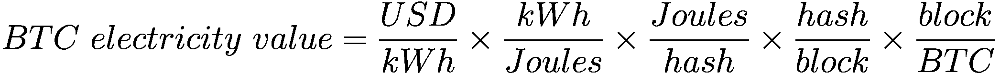
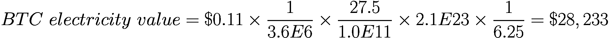

# 比特币的重置成本估值

第 16 章解释了如何将电力成本作为基于工作量证明共识机制的加密资产估值输入。为避免打断该章的连贯性，以下关于比特币估值的复杂计算示例被移至本附录。

基于电力成本的比特币估值很可能是最早建立的加密资产估值方法，因为早在 2009 年秋季，新自由标准在线交易所发布首个正式比特币汇率时，该方法就已投入使用。这种估值方法被称为比特币的`电力价值`、`哈希电力估值`或`能量价值等价`。

从代数角度看，以下公式中的不同元素仅根据挖矿所需的电力成本，推导出比特币的隐含成本。

特别要注意，公式中每个分数的分母如何与下一项的分子相抵消，最终只留下两个项。

公式的第一个分数是用于挖矿的电力成本，单位为`kWh`。即使使用廉价能源，矿工也应考虑这些电力的机会成本。在我们的示例中，假设每`kWh`成本为`0.11 美元`。

第二个分数是一个常数。1 瓦特即每秒消耗`1`焦耳。1 千瓦有`1,000`瓦，`1`小时有`3,600`秒。因此，`1`焦耳对应`1000 × 3600 kWh`，而`1 kWh`对应`1 / (1000 × 3600)`焦耳。

第三个分数考虑了`ASIC`矿机的特性。每哈希所需的焦耳数取决于矿机的功耗（本例中为`5,500`瓦）和哈希效率（本例中为每秒`200`万亿哈希）。这些数据对应截至 2023 年 5 月，在`25`摄氏度条件下维护的顶尖`ASIC`矿机效率。第三个分数的对应值为`5500 / 200,000,000,000,000`，即每太哈希`27.5`焦耳，这是`ASIC`矿机常用的计量单位。

第四个分数是网络的总哈希率（每秒`350`艾哈希），以挖出一个区块所需的平均时间`10`分钟表示。换句话说，约为`210`泽哈希。

最后一个分数是每个区块挖出的比特币数量的倒数：自 2020 年 5 月 11 日第三次减半事件起，直至预计 2024 年 3 月的下一次减半事件，每个区块挖出`6.25 BTC`。

将上述假设代入这些项相乘，得出比特币的电力价值为`28,233 美元`，这也是本文撰写时比特币的市场价格。自诞生以来，比特币的市场价格始终与其隐含的电力价值保持高度接近（并呈现均值回归趋势）。

出于多重原因，这个价格是比特币的最低价值，即地板价。

首先，这些数据考虑的是现有效率最高的`ASIC`矿机。实际上，大多数矿机的效率低于本例。增加矿机所需的瓦特数并降低其哈希效率，意味着更高的估值。

其次，该估值仅考虑了挖矿的电力成本。然而，建立比特币矿场需要更多成本，从购买`ASIC`矿机到安装和维护成本。

第三，哈希率持续增长。这带来两个后果：一方面，挖出一个区块所需的时间（第四个分数）平均低于`10`分钟。另一方面，这意味着越来越多的矿工加入竞争，表明他们预期未来挖出的比特币价值将高于当前市场价格。

还需注意，该公式可以重新调整以分离出电力成本。由此，可以推导出使特定矿工的挖矿业务盈利的电力成本上限、比特币市场价格以及预期哈希率。