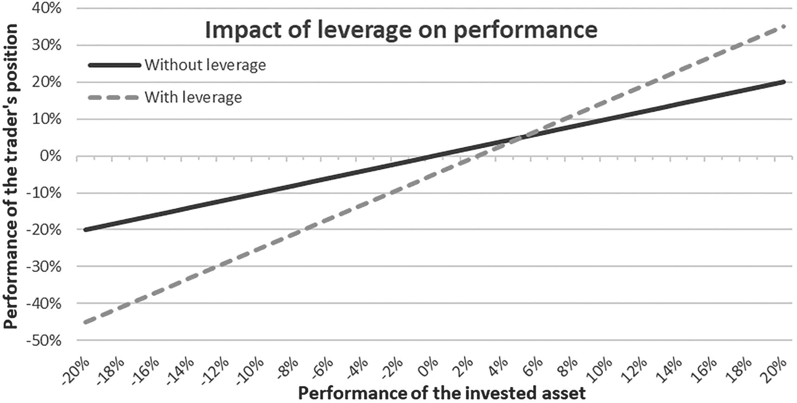

# 应用于加密领域的金融产品

由于本书面向的部分读者可能难以消化金融概念，以下章节已移至附录。这些内容涵盖投资者可能试图采用的策略——无论是在加密资产还是其他领域——以从潜在投资中获利，但这些策略的风险特征与传统直接投资有所不同。请特别注意与这些策略相关的重要警示语。

### 杠杆与保证金交易

为了最大化收益，金融行业的交易者常常使用杠杆。与简单的投资（买入）相比，杠杆涉及借入资金进行投资，以便从价格上涨中获得更大收益，但同时也承担着价格下跌时更高的风险。

以下示例计算量较大，但能说明杠杆交易的收益与风险。假设一位交易者用 100 美元投资某种资产。如果该资产价格上涨 10%，交易者的收益率即为 10%（忽略交易成本）。然而，如果交易者在此基础上额外借入 100 美元（利率为 5%），并在价格上涨前将其投资于同一资产，那么收益率将高得多。具体来说，交易者将持有价值 220 美元的资产（2 × `$`100 × (1 + 10%)），他可以将其出售。他需要偿还贷款本金及 5%的利息：105 美元。在这种情况下，他的收益率为 15%（计算公式为`($220 - $105) / $100 - 1`）。在此情景中，使用杠杆的收益（15%）远高于不使用杠杆的收益（10%）。但如果价格下跌（例如下跌 10%），那么亏损（–25%）也将比不使用杠杆（–10%）更大。请注意，无论情况如何，贷款利息都必须支付，因此潜在的额外亏损会按比例大于潜在的额外收益。通过借贷，交易者可以放大头寸，从价格上涨中获得更多收益，但同时也使自身面临价格下跌时更高的风险。

一张折线图，标题为“杠杆对业绩的影响”，展示了交易者头寸的业绩与投资资产业绩的百分比关系。图中绘制了“无杠杆”和“有杠杆”的曲线，均呈上升趋势，两条曲线在 x 轴 4%到 6%之间相交。“有杠杆”曲线更为陡峭。

**图 A-1** 有杠杆和无杠杆情况下的投资组合业绩（纵轴），取决于资产业绩（横轴），假设贷款利率为 5%

加密货币资产中也可以使用杠杆，并且可以通过许多中心化或去中心化平台实现。然而，加密货币资产的高波动性使其远不适合杠杆头寸。要理解这一点，必须先熟悉*保证金交易*的概念。

交易者通常需要为贷款提供抵押品才能获得杠杆头寸。抵押品对贷款人来说是一种担保，通常是交易者所投资的资产。这就是“保证金交易”中的“保证金”。贷款人可以借此降低风险：如果资产价格跌破某一特定点，贷款人可以代表借款人出售借款人的资产以收回贷款。然而，这种出售对借款人来说意味着巨大的风险，尤其是对于波动性高的资产：资产在失去其大部分原始价值后被处置。出售后，即使资产价格反弹，借款人也一无所有。不仅借入的资金没了，最初投入的资金也损失殆尽。

因此，对于投资高波动性资产的投资者来说，保证金交易非常危险。即使资产价格最终上涨，其波动性也可能在过程中“清算”许多交易者。

价格下跌时（由于杠杆头寸的保证金被清算）发生的加密货币资产抛售会导致价格进一步下跌。由于加密货币资产市场传统上杠杆率很高，这构成了其波动性的一个重要原因。

### 衍生品产品

从加密货币资产中获益的另一种方式是使用衍生品产品。衍生品产品的价值源自另一种产品（即标的资产）。例如，股票期权的价值源自股票的价格。

#### 看涨期权与看跌期权

股票的*看涨期权*是未来以特定价格购买该股票的权利。与所有其他衍生品产品一样，这是一种合约。它类似于对标的资产在未来特定时间段内的价格下注。

举一个数值例子：假设谷歌的股价目前为 1,000 美元。我以 50 美元的价格买入一份谷歌股票的看涨期权，行权价为 1,100 美元，期限为 1 年。换句话说，我现在支付 50 美元的期权费来购买一项权利。这项权利是：我可以在明年以 1,100 美元的价格购买谷歌的股票，无论其当时的交易价格是多少。如果明年谷歌股票的交易价格为 1,250 美元，那么我就会行使该期权。因此，看涨期权的卖方有义务以 1,100 美元的价格将股票卖给我，尽管其市场价格更高。我获得了利润，因为我的购买价格加上期权费（1,100 美元 + 50 美元 = 1,150 美元）低于标的资产的当前交易价格（1,250 美元）。

另一方面，如果明年股票的交易价格为 1,075 美元，我就不会行使该期权，因为我在公开市场上以 1,075 美元买入股票比以 1,100 美元买入更划算。在这种情况下，我会让期权过期作废，从而遭受损失（即我为这项权利支付的金额，50 美元）。

看涨期权的价格（除其他因素外）源自标的股票的价格。换句话说，如果股票价格上涨，期权价格也会上涨（在其他条件不变的情况下），因为到期时价格超过行权价的可能性增加了。看涨期权的标的资产可以是任何产品，从股票、债券到大宗商品、货币、利率，甚至其他衍生品产品。当然，也存在以加密货币资产为标的的看涨期权。

相比之下，*看跌期权*是未来以特定价格“卖出”标的资产的权利。从某种意义上说，看跌期权与看涨期权相反。它的运作方式与看涨期权类似，但拥有的是卖出权而非买入权。

使用看跌期权的一个好处是能够对冲价格下跌的风险。例如，一位无法承受加密货币资产跌破特定价值的交易者，可以买入该加密货币资产在特定价值上的看跌期权。例如，一位交易者可以买入一枚 50,000 美元的比特币，并为自己投保，防止明年其价格跌破 40,000 美元。为此，这位交易者将买入一份期限为一年、行权价为 40,000 美元的比特币看跌期权。如果价格跌破该水平，交易者可以行使期权，以 40,000 美元的价格卖出该资产，从而限制损失。实际上，看跌期权就是一种保险合同。通过这种方式，交易者既能从投资的上行潜力中获益，同时又能限制潜在的下行风险。此类合约当然可以通过智能合约进行编程并实现去中心化交易。

#### 期货合约

或者，交易者可以使用期货合约来表达对未来价格走势的看法。在期货合约中，买方同意在未来某个特定日期以特定价格购买一项资产。通过这种方式，他可以锁定价格，而无需立即支付。¹²⁵

与购买标的资产相比，期货通常具有更高的流动性和更低的交易费用。与看跌期权类似，它们可以提供潜在无限的上行空间，同时下行风险有限。因此，它们可用于对冲某些风险或进行投机。加密货币资产交易交易所币安是全球最大的期货交易所之一。

与其它资产类别一样，加密货币资产也存在许多其他衍生品产品。感兴趣的读者应参考有关金融衍生品产品或风险管理的文献。

脚注 \[1\]

## 索引

**A**

- 代理问题
- 空投
- 竞争币
- 锚定效应
- 匿名电子现金
- 反洗钱
- 专用集成电路（`ASIC`）
- 抗`ASIC`
- 非对称加密
- 51%攻击
- 自动化做市商（`AMM`）

**B**

- 注意力代币（`BAT`）
- 比特币核心
- 比特币黄金比率
- 比特币主导地位
- 比特币延长周期
- Bitcointalk 论坛
- 比特黄金
- 基于区块链的保险
- B 币
- 布雷顿森林体系
- 经纪服务
- 拜占庭将军问题

**C**

- 看涨期权
- Chiliz（`CHZ`）
- 冷存储钱包
- 冷钱包
- 确认偏差
- 共识机制
- 保守偏差
- 消费者价格指数（`CPI`）
- 相关性
- 信用风险
- 加密资产
- 加密商品
- 加密货币
- 密码学邮件列表
- 加密代币
- 货币
- 托管

**D**

- 去中心化
- 去中心化自治组织
- 去中心化交易所（`DEX`）
- 去中心化金融
- 去中心化保险
- `DeFi`
- 开发者风险
- 数字现金
- 数字资产分类标准（`DACS`）
- 数字商品消费者保护法案（`DCCPA`）
- 现金流折现
- 去中介化
- 分布式共识
- 分布式拒绝服务（`DDoS`）
- 平均成本法
- 双重支付攻击
- 双重支付问题

**E**

- 盈利价值（`EPV`）
- 效率
- 电力哈希估值
- 电力价值
- 椭圆曲线数字签名算法（`ECDSA`）
- 禀赋效应
- 能量价值等价
- 永恒服务
- 交易所
- 交易所交易基金（`ETF`）
- 预期亏损

**F**

- 因素推动分析
- 恐惧与贪婪指数
- 法定货币
- 受托责任
- 公司特定风险
- 远期合约
- 部分准备金银行制度
- FTX
- 全节点
- 基本面分析
- 期货合约

**G**

- Gas 费用
- 加密资产通用分类（`GTCA`）
- 基尼系数
- 全球加密资产分类标准（`GCCS`）
- 黄金

**H**

- 减半事件
- 汉耶茨，L.
- 硬分叉
- 哈希现金
- 哈希率
- 羊群行为
- 分层确定性（`HD`）
- 历史成本
- 热存储钱包
- 热钱包
- 豪威测试
- 混合交易所
- 炒作周期

**I、J**

- 无常损失
- 通货膨胀
- 首次代币发行（`ICO`）
- 首次公开募股（`IPO`）
- 国际货币基金组织（`IMF`）
- 星际文件系统（`IPFS`）

**K**

- 了解你的客户（`KYC`）

**L**

- 一层解决方案
- 借贷
- 杠杆
- 闪电网络
- 流动性挖矿
- 流动性风险
- 本地交易系统
- 损失厌恶

**M**

- 马拉松数字控股（`MARA`）
- 保证金交易
- 市场操纵
- 市场风险
- 加密资产市场（`MiCA`）
- 金融工具市场指令（`MiFID`）
- 市值与已实现价值比（`MVRV`）
- 主密钥
- 主公钥
- 交换媒介
- 梅特卡夫定律
- 微策略公司
- 矿场
- 矿池
- 现代投资组合理论
- 货币
- 蒙特卡罗方法
- Mt. Gox
- 估值倍数
- 多重签名

**N**

- 中本聪指数
- 中本聪，S.
- 净现值（`NPV`）
- 网络价值与交易量比（`NVT`）
- 随机数
- 非同质化代币（`NFTs`）

**O**

- 预言机
- 订单簿
- 过拟合偏差

**P**

- 贝宝（PayPal）
- 点对点（`P2P`）
- PlanB
- 平台协议
- 平台代币
- 庞氏骗局
- 隐私币
- 私有区块链
- 权益证明（`PoS`）
- 工作量证明（`PoW`）
- 公有区块链
- 公钥密码学
- 看跌期权

**Q**

- 量化宽松
- 量子计算

**R**

- 雅浦岛石币
- 相对强弱指数（`RSI`）
- 重置成本
- 储备风险
- 韧性
- 罗伊安全第一准则

**S**

- 诈骗
- 安全哈希算法（`SHA`）-256
- 证券型代币发行（`STO`）
- 助记词
- 自我托管
- 分片
- 夏普比率
- 亏损风险
- 丝绸之路
- 小农联盟
- 智能合约
- 智能合约平台
- 软分叉
- 索提诺比率
- 现货交易
- 稳定币
- 质押
- 标准差
- 现状偏差
- 库存流量跨资产模型（`S2FX`）
- 库存流量模型（`S2F`）
- 价值储存
- 压力测试
- 超级周期
- 幸存者偏差
- 女巫攻击
- 系统性风险
- 萨博，N.

**T**

- 技术分析
- 测试网
- 轻客户端
- 时间银行
- 锁定总价值（`TVL`）
- 无需信任
- 图灵完备

**U**

- Uniswap
- 非系统性风险

**V**

- 风险价值（`VaR`）
- 价值投资
- 波动性

**W、X**

- 钱包
- 互联网 3.0
- 戴维
- `WIR` 经济循环联合体
- 沃格尔

**Y**

- 收益农耕

**Z**

- 零知识证明（`ZKP`）