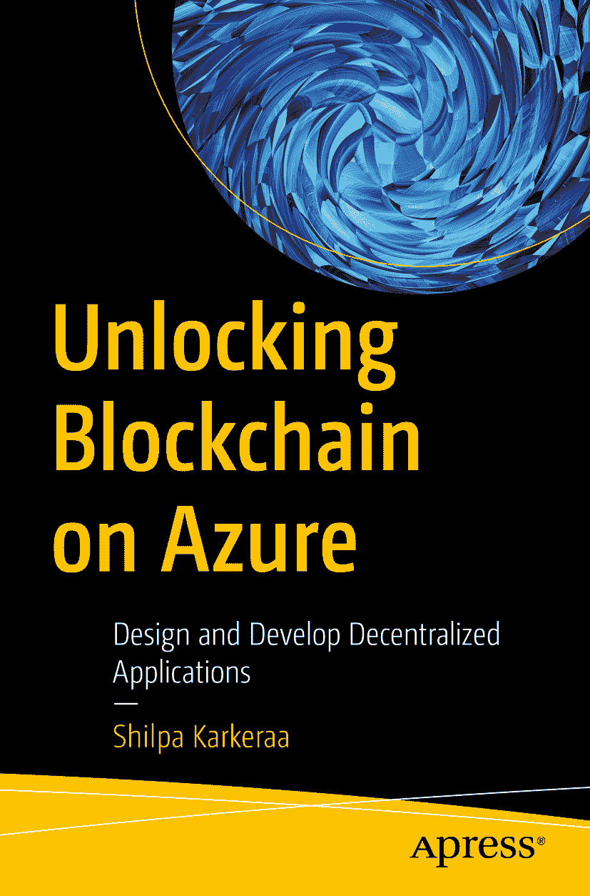

# 地标

1. 封面
2. 目录
3. 正文

ISBN 978-1-4842-5042-6 电子书 ISBN 978-1-4842-5043-3 `https://doi.org/10.1007/978-1-4842-5043-3` © Shilpa Karkeraa 2020，Apress 标准出版。本书中可能出现的商标名称、徽标和图片均为已注册商标。对于商标名称、徽标或图片的每次出现，我们并未使用商标符号，而是仅在编辑风格中使用这些名称、徽标和图片，以惠及商标所有者，且无意侵犯商标权。本书中使用的商品名称、商标、服务标记及类似术语，即使未被明确标识，也不应被视为对是否受所有权保护的表述。出版商、作者及编辑均认为本书中的建议和信息在出版之日是真实准确的。出版商、作者及编辑对本书所含内容或可能存在的任何错误或遗漏不作任何明示或暗示的担保。出版商对已出版地图和机构隶属关系中的司法管辖权主张保持中立。本书由 Springer Science+Business Media New York 在全球图书贸易中发行，地址：233 Spring Street, 6th Floor, New York, NY 10013。电话：1-800-SPRINGER，传真：(201) 348-4505，电子邮件：`orders-ny@springer-sbm.com`，或访问 `www.springeronline.com`。Apress Media, LLC 是一家加利福尼亚州有限责任公司，其唯一成员（所有者）是 Springer Science+Business Media Finance Inc (SSBM Finance Inc)。SSBM Finance Inc 是一家特拉华州公司。

*谨以此书献给这个开放生态系统中的每一个活跃节点，你们激发火花，点燃每一颗思想，让这个世界变得更美好！*

## 引言

*解锁 Azure 上的区块链* 将引导您从多个层面理解区块链——从不同语境下的定义到企业环境中的部署。本书旨在以最易于理解的方式，全面揭示区块链及其相关方面的内容。本书力求以通俗易懂的方式阐明区块链的概念、流程及其在供应链、制造业、海事、石油天然气、贸易融资等众多行业中的可用性。

### 本书结构

前三章定义了区块链及其组成部分。全书贯穿丰富的示例和用例，以确保来自各个领域的读者都能产生共鸣。这些章节力求覆盖概念的广度和深度。本章节介绍了 Azure 区块链工作台及其利用基础设施工具的能力。

第二组的三章探讨了去中心化平台内外的事物。此处的重点是帮助业务开发人员和解决方案架构师为其应用程序做出并解读合适的决策。这些章节让您了解如何更好地规划自身的业务需求，并帮助您制定更完善的开发计划。

最后，最后一组章节展示了可根据应用程序考虑的一系列技术工具和架构。本书将引导您做出决策，从而实现真正的去中心化流程。您在阅读本书时将发现大量用例。本书以动手实践练习收尾，以回顾各章节及其实现。

### 您将学到什么

*   从不同视角和行业理解 Azure 区块链服务所实现的功能及其组件
*   学习使用 Azure 区块链服务的设计指南来设计去中心化应用程序
*   通过基于需求进行多种配置设置的透明、去中心化平台，推动流程和运营
*   通过自动化智能合约加速流程
*   开发去中心化应用程序

### 本书适合读者

*   **业务开发人员：** 希望改进业务流程的人员
*   **解决方案架构师：** 用于架构去中心化平台，使孤立的系统设置能够在透明的互联网络中相互通信
*   **开发人员：** 理解 Azure 区块链服务的技术工具和 DevOps

源代码和图片可在以下位置找到：[`www.myraatechnologies.com/unlocking-blockchains-with-azure`](https://www.myraatechnologies.com/unlocking-blockchains-with-azure)

## 致谢

撰写本书的过程如同乘坐过山车，涉及来自全球不同行业、领域、地点等的实践开发、互动、探索和验证。我感谢在此旅程中遇到的每一个人，他们帮助我构想了一个基于区块链的去中心化生态系统。

我感谢有机会分享我在该主题上的经验，并感谢 Apress Media 的采编编辑 Smriti Srivastava 及其团队对我的信任。我感谢技术审阅者 Jean-Luc Verhelst 对该主题提出的宝贵建设性反馈，以及 Matthew Moodie 为确保本书更易于理解而在编辑方面所做的清晰梳理。

此外，我衷心感谢 Myraa Technologies 的研究人员在本书技术发展及用例方面提供的支持。我感谢我在多个创业计划中的合作伙伴，共同培育去中心化生态系统。

我感谢 Shashwath Bolar 在本书设计理念和实现方面贡献的所有创意。我感谢来自 Aditya Birla Capital 的 Rhythm Jolly，他审阅并反馈了如何使本书中的概念对普通读者更具关联性。

最后，我感谢我生命中的珍宝——亲爱的父亲和母亲：Usha Karkera 和 Shashikant M. Karkera，感谢他们始终如一的无条件爱与支持！我继承了母亲克服生活挑战的坚韧斗志和父亲的热情建议，这些都让本书的写作成为一次真正的体验！

## 关于作者

