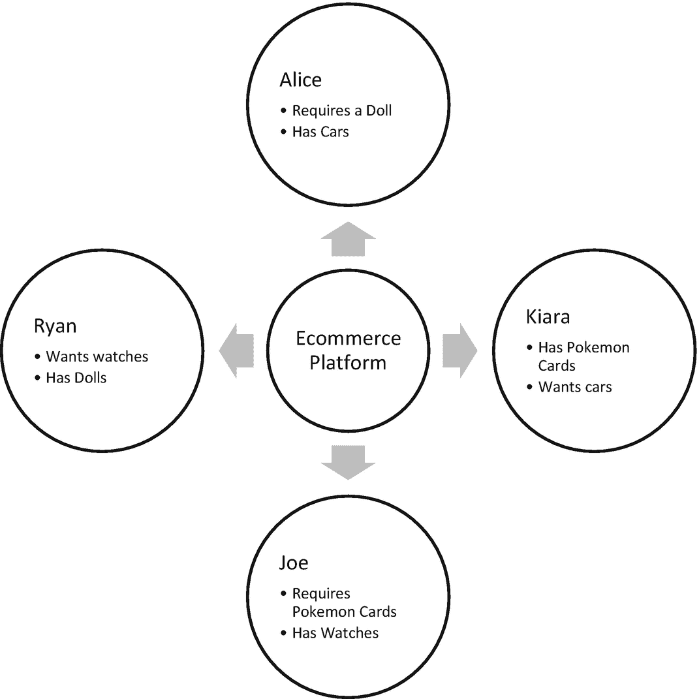
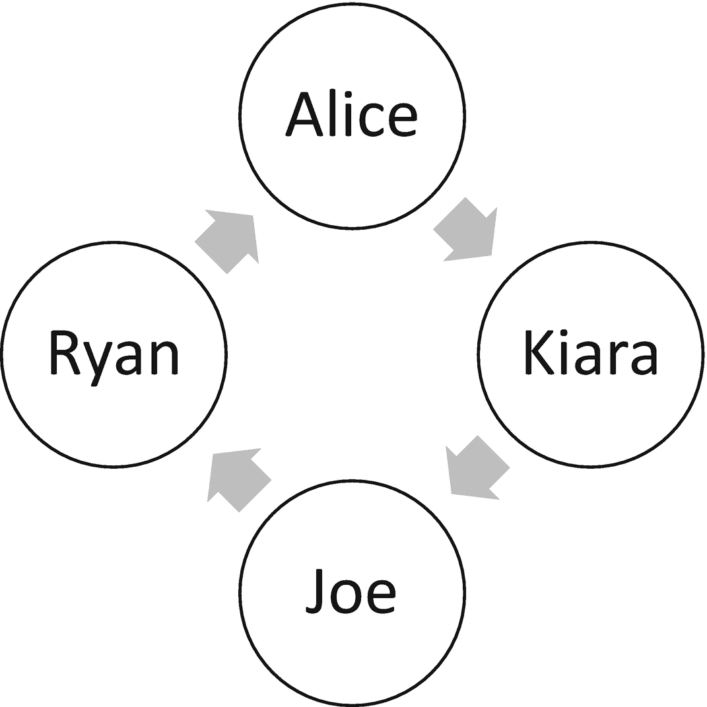
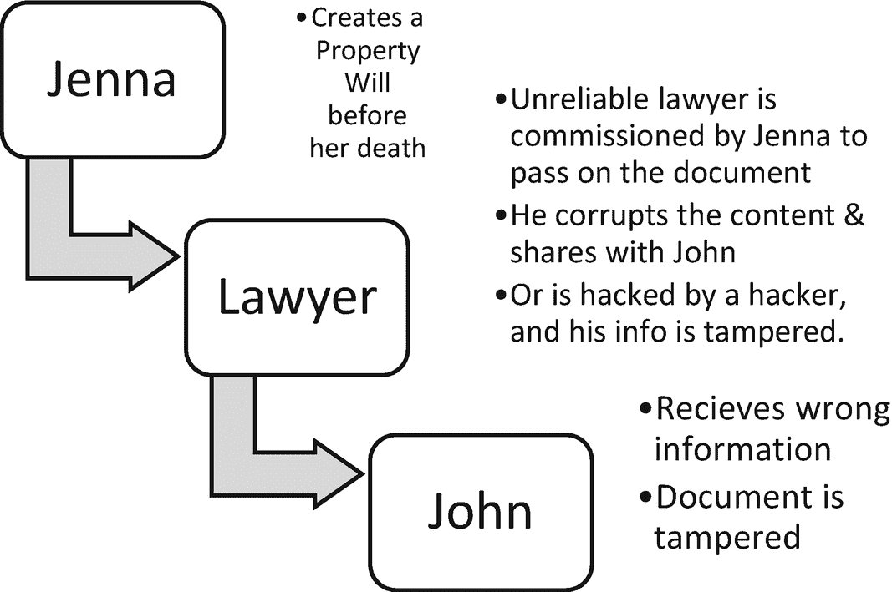
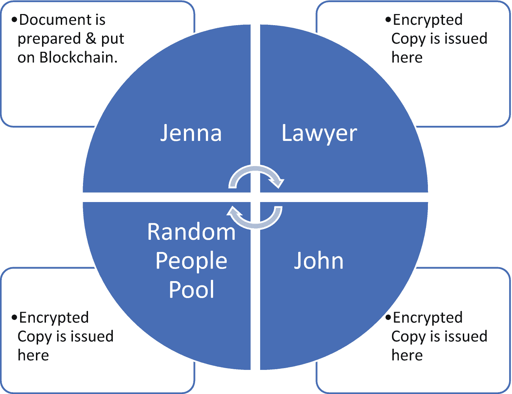
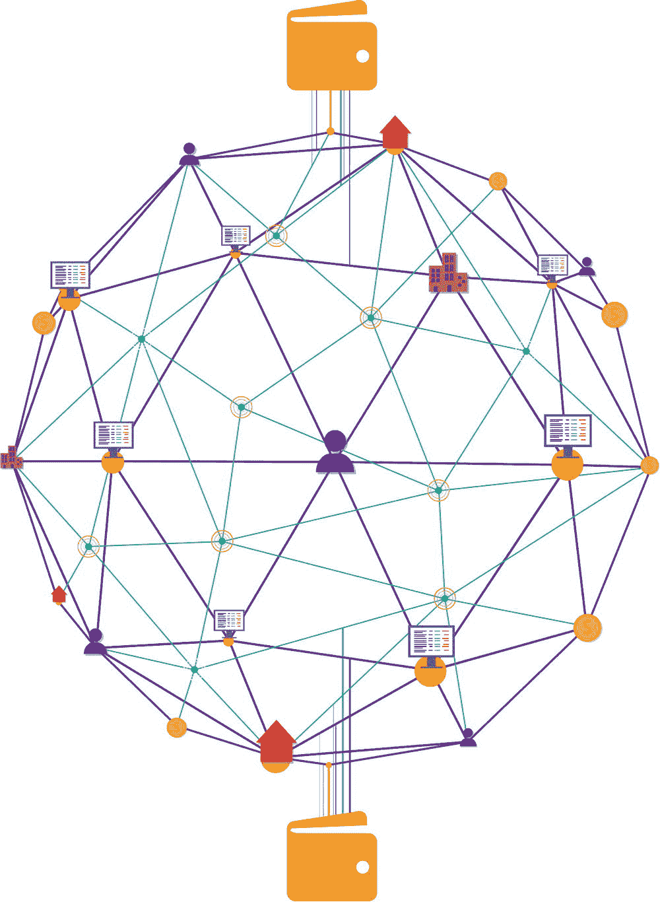
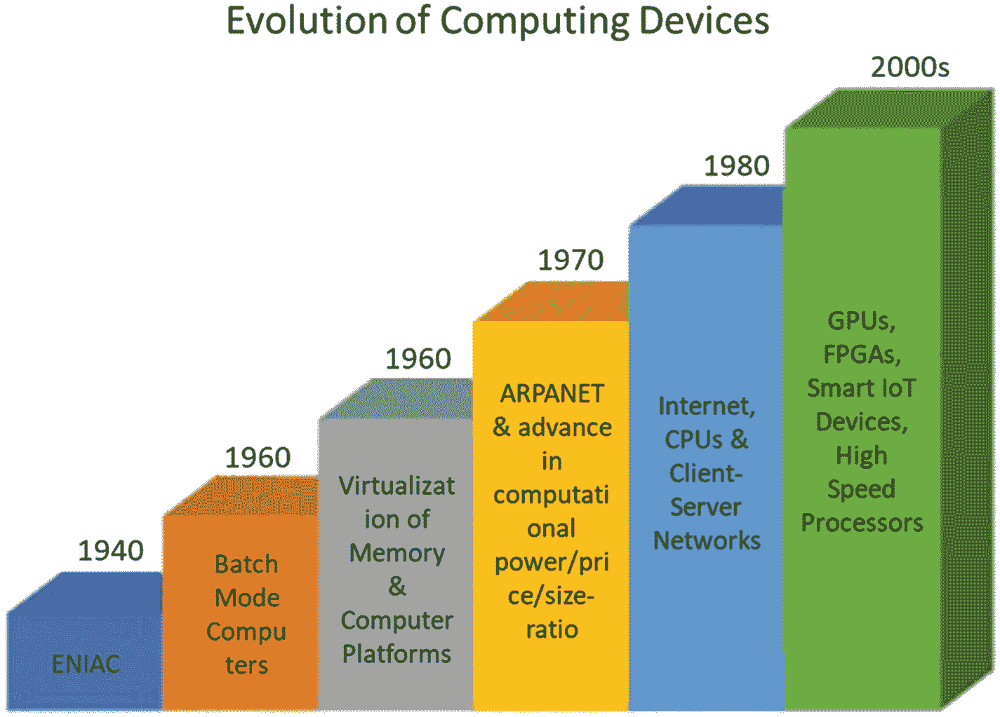
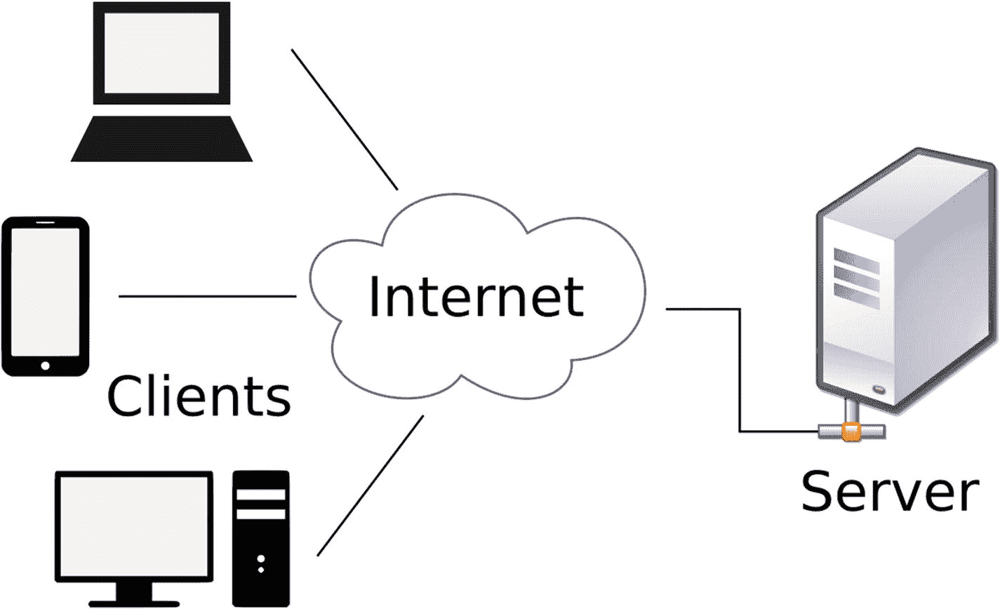
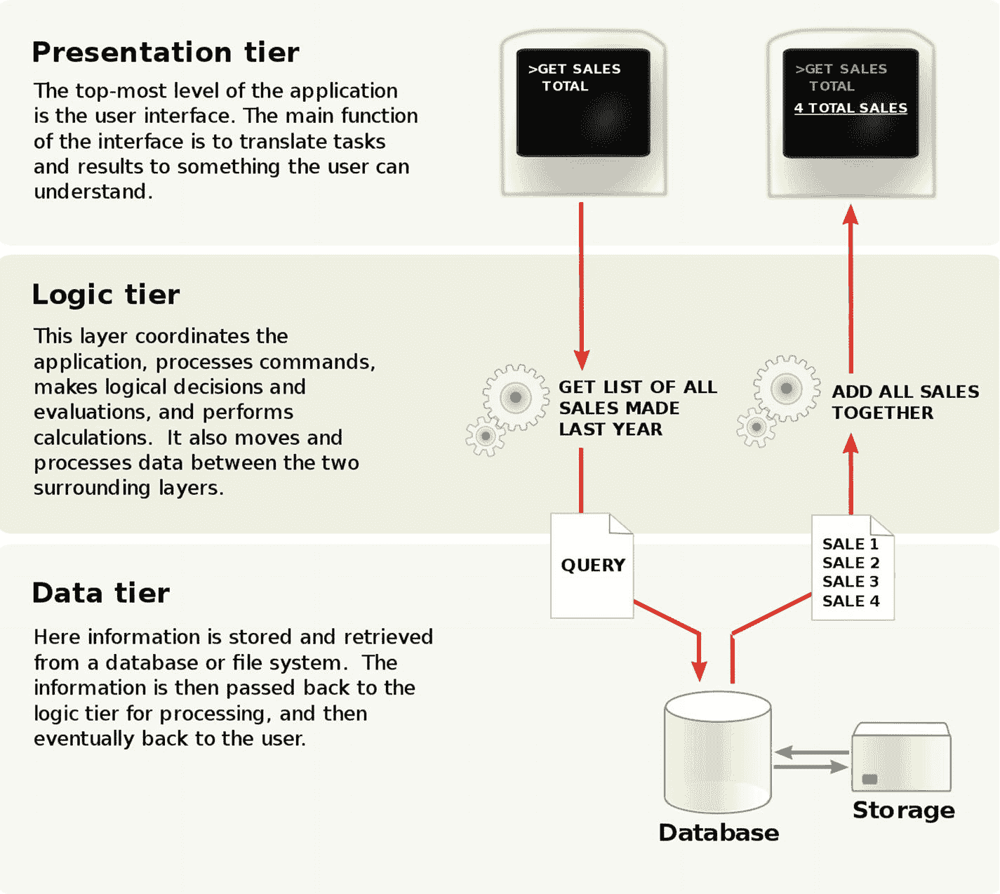
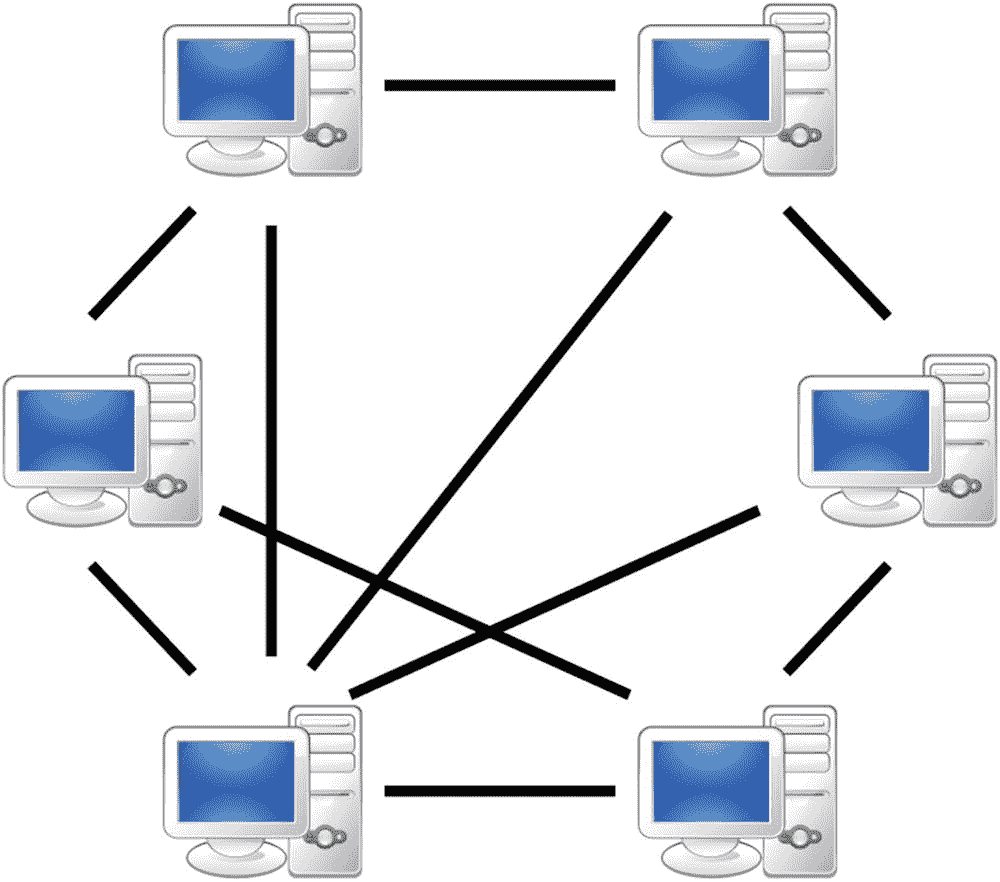

# 区块链：全景解析

本章将以简洁的方式剖析区块链的方方面面，化解技术知识的壁垒，为其他领域的经验与区块链基础设施的融合开辟道路。从而让无论是否具备基础设施的用户，都能使用 Microsoft `Azure` 与区块链，真正实现去中心化生活方式在各行各业的落地！

因此，无论你是学者、首席信息官、人力运营策略师、机械工程师、建筑师，甚至是一个十岁的孩子，或者你觉得自己就是其中之一，我都希望你能在本章中逐步建立起自己的理解。进一步，从本章出发，我们将迈向实际生活中的区块链部署，并探讨如何开发这些部署，使其适应区块链及其各种变体的每一个个体方面。

我们将看到区块链如何改变我们处理金钱及其相关经济学的方式。一旦区块链的基础奠定，我们将学习智能合约，它使用户能够体验数字合约，这些合约以编程方式触发操作并强制执行预先商定的条款。从这里出发，我们将探索企业级现有软件与区块链的整合，这需要大规模的行动。在进入第 7 章时，我们将开启一系列可用于制定区块链策略、业务设计、架构和开发工具的工具集。考虑到本书的读者背景多样，我们将详细阐述用于构建区块链平台和 DApp（去中心化应用）的不同技术架构案例。我们将通过世界各地不同领域的用例来拓宽理解，并探索区块链的跨学科整合。

现在，我们已经预览了接下来几章将呈现的浩瀚内容，让我们聚焦于为什么我们要使用区块链。是什么让它们如此受欢迎，又为何它们承诺要改变金钱、商业乃至世界的方式？为什么全球超过 50% 的最大数字公司投资于这项技术？这是许多个人、公司和生态系统都希望理解的问题。然而，在日常基础上，区块链又如何影响你呢？你的周围环境会因这项技术发生怎样的变化？你将如何与区块链互动？

所有这些答案都将在本章以及本书的后续章节中展开。

就像六西格玛转型那样，针对任何挑战，都要经历定义、测量、分析、改进和控制五个阶段，逐步提升产出率，本章带来了以下六个转变：

*   介绍 – 定义区块链
*   标杆对比 – 从历史事件进化到现代区块链
*   度量从分布式计算到分布式账本的变革
*   分析区块链在行动中的影响和改进
*   通过共识控制去中心化
*   使用 `Azure` 实施并跨领域扩展

## 定义区块链

人类通过探索和发现来最好地理解世界。人类聚集在一起形成一个生态系统，让生活运转起来。商业在国家内部和跨境之间形成了社区、供应链和经济体。连接、互动和演化的本质是万物存在的核心。

区块链正是将这种互动、连接和演化的形式带到了软件平台。它们不仅将数据数字化，还将流程及其状态数字化到一个数字账本中。区块链是一种分布式数字账本的形式，它不仅保存数据，还与日常生活的运作进行交互。

区块链代表了一条由区块组成的链条。这条链是一个由人们以数据块形式相互交互的连接网络。这听起来像是一个现有的社交网络，比如我们都熟知的 Facebook、Instagram、Twitter 或其他。那么，区块链有何不同呢？在任何现有的社交媒体平台或服务中，用户数据是由该社交媒体平台本身托管和管理的中心化服务器存储、传输和管理的。如果该平台运行在区块链上，那么同样的用户数据将以数据块的形式由终端用户自己托管和分发，而非由单一公司管理，以此实现存储、交易和管理。这就是区块链如何使终端用户更好地控制自己的数据及其隐私，并了解其数据如何被存储、维护和分发。

区块链使一组用户能够基于预定义的规则集，就任何操作、交易或决策达成一致。它允许每个人参与决策过程。此外，它通过对数据块和交易进行加密，赋予了链条完全的隐私权。

到目前为止，我们已经理解区块链是一条在对等网络之间连接的区块链条。这些区块由对等节点自己托管，并通过在加密数据和直接交易上达成共识的原则相互连接。由此，区块链提供了一条途径，将努力、价值和金钱的代表数字化到该链上，因为它构成了可信赖的单一真相来源。

接下来，我们将从初学者的视角看到一个区块链的定义，然后是专家的理解，同时注意到不同层次的复杂性和技术性。

### 为新用户定义

如果你是一个对区块链概念完全陌生的人，或者刚刚开始理解和构建区块链的旅程，下面的例子可能有助于你形象化地理解通过区块链进行的实际交易。在区块链出现之前，流程如图 1-1 所示。

图 1-1

交易仅通过商店进行的中心化系统

如图 1-1 所示，爱丽丝、瑞安、琪亚拉和乔都在电商平台上交易，要么购买要么出售商品。这个电商平台可能会在他们每次交易时收取佣金，并可能根据其自身政策调节价格。

然而，他们都信任该平台品牌，以便与全球未知用户进行交易和执行交易。因此，他们依赖的是中心化的、单一的信任来源。

然而，当爱丽丝、瑞安、琪亚拉和乔都在区块链上时，流程如图 1-2 所示。

图 1-2

在链条上以商定的价值进行点对点交易，没有一个单一的中介，而是由一链的人来验证交易

他们都可以直接进行物物交换、交易或交换物品，没有任何价值损失或信任问题。信任得以维持，并由验证交易的其他人在场见证。正如我们在图 1-2 中看到的，当爱丽丝从瑞安那里购买时，琪亚拉和乔的网络就成了交易的见证者；同样地，当其他人交易时也是如此。这条链可以包含无限多的人，多数投票可以允许区块链上的交易。

### 为初学者定义

现在你已经了解了区块链的基本前提，我们将探讨一个交易复杂度更高的案例。在区块链出现之前，由中介机构存储的数据可能被篡改或不可信（图 1-3）。

*图 1-3 多方通过合同参与的用例，由于涉及中介，可信度可能存疑*

如图 1-3 所示，珍娜制定了一份财产遗嘱，并委托其律师在她去世后依法执行。然而，该遗嘱可能容易因恶意或怀有偏见者的篡改或摆布而发生变更。这可能导致不公平的交易，此类交易可能并非总是可追溯的，并且会像我们在图 1-4 的交易中看到的那样，对约翰等人产生负面影响。

*图 1-4 区块链上的防篡改交易*

使用区块链后，你会得到如图 1-4 所示的交易。遗嘱的加密副本对交易中的每个参与方都可用。然而，要修改文档需要获得区块链上所有人的共识，从而在未经所有人批准的情况下防止对遗嘱的任何更改。

律师或其他同行者在未发送更新通知并提醒所有参与共识的各方的情况下，无法修改文档。因此，约翰收到了一份防篡改的文档。链上的任何黑客都无法通过单次黑客攻击来篡改链上的数据。他必须拥有跨链的投票权，才能更改链上所有副本中的文档，这使得攻击文档变得困难。这使得区块链上的数据不可篡改。

### 为专家定义

图 1-5 描绘了在端到端加密的区块链上形成共识的网络软件，该区块链连接了分布在全球各地的对等节点，促进了有中心化中介但采用去中心化见证系统的直接贸易和交易。控制权不属于任何单一用户。验证控制也根据所选的共识协议随机化。

*图 1-5 用户、设备、数据和交易在网络中连接形成区块链*

为了理解构建任何区块链应用/服务的基础概念，让我们通过以下练习回顾透明度、加密、不可篡改性、去中心化和隐私这些关键要素。

**练习：思考并画出不同环境下区块链的链式视图**

1.  我们吃的食物
2.  我们交易的货币
3.  我们共享的文档
4.  我们进行的购买
5.  我们信任并与之建立关系的人
6.  我们打交道的公司

## 历史事件链：分布式计算

在古老的物物交换贸易时代，人们根据自己对特定物品背后价值的理解来交换货物和服务。这种价值是依情况而定的，并未完全标准化。人们可以根据自己对供需的理解，自由地将一根金条等同于 100 公斤大米或五英亩土地。从那时起，当权者根据其发行的货币来标准化商品价值时，价值的概念开始变得集中。从那种货币开始，国家逐渐发展出各自的本国货币。一种货币相对于另一种货币的相对价值取决于世界贸易以及各国之间的相互依赖关系。因此，任何货币都只是一种基于中心化权威声明而被所有人信任的价值形式。如今，随着我们数字化货币、努力和价值，人们可能会将货币的价值改变为数字量化形式。因此，金钱只是一种经过共识信任和接受的数据形式；除中心化权威外，任何人都无法改变其价值。另一方面，将数据置于区块链上，则提供了一种对锁定在链上的价值的去中心化接受，该价值在共享账本上是不可篡改和不可更改的。这带来了一个承诺：无需任何中心化权威，即可在互联网络上，跨越不同部门、国家和经验的人群之间直接进行基于价值的交易；只有一群去中心化的人跨链添加验证。

现在我们理解了基于信任的价值的演变，让我们看看我们在网络方面的技术发展。在互联网泡沫时期，几个中心化平台作为互联网上的聚合器出现。这些聚合器通过自身打开了世界贸易的大门。例如，eBay、亚马逊和阿里巴巴都使人们能够通过它们的平台购买当地没有销售或供应的商品。这些平台上的政策由平台所有者自身制定。这些平台的订阅者仅仅依赖于他们所持有的信任度和品牌价值。因此，每次你将信用卡详细信息输入此类门户网站时，你都是在信任那个中心化实体来促成交易。在技术方面，信用卡详细信息由中心化平台通过该平台选择的机制进行加密。这对用户来说是不透明的，并且永远无法知道其是否完全安全。

另一方面，各种区块链平台公开了其源代码的功能，并将信任根展示为完全由最终用户控制的动态端到端加密。因此，与信任中心化平台不同，你信任的是网络，它不代表单一公司。

随着过去几十年计算设备的发展（如图 1-6 所示），其可扩展性、适应性和可负担性满足了全世界大规模消费者的需求——以至于根据全球移动通信系统 (`GSMA`) 的实时情报数据，有 51.3 亿人（约占世界人口的 66%）拥有手机、计算机和物联网 (`IoT`) 设备等形式各异的计算设备。如今，通过我们随身携带的高速紧凑型设备，我们比以往任何时候都更加互联。我们的数字痕迹已经无处不在。然而，随着数字使用的日益增长，我们的自身痕迹会泄露到互联网各处，容易受到攻击和安全漏洞的侵害，并暴露出一种可悲的信任状态——即那些展示价值但并未完全对我们的数据负责的品牌。

*图 1-6 计算设备的演进*

我们日常在线上使用的应用程序通常只提供了前端或外部界面，而我们对这些应用在后台所使用的、定义并管控平台及我们在此生成的数据的中心化平台，几乎毫无控制权。上一个时代，我们高度活跃于社交网络、贸易网络、电子商务网络等。我们都曾是多个中心化托管数字服务的订阅者或客户。所有这些服务仅靠一个简单的密码来防止邻居登录。

随着数字化的发展，消费者与公司之间的互动模式更多转移到了线上，这催生了对不同商业模式的需求，也促使业务上线。同样地，黑客也变得更加老练，他们利用不断改进的计算设备，每天都能猜测你的密码、入侵系统、窃取数据并操纵交易。每天有超过 4 万个网站被黑客入侵。

我们目前的数字网络形式确实需要进化。由此，区块链应运而生。

让我们看看这种网络模式的转变对每种类型的消费者意味着什么。

### 阶段一：客户端-服务器

订阅者使用托管服务器服务以获得其功能（见图 1-7）。我们使用的许多搜索引擎、电子商务平台和网站都是从这种模式开始的。

图 1-7

客户端-服务器模型

大部分逻辑、数据和用户界面页面都托管在单一服务器上。

随着计算设备的发展以及用户群体的增长，企业开始采用多层网络架构。例如，如果 1 万个用户/客户端希望在传统客户端-服务器网络架构中同时访问同一台服务器，网站的加载时间可能会非常长。因此，阶段二应运而生。

### 阶段二：多层网络架构

在此阶段，客户端逻辑被分离出来，内存计算与运算的中间层也被分离出来，而数据库的数据记录与存储设施则单独维护（如图 1-8 所示）。例如，交易引擎、银行应用程序、电子邮件服务等都是多层架构。

图 1-8

多层网络架构

我们现在明白了中心化服务器群组因其数据隐私、存储和网络结构问题所带来的局限性。第三阶段带来了一个完全互联的、点对点工作的服务器网状网络。服务器不过是一台机器，它自行托管服务，并基于自身设定的权限供他人访问。你个人的手机或平板电脑也可以成为一台服务器。因此，阶段三进化而来。

### 阶段三：点对点网络

每天，越来越多的人希望参与在线交易，无论是购买日用品还是建立视频通话。这些需求仍然由多层网络来满足。然而，理想情况是赋予每位消费者建立自己网络连接的能力。没错，借助全球计算设备拥有者的数字足迹，这是可能实现的。

请注意，并非所有的点对点网络都是区块链，因为去中心化、共识协议、加密和不可篡改性这些要素的结合才构成了区块链，如图 1-9 所示。因此，网络进一步进化，利用区块链解决 `P2P` 网络在控制管理、记录管理、节点添加、数据存储及其状态等方面的大部分问题。

图 1-9

一个点对点网络

如今，每个拥有手机、平板电脑、计算机或物联网设备（称为边缘设备）的用户都可以成为这个互联网络中的一个节点。随着虚拟化和云计算技术的进步，使用基于云实例的服务已扩展到任何用户。因此，如果你的笔记本电脑或边缘设备没有足够的计算能力来与大型互联网络交互以进行基于区块链的交易，`Azure` 提供了基础设施，可以在区块链中形成一个对等节点。

`Azure` 的 `Blockchain Workbench` 不仅允许你作为对等节点参与，还赋予用户使用任何区块链框架构建互联网络的能力。在接下来的章节中，你将看到 `Azure` 提供的基础设施赋能工具，帮助你无论是将离线的还是中心化的在线网络迁移到一个真正的去中心化区块链网络上。

因此，从地球一端的社区经理到偏远地区的任何漫游者，都可以通过 `Azure` 在区块链上建立连接，融合区块链带来的信任与去中心化以及 `Azure` 提供的云计算设施。

简而言之，`Azure` 的 `Blockchain Workbench` 允许任何人只需点击几下即可设置区块链环境的组件。它让你能够初始化建立这样一个区块链网络所需的所有组件。

### 第四阶段：区块链

至此，我们现在已经准备好让点对点网络中的每个用户都能通过区块链来了解、参与并处理这样一个安全网络上的事务。所以现在，如果你发现自己通过区块链购买蔬菜，区块链能让你了解以下信息：

- 蔬菜是如何生长的
- 完整的产地溯源
- 哪个分销商包装了它
- 谁运输了它
- 谁从中获得了报酬

关于这种可能在任何电商网站上发生的活动，可能会产生以下问题：

- 我为什么想知道这些？
- 为什么电商网站不能直接说明这些事实？
- 只要我收到货，我何必在意谁得到了付款？

这些问题的答案，在于对以下几点完全无法控制的挫败感：

- 所交付的质量（他们说有些植物是靠污水种植的）
- 电商平台可能会篡改事实或美化信息
- 可能使用的有害有毒包装
- 低效的供应链交易导致价格上涨
- 运输有时会出现异常
- 付款会由你的信用卡公司提前扣除，有时无法到达零售商手中（这在早期在线支付时经常发生）。

区块链能够实现：

- 来自真实最终用户数据的完全透明性与完整可信度
- 通过点对点网络实现真正的验证，作为一种去中心化的权威形式
- 由所有人形成并接受的成熟的共识与策略网络
- 共享账本上防篡改的数据，并支持公有链和私有链选项
- 真正不可篡改的事实来源
- 针对机密数据的高度安全端到端加密，并在需要时保持匿名性
- 共同开发、接受、强制实施和执行的自动化合约
- 更清晰的量化价值形式，可以在没有强制中心化中介的情况下进行交易。

让我们再看一个现实生活中的例子，了解我们的人际交互数字网络需要如何成熟才能提高生活质量：建筑施工。

房主们投入了价值数百万美元毕生积蓄，以便拥有一个像样的居所和一项能带来长期回报的房地产。那么，当你买房时，你会采取哪些步骤？

1. 搜索合适的地点。
2. 预算内的户型配置。
3. 理想的结构设计。
4. 可靠或值得信赖的品牌建筑商。
5. 建造质量好、强度高的建筑师。
6. 提供最佳原材料的供应商。
7. 按要求建造的房屋开发商。

所有这些步骤都依赖于基于这些专业人士过往经验建立起来的信任。现在，想象一下，如果这种寻找房产的整个手动筛选过程被搬上区块链。它将使购房者能够了解并参与以下事项：

- 水泥和其他原材料来自何处？
- 建筑师毕业于哪所大学？他是否有资质设计所需结构？
- 建筑商拥有哪些许可证？
- 你真正打交道的真的是土地所有者吗？
- 所有文件是否都来自真实来源？
- 提供一份将由点对点网络见证的数字签名

上述所有问题背后的信息，都是从不同的点对点网络中提取出来的，这些网络托管着特定信息，并在区块链场景中直接提供给潜在购房者。请将这与传统的对房屋开发商或建筑商的单点信任模式进行比较。

这是从个人用户的角度来看的。然而，在设想这样一个透明开放网络的好处时，用户常常担心将所有信息都数字化地公之于众。这种担忧可以通过公有链和私有链的区块链变体来解决。该网络通常是一个联盟链或公有链与私有链的混合网络。在这样的网络中，节点被有选择地添加到私有网络中，而公有链网络则向更广泛的受众开放，处理通用信息。

因此，在电商区块链网络中，设计区块链时可以考虑以下几个方面：

- 私有区块链可以私下处理交易，包括购买了什么、谁购买了等信息，这些信息可以直接在相关方之间传输。
    1. 私有区块链中的节点仍然可以根据预先约定的共识，允许/验证加密数据包的传输。
    2. 私有详情通过公钥进行端到端加密，并使用私钥解密。密钥管理可以有多种配置，如第3章“加密”中所述。
    3. 在转售的情况下，可以将新买家添加到这个私有链中，以追溯购买历史、文档的真实来源以及数字轨迹。

- 公有区块链可以像中心化平台一样，拥有产品的通用列表。
    1. 然而，这些数据是不可变或防篡改的。
    2. 所有状态和转换将永久成为公有链的一部分。
    3. 来源的验证可由现有节点通过共同的原则（共识）进行核实。
    4. 产品供应商的加入可以直接在链上完成，无需中心化机构批准，但必须由一个节点群体验证其加入。
    5. 对于产品供应商的任何信息变更，所有节点或大多数节点必须同意并接受，以确保节点网络中的所有副本包含相同的信息。

类似地，对于购房者来说，以下交易适合公有链和私有链：

| 公有链 | 私有链 |
| --- | --- |
| 开发商产品和服务列表记录 | 购买报价 |
| 过往开发记录 | 交易成交 |
| 过往客户评价和体验 | 协议的数字签名 |
| 建筑师作品集列表 | 条款智能合约 |
| 原材料来源 | 买/卖/转售 |
| 土地历史 | 抵押贷款（如有） |
| 许可证和证书 | |
| 交付状态和完工率 | |

请记住：所有这些总是可以在中心化平台上完成。解决导致不信任问题的方法有很多种。然而，这些平台并不透明。它们不让你接触信息的真实来源。它们不让信息源直接触达你。这是否意味着中介就要失业了？

不，他们获得了一条更开放的途径，可以更透明地将人们与全球公平市场连接起来。

既然我们已经回顾了区块链的变体及其实际影响，接下来让我们研究一下在使用它们时需要理解的关键术语。