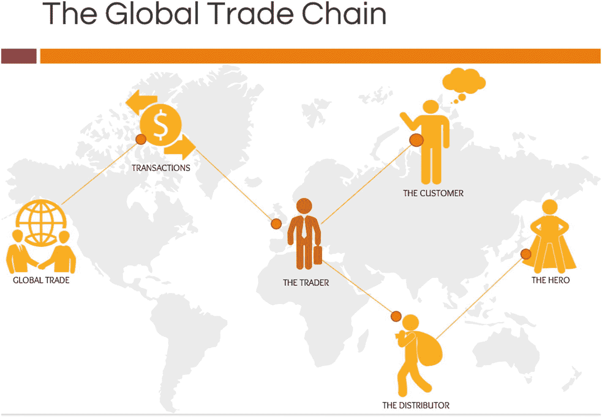

# 区块链是如何工作的？

现在我们已经了解了什么是区块链，让我们从宏观角度看看它们是如何为您工作的。

即便在当今的数字时代，许多企业仍在努力连接不同部门和地区的利益相关者与流程。因此，存在着一种将孤立流程联系起来并建立单一事实来源的迫切需求。例如，财务部门可能有自己计算各分支地点开支的系统，而这未必与行政部门报告的开支相符。尽管有治理流程和制衡机制来解决这个问题，但这需要大量的手动工作和审计。如果采用相同的区块链系统，所有利益相关者都将获得相同的分支开支数值。这是因为共识策略确保了用户添加的任何数据的可信度。从一个小型企业到跨国公司，任何流程如果部署在区块链上，都将展示该流程中产生的所有数据的在线状态。对整个网络的认知是优化和更好地利用流程流的关键，从而建立信任。如果您了解自己的网络和生态系统，找到业务运营的最佳平衡点就像“小菜一碟”。例如，掌握供需关系可以确保低库存成本和低缺货成本。同样，数字化地理解您的网络，能够以多种主动方式开辟对贸易的全新认识。

在多层级网络架构中，当有 10,000 名用户同时访问服务器时，需求会被引导并分配到不同的逻辑队列中以提供信息反馈。而对于单一服务器的客户端网络，这种情况则需要扩展服务器来容纳如此庞大的用户群。

有了点对点网络，不仅负载分布在整个链上，而且安全性也是去中心化的。验证并非由单一方决定或批准，而是由网络中的多数节点来决定。

接下来，我们将探讨不同生态系统中的区块链。

## 对于个人而言

想象一下，您是一位企业主，有些客户总是不按时付款。智能合约会自动触发执行预先商定的条件。因此，如果您将客户锁定在一个智能合约中，该合约包含一条“每延误一个月收取 2%利息”的条款，那么每次延误时，发票的价值都会在账本上更新，客户所欠的金额就会增加。同样，客户也有权期待在此类智能合约下按时交货。如果未能按时交付，客户可以通过预设的程序对企业主处以延迟月份 2%的罚款。由于有验证者链确保其执行和强制力，该智能合约是不可否认的。

## 在办公室部门内

想象一下，您负责一个工程产品装配质量检查的 25 人团队。该部门负责以下功能流程：

1.  装配目视检查
2.  收集装配缺陷图像
3.  标注图像中的缺陷并识别缺陷类型
4.  缺陷诊断
5.  确定推荐诊断方案的责任人
6.  修复缺陷
7.  更新装配记录
8.  最终检查并结案

作为部门主管，您需要确保工程产品的装配完美无瑕。上述每个功能流程都由您部门内不同的相关人员处理。传统上，这个谁做了什么事的记录只有您知道，并且可以存储在标准的 ERP（企业资源计划）系统中。

设想一个场景：您的客户发现了一个重大故障，导致巨额损失，保险公司正在调查故障点。

根据 ERP 系统记录，最后一次质量检查是基于您团队提交的工作文件由您批准的。这个 ERP 系统可能被篡改，从而危及信息的可信度。

因此，区块链在此处的作用是以一种数据不可篡改的方式存储工作痕迹，从而维护信息的可信度与安全性。

## 在跨分公司公司内

想象一家在全国设有分公司且员工分布各地的公司。战略主管必须等待所有区域经理汇总报告。所有区域经理必须联系地区负责人。所有地区负责人都必须从各地方办事处提取数据。这一系列操作是每家大型公司的噩梦。诚然，有 SAP（企业管理解决方案）、ERP（企业资源计划）以及多种软件来处理此事。但数据在层层上报的过程中，有多少次被篡改、调整和修改过呢？这非常值得怀疑。

### 在企业集团中

设想一个《财富》500 强企业集团，旗下涉及近 20 个不同行业领域，其产品或许也能供自家员工使用。集团内部各公司之间的认知度几乎毫无透明度可言。无论是简报、公司活动还是网站上汇总的信息，都纯粹基于品牌认知，而非真正的价值所在。

现在，设想在集团内部存在一个由私有链和公有链组成的混合网络。

公有链可以包含描述各公司结构、领导层和产品的元数据。私有链则可能存储薪资、目标等机密数据。

人们总会质疑，为何此类用途需要区块链。同样的信息在网站或 PPT 演示中也能找到。这些形式的弊端在于：若网站本不打算公开，而仅面向员工的私有账本却对所有人开放，网站便会成为黑客的脆弱目标。一份演示文稿可能被复制、下载，并离线发送给无关人员，不留痕迹。因此，这些媒介存在缺陷，而区块链是更优的选择。私有链可以限制仅高级管理层访问，使其能基于账本上显示的所有来源做出信息充分的决策。

### 在国家间贸易集团中

通过研究世界贸易的宏观经济学，我们都能理解导致货币波动的因素。世界贸易的价值是因素之一。每年不同产品与服务间的供需情况各不相同。市场时常变化，因此经济也因市场修正、贷款政策、政府补贴等因素而变动。其中许多变化是政策驱动的，旨在提高可预测性。然而，其能否按计划运作，还是因涉及诸多变量而崩溃，始终是个存疑的问题。获取正确的数据一直是必需，而数据数字化始于过去十年。与此同时，对可信*真实*数据源的数字化也已开始，区块链确保了数字化过程能够封装结构化、安全、可信的数据。

### 在全球范围内

随着连接性的增强，无需中介便可直接触及全球各地，这开辟了激动人心的机遇之路。可信的教育、优质的食品、能源分配、良好的工作等都将变得更加可及（见图 1-10）。

图 1-10
全球贸易链

当所有这些生态系统都被重构为可信的基础设施后，我们看到我们彼此相处的方式将发生巨大变化，我们的流程被数字化，我们的数据比以往任何时候都更加结构化。

这改变了组织设计。它改变了世界贸易。它改变了我们赋予价值的方式。若能被正确捕捉到区块链中，它为公平贸易和公平评估努力提供了机会。它将政策改革为双方都同意的合约。它消除了篡改交易中已承诺数据的空间。

## 共识算法

从石器时代人类到进化后的社会，大规模的变革总是在人们深信不疑时被推动。这种信念驱动了许多社会愿景。这种信念本身在区块链中被数字化为共识算法。当对某一原则达成一致时，这些共识算法便会执行。这构成了所有类型网络中区块链的核心。网络中的节点在达成共识时，允许交易活动通过区块链网络进行。共识的形式可能因应用和关键程度而异。

共识的形式基于通常在线下场景中发生的必要协商方法。例如，当一个社区决定某个职业需要特定学位时，它实际上是在无意识地验证这个线下协议。以一个现实生活中的例子来说，可以考虑建筑师的角色。文明社会的人们形成了一种信任共识，即拥有建筑学学位的人能够处理建筑物的结构设计。

现在我们理解了现实生活中的共识场景，区块链则提供了基础设施，将这种相互协议数字化到一个连接所有参与决策过程的利益相关者的软件上。

因此，当交易和合约在链上实现时，共识算法构成了区块链最关键的组成部分。

想想那些在成功解放的民主政体中显而易见的领导力思想。这种领导力的驱动者是人民及其信念网络。其数字版本就是共识算法。在区块链世界中，不同的区块链根据其网络结构、链上数据以及交易活动类型，遵循不同形式的共识。

一个著名的共识算法是`工作量证明`，被比特币和以太坊所采用。还有其他几种机制，例如：

- `工作量证明`
  -  希望在链上进行交易的节点需要解决一个复杂问题，花费时间和精力来解决它，以证明其参与意愿。所花费的价值就是处理时间。
- `权益证明`
  -  区块生产者将数据传递到链上的投票机制，需要基于权益条件（财富、任期、资历等）获得多数利益相关者的同意。
- `委托权益证明`
  -  一种基于技术的民主实现，利用投票和选举流程来保护区块链免受中心化和恶意使用。在此机制中，投票权不是由利益相关者直接行使，而是随机委托或基于委托进行，以实现权力去中心化。
- `权重证明`
  -  链上的共识取决于节点持有的代币数量以及找到下一个区块奖励的概率。
- `消逝时间证明`
  -  用于私有链中向网络添加节点时。共识基于经过的时间来达成，根据动态休眠时间验证新节点的加入。
- `权威证明`
  -  对任何数据或交易的共识仅由被授权验证的验证者完成。这可能与联邦拜占庭协议结合使用。

然而，作为区块链的早期采用者，必须理解上述内容只是用于形成共识的机制。你可以根据需要，在自己的网络中开发自己的原则或机制，或合并多种方法来达成共识。请注意，共识算法是在为任何网络设置区块链时设定并预先定义的。更新为新的形式可能需要网络达成共识。

选定区块链框架后，共识机制也随之确定。例如，以太坊最初基于工作量证明机制运行，链上的价值通过挖矿产生，交易效用也利用该价值。因此，共识纯粹基于链上完成的工作量证明而达成。如今，以太坊基于权益证明机制运行，网络运动的价值与挖矿或任何此类行为无关，而是与参与者在网络中的权益成正比。网络的需求和诉求共同决定了共识的选择。

对以共识算法形式接受这一共同协议原则持怀疑态度的人可能会质疑，它是否真的为“真正的共识”而设计。他们可能会质疑，在可能进行关键交易活动的区块链上，这种共识算法是否存在漏洞。这一担忧点通过区块链的开源特性得以解决——源代码被公开以供审阅。因此，链上所有达成一致的参与方都确信算法的真实性。

当企业业务参与采用共同形式、相互认可的共识的区块链时，此类冲突通常是一个关注点。这类框架的开源特性在此发挥着关键作用。Azure 的区块链工作台确保与这些区块链框架的路由连接器具有无缝集成和基础设施连通性。

了解了围绕共识的业务视角后，我们将剖析区块链共识的技术需求。对于为跨企业或跨部门运营编写代码的开发者来说，有无数种情况必须满足。在一个点对点网络中，每个节点的环境可能各不相同，在区块链上执行真正的去中心化活动可能会影响许多不同的工作流。因此，此类网络需要一个共同原则，以便在决策和交易活动中实现去中心化。这就是对共识的需求。考虑竞态条件情况，或需要服务的百万级并发用户请求——哪种情况必须优先处理，由此通过共识算法中定义的原则来决定和管理。

本书在讨论各种用例的同时，考察了共识的不同变体。请记住，共识的选择必须以用户/数据/交易为中心，以便以更具体的形式模拟社会协议。

