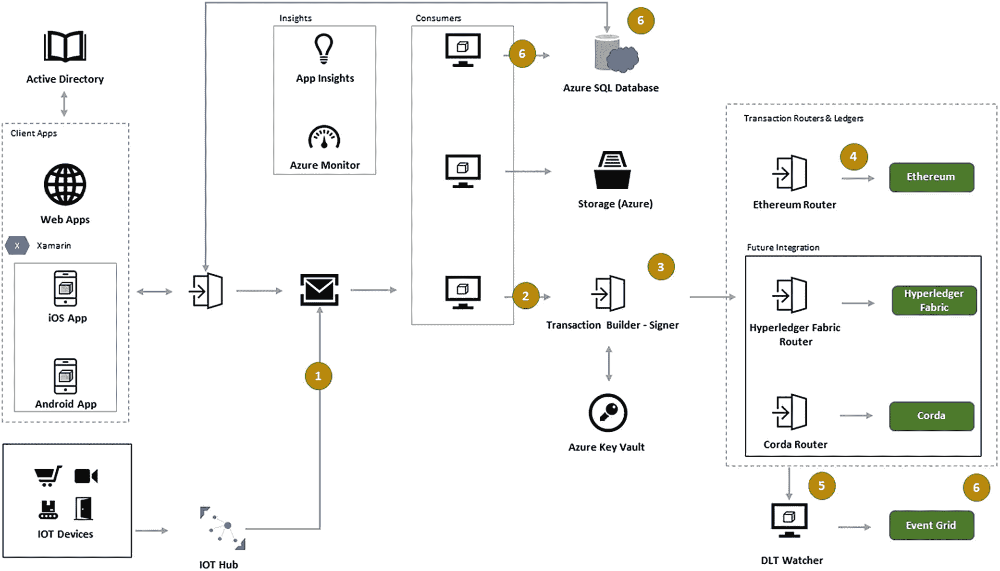

# Azure 与区块链

随着技术意识的提升及其对行业、领域、部门、人群、市场和生态系统的广泛影响，对更好流程的需求也在增长。秉持成为变革推动者的愿景，公司试图利用技术简化运营以提高工作质量。那些已存在数十年的传统行业在全球各地拥有海量数据和人员，他们在广泛分布的部门、地点等地积极运行流程。鉴于市场的竞争性、各种员工的期望、消费者透明度以及决策速度，采用区块链构建真正去中心化的生态系统势在必行。一些公司已经拥有汇总数据的企业软件。但要让与软件交互的人员提供可靠及时的数据是一项艰巨的任务，尤其是在那些在多个国家设有办事处的公司。这正是 Azure 扩展其连接性以及与区块链的企业套件集成之处，如图 1-11 所示。

因此，在我们深入讨论本书之前，先来考虑一下为了使用区块链确保去中心化网络可能需要进行的转变。

## 链上用户授权

企业使用 Azure 的 Active Directory，它确保了员工登录、客户登录等的身份验证和安全性。通过 Azure 区块链工作台，与 Azure Active Directory 的集成是无缝的，身份管理以最少的工作量得以解决。这允许企业处理授权、访问控制和用户角色。当两家企业打算相互合作时，它们各自的 AD 管理可以链接起来，同时不损害去中心化。

一旦 Azure AD 用户注册，Azure 工作台下对应的应用程序即可链接，从而将现有用户身份从集中式系统映射到去中心化的区块链身份。在需要时，通过 Azure 的 AD 映射，链上的用户管理完全匿名化。

图 1-11 Azure 上区块链部署的示例

## 现有信息的元数据

当多个企业参与区块链时，每个企业都带有自己关键的一组元数据。这些数据需为内部运营保持私有，其中部分数据可能对企业间链上互操作活动至关重要。工作台支持将链上数据卸载到 SQL 服务器进行分析，反之亦然，以维护灵活性和隐私性。此外，它通过 Azure 区块链工作台实现区块链与其他 Azure 服务的集成，用于事件触发器、外部 API、IoT 中心等，并通过工作台提供的开放 API 集成提供使用 Java、.NET 和 Python 进行编程的灵活性。

## 需要区块链的流程挑战

在将 Azure 组件与区块链集成之前，设计工作流、流程流和数据流至关重要。密钥管理、链下服务集成和逻辑应用等都可以以各种形式连接起来。组织设计和跨组织设计必须相互接受，或者使用所有参与方都同意的现有框架。

## 业务应用与呈现工具

工作台提供了与逻辑应用和数据监控器（如网络监控器、分布式账本技术观察器等）的大量集成，这些监控器会在发生任何事件触发（如停机、瓶颈等）时发送警报。每个移动状态都会维护日志。Power BI 和数据分析工具等元素为正在进行的活动提供了更好的可视化形式。

这使得它成为任何希望实现去中心化的人的一整套基础设施工具。正如我们将看到的，许多社交媒体社区经理被授权在线或通过聊天管理其群组，Azure 区块链工作台允许用户利用所展示的一系列配套工具来设置点对点网络。