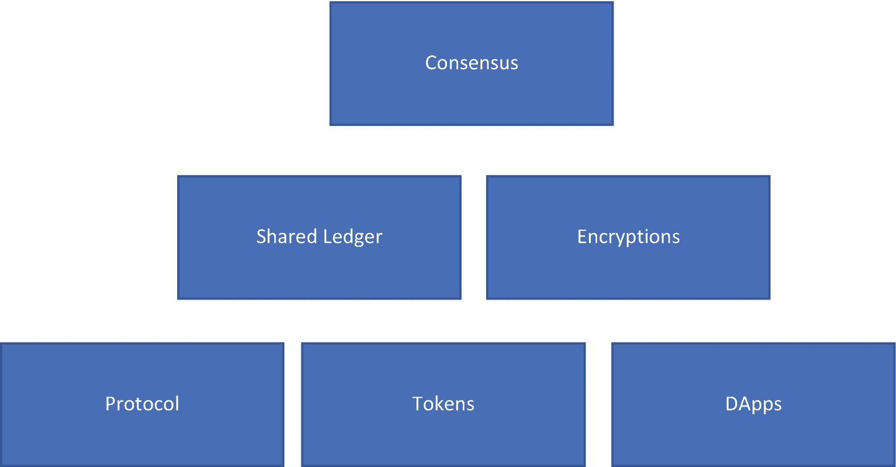
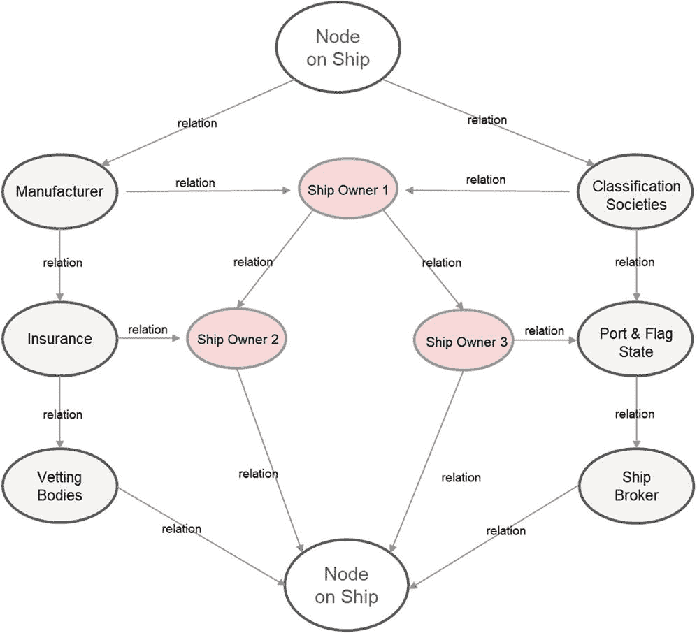
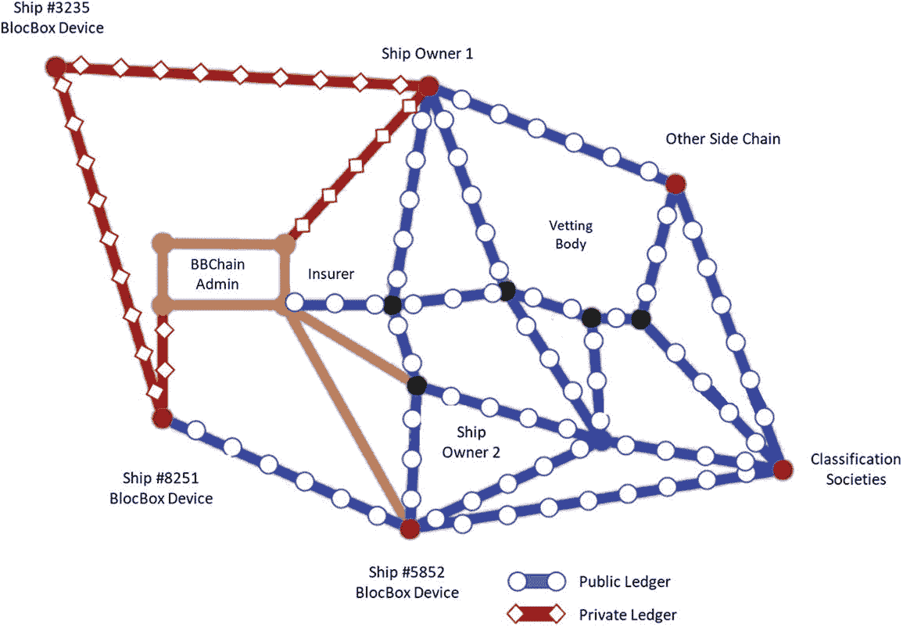
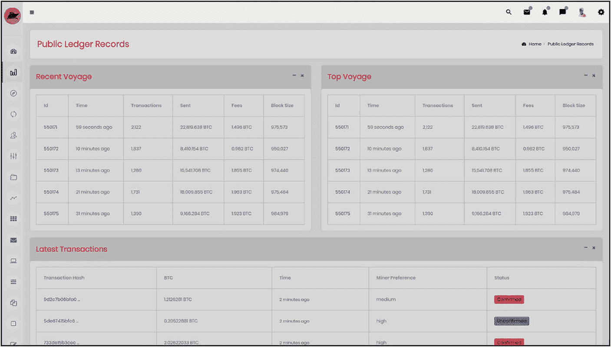
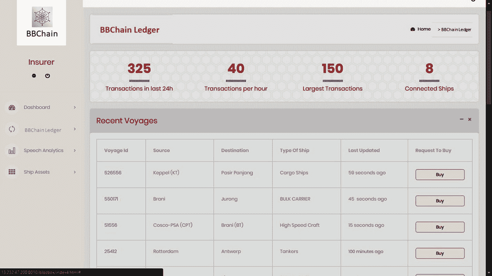

# 2. 解码真实世界的区块链

本章为全书中展开区块链的各个元素奠定了基础。

请让这些概念卡片（如图 2-1 所示）在脑海中循环，我们将看到现实世界的应用如何将它们绑定成一个成功的区块链实现。

图 2-1

区块链各层面的概念卡片

这些概念卡片按照构建区块链时应考虑的先后顺序，从上到下排列。

在本章中，真正在海洋上掀起波澜的真实区块链平台是 **BBChain**——**区块链上的黑匣子**。它带来了一个非常有趣的区块链用例，值得我们学习。我们将解码区块链的每个元素，并观察它如何被嵌入到这个平台中，从而改变全球海事数据的流动方式。本章重点如下：

- 区块链背后的目的与原理——共识与协议
- 将中心化平台转变为去中心化区块链——共享账本
- 在整个链上保障数据安全——加密
- 评估链的价值及其对利益相关者的效用——代币
- 最终图景——去中心化应用（DApps）
- 在 Azure 上搭建区块链环境

## 共识与协议

每十年，都有一些海上的船只和空中的飞机消失。生命逝去，不留踪迹。

这些生命至关重要，与这些事故相关的数据亦然。因此，`BBChain` 尝试通过去中心化的方式，在区块链上处理航行数据记录仪（VDR）数据。传统的黑匣子或船载 VDR 记录了船上发生的一切。然而，它会随着失事船只一同沉没，有时甚至无处可寻。

尽管几十年来各种技术层出不穷，但最新一代的技术专家们制定了将 VDR 数据存储在云端的方案。VDR 提供商会将黑匣子数据同步到中心化的云服务器，黑匣子会按不同的时间间隔向该服务器传输数据。

通过使用基于区块链的 `BBChain` 协议来革新黑匣子，我们将学习共识在增强黑匣子可信度方面扮演的重要角色（图 2-2）。

图 2-2

BBChain 公共账本示意图

如图 2-2 所示，航运贸易中涉及的主要利益相关者包括：

- **作为节点（物联网设备）的区块链黑匣子**：该设备实时将所有船上测量数据、传感数据和航行数据输入到与整个网络同步的区块链节点。
- **船东**：这些用户能够透明地查看船只的实时状况，并进行监控。
- **制造商**：船厂为船舶维护多年的服务合同。加入链上可以让它们实时了解航行的海里数以及所需的维护工作。
- **保险公司**：在审计期间，保险公司需要船舶历史上完整的符合性记录审计追踪。连接到链上可以实现记录的不可篡改。
- **船舶经纪人**：链上的历史记录为船舶经纪人推荐船舶提供了可信度。
- **港口国与船旗国**：港口国是船舶进入水域的地点，而船旗国是船舶注册的地方。这些实体可以在链上可信地接入这些记录。
- **船级社**：制定和维护船舶及海上结构物建造与运营技术标准的组织。
- **检验机构**：这些组织评估船舶的结构完整性和性能，并执行审计和质量检查，以形成标准化的评级体系。

这一系列海事行业的利益相关者构成了公共账本区块链的节点。对于这个公共账本的任何更改，所有利益相关者都必须根据该区块链预定义的协议达成共识。当前，这些利益相关者之间的交互完全基于纸张——或者正在向基于云的数字文档过渡。

在我们深入探讨 `BBChain` 所使用的共识形式之前，让我们先回顾一下共识的简单定义：

> *共识——一群人普遍接受的意见或决定*
> ——《剑桥词典》

任何区块链的核心都在于其共识机制。在区块链上，参与链的一组节点（代表用户的服务器/对等实例）会就一个基本原则达成协议，该原则被编码为一套规则，适用于网络上的每一条数据或每一个状态。这是通过所有节点之间的分布式过程实现的。每个区块链受相同或不同的共识机制管理。

例如，比特币和以太坊采用工作量证明共识机制。每次区块方程被解出（工作）时，奖励的代币就会给予验证交易的个体。

此外，以太坊正寻求转向**权益证明**共识机制。在这种机制下，达成协议时，权益（所有权价值）占据优先地位，而非工作量。

以下是管理不同区块链的各类共识机制概览。

| 区块链名称 | 共识机制 | 描述 |
| --- | --- | --- |
| Bitshares | 委托权益证明 | 一种节点可将权益责任委托给另一节点以验证交易的机制 |
| NEM | 重要性证明 | 重要节点拥有较高的交易控制权 |
| Stellar | 联邦拜占庭协议 | 随机选择的仲裁片段形成交集，代表所有节点验证交易 |
| Corda | 状态有效性唯一性共识 | 节点基于合约对输入与输出状态的有效性以及输出的唯一性（确保输入从未被使用过）达成确定性 |
| EOS | 拜占庭容错——委托权益证明 | 通过一个与容错机制协同运行的持续批准投票系统来选择区块生产者 |

这项技术近期广受欢迎并吸引大量资金流入，主要归因于此类平台具有基于共识的监管特性。在这个数字化足迹日益增长的时代，对工作量、价值和流程的量化需求已增长十倍。

因此，作为软件架构师，我们应如何判断某个原则是否适用于特定区块链平台？

1. 从理解应用场景开始
2. 分解并理解现有应用的数字化形态
3. 识别当前方案中亟待解决的局限性
4. 审视应用的哪些方面需要去中心化、代币化或加密
5. 划分应用的受众——是随机的开放用户，还是仅限受邀者的封闭用户？
6. 分析受众动态。

以 BBChain 为例，上述问题的答案如下：

1.  平台用于在利益相关方之间共享航行数据
2.  现有方案部署在船上或集中式云服务器上
3.  数据可能被篡改或丢失，导致现有方案中关于船只和飞机失踪的阴谋论
4.  数据存储在共享的去中心化账本上，数据价值通过代币量化，并拥有安全的操作通道，使得未经相关方同意，数据无法被篡改或修改
5.  海事行业的受众，如船东、港口所有者、制造商、船旗国与港口国政府、保险公司以及私人用户
6.  用户可能是公共账本的利益相关方，该账本记录船舶航行数据、船名、数据类型、位置、港口和航线。而保险公司等进一步用户可能希望获取超过共享公共账本之外的信息。因此，需要确保保险公司订阅私有账本上的私有数据。

因此，如下所示，一个包含公共和私有账本的混合网络配置是可行的（图 2-3）：

**图 2-3** 多方利益相关者混合网络的直观表示

-   **公共账本**：一个节点链，数据对所有节点公开共享，并通过该链普遍认同的共识机制公开验证每一笔交易。任何人都可以公开邀请新成员加入此链，并透明地添加区块。
-   **私有账本**：一个由精选节点组成的链，这些节点拥有对私有数据的独占访问权，并拥有经许可的能力集在内部形成共识的选择性验证权。

BBChain 协议为海事领域点对点网络中的利益相关者就航行数据达成共识提供了一种方式。该链是一个混合区块链，由涉及 BBChain 节点、船东和船上物联网设备的私有链，以及包含所有海事利益相关者的公共链组成，如图 2-3 所示。当链上出现私有交易时，可以即时创建私有链。多个此类私有链被称为侧链，它们从公共链中衍生出来。

该协议中的共识只能通过以下机制的混合来实现：

-   联邦拜占庭协议
-   权益证明
-   重要性证明

该协议的基础是在公共账本上采用联邦拜占庭协议，该账本包含海事行业的所有对等节点，包括制造商、港口国与船旗国政府、船东及其他利益相关者。因此，让我们使用图 2-3 深入探讨该协议，以更好地理解它。

### 联邦拜占庭协议

如图 2-3 所示，黄色的公共账本将链上的所有参与者连接在一起。公开数据的分布完全依赖于该账本配置。这种共识机制包含了`FBA`（联邦拜占庭协议，将在本书后文解释）的原理及其容错能力。因此，所有面向利益相关者公开的船舶航行数据，例如航线、位置和航程安排，都会在账本上公开共享。任何有兴趣了解特定航程的利益相关者都可以发起合约请求，加入私有账本以获取更多关于该航程的信息。

图 2-4 展示了`BBChain`的仅追加特性，它记录了区块链账本上数据的每一个状态。公共链上的每一笔交易都会由所有利益相关者见证。

图 2-4

公共账本记录

同样地，航程状态的透明度（图 2-5）、航程数据购买类型及其他操作，都会由公共链节点见证和验证。

图 2-5

公共账本记录——可透明购买合法数据的地方

该平台允许用户透明地购买航程数据，并惠及包括船东和数据所有人在内的合法利益相关者。你可以将其视为旅游网站上的机票选项列表。

那么现在的问题是，如果这就是区块链上公共账本的功能，那为什么不直接使用互联网上已有的传统网站列表呢？许多列表，例如 Monster Jobs、Expedia，甚至亚马逊，都在公开提供大量信息。

然而，很多时候，这些平台上的数据完全由运营它们的公司控制。因此，真实用户的民主性在这些情况被完全忽视了。每当出现“条款和条件”弹窗时，许多在线用户被迫签署并接受，从而使用这个中心化平台。很多时候，中心化平台自身难以追溯的欺诈活动会引发诸多不便，例如虚假工作、虚假报价或劣质产品。在中心化平台上，控制并修改显示数据的访问权限要宽松得多，因为它往往不需要所有验证者共同验证。此外，如果此类中心化平台没有设计适当的通知系统，用户甚至可能不知道数据发生变更，这使得数据极容易变动，可信度降低。

而基于公共账本的区块链正好解决了这个问题，它为用户带来了完全的透明度，可以追溯每一次数据的添加或交易，了解数据添加的来源，并在最初就批准数据通过。

但是，请不要将透明度误解为没有隐私。这是区块链的另一个强大特性，它涉及对分布在账本上的数据进行加密（将在后续小节中解释）。

 冷知识

列举三种可以在公共账本上去中心化运行的应用。

### 权益证明

船上的`BBChain`将数据传输到账本网络。然而，由于数据的敏感性和所有权，并非所有数据都公开可用。因此，这些数据对身为高层利益相关者的船东来说是一项资产。他们可以决定将数据分享给希望共享的利益相关者。例如，船东需要为船舶申请保险。此时，拥有数据高权益的船东可以决定以侧链的形式创建一个内部私有账本（在图 2-3 中以浅蓝色突出显示）。

 挑战

类似地，思考一下你的证券交易所将如何在区块链上运作。

*   列出哪些数据点进入公共账本，哪些进入私有账本。
*   确定使用该区块链的所有关键利益相关者。
*   确定需要在链上和链下执行的操作。
*   列出链上操作并定义其强制性原则。
*   参照图 2-3、2-4 和 2-5，绘制出结构、操作和利益相关者。

`BBChain`的侧链将在签约的利益相关者之间共享私有信息。合约将是一份数字合约，通过编程方式允许用户就某些要点达成一致，例如数据量、类型、订阅价格和有效期。这个内部链基于权益证明运作，因为只有拥有重大权益的人才能访问该链、贡献数据、查看数据和交易。起初，出于显而易见的原因，船东将拥有其船舶数据的最大权益，随后这些权益将根据初始合约，通过订阅方式分配给其他利益相关者。当其他生产者在私有链中做出贡献时，船东（区块生产者）会将部分权益委托给他们，使他们成为接收私有数据（如保险报告、审计报告等）的订阅者。

### 重要性证明

在前两种配置设置完成后，重要性证明方法用于跨链数据传输和优先级访问，其依据是该节点在账本上交易累计的价值。这有助于在多个利益相关者同时产生兴趣时，应对高流量需求场景。节点可以获得重要性，或者交易可以根据代币数量、数据大小和数据热度获得重要性。

通过融合这三种机制，我们构成了 `BBChain 协议`。

 挑战

为以下应用设计一种共识机制：

1.  住房社团活动，例如选举成员、审批无异议证书（NOC）等。
2.  具有质量控制的食品原材料账本

