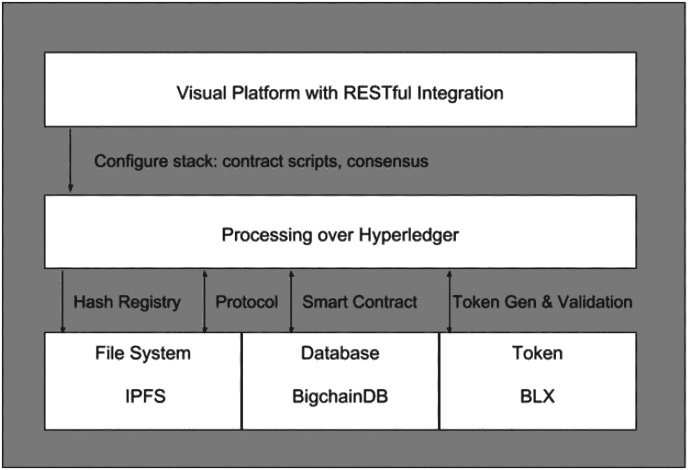

# 去中心化应用

在理解了区块链的所有构建模块之后，我们看到每个基本元素是如何融入应用程序，从而形成从去中心化账本到完整运行的区块链的。这不仅仅构成一个软件，更是一个强大的生态系统，能够驱动这个数字时代的经济。

每一条区块链都代表着量化与共识的一个重要方面。已有许多现存的分布式数据库、账本、流程和系统，区块链之所以如此关键和与众不同，就在于其恰逢其时的出现、完善的生态系统，以及能够将其背后的真实价值体系货币化的能力。

## 应用案例：BBChain

回到 `BBChain`，它为利益相关者带来了来自海运航程的高度可信数据源，其价值标准仅仅由上一节中提到的参数生成。

围绕此类去中心化应用形成的问题如下：

-   你这条链的核心数字资产是什么？
-   关键利益相关者如何使用该数字资产？
-   如何维护数字资产的安全性？
-   如何维护合约和共识以保障资产数字交易的信誉？
-   哪些技术符合区块链应用的需求？
-   是否需要可扩展性？如何保持可扩展性？

针对 `BBChain`，相应的答案如下：

-   航程数据是关键的数字资产。
-   利益相关者，如区块生产者（船东、港口所有者）生成数据，而保险公司和航运管理机构则订阅/购买此类数据。数据作为区块在不同的侧链和公共账本上传输。
-   由于完整的加密数字资产（通过 `公钥`）会被分解，并以容错共识的方式分布在不同的节点上，当达成正确的共识后，数据包的位置会被揭示给正确的利益相关者。在按正确顺序累积所有数据包后，正确的利益相关者使用 `私钥` 进行的解密操作将是有效的。
-   正当的利益相关者与区块生产者/买家之间订有合约。在创建合约时，会根据合约的到期时间生成 `公钥` 和 `私钥`。密钥随合约一起到期。私有账本上的共识由权益证明机制来管理。这由该侧链的所有利益相关者共同验证，这些利益相关者在其服务器上以加密形式共享了分布式数据。
-   该架构支持满足链条件所需的技术（图 2-6）。

图 2-6：`BBChain` 组件的架构

-   由于船舶的航程数据记录着航行的每一刻，因此账本需要具备可扩展性。这一点通过 `BigChainDB` 和 `IPFS` 提供的存储机制来实现。

## 挑战

假设你要通过区块链出口商品并进行交易，请针对上述问题提供你自己的答案版本。记下你的想法，并与后续章节中提供的用例进行比较。