# 搭建区块链环境

到目前为止，我们已经在理论上涵盖了区块链的所有基础知识。现在，让我们进入实践环节，搭建一个区块链基础设施。

在本节中，我们将在 Azure Blockchain Workbench 上部署一条区块链。可以将其视为一套有助于构建区块链的基础设施组件包，就像组装床或衣柜的宜家安装指南一样。Azure 大大加速了部署过程，因为基础设施元素以打包形式处理好了。此外，在云上部署使得所有节点/用户之间的连接更快，便于业务流程进行连接和协作。

Azure Blockchain Workbench 提供了一组 Azure 云组件，以及区块链的核心元素，并以模板形式封装在各种架构方案中。它通过开箱即用地支持其他基础设施元素，使企业能够专注于区块链的目的和设计需求。

## 部署步骤

1. 如果没有 Azure 账户，请先开始设置您的 Azure 账户。可以参考 [`https://bit.ly/2Gd6TLk`](https://bit.ly/2Gd6TLk) 来获取此处提到过程的详细操作指南。在本章中，我们专注于实现及其在我们的应用程序中的使用。

2. 注册并登录仪表板后，点击左侧面板上的“+ 创建资源”（图 2-7）。

   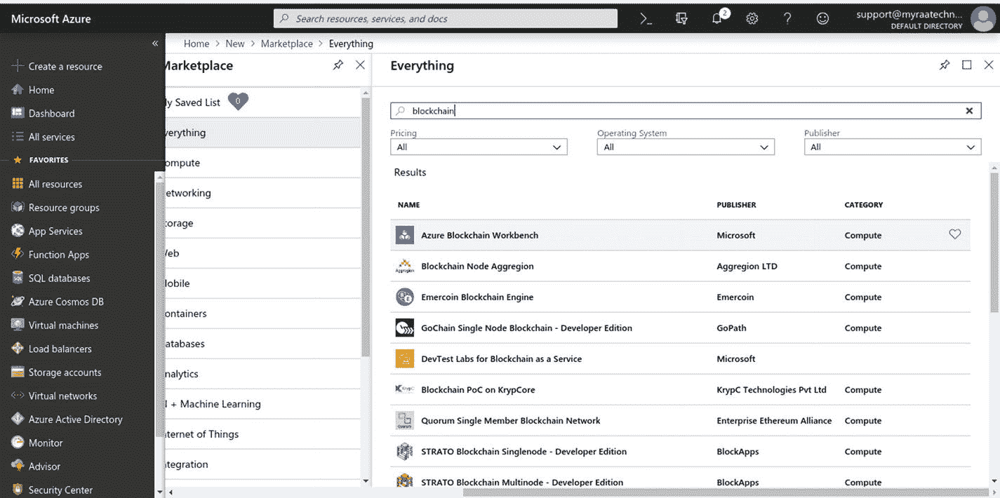
   图 2-7：Azure 市场展示

3. 接着，搜索“Azure Blockchain Workbench”，它将帮助你设置所需数量的元素，例如加密密钥保管库、数据库、应用程序层和命名空间（图 2-8）。

   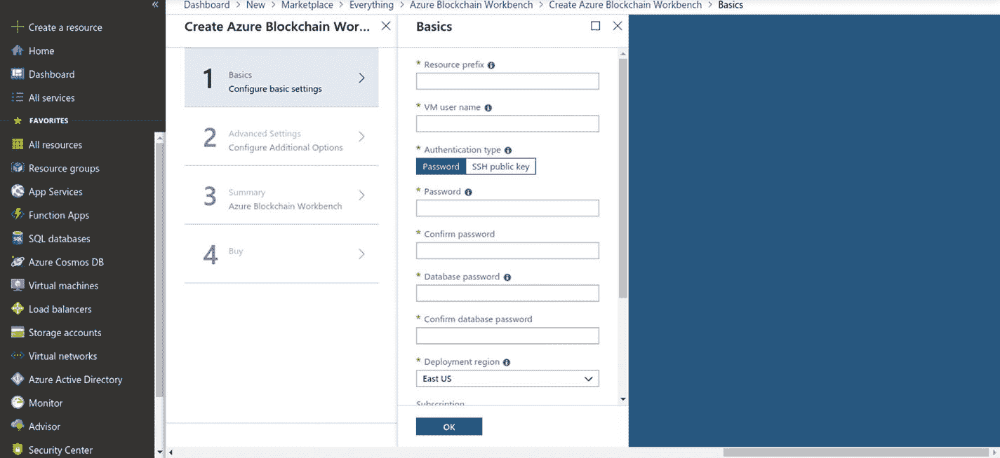
   图 2-8：设置 Azure Blockchain Workbench

4. 选择 Azure Blockchain Workbench 后，根据你的用例填写字段。我们为 `BBChain` 填写了以下内容（图 2-9）。此步骤为资源组及其虚拟机设置了命名约定。

   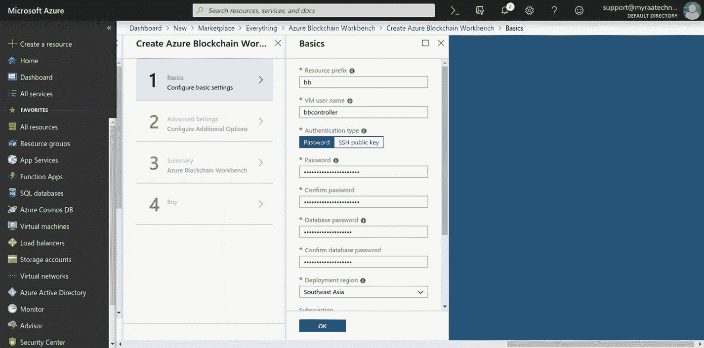
   图 2-9：Azure Blockchain Workbench 的设置

5. 在第一步中定义了基本凭据后，第二步涵盖了所需设备的规格；例如，验证节点规格（图 2-10）。

   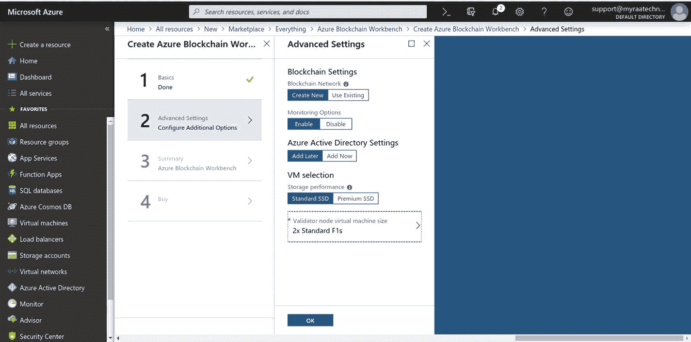
   图 2-10：Azure Blockchain Workbench 的设置

6. 由于这是一个用于理解设置过程的原型教程，我们在这里选择了一个 `F1s` 服务器验证节点，配备 `2GB RAM` 和 `4GB 本地 SSD`（图 2-11）。

   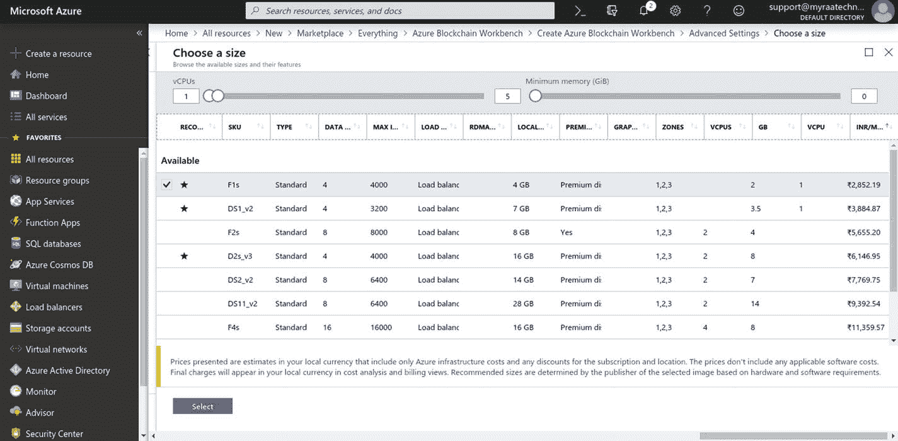
   图 2-11：实例的选择

7. 现在，查看摘要（图 2-12）。

   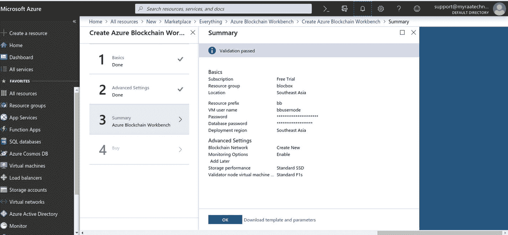
   图 2-12：生成的 `BBChain` 资源组摘要

8. 在步骤 4 中点击“购买”后，创建元素列表的部署过程开始。资源组被创建，元素根据指定的选择进行初始化。这可能需要一些时间，因为虚拟设备正在设置中。

9. 部署完成时，你可能会收到通知。或者，你也可以通过侧边栏上的资源组来访问相同的内容。

10. 接着，在资源组屏幕上，选择区块链名称——在我的例子中，是 `BBChain`。

11. 部署完成后，打开资源组。你会发现所有服务器元素和其他基础设施元素都已部署完毕，如图 2-13 所示。

    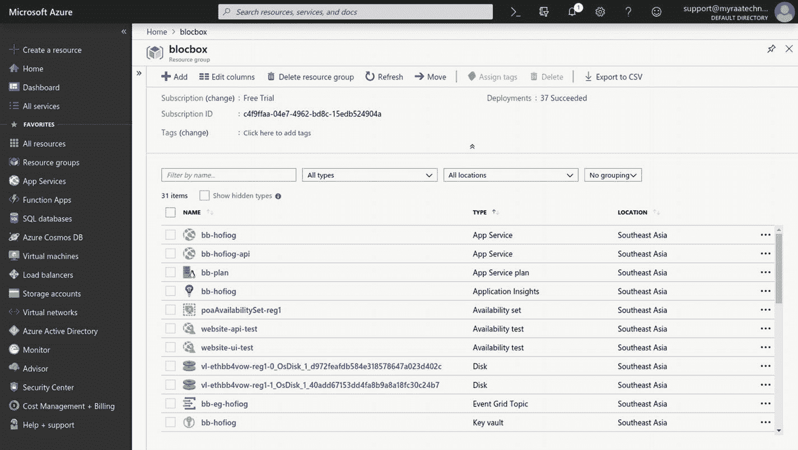
    图 2-13 展示了构建区块链模板的基础设施元素列表

## 基础设施元素

该资源组拥有如图 2-14 所示的一组已启动待用的元素。

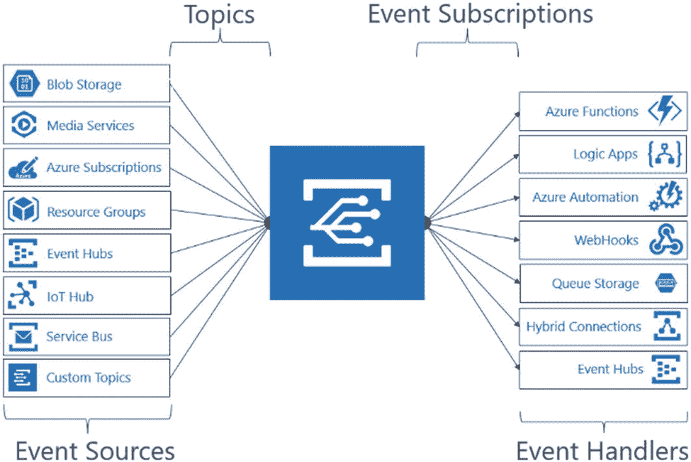
图 2-14 Azure 事件网格元素

更多详情如下：

- 一个 `Event Grid Topic`
    - 在去中心化平台中，多个用户位于不同服务器之后，基于智能合约或协议/共识机制会出现某些事件触发器。因此，Azure 提供了一个实用系统作为事件网格，用于管理链上的各种事件触发器和处理程序。`Event Grid Topic` 为事件发布者提供了一个端点，用于创建和发送事件触发器。
- 订阅者可以根据接触点的类型选择连接到 `Event Grid Topic`。
- `Event Grid Topic` 将其连接端点扩展到 Azure 以及非 Azure 组件，以便链上在线和离线元素可以订阅事件触发器。
- 将其视为事件触发器和监听器的连接器。
- 两个虚拟网络资源组（每个都包含负载均衡器、网络安全组、公共 IP 地址、虚拟网络）
    - 负载均衡器有助于将用户请求和其他事件触发的请求均衡分发到服务器。
- 用于维护所有系统活动日志的 Log Analytics 工作区。
- `App services` 用于承载业务应用逻辑以及基于 REST 和基于消息的 API 层。

点击显示的第一个应用服务，将打开该服务的配置详细信息，您可以在其中找到分配给区块链网络的公共 URL。此外，公共 URL 可以配置为任何所需的域。就本介绍而言，我们将访问提供的默认链接。

| 名称 | 类型 | 位置 |
| --- | --- | --- |
| `bb-eg-hofiog` | `Event Grid Topic` | 东南亚 |
| `bb-hofiog` | `Application Insights` | 东南亚 |
| `bb-hofiog` | `Key vault` | 东南亚 |
| `Bb-hofiog`, `bb-hofiog-api` | `App Service` | 东南亚 |
| `Bb-lb`, `ethbb4vow-vlLb-reg1` | `Load balancer` | 东南亚 |
| `bb-lb-public-ip` | `Public IP address` | 东南亚 |
| `bb-plan` | `App Service plan` | 东南亚 |
| `bb-sb-hofiog` | `Service Bus Namespace` | 东南亚 |
| `bb-subnet-workers-nsg` | `Network security group` | 东南亚 |
| `Bb-vnet`, `ethbb4vow-vnet-reg1` | `Virtual network` | 东南亚 |
| `bb-worker-n` | `Virtual machine scale set` | 东南亚 |
| `db-hofiog-bb` | `SQL server` | 东南亚 |
| `hofiog-bb` (`db-hofiog-bb`/`hofiog-bb`) | `SQL database` | 东南亚 |
| `ethbb4vow-akv` | `Key vault` | 东南亚 |
| `ethbb4vow-lbpip-reg1` | `Public IP address` | 东南亚 |
| `ethbb4vow-oms` | `Log Analytics workspace` | 东南亚 |
| `ethbb4vowstore`, `hofiogbb` | `Storage account` | 东南亚 |
| `ethbb4vow-vlNsg-reg1` | `Network security group` | 东南亚 |
| `poaAvailabilitySet-reg1` | `Availability set` | 东南亚 |
| `Vl-ethbb4vow-reg1-0`, `vl-ethbb4vow-reg1-1` | `Virtual machine` | 东南亚 |
| `vl-ethbb4vow-reg1-0_OsDisk_1_d972feafdb584e318578647a023d402c`, `vl-ethbb4vow-reg1-1_OsDisk_1_40add67153dd4fa8b9a8a18fc30c24b7` | `Disk` | 东南亚 |
| `vl-nic0-reg1`, `vl-nic1-reg1` | `Network interface` | 东南亚 |
| `Website-api-test`, `website-ui-test` | `Availability test` | 东南亚 |

- `App Service Plan` 只是所有正在运行服务的记录，包含了应用服务，而这些服务本质上就是 Linux 服务器上的服务。
- 应用服务的 `Application Insights` 提供服务使用情况的统计数据，如用户访问次数、服务器请求数、独立用户数、服务器响应时间等，如图 2-15 所示。

  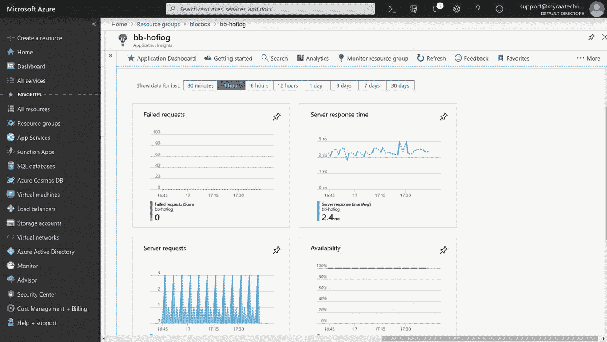
  图 2-15 `Application Insights` 仪表板

- 一个 `Availability Set`
    - 可用性集是 Azure 中提供的一种逻辑分组功能，可确保您在 Azure 数据中心内部署 VM 资源时，这些资源彼此隔离。
- 两个 `Availability Tests`
    - 该测试验证应用服务 `bb-hofiog-api` 的可用性，如图 2-16 所示。
- 这里我们有两个测试集，一个用于 API 应用服务，另一个用于 UI 层。

  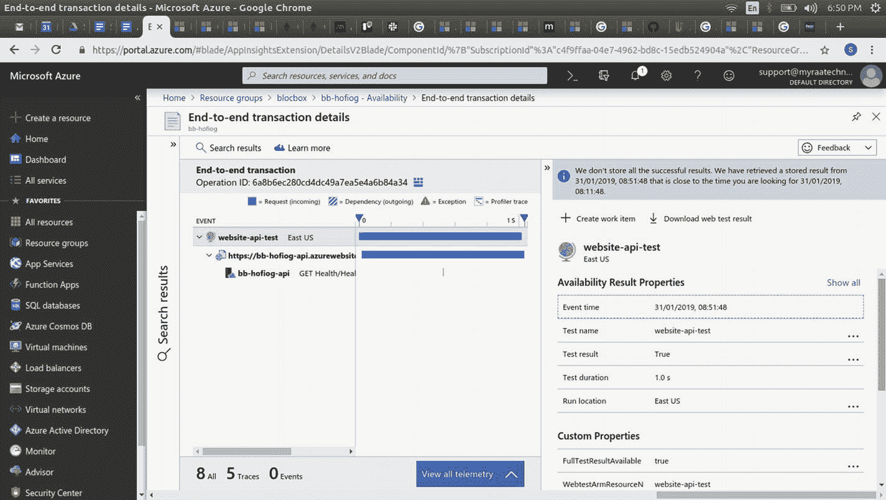
  图 2-16 可用性测试集

- 两个 `SQL Databases`（标准 `S0` 层）
    - 这些只是运行在 Ubuntu 上的 `30GiB SSD` 存储服务器。
- 为应用服务提供的两个 `Azure Key Vaults`
    - 密钥保管库，顾名思义，有助于创建、存储、管理并符合 `FIPS 140-2 Level 2` 标准，并启用 `SSL/TLS` 证书。简而言之，它们是处理应用服务安全相关方面及其他加密密钥的工具。它们是一个一站式安全中心，无需从头重新发明轮子。`Azure Key Vault` 的功能提供了任何企业开发和生成部署流程所需的全部强制性方面。
- 然而，这并不意味着使用它就能确保安全。该工具必须在应用服务内正确配置，遵循为区块链定义/设计的加密标准。`Azure Key Vault` 确保密钥永远不会从保管库中释放。我们将在下一章详细介绍加密方面。
- 一个 `Service Bus Namespace`
- 两个 `Azure Storage accounts`（标准 `LRS`）
- 两个 `Virtual Machine scale sets`（账本节点和工作台微服务）
- 可选：`Azure Monitor`

如上表所示，所有基础设施元素均已创建、配置并适当互连，以支持区块链网络。第 1 列显示分配的元素名称，第 2 列提供元素类型，第 3 列提及元素所在的区域。

## 应用访问

单击 Azure Blockchain Workbench 通过应用服务提供的公共 URL，可以打开链接看到如下页面（见图 2-17）。

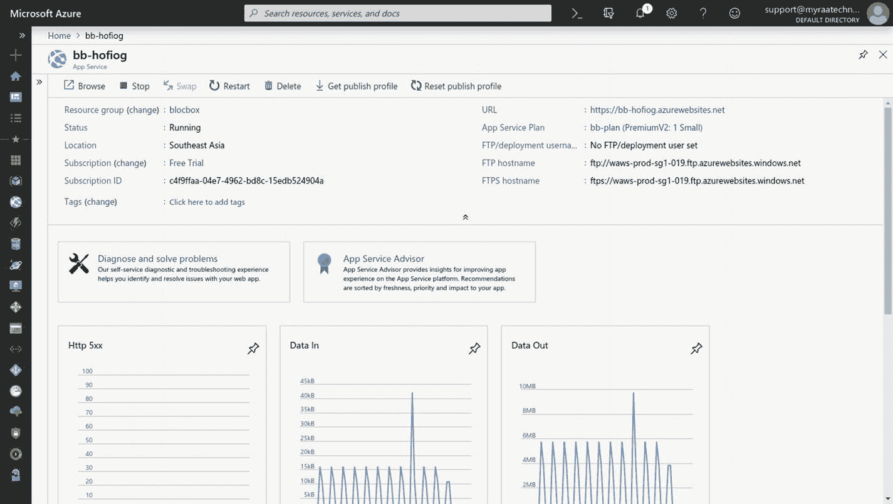
图 2-17 应用服务面板

将其复制并粘贴到 PowerShell 中，系统会要求您添加 Active AD Tenant（图 2-18）。

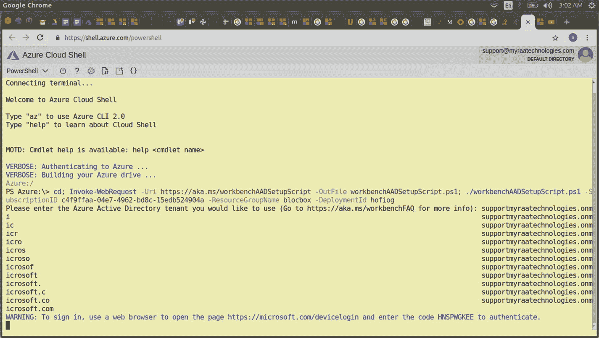
图 2-18 PowerShell 命令

我在这里找到了我的 Azure AD Tenant：`supportmyraatechnologies.onmicrosoft.com`（图 2-19）。

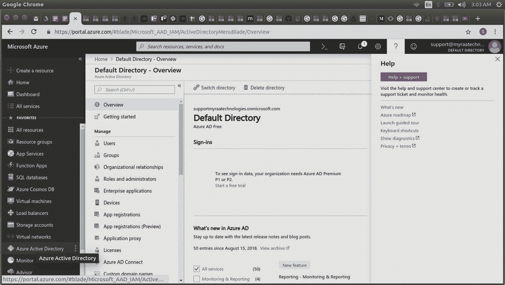
图 2-19 Active Directory

输入信息后，将提供一个用于注册的 URL 和一次性密码（OTP），如图 2-20 所示。

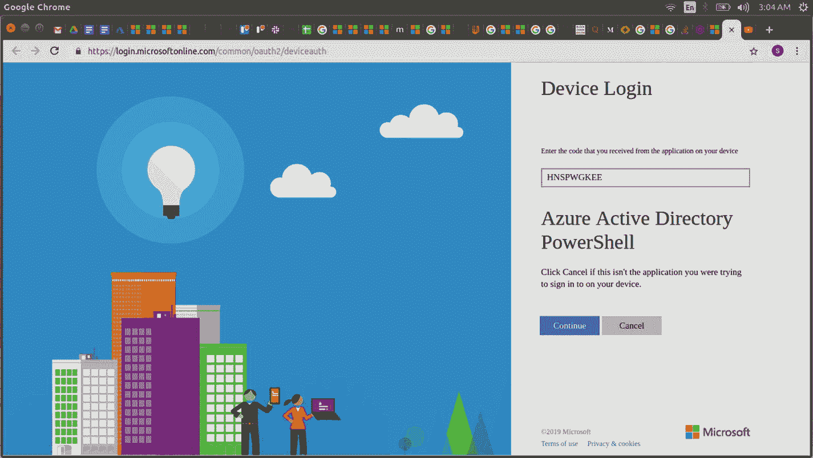
图 2-20 设备 OTP 注册

此步骤成功注册了 PowerShell 与我的设备的使用关联，从而建立了我的设备与启动区块链元素过程的关系链接，如图 2-21 所示。

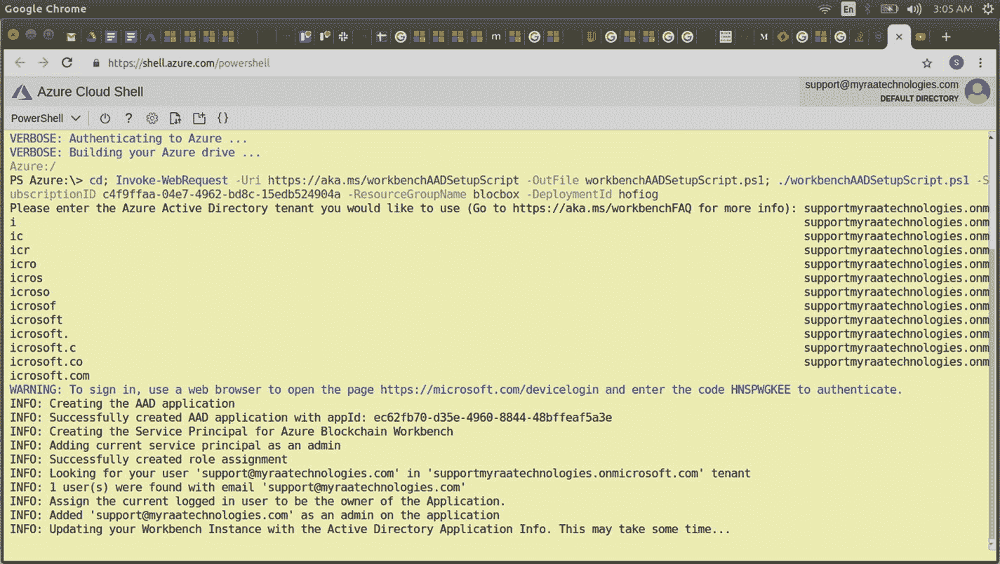
图 2-21 处理应用注册