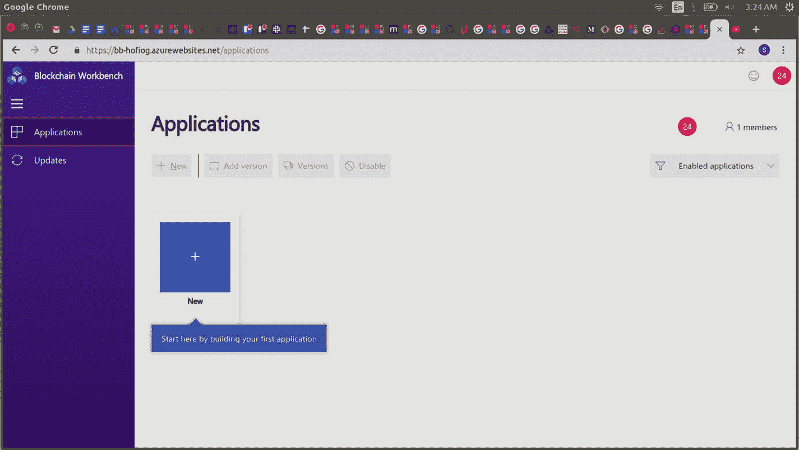

# 部署 Azure Blockchain Workbench

成功配置后，它会提供应用服务链接。点击并允许应用服务的权限。这将成功启动 Azure Blockchain Workbench。

您的应用服务已设置完成，如`图 2-22`所示。

只需几次点击，即可准备好在 Azure Blockchain Workbench 上开发 BBChain 的环境。

`图 2-22` Azure Blockchain Workbench 已初始化并部署

对于包含 37 个元素的复杂架构，传统开发方式需要耗费更多时间。使用 Azure Workbench，基础设施元素的设置、配置、连接以及彼此之间的适当关联都由 Azure Workbench 处理。

请注意，在学习和实现的高级阶段，您可以在需要时手动配置元素，并将其连接到自定义域名。

`挑战`

基于本章的所有示例和挑战，在启动设置时，请在脑海中选定一个区块链应用目标。对我们来说，它是 BBChain，一个用于在海上分散数据分布的区块链账本。对于读者来说，它可以是 Housing Society 区块链、投票区块链或您设想的任何其他去中心化应用。为您自己的区块链项目执行上述步骤。