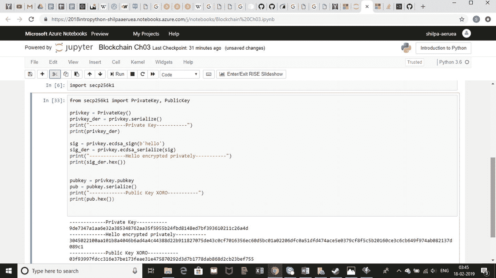
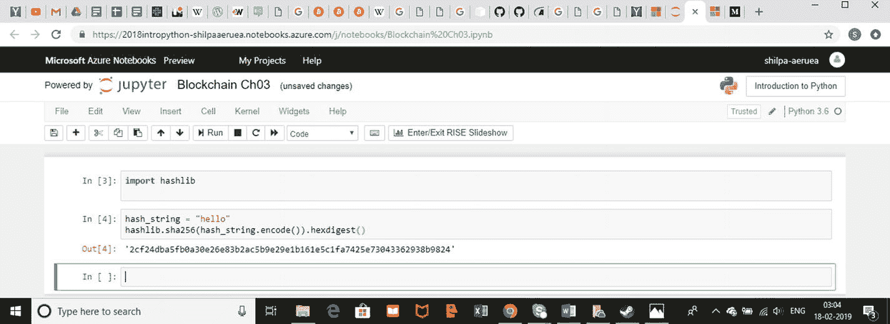
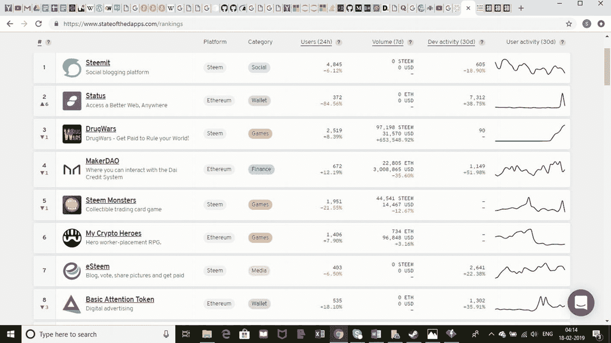
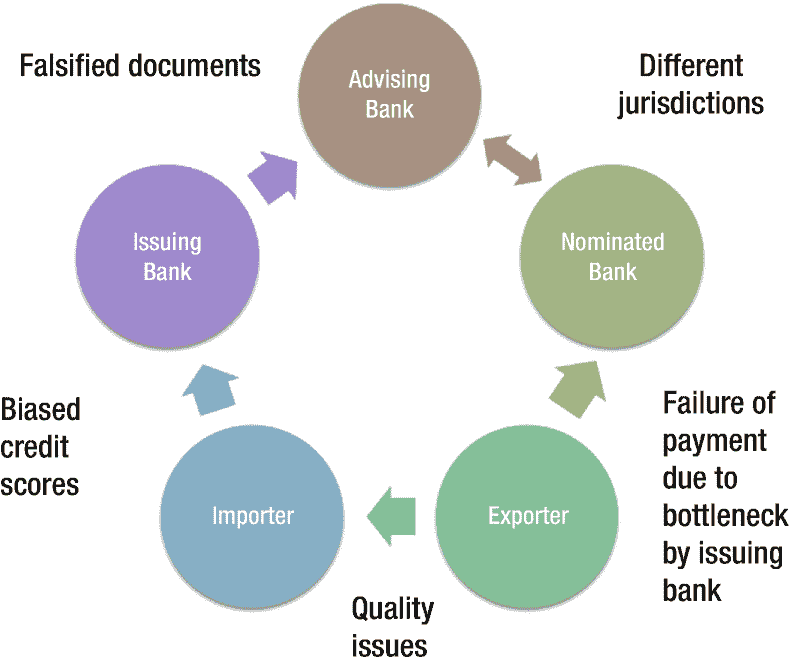

# 3. 区块链交易的相关方面

在上一章进行了大量学习和实现之后，本章将简单直接地剖析上一章中出现的元素，并附上用例。

在本章中，我们将涵盖成功进行区块链交易所需的相关项目，即：

*   理解区块链交易中的加密和验证——加密、验证
*   区块链中的数据、权益和操作——分发、安全性

在进一步深入之前，让我们了解为什么需要这些元素。

*   为什么加密如此重要？
*   为什么交易完成后验证至关重要？
*   为什么未分发的集中式系统无法满足需求？

信息是一种资产，如果未彻底保护，可能会误导或偏离业务运营、经济乃至人类。因此，让我们考虑一个名叫 XORO 的名人，他没有安全地存储个人数据。XORO 允许在一个未受保护的网站上访问他的媒体存储。黑客只需攻击 XORO 的机器或这个安全性较差的网站，即可访问公开存储的信息。黑客将这些信息发布在互联网上。这次信息泄露导致人们相信未经任何验证的、来自未知来源的谣言。此外，与该名人相关的品牌股票下跌，从而影响其他相关元素，导致整个生态系统中的多米诺骨牌效应。

现在，想象一下：XORO 使用区块链平台与家人共享个人信息。数据不存储在单个设备上。即使私钥也可以被加密、分割并分发到链上，从而使黑客难以访问信息。这里的黑客需要遍历整个链才能检索到一条信息，而该信息在每个节点上的加密方式都不同。此外，虚假新闻的来源很容易被质疑，因为它并非源自存储 XORO 信息的区块链。区块链提供了不可变性；即它不允许任何人修改现有数据点——必须追加才能进行更新。因此，真实信息来源的可信度得以维持。这种控制为 XORO 合作的品牌建立了信任。利益相关者可以很容易地根据这些措施量化信任。

## 加密与验证

像 XORO 一样，我们在数字环境中共享大量信息，无论是银行详细信息、电影偏好还是我们访问过的地点。让我们研究 WhatsApp 以了解端到端加密，然后探索区块链的各种加密选项。

密码学是一门艺术，人类长期以来一直用它来跨传统、文化和语言存储、共享和维护秘密。这门艺术在现时代转变为用于改写文本、文学和国家机密的数学方法，现在我们有了电子密钥机制的使用。

我们倾向于以图像、音频、视频或文本的形式与同龄人、家人或同事共享大量数据。这些数据进一步被转换为随机字母数字字符集，称为哈希函数，以避免开发人员或未授权用户以明文形式读取。

哈希函数是一种数学函数，当应用于相同消息时，将生成相同输出。广泛使用的一种哈希函数示例是 `SHA256`——它被比特币使用。一个 256 位模式可以表示`2²⁵⁶`种不同消息。通过暴力破解来破解 256 位密钥所需的计算能力是破解 128 位密钥的`2¹²⁸`倍。理论上，五十台每秒可检查`10¹⁸`个 `AES` 密钥的超级计算机需要约`3×10⁵¹`年才能解码密钥空间。这使得不仅人类，甚至超级计算机都几乎不可能确定两个个体之间通信的数据。

让我们自由聊天的一个原因是简单的指示器：聊天是端到端加密的。这就是 WhatsApp 凭借如此庞大的用户群而受欢迎的原因。让我们看看他们是如何加密的。

端到端加密确保发送的消息只能由发送者和接收者读取，而不能由第三方读取，甚至 WhatsApp 也无法读取。WhatsApp 给出的基本描述是，正在发送的消息被锁保护，只有接收者和发送者拥有这些锁的钥匙。为了使第三方解密更加复杂，每条消息都有一组唯一的锁和钥匙。

用于加密的某些术语如下：

*   公钥类型
    *   `Identity Key Pair` – 一个长期 `Curve25519` 密钥对，在安装时生成
    *   `Signed Pre-key` – 一个中期 `Curve25519` 密钥对，在安装时生成，由身份密钥签名，并定期轮换
    *   `One-time Pre-keys` – 一次性的 `Curve25519` 密钥对队列，在安装时生成，并根据需要补充
*   会话密钥类型
    *   `Root Key` – 一个 32 字节值，用于创建链密钥
    *   `Chain Key` – 一个 32 字节值，用于创建消息密钥
    *   `Message Key` – 一个 80 字节值，用于加密消息内容。32 字节用于 `AES-256` 密钥，32 字节用于 `HMAC-SHA256` 密钥，16 字节用于 `IV`

WhatsApp 不仅加密聊天中的文本消息，还在每个步骤包含加密，从注册过程、发起会话、接收会话、交换消息、传输媒体和其他附件到群组消息、状态以及实时位置。

类似地，区块链通过在每个步骤、每个节点和每笔交易中为链上的每个区块添加加密来确保类似的安全性。加密货币是在解决基于链所依据的基本原则或共识的加密方程时被挖掘出来的。

让我们看看比特币如何通过其加密方式处理安全性：


比特币（₿）是一种加密货币，也是一种电子现金形式。它是一种去中心化的数字货币，没有中央银行或单一管理员，可以在用户之间通过点对点的比特币网络直接发送，无需中间人。交易通过加密技术由网络节点验证，并记录在称为区块链的公共分布式账本上。比特币是通过一种称为“挖矿”的过程作为奖励而创建的。它们可以兑换成其他货币、产品和服务。

那么，让我们了解一下比特币在哪些地方使用了加密，与我们刚才看到的 WhatsApp 示例形成对比。比特币并不直接在交易过程中对数据进行加密。它通过数字签名来确保用户钱包的安全。使用比特币网络进行转账的用户只需用他们的数字签名进行验证。然而，挖矿过程与交易不同——挖矿是在网络交易验证通过后产生比特币。并非所有用户都是矿工。那些验证或努力认证交易的人才是获得收益的人。

比特币用户提供的数字签名，可以以一种能被网络上所有人验证的方式，证明他们对转账授权的所有权。像`ECDSA`（[椭圆曲线数字签名算法](https://en.bitcoin.it/wiki/Elliptic_Curve_Digital_Signature_Algorithm)）这样带有椭圆曲线变体的数字签名被使用。可以想象成 XORO 拿着他的私钥走向银行的保险箱，而银行经理持有公钥。两者的组合才能授权打开保险箱。然而，在比特币的情况下，私钥并非由任何中心化机构提供，而是以其真实形式私下生成，并且银行经理是整个对等网络，而非单个人。这使得它更加可靠，并且其他人无法访问。

为了更深入地了解比特币使用的加密技术，在`SHA256`上定义的椭圆曲线是`secp256k1`。

`secp256k1`中椭圆曲线的定义如下：

`y² = x³ + 7`

看起来像天书？让我们看看 XORO 如何使用这一切。XORO 和银行经理生成他们自己的私钥。他们根据一条方程和曲线因子商定一个公钥。这个公钥的公式是私钥和曲线的组合，并在两端都满足条件。公钥公式基于六个变量，这使得任何第三方几乎不可能进行猜测。

希望在开发过程中加入加密功能的开发者可以按如下方式实现前述策略：



图 3-2

在 Python 中使用 SECP256k1

1. 我们使用了 Azure Jupyter notebook 来实现以下内容（图 3-1）。



图 3-1

在 Python 中实现 SHA256 加密

2. 我们想要应用比特币公钥密码学中使用的椭圆曲线 `secp256k1` 来处理 “hello”：通过在 `pip` 上输入以下命令安装 `secp256k1`：

```
!pip install secp256k1
```

3. 如下实现（图 3-2）。

## 分布与安全性

既然我们已经了解了用于加密和验证的方法，让我们看看区块链上如何维护分布与安全性。不同的区块链应用服务于不同的目的。

例如，比特币网络服务于其加密货币和工作量证明。超级账本（Hyperledger）允许用户基于网络设计原则，对应用程序流程、数据和权限进行去中心化。有几种这样的基于分布的网络被称为 DLT（分布式账本技术），允许平台实现去中心化。

一些著名的去中心化应用（DApps）如图 3-3 所示。



图 3-3

基于活跃用户数、趋势、价值等排名的前八大 DApp

当考虑 DLT 时，区块链引入了共享账本这一方面。XORO 如何从数据、处理过程和权限的分布式网络中获益？让我们一探究竟。

### 分布式数据

如前所述，XORO 的完整加密数据存储分布在多台服务器上。要解密或读取这些数据，XORO 需要遍历整个网络。但是，如果其中一台服务器损坏了会发生什么？XORO 会丢失他的数据吗？这就是为什么区块链必须具有容错性。共享账本会创建数据的多个副本。当一个条目要被更改时，所有节点都必须复制该更改，才能实现真正意义上的数据变更。这可能需要也可能不需要修改数据的权限，具体取决于 DLT 是许可型还是非许可型。

考虑星际文件系统（IPFS）的例子——XORO 创建了一个视频相册，要上传到账本上。每个节点存储 256kb 的数据块，这些数据块分布在不同服务器上。当 XORO 访问该文件时，他会遍历所有节点。当 XORO 想要修改信息时，直到所有节点都反映出更改，信息才算被修改。

再举两个例子：

* FileCoin 使用 IPFS 协议在区块链平台上实现存储去中心化。XORO 可以安全地使用 FileCoin，并享受其可信数据存储、不可篡改性和安全性的优势。
* SiaCoin 利用全球未充分利用的硬盘容量，创建了一个比现有解决方案更高效、更廉价的数据存储市场。它就像一个去中心化平台上的存储空间“AirBnb”。

### 分布式处理过程

比特币和以太坊实现了金融交易和计算能力的去中心化。多个区块链实现了各种处理过程的去中心化。让我们看看其他区块链实现了哪些去中心化。

| 区块链名称 | 协议 | 去中心化方面 |
|---|---|---|
| Ripple | XRP Ledger 共识协议 | 去中心化信任、结算和交易验证 |
| NEM | 重要性证明 | 通过计算节点/用户的重要性来去中心化交易权限 |
| Stellar | 联邦拜占庭协议 | 去中心化跨境货币兑换 |

处理过程的分布可以用于去中心化权限、去中心化所有权以及诸如此类的多种过程。我们以贸易金融为例（图 3-4）。进口商必须向出口商展示其支付能力才能启动交易。因此进口商必须出具银行保函。进口商所去的银行可能会或可能不会因进口商的情况而有所偏袒，从而允许通融。这也带来了制造虚假银行保函的可能性。

在这里，一个涉及利益相关者连接链的生成银行保函的去中心化过程，确保了数据的不可篡改性，并以可量化的方式遵守智能合约（图 3-4），从而解决了中心化系统的典型瓶颈问题。



图 3-4

中心化环境下的贸易金融流程及其问题


