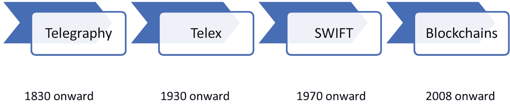

# 4. 金融科技中的许可型区块链

还记得`XORO`吗？让我们让`XORO`重获新生。

在参加了许多国际演出后，他决定两天后为女儿举办一场盛大的生日庆典。他计划聘请一家名为`ROX`的活动管理公司来设计庆典。要启动这项计划，他需要存入一大笔钱。

身在美国的`XORO`登录银行网站，尝试发起一笔电汇转账。而`ROX`在伦敦有一个账户。由于涉及中间机构，转账延迟的时间超出了预期，这引发了严重的恐慌。`XORO`担心他的钱、时间，以及女儿能否开心。

此外，银行建议他亲自前往分行提交一封信函，以便出于安全目的确认这笔大额交易。这一切完全由银行控制和监管。在完成所有手续后，`XORO`想要转账的那笔钱因为银行对他的资金控制而严重延误。

更让`XORO`烦恼的是，他还被收取了一笔最低余额罚款，而他对此毫不知情。银行决定提高他账户必须持有的最低金额，并向他在伦敦的住所寄了一封信，但这封信无人处理。整个情况对`XORO`来说是一次痛苦的经历——为了银行所提供的“安全”，他反而要为自己的钱缴纳罚金。

你是否也曾感受过`XORO`在这里经历的痛苦？那种银行转账、存款等操作带来的挫败感？

想象一下几十年前的情况会是如何。如今，区块链正在重新定义金钱、交易、安全和共识的概念。

通过合适的区块链，`XORO`本可以拥有以下优势：

- 更好地支配自己的资金，这些资金以数字形式存储在他自己节点或机器上的钱包中
- 向其他用户更快地转账，无需其他中间机构的控制
- 交易采用安全的端到端加密
- 不可篡改，且中间操作环节没有人为/手动错误的余地
- 知晓预定义的转账规则和共识，这些在账本上对他更加清晰明了
- 拥有对账本添加或删除规则的协议进行投票的权利

现在，这并不意味着区块链会让银行过时。它纯粹是通过为所有利益相关者升级基础设施，使金融机构的运营变得更好。它进一步将流程和操作在所有利益相关者之间去中心化。

## 国际交易的历史

为了更好地理解，让我们审视一下金融机构为进行国际交易而经历的技术变迁（图 4-1）。

图 4-1

交易网络的演进

在 19 世纪 30 年代早期，电报技术发展成为一种点对点信号传输网络，这些信号最初由各种视觉代码、划和点来表示，并进一步演变为字母数字消息。由于电池的加速发展以及`欧姆`、`法拉第`和`安培`在电气工程领域创造的奇迹，电报技术的发展速度得以加快。

从那时起，随着 20 世纪 30 年代连接需求的增长，信号的频率通过使用异步请求的语音复用技术发生了变化。因此，`电传`网络得以发展。简单来说，它是一个电报打字机的交换网络。这些网络是跨国金融交易的起点。交换网络的转账需要数天时间，具体取决于网络连接情况。随着需求的进一步增长以及对安全、快速系统的需求，全球银行间金融电信协会（缩写为`SWIFT`）大约在 20 世纪 70 年代应运而生。正是在同一时期，`ARPANET`被开发出来，它后来成为了当今互联网的基础。

正如电气的改进一样，电报技术也在演变。随着通信系统数量的增加，`电传`技术得到了改进。正如`ARPANET`处于起步阶段一样，`SWIFT`也在演变。如今，每个用户都拥有一台具有`IP`地址和计算能力的机器，因此仅让金融机构之间保持连接已远远不够。最终用户寻求与其资产和操作的完全连接，这使得区块链成为自然的操作选择，因为它实现了点对点连接。

互联网和数字银行服务仍然使个人的财务状况对最终用户来说如同一个虚拟的黑箱，因为数字银行服务是中心化的，并由其自身的私人法规所管理。在私有的中心化平台上，加密和存储的方法对最终用户是未知的。而借助区块链的概念，透明度和安全性被带给了最终用户。正如本书，特别是本章所解释的，从最终消费者到核心开发者，区块链旨在让人们了解其数字资产的加密选项，以及在交易过程中这些资产会发生什么，从而提供完全的透明度。同时，区块链通过其基础设施提供了一种控制权和隐私权。

