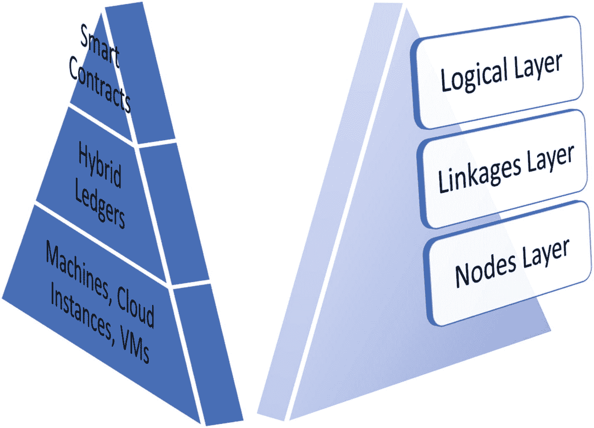
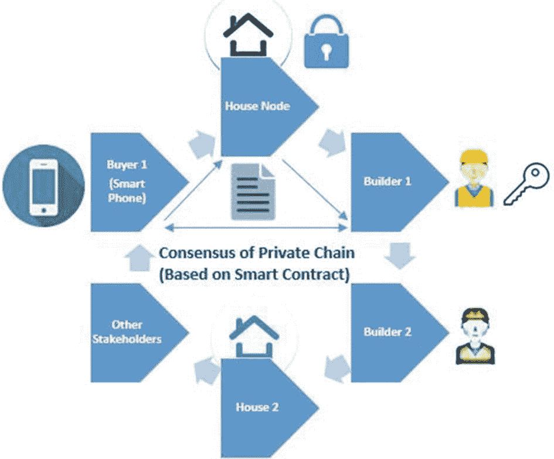
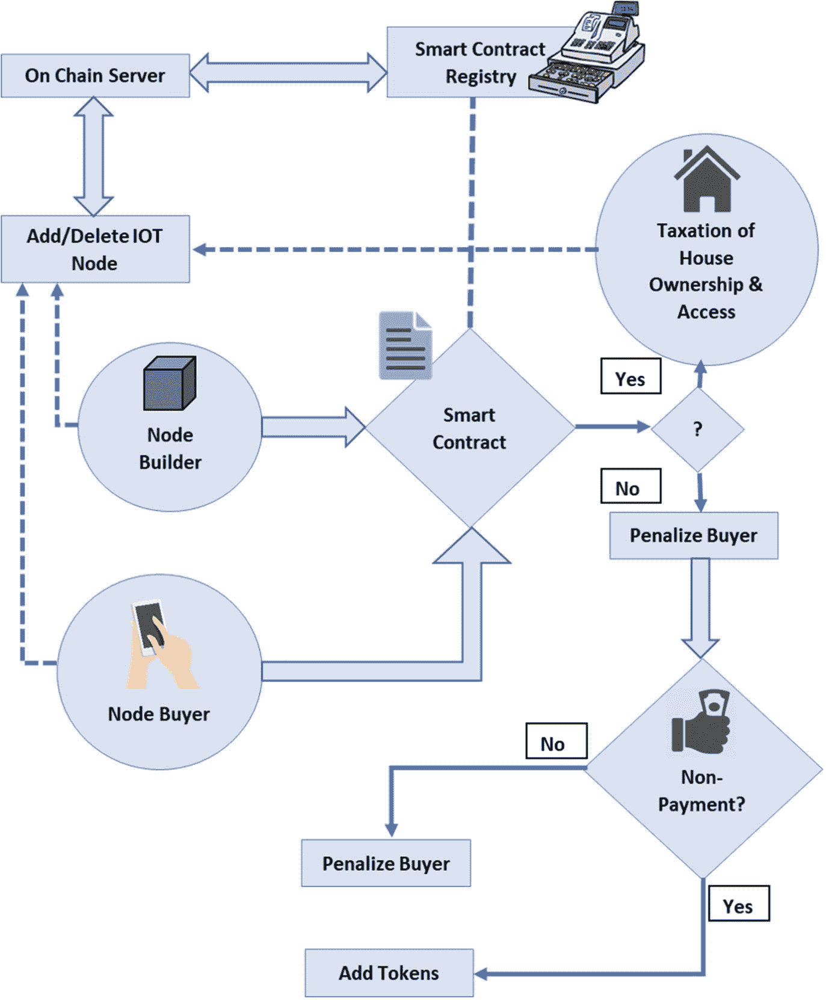
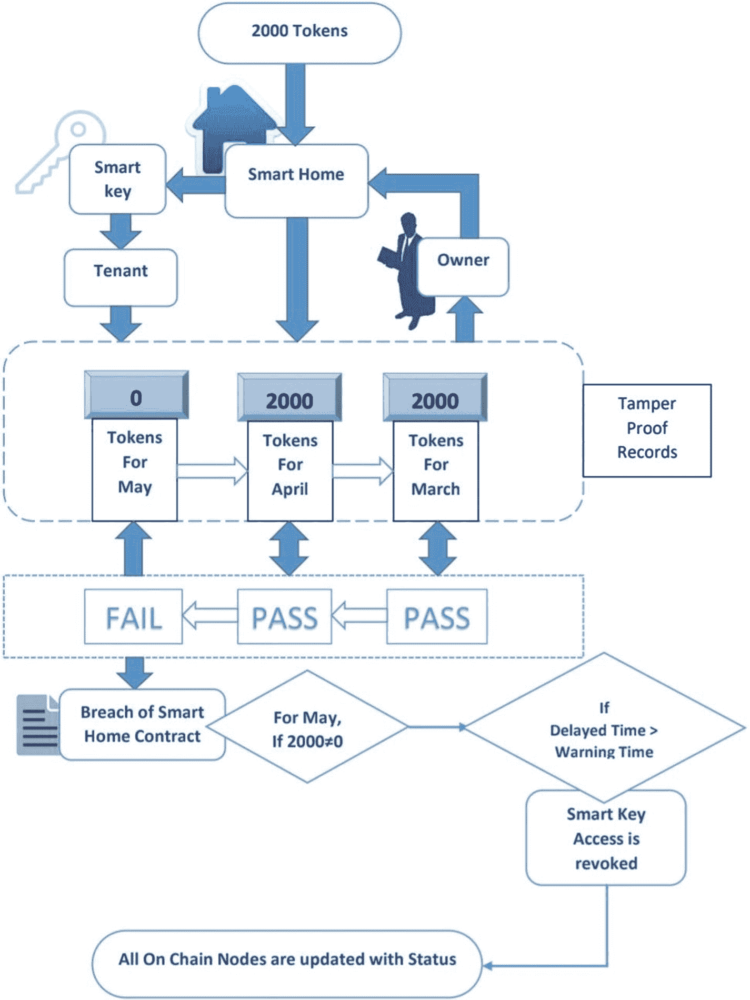
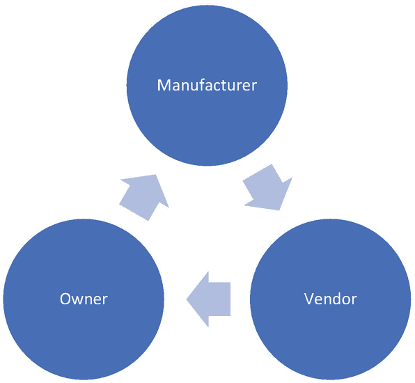
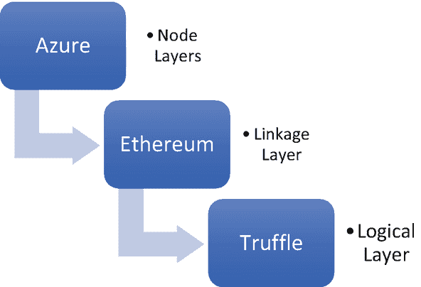

# 5. 智能合约

让我们从两个定义开始：

- `Contract`（合约）—— 一种书面或口头协议，尤其涉及雇佣、销售或租赁等，旨在具有法律强制执行力。
- `Smart Contract`（智能合约）—— 一种可编程的数字协议，根据协议和交易的性质，由区块链网络上的相关利益方直接达成，可以自动执行、自动生效或两者兼备。

在深入探讨智能合约之前，让我们先了解其在区块链堆栈中的位置。回顾前几章内容，请从下至上查看图 5‑1。



**图 5‑1** 区块链生态系统的层次结构

最底层是节点层，包含参与区块链的机器/节点。这些机器可以是物理服务器、手机、云实例或虚拟机。多个节点可能在同一台机器的不同端口上运行，或者每个节点可能在智能手机上有其自身的表示形式。这取决于代表用户的节点配置。这对应于 Azure Workbench 第 2 章的元素，架构师可以在其中决定实例数量以及实例利益相关方之间的事件注册。

第二层是链接层，包含混合账本，提供不同的网络连接配置——私有或公有、许可或开放、云端、非云端或其组合。如第 3 章所述，我们在该章学习了加密类型、分布方式及其他方面，链接层受网络中使用的共识形式所支配。可以基于区块链应用的性质，使用诸如 `Hyperledger`、`Ethereum`、`Corda` 等区块链框架。

最顶层是逻辑层，由可编程的智能合约组成，最贴近用户端。智能合约的条件将自动管理由其他两层配置共同制定的区块链中的交易。将此与现有的中心化堆栈（包含服务器、数据库的后端）和前端（UX、HTML、JavaScript）相关联。类似地，智能合约构成了前端元素，使用诸如 `Solidity`、`Vyper`、`Serpent`（更接近后端操作）和 `LLL` 等编程语言编写。然而，这些语言相对较新，并随着应用需求不断演进。

因此，在本章中，重点将放在这些编程语言所使用的底层逻辑上，用于在各种去中心化应用中设计和开发直观的智能合约。那么，让我们回顾一下智能合约如何应用于我们的现实生活，其范围不仅限于机器、计算机、笔记本电脑和智能手机。

## 现实生活中的智能合约

房屋、住宅、地产、建筑、别墅——住所是人类的基本需求。每一次为了获得住所的交易，无论是买房、租房、租赁商铺还是投资房产，都会签订一般的法律合约。传统上，法律合约以纸质形式签订，不过近来已转向受法律管辖的数字形式。民事法庭负责解决因违约而产生的纠纷，以执行正当的权利。这个过程是各方利益相关者为争取公正结果而进行的漫长博弈。

### 案例：购买房产

**传统方式存在的问题**：买方有意购买一栋建筑中的公寓。该建筑预计于 2020 年竣工，这是建筑商的承诺。买方根据签署合同时注明的建筑商条款和条件启动分期付款。到了某个阶段，已支付了 80% 的费用，但建筑商突然甚至到 2021 年都无法交付。这给买方造成了严重的时间和金钱损失，并带来了不稳定性。这种情况给成千上万的购房者带来了不便。为解决此问题，需要诉诸法律诉讼、谈判，并多次出庭讨论法律条款和条件，以及关于合同上下文含义的不同推论和申辩。经过数月甚至数年的漫长拉锯战，正义可能得到伸张，也可能无法得到伸张。

现在，想象一下这个生态系统的区块链版本。房子是业主的资产。它不仅通过纸质或在线合约被数字化，还以房子的数字锁和钥匙的形式存在。保护房子的这套安全系统可以是区块链中的一个节点。当买方从建筑商处购买房子时，基于智能合约条件的满足情况，节点的访问权限会提供给合法的所有人，同时也赋予其物理访问权限。利益相关方采取的行动会被自动触发，促使买方按时分期付款，服务提供商（建筑商）按时提供服务；在支付最后一笔款项后，所有权可以实时转移，房子的节点访问权限也随之转移给买方。交易是去中心化的，并由链上的其他节点利益相关方见证。此外，审计追踪和记录状态全程在区块链上透明地维护。

这促成了一个完全透明的流程，该流程记录所涉及交易的每一个状态，并基于可执行的条款自动执行合约。最终用户体验到一种防篡改、不可变更且可自动执行的、无缝衔接的协议。

**房地产中的智能合约解决方案**：买方在区块链上对一个数字资产（通过物联网和区块链设置与物理资产关联的房屋钥匙节点）表示兴趣。这个区块链是一个混合账本，由代表建筑商、住房集团、经纪人和买方的节点在公共链上组成（类似于电商平台，但安排不同，因为平台规则并非仅由一个中心化主体掌控）。链上的参与者是独立的实体，可以参与链上活动。如果买方在阅读房地产公共账本上的信息后，对某个住房集团的房产感兴趣，则相关利益方会形成一个私有的许可链。在这个私有链中，利益相关方就智能合约的条件达成一致，并同意根据智能合约自动执行这些条件。因此，在这种情况下，当买方通过私有账本支付分期付款时，房屋节点的权益会按比例转移。这正是可以被编程实现的内容。付款完成后，数字资产会实时无延迟地转移给所有者。这与传统的支票方式不同，后者的资金可能需要几天才能到账，建筑公司也可能需要一些时间才能弄清转入其账户资金的确切状态。或者，可以在智能合约中编程实现的另一个条件是关于当建筑商未能交付房屋时应如何处理。见图 5‑2。



**图 5‑2**

### 房地产领域的公链与私链设置

一旦在私有账本上就智能合约的规则达成共识，关键访问权限就会转移。

例如，让我们观察以下场景：根据预编程设定，如果到 2020 年 3 月 1 日，尽管买方已全额付款，但由于未能完成交付而导致密钥尚未转移给业主，则建筑商必须开始支付罚金/租赁费。此条件随后会自动执行，无需任何讨论。链上的共识遵循智能合约，交易据此实时进行。因此，罚金不会被延迟。



**图 5-3** – 面向利益相关方的、结合智能合约的区块链房地产

在图 5-3 中，买方和建筑商都受限于关于购买房屋的智能合约条件。我们假设智能合约可能包含的基本条件：

- 买方按时向建筑商支付分期款项
- 建筑商按时向买方交付房屋设施

在任何房屋协议中，这些都是双方承担的非常基本但又重要的交易活动。现在，当买方将钱包中的金额转账给建筑商时，智能合约便激活了该房产的房屋设施权限。第二个条款是买方对所有设施的确认。

基于上述条件的智能合约伪代码：

```
如果 截至 2020 年 3 月 1 日买方的付款金额 == 建筑商针对 2020 年 3 月 1 日报价的房产成本：
    在 2020 年 3 月 1 日，为买方启用房屋所有权和密钥访问权限。
    如果 买方确认访问权限和房屋设施：
        交易成功完成。
    否则如果 建筑商延迟提供访问权限和所有权：
        在延迟期间向买方支付租金成本
否则如果 买方付款延迟超过 15 天且少于 6 个月：
    处以相当于房屋成本 10%的利息罚款
否则如果 买方付款延迟达 6 个月：
    处以相当于房屋成本 20%的利息罚款
```

在另一种场景中，租户未能按照传统纸质合同的承诺按时支付租金。房东因沟通不畅和付款延迟而备受困扰。此外，当被要求腾空房屋时，租户未能执行，从而引发法律问题，给房东增加了成本、时间和不便。

如果将此场景上链，智能合约将预先编程好付款时间表以及违约时会发生什么。通过他们在账本上各自的数字签名表明双方达成共识后，在智能合约规定的期限内，房屋节点的访问权限将被转移给租户（启用物理访问权限）。当账本上出现未付款时，智能合约将自动执行警告，要求租户在警告期内付款。如果连这段宽限期也被违反，房屋的数字资产密钥将自动移交给房东，使得租户无法再次访问。根据预先约定的智能合约，不付款的租户将从私有账本中被移除，禁止其进行任何进一步的交易（见图 5-4）。



**图 5-4** – 租户与房东之间区块链网络的智能合约执行

## 练习

1. 识别传统合同的应用案例并进行列举。
2. 列出所识别案例中的利益相关方。
3. 探索所涉及的数字化资产和交易。
4. 量化资产/交易状态变化或变动的条件。
5. 绘制智能合约构造与执行的流程图（类似于图 5-4）。
6. 基于此，设计伪代码。

## 智能合约语言

一旦练习完成，设计就需要转向开发与实施。为此，让我们看看可用于不同目的的多种智能合约语言。

| 智能合约语言 | 区块链平台 | 特性 |
| --- | --- | --- |
| `Solidity` | Ethereum, Quorum, Wanchain, Aeternity, Counterparty, Rootstock (RSK), Qtum, Cardano, DFINITY, Soil, Expanse, Ubiq, Ethereum Classic, Monax | • 广泛使用的语言<br>• 与 Visual Studio、Remix、Truffle 集成丰富<br>• 多种类型安全函数<br>• 维护面向对象结构，支持方法和变量的继承 |
| Sophia 和 Verna | Aeternity | • 函数式编程、状态、强类型、一流对象、模式匹配、众筹示例 |
| F* | Zen | |
| RIDEON | Waves | • 在多链接触点实现账户控制功能<br>• 具备实现多重签名、原子交换和代币冻结限制的能力 |
| *C++, C* | EOS, Neo, Neblio, Burst | • 对开发者极为便利<br>• 标记化管理权限<br>• 自给自足的奖励模型与费用免除<br>• 高速并行处理<br>• EOS 存在中心化问题 |
| *C#* | Neo, Stratis | • 利用.NET 框架<br>• 允许与企业及现有的 C#包轻松集成 |
| `Kotlin` | Neo, Corda | • 易于分析数据状态<br>• 支持高流量法律实体中的并行交易，包括详细条目<br>• 通过内置哈希函数正确管理，消除交易排序错误 |
| GoLang | Neo, HyperLedger Fabric, Neblio | • 允许使用 Hyperledger Fabric 构建许可型区块链<br>• 高级查询能力<br>• 活跃的社区支持 |

在对所有现有智能合约的调查过程中，一项关于以太坊最大交易量及其对应智能合约的有趣分析浮出水面。这些智能合约背后的用户主要是中心化及去中心化交易所、ICO 和代币收藏者。这主要是由于过去几年加密货币市场获得了极高的人气。这表明，到目前为止，智能合约主要用于区块链上的金融交易与贸易。

然而，本书的重点旨在探讨核心技术，因此我们将研究智能合约在应用层面（而非代币层面）及其经济学原理。加密市场的不稳定性以及这些尚且年轻的语言，使得开发者学习此类语言是否值得变得高度存疑。

## 创建智能合约

众所周知，智能合约是一种可编程合约，能够根据各种活动和交易自动执行，从而满足预先定义的规则。因此，对于开发者而言，设计出能够创建基于事件的可编程功能的逻辑至关重要。

现实世界中的合约通常存在许多漏洞，随后需要在法律体系中进行争论。而在区块链的去中心化世界中，智能合约期望通过编程方式，为所有相关方覆盖某一情境的所有情况。然而，这取决于开发者的设计逻辑，必须覆盖大多数情况以避免漏洞。此外，一些智能合约语言编译器可能会启用这些检查来评估图灵完备性。简单来说，编译器需要检查所有在计算上可能检查的情况。只有当用例足够具体或呈二元状态，以便做出清晰决策时，才能实现这一点。业务开发者在考虑智能合约时，必须推导出具体的用户故事，以便启用这些功能。以房地产用例中的伪代码逻辑为例。因此，智能合约要求开发逻辑的方式能够覆盖所有情况，并涵盖跨各种情况的数据驱动决策。

智能合约能够纯粹基于数据自动执行决策。这意味着，根据流经智能合约中定义的业务逻辑的数据，各种条款/动作会被触发。从而减少对预定义条件集上的数据和函数进行人工干预的偏见。更清楚地说，付款延迟必须导致利息的添加，这在大型金融交易或金融机构中通常是已考虑到的。然而，有数百万的自由职业者收到延迟付款却没有任何利息。现在，如果自由职业者不是通过纸质合同，而是通过一个预先编程好、能够覆盖委托公司延迟付款利息添加的智能合约来开展业务，那么所需的努力和延迟就能得到妥善覆盖。反之，如果智能合约预先编程并同意按时交付项目，而自由职业者未能按时交付，则分类账上将自动计算罚款，从而形成一个公平的程序化协议。

我们再看另一个用例，以进一步理解智能合约的用法。

## 汽车：制造、分销、转售、维修

像房屋一样，汽车也是智能设备。汽车性能的读数可以实时观察，并添加到相关方的共享分类账中。如果出现故障，整个防篡改的历史记录可以清晰地提供给汽车公司的维修节点。同样，车辆的所有权在符合智能合约的付款完成的那一刻实时转移。因此，首次购车者从制造商到分销商的汽车购买过程可以链上完成，为双方提供更好的用户体验。现在，考虑一下二手车购买场景，买家从卖家处购买车辆。在这种情况下，很多时候所有权转移涉及到与其他多个相关方的冗长程序。如果通过智能合约实现数字化和验证，透明度和便利性将大有裨益。

为此，我们在下面的示例中选择了以太坊。请注意，本次实践演练的目的是为了帮助读者观察实际的实现过程。然而，所使用的语言和配置可能并不相关，因为它们会根据应用场景、版本时间以及用户需求而有所不同。

以下是场景描述：链上有三种类型的用户——制造商、经销商和车主（拥有汽车的人）。



车主希望拥有一辆车，通过经销商预订，经销商向制造商下单，车辆在支付 80%的款项后发货。这个过程传统上要求买家先支付大部分款项，然后车辆才能发货。与支付款项的时间跨度相比，所有权的转移是一个更长的过程。通过这条私有链，分类账提供了在付款时实时转移所有权的机会，且所有相关方之间完全透明。

为了搭建此应用的开发环境，我们使用 `Truffle Suite` 在 Azure 上结合以太坊来开发智能合约。请记住：在选择实现语言之前，必须先设计流程并制定条件。在理解应用的性质后，再选择语言和工具（见图 5-5）。



图 5-5

技术栈结构

出于测试目的，我们将从一个小的实例开始，在 Azure 上初始化基本设置。为了搭建此应用的开发环境，我们使用 `Truffle Suite`——一个用于以太坊的开发环境、测试框架和资产管道。`Truffle Suite` 凭借其内置的工具集，使得开发智能合约变得非常便捷。

在 Azure 市场中搜索 `Truffle`。可以在市场上找到多个变体。点击 `Truffle` 后，会说明该套件提供的功能。它使开发者能够在一台虚拟机上创建虚拟账户，并在预设的以太坊区块链上直接使用 `Truffle` 工具来开发 `Solidity` 智能合约。

`Truffle` 允许你通过实例名称、区域等来初始化虚拟机配置。选择所需的虚拟机规格和运行区域。选择所需的磁盘规格，然后进行审核并创建。

一旦虚拟机的步骤完成，一组完整的互联资源组就可以使用了。

`Truffle` 现在提供了一个已安装好框架和十个账户的虚拟机。这里使用 `Truffle` 的目的是提供包含以太坊区块链节点和钱包的基本基础设施。参见下文：

[`https://docs.google.com/document/d/1GBNlHfLrd0orOKJHedhBSRX43xgokF9GA7ZIb3ljX04/edit?usp=sharing`](https://docs.google.com/document/d/1GBNlHfLrd0orOKJHedhBSRX43xgokF9GA7ZIb3ljX04/edit%253Fusp%253Dsharing)

根据您的配置，这些节点可以是本地节点，也可以是 Azure 实例。让我们来看看 `Solidity` 智能合约的语法格式。

例如，我们为制造商设计了以下智能合约：

```
pragma solidity ⁰.5.4;
contract Manufacturer {
//Definitions of Users, Objects & States
address public manufacturer;
address public vendor;
address public owner;
address public car;
uint public constant price = 4 wei;
struct car1{
string cModel;
uint cRegNo;
string cLicensePlate;
}
mapping (address=> uint)public balanceOf;
car1 carDetail;
//Function Definitions
function setCar(string memory _cModel, uint _cRegNo, string memory _cLicensePlate)public{
//storing data in struct
carDetail.cModel= _cModel;
carDetail.cRegNo= _cRegNo;
carDetail.cLicensePlate= _cLicensePlate;
}
function getCar() view public returns(string memory, uint, string memory) {
return (carDetail.cModel, carDetail.cRegNo, carDetail.cLicensePlate);
}
struct manufacturer1{
uint mAge;
string mName;
string mAddress;
}
mapping(address => manufacturer1) manufacturerDetails;
manufacturer1 manufacturerDetail;
constructor ()public payable
{
manufacturer = msg.sender;
//initialize
balanceOf[manufacturer] = 0;
}
function setManufacturer(address manufacturer, uint _mAge, string memory _mName, string memory _mAddress)public{
//storing data in struct
manufacturerDetail.mAge= _mAge;
manufacturerDetail.mName= _mName;
manufacturerDetail.mAddress= _mAddress;
}
function getManufacturer(address manufacturer) view public returns (uint, string memory, string memory) {
return (manufacturerDetail.mAge, manufacturerDetail.mName, manufacturerDetail.mAddress);
}
// State management
enum State1{Created, Locked, Inactive}
State1 public state1;
modifier inState1(State1 _state) {
require(state1 == _state);
_;
}
event PurchaseConfirmed1();
event ItemReceived1();
}
```

智能合约的构造主要分为三个部分：

1.  变量定义——用户、对象和状态
2.  函数定义——读写操作及其访问权限
3.  基于事件触发器更新状态变量

在前面的代码中，我们首先为制造商初始化了一个合约。其中，变量定义包括与之交互的利益相关者，以及在其端开发的诸如 `Car` 之类的对象。

地址映射到用户节点。数据块（例如制造汽车的状态）根据函数进行初始化。这些函数使得能够生成 `Car` 记录及其状态和制造商详细信息。

一旦事件被触发，`Car` 对象的状态会根据合约进行购买和接收的更新。在这些事件触发器的作用下，制造商的余额可能会更新，汽车的所有权也可能会被登记。

请注意，本章的重点不是 `Solidity` 的语法，而是设计此类智能合约的能力。语言可以是任何语言——C++、Python、Solidity——具体取决于应用程序、业务前提和开发人员的能力。

请继续详细描述一个新的用例，涉及食品、就业、保修或其他纸质合约从未奏效的领域。

## 练习

思考一下当前家中食品供应场景中存在的问题。

1.  写下您面临的挑战，例如质量不佳、食物浪费、供应不足、喷施农药、人造食品或来源不明。选择一个。
2.  确定为您处理此食品供应的利益相关者。例如，可能是您的超市、在线商店或附近的农场，或者是送货员、农民、零售商、批发商等。
3.  构建一个代表所有这些利益相关者的区块链框图。
4.  安排与步骤 1 中选定挑战相关流程的链接。例如，如果挑战是食物浪费，则将房屋的库存节点链接到其他快速消耗的房屋。
5.  链接好链条后，确定链的类型——公有链、私有链或联盟链——并据此安排链接关系。
6.  在链中，决定需要达成共识的事件以及共识的类型。
7.  如果基于所有利益相关者必须同意、实施或维护数据的一组预定义规则，请创建规则和条件的流程图。

例如，如果挑战是食品质量，则将从种植区到分销商再到配送的所有利益相关者链接起来，以跟踪生长条件、新鲜度时间，并在区块链上链接的每个节点安装摄像头（物联网 + 区块链）。如果配送节点需要将食品温度维持在 4 度，则传感器节点可以实时更新区块链，供所有利益相关者查看此数据。

8.  当数据添加到区块链时，智能合约必须成功地遍历整个链上的数据以形成共识。如果数据（在前面的示例中）违反了合约上的规则，则买方会自动拒收该食品，因为供应商未能维持智能合约中规定的条件。