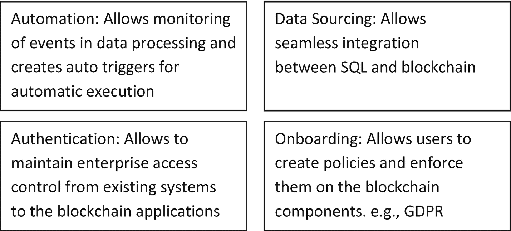

# 区块链的集成点

在本章的现阶段，我们将探索区块链的外部与内部交互。交互可以涵盖从元数据获取、用户引导，到连接区块链应用生态系统的所有环节。这有助于我们专注于集成点，这些集成点对于实现利用真正去中心化平台优势的无缝工作流程至关重要。

这里，重点不在于技术本身，而在于考虑区块链技术之前就已存在的流程。当您在本书前半部分逐渐了解区块链是什么时，后半部分将帮助您可视化其针对身边挑战的实施和执行。请关注现有的中心化平台、人员操作和线下实践，并仔细重新审视每一个环节。旧有实践中的每个痛点都将帮助您确定连接到区块链的正确接入（数据）点。

我们将重点关注四个重要的集成点，它们在实施中会带来重大变革：

*   **数据源获取** – 与现有系统的企业集成
*   **用户引导** – 合规与监管要求
*   **授权** – 访问控制与安全权限
*   **自动化** – 智能合约自动触发/告警的流程

    

    **图 6-1** 框架：区块链实施的集成点

