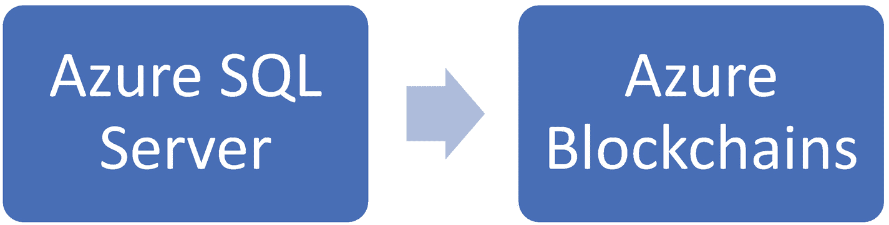
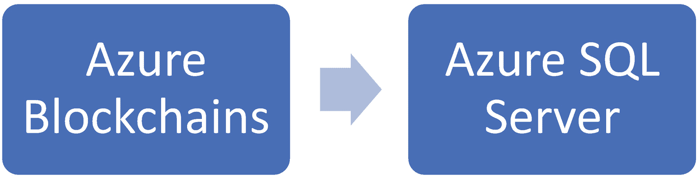
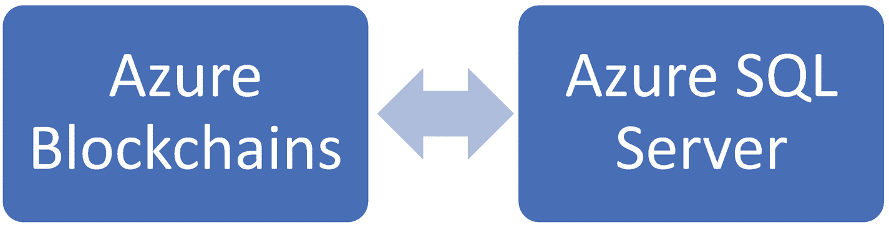
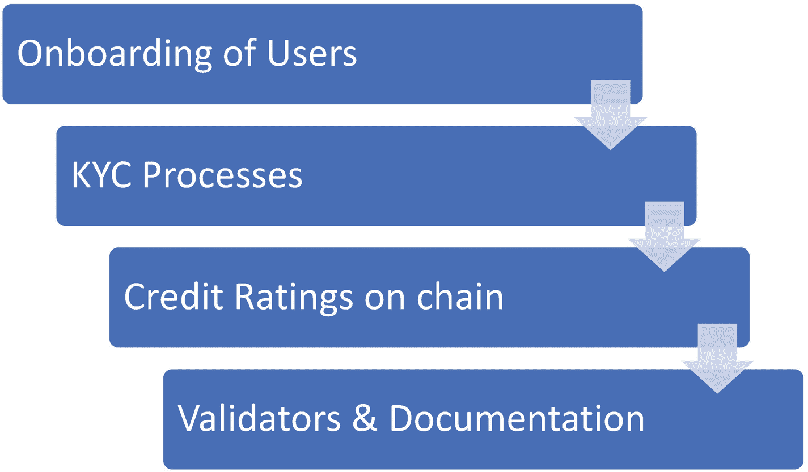

# 数据源：与企业现有系统的集成

学习如何将区块链与 Microsoft Azure 结合使用的一个重要原因是，它能为您提供企业级集成所需的完整基础设施。`Azure Blockchain Workbench` 提供了一套完全与技术无关的选项，支持各种类型的区块链，并能基于现有 IT 生态系统和工作流与企业进行集成。

随着大型企业越来越依赖数据驱动，采用正确的数字化去中心化实践已变得至关重要，并成为业务决策的核心驱动力。由于各行业的组织对区块链应用有不同的用例，且其适配运转的 IT 架构也大相径庭，Microsoft Azure 作为一座桥梁，能够同时应对这两大挑战。而随着组织运营的诸多方面日益数字化，数据驱动程度不断提高，中心化与去中心化之间的持续博弈将继续并进一步加剧。因此，像 Microsoft Azure 这样的工具，使组织能够以一种简单且可持续的方式来有效地实现流程去中心化，而无需完全干扰在区块链出现之前企业一直使用的既有企业级工具。

设想一个拥有 10,000 名员工的组织。首席信息官希望根据公司的优势与劣势来制定业务决策。然而，相关的汇报流程并不透明，因为线下获取这些数据所依赖的是一个层级化且无形的过程。为了避免偏见，公司以数字化形式集成了生产力指标；例如，销售拜访次数、转化数量、业务价值等等。这些指标在技术工具引入之前就已存在。但借助区块链，追踪和跟踪这些指标的过程变得更加透明和具象。因此，当所有操作都在链上更新时，决策就可以成为一个衡量并推动影响力的闭环在线活动。

由于需要以具象、可追溯、不可篡改、去中心化且安全的形式，与业务的利益相关者（无论是员工、客户还是供应商）保持连接，区块链显然已成为企业的必备需求。`Azure Blockchain Workbench` 促进了微软环境与区块链各要素的平滑集成。

让我们来看看需要不同集成形式的数据源变体。企业中的数据可能包含以下类型：

* **结构化数据** – 数据库、CSV 文件等。
* **非结构化数据** – 语音录音、图像扫描文档
* **B2B 数据** – 企业对企业数据流
* **B2C 数据** – 企业与消费者数据
* **众包数据** – 例如维基百科
* **不同体量** – 各种规模的数据

根据数据类型及围绕数据所展开的流程，选择相应的集成模式。

在本章中，我们将重点介绍跨不同领域的企业中最常见的结构化数据形式。

## 结构化数据源

每个平台都需要元数据来启动任何流程的去中心化，以及将信息存储到分布式账本上。例如，在为金融机构的 KYC（了解你的客户）流程引入区块链之前，必须先从中心化软件平台获取现有数据。大多数企业在投资任何新技术之前，都依赖于平稳的过渡。基于这种区块链采用前的普遍预期，`Azure SQL Databases`（最广泛使用的数据库之一）支持轻松集成，以实现从遗留软件向区块链的更平滑迁移。这种集成允许将元数据无缝地引入平台。结构化数据的流动可以多种形式发生：

* 连接后端系统和现有平台，例如 Microsoft Dynamics 365（该平台可能在组织中运行 ERP 和 CRM 应用程序）。在这些软件中，会用到 SQL 服务器，这些服务器可以为了数据源的目的与区块链平滑集成（图 6-2）。

  

  **图 6-2**  
  从 Azure SQL 数据库服务器向 Azure 区块链提供数据源

* 某些活动可能在链上执行，而某些活动允许在链外执行。当区块链对用于报告或展示目的（非审计相关）的数据存储不产生影响时，存储到 SQL 数据库中可以轻松地卸载处理（图 6-3）。

  

  **图 6-3**  
  将数据从分布式账本交付到链外数据库，例如 Azure 上的 SQL 服务器

* 基于不同目的和触发器的双向数据流。区块链可以将非平凡的数据存储到 SQL 服务器上，这些数据可用于中间报告和分析。

* 当超过智能合约或共识算法中定义的数据限制器阈值时，SQL 服务器可以在 `Azure Blockchain Workbench` 中调用不同的逻辑应用和事件触发器（图 6-4）。

  

  **图 6-4**  
  针对不同目的的数据分发所共享的一套操作项

## SQL 与区块链集成的连接与定义

此过程包含两个步骤：

1. **建立连接**。`SQL Server Management Studio` 提供了 `Blockchain Workbench` 中 SQL 存储的预览。在定义数据库架构之前，您可以看到数据流中的变化。集成的基本步骤是为区块链节点和 SQL 服务器设置正确的 IP 地址集。然后，您必须根据数据的流向启用读取-写入设置。

2. **定义数据库视图、应用程序视图、应用程序角色视图**——例如买方和卖方、用户对应用程序用户的分配以及应用程序用户的连接状态。

涉及 `PowerBI`、`SAP` 和 `Excel` 的其他 ERP 集成，也可以作为数据源来适配区块链生态系统。

### 区块链的 Azure Cosmos DB 集成

`Azure Cosmos DB` 是一个全球分布式、多模型的数据库服务，适用于任何规模。该 NoSQL 数据库提供跨全球连接的多主节点，同时透明地维护各处的副本。然而，这不应与区块链混淆。`Azure Cosmos DB` 恰当地将共享分布式账本的各个方面与区块链进行对齐和集成。

当你需要一个不可变、仅追加的账本，并且在已知许可利益相关方的无信任网络中与多方打交道时，你需要将许可区块链与 `Cosmos DB` 相结合，以维护分布式存储和可追溯性。

在其他情况下，如果共识不是主要需求，`Azure Cosmos DB` 可以在没有区块链的情况下满足要求。这些情况包括维护分布式的场景，以及加密等层面可以在该架构之上实现。考虑采用 `Azure Cosmos DB` 的独特卖点/关键差异化因素之一，在于它对新技术的开放集成性，同时从基础上就支持去中心化，并具备区块链的其他特性。

希望实现去中心化的平台，可以轻松地从 `SQL`、`MongoDB`、`Gremlin Graph`、`Cassandra`、`Tables` 和 `CSVs` 大规模地全局迁移到 Azure 的 `Cosmos DB`。

让我们了解一个 `Azure Cosmos DB` 与区块链结合的使用案例，然后再深入技术细节。

我们来看看微软在可通过 Azure 区块链服务访问的 XBOX 游戏发行商版税方面的使用案例。该示例展示了从可信来源追溯版税时所实现的透明度。游戏发行商可以通过这种技术组合访问版税报表。所涉及的过程是链上追踪、链下可视化以及流程不可变审计的混合。因此，`Azure Cosmos DB` 实现了版税数据的全球分布式存储，而区块链服务则维护所有流程的状态，以保持所存储信息的可信度。区块链服务还通过智能合约的形式实现了版税规则的自动化。

让我们分解该实现，以更好地理解流程。

1.  元数据来自链下存储，例如 `Azure Cosmos DB`、`SQL` 或 `MongoDB`。
2.  区块链节点根据所需信息进行初始化，并定义共识目的（如果已定义）。
3.  进一步的其他元素，如事件触发器，允许在链上通过警报和触发器驱动无服务器代码。

以下是集成的步骤：

1.  将数据模式从 `SQL` 集中式形式重塑为 `Azure Cosmos DB` 模式。
2.  将数据结构重构为键值、列族、文档和图。
3.  全球分布。
4.  创建基于仅验证或某种共识形式的多主复制协议。
5.  检查地理限制和政策。
6.  确定流程所需的信任级别和权限。
7.  堆叠与流程相关的元素。

当数据的分布式账本需要区块链方面的连接验证和智能合约触发时，这些步骤适用。需要找到合适的集成交汇点，以获得无缝体验。

例如，在 `Apache Spark` 上维护大规模数据作业的企业，可以无缝连接到 `Cosmos DB` 以获取仅追加的透明账本。此外，如果数据作业需要闭环共识，`Azure Blockchain Workbench` 可以实现这一点。参见：[`https://docs.microsoft.com/en-us/azure/cosmos-db/spark-connector`](https://docs.microsoft.com/en-us/azure/cosmos-db/spark-connector)。

类似的集成也可以为 `IoT` 中心网络以及 SharePoint 系统与区块链建立连接。

### 用户接入：合规与监管要求

一旦确定了数据来源，数据就会被适当地分类、结构化并存储。在私有和公有区块链以及链上、链下活动中，数据的分类至关重要。这种分类与确立保护权利和法规的政策相关联，每个企业都必须遵守这些法规。

同时，在讨论区块链时，处理数据的过程以及数据的状态至关重要。例如，一个中心化在线平台的普通注册只需要设置电子邮件和密码，外加一些详细信息。然而，密码和邮件的存储过程对最终用户是不可知的。可能存在不安全的平台，以明文存储密码，并可能泄露那些也可以用于安全平台的值。因此，将用户接入区块链的过程与这些常见做法有所不同。

用户接入从机器地址、私钥和公钥以及根据区块链的类型和目的验证其他节点开始。

因此，第二个考虑点是这些数据来源如何无缝地接入区块链。这种接入可能发生在区块链设置的开始阶段、过程中的间隔期、持续操作期间，或任何数量的事件触发期间。

然而，如何做到这一点对于保持数据的敏感性及其状态的可信度至关重要。由于这个集成接触点非常容易受到攻击，因此必须界定以下几个方面的范围：

*   网络安全
*   合规性
*   法规
*   地理政策（例如，欧洲）
    *   `GDPR`
    *   `PSD2` 和电子隐私
*   行业领域政策
    *   海事
    *   制造业
    *   医疗

这个集成接触点没有直接的实现工具；它更多是关于与用户接入相关流程集成时的设计考量。这根据区块链平台的应用、地点和领域而有很大差异。

#### 区块链的 GDPR 考量

**通用数据保护条例**（欧盟）[2016/​679](https://eur-lex.europa.eu/eli/reg/2016/679/oj) (**GDPR**) 是欧盟法律中的一项法规，涵盖了所有 [欧盟](https://en.wikipedia.org/wiki/European_Union) 和 [欧洲经济区](https://en.wikipedia.org/wiki/European_Economic_Area) 公民的数据保护和隐私。它还涉及个人数据向欧盟和欧洲经济区以外的传输。GDPR 的主要目标是赋予个人对其个人数据的控制权，并通过统一欧盟内部的法规来简化国际业务的监管环境。

这包括三个主要方面。

##### 目的与同意的定义

在接入用户时，必须清晰地传达目的定义。同时，必须明确描述使用数据的正当同意。这项欧洲政策已确保在中心化平台上实行此类做法。这如何应用于区块链呢？答案在于智能合约触发器，它可能在出现任何偏差时进行合规性检查和处理。例如，如果用户未提供同意，区块链平台必须清晰传达并遵守该区块链基础中定义的内部章程。

#### 主体访问请求 (SAR)

根据用户请求，`SAR` 允许从平台检索该用户的所有个人信息。在区块链支持的不可篡改账本上，数据的完整历史记录是可追溯且安全的，因为访问这些数据的能力完全掌握在用户手中。

未能遵守此规定可能导致公司被处以最高 2000 万英镑或全球年营业额 4% 的罚款，以较高者为准。此类条款可能在章程被违反时自动触发。但问题在于，为什么公司会主动将一个区块链编程为这种非盈利系统？答案是，这能使用户在入驻时也拥有一份有利的合约。治理机制必须要求两个利益相关方——组织与用户——共同遵守智能合约中提出的规定。这为用户提供了一个提出自身条款的途径。其中可能包含基于双方共识条件所约定的罚款或退款。由于用户在此并非单纯的订阅者，这种点对点关系是对等的，因此条款必须平衡。

#### 数据泄露通知

如果平台遭遇安全漏洞，必须通知用户，以便用户采取适当行动。这也可以作为入驻时智能合约的一部分。

基于这三个方面，Azure 合规性管理器提供了一系列工具，可用于针对云组件上定义并全面执行的任何策略。这并不意味着它内置于 Azure 区块链套件中，但由于架构位于同一环境中，因此更容易将它们集成以实现特定目的。

更多信息请访问：[`https://azure.microsoft.com/en-in/overview/trusted-cloud/compliance/`](https://azure.microsoft.com/en-in/overview/trusted-cloud/compliance/)。

Azure 的合规性管理器为各种目的提供了多种工具。它涵盖了跨国界、跨行业、跨时间线的全球性政策与法规。

#### Azure 蓝图

Azure 蓝图允许企业利用根据政策和法规（例如 `ISO`、`GDPR` 等）预先定义的模板，或创建自定义模板，供整个组织在构建独立应用程序或全公司应用程序时遵循。（这目前是 Azure 提供的一项免费服务，允许用户遵守国际政策，但尚不清楚他们会维持多久。）

当构建跨行业、跨国界的国际区块链时，必须考虑这些模板，以避免在数据隐私和保护权利方面出现国家间的冲突。

#### Azure 策略

在此处定义独立的策略。正如我们所见，蓝图提供了策略和安全规则的模板/框架。策略定义在此工具中进行。在设计通用策略时，区块链的节点和交易策略可以存储在此处。

#### Azure 安全中心

当用户在 Azure 上激活安全中心时，一个监控代理将会主动部署在虚拟机组件上。它会主动检查威胁和攻击。类似于中心化系统中针对 SQL 注入、暴力破解攻击等的安全检查，区块链节点也需要被主动监控。

在一个无信任的无许可网络中，如果发现欺诈性验证的模式中存在串通行为，安全中心可以触发策略来避免此类攻击并保障链上活动安全（图 6-5）。

图 6-5

安全流程

练习

参考上述流程，为一家保险公司确定该流程的正确集成组件。

## 授权：访问控制与安全访问

大多数企业针对不同角色和活动实施访问控制。基于登录凭证和来自前述阶段的元数据，选择合适的访问控制并提供相应功能。现在，如果发生攻击，即使最低权限的授权变得脆弱，整个控制层级也会崩溃。因此，考虑到当前的访问控制实践，将现有访问控制流程嵌入到区块链中至关重要。

`Azure Active Directory` 被广泛用于基于通用协议维护所有应用程序的访问控制。该组件需要与去中心化的区块链平台集成。访问控制的实体从现有的用户记录映射到经过哈希处理的机器地址。

安全的另一个方面是 `Azure Key Vault`，用户在此存储并维护其公钥集，并可根据需要备份私钥。然而，将密钥集中存储再次违背了区块链的初衷，因为密钥可能容易受到攻击或泄露，从而降低安全性。使用 `Azure Key Vault` 的主要原因是为了将现有的安全机制与区块链活动无缝集成。

另一种授权形式是验证节点，它们依赖人工干预来批准新的对等节点。可能存在负责达成共识以颁发 CA 证书从而授权链上新用户的节点。

最后，智能合约可以强制执行一个用户先决条件检查清单，例如最少文件集、生物特征扫描或虹膜扫描，以获得授权。

此类应用的智能合约集成必须包含以下内容：

- 访问权——应允许用户理解合约的设计方式。
- 限制性编程——应消除代码中的模糊定义。
- 有告知的触发器和警报——应按定义激活条件性的活动。
- 遗忘状态或删除操作——应在回滚和删除请求时管理数据状态。

