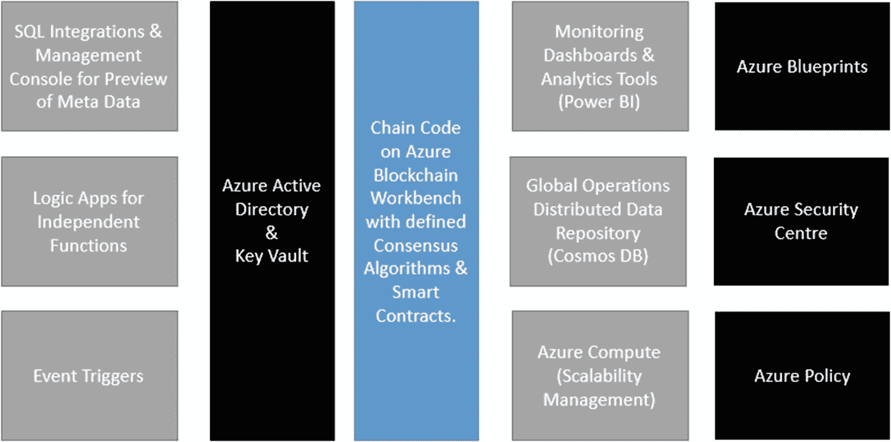

# 自动化：智能合约的自动触发/警报流程

自数字时代开启以来，大多数企业已转向线上运营，包括将其数据上线。然而，仍有一些大型企业因未能与现代系统集成，而依赖链下操作。

这正是智能合约的自动化能够促进交易加速的关键所在。智能合约不仅将合约数据数字化，还将数据传输所涉及的状态和流程也进行了数字化。

这种集成可通过以下方式实现：

- `REST` API 接口
- `Azure` 事件触发器
- 将`Azure`逻辑应用连接到服务总线
- 共识规则中的工作台修改

让我们考察一个需要集成智能合约的医疗运输场景。

以器官移植为例，它要求器官在安全环境中从捐赠者到患者之间进行完全透明的交易。这里，围绕交易的数据和流程都极其敏感。需要考虑多个状态流程：

- 器官在适当环境下安全运输
- 器官在源头被篡改
- 器官运输发生意外，温度未维持
- 器官在目的地交付时受到感染

器官的状态流程对于移植的成功结果至关重要。如果捐赠者、摘取器官的医生、运输条件（通过`IoT`监测）以及接收方的交付检查，都绑定在区块链上并附带智能合约条款，以确保健康器官实现成功移植，那么当任何节点提供的数据篡改了器官状态及其环境变量时，接收方就能透明地规避一笔有问题的交易。这些自动触发器和警报可以通过`Azure`事件触发器上链，一旦智能合约中定义的任何健康器官条件未能满足合约要求，便会立即触发。

例如，如果运输过程中的冷却系统发生故障，事件触发器将调用`Azure`逻辑应用来更新状态，以指示运输失败。这通过区块链和智能合约构建了一个安全、透明、基于条款的生态系统。

## 整体视图

一个成功运行生态系统的关键在于设计（图 6-6）。配置正确的组件集合，确保每个组件都能满足其功能期望，同时保持现有流程的连贯性。在通过区块链和智能合约向长期以来以特定方式运营的组织引入去中心化和自动化的过程中，此类变革往往困难重重，并且容易与线下流程脱节，导致数据不一致和透明度缺失。

图 6-6  
用于无缝集成的 Azure 组件

设计考量以及对可无缝集成的组件的认知至关重要。本章旨在围绕 Microsoft Azure 生态系统中 Azure 区块链相关组件的可用性，涵盖这些思路与考量，如图 6-5 所示。

这些独立的 Azure 组件经过充分测试，符合上述服务的标准，并在企业中广泛使用。因此，在采用区块链时，不应将其视为一个孤立的系统。建议规划现有系统与区块链的集成，以实现无缝运营。

因此，请据此确定适合您区块链及其相关流程的接触点和 Azure 服务。