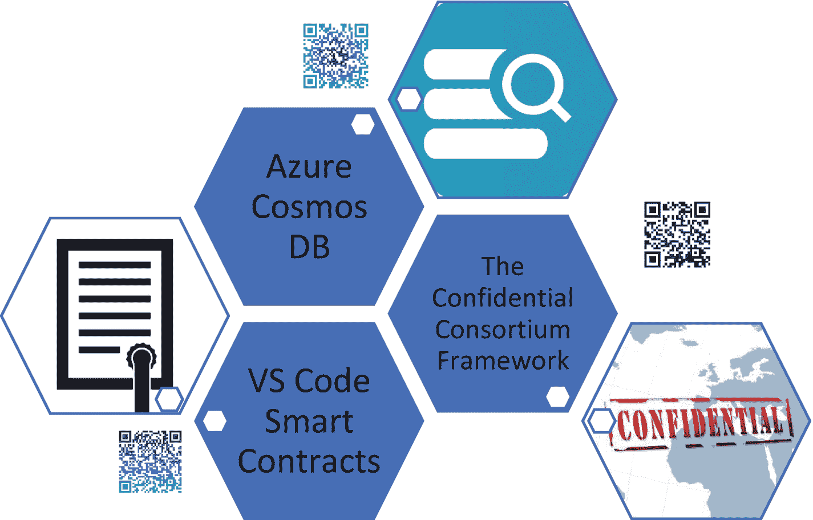

# 业务需求与去中心化的缘由

业务开发人员需要识别现有业务、工作流或运营中的痛点。对于任何待实施的技术，其是否能有效帮助业务实现预期成果至关重要。因此，在做出任何技术决策之前，明确业务需求是重中之重。请填写表 7-1 中的“`CAUSE 矩阵`”，以了解您的业务应用所需选择的区块链类型。

**表 7-1** 业务开发人员用于塑造区块链用例的 CAUSE 矩阵

| 协作工作流？ | 资产数字化？ | 贡献者未知？ | 状态存储？ | 加密至关重要？ | 需要区块链？ | 区块链类型？ |
| --- | --- | --- | --- | --- | --- | --- |
| 工作流是否设计为协作式？ | 资产是否可以数字化？ | 贡献者是已知还是未知？ | 是否应记录状态历史？ | 加密是否至关重要？ | | |
| 是 | 是 | 是 | 是 | 是 | 是 | 公有链 |
| 是 | 是 | 否 | 是 | 是 | 是 | 私有链 |
| 是 | 是 | 两者皆有（访问控制） | 是 | 是 | 是 | 混合链 |
| 否 | 是 | 是 | 否 | 是 | 否 | 其他集中式平台 |
| 是 | 否 | 是 | 是 | 否 | 否 | 其他集中式平台 |

`CAUSE 矩阵`可帮助企业设计区块链解决方案。它是一个包含 5 个因素的问卷，业务战略家必须填写此问卷，以推导出是否需要区块链，并进一步确定适合的区块链类型。

这是一种评估您的业务应用中是否需要区块链的方法。根据矩阵的结果，您可以判断业务场景是否真的需要区块链。

当整个运营流程需要由多个用户进行数字化链接时，请在“协作工作流”一项中标记“是”。例如，考虑这样一个业务用例：一个由 50 名 HR 员工组成的团队，负责运营一家拥有 50,000 名员工的财富 500 强公司的人事工作。该公司希望将各项活动绑定在一起，连接人事运营的各个方面。这种协作工作流可以上链，因此标记为“是”。

对于“资产数字化”，记录中的实体是员工，可以基于数据记录进行数字化。如果资产不是数字化的，就必须找到一种方法将物理资产与数字资产连接起来。例如，门禁钥匙可以通过智能手机或生物识别钥匙来实现，这些钥匙可以作为账本上的数据资产使用。

“贡献者未知”是评估业务流程的利益相关者/用户是未知且探索性的最终客户，还是已知的实体（如员工、业务伙伴或服务提供商）。基于此，可以使用公有链、私有链或两者结合形成混合链。

“状态存储”用于识别所记录的数据是否需要存储每个状态，还是仅存储最后一个状态。参照我们的例子，如果 HR 员工需要了解员工的整个生命周期，那么所有状态记录都至关重要，因此使用区块链是合理的，因为它提供了员工所有状态的防篡改记录。反之，在只有最后一个状态重要的情况下，可能不需要区块链。使用简单的`ERP`/`CRM`系统即可。

最后，加密因素有助于决定是否需要端到端加密。在大型组织中，某些网络信息需要保密并仅限于内部，因此可以使用私有账本，它仅对相关利益者之间的有价值信息进行加密。在我们的例子中，薪资等数据点需要在员工和 HR 部门之间进行端到端加密。此类数据的存储经过加密并分布在链上，使得黑客难以通过攻击单一服务器来窃取信息。

根据`CAUSE`矩阵的结果，请参考表 7-2 中的各种区块链示例。您的用例与区块链的具体匹配程度，可以进一步在解决方案架构师的选择阶段通过第二个矩阵来推导。

**表 7-2** 公有、私有和混合区块链的技术平台

| 公有链 | 私有链 | 混合链 |
| --- | --- | --- |
| • Hedera Hashgraph • 比特币 • 以太坊 • 莱特币 • 门罗币 • MeWe • Choon • MINDS | • Hyperledger • Quorum • Bankchain • MONAX • MultiChain | • DragonChain • EWF • B3i • R3 Corda |

业务开发人员必须根据`CAUSE`因素确定需要去中心化的运营领域，以便决定区块链的类型。那些致力于在去中心化账本上向消费者扩展服务的企业，其消费者可能是未知的最终用户，且无需许可即可加入账本，这类企业会选择公有链。在`B2B`环境或公司内部运营的企业，则可能使用私有链，其中权限对于控制参数至关重要。

以市场型业务为例，需要结合私有链和公有链网络，形成混合链。某些信息，如零售商品列表和服务列表，可以放在公有链上，用户可以匿名查看公有链账本上的数据。然而，当买卖双方之间发生交易时，可以形成一个私有链网络，交易则基于该链的共识原则进行。

业务开发人员会寻求企业级技术工具进行部署，特别是为了获得长期支持、可扩展性、技能可用性、培训等（图 7-1）。Azure 为其区块链元素以及其云服务提供了广泛的企业级支持。这提高了现有微软框架的集成能力，使其能够在需要的地方实现云端化和链上化。

**图 7-1** 适用于 Azure 的关键区块链工具

## 练习 7-1

作为业务开发人员，请确定一个真正需要区块链的业务案例。通过`CAUSE`矩阵运行此用例并确认其适用性。将该用例分解为具体的方面，例如：

1.  存储
2.  流程
3.  访问控制
4.  合约
5.  代币

根据业务用例，为每个方面编写用户故事。

此练习进一步为解决方案架构师提供了决定区块链平台具体规格的工具。