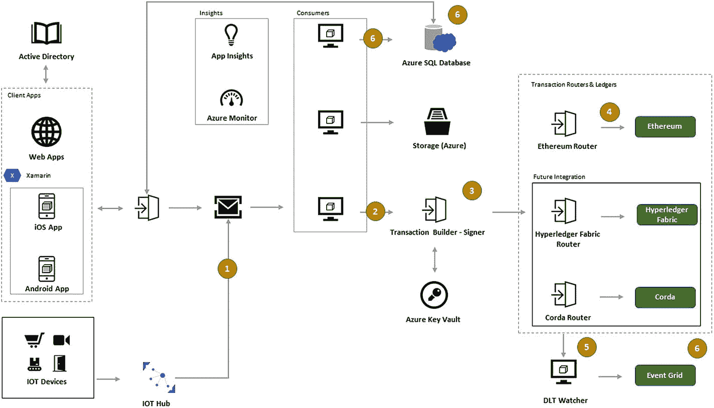
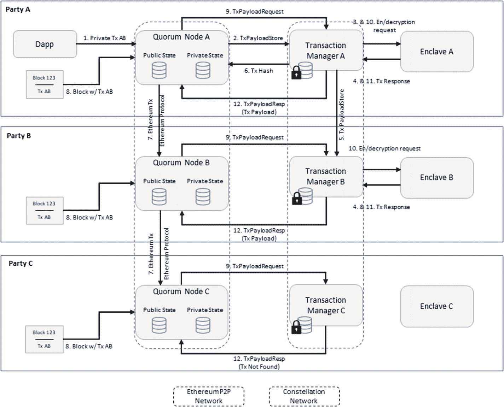
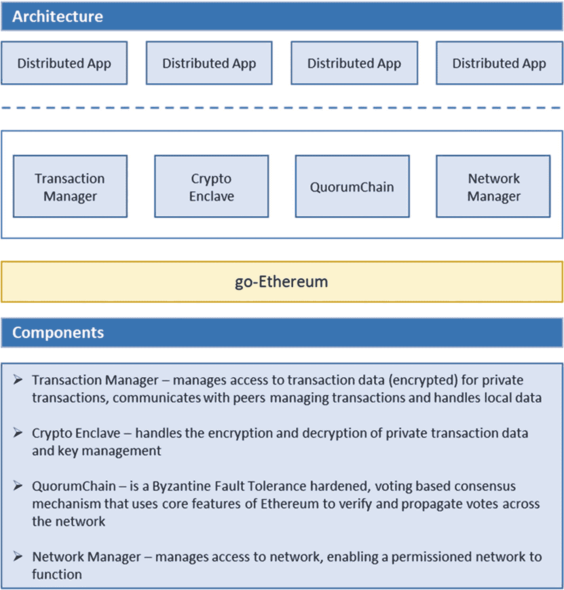
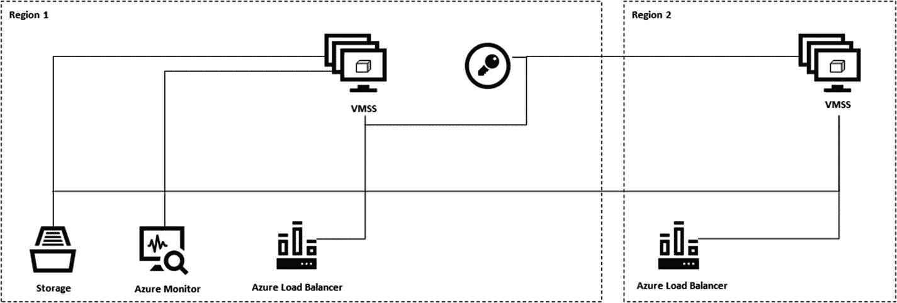
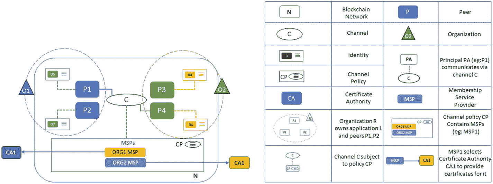
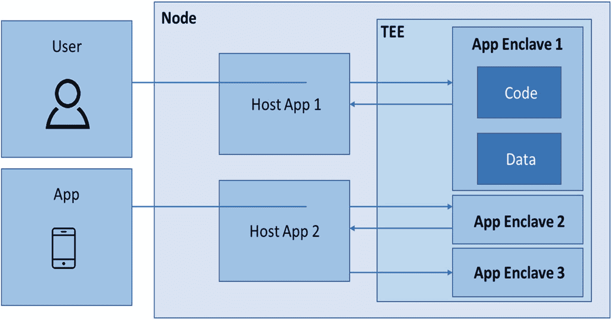
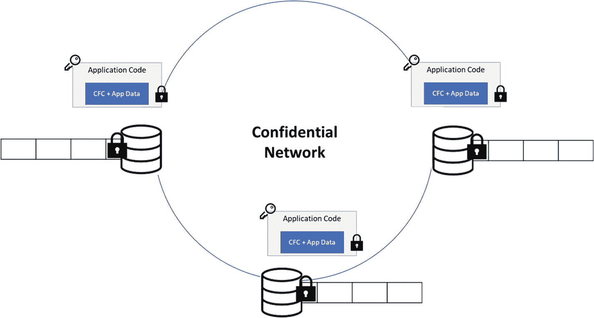
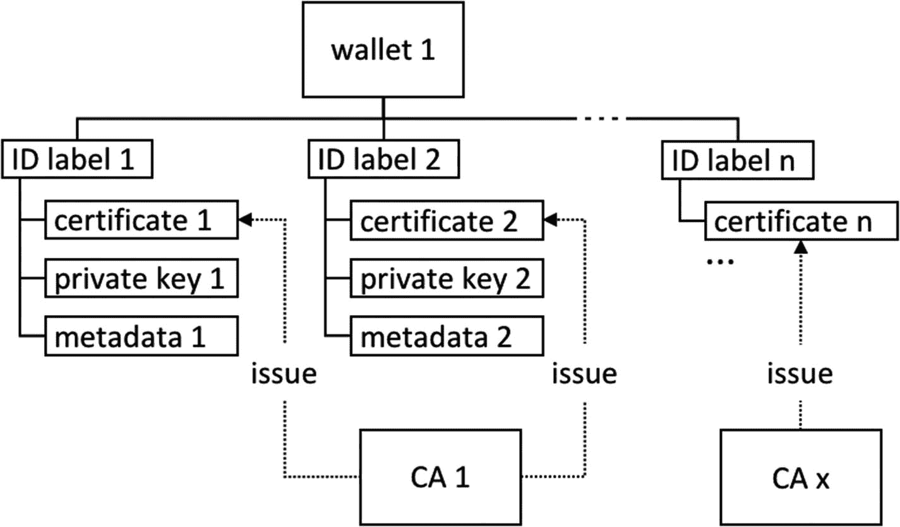

# GHOSSTTT 协议的应用

下一步是将 GHOSSTTT 协议的层级堆叠成框图，以构建整体流程和架构。例如，我们来了解 Azure 区块链工作台所构建的架构，如图 7-2 所示。

图 7-2 Azure 的组件

结合 GHOSSTTT 协议和 21 个问题的矩阵的答案，解决方案架构师必须决定是采用自上而下的方法（从客户到后端基础设施）还是自下而上的方法（从后端基础设施到客户界面）。在 Azure 这样的生态系统中，区块链应用的所有组件都已涵盖。

例如，在图 7-2 中，自上而下的方法包括以下内容：

- 用户身份验证（第 17 单元）– Azure Active Directory
- 应用界面（第 20 单元）– Xamarin 应用和带有 IoT Hub 的 IoT 边缘设备
- 数据通信通道（第 12 单元）– 基于 REST 的网关服务 API、消息代理、服务总线
- 消费者，例如 DLT（链上）、数据库（链下）和哈希存储（加密）消费者
- 洞察 – Azure Monitor 和分析
- 交易构建器和签名器 – Azure Key Vault
- 交易路由器和账本
- DLT 监视器和事件网格

当客户分布在不同地理区域，并能通过可靠的互联网连接进行连接时，以及对于寻求利用云组件企业基础设施来驱动区块链的组织而言，这些工具具有很高的可靠性。

重新审视 CAUSE 矩阵，为什么在这种情况下需要区块链，而不是集中托管的系统？因为对于开发和托管此类平台的参与方而言，加密通常取决于开发者，或者受托管此类服务的公司治理。因此，此类平台在大规模公信力方面可信度较低。在区块链网络中，加密分布在网络中，使得任何随机攻击者都难以破解。此外，在区块链治理模式下，流程运行在去中心化、自治的系统上，该系统可视为智能合约中预设的、经各方同意的规则集，在全体成员同意并验证规则变更或就变更达成共识之前，不允许临时修改规则。

到目前为止，我们已经从宏观角度了解了构成去中心化区块链应用的架构，以及构成账本的组件和支持应用运行的辅助组件。下一章将进一步深入探讨以太坊、Hyperledger 等区块链架构的内部细节。

以下是去中心化应用自上而下的功能组件列表：

- 前端组件
  - 应用
- 区块浏览器
- 监控系统（监视器、事件触发警报）
- 智能合约工具
- 使用 Solidity 及其他智能合约语言的定义
- 合约的自动验证器与执行器
- 预定义的标准与治理
  - 针对代币
  - 针对身份
  - 针对操作
- 工具组件
  - Active Directory
- 钱包
- 保险库
- 数据仓库集成
- 集成插件
- `Json RPC`
- 跨链
- 预言机
- 隐私与扩展组件
  - 加密
- 哈希
- 计算
- 服务总线并发
- 核心区块链组件
  - 网络配置
- 链上及链下状态与存储
- 智能合约执行
- 共识
  - 针对私有网络
  - 针对公共网络
- 网络协议
  - `Devp2p`
- 企业级 `P2p`
- `RLPx` 通信协议
- `Libp2p`

## Azure Stack

一旦针对当前用例定义了机制和组件结构，设计架构便可根据组件类型、功能和角色分配给开发团队。请注意，当解决方案架构师使用 GHOSSTTT 协议、21 个问题矩阵和组件列表最终确定堆栈后，策划真正的去中心化实际执行至关重要。进一步推进时，我们必须提出以下问题来改进堆栈：

- 这种可信度是如何建立的？
- 真正的去中心化如何验证？
- 治理如何测试和执行？

拥有一个企业生态系统，其中所有第三方也与真正去中心化、信任和对等网络所需的组件定义保持一致，这一点至关重要。

Azure Stack 为以太坊网络提供了一键部署选项，每个成员都可以为网络做出贡献。链上的贡献成员可以运行一组节点，与链上的其他挖矿节点进行交互/交易。Azure 允许用户使用网络虚拟设备和连接资源来决定链拓扑，适用于单成员或多成员的以太坊联盟网络。

在 B2B 的企业环境中（例如，非银行金融公司与 DSA 合作处理贷款发放，或保险公司与保险代理合作），有多家公司相互协作。这种业务设置的技术实现要求区块链节点在不同企业所属的不同 Azure 账户之间进行通信。

在需要将流程在组织内部、同一组织的不同部门/员工之间进行去中心化的设置中，区块链节点将成为同一组织 Azure 订阅的一部分（21 个问题集中的第 11 和第 16 单元）。

在多节点 Azure Stack 中，包含以下模板组件：

- 独立部署和联盟领导者部署（也存在于单节点中）– 发起者
- 加入联盟成员部署 – 加入的成员
- 将其他成员与发起者/创始节点连接

Azure 为这两个组件/成员提供了模板，并带有运行模板的部署选项。有关执行模板的详细信息，请参阅：[`docs.microsoft.com/en-us/azure-stack/user/azure-stack-ethereum#standalone-and-consortium-leader-deployment`](https://docs.microsoft.com/en-us/azure-stack/user/azure-stack-ethereum%2523standalone-and-consortium-leader-deployment)。

作为解决方案架构师，必须根据业务案例、GHOSTTT 协议和 21 个问题矩阵，识别 Azure 在其市场中提供的现有模板。

Azure 提供了以下以太坊替代方案。

### Quorum：EEA 单成员区块链

Quorum 是以太坊的一个开源、许可式实现，专注于安全处理交易，并根据控制的权限状态限制访问（见图 7-4）。图 7-3 重点展示了驱动 QuorumChain 的基本组件。观察 Quorum 上以太坊的交易流程，我们在图 7-4 中可以看到所有这些组件如何相互交互。

图 7-4 QuorumChain 上的交易流程

图 7-3 QuorumChain 的架构

参见：[`entethalliance.org/quorum-consortium-network-in-azure-marketplace.pdf`](https://entethalliance.org/quorum-consortium-network-in-azure-marketplace.pdf)

### Ether.camp 以太坊区块链开发环境

该选项可快速搭建以太坊的开发与部署环境。它提供了编写智能合约的模板，并可在沙盒中测试和模拟部署。该环境内置了用于编写智能合约的 IDE，并支持在 Ubuntu 环境中部署。沙盒是一个 NodeJS 服务器配置，能够模拟多节点网络，从而协助节点连接并基于强制执行的智能合约进行治理。

### 微软/Parity 基于权威证明（PoA）的 Azure 以太坊

如图 7-5 所示，该工具包采用权威证明（PoA）而非工作量证明（PoW）来运行以太坊虚拟机。治理规则是预先定义的。

图 7-5

Azure 上的以太坊

它包含以下 Azure 组件（图 7-5）：

*   用于运行 PoA 验证器的虚拟机
*   用于分发 RPC、节点对等连接和治理 DApp 请求的 Azure 负载均衡器
*   用于保护验证器身份的 Azure Key Vault
*   用于托管持久化网络信息和协调租约的 Azure 存储
*   用于聚合日志和性能统计的 Azure Monitor
*   VNet 网关（可选），用于允许跨私有 VNet 的 VPN 连接

现在我们已经了解了基于 21 个问题矩阵得出的各种变体架构，接下来让我们从开发者的角度深入理解组件层面，并决定各选项的适用性。

## 开发者的技术组件分解视角

大多数由公链、私链或联盟链驱动的区块链网络，之所以获得广泛认可，很大程度上归功于其平台源代码级别的透明度。这为实施和运行建立了信任，从而使其成为终端用户信赖的来源。

例如，以太坊、Hyperledger、Corda、Quorum、NEM、Stellar 等都将其框架开源，并进一步在 GitHub 上扩展了组件代码。这种设置允许企业集成第三方框架，以更大信心构建区块链，因为链上的隐私和治理方面不会遗漏任何漏洞。此阶段的开发选择至关重要。

对于解决方案架构师而言，关键在于明确关注上一节中定义的组件。然而，在代码层面，开发者必须对所采用的框架进行严格审查。例如，51% 的矿工攻击就是以太坊早期源代码中的一个漏洞案例。然而，其转向权益证明共识的选择确保了未来能够避免此类攻击。

对于开发者而言，最关键的要素包括工具包配置、用于开发逻辑流的编程输入以及语言的选择。建议的决策顺序是：首先关注当前基础设施，然后是业务逻辑，最后选择适合前两者的语言。为什么这些要素的顺序如此关键？

*   基础设施配置——因为没有合适的基础设施配置，最理想的共识机制可能也无法适用于那些需要云组件以实现大规模覆盖的业务场景。
*   逻辑流——因为逻辑设计和集成必须正确连接。例如，事件注册器和交易观察器必须在每次交易中进行逻辑连接。
*   编程语言——这在很多时候由社区倡议驱动，例如那些强调语言亲和性的倡议；比如，Go 语言使得 Go 开发者能够扩展 Go-Ethereum 以用于多种应用。

由于我们专注于开发者视角的区块链技术工具选择，让我们考虑自底向上的方法（其中底部是后端数据库，顶部是终端用户或前端应用）。

### 工具层

在技术栈中，从数据库端到后端，再到前端的用户交互，每一层都有特定的功能。以下详述了区块链应用的各工具层以及基于功能组件的决策。

| • 网络点对点 |
| • 核心区块链框架 |
| • 隐私与扩展组件 |
| • 工具化元素 |
| • 前端元素 |

#### 网络 P2P 库

以下是一些有用的库：

图 7-6

Hyperledger Fabric 中的多组织点对点网络

1.  Hyperledger Fabric：

1.  在 Azure 以太坊区块链网络中：
    1.  链拓扑使用网络虚拟设备（NVA）进行部署。
    2.  NVA 在负载均衡器和对等节点服务器之后保持高可用性，从而提供一个容错的生态系统。
    3.  链上使用 NVA IP 地址进行多节点链通信，而不是使用对等节点的实际 IP 地址，这使得侵入点对点环境变得更加困难。

1.  在 Quorum（可在 Azure 市场上获得）中
    1.  网络许可是一项功能，用于控制哪些节点可以连接到一个给定节点，以及该给定节点可以向外拨号连接到哪些节点。目前，它在启动节点时通过在单个节点级别使用`--permissioned`命令行标志进行管理。

1.  在以太坊中：
    1.  RLPx 传输协议：一种基于 TCP 的传输协议，用于以太坊节点之间的通信。
    2.  Kademlia DHT（分布式哈希表）在查找和加入网络时提供对等节点选择。该协议包含四个 RPC——Ping、Store、Find Node 和 Find Value。

1.  Noise：用于开发去中心化应用和加密协议的 P2P 网络栈，使用 Go 编写。用于 Perlin Wavelet Network。
    1.  参考：[`https://github.com/perlin-network/noise`](https://github.com/perlin-network/noise)

1.  Libp2p 提供了建立对等网络的包。然而，由于开发者的语言偏好，它也有多种语言实现，例如：
    1.  Go P2p
    2.  基于 Kotlin 的 P2P
    3.  Js-Lib p2p
    4.  Rust Lib p2p

如图 7-6 所示，Hyperledger Fabric 中的点对点网络运行在由网络定义的链码之上。这使得它在多节点、多组织的场景下，既能保持灵活性，又能专注于链的目的，同时还能利用参与组织颁发的证书授权。

### 核心区块链框架

本部分聚焦于区块链内部的组件，而非其外围元素。例如，它涵盖了共识类型、链上与链下活动的网络设计、治理逻辑等。三个主要方面是存储/账本结构、执行和共识（图 7-7）。

1.  其他框架，如 Fabric、Sawtooth、Burrow、Iroha 或 Indy，提供了与加密算法无关的选项。

2.  以太坊框架：Truffle：
    -   以太坊开发者可以构建逻辑智能合约，进行部署和执行。
    -   基于 Mocha 和 Chai JS 的自动化测试工具确保对智能合约代码的充分覆盖。
    -   Truffle 支持 JavaScript、SASS、ES6 和 JSX，从而允许创建灵活的视觉效果和客户端合约操作。
    -   构建管理与流水线化

3.  开发者要点：
    -   使用 Truffle 进行智能合约开发
    -   使用 Ganache 进行测试环境的区块链部署
    -   Drizzle – 一个 Redux 存储，用于获取最新链上数据，以进行交易执行和前端智能合约状态测试

4.  被定义为以太坊的开发环境、测试框架和资源管道，旨在让以太坊开发者的工作更轻松。

5.  微软的 Visual Studio Code IDE 提供了 Truffle 服务以及 Azure 云服务，以增强开发和部署以太坊的 DevOps 体验。

6.  该框架包含三个主要元素：

#### 微软机密联盟框架（CCF）

-   **硬件** – 支持 SGX 的 Azure 机密计算
-   **账本** – 仅可追加的账本通过键值对存储提供私有数据的加密和公共数据的序列化。数据在领导者提交交易时复制到所有节点。复制过程目前使用 Raft 作为共识算法。
-   **加密** – 所有节点共享的密钥使用 GCM（伽罗瓦/计数器模式）对链上的私有数据进行加密。
-   **治理** – CCF 允许其成员提交策略/提案，这些策略/提案必须获得法定成员数接受才能执行。法定成员数在创世交易中定义为 Lua 脚本。常见的治理操作包括添加新用户、新成员或新版本的 CCF 代码。
-   **键值存储结构**，用于存储链上数据、映射（表）和交易 – 包括序列化和加密。还扩展了键值存储 API。
-   **恢复** – CCF 确保在极端网络故障（某些交易可能未完整复制）的情况下能够恢复。恢复也以真正的去中心化形式进行，必须获得交易数据丢失所涉及的所有利益相关者的同意。

7.  一个构建安全、高可用、高性能应用程序的框架，专注于多方计算和数据。

8.  它本身不是区块链，而是通过分布式账本、多方计算和密码学来提供区块链的核心组件。

9.  该框架提供了一个 TEE（可信执行环境），其中代码和数据以机密性和完整性被锁定在安全位置。

10. 它为开发者提供了 Open Enclave SDK，使其能够以 TEE 形式集成，以实现链上逻辑和数据的真正去中心化和完整性，如图 7-8 所示。

图 7-8：机密联盟框架

11. 通常在开发任何区块链的共识时，硬分叉会被限制，并且除非所有成员同意，否则主机不得临时更改。因此，Open Enclave SDK 保证了这种开发的可靠性和稳定性。这使得区块链平台一旦部署在这样的框架上，就会对平台背后的主机/开发者保持中立。

12. 该框架的六个主要元素如下（图 7-8）：

图 7-7：核心区块链框架

### 隐私与扩展组件

本部分介绍了用于数据隐私的工具，并详细说明了可用于在区块链平台上扩展更好隐私措施的组件。

1.  服务总线并发
    -   Microsoft Azure Service Bus 是一个完全托管的企业集成消息代理。
    -   服务总线包括队列机制、主题和订阅。

2.  哈希
    -   Azure 借助 Azure 逻辑应用和 Flow，为这类动态函数提供了无服务器环境。
    -   在将数字资产上链时，可以使用数据和元数据的哈希版本来实现哈希。

3.  加密
    -   Azure 媒体服务使用 AES 128 位明文加密密钥动态加密您的内容。
    -   Azure 存储在将数据持久保存到云端时会自动加密您的数据。
    -   Azure 区块链服务将这些编译到隔离虚拟网络中的安全加密组件内，使得随机黑客难以识别数据的准确来源。
    -   数据磁盘由 Azure 磁盘加密进行加密。
    -   共享访问签名为公共资产提供链上访问权限。
    -   对于区块链法定人数，Constellation 提供了一个点对点消息交换系统。它为每个节点提供密钥生成能力，并根据公共或私有网络的隐私级别维护一个目录。

### 工具元素

图 7-9：示例 – 区块链中钱包集成的布局

1.  钱包
    -   以太坊区块链与多个客户端钱包交互，例如适用于智能手机、其他硬件和台式机的 Metamask、Ledger Nano X、Jaxx 等。这些钱包用于在链上进行交易。
    -   Hyperledger 扩展了四种类型的钱包——文件、内存、HSM 和数据库。

### 前端元素

1.  区块浏览器
    -   通过将同一生态系统中的所有云组件合并，可以基于 Azure 上的交易监视器和事件网格开发区块浏览器。
    -   这将显示交易数量、区块价值等的真实状态。

2.  应用程序
    -   前文列表中的 `Truffle` 框架扩展了多个用于智能合约部署的前端工具。
    -   类似地，Hyperledger Playground 控制台提供了一个前端来可视化链上交易。Hyperledger Composer Playground 提供了一个用于配置、部署和测试业务网络的用户界面。
    -   在 Xamarin 和 Azure 上进行的 Android 和 iOS 移动开发有助于增强边缘设备上的钱包开发。

到目前为止，我们已经涵盖了区块链栈的各个组件，以供开发者进行实现和定制。接下来，让我们进一步探索 Azure 上用于快速部署的区块链即服务工具。

### 区块链即服务

为此，开发者需要设置 Azure 开发测试实验室，该实验室允许他们测试这些服务，并探索它们对解决方案架构师定义的基础设施的适用性。

Azure 开发测试实验室允许：

-   用于开发目的的低规模云设置
-   带有快速环境设置的预配置模板
-   用于集成和扩展的工具

它包括部署区块链即服务选项，例如 `Blocknet`。

#### 方块网络 （Blocknet）

该区块链即服务（BaaS）提供了一种轻量级方案，使去中心化数据能够分布在边缘设备的各个节点上。它具备移动性、模块化和互操作性。你是否曾想过，一个在每个节点都创建副本的通用区块链可能会占用每台设备过多空间？而方块网络正是通过点对点原子交换协议，像一个去中心化的数据交换平台一样运作。

此外，为了探索有助于构建各种用例、应对挑战等所有不同的技术选项，我建议你了解一下其他工具服务，例如`OkCash`、`Ripple`、`Storj`、`BigChainDB`等。

