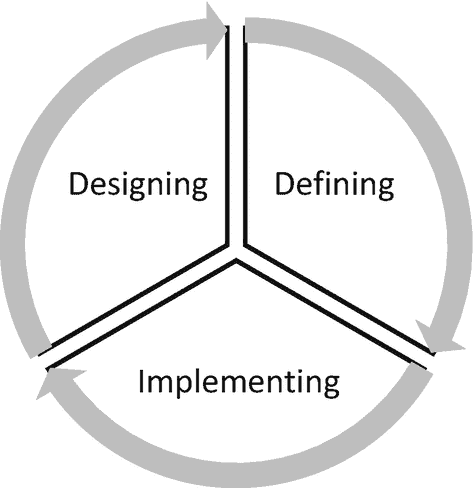

# 8. 技术架构

本章将探讨如何在不同的用例中设计区块链和分布式账本的各种结构。在介绍了一系列技术工具之后，软件架构师、解决方案架构师和产品设计工程师需要从头开始或在现有技术工具之上，构建区块链要素的架构。这个决策通常基于业务需求、技术选择以及开发者的技能。

根据业务用例的定义，软件/应用/平台或网络的架构设计可以在宏观到微观的层面上进行。我们将根据用例的规模来划分本章，从宏观层面开始，过渡到特定领域的用例，最后深入到自动化智能合约的微观设计。本章的亮点如下：

图 8-1：为区块链平台设计架构的核心基础过程

- **设计**：在第一部分，我们将首先审视用例的宏观经济学，然后定义其业务影响，最后为构建贸易金融区块链选择技术栈。
- **定义**：在第二部分，上一部分的广泛框架将被缩小到一个更窄的用例，该用例特定于某个具体功能，而非整个经济体和生态系统。利益相关者是有限的，功能依赖性也大大降低。
- **实施**：在第三部分，我们将考察智能合约的技术栈，包括各司法管辖区承认它们的法律框架，以及遵守智能合约条件的要求。

为成功的区块链平台开发架构的核心基础过程是一个迭代的过程，如图 `8-1` 所示。它需要根据实施反馈不断重新审视设计。

遵循第 7 章的指导，可以使用`CAUSE 矩阵`、`21 个问题集`和`GHOSSTTT 协议`来构建手头用例的结构。本章中我们将针对区块链进行规划和设计架构的任何软件平台，其关键考虑因素如下：

- 关于用户群、地点、实体、对象等的规模度量
- 功能密度与覆盖范围
- 功能与可扩展性（深度和广度）
- 计算复杂度及硬件依赖
- 实现的核心决策
- 支持扩展和维护的工具
- 框架
- 架构设计的链上与链下组合

我们称之为架构的 8D 因素。

## 为贸易金融设计区块链解决方案架构

第一步是识别所有可能与贸易金融区块链平台交互的关键利益相关者。列出这些利益相关者并决定用户的角色，他们是全节点、节点贡献者还是链下成员。在这个从宏观层面审视全球贸易应用的用例中，我们必须考虑以下参与者：

- 出口商/卖方
- 进口商/买方
- 开证行
- 指定银行
- 通知行
- 参与验证流程的银行链/分行
- 中介机构，如航运公司、海关、采购公司

在全球贸易场景中（如图 `8-2` 所示），会有更多的贸易参与者——政府、监管机构、海关、不同货运方等。然而，为了在区块链上设计全球贸易应用，为了学习目的，我们将简化贸易流程。一旦明确了这一点，就可以添加多种类型的参与者，并定义他们在链上的角色。这些参与者的加入过程与本节阐述的基本原理类似。

图 8-2：全球贸易参与者

这可能因情况而异。这里，我们以初学者能够查看和理解的最原始形式来看待它。从那里开始，这是一个根据平台成熟度、利益相关者以及链核心功能的定位来完善架构设计的迭代过程。

在贸易金融中，让我们识别一个真正可能需要区块链的挑战。我们必须考虑贸易参与者的可信度。许多大额贸易交易会在付款或贸易项目交付中出现违约。贸易金融引入了由金融机构提供的信用证和银行担保，以成为可信贸易的催化剂。