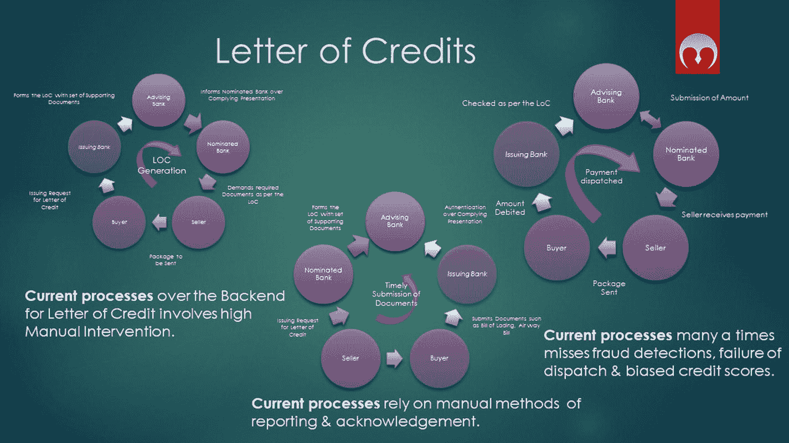

# 信用证与区块链：贸易金融的变革

## 信用证（LoC）的传统概念

信用证（`LoC`），也称为跟单信用证、银行商业信用证或承付书（`LoU`），是国际贸易中采用的一种支付机制，旨在由信用良好的银行向货物出口商提供经济担保（见图 8-3）。

图 8-3：信用证在各机构间生成的常规流程

传统上，金融机构是中心化的信任源，因此产生了信用证的概念。

## 中心化信任的挑战与区块链的扩展

然而，近来，即使有此类单据，也出现了违约案例，原因包括黑客能够入侵银行系统，或员工/合约第三方合作方进行人为干预，等等。

这种中心化的信任无疑可以通过更安全的区块链实践得到扩展。当银行委托并将数字系统的开发外包给某公司时，如果基于区块链，则可以维持关于该公司参与的信任和透明度。许多人可能不认同这种透明度能带来更好的实践。因此，在为贸易金融链设计区块链时，可以选择区块链的类型及其活动。

然而，有一项安全要素是有保障的：黑客入侵中心化服务器的计算强度远低于入侵整个去中心化的区块链网络。因此，采用区块链并非直接要求移除中介机构。很多时候，区块链能够促进更透明、更可信的实践。

## 设计的第一个挑战：加入机制

现在设计思路已确立，我们来剖析信用证贸易金融中的区块链用例。首先，在列出的贸易参与者中，谁负责启动其他参与者的加入流程？为什么有人会同意加入一个透明的区块链账本？有多少企业仍然回避建立在线业务？

因此，设计的第一个挑战是**加入机制**。

由于银行或金融机构被大多数贸易参与者视为可信来源，从银行开始实施加入流程在逻辑上可能更容易。然而，这并非硬性规定。可以按行业启动加入流程；例如，可以从农民和消费者的加入开始，然后逐步引入其他参与者。因此，基于业务交易中涉及的参与者，去中心化平台可以选择相应的加入机制。

加入机制需考虑要点：

-   加入是否需要达成共识？
-   加入的用户与加入的节点是同一概念吗？
-   成员加入需要哪些先决条件？
-   初始加入后，谁有权添加新成员？

上述所有问题的答案完全取决于链的业务、挑战和目的。在我们这个孤立的案例中，我们允许金融机构添加一组初始成员。成员可以进一步添加满足链上共识条件的其他贸易参与者。每个用户都是一个节点，从而实现真正端到端的去中心化。