# 第三个挑战

在导入成员期间，根据设计方案，可能需要进行了解你的客户（KYC）以及同类节点验证。这类似于亲友推荐或银行验证。

贸易参与者完成导入后，必须为其分配将在链上承担的角色。

设计的第三个挑战是**向节点分配角色**。

在区块链中需要分配的角色，如图 8-4 所示，可能包括：

- **客户端节点** – 在链上需要某项服务时加入的最终用户。在我们的当前用例中，是进口商和出口商（即买方和卖方）。

- **对等节点** – 最终用户与之打交道的银行需要永久在链上。开证行和指定银行的分支机构可被指定为对等节点。某些对等节点可以充当背书节点。例如，开证行为出口商的可信度背书、发起交易并维护其可信度状态。

- **排序节点** – 这些节点是交易的传递者，进行无偏见的验证，以确保交易活动以容错方式交付。因此，根据设计，架构师需要确保对等节点与排序节点的比例适当，以避免偏见失衡。

此外，CA（证书颁发机构）节点可以作为这些角色的授权者，并分配与这些角色相关的权限。CA 通过权益证明形成此授权共识，以维护许可账本机制。

另外，如果需要，客户端节点的 KYC 可以是一个独立的、具有身份证明共识的区块链。这同样取决于平台提供商的关注点。否则，CA 节点可以确保导入验证。

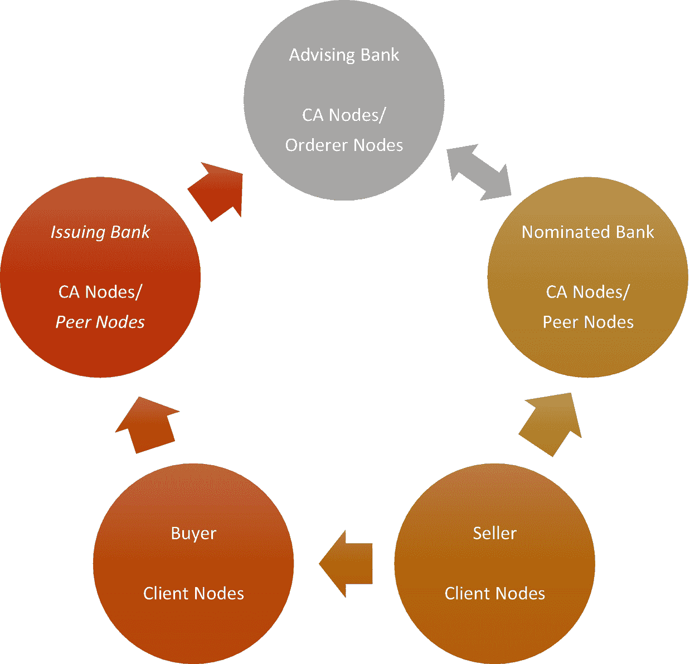

图 8-4：向导入的成员分配角色

### 第四项挑战

在角色分配完成后，平台需要定义数据结构与交易活动。

第四项设计挑战是定义链上数据结构与交易活动。

此处，定义的范围基于信用证及其相关法规的重点。

该场景中确定的数据点如下：

- 文档输入，例如 `KYC`、提单等
- 文档验证状态
- 多数投票状态
- 智能合约的条件

交易活动点定义如下：

- 文档验证
- 文档传输
- 智能合约条件审批
- 根据多数状态进行付款调度

为进行详细规划，可按以下方式分阶段进行所有步骤：

| **功能** | **描述** |
| --- | --- |
| 节点生成、集成与链搭建 | • 创建节点（`KYC/ AML`） • 访问控制 • 链接生成 • 序列锁定 • 文档机器翻译为智能合约 • 自我认证 |
| 信用证（`LoC`）和银行保函（`BG`）的智能合约 | • `LoC` 智能合约申请表 • `BG` 智能合约申请表 • 跨节点智能合约自动验证 • 通过链传输文档 • 验证与警报 • 按合约执行的智能触发器 |
| 交易与其他可执行操作 | • 履行 `LoC` 智能合约时的实时资金调度 • 扣留银行保函时的损失结算 • 各种文档更新的警报 • 低信用与欺诈检测的警告警报 |
| 监控面板 | • 按访问控制的节点视图 • 授权控制 • 验证控制 • 报告与警报 |

### 第五项挑战

为了进一步明确并预测完整设计，必须确保区块链覆盖所有情况。因此，下一项设计挑战是确保功能全覆盖。

第五项设计挑战是实现全覆盖的区块链代码。

为确保区块链代码的全覆盖，需要定义每类用户之间所有可能的用户故事。让我们确定买方侧（图 8-5）和卖方侧功能（图 8-6）。

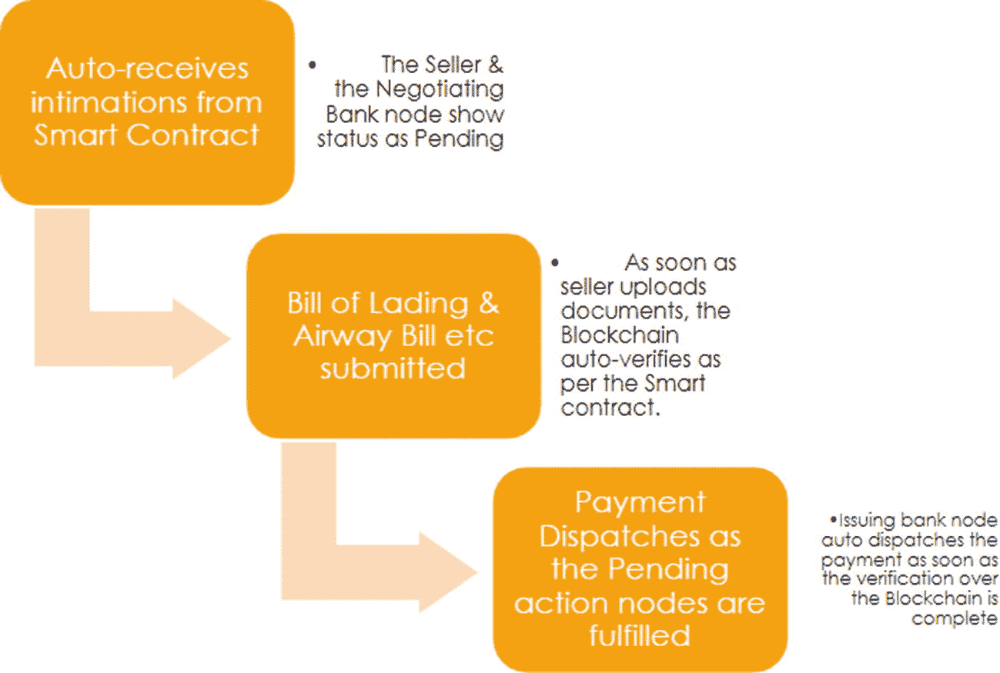

图 8-6
卖方侧的用户故事

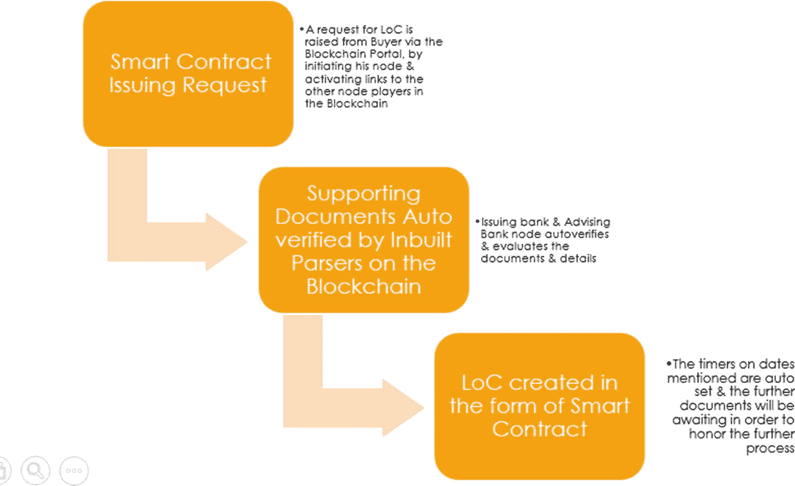

图 8-5
买方侧的用户故事

银行节点是 `CA` 节点，并且存在具有不同权限级别的验证节点。如图 8-7 所示。

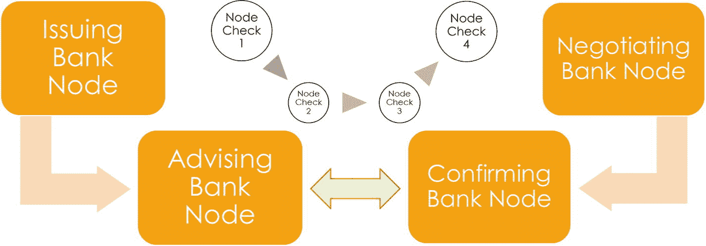

图 8-7
银行节点之间的验证与交易活动

记住：作为架构师、开发者或区块链平台提供商，你有责任设计并开发一个完全可靠的方案，以避免任何漏洞、绕过和中心化机会。这些问题在中心化平台中可以得到处理，因为可以持续更新而无需订阅者达成共识。然而，区块链上的修正和更新由于需要接受更改并更新本地节点的共识而变得计算复杂。因此产生了分叉的概念。

根据情况，分叉有多种定义方式，如下所示：

- 区块链分叉为两条潜在前进路径时发生的情况
- 协议的更改
- 两个或多个区块具有相同区块高度时发生的情况
- 发现矛盾漏洞或出现类似竞态条件的情况

例如，当以太经典（工作量证明）这种去信任网络中的用户数量增加时，漏洞也随之增加，导致了 51% 攻击。这是一种攻击，当攻击者控制超过 50% 的网络算力时，可能对使用 `PoW` 算法达成共识的区块链发起攻击。这意味着网络的大部分节点被攻击者占据，他们验证并允许欺诈交易，从而引发攻击。此类漏洞需要提前预见，以避免安全漏洞。

这使得第五项挑战最为关键，即确保区块链的核心属性万无一失。如何确保这一点？请填写下表，包括痛点、围绕痛点的相关问题、这些情况下节点的责任，以及针对交易的总体解决方案行动，如图 8-8 所示。

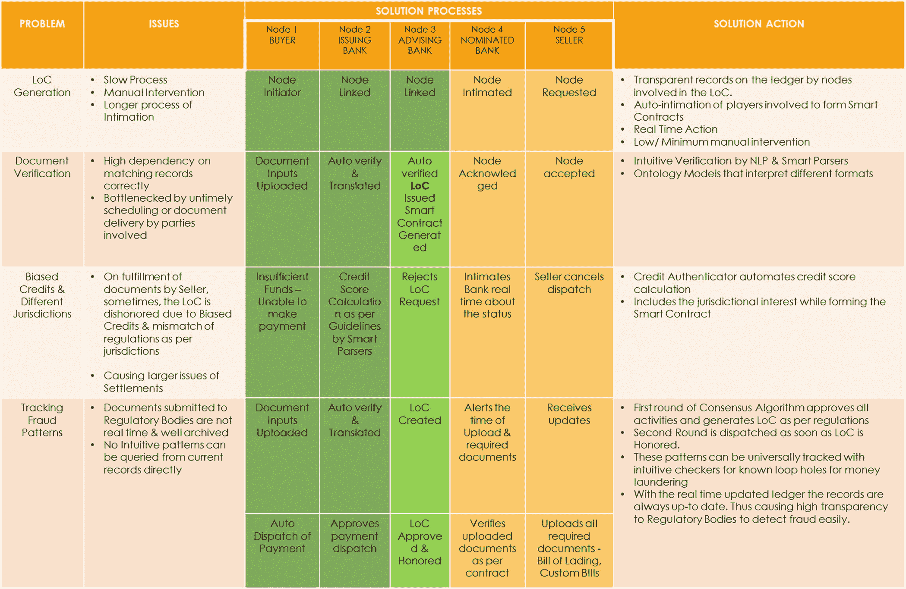

图 8-8
解决方案：所有情况下的用户故事

**练习**

为去中心化库存系统填写下表，以避免高库存成本并最小化缺货损失。

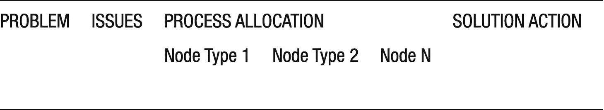

如图 8-9 所示，买方和卖方是中介机构的订阅者，并享受金融机构的服务。作为服务的订阅者，他们在权限、透明度和决策权方面的平衡实际上并不受其控制。然而，当所有用户都进入去中心化平台时，它使用户能够主张权利并参与到决策过程中。

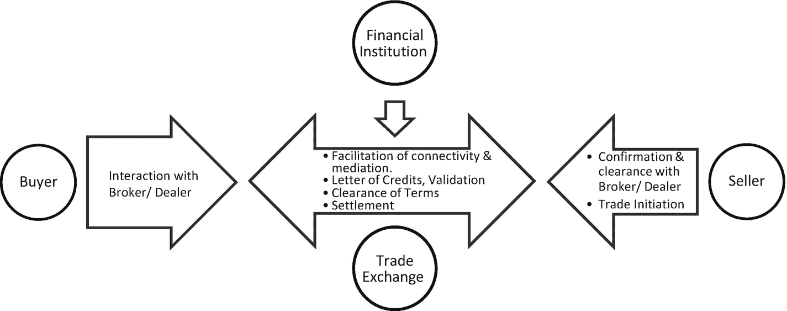

图 8-9
中心化的传统贸易融资流程

例如，如图 8-10 所示，验证节点、对等节点和排序节点等节点是交易的参与方，它们基于所绑定的共识共同验证交易。

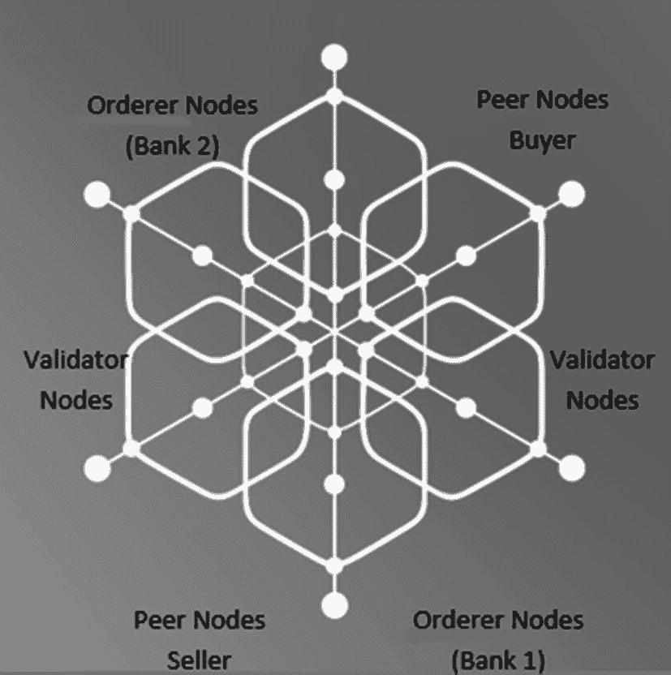

图 8-10
去中心化的贸易融资流程

请注意，这种安排是多种区块链的联盟。有些在组织之间，有些在组织内部。例如，跨所有利益相关者的公有链将是组织间的，涉及贸易的多方。很多时候，节点代表将是组织代表，需要在公有链上执行某个操作之前达成内部共识。因此，每当内部组织的私有链形成共识时，也就是节点代表在公有链上验证交易之时，从而保持全链路端到端的透明度和连接性。

### 第六项挑战

最终的设计挑战是基于第 7 章及前述痛点中确定的决策，来安排架构中的各个元素。

第六项设计挑战是绘制出**整合后的架构堆栈**。

在贸易融资用例中，我们已堆叠了所需服务的各个关键组件。

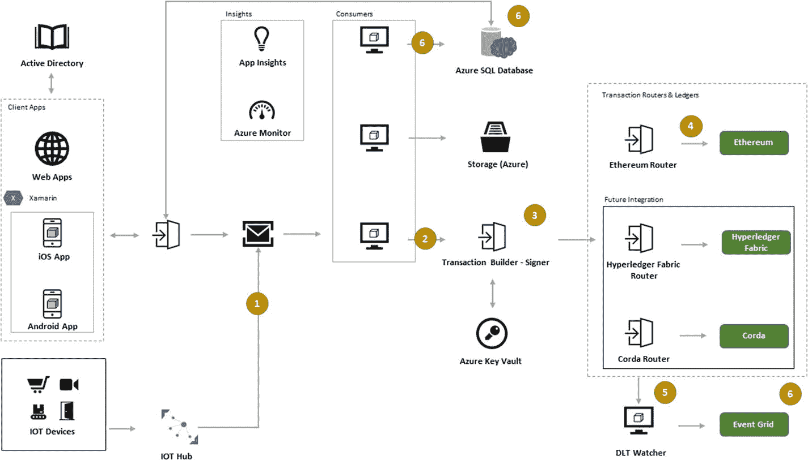

图 8-11：包含所有组件的整合架构堆栈

该整合堆栈涵盖了端到端的接触点，范围从物联网集成等边缘设备，到基于智能合约或共识触发事件的事件网格（图 8-11）。

图 8-12 展示了一个旨在实现真正去中心化的协作工作流程。

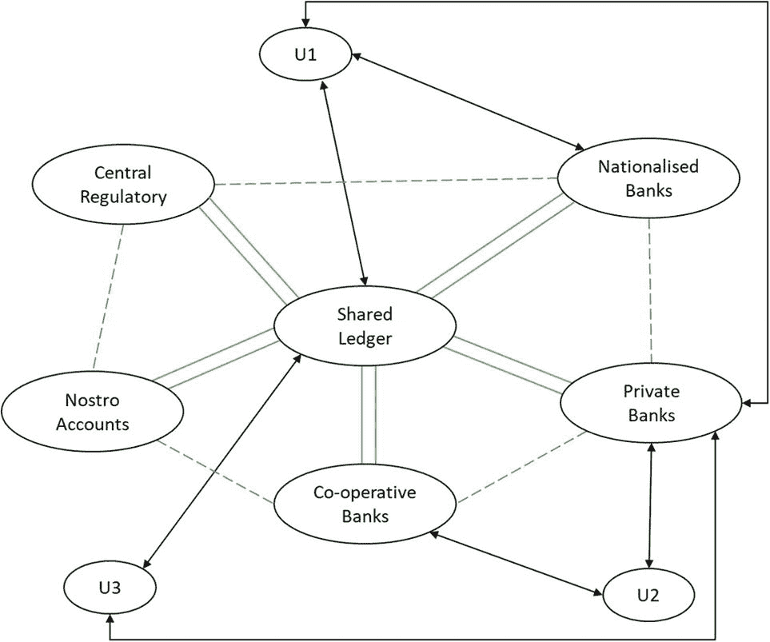

图 8-12：参与全球贸易融资的金融机构的企业定位

设计分为三个层级：

- 系统架构
- 企业架构
- 应用架构

请参考图 8-13 和图 8-14，了解金融服务环境中典型的架构流程示例。

`系统架构`允许您将区块链的物理和虚拟组件跨网络进行部署，涉及硬件（如云上的虚拟机、计算机、服务器、手机、智能设备）以及与其托管的软件服务层的集成。

`企业架构`是一种模型，允许将企业结构和功能嵌入到应用流程中。在这里，设计侧重于组件做什么，而非它们如何工作。这使得企业团队的不同部分能够进行交互和集成。企业中存在`TOGAF`和`Zachman`框架，区块链设计可以参考现有模型并进行改进。

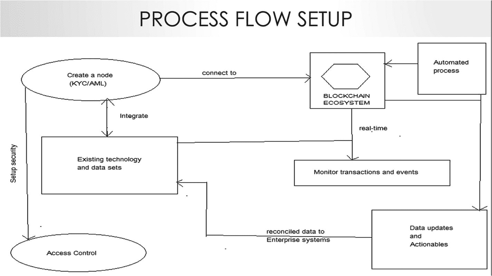

图 8-13：在金融机构中设置区块链的流程

`应用架构`详细阐述了特定于应用的功能组件。重点领域必须涵盖交易活动的链服务机制、合约定义与转换、触发与警报、权益划分、权限等。

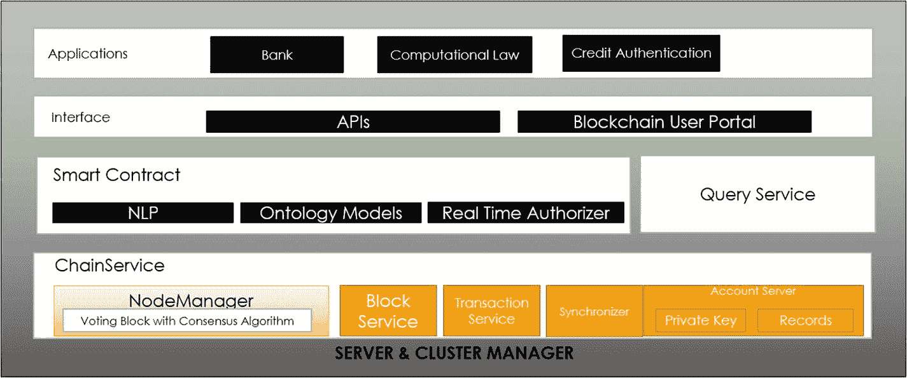

图 8-14：在金融服务环境中设置应用

现在我们已经了解了不同类型的架构及其基于应用的设计，让我们来看看本章开头定义的技术架构 8D 要素。

### 基于用户群、地点、实体和对象的规模衡量

#### 用户群与地点

在贸易融资中，用户群涵盖全球范围内的人员，从交易商、买方、出口商、国际机构，到海关、监管机构、国家、金融机构、审查机构等等。同时，它还包括在本地环境中运作的本地微链，如生产商、运输公司、合作银行、农业分销商、包装公司、微型金融贷款机构、地方政府计划和机构等。作为一个区块链平台，它可以覆盖本地或全球区域——这取决于平台想要解决的问题。

例如，如果金融包容性是链的重点，它必须从本地启动并扩展到偏远地区，这些地区通常接入受限。当全球金融包容性成为焦点时，区块链平台必须连接全球所有偏远地区，并纳入贸易聚合器以加速覆盖范围。可以激励这些对等节点接纳远程贸易参与者。可能产生的问题是，在考虑贸易融资时，为什么要把所有这些参与者都包括进来？当端到端的参与者通过一个去中心化的平台完全连接起来时，信息比在离线或中心化在线平台上获取有偏见的信息源要可信得多。凭借这个不可篡改账本上的可信信息，可以做出更明智的决策并计算出预测性因素。信用证明可以具体衡量；您将不仅拥有一个节点或一组节点的验证，还拥有区块链账本上防篡改的历史记录。

为这类平台设计架构的开发人员需要基于业务服务的短期和长期目标来考虑用户群的规模。同样，全球、本地和远程实体的地点也需要确定，以便围绕它们构建技术堆栈。此外，考虑到地点因素，还必须考虑用户所在地区的社会经济状况。例如，没有适当互联网接入的地方可能需要作为容错网络的一部分，这样即使因缺乏网络而未能获得每个用户的验证批准，操作仍可继续。架构师必须为功能性网络维护`验证节点`、`对等节点`和`排序节点`的正确比例，并采用适当的共识机制。同时，架构师必须根据地点选择合适的设备形态；例如，农民和渔民等现场专家可能无法使用计算机，因此这些节点可能必须部署在虚拟云服务器节点、移动设备节点或可作为物联网设备连接到区块链的摄像头节点上。

#### 实体与对象

在涉及多个实体的贸易融资区块链平台中，法规、IT 政策和访问控制可能因实体而异。如果是一个协作网络，为了达成适当的共识，必须涵盖不同实体政策的各个方面。例如，合作银行或金融机构需要以特定方式维护其`Azure Active Directory`；其格式必须保持不变。Azure 提供了企业`Active Directory`到区块链用户目录之间的映射。区块链集成可能运行在多个拥有独立 AD 策略的 Azure 账户之上。这种到区块链目录的映射对设计至关重要。同时，来自一个实体的节点绝不能以任何方式访问其他实体的 AD。

对象可以是资产、合约、数据结构、链下报告等。然而，加密货币市场曾发生过多次因链下钱包安全性不当导致的金融科技黑客攻击。因此，在贸易融资网络中，如果验证回路在链上，而可下载的报告可以在线下修改且没有哈希地址追踪，那么在链上设立这种验证的全部意义就失效了。因此，架构师在构建每个对象（无论是链上还是链下）时，都必须质疑是否真的需要区块链。Azure 安全地维护着监控系统、事件触发器和链下存储，以追踪对象。

规模的衡量，小到可能只是一个由三个实体组成的本地贸易融资区块链网络，大到可能是一个由百万个实体组成的全球贸易融资区块链网络。然而，在每一个阶段，保持去中心化、共识机制以及区块链的核心基础原理都至关重要。同时，一旦建立并在链上设置好流程，就可以将交易活动从一个对象扩展到多个对象（资产），并实现功能扩展。

### 功能密度与覆盖范围

功能密度可能取决于为特定功能向链中添加更多参与者，或增加链中少数参与者的功能职责。同时，某些功能可能与可信度的核心挑战无关，并且可以离线处理。

确切地说，信用证流程的验证可能会在一个实体内部经历多个内部流程。那么，是将所有参与者都添加到同一条链中，还是为这个内部流程创建一个单独的私有链？同样，在为贸易金融区块链服务决定用户纳入范围时，用户的选择是更广泛还是高度细分？这决定了覆盖范围中的用户类型。

### 功能性与可扩展性（深度与广度）

一旦前两个因素的界定清晰，就需要根据已定义的功能性和可扩展性来规划技术层面。例如，当区块链上拥有数千个功能但可扩展性有限时，时间延迟可以得到很好的调整。然而，同样的区块链源代码是否足以支持十亿用户的基础？必须明确功能深度和广度相对于用户基数可扩展性的愿景，以避免出现多次硬分叉。当区块链采用诸如事件网格、计算服务器和基于 AD 的身份验证等 Azure 组件时，可扩展性问题被模块化，并且可以在各自范围内轻松处理。

### 计算复杂度与硬件依赖

所选择的共识方法的形式对硬件计算和内存有至关重要的影响。区块链上的每个节点都必须保持活跃，这导致所有节点都期望高正常运行时间，最终形成瓶颈。基于规模定义选择共识算法有助于确定硬件依赖关系。

或者，企业可以在进行平台设计之前，先从规划硬件限制开始，而选择共识算法正是此步骤的一部分。这取决于此步骤以及大多数用户群的承受能力。

### 实施的核心决策

当发现某些限制时——例如，工作量证明削弱了利益相关者对决策的影响——此类决策必须在链上成为硬性规则。当一条链由权益证明管理时，必须确保所有交易活动都遵循那一套非常标准的程序。

### 支持扩展与维护的工具

在大多数情况下，Azure 组件可以加速部署和节点纳入。链上服务的维护由云服务提供商负责。同时，必须仔细衡量计算成本与工具成本，以支持区块链服务。

### 框架

以太坊、Hyperledger、Corda 和 Ripple 等区块链框架可以轻松与 Azure 组件集成，确保部署更快且更具可扩展性。根据对规模、位置和共识形式的选择，可以选择所需的框架。

### 链上与链下结合的架构设计

由于贸易金融区块链网络会穿越多个组织和实体，某些元素将始终保留在链下。例如，身份验证的核心 AD 值将仅由拥有它的组织集中控制。将这些元素在链上民主化在此区块链中并无意义。同样，无需托管中间状态数据的 SAP 或其他现有 ERP 数据也不必托管在区块链上。因此，识别链上和链下的元素、数据结构及资产，是设计中最关键的方面之一。

## 为内容追踪、许可和版税定义内容分发区块链架构

Getty Images 和 Shutterstock 提供带有许可和使用权的内容。同样，Spotify 确保连接到面向终端用户的独立艺术家的内容。这些中心化平台提供了可访问性。然而，盗版问题仍然是一个巨大的担忧。许多电影剧本和手稿被剽窃，毫无秩序和管控。此类数据泄露通常无法追溯，因为存储机器地址并非普遍做法。如今，在这个全球各地联系日益紧密的时代，从一个国家盗版的电影剧本很容易在遥远的另一个国家被识别出来。然而，这种可追溯性部分在线完成，部分由于涉及人工干预而离线完成。

与假新闻的情况类似，由于数据可追溯性管理不善，欺诈性数据贡献者使得识别虚假模式变得困难。这并不意味着中心化平台没有可追溯性，但这从来不是其首要关注点。可追溯性可以在中心化平台中维护，但它极易被篡改。于是，区块链应运而生。

这使得它成为一个有趣的用例，其中真实的数据分享具有真正价值，并且对此类数据有同等的贡献吞吐量和回报。因此，内容提供商会直接根据数据的价值获得激励。这在当今的许多内容平台中也能看到，例如 YouTube、Instagram 等。然而，随着平台的扩展，识别平台内容的真实性变得非常困难。在这些平台上识别虚假内容的努力，不仅耗费平台提供商的时间和资源，也会导致真实内容创作者被误认。

区块链为每一个数字副本维护从源头到目的地的可追溯性。可以将其视为艺术家/内容创作者的数字签名，随资产一起移动。当一份数据文档通过 Google Drive 与他人共享时，接收方可以创建副本、修改、篡改并进一步分享。原始所有权和版税信息随着这种分享形式而丢失。此外，此类中心化服务会将内容暴露在网络中，因为在这些情况下没有端到端加密的事前保证。因此，我们需要区块链。

通过端到端加密以及随内容创建者数字签名一同转移资产，区块链可以始终维护可追溯性。除了可追溯性之外，在区块链上能够实时、更透明、更公平地获取激励，也使其颇具吸引力。例如，在像 Twitch 这样的中心化内容管理平台上，直播游戏视频的玩家根据其受欢迎程度和广告适配性，每小时能获得 1 美分到 1 美元不等的报酬。当满足平台规则中的特定条件时，报酬才会支付，并且支付方式完全由公司根据其政策自行决定。在这种情况下，内容托管公司完全掌控权限和激励，并可以在未经内容创建者共识或同意的情况下随意调整价值和政策。现在，想象一下，如果有一个基于区块链的内容分享平台，它将内容托管和创建职责分配给客户端节点，将主机共享和负载均衡职责分配给排序节点，并将验证内容分发的职责分配给验证节点。在这样的平台上，分享、分发和激励分配将基于真正的区块链共识。只有这样，查看、再分发和支付等行为才会被触发。同时，根据共识，激励的价值在利润分享和约定价值方面可以更加透明。

