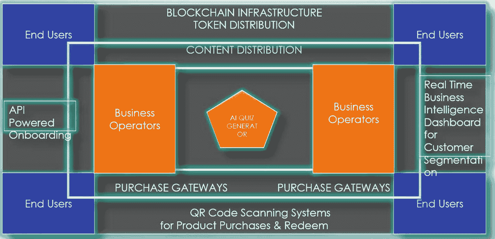
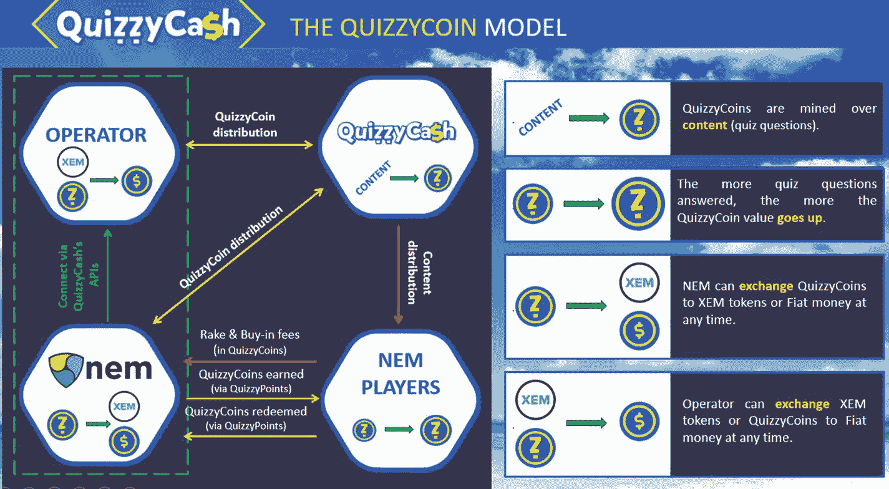
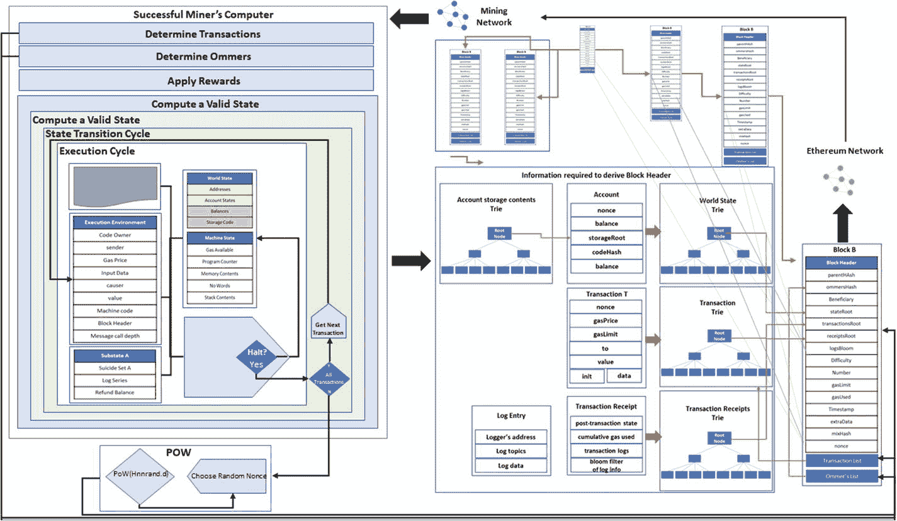

# 排版后的文本

一个基于工作量证明（即，创作、分发内容所消耗的能量以及内容的需求）的内容创作者和实现分发的节点之间去中心化利润分配的简单示例如图 8-15 所示。一旦这个价值以付费订阅和广告曝光的形式变得有形，公司就可以直接根据不同的利润额公平地分享利润。这确保了更快的推广、更快的反馈和更快的支付。

*图 8-15 在区块链上由人工智能驱动的内容分发平台架构*

在上述安排中，基于链上约定的内容分发权，最终用户通过不同的私有和公共账本区块链连接。例如，如果某些内容对某些商业运营商是排他性的，它将保持加密状态（对其他人显示为乱码），并且解密密钥仅在接收者的地址上。然而，如果某个商业运营商希望进一步转售或许可该内容，则此商业实体与内容提供商之间的贸易共识可以通过智能合约达成，并据此进行转售和利润分享。因此，当`A`创建内容，`B`将内容转售给`C`，`D`查看并与`A`的内容互动时，从源到目的地的记录的可追溯性将保存在区块链账本上（图 8-16）。

*图 8-16 Quizzycash：一种在区块链上衡量参与证明的内容分发平台*

因此，一家名为`QuizzyCash`的区块链公司基于客户参与证明的共识运行。每个内容价值都根据其对客户/用户参与度的衡量获得激励。简而言之，如果一场重要的英格兰超级联赛即将到来，而最新的测验包含相关内容，那么客户参与的吸引力可能会很高，从而产生高额的广告价值，并相应地激励创作者。这是基于`NEM`的重要性证明框架开发的。代币机制是根据期望的衡量标准和分配方式生成的。

现有框架的技术架构总可以被修改以适应应用架构、企业架构和系统架构。

下表分析了内容分发用例的架构的 8D 因素。

| 因素 | 影响 |
| :--- | :--- |
| 1. 关于用户群、位置、实体、对象等的规模度量 | 用户群可能因地理位置和市场大小而有很大差异。例如，`Netflix`在印度拥有庞大的消费者基础；因此，针对某个位置的内容的价值回报对于内容创作者来说可能变得更加透明。同样，当内容代理商参与与内容分发商的交易时，许多时候即使交付了盈利的内容，款项也会被卡住。在这里，区块链使得实体能够基于自动执行的智能合约参与到公平交易中。类似类型的内容可以存储在区块链账本上，例如电影、艺术品、书籍等。 |
| 2. 功能密度和覆盖范围 | 功能密度可以基于内容生成者的影响，其衡量标准超越了单纯的广告费和订阅率。它可能扩展到对某个区域或国家的神经科学影响，以及来自不同人群的影响覆盖范围。 |
| 3. 功能性 + 可扩展性（深度和广度） | 此类平台的区块链架构师必须根据从初始阶段到增长阶段的用户群来决定功能的广度或深度方向。同样，也需要决定可扩展性。 |
| 4. 计算复杂度及硬件依赖性 | 一旦功能性和可扩展性确定，就需要计算传递内容的计算复杂度。内容是整个内容本身都在区块链上，还是仅仅是一个指向内容的指针引用？例如，将电影或艺术品放在区块链上会使其在存储方面非常密集，因为多个副本会使它变得庞大。复杂度计算使人们能够预测节点服务器的运行成本，因此分发激励计划必须公平地考虑这一点。 |
| 5. 实现方面的核心决策 | 核心决策类似于整个平台必须遵守的规则。例如，区块链账本不允许将免费门票内容添加到平台上。 |
| 6. 支持扩展和维护的工具 | 一旦确定规模扩展和功能覆盖范围可能会发生变化，就必须计划硬分叉和软分叉更新，或者在加入网络时将其包含在共识协议中。 |
| 7. 框架 | 当前的示例是建立在`NEM`之上的。 |
| 8. 架构设计的链上和链下组合 | 链上 – 内容上传、再分发、第三方集成 链下 – 大规模内容存储库的存储 |

## 实施法律智能合约的架构

本节不针对任何特定国家教育智能合约的法律方面；它主要针对逻辑流程和使能因素。

智能合约主要源自以太坊的工作量证明框架（图 8-17）。

*图 8-17 以太坊中 PoW 的详细流程*

进一步理解以太坊技术架构以及如何使其适应系统架构、企业架构和应用架构至关重要。以太坊中的难题求解通常实现了工作量证明。同样，贸易交易或经销商的法律框架在所有情况下都需要一个定义良好的智能合约以及共识。

在此，自动执行和可执行智能合约的应用可能涉及土地所有权、租赁、房地产经销，直至保险索赔和金融程序。智能合约可能根据个人的驾驶风格（而不是基于标准值）执行不同的保险费档次。

因此，架构的设计可以包括`Ethereum`/`Hyperledger`框架，以及用于钱包的`Truffle`集成和用于智能合约执行的`Solidity`。

## 练习

类似于前两节的学习内容，计算汽车服务合同管理的架构的 8D 因素。