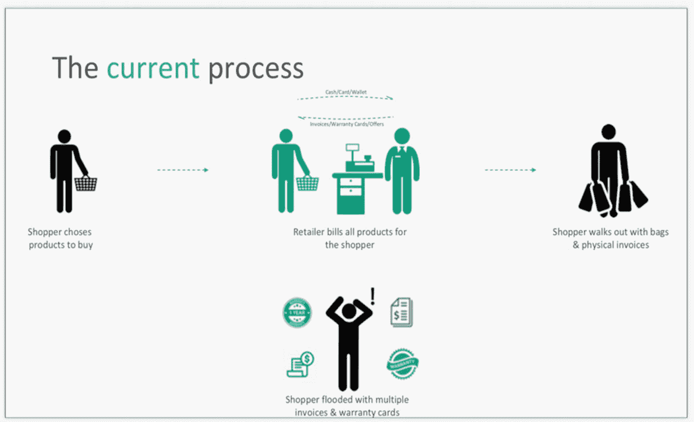
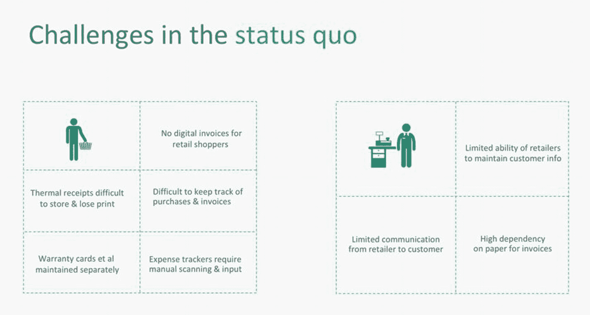
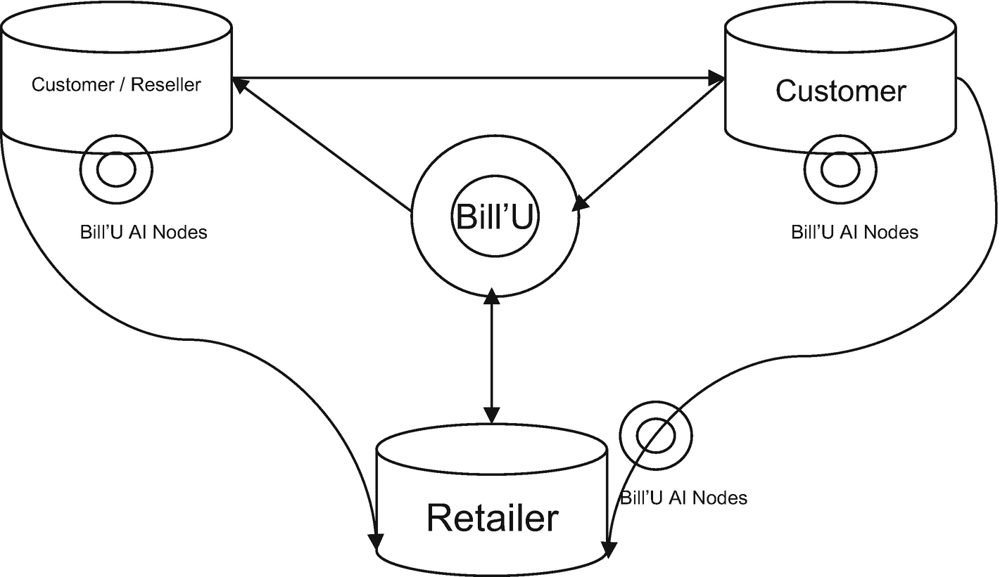
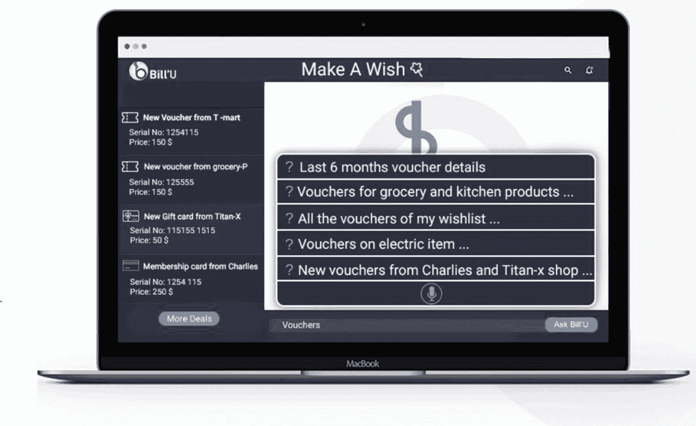
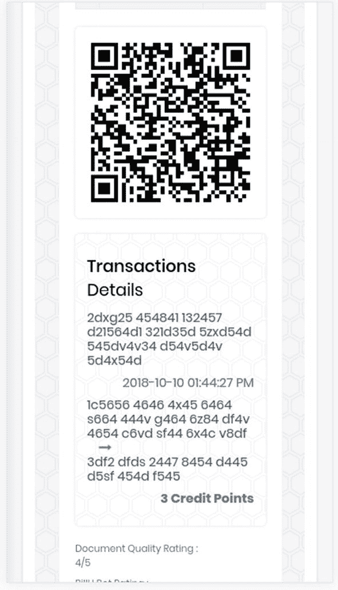
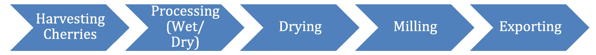
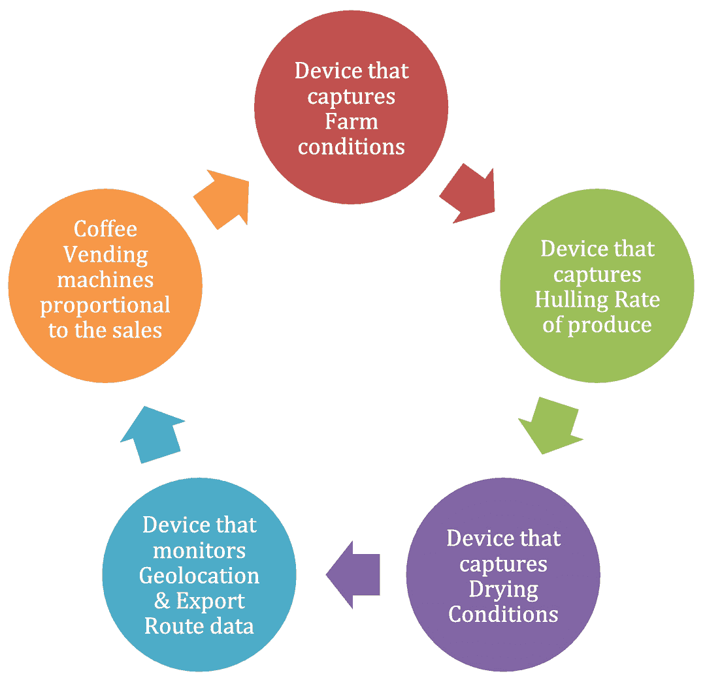

# 9. 应用案例

在本书的阅读过程中，我们深入探讨了区块链的各个方面，并借助应用案例来聚焦这些方面。在本章中，我们将拔高视角，审视那些在不同行业中出于不同目的而执行的应用案例所展现出的广阔可能性。在跟随我们踏上这段应用案例之旅，并体验构建与执行部分案例的过程中，读者需要回过头参考最初的章节，以关联区块链的要素，并映射出合适的工具、架构、共识机制等。如果某个特定应用案例使用了某个特定技术栈，我们始终可以用更优的协议和架构来挑战它，以期获得更高的吞吐量和性能。

随着我们提升自身技能，增强创建、实施和管理基于区块链的应用的能力与理解，我们需要环顾四周，了解当前正在实施的应用案例。洞察这些活跃的应用案例，将让我们详细理解区块链可以应用于哪些场景。与此同时，我们还将考察一些为不同行业开发的活跃应用案例，以及微软 Azure 区块链如何从交通运输到贸易等领域改变着世界。

虽然前面对本章的描述可能看起来令人生畏，像是繁重的工作，让你想喝杯咖啡来提神醒脑、补充精力，但当你得知现在连咖啡和区块链都能扯上关系时，想必会觉得有趣。这源于微软 Azure 与世界领先的咖啡连锁店之一星巴克的合作，以及他们的努力如何为整个第三代咖啡爱好者群体带来了更高的透明度和体验感。

为了更好地理解这个例子，并欣赏更多如此迷人的实例，让我们通过以下示例来探索区块链如何让世界变得更美好：

- 去中心化客户互动
- 去中心化贸易金融
- 文件签署与记录管理
- 分布式实体，如内容

## 去中心化客户互动

吸引和维系客户，并为他们提供最佳的客户体验，是任何业务（无论是街角小店还是沃尔玛这样的巨型商超）的关键关注领域之一。自从商人沿着丝绸之路将商品从中国卖到中东以来，这个等式就一直存在，但客户体验的机制和吸引力却随着经济、市场状况和客户成熟度而不断变化。我们将深入探讨两个应用案例，以理解区块链是如何帮助这些公司在客户体验方面脱颖而出的。

## Bill’U：您的个人 ERP

`Bill’U` 是一个总部位于新加坡的企业级区块链平台，专注于零售客户的体验，通过将购物收据和保修卡数字化来提升他们的购物体验。

`Bill’U`，又名 [TechMyBill.​com](http://techmybill.com)，提供了一个去中心化的点对点账单共享平台。它是一本账单文件的费用分类账，例如账单、优惠券、代金券、保修单、用户手册等——这是一个一站式解决方案，用于安全管理所有账单文件。它允许用户在分类账上创建、扫描、共享和存储文件。这个尖端平台有两条开发路线：特定研究路线和特定应用路线。

区块链研究使该平台为零售商、客户和所有利益相关者提供了一个高度安全的环境，以便安全管理他们所有的账单文件。与传统的邮件或在线服务（这些服务会中介用户数据）不同，`Bill’U` 引入了端到端加密，并为所有相关利益方提供用户数据的完全所有权。平台的这一部分在功能上并不直接与用户交互。然而，数据是核心资产，因此这种私有和公有区块链的组合网在数据安全性和数据敏感性方面极其关键。我们将在下面的应用案例中详细阐述其结构。

`Bill’U` 的应用端嵌入了人工智能，使数字更易于人类阅读和使用。想象一下，那些总是用不掉的即将过期的优惠券的提醒，或者为了覆盖任何损坏而进行的保修续期提醒。分类账上的所有账单文件都可以通过“ASK Bill’U”功能进行智能搜索。用户可以询问关于杂货费用、月度旅行开支或任何关于已上传费用的问题。

区块链分类账与 AI 驱动的应用使 `Bill’U` 成为所有账单文件的下一个代平台。

每个节点（通过边缘设备——手机、桌面电脑或云账户）上传账单/扫描数字二维码账单，这些账单在本地保存为第一参考。AI 被本地嵌入在每个节点内。每个这样的节点都参与区块链生态系统。被授权匿名共享的数据会流入公有区块链；而当消费者从零售商处购买商品时，特定的机密信息会被加密，并通过专属于合法利益相关方的私有链进行共享。

图 9-1 展示了其工作原理。

图 9-1：零售客户当前的离线开票流程

你在购物时一定经历过类似的过程，除了购物袋和当天的美好回忆，你最终还会得到一大堆没用、难以管理的收据。这种传统设置的主要劣势如图 9-2 所示。

图 9-2：强调零售客户和零售商在中心化平台和离线流程中面临的挑战

正如我们所见，传统方法存在多重挑战，涉及存储、追踪、信息捕获和费用管理等方面，这只是对零售商和购物者而言的部分问题。为了克服这些挑战，`Bill’U` 使用了一个基于人工智能和区块链的平台，以确保服务的便捷性和客户数据的机密性。

客户数据机密性是该产品的主要独特卖点之一，因为所有同类替代方案都要求客户提供个人信息，如姓名、手机号码和地址，然后零售商使用甚至过度使用这些信息，并且没有关于数据机密性及其进一步共享的条款。

在这种场景下，客户最终会被垃圾信息骚扰，而信息本身并未发挥其预期作用。因此，`Bill’U` 基于公共与私有区块链的结合，使零售商能够理解客户数据，并为他们提供洞察和相关数据，同时全程掩盖用户的个人数据。由于个人数据被隐藏，而其他相关数据在公共链上可用，零售商可以为客户定制优惠，并利用洞察为客户谋利，同时保护客户的个人信息——这些信息被单独存储在混合区块链的私有链上。由此，既保护了客户数据，又为他们带来“哇”的零售体验，帮助他们在购物后处理好所有相关细节。

技术架构如图 9-3 所示。

图 9-3：基于用户间交易的链式表示。每个节点中的用户都拥有自己的 AI 模块，以避免共享私人数据

每个用户代表一个对等节点，而`Bill’U`则在私有链中两个利益相关者之间的账单交易中扮演验证节点的角色。在公共链中，所有对等节点可以从分布在各节点间的匿名数据中推导出趋势、消费人群画像和优惠券信息。`Bill’U`节点的 AI 处理对用户而言是本地的，这维护了`Bill’U`上最机密文档的隐私。这种数据安全的核心特性在大多数 AI 应用中极为罕见，因为后者通常在服务器而非设备上进行计算。

与其他 AI 服务相比，这里原始数据的安全性得到了保障。来自节点的学习结果保存在公共账本上，不会暴露用户的原始数据，从而通过`Ask Bill’U`服务为所有利益相关者提供推荐购买趋势和其他建议，使大家受益。

由于 AI 服务对用户而言是本地的，`Bill’U`服务以客户为中心。例如，当你使用`Ask Bill’U`时，它通过在你自己的节点上学习你的数据，并在设备本身进行分析来回答你的问题。而`Alexa`或`Siri`则会带着你所有的数据访问其他服务器，在公司服务器上进行分析，然后返回可能带有偏见或不带偏见的结果。

`Bill’U`会提醒用户保修期到期，并提示使用购物者专属的优惠券和生日优惠。同时，它允许零售商在无需任何电子邮件或电话号码依赖的情况下，以无线方式共享账单。

`Ask Bill’U`或`Make a Wish`部分的查询机制，如图 9-4 所示，对用户而言也是本地的。然而，这种私人服务依赖于 AI 模块的全局学习能力来理解用户的自然语言。因此，当通过区块链账本提供服务时，查询会首先在节点本地尝试搜索，然后遍历私人账本——该账本在客户、客户购物所在的零售商、`Bill’U`全局学习中心之间内部共享，最后在必要时才访问公共账本。这使得回答能以完全公平的方式涵盖用户的所有方面。

图 9-4：`Bill’U`的 AI 功能，名为`Make a Wish`或`Ask Bill’U`，用于回答用户关于其账单的查询

对这个 AI 能力的详细审视，是为了理解区块链在此平台上的作用。当在提供 AI 服务时如此小心地避免泄露任何机密数据，数据传输过程就需要谨慎选择技术。因此，我们利用区块链平台的加密、去中心化和透明性，在仅限区块链用户使用的公共区块链上传输匿名数据，并在私有链上发送买卖双方之间的个人交易数据。任何链外的用户都必须加入账本才能访问公共数据，而如果用户想访问私有区块链，则需要获得链上利益相关者的共识。此外，很多时候当机密数据局限于边缘设备时，会因物理损坏、文件损坏等原因面临数据丢失的风险。`Bill’U`提供了一种私有区块链选项，允许用户将节点备份并复制到另一台设备或虚拟机上，从而使其具备容错能力、安全性，并能通过云端访问，同时在私有区块链上实现分布式安全，而参与节点就是从不同设备访问它的唯一用户。

`Bill’U`区块链特性：

图 9-5：区块链上的数字化账单

- 资产文档的数字保险箱
- 购买文档的数字储物柜
- 安全、加密、有备份的个人 ERP 系统
- 结合全局与本地学习模型的去中心化 AI
- 针对保修到期、转售条款等事项的智能合约提醒
- 支持转售、保修等智能合约的通用账单格式
- 无需暴露电子邮件、ID 或电话号码的无线账单共享平台（参考图 9-5，基于二维码的账单）

由于该平台是 B2B2C 模式，区块链架构将是公共与私有许可账本组成的混合网络。`Bill’U`的创世节点将以不同去中心化网络的形式连接到所有其他零售商。`Bill’U`将连接到各类供应商，他们可以扫描账单并上传到平台，这将数字化从杂货店、大型百货商店、诊所、出租车司机，甚至小商品店、医院、餐馆和电影票收集来的所有类型收据。

由于这是一个私有许可区块链，每项资产都将存储在区块链上。一旦新区块在账本上更新，任何人都无法更改账本上的区块。区块链上的每笔交易都将是不可篡改的。

最终用户会收到一个由私钥生成的唯一哈希标识符，并且只有启用的公共数据部分才能使用公钥查看。利用这个唯一标识符和私钥，最终用户可以访问其最近的支出，并在此基础上获得分析结果和推荐。然而，这些个人数据通过唯一的哈希 ID 保持匿名。

这种具有共同创世节点（即`Bill’U`节点）的链间网格，类似于多种可能的跨链架构。其中一种架构由南洋理工大学的`COMMENDO`形成，这是一个轻量级区块链，构成了数据和数据处理的基础链。

作为一个 B2B2C 平台，这种混合链的广泛需求要求高速数据交易以及存储方面的可扩展性。

为了实现各个私有链之间的多个异步交易以及公共数据流向公共区块链，区块链运行在`Apache Cassandra`（一种分布式数据库系统）之上。这确保了高可用性和高读写吞吐量。`Bill’U`的区块链利用南洋理工大学的`COMMENDO`区块链，通过分布式异步工作队列实现匿名交易。

类似地，可以考察一下 Azure 的`CosmosDB`，它可能是一个去中心化分布式数据库的备选方案。

`Azure CosmosDB`被定义为微软在全球范围内分布式、完全去中心化、多主数据库服务，适用于关键任务型应用程序。它提供开箱即用的全球分布，具备多主复制、吞吐量和存储的弹性全球扩展，以及个位数毫秒级的写入和读取。

这是现有区块链在分布式大规模存储方面的一个主要需求。

要在一个企业级生态系统中考虑这样的平台，关键在于在一个无需信任且经过许可的网络上识别出高度可扩展的数据库。设想`Bill’U`被跨企业业务使用，用于存储公司账单、采购订单等。`Bill’U`可以跟踪对账单、采购文件和合同所做的任何更改。链间活动形成了一组业务节点网格，共同构成一个联盟网络。

联盟在区块链上构建共享应用，以监控这些资产在跨组织信任边界移动时的动向，并通过许可智能合约中的“链上”逻辑来管控状态变更。用例涵盖了从内部账单申请到跟踪外部采购订单和合同等一系列以资产和工作流为核心的场景。

借助这样一个端到端的安全区块链联盟，优惠券、代金券、索赔、转售、客户参与度和客户满意度等优势得以完美体现，且不会危及个人数据。

虽然我们在此处看到了一个由多种新兴技术软件组合构建的非常特定的应用，但让我们来看一个更接近传统实体业务的例子，它成功运用了区块链技术来提供无与伦比的客户体验。

# 微软 Azure 与星巴克

技术与生活始终相辅相成。技术专家设想用技术改善生活，而生活或生命体则塑造着技术。这种共生关系促成了两家公司——微软 Azure 和星巴克——的融合，它们将各自的经验结合起来，用技术改善人类生活。

星巴克一直在与微软 Azure 合作，尝试区块链、人工智能和物联网等尖端技术，以加速生产力、效率和透明度，并为客户提供定制化、高度个性化的体验。

微软首席执行官萨提亚·纳德拉在 2019 年微软 Build 大会上介绍了星巴克如何使用新兴技术来提供其独特的客户体验。为了为到访星巴克的顾客提供更个性化的体验，这家咖啡连锁店正在使用强化学习技术，该技术能基于外部反馈在不可预测的环境中学习做出决策。

客户通过基于强化学习的平台（在微软 Azure 上开发和托管）接收定制的点单推荐。该平台通过根据本地门店库存、热门选择、天气和时间、社区偏好以及历史订单来推荐商品，从而帮助顾客。

如果需求与供应形成一个闭环，那么生产者在了解客户需求后，其盈利能力必然会提高。一位远离顾客的可可农民能够了解种植规模、可可类型以及需求的季节性。然而在现实中，这种信息传播尚未完全实现。借助`Azure Blockchain Services`，愿景是将从农民到消费者的所有利益相关者纳入一个闭环。

相反，该技术可以帮助在以前未尝试过的领域刺激需求。例如，如果已知一群消费者喜欢浓烈的哥伦比亚咖啡，区块链公共数据的推荐引擎可能会向这些用户极力推荐浓烈的牙买加咖啡，以帮助刺激对这种优质牙买加农场咖啡的需求。这种强化学习算法降低了在链上向消费者推荐可能不喜欢的咖啡的概率，从而在为农民提供市场拓展以及为消费者提供体验方面实现了双赢，因为两者分别在销售和体验方面得到了支持。

这里的主要焦点是为咖啡农带来更大的金融可能性，并允许顾客将他们的咖啡追溯到源头，使其成为一种体验。这被认为是`Ethereum`的一个理想用例，因为它具有透明的多个独立节点来验证交易。每个相关方都可以通过`Etherscan`自由追踪在`Ethereum`上进行的每一笔交易。

> **注意**  
> `Etherscan`是用于以太坊区块链的区块浏览器。区块浏览器基本上是一个搜索引擎，允许用户轻松查找、确认和验证在以太坊区块链上发生的交易。

星巴克希望提升消费者体验，让他们了解咖啡的来源并直接理解其根源。同时，这一过程也为农民增加了市场曝光度。

据微软发布的一份公告称，为此，这家咖啡连锁店正与微软合作，利用其`Azure Blockchain Service`来追踪来自世界各地的咖啡运输，并为其供应链带来“数字化的、实时的可追溯性”。

通过这一合作，微软的区块链服务将在共享账本上记录咖啡运输过程中的所有变更，为参与者提供供应链的“更完整视图”。

微软表示，该应用程序还将告知消费者星巴克是如何支持这些种植者的。

这一用例涵盖了区块链所提供的**透明度**这一非常重要的特性（图 9-6）。

**图 9-6**

咖啡供应链从农场到杯子的各个阶段

**注意**

让我们深入分析流程可能如何分解。读者应尝试将该用例与本书学到的技术联系起来。请记住：我们不是在阅读事实并遵循它们，而是从用例中推断以开发我们的解决方案。鉴于当前技术所处的阶段，我们始终可以用新的方法和架构提出挑战。因此，让我们以类似的方式分解它，并从理解用例中推断实现的可能性。

使用区块链的另一个重要方面是其带来的自动化效率和生产力。大多数情况下，在大型企业和公司中，数据的有效信息流到达高层管理手中进行有效决策的时间非常晚。即使在规模最大的公司中，预测方法也尚未形成，数字化主要以结构化形式存在。因此，区块链凭借其不可变（仅追加）的存储方式以及所有相关流程中的透明度，实现了具有可信度的数字化。从而使高层管理能够根据不同时间线的数据/信息状态，做出数据驱动的决策。

例如，考虑一家使用脱壳机械进行咖啡加工的工厂。其中一台脱壳机发生了一起小事故。这个问题在一天内未被报告。第二天，主管意识到由于机械故障，供应量将减少 1/10。报告在十天后才送达管理层。信息在第十五天流向下设在另一个国家的销售部门。最终客户未能收到订单，从而取消订单或收取滞纳金。

这显示了数据透明度和缺乏监控的生产力所带来的影响。现在，对于像星巴克这样在全球拥有超过 30,000 家门店、每周服务 1 亿客户的公司而言，无论季节变化、灾难、生产力损失等如何，保持盈利至关重要。同时，他们也不希望减少为最终客户提供的任何体验设施。

星巴克已集成`Azure Sphere`——微软端到端的高安全连接设备解决方案——以实现以下功能：

*   **基于硬件的信任根**：设备必须具有唯一的、不可伪造的、与硬件不可分割的身份。
*   **小型可信计算基**：设备的大部分软件应位于一个小的可信计算基之外，减少私钥等安全资源的攻击面。
*   **纵深防御**：多层防御意味着即使某一层安全被攻破，设备仍受保护。
*   **隔离**：软件组件之间的硬件强制隔离，防止一个组件的漏洞传播到其他组件。
*   **基于证书的身份验证**：设备使用签名证书来证明设备身份和真实性。
*   **可更新的安全性**：自动安装更新的软件，并始终将进入风险状态的设备恢复为安全状态。
*   **故障报告**：所有设备故障（可能是攻击证据）均报告给制造商。

想象一下，从农场到杯子的每个阶段都嵌入了此类`Azure Sphere`的`MCU`设备。这将以安全的方式密切监控供应链，在加密的设备/节点网络中防止黑客攻击。同时，它将向相关利益方提供透明度和故障报告，以提高可预测性并相应管理成本（图 9-7）。

**图 9-7**

作为 IoT 边缘设备向区块链更新数据的节点示意图

在咖啡制造的每个阶段，这些智能边缘设备上本地运行的预测模型与为消费者运行推荐引擎相结合，形成了一个完整的闭环供应链，从而提升了所有参与者的体验。将所有这一切连接到区块链上，使得可追溯性和可访问性对公司的管理层高度透明，以便他们能够做出有利于大多数利益相关者的主动决策。去中心化在这里承诺减少损失，并展望通过其提供透明度和可访问性的方式，为农民、客户和企业主等开辟新的途径。

上个月，印度商务部推出了一个基于区块链的咖啡电子市场应用，在印度境内进行透明的咖啡贸易。该应用被认为将为寻求正宗印度咖啡的消费者以及为所产咖啡获得公平报酬的种植者带来积极的转变。

类似地，目前多个经济体正准备通过结合人工智能、物联网和区块链来提高其供应链效率，使其实现端到端的数字化、有形化和可验证。

## 其他行业

在不同行业中，还有几个值得注意的与客户体验相关的用例：

*   乳制品行业，对于温度控制、产品保质期、运输和储存条件等方面的透明度至关重要。
*   健康行业，在过去，饮食方案已成为社交媒体上的一种狂热潮流。我们许多人尝试开始并尝试各种方案，但对自己的身体和饮食的历史证据并不完全了解。我们所有的一切就是几项网络搜索和博客告诉我们该怎么做。咨询营养师当然是一个可靠的来源，因为专业人士投入时间来了解你的饮食习惯、地域差异、文化影响和病史，这肯定会有帮助。
    1.  在这里，技术可以协助获得此类专业人士的服务。
    2.  通过身体监测仪在链上验证结果数据。
    3.  在区块链上更新体重参数并追踪不同饮食方案效果的物联网设备。

然而，一开始有多少人愿意在网上分享我们的体重？如何通过技术以特定方式保护个人隐私来帮助我们？这就是使用区块链而不是中心化互联网平台的区别。在去中心化的区块链中，分配给利益相关者的权限以这样一种方式监管链的活动，即任何活动都可能需要整个链的共识。在由单一方托管的互联网平台上，该方可能拥有滥用你的数据并获利的全部权力。

因此，对于此类用例，结合将人们与经过认证的营养师连接起来的物联网，维护匿名共享的区块链数据以追踪用户的成功率，并激励客户而非公司本身，区块链可能是合适的选择。

## 去中心化贸易金融

区块链最常见且首要的应用场景之一，源于传统贸易金融运作中面临的挑战；一个更直接的例子是国际贸易金融，其中银行、银行法规和国际贸易法的变更所催生的流程，导致交易结算需要数天时间。

此类场景中的另一个挑战是，在支付转账以及作为交换所提供的商品/服务方面缺乏透明度，并且交易完全依赖银行（在大多数情况下，交易对手方的银行可能甚至不在你的国家运营，无法提供协助）。

其他反复被提及的痛点如下：

-   创建、验证和审计贸易数据及文档的易错人工流程
-   难以验证的孤立数据，导致信息多版本共存以及重大的欺诈、合规和审计风险
-   互不关联的遗留系统限制了新的商业机会，并使中小企业难以获得融资渠道

因此，既然我们在上一节研究了利用区块链技术优化供应链流程对客户体验的影响，那么在本节中，让我们深入探讨那些影响生活、贸易和我们财务状况的贸易金融流程。

### 微软 Azure 与银行

`微软新闻`提到，全球超过 80%的大型银行是`Azure`的客户。

为了帮助解决“去中心化贸易金融”部分提到的痛点，区块链被引入并进行试验，现在终于开始进入主流应用。像`美银美林`（现称为`BofA Securities`）这样的主要参与者正率先采用`Azure`区块链，旨在创建一个更加透明的贸易金融生态系统，而且早在 2016 年就开始了，这充分说明了行业对区块链潜力的信心。像`汇丰银行`和`荷兰国际集团银行`这样的银行也纷纷效仿，如今这一现象在所有金融机构中正变得流行起来。

为了更好地理解贸易金融和区块链的整合，让我们深入探究`美银美林`的案例。

`微软`和`美银美林`早在 2016 年就宣布合作，利用区块链技术推动贸易金融交易的转型。

作为此次合作的一部分，两家公司决定构建和测试技术、创建框架，并为基于区块链的企业与其客户及银行之间的交易建立最佳实践。`微软财务`专家担任顾问和初始测试客户，建立了大型企业财务与金融机构之间首个由`Microsoft Azure`驱动的区块链交易。

众所周知，数字化开始的时候，出现了许多`ERP`系统。有了这类软件，银行开始增加向这些系统的数据录入，这使得支持此类任务的人员效率极低，而数据的可信度完全掌握在数据录入人员手中。不仅是在银行，贸易金融的所有环节——进口商、出口商、银行、海关人员以及其他利益相关者——都必须填写各种纸质和数字表格。这非常依赖于人工操作，耗费时间，且常常出错。这些系统过去通常以纯文本形式存储此类数据，因为当时大多数系统处于该技术的早期阶段，主要专注于简单地聚合数据。然而，缺乏防篡改的数据存储方法。

借助区块链，流程可以实现数字化和自动化，缩短交易结算时间，并将业务逻辑应用于相关数据，为企业和金融机构带来一系列潜在优势，包括更可预测的营运资金、降低交易对手风险、提高运营效率和增强审计透明度等，这一切都在一个匿名的闭环交易网络中实现。

由此，区块链为简化贸易金融打开了大门，使参与者能够轻松交换数据并实时追踪资产。`微软`正在利用`Corda`，这是一个企业级账本，使银行能够限制谁能查看哪些信息，并仅与相关方选择性共享数据。该解决方案涉及将区块链技术与`Azure`和`API`配对使用，未来还可用于集成`AI`、机器学习、`IoT`等技术。

在将区块链应用于信用证处理流程后，签发`SBLC`的周转时间从之前的 3 到 5 周缩短到了 3 到 5 天！同样地，在自动化智能合约上的条件后，海外交易的结算时间也大幅缩短。一旦条件满足，交易即可立即结算。

通过区块链封装挑战，并利用验证器节点积极验证交易，结算变得更加清晰和迅速。然而，在没有区块链的情况下，清关数据的传输请求依赖于非标准化流程、分散的系统等等。

`微软`进一步与`摩根大通银行`合作，利用`Quorum 区块链`推广`Azure 上的区块链服务`。它允许通过在`Azure`上进行几次点击来完成设置，集成了`Active Directory`、事件注册表和`Visual Studio`来编写合约等。它应用了`Quorum 区块链`定义的所有联盟策略。

“在快速全球化的数字世界中，业务流程涉及多个组织，大量的资金花费在管理跨越信任边界的流程上。随着数字化转型扩展到单个公司的围墙之外，并进入与供应商、合作伙伴和客户共享的流程，信任的重要性也随之增长。微软的目标是通过提供开放、可扩展的平台和服务，帮助公司在安全多方计算的新时代蓬勃发展，从游戏发行商、谷物加工商到支付 ISV 和全球托运人，任何公司都可以使用这些平台和服务，对与他人共享的流程进行数字化转型，”`Microsoft Azure`首席技术官`Mark Russinovich`解释说。

## 其他金融行业

其他可以从区块链部署流程中受益的应用包括：

-   去中心化的`KYC`（了解你的客户）和信用数据验证
-   降低欺诈风险和合规成本
-   融资和贸易活动追踪的新途径

作为读者，我们必须思考这些应用如何分解到实际实施中。正如我们在上一章所见，信用证的架构涉及海外贸易活动。

类似地，针对这些应用场景，让我们推测合适的工具、共识机制和结果。