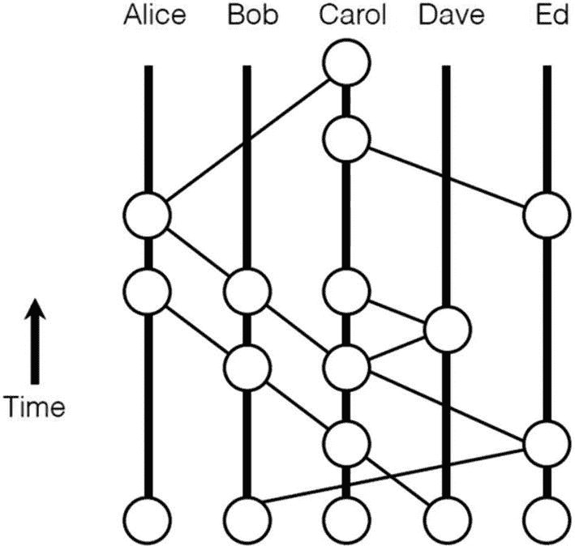

# 海事交易市场

接下来探讨另一个用例，技术性稍强一些，因为我们将解释基础设施的搭建和序列流程。让我们来讨论一个面向海事行业的交易市场案例。

与其他彻底改变了我们的购物习惯、消费行为以及花钱模式的在线交易市场一样，海事交易市场也见证了变革，不过这种变革是在该生态系统的特定背景和约束条件下发生的。

与所有利益相关者都参与公有账本上每一笔交易或验证的传统区块链不同，混合了私有账本和公有账本的链更适合运行海事交易市场。在这样的平台上，可以购买海外商品，例如机械、金属、化学品、集装箱船、石油和天然气、维修零件等。

去中心化账本技术维护着交易证明，并在链上追溯商业和贸易的可信度。遵守链上最佳贸易实践，能通过按时交付、及时履约和规范的采购流程获得高信用评级。利益相关者或许能从参与此类生态系统贸易融资的银行获得信用担保。

该架构的设计方式是：账本的所有客户/用户都位于公有链上（仅对公司及其经批准的利害相关者公开），以获取一般的挂牌信息。相关利益相关者之间的交易则在私有链中进行。

公有账本的共识机制基于拜占庭容错（BFT），而私有账本则采用委托权益证明，其中发起者/区块生产者通过委托拥有较高的权益，并可以与交易的其他利益相关者分享足够的权益来执行商业合约。

合约状态存储在私有账本上，交易指令则通过 DAG（有向无环图）完成。这确保了交易速度极快，且存储仅在相关利益相关者之间安全地去中心化。

组织可以即时查看整个混合链上所有交易的图谱视图（图 9-8），从而能够委托权益，为相关利益相关者授予各种访问控制权限。

图 9-8

链上交易：侧链

通过区块链开发此类交易市场的步骤如下表所示。（请记住：作为技术专家和区块链的早期采用者，试点成本必须尽可能低，因为所有利益相关者都存在即兴改进、教育和参与的成本）

| 流程 | 区块链特性 |
| --- | --- |
| 基础搭建 | • 混合链——基于角色• 基于`Azure`的环境实现快速部署• 公有链使用`BFT`，私有链使用`PoS` |
| 可用性检查 | • 账本与`POS`集成• 去中心化数据摄取• 验证者与副本检查• 分布式可用性检查器• 基于可用性和适用性实时创建私有链 |
| 订单流程 | • 智能合约生成• 基于合约状态的交易条件• 合约状态的事件注册• 智能合约触发事件• 针对智能合约利益相关者的系统警报 |
| 交付流程 | • 通过上传文档完成工作量证明• 确认验证者• 自动通知警报• 由`BFT`执行的`MOSCORD`自动检查器• 不可变账本上的`PO`证明 |
| 发票流程 | • 平台发票生成器与智能合约集成• 术语翻译与操作• 在私有账本上维护副本• 维护验证者 |
| 支付流程 | • `ETH`（以太坊原生币）交易/`Hyperledger`原生币价值设定• 私有链上的实时金融交易 |

这样一个去中心化平台可以支持一个去中心化的交易市场，其策略由验证利益相关者的共识来管理。将利益相关者引入平台的流程包括添加供应商聚合商及其产品供应。该平台将支持直接的点对点交易，也允许基于网络的交易，网络在其中调控和验证智能合约。这将有力地控制欺诈活动并减少违约。为了设计最小的试点项目，应考虑包含一个买方和两个供应商的私有链，以及参与交易的一组监管节点。此处，数据块将用于采购对交付至关重要的机械零件、电动工具和安全物品。链上的交易将由智能合约发起。如果所有链上活动都满足了智能合约的条件，它将快速促成支付。如果供应交付不正确，智能合约的条件将不会被触发，并且需要执行智能合约的替代条款。作为智能合约的开发者，必须确保所有情况都被覆盖。作为解决方案架构师，我们必须确保平台没有任何漏洞，而作为业务开发者，定义此类用例最为关键。

这类智能合约的履约或违约模式生成了利益相关者的信用风险评估，从而通过预测方法实现公平评估，这有助于银行提供正确的信用证和银行担保。这有助于减少贸易损失和欺诈活动。

