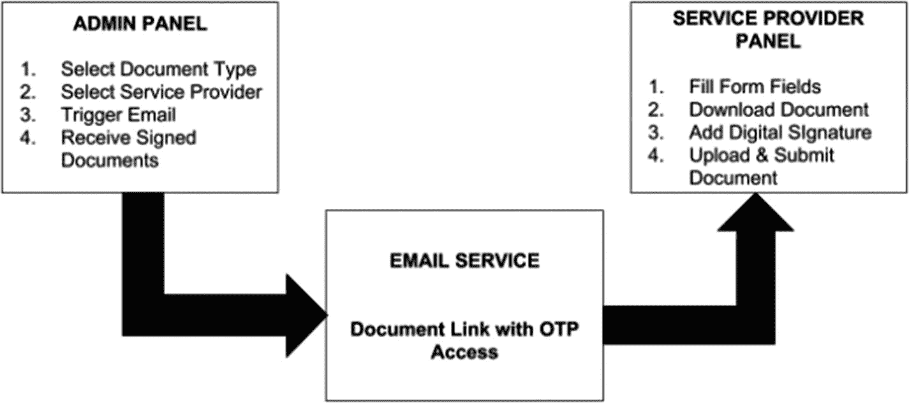
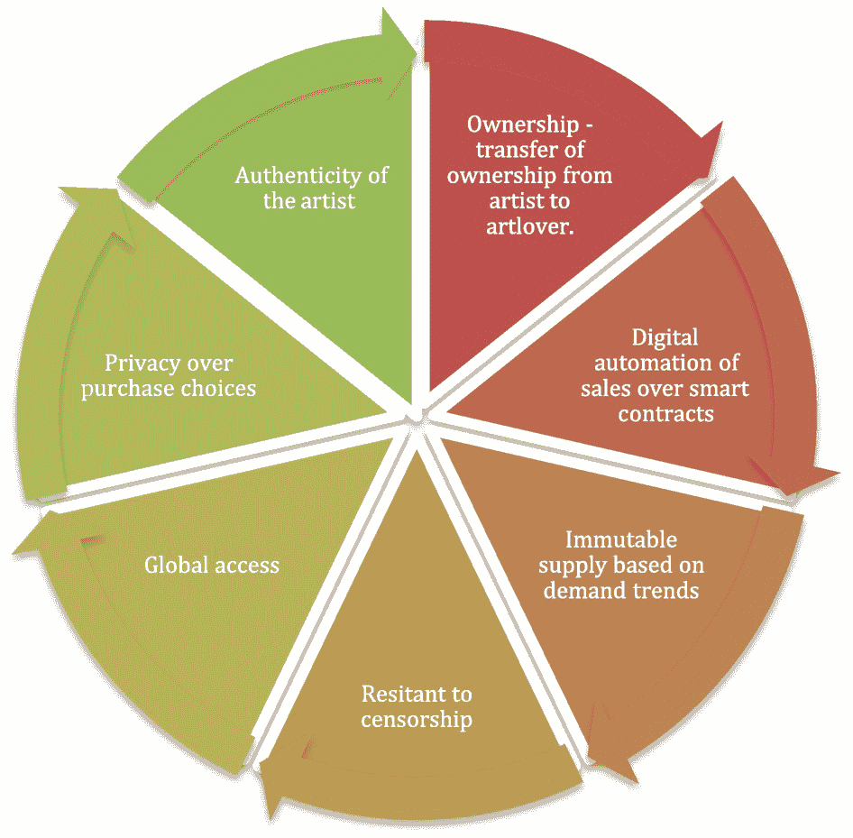

# 文档签署与记录管理

你还记得上次去银行是什么时候吗？随着数字化的发展，银行网点的客流量已大幅减少。从最初只有柜员的时代，到自动柜员机（ATM）出现后柜员被取代或重新分配，再到如今以应用和网站形式存在于我们口袋中的数字银行，银行业已经走过了漫长的道路。无论交易金额大小，任何交易都能以同样的速度完成，并且完全不需要纸质文件。

除了技术因素之外，实现这一点的核心原因之一是，人们相信点击一下按钮就能管理自己的资金，其信任程度不亚于过去对一张纸质文件的信赖。正是这种信任——以及数字化带来的诸多好处——在短短几年内，驱使着全世界数百万人，从印度街头的小贩到美国数十亿美元规模的基金经理，将银行业务转移到线上。

## 引言：从信任与数字化看区块链的应用

以信任和数字化为前提，让我们来看看区块链的另一个应用场景，这次是在文档签署和记录管理领域。

## 现有流程的挑战与风险

我们都熟悉一些全球性流程，比如 KYC（通常称为“了解你的客户”），或者入职流程，前者要求我们提供身份证明，后者则需要提供学历证书证明。在所有这些流程中，我们都需要提交数字文档——在某些情况下，即使是现在，有时也需要提交纸质文档。虽然可以理解，即使部署了基于人工智能的解析器，有些案例可能仍然需要花费大量时间，但文档验证的过程仍然相当手动且耗时，而这甚至还不是主要问题。

使用文档来验证一个人的身份或大学学位之类的东西，其主要问题在于，这些信息具有高度个人隐私性，并且容易在发生安全漏洞时被滥用。最近剑桥分析公司的案例向世界揭示了数据可以被利用到何种程度，以及它可能产生的影响。因此，务必需要一个能将信任、透明度和安全性放在首位的解决方案。

## 区块链在文档管理中的解决方案

认识到这些因素后，政府、银行、法律事务所、法院，甚至文档存储公司，现在都在构建概念验证项目，允许在共享账本上进行有限制的访问、共享以及文档验证的认证。

一个传统的、集中托管的平台通常要求其利益相关者或第三方参与方简单地遵守平台规则，而不提供任何承诺或手段来维护数据安全。例如，在上传身份证明的扫描件时，人们被要求对实体签名进行公证，然后上传扫描件，即使到今天，这也还是通过手动方式验证的。

让我们考虑一个案例，服务提供商被要求签署发票以生成服务账单（图 9-9）。

图 9-9 一个常规托管的服务平台

在这样的系统中，没有尝试达成共识，也没有为此类选项提供平台。这是一个直截了当、功能单一的平台。同样，在教育领域，我们的学位证书由教育委员会的中央机构签署。

在背景调查中，成本最高的流程之一就是追溯信息来源的真实性，并在其记录中实体核查其存在。现在，当数据被汇总到一个由真实和信任构成的单一区块链网络中时——所有节点，包括源节点和最终目标节点，都存在于该网络中——以加密格式传输的数据块确保了数据请求是可被见证的，并且从一开始就防止了欺诈性请求的发生。简单来说，考虑一个真实的应用场景：所有教育证书（数据块）都存放在共享账本上，其中大学是源节点，而需要验证的公司是最终目标节点。学生/员工节点在链上发起验证请求，并在共享账本上得到验证。在这样的系统中，学生永远无法伪造证书，因为源节点的见证是在链上的。

在文档上使用数字签名的另一个重要方面是，它会以节点地址的形式留下机器指纹。因此，这种数字痕迹无法被伪造，也很难制造出赝品。

在制定链共识的智能合约中，文档的数字签名就是在接受智能合约条件时捕获的机器地址。然而，并非所有的数字签名都纯粹由机器地址生成。很多时候，它是一个数学公式，包含了节点的哈希地址以及私钥。

对于账本上的文档有了这样有效的数字签名，就无法撤回已签署的区块，从而嵌入了对签名真实来源的信任（真实性），并确保数据传输不被篡改。

## 一个应用实例：艺术区块链

为了理解数字签名的作用，我们将考虑艺术区块链的一个工业应用案例——这是一个去中心化的账本，用于存储和传输艺术品（区块）从艺术家到艺术买家的状态（参见图 9-10）。

图 9-10 就作为资产的艺术品而言，在区块链上采取的行动

## 区块链在文档管理中的核心优势

在文档管理和签名中使用区块链的明显优势如下：

*   **节约成本** – 这是最显而易见的好处。由于区块链交易不需要中介，流程可以变得更高效、成本更低。无需审计师或法律专业人士来验证信息的真实性，因此这些成本就从流程中被剔除了。
*   **效率** – 参与人员越少意味着周转速度越快。那些可能需要等待多方签署而耗时数天的交易，可以在几秒钟内完成。
*   **安全性** – 交易中的参与者越少，出现问题的风险就越低。交接点是主要的薄弱环节，而区块链可以有效地消除它们。
*   **灵活性** – 任何数字资产都可以使用区块链，包括像多媒体和电子邮件记录这类难以保护的项目。

*来源：铁山公司*

## 后续应用：柯达的转型

在我们了解了区块链技术的适用性范围及其相对于传统方法的优势之后，我们将探讨另一个应用，这项应用由一个组织带给世界，该组织曾是摄影及相关设备和配件领域的巨头，后来通过转向区块链技术领域重新崛起。这里讨论的组织正是柯达。

柯达最近向区块链的转型已公开于世，自柯达宣布将构建一个基于区块链的新文档管理系统以来。该公司开发的这项服务不依赖第三方许可，完全由柯达自主开发并拥有所有权。