# 10. 谜题与练习

本章有助于验证关于区块链的学习曲线，并使你能够设计区块链实施方案。请动手尝试本章中的挑战来提升你的技能。可以参考与问题相关的章节。由于本书的愿景是让技术及非技术背景的读者都能成为区块链生态系统的一部分，因此尝试完成本章内容既是验证手段，也是进一步创新的催化剂。

练习涵盖以下内容：
- 术语
- 共识算法
- 设计挑战
- 区块链还是不是？
- 物联网与区块链
- 智能合约
- 思维导图

请记住：这些练习可能有多个正确答案。此外，由于这是一个创新领域，事实可能会演变成不同的存在形式。然而，去中心化、透明性、加密和不可篡改的基本原则将保持不变。每一次学习迭代中，你都可以从不同角度反思前面的章节。

在整本书中，我们研究了不同行业的各种用例。在开始练习之前，请选择其中一个角色，并从该用户的视角来看待挑战。

例如，如果你作为业务开发人员阅读本书，请关注平台周围的基础设施影响、链上交互的人群类型，以及需要在链下和链上制定的政策。与设计相关的挑战将帮助你识别合适的利益相关者，以促进这样一个去中心化的生态系统。

如果你作为解决方案架构师阅读本书，请梳理出平台内部的变量。分析这些变量的变化。从你的角度关注每个变量的优缺点。为每个用例识别各种技术栈选项及其对于每个用例的成熟度。

如果你作为开发人员阅读本书，请关注现有解决方案与手头问题定义的具体对应性。为了构建更优共识算法和智能合约的能力，练习执行流程图、业务条件的伪代码以及用户故事，并最终形成代码。这种代码语法可能因平台而异，但基本逻辑将保持不变。

根据你为之努力的目标和愿景来尝试这些挑战。如果你在一个由业务开发人员、解决方案架构师和开发人员组成的团队中工作，本书鼓励你们各自独立解决挑战，然后交换笔记，以便从不同角色和角度获得更广泛的理解。

本章末尾提供了答案。

## 正确理解术语与定义

## 填字游戏 1

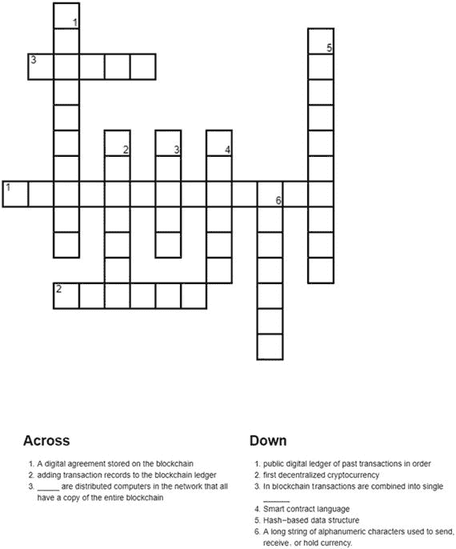

## 填字游戏 2

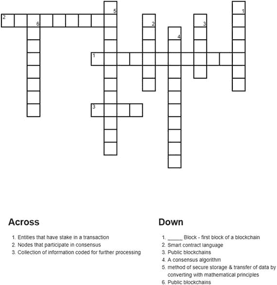

## 填字游戏 3

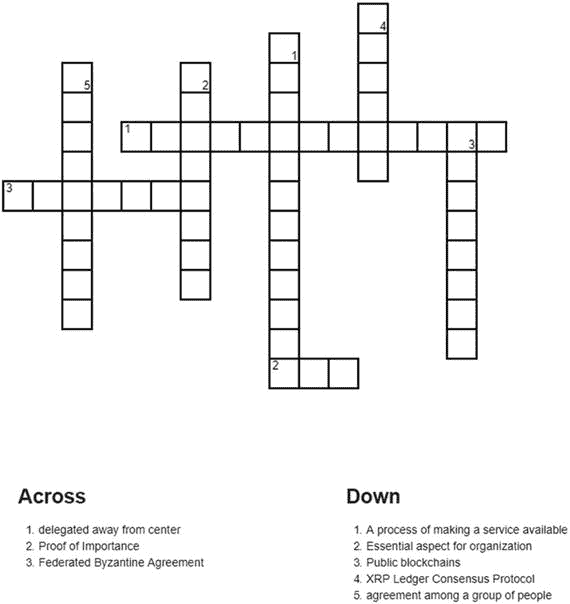

## 填字游戏 4

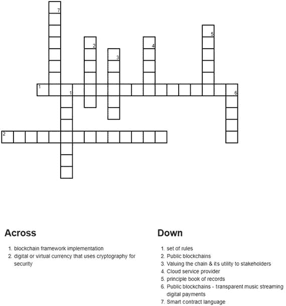

## 选择适合的共识形式

通过画线将共识、区块链和特征这三列匹配起来，连接正确的三元组。

| **共识机制** | **区块链平台** | **特征** |
| --- | --- | --- |
| 1. 工作量证明 | a. NEM | 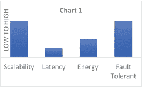 |
| 2. 重要性证明 | b. EOS | 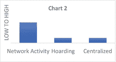 |
| 3. 联邦拜占庭协议 | c. 以太坊 | 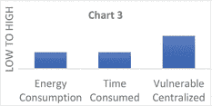 |
| 4. 委托权益证明 | d. Stellar | 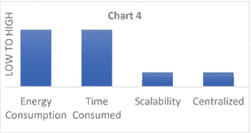 |

## 用例设计挑战

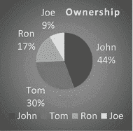

四位朋友按饼图所示的比例出资购买了一英亩农场。他们同意共同在这片土地上经营农场生意。约翰住得离土地很远，因此无法到场工作；他想出租或出售部分土地。汤姆有一份全职工作，会在下班后干活。罗恩住在农场旁边，但不懂耕作。乔完全有时间在农场工作，并且拥有全面的知识和经验。

他们决定所有决策都需要获得所有参与者的共识。因此，你必须为将在链上进行的各项活动设计一个区块链平台。在以下部分，写出每种类型的共识对于此情况的适用性优点和缺点。列出在每种共识类型下可以运作的活动。

### 示例解决方案

### 工作量证明 (Proof of Work)

#### 链上活动 (Activities on-chain)：
- 土地登记与承保
- 土地所有权与分区
- 提交文件后添加用户，并由同行进行验证
- 上传收据（如房产税、电费和水费）时申请联合预算和费用报销
- 当收入根据智能合约超过投资额的 2 倍时，可启动利润分成

#### 优势 (Advantages)：
- 链上的决策为所有活动提供了防篡改的记录，可供新用户预览。
- 所有交易的纸质记录都可在链上找到。

#### 局限性 (Limitations)：
- 在智能合约的所有条款得到满足并获得同行验证之前，John 无法将土地出售给任何随机用户。
- 在农场下班后工作的 Tom，在共识条款履行之前，无法获得利润分成回报。
- Ron 想扩建他的庭院用于举办聚会和婚礼，但在获得全链验证之前无法进行。
- 全职工作的 Joe 希望为农场招聘更多人手，但在获得所有人的验证之前无法进行。

既然我们已经针对这组活动评估了一种共识形式，请列出各项活动及其对所述共识形式的适用性。请记住，作为研究、开发和构建区块链的一部分，您可以自由地根据需求进行设计，并选择最适合具体场景的方案。

### 权益证明 (Proof of Stake)

使用这种共识形式的活动纯粹基于未分区土地的所有权权益。它要求区块提议者通过基于权益权重的投票机制，获得高权益持有者的验证。如果基于其权重的验证者节点形成多数，则区块交易被允许。

例如：

```
如果
W1 x1 + W2 x2 + W3 x3 + W4 x4 + W5 x5 > 60%
那么
- 允许区块交易活动
```

其中，权重与实际权益成正比。

#### 链上活动 (Activities on-chain)：
- •
- •
- •
- •
- •

#### 优势 (Advantages)：
- •
- •
- •
- •
- •

#### 局限性 (Limitations)：
- •
- •
- •
- •
- •

### 委托权益证明 (Delegated Proof of Stake)

该共识算法试图在 PoS 的基础上进一步去中心化，以实现更公平的投票机制。该算法随机委托和重新分配各种活动的权重。这可以由权益所有者预定义、随机选择或每个周期进行委托。

#### 链上活动 (Activities on-chain)：
- •
- •
- •
- •
- •

#### 优势 (Advantages)：
- •
- •
- •
- •
- •

#### 局限性 (Limitations)：
- •
- •
- •
- •
- •

### 有向无环图 (Directed Acyclic Graphs, DAG)

在比特币和以太坊区块链中观察到的传统共识形式中，随着其受欢迎程度和采用率的提高，可扩展性和延迟时间日益成为人们关注的焦点。因此，有向无环图（一种著名的图数据结构）可以提供一种通用共识策略的方法，以无环、低延迟、非挖矿依赖、修剪过的轻量级事务方式维护链上的共享账本。

一些区块链根据链上活动生成不同变体的 DAG。例如，如果在链上有 25 家零售商在不同的领域销售不同的商品，且拥有完全独特的客户资料，那么区块链账本可以是一个 DAG，其中每个零售商的每笔交易条目都独立于其他零售商。这可以看作是运行在独立环境中的侧链活动。然而，数据需要防篡改，并锁定在去中心化链上。

#### 链上活动 (Activities on-chain)：
- •
- •
- •
- •
- •

#### 优势 (Advantages)：
- •
- •
- •
- •
- •

#### 局限性 (Limitations)：
- •
- •
- •
- •
- •

### 联邦拜占庭协议 (Federated Byzantine Agreement, FBA)

请记住：John 并非总是在线参与农场的所有活动。然而，该团体希望确保决策公平、透明，并且得到链节点成员的认可。John 作为主要利益相关者，在其他共识机制下成为了验证的瓶颈。FBA 提供了一种容错方法来验证链上交易。请识别需要此类机制的活动。

#### 链上活动 (Activities on-chain)：
- •
- •
- •
- •
- •

#### 优势 (Advantages)：
- •
- •
- •
- •
- •

#### 局限性 (Limitations)：
- •
- •
- •
- •
- •

### 重要性证明 (Proof of Importance)

重要性可以是链上用于做决策的一个衡量标准。例如，医院中的实时手术可能比牙科检查具有更高的重要性；因此，医院针对这些场景的政策会相应分级。类似地，在这个农场的用例中，田间的危险情况可能需要更快的决策。或者，链上最活跃的成员可能获得验证交易的权限。因此，这种机制并不仅限于 NEM 的定义，而是可以根据需要自行定义。

在定义了活动和节点类型之后，分析适合的代币机制来治理链的规则。

例如，NEM 的定义如下：

```
https://nem.io/wp-content/themes/nem/files/NEM_techRef.pdf
```

类似地，您可以定义自己的评分公式。

#### 链上活动 (Activities on-chain)：
- •
- •
- •
- •
- •

#### 优势 (Advantages)：
- •
- •
- •
- •
- •

#### 局限性 (Limitations)：
- •
- •
- •
- •
- •

请注意，共识可能不是单一的机制，而是一种方法协同设计，以在整个链上强制执行通用策略，从而提供抗攻击能力和异步竞争条件。

现在我们已经考虑了不同形式共识下的不同场景。总是可以为不同的目的、针对不同类型的用户构建混合区块链网络。例如，一个简单的土地所有者登记处可能不需要每个节点的共识验证，如果土地完全独立，可能只与所有者相关。然而，如果是共享土地，则可以选择就各种活动达成一项通用共识，并记录在每次行动的可追溯账本上。

### 混合链 (Hybrid Chain)

这种区块链为所有参与者保持高透明度，也允许潜在买家拥有单一共享事实来源。

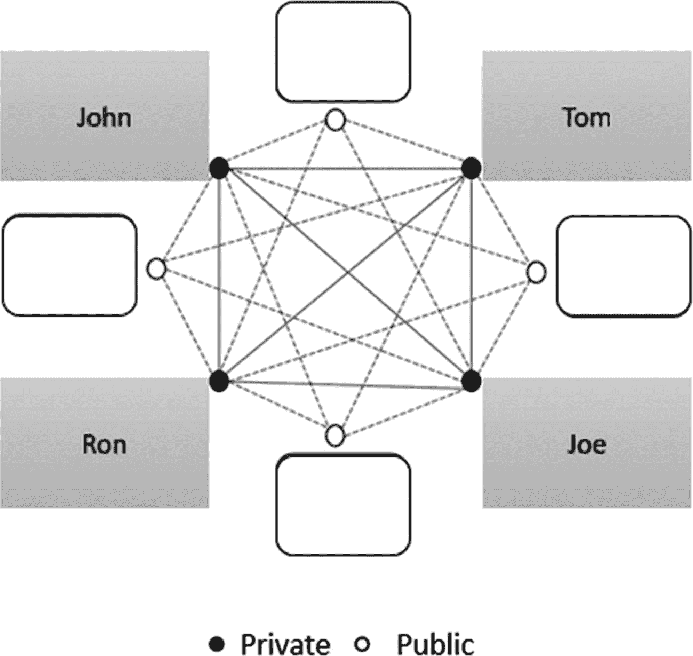

您的任务是为上述土地所有者登记用例填充混合链中的公共节点。

## 数据与交易 (Data and Transactions)

Xoroville 市已同意维护所有健康记录和医疗活动。您的工作是列出在公共链和私有链上发生的数据和交易。

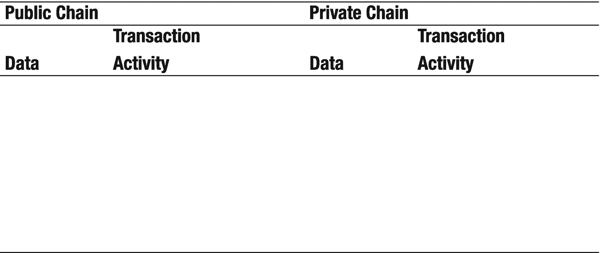

## 能源分配 (Energy Allocation)

一个拥有 25 家工厂的大型工厂内部的能源分配需要一条区块链来提供共享数据账本，以追踪电力需求。请使用本书提供的工具进行辩论，判断是否需要区块链。确定真正需要区块链的确切情况。

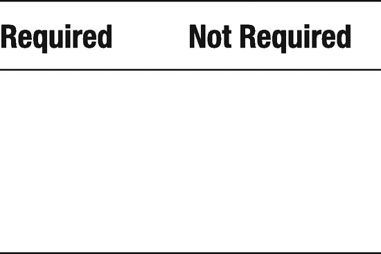

既然您已经确定了需要区块链的确切情况，请识别需要上链和下链的对等节点。

**注意：** 对等节点可以是最终用户，也可以不是。它们可以是用户、机器、传感器等。

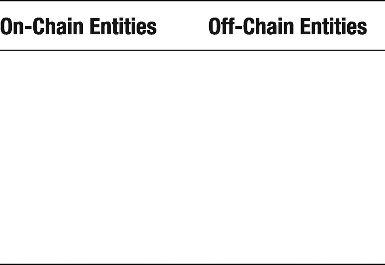

## 小工具 (Gadgets)

关于小工具的两个问题：
- 识别您周围需要达成共识才能工作的五个小工具。
- 识别化工工厂周围需要达成共识才能工作的五个小工具。